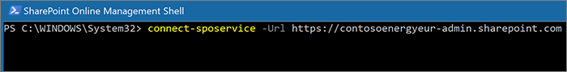

# Mover um site do OneDrive para um local geográfico diferenteMove a OneDrive site to a different geo location 

Com OneDrive movimento geo, você pode mover a localização OneDrive usuário para uma localização geográfica diferente.With OneDrive geo move, you can move a user's OneDrive to a different geo location. OneDrive a movimentação geográfica é realizada pelo administrador SharePoint Online ou pelo Microsoft 365 global.OneDrive geo move is performed by the SharePoint Online administrator or the Microsoft 365 global administrator. Antes de iniciar uma OneDrive geográfica, certifique-se de notificar o usuário cuja OneDrive está sendo movida e recomenda que ele feche todos os arquivos durante a movimentação.Before you start a OneDrive geo move, be sure to notify the user whose OneDrive is being moved and recommend they close all files for the duration of the move. (Se o usuário tiver um documento aberto usando o cliente Office durante a movimentação, depois de mover a conclusão, o documento precisará ser salvo no novo local.) A movimentação pode ser agendada para uma hora futura, se desejado.(If the user has a document open using the Office client during the move, then upon move completion the document will need to be saved to the new location.) The move can be scheduled for a future time, if desired.

O OneDrive usa o Azure Blob Armazenamento armazenar conteúdo.The OneDrive service uses Azure Blob Storage to store content. O Armazenamento blob associado ao OneDrive do usuário será movido da origem para a localização geográfica de destino dentro de 40 dias após o OneDrive de destino estar disponível para o usuário.The Storage blob associated with the user's OneDrive will be moved from the source to destination geo location within 40 days of destination OneDrive being available to the user. O acesso ao OneDrive do usuário será restaurado assim que o destino OneDrive disponível.The access to the user's OneDrive will be restored as soon as the destination OneDrive is available.

Durante a janela de movimentação geográfica do OneDrive (entre 2 e 6 horas), o OneDrive do usuário é definido como somente leitura. O usuário ainda pode acessar os arquivos pelo cliente de sincronização do OneDrive ou pelo site do OneDrive no SharePoint Online. Após a conclusão da movimentação geográfica do OneDrive, o usuário será automaticamente conectado ao seu OneDrive na localização geográfica destinada quando navegar para o OneDrive no inicializador de aplicativos do Microsoft 365. O cliente de sincronização começará automaticamente a sincronizar do novo local.During OneDrive geo move window (about 2-6 hours) the user's OneDrive is set to read-only. The user can still access their files via the OneDrive sync client or their OneDrive site in SharePoint Online. After OneDrive geo move is complete, the user will be automatically connected to their OneDrive at the destination geo location when they navigate to OneDrive in the Microsoft 365 app launcher. The sync client will automatically begin syncing from the new location.

Os procedimentos deste artigo exigem o [Módulo PowerShell do Microsoft SharePoint Online](https://www.microsoft.com/download/details.aspx?id=35588).The procedures in this article require the [Microsoft SharePoint Online PowerShell Module](https://www.microsoft.com/download/details.aspx?id=35588).

## Comunicação com seus usuáriosCommunicating to your users

Ao mover os sites do OneDrive entre locais geográficos, é importante comunicar aos seus usuários o que esperar. Isso pode ajudar a reduzir a confusão do usuário e chamadas para o suporte técnico. Envie um email para seus usuários antes de fazer as movimentações com as seguintes informações:When moving OneDrive sites between geo locations, it's important to communicate to your users what to expect. This can help reduce user confusion and calls to your help desk. Email your users before the move and let them know the following information:

- Quando a mudança deve começar e quanto tempo deve demorarWhen the move is expected to start and how long it is expected to take
- Para qual localização geográfica o OneDrive mudará, e qual é a URL para acessar o novo localWhat geo location their OneDrive is moving to, and the URL to access the new location
- Eles devem fechar os arquivos e não fazer edições durante a mudança.They should close their files and not make edits during the move.
- O compartilhamento e permissões de arquivo não mudarão devido a mudança.File permissions and sharing will not change as a result of the move.
- O que esperar da [experiência do usuário em um ambiente multigeográfico](multi-geo-user-experience.md)What to expect from the [user experience in a multi-geo environment](multi-geo-user-experience.md)

Após a conclusão da mudança, envie um email aos seus usuários informando que eles podem continuar a trabalhar com o OneDrive.Be sure to send your users an email when the move has successfully completed informing them that they can resume working in OneDrive.

## Agendar movimentações do site do OneDriveScheduling OneDrive site moves

Você pode agendar as movimentações de site do OneDrive com antecedência (conforme descrito posteriormente neste artigo). Recomendamos começar com um pequeno número de usuários para validar seus fluxos de trabalho e estratégias de comunicação. Quando você estiver familiarizado com o processo, poderá agendar as movimentações da seguinte maneira:You can schedule OneDrive site moves in advance (described later in this article). We recommend that you start with a small number of users to validate your workflows and communication strategies. Once you are comfortable with the process, you can schedule moves as follows:

- Você pode agendar até 4.000 movimentações por vez.You can schedule up to 4,000 moves at a time.
- Conforme a movimentação se inicia, você pode agendar mais, com no máximo 4.000 movimentações pendentes na fila e a qualquer momento.As the moves begin, you can schedule more, with a maximum of 4,000 pending moves in the queue and any given time.
- O tamanho máximo de um OneDrive que pode ser movido é de 1 terabyte (1 TB)The maximum size of a OneDrive that can be moved is 1 terabyte (1 TB).

## Mover um site do OneDriveMoving a OneDrive site

Para executar uma OneDrive geográfica, o administrador do locatário deve primeiro definir o PDL (Local de Dados Preferencial) do usuário para a localização geográfica apropriada.To perform a OneDrive geo move, the tenant administrator must first set the user's Preferred Data Location (PDL) to the appropriate geo location. Depois que o PDL for definido, aguarde pelo menos 24 horas para que a atualização PDL sincronize entre os locais geos antes de iniciar a OneDrive geográfica.Once the PDL is set, wait for at least 24 hours for the PDL update to sync across the geo locations before starting the OneDrive geo move.

Ao usar os cmdlets de movimentação geográfica, conecte-se ao Serviço SPO na localização geográfica atual do usuário OneDrive localização geográfica, usando a seguinte sintaxe:When using the geo move cmdlets, connect to SPO Service at the user's current OneDrive geo location, using the following syntax:

`Connect-SPOService -url https://<tenantName>-admin.sharepoint.com`

Por exemplo: para mover OneDrive do usuário 'Matt@contosoenergy.onmicrosoft.com', conecte-se ao centro de administração SharePoint euR como o OneDrive do usuário está na localização geográfica da EUR:For example: To move OneDrive of user 'Matt@contosoenergy.onmicrosoft.com', connect to EUR SharePoint Admin center as the user's OneDrive is in EUR geo location:

`Connect-SPOSservice -url https://contosoenergyeur-admin.sharepoint.com`

## Validar o ambienteValidating the environment

Antes de começar uma movimentação geográfica do OneDrive, recomendamos validar o ambiente.Before you start a OneDrive geo move, we recommend that you validate the environment.

Para garantir que todos os locais geográficos são compatíveis, execute:To ensure that all geo locations are compatible, run:

`Get-SPOGeoMoveCrossCompatibilityStatus`

Você verá uma lista da localização geográfica e se o conteúdo poder ser movido, será indicado como "Compatível".You will see a list of your geo locations and whether content can be moved between will be denoted as "Compatible". Se o comando retornar "Incompatível", repita a validação do status em uma data posterior.If the command returns "Incompatible" please retry validating the status at a later date.

Se OneDrive contiver um subsite, por exemplo, não pode ser movido.If a OneDrive contains a subsite, for example, it cannot be moved. Você pode usar o cmdlet Start-SPOUserAndContentMove com o parâmetro -ValidationOnly para validar se o OneDrive pode ser movido:You can use the Start-SPOUserAndContentMove cmdlet with the -ValidationOnly parameter to validate if the OneDrive is able to be moved:

`Start-SPOUserAndContentMove -UserPrincipalName <UPN> -DestinationDataLocation <DestinationDataLocation> -ValidationOnly`

Isso retornará Sucesso se o OneDrive estiver pronto para ser movido ou Falha se houver um bloqueio legal ou um subsite que impeça a movimentação. Após validar se o OneDrive está pronto para a movimentação, você pode iniciá-la.This will return Success if the OneDrive is ready to be moved or Fail if there is a legal hold or subsite that would prevent the move. Once you have validated that the OneDrive is ready to move, you can start the move.

## Iniciar uma movimentação geográfica do OneDriveStart a OneDrive geo move

Para iniciar a movimentação, execute:To start the move, run:  

`Start-SPOUserAndContentMove -UserPrincipalName <UserPrincipalName> -DestinationDataLocation <DestinationDataLocation>`

Usando estes parâmetros:Using these parameters:

-   _UserPrincipalName_ – UPN do usuário cujo OneDrive está sendo movido._UserPrincipalName_ – UPN of the user whose OneDrive is being moved.

-   _DestinationDataLocation_ – Geo-Location para onde o OneDrive precisa ser movido._DestinationDataLocation_ – Geo-Location where the OneDrive needs to be moved. Isso deve ser igual ao local de dados preferencial do usuário.This should be same as the user's preferred data location.

Por exemplo, para mover o OneDrive de carlos@contosoenergy.onmicrosoft.com de EUR para AUS, execute:For example, to move the OneDrive of matt@contosoenergy.onmicrosoft.com from EUR to AUS, run:

`Start-SPOUserAndContentMove -UserPrincipalName matt@contosoenergy.onmicrosoft.com -DestinationDataLocation AUS`

Para agendar uma movimentação geográfica posteriormente, use um dos seguintes parâmetros:To schedule a geo move for a later time, use one of the following parameters:

-   _PreferredMoveBeginDate_ – a movimentação provavelmente começará no horário especificado. A hora deve ser especificada como UTC (Tempo Universal Coordenado)._PreferredMoveBeginDate_ – The move will likely begin at this specified time. Time must be specified in Coordinated Universal Time (UTC).

-   _PreferredMoveEndDate_ – a movimentação provavelmente será concluída no horário especificado, conforme o melhor esforço. A hora deve ser especificada como UTC (Tempo Universal Coordenado)._PreferredMoveEndDate_ – The move will likely be completed by this specified time, on a best effort basis. Time must be specified in Coordinated Universal Time (UTC). 

## Cancelar uma movimentação geográfica do OneDriveCancel a OneDrive geo move 

Você pode interromper a movimentação geográfica da OneDrive de um usuário, desde que a movimentação não está em andamento ou concluída usando o cmdlet:You can stop the geo move of a user's OneDrive, provided the move is not in progress or completed by using the cmdlet:

`Stop-SPOUserAndContentMove – UserPrincipalName <UserPrincipalName>`

Em que _UserPrincipalName_ é o UPN do usuário cuja movimentação do OneDrive você deseja parar.Where _UserPrincipalName_ is the UPN of the user whose OneDrive move you want to stop.

## Determinar o status atualDetermining current status

Você pode verificar o status de um OneDrive geo mover para dentro ou para fora do geo ao que você está conectado usando o cmdlet Get-SPOUserAndContentMoveState.You can check the status of a OneDrive geo move in or out of the geo that you're connected to by using the Get-SPOUserAndContentMoveState cmdlet.

Os status de movimentação estão descritas na seguinte tabela:The move statuses are described in the following table.

<table>
<thead>
<tr class="header">
<th align="left"><strong>Status</strong><strong>Status</strong></th>
<th align="left"><strong>Descrição</strong><strong>Description</strong></th>
</tr>
</thead>
<tbody>
<tr class="odd">
<td align="left">NotStartedNotStarted</td>
<td align="left">Movimentação não iniciadas.The move has not started.</td>
</tr>
<tr class="even">
<td align="left">InProgress (<em>n</em>/4)InProgress (<em>n</em>/4)</td>
<td align="left">A movimentação está em andamento em um dos seguintes estados: Validação (1/4), Backup (2/4), Restauração (3 4), Limpeza (4/4).The move is in progress in one of the following states: Validation (1/4), Backup (2/4), Restore (3/4), Cleanup (4/4).</td>
</tr>
<tr class="odd">
<td align="left">ÊxitoSuccess</td>
<td align="left">A movimentação foi concluída com êxito.The move has completed successfully.</td>
</tr>
<tr class="even">
<td align="left">FalhouFailed</td>
<td align="left">Falha na movimentação.The move failed.</td>
</tr>
</tbody>
</table>

Para encontrar o status da movimentação de um usuário específico, use o parâmetro UserPrincipalName:To find the status of a specific user's move, use the UserPrincipalName parameter:

`Get-SPOUserAndContentMoveState -UserPrincipalName <UPN>`

Para localizar o status de todas as movimentações dentro ou fora da localização geográfica à qual você está conectado, use o parâmetro MoveState com um dos seguintes valores: NotStarted, InProgress, Success, Failed, All.To find the status of all of the moves in or out of the geo location that you're connected to, use the MoveState parameter with one of the following values: NotStarted, InProgress, Success, Failed, All.

`Get-SPOUserAndContentMoveState -MoveState <value>`

Você também pode adicionar o parâmetro `-Verbose` para obter descrições mais detalhadas do estado de movimentação.You can also add the `-Verbose` parameter for more verbose descriptions of the move state.

## Experiência do UsuárioUser Experience

Os usuários do OneDrive deverão enfrentar um mínimo de interrupção se o OneDrive for movido para uma localização geográfica diferente. Além de um breve estado somente leitura durante a movimentação, as permissões e os links existentes continuarão a funcionar como esperado quando a movimentação for concluída.Users of OneDrive should notice minimal disruption if their OneDrive is moved to a different geo location. Aside from a brief read-only state during the move, existing links and permissions will continue to work as expected once the move is completed.

### OneDrive for BusinessOneDrive for Business

Enquanto a movimentação está em andamento, o OneDrive do usuário está definido como somente leitura.While the move is in progress the user's OneDrive is set to read-only. Depois que a movimentação é concluída, o usuário é direcionado para seu OneDrive na nova localização geográfica quando navega para OneDrive o Microsoft 365 de aplicativos ou um navegador da Web.Once the move is completed, the user is directed to their OneDrive in the new geo location when they navigate to OneDrive the Microsoft 365 app launcher or a web browser.

### Permissões sobre o conteúdo do OneDrivePermissions on OneDrive content

Os usuários com permissões para OneDrive conteúdo continuarão a ter acesso ao conteúdo durante a movimentação e após a conclusão.Users with permissions to OneDrive content will continue to have access to the content during the move and after it's complete.

### Cliente de sincronização do OneDriveOneDrive Sync Client 

O cliente de sincronização do OneDrive detectará automaticamente e transferirá perfeitamente a sincronização para o novo local do OneDrive após a conclusão da movimentação geográfica do OneDrive. O usuário não precisa entrar novamente nem realizar outras ações. (Precisa da versão 17.3.6943.0625 ou posterior do cliente de sincronização.)The OneDrive sync client will automatically detect and seamlessly transfer syncing to the new OneDrive location once the OneDrive geo move is complete. The user does not need to sign-in again or take any other action.  (Version 17.3.6943.0625 or later of the sync client required.)

Se um usuário atualizar um arquivo enquanto a movimentação geográfica do OneDrive estiver em andamento, o cliente de sincronização o notificará de que uploads de arquivo estão pendentes enquanto a movimentação estiver em andamento.If a user updates a file while the OneDrive geo move is in progress, the sync client will notify them that file uploads are pending while the move is underway.

### Links de compartilhamentoSharing links 

Após a conclusão da movimentação geográfica do OneDrive, os links compartilhados existentes para os arquivos que foram movidos serão redirecionados automaticamente para a nova localização geográfica.Upon OneDrive geo move completion, the existing shared links for the files that were moved will automatically redirect to the new geo location.

### Experiência do OneNoteOneNote Experience 

O cliente do OneNote para win32 e o aplicativo UWP (Universal) detectarão automaticamente e sincronizarão perfeitamente os blocos de anotações com o novo local no OneDrive após a conclusão da movimentação geográfica do OneDrive. O usuário não precisa entrar novamente nem realizar outras ações. O único indicador visível para o usuário é que a sincronização de bloco de anotações falha quando a movimentação geográfica do OneDrive está em andamento. Essa experiência está disponível nas seguintes versões do cliente do OneNote:OneNote win32 client and UWP (Universal) App will automatically detect and seamlessly sync notebooks to the new OneDrive location once OneDrive geo move is complete. The user does not need to sign-in again or take any other action. The only visible indicator to the user is notebook sync would fail when OneDrive geo move is in progress. This experience is available on the following OneNote client versions:

-   OneNote win32 – versão 16.0.8326.2096 (e posteriores)OneNote win32 – Version 16.0.8326.2096 (and later)

-   OneNote UWP – versão 16.0.8431.1006 (e posteriores)OneNote UWP – Version 16.0.8431.1006 (and later)

-   Aplicativo móvel do OneNote – versão 16.0.8431.1011 (e posteriores)OneNote Mobile App – Version 16.0.8431.1011 (and later)

### Aplicativo de equipesTeams app

Após a conclusão da movimentação geográfica do OneDrive, os usuários terão acesso aos arquivos do OneDrive no aplicativo do Teams. Além disso, arquivos compartilhados por chat do Teams no OneDrive antes da movimentação geográfica continuarão funcionando após a movimentação ser concluída.Upon OneDrive geo move completion, users will have access to their OneDrive files on the Teams app. Additionally, files shared via Teams chat from their OneDrive prior to geo move will continue to work after move is complete.

### Aplicativo móvel do OneDrive for Business (iOS)OneDrive for Business Mobile App (iOS) 

Após a conclusão da movimentação geográfica do OneDrive, o usuário precisa sair e entrar novamente no aplicativo móvel do iOS para fazer a sincronização com o novo local do OneDrive.Upon OneDrive geo move completion, the user would need to sign out and sign in again on the iOS Mobile App to sync to the new OneDrive location.

### Grupos e sites seguidos existentesExisting followed groups and sites

Sites e grupos seguidos aparecerão no OneDrive do usuário, independentemente de sua localização geográfica.Followed sites and groups will show up in the user's OneDrive regardless of their geo location. Sites e grupos hospedados em outra localização geográfica serão abertos em uma guia separada.Sites and groups hosted in another geo location will open in a separate tab.

### Delve Atualizações de URL geográficaDelve Geo URL updates

Os usuários serão enviados para a Delve geográfica correspondente ao SEU PDL somente depois que seu OneDrive tiver sido movido para o novo geo.Users will be sent to the Delve geo corresponding to their PDL only after their OneDrive has been moved to the new geo.
