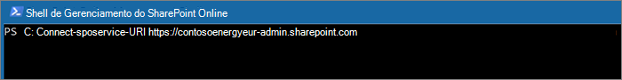
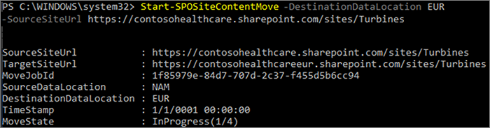

# <a name="move-a-sharepoint-site-to-a-different-geo-location"></a><span data-ttu-id="0f71c-103">Mover um site do SharePoint para uma localização geográfica diferente</span><span class="sxs-lookup"><span data-stu-id="0f71c-103">Move a SharePoint site to a different geo location</span></span>

<span data-ttu-id="0f71c-104">Com a mudança geográfica do site do SharePoint, é possível migrar os sites do SharePoint para outras localizações geográficas em seu ambiente multigeográfico.</span><span class="sxs-lookup"><span data-stu-id="0f71c-104">With SharePoint site geo move, you can move SharePoint sites to other geo locations within your multi-geo environment.</span></span>

<span data-ttu-id="0f71c-105">Os seguintes tipos de sites podem ser movidos entre a localizações geográficas:</span><span class="sxs-lookup"><span data-stu-id="0f71c-105">The following types of site can be moved between geo locations:</span></span>

- <span data-ttu-id="0f71c-106">Sites conectados ao grupo do Microsoft 365</span><span class="sxs-lookup"><span data-stu-id="0f71c-106">Microsoft 365 Group-connected sites</span></span>
- <span data-ttu-id="0f71c-107">Sites modernos sem uma associação com um Grupo do Microsoft 365</span><span class="sxs-lookup"><span data-stu-id="0f71c-107">Modern sites without a Microsoft 365 Group association</span></span>
- <span data-ttu-id="0f71c-108">Site Clássico do SharePoint</span><span class="sxs-lookup"><span data-stu-id="0f71c-108">Classic SharePoint sites</span></span>
- <span data-ttu-id="0f71c-109">Sites de comunicação</span><span class="sxs-lookup"><span data-stu-id="0f71c-109">Communication sites</span></span>

<span data-ttu-id="0f71c-110">Só um Administrador Global ou Administrador do SharePoint pode mover um site entre as localizações geográficas.</span><span class="sxs-lookup"><span data-stu-id="0f71c-110">You must be a Global Administrator or SharePoint Administrator to move a site between geo locations.</span></span>

<span data-ttu-id="0f71c-111">Há uma janela de somente leitura durante a mudança geográfica do site do SharePoint de aproximadamente 4 a 6 horas, dependendo do conteúdo do site.</span><span class="sxs-lookup"><span data-stu-id="0f71c-111">There is a read-only window during the SharePoint site geo move of approximately 4-6 hours, depending on site contents.</span></span>

## <a name="best-practices"></a><span data-ttu-id="0f71c-112">Práticas recomendadas</span><span class="sxs-lookup"><span data-stu-id="0f71c-112">Best practices</span></span>

- <span data-ttu-id="0f71c-113">Experimente uma movimentação do site do SharePoint em um site de teste para se familiarizar com o procedimento.</span><span class="sxs-lookup"><span data-stu-id="0f71c-113">Try a SharePoint site move on a test site to get familiar with the procedure.</span></span>
- <span data-ttu-id="0f71c-114">Valide se o site pode ser movido antes do agendamento ou ao realizar a movimentação.</span><span class="sxs-lookup"><span data-stu-id="0f71c-114">Validate whether the site can be moved prior to scheduling or performing the move.</span></span>
- <span data-ttu-id="0f71c-115">Quando possível agende as mudanças geográficas cruzadas dos sites fora do horário comercial para reduzir o impacto do usuário.</span><span class="sxs-lookup"><span data-stu-id="0f71c-115">When possible schedule cross-geo sites moves for outside business hours to reduce user impact.</span></span>
- <span data-ttu-id="0f71c-116">Comunique-se com os usuários afetados antes de mover sites.</span><span class="sxs-lookup"><span data-stu-id="0f71c-116">Communicate with impacted users prior to the sites move.</span></span>

## <a name="communicating-to-your-users"></a><span data-ttu-id="0f71c-117">Comunicação com os usuários</span><span class="sxs-lookup"><span data-stu-id="0f71c-117">Communicating to your users</span></span>

<span data-ttu-id="0f71c-118">Ao mover os sites do SharePoint entre locais geográficos, é importante informar os usuários de sites (geralmente qualquer pessoa com a capacidade de editar o site) o que esperar.</span><span class="sxs-lookup"><span data-stu-id="0f71c-118">When moving SharePoint sites between geo locations, it's important to communicate to the sites' users (generally anyone with the ability to edit the site) what to expect.</span></span> <span data-ttu-id="0f71c-119">Isso pode ajudar a reduzir a confusão do usuário e ligações para a assistência técnica.</span><span class="sxs-lookup"><span data-stu-id="0f71c-119">This can help reduce user confusion and calls to your help desk.</span></span> <span data-ttu-id="0f71c-120">Envie um email aos usuários dos sites antes de mover e deixe-os cientes do seguinte:</span><span class="sxs-lookup"><span data-stu-id="0f71c-120">Email your sites' users before the move and let them know the following information:</span></span>

- <span data-ttu-id="0f71c-121">Quando a mudança deve começar e quanto tempo deve demorar</span><span class="sxs-lookup"><span data-stu-id="0f71c-121">When the move is expected to start and how long it is expected to take</span></span>
- <span data-ttu-id="0f71c-122">Para qual localização geográfica o site mudará, e qual é a URL para acessar o novo local</span><span class="sxs-lookup"><span data-stu-id="0f71c-122">What geo location their site is moving to, and the URL to access the new location</span></span>
- <span data-ttu-id="0f71c-123">Eles devem fechar os arquivos e não fazer edições durante a mudança.</span><span class="sxs-lookup"><span data-stu-id="0f71c-123">They should close their files and not make edits during the move.</span></span>
- <span data-ttu-id="0f71c-124">O compartilhamento e permissões de arquivo não mudarão devido a mudança.</span><span class="sxs-lookup"><span data-stu-id="0f71c-124">File permissions and sharing will not change because of the move.</span></span>
- <span data-ttu-id="0f71c-125">O que esperar da experiência do usuário em um ambiente multigeográfico</span><span class="sxs-lookup"><span data-stu-id="0f71c-125">What to expect from the user experience in a multi-geo environment</span></span>

<span data-ttu-id="0f71c-126">Após a conclusão da mudança, envie um email aos seus usuários informando que eles podem continuar a trabalhar no seus sites.</span><span class="sxs-lookup"><span data-stu-id="0f71c-126">Be sure to send your sites' users an email when the move has successfully completed informing them that they can resume working on their sites.</span></span>

## <a name="scheduling-sharepoint-site-moves"></a><span data-ttu-id="0f71c-127">Agendamento de movimentações no site do SharePoint</span><span class="sxs-lookup"><span data-stu-id="0f71c-127">Scheduling SharePoint site moves</span></span>

<span data-ttu-id="0f71c-128">Você pode agendar a movimentação do site do SharePoint com antecedência (conforme descrito neste artigo).</span><span class="sxs-lookup"><span data-stu-id="0f71c-128">You can schedule SharePoint site moves in advance (described later in this article).</span></span> <span data-ttu-id="0f71c-129">Agende movimentações da seguinte maneira:</span><span class="sxs-lookup"><span data-stu-id="0f71c-129">You can schedule moves as follows:</span></span>

- <span data-ttu-id="0f71c-130">Você pode agendar até 4.000 movimentações por vez.</span><span class="sxs-lookup"><span data-stu-id="0f71c-130">You can schedule up to 4,000 moves at a time.</span></span>
- <span data-ttu-id="0f71c-131">Conforme a movimentação se inicia, você pode agendar mais, com no máximo 4.000 movimentações pendentes na fila e a qualquer momento.</span><span class="sxs-lookup"><span data-stu-id="0f71c-131">As the moves begin, you can schedule more, with a maximum of 4,000 pending moves in the queue and any given time.</span></span>

<span data-ttu-id="0f71c-132">Para agendar uma movimentação geográfica do site do SharePoint para o mais tarde, inclua um dos seguintes parâmetros ao começar a movimentação:</span><span class="sxs-lookup"><span data-stu-id="0f71c-132">To schedule a SharePoint site geo move for a later time, include one of the following parameters when you start the move:</span></span>

- <span data-ttu-id="0f71c-133">`PreferredMoveBeginDate` – A movimentação provavelmente começará no horário especificado.</span><span class="sxs-lookup"><span data-stu-id="0f71c-133">`PreferredMoveBeginDate` – The move will likely begin at this specified time.</span></span>
- <span data-ttu-id="0f71c-134">`PreferredMoveEndDate` – A movimentação provavelmente será concluída até o momento especificado, na base do melhor esforço.</span><span class="sxs-lookup"><span data-stu-id="0f71c-134">`PreferredMoveEndDate` – The move will likely be completed by this specified time, on a best effort basis.</span></span>

<span data-ttu-id="0f71c-135">A hora deve ser especificada no Tempo Universal Coordenado (UTC) para ambos os parâmetros.</span><span class="sxs-lookup"><span data-stu-id="0f71c-135">Time must be specified in Coordinated Universal Time (UTC) for both parameters.</span></span>

## <a name="moving-the-site"></a><span data-ttu-id="0f71c-136">Mover o site</span><span class="sxs-lookup"><span data-stu-id="0f71c-136">Moving the site</span></span>

<span data-ttu-id="0f71c-137">A movimentação geográfica do site do SharePoint requer que você se conecte e realize a movimentação da URL de Administrador do SharePoint na localização geográfica onde está o site.</span><span class="sxs-lookup"><span data-stu-id="0f71c-137">SharePoint site geo move requires that you connect and perform the move from the SharePoint Admin URL in the geo location where the site is.</span></span>

<span data-ttu-id="0f71c-138">Por exemplo, se a URL do site for <https://contosohealthcare.sharepoint.com/sites/Turbines> , conecte-se à URL SharePoint Admin em <https://contosohealthcare-admin.sharepoint.com> :</span><span class="sxs-lookup"><span data-stu-id="0f71c-138">For example, if the site URL is <https://contosohealthcare.sharepoint.com/sites/Turbines>, connect to the SharePoint Admin URL at <https://contosohealthcare-admin.sharepoint.com>:</span></span>

```powershell
Connect-SPOService -Url https://contosohealthcare-admin.sharepoint.com
```



### <a name="validating-the-environment"></a><span data-ttu-id="0f71c-140">Validar o ambiente</span><span class="sxs-lookup"><span data-stu-id="0f71c-140">Validating the environment</span></span>

<span data-ttu-id="0f71c-141">Recomendamos que antes de agendar a movimentação de qualquer site, execute a validação para garantir que o site possa ser movido.</span><span class="sxs-lookup"><span data-stu-id="0f71c-141">We recommend that before scheduling any site move, you perform a validation to ensure that the site can be moved.</span></span>

<span data-ttu-id="0f71c-142">Não há suporte para mover sites com:</span><span class="sxs-lookup"><span data-stu-id="0f71c-142">We do not support moving sites with:</span></span>

- <span data-ttu-id="0f71c-143">Serviços Corporativos de Conectividade</span><span class="sxs-lookup"><span data-stu-id="0f71c-143">Business Connectivity Services</span></span>
- <span data-ttu-id="0f71c-144">Formulários do InfoPath</span><span class="sxs-lookup"><span data-stu-id="0f71c-144">InfoPath forms</span></span>
- <span data-ttu-id="0f71c-145">Modelos do Gerenciamento de Direitos de Informação (IRM) aplicados</span><span class="sxs-lookup"><span data-stu-id="0f71c-145">Information Rights Management (IRM) templates applied</span></span>

<span data-ttu-id="0f71c-146">Para garantir que todas as localizações geográficas sejam compatíveis, execute `Get-SPOGeoMoveCrossCompatibilityStatus`.</span><span class="sxs-lookup"><span data-stu-id="0f71c-146">To ensure all geo locations are compatible, run `Get-SPOGeoMoveCrossCompatibilityStatus`.</span></span> <span data-ttu-id="0f71c-147">Isto exibirá seu local geográfico e se o ambiente é compatível com a localização geográfica de destino.</span><span class="sxs-lookup"><span data-stu-id="0f71c-147">This will display all your geo locations and whether the environment is compatible with the destination geo location.</span></span>

<span data-ttu-id="0f71c-148">Para realizar uma verificação de somente de validação no seu site, use `Start-SPOSiteContentMove` com o `-ValidationOnly` parâmetro para validar se o site pode ser movido.</span><span class="sxs-lookup"><span data-stu-id="0f71c-148">To perform a validation-only check on your site, use `Start-SPOSiteContentMove` with the `-ValidationOnly` parameter to validate if the site is able to be moved.</span></span> <span data-ttu-id="0f71c-149">Por exemplo:</span><span class="sxs-lookup"><span data-stu-id="0f71c-149">For example:</span></span>

```PowerShell
Start-SPOSiteContentMove -SourceSiteUrl <SourceSiteUrl> -ValidationOnly -DestinationDataLocation <DestinationLocation>
```

<span data-ttu-id="0f71c-150">Isso retornará *Sucesso* se o site está pronto para ser movido ou *Falha* se houver qualquer uma das condições de bloqueio.</span><span class="sxs-lookup"><span data-stu-id="0f71c-150">This will return *Success* if the site is ready to be moved or *Fail* if any of blocked conditions are present.</span></span>

### <a name="start-a-sharepoint-site-geo-move-for-a-site-with-no-associated-microsoft-365-group"></a><span data-ttu-id="0f71c-151">Iniciar a movimentação geográfica do site do SharePoint para um site sem grupo associado do Microsoft 365</span><span class="sxs-lookup"><span data-stu-id="0f71c-151">Start a SharePoint site geo move for a site with no associated Microsoft 365 Group</span></span>

<span data-ttu-id="0f71c-152">Por padrão, a URL inicial para o site será alterada para a URL da localização geográfica de destino.</span><span class="sxs-lookup"><span data-stu-id="0f71c-152">By default, initial URL for the site will change to the URL of the destination geo location.</span></span> <span data-ttu-id="0f71c-153">Por exemplo:</span><span class="sxs-lookup"><span data-stu-id="0f71c-153">For example:</span></span>

<span data-ttu-id="0f71c-154"><https://Contoso.sharepoint.com/sites/projectx> para <https://ContosoEUR.sharepoint.com/sites/projectx></span><span class="sxs-lookup"><span data-stu-id="0f71c-154"><https://Contoso.sharepoint.com/sites/projectx> to <https://ContosoEUR.sharepoint.com/sites/projectx></span></span>

<span data-ttu-id="0f71c-155">Para sites sem associação ao grupo do Microsoft 365, também é possível renomear o site usando o `-DestinationUrl` parâmetro.</span><span class="sxs-lookup"><span data-stu-id="0f71c-155">For sites with no Microsoft 365 Group association, you can also rename the site by using the `-DestinationUrl` parameter.</span></span> <span data-ttu-id="0f71c-156">Por exemplo:</span><span class="sxs-lookup"><span data-stu-id="0f71c-156">For example:</span></span>

<span data-ttu-id="0f71c-157"><https://Contoso.sharepoint.com/sites/projectx> para <https://ContosoEUR.sharepoint.com/sites/projecty></span><span class="sxs-lookup"><span data-stu-id="0f71c-157"><https://Contoso.sharepoint.com/sites/projectx> to <https://ContosoEUR.sharepoint.com/sites/projecty></span></span>

<span data-ttu-id="0f71c-158">Para começar a mover site, execute:</span><span class="sxs-lookup"><span data-stu-id="0f71c-158">To start the site move, run:</span></span>

```powershell
Start-SPOSiteContentMove -SourceSiteUrl <siteURL> -DestinationDataLocation <DestinationDataLocation> -DestinationUrl <DestinationSiteURL>
```



### <a name="start-a-sharepoint-site-geo-move-for-a-microsoft-365-group-connected-site"></a><span data-ttu-id="0f71c-160">Iniciar uma movimentação geográfica do site do SharePoint para um site conectado a um Grupo do Microsoft 365</span><span class="sxs-lookup"><span data-stu-id="0f71c-160">Start a SharePoint site geo move for a Microsoft 365 Group-connected site</span></span>

<span data-ttu-id="0f71c-161">Para mover um site conectado a um Grupo do Office 365, o administrador global ou administrador do SharePoint devem, primeiro, alterar o atributo Local e Data Preferenciais (PDL) do grupo do Office 365.</span><span class="sxs-lookup"><span data-stu-id="0f71c-161">To move an Office 365 Group-connected site, the Global Administrator or SharePoint Administrator must first change the Preferred Data Location (PDL) attribute for the Office 365 Group.</span></span>

<span data-ttu-id="0f71c-162">Para configurar o PDL de um Grupo do Microsoft 365:</span><span class="sxs-lookup"><span data-stu-id="0f71c-162">To set the PDL for a Microsoft 365 Group:</span></span>

```PowerShell
Set-SPOUnifiedGroup -PreferredDataLocation <PDL> -GroupAlias <GroupAlias>
Get-SPOUnifiedGroup -GroupAlias <GroupAlias>
```

<span data-ttu-id="0f71c-163">Depois de atualizar o PDL, você pode começar a mover site:</span><span class="sxs-lookup"><span data-stu-id="0f71c-163">Once you have updated the PDL, you can start the site move:</span></span>

```PowerShell
Start-SPOUnifiedGroupMove -GroupAlias <GroupAlias> -DestinationDataLocation <DestinationDataLocation>
```

## <a name="cancel-a-sharepoint-site-geo-move"></a><span data-ttu-id="0f71c-164">Cancelar uma movimentação geográfica do site do SharePoint</span><span class="sxs-lookup"><span data-stu-id="0f71c-164">Cancel a SharePoint site geo move</span></span>

<span data-ttu-id="0f71c-165">Você pode parar a movimentação geográfica do site do SharePoint, desde que a movimentação não esteja em andamento ou tenha sido concluída, usando o `Stop-SPOSiteContentMove` cmdlet.</span><span class="sxs-lookup"><span data-stu-id="0f71c-165">You can stop a SharePoint site geo move, provided the move is not in progress or completed by using the `Stop-SPOSiteContentMove` cmdlet.</span></span>

## <a name="determining-the-status-of-a-sharepoint-site-geo-move"></a><span data-ttu-id="0f71c-166">Determinar o status de uma movimentação geográfica do site do SharePoint</span><span class="sxs-lookup"><span data-stu-id="0f71c-166">Determining the status of a SharePoint site geo move</span></span>

<span data-ttu-id="0f71c-167">Você pode determinar o status da movimentação de um site fora da área geográfica conectada usando os seguintes cmdlets:</span><span class="sxs-lookup"><span data-stu-id="0f71c-167">You can determine the status of a site move in our out of the geo that you are connected to by using the following cmdlets:</span></span>

- <span data-ttu-id="0f71c-168">[Get-SPOSiteContentMoveState](/powershell/module/sharepoint-online/get-spositecontentmovestate) (sites não conectado a um Grupo)</span><span class="sxs-lookup"><span data-stu-id="0f71c-168">[Get-SPOSiteContentMoveState](/powershell/module/sharepoint-online/get-spositecontentmovestate) (non-Group-connected sites)</span></span>
- <span data-ttu-id="0f71c-169">[Get-SPOUnifiedGroupMoveState](/powershell/module/sharepoint-online/get-spounifiedgroupmovestate) (sites conectados a grupos)</span><span class="sxs-lookup"><span data-stu-id="0f71c-169">[Get-SPOUnifiedGroupMoveState](/powershell/module/sharepoint-online/get-spounifiedgroupmovestate) (Group-connected sites)</span></span>

<span data-ttu-id="0f71c-170">Use o `-SourceSiteUrl` parâmetro para especificar o site que você deseja ver o status de movimentação.</span><span class="sxs-lookup"><span data-stu-id="0f71c-170">Use the `-SourceSiteUrl` parameter to specify the site for which you want to see move status.</span></span>

<span data-ttu-id="0f71c-171">Os status de movimentação estão descritas na seguinte tabela.</span><span class="sxs-lookup"><span data-stu-id="0f71c-171">The move statuses are described in the following table.</span></span>

****

|<span data-ttu-id="0f71c-172">Status</span><span class="sxs-lookup"><span data-stu-id="0f71c-172">Status</span></span>|<span data-ttu-id="0f71c-173">Descrição</span><span class="sxs-lookup"><span data-stu-id="0f71c-173">Description</span></span>|
|---|---|
|<span data-ttu-id="0f71c-174">Pronto para Disparar</span><span class="sxs-lookup"><span data-stu-id="0f71c-174">Ready to Trigger</span></span>|<span data-ttu-id="0f71c-175">Movimentação não iniciada.</span><span class="sxs-lookup"><span data-stu-id="0f71c-175">The move has not started.</span></span>|
|<span data-ttu-id="0f71c-176">Agendada</span><span class="sxs-lookup"><span data-stu-id="0f71c-176">Scheduled</span></span>|<span data-ttu-id="0f71c-177">A movimentação está na fila, mas ainda não foi iniciada.</span><span class="sxs-lookup"><span data-stu-id="0f71c-177">The move is in queue but has not yet started.</span></span>|
|<span data-ttu-id="0f71c-178">InProgress (n/4)</span><span class="sxs-lookup"><span data-stu-id="0f71c-178">InProgress (n/4)</span></span>|<span data-ttu-id="0f71c-179">A movimentação está em andamento em um dos seguintes estados: Validação (1/4), Backup (2/4), Restauração (3 4), Limpeza (4/4).</span><span class="sxs-lookup"><span data-stu-id="0f71c-179">The move is in progress in one of the following states: Validation (1/4), Backup (2/4), Restore (3/4), Cleanup (4/4).</span></span>|
|<span data-ttu-id="0f71c-180">Êxito</span><span class="sxs-lookup"><span data-stu-id="0f71c-180">Success</span></span>|<span data-ttu-id="0f71c-181">A movimentação foi concluída com êxito.</span><span class="sxs-lookup"><span data-stu-id="0f71c-181">The move has completed successfully.</span></span>|
|<span data-ttu-id="0f71c-182">Falhou</span><span class="sxs-lookup"><span data-stu-id="0f71c-182">Failed</span></span>|<span data-ttu-id="0f71c-183">Falha na movimentação.</span><span class="sxs-lookup"><span data-stu-id="0f71c-183">The move failed.</span></span>|
|

<span data-ttu-id="0f71c-184">Você também pode aplicar a opção `-Verbose` para ver informações adicionais sobre a movimentação.</span><span class="sxs-lookup"><span data-stu-id="0f71c-184">You can also apply the `-Verbose` option to see additional information about the move.</span></span>

## <a name="user-experience"></a><span data-ttu-id="0f71c-185">Experiência do usuário</span><span class="sxs-lookup"><span data-stu-id="0f71c-185">User experience</span></span>

<span data-ttu-id="0f71c-186">Os usuários do site devem observar um mínimo de interrupção quando o site for movido para uma localização geográfica diferente.</span><span class="sxs-lookup"><span data-stu-id="0f71c-186">Site users should notice minimal disruption when their site is moved to a different geo location.</span></span> <span data-ttu-id="0f71c-187">Além de um breve estado somente leitura durante a mudança, permissões e links existentes continuarão a funcionar como esperado quando a movimentação for concluída.</span><span class="sxs-lookup"><span data-stu-id="0f71c-187">Aside from a brief read-only state during the move, existing links and permissions will continue to work as expected once the move is completed.</span></span>

### <a name="site"></a><span data-ttu-id="0f71c-188">Site</span><span class="sxs-lookup"><span data-stu-id="0f71c-188">Site</span></span>

<span data-ttu-id="0f71c-189">Enquanto a movimentação estiver em andamento o site é definido como somente leitura.</span><span class="sxs-lookup"><span data-stu-id="0f71c-189">While the move is in progress the site is set to read-only.</span></span> <span data-ttu-id="0f71c-190">Quando a movimentação estiver concluída, o usuário é direcionado para o novo site na nova localização geográfica ao clicar em indicadores ou outros links para o site.</span><span class="sxs-lookup"><span data-stu-id="0f71c-190">Once the move is completed, the user is directed to the new site in the new geo location when they click on bookmarks or other links to the site.</span></span>

### <a name="permissions"></a><span data-ttu-id="0f71c-191">Permissões</span><span class="sxs-lookup"><span data-stu-id="0f71c-191">Permissions</span></span>

<span data-ttu-id="0f71c-192">Os usuários com permissões para o site continuarão a ter acesso ao site durante a movimentação e após sua conclusão.</span><span class="sxs-lookup"><span data-stu-id="0f71c-192">Users with permissions to site will continue to have access to the site during the move and after it's complete.</span></span>

### <a name="sync-client"></a><span data-ttu-id="0f71c-193">Cliente Sync</span><span class="sxs-lookup"><span data-stu-id="0f71c-193">Sync Client</span></span>

<span data-ttu-id="0f71c-194">O cliente de sincronização detectará automaticamente e transferirá a sincronização para a nova localização do site assim que a movimentação do site for concluída.</span><span class="sxs-lookup"><span data-stu-id="0f71c-194">The sync client will automatically detect and seamlessly transfer syncing to the new site location once the site move is complete.</span></span> <span data-ttu-id="0f71c-195">O usuário não precisa entrar novamente ou realizar outras ações.</span><span class="sxs-lookup"><span data-stu-id="0f71c-195">The user does not need to sign in again or take any other action.</span></span> <span data-ttu-id="0f71c-196">(Uma Versão 17.3.6943.0625 ou posterior do cliente de sincronização é necessária.)</span><span class="sxs-lookup"><span data-stu-id="0f71c-196">(Version 17.3.6943.0625 or later of the sync client required.)</span></span>

<span data-ttu-id="0f71c-197">Se um usuário atualizar um arquivo enquanto a movimentação geográfica estiver em andamento, o cliente de sincronização o notificará de que uploads de arquivo estão pendentes enquanto a movimentação estiver em andamento.</span><span class="sxs-lookup"><span data-stu-id="0f71c-197">If a user updates a file while the move is in progress, the sync client will notify them that file uploads are pending while the move is underway.</span></span>

### <a name="sharing-links"></a><span data-ttu-id="0f71c-198">Links de compartilhamento</span><span class="sxs-lookup"><span data-stu-id="0f71c-198">Sharing links</span></span>

<span data-ttu-id="0f71c-199">Quando a movimentação geográfica for concluída, os links compartilhados existentes para os arquivos que foram movidos serão redirecionados automaticamente para a nova localização geográfica.</span><span class="sxs-lookup"><span data-stu-id="0f71c-199">When the SharePoint site geo move completes, the existing shared links for the files that were moved will automatically redirect to the new geo location.</span></span>

### <a name="most-recently-used-files-in-office-mru"></a><span data-ttu-id="0f71c-200">Arquivos Usados Recentemente do Office (MRU)</span><span class="sxs-lookup"><span data-stu-id="0f71c-200">Most Recently Used files in Office (MRU)</span></span>

<span data-ttu-id="0f71c-201">O serviço MRU é atualizado com a url do site e suas URLs de conteúdo depois que a movimentação for concluída.</span><span class="sxs-lookup"><span data-stu-id="0f71c-201">The MRU service is updated with the site url and its content URLs once the move completes.</span></span> <span data-ttu-id="0f71c-202">Isso se aplica ao Word, Excel e PowerPoint.</span><span class="sxs-lookup"><span data-stu-id="0f71c-202">This applies to Word, Excel, and PowerPoint.</span></span>

### <a name="onenote-experience"></a><span data-ttu-id="0f71c-203">Experiência do OneNote</span><span class="sxs-lookup"><span data-stu-id="0f71c-203">OneNote experience</span></span>

<span data-ttu-id="0f71c-204">O cliente OneNote win32 e o Aplicativo (Universal) UWP detectarão automaticamente e sincronizarão perfeitamente blocos de anotações à nova localização do site após a movimentação ser concluída.</span><span class="sxs-lookup"><span data-stu-id="0f71c-204">OneNote win32 client and UWP (Universal) App will automatically detect and seamlessly sync notebooks to the new site location once site move is complete.</span></span> <span data-ttu-id="0f71c-205">O usuário não precisa entrar novamente ou realizar outras ações.</span><span class="sxs-lookup"><span data-stu-id="0f71c-205">The user does not need to sign in again or take any other action.</span></span> <span data-ttu-id="0f71c-206">O único indicador visível para o usuário é a sincronização do bloco de anotações que deve falhar quando a movimentação do site estiver em andamento.</span><span class="sxs-lookup"><span data-stu-id="0f71c-206">The only visible indicator to the user is notebook sync would fail when site move is in progress.</span></span> <span data-ttu-id="0f71c-207">Essa experiência está disponível nas seguintes versões de cliente do OneNote:</span><span class="sxs-lookup"><span data-stu-id="0f71c-207">This experience is available on the following OneNote client versions:</span></span>

- <span data-ttu-id="0f71c-208">OneNote win32 – versão 16.0.8326.2096 (e posteriores)</span><span class="sxs-lookup"><span data-stu-id="0f71c-208">OneNote win32 – Version 16.0.8326.2096 (and later)</span></span>
- <span data-ttu-id="0f71c-209">OneNote UWP – versão 16.0.8431.1006 (e posteriores)</span><span class="sxs-lookup"><span data-stu-id="0f71c-209">OneNote UWP – Version 16.0.8431.1006 (and later)</span></span>
- <span data-ttu-id="0f71c-210">Aplicativo móvel do OneNote – versão 16.0.8431.1011 (e posteriores)</span><span class="sxs-lookup"><span data-stu-id="0f71c-210">OneNote Mobile App – Version 16.0.8431.1011 (and later)</span></span>

### <a name="teams-applicable-to-microsoft-365-group-connected-sites"></a><span data-ttu-id="0f71c-211">Teams (aplicáveis aos sites conectados a um grupo do Microsoft 365)</span><span class="sxs-lookup"><span data-stu-id="0f71c-211">Teams (applicable to Microsoft 365 Group connected sites)</span></span>

<span data-ttu-id="0f71c-212">Quando a movimentação geográfica do site do SharePoint estiver concluída, os usuários terão acesso aos seus arquivos de sites do grupo do Microsoft 365 no aplicativo do Teams.</span><span class="sxs-lookup"><span data-stu-id="0f71c-212">When the SharePoint site geo move completes, users will have access to their Microsoft 365 Group site files on the Teams app.</span></span> <span data-ttu-id="0f71c-213">Além disso, os arquivos compartilhados por chats do Teams pelo seu site antes da movimentação geográfica continuarão a funcionar quando a movimentação for concluída.</span><span class="sxs-lookup"><span data-stu-id="0f71c-213">Additionally, files shared via Teams chat from their site prior to geo move will continue to work after move is complete.</span></span>

### <a name="sharepoint-mobile-app-iosandroid"></a><span data-ttu-id="0f71c-214">Aplicativo Móvel do SharePoint (iOS/Android)</span><span class="sxs-lookup"><span data-stu-id="0f71c-214">SharePoint Mobile App (iOS/Android)</span></span>

<span data-ttu-id="0f71c-215">O aplicativo móvel do SharePoint é compatível com área geográfica cruzada e poderá detectar a nova localização geográfica do site.</span><span class="sxs-lookup"><span data-stu-id="0f71c-215">The SharePoint Mobile App is cross geo compatible and able to detect the site's new geo location.</span></span>

### <a name="sharepoint-workflows"></a><span data-ttu-id="0f71c-216">Fluxos de trabalho do SharePoint</span><span class="sxs-lookup"><span data-stu-id="0f71c-216">SharePoint workflows</span></span>

<span data-ttu-id="0f71c-217">Os fluxos de trabalho do SharePoint 2013 precisam ser republicados após a movimentação do site.</span><span class="sxs-lookup"><span data-stu-id="0f71c-217">SharePoint 2013 workflows need to be republished after the site move.</span></span> <span data-ttu-id="0f71c-218">Os fluxos de trabalho do SharePoint 2010 continuam funcionando normalmente.</span><span class="sxs-lookup"><span data-stu-id="0f71c-218">SharePoint 2010 workflows should continue to function normally.</span></span>

### <a name="apps"></a><span data-ttu-id="0f71c-219">Aplicativos</span><span class="sxs-lookup"><span data-stu-id="0f71c-219">Apps</span></span>

<span data-ttu-id="0f71c-220">Se estiver movendo um site com os aplicativos, é preciso reinstalar o aplicativo no novo local de geográfico do site, visto que o aplicativo e suas conexões podem não estar disponíveis na localização geográfica do destino.</span><span class="sxs-lookup"><span data-stu-id="0f71c-220">If you are moving a site with apps, you must re-instantiate the app in the site's new geo location as the app and its connections may not be available in the destination geo location.</span></span>

### <a name="flow"></a><span data-ttu-id="0f71c-221">Fluxo</span><span class="sxs-lookup"><span data-stu-id="0f71c-221">Flow</span></span>

<span data-ttu-id="0f71c-222">Na maioria dos casos os fluxos continuarão a funcionar após a mivimentação geográfica do site do SharePoint.</span><span class="sxs-lookup"><span data-stu-id="0f71c-222">In most cases Flows will continue to work after a SharePoint site geo move.</span></span> <span data-ttu-id="0f71c-223">É recomendável testá-los depois que a movimentação for concluída.</span><span class="sxs-lookup"><span data-stu-id="0f71c-223">We recommend that you test them once the move has completed.</span></span>

### <a name="powerapps"></a><span data-ttu-id="0f71c-224">PowerApps</span><span class="sxs-lookup"><span data-stu-id="0f71c-224">PowerApps</span></span>

<span data-ttu-id="0f71c-225">PowerApps precisam ser recriados no local de destino.</span><span class="sxs-lookup"><span data-stu-id="0f71c-225">PowerApps need to be recreated in the destination location.</span></span>

### <a name="data-movement-between-geo-locations"></a><span data-ttu-id="0f71c-226">Movimentação de dados entre localizações geográficas</span><span class="sxs-lookup"><span data-stu-id="0f71c-226">Data movement between geo locations</span></span>

<span data-ttu-id="0f71c-227">O SharePoint usa o armazenamento de BLOBs do Azure para o seu conteúdo, enquanto os metadados associado a sites e os arquivos são armazenados no SharePoint.</span><span class="sxs-lookup"><span data-stu-id="0f71c-227">SharePoint uses Azure Blob storage for its content, while the metadata associated with sites and its files is stored within SharePoint.</span></span> <span data-ttu-id="0f71c-228">Depois de site ser movimentado da sua localização geográfica de origem para sua localização geográfica de destino, o serviço também moverá seu armazenamento BLOB associado.</span><span class="sxs-lookup"><span data-stu-id="0f71c-228">After the site is moved from its source geo location to its destination geo location, the service will also move its associated Blob Storage.</span></span> <span data-ttu-id="0f71c-229">O Armazenamento BLOB move-se completamente em aproximadamente 40 dias.</span><span class="sxs-lookup"><span data-stu-id="0f71c-229">Blob Storage moves complete in approximately 40 days.</span></span>