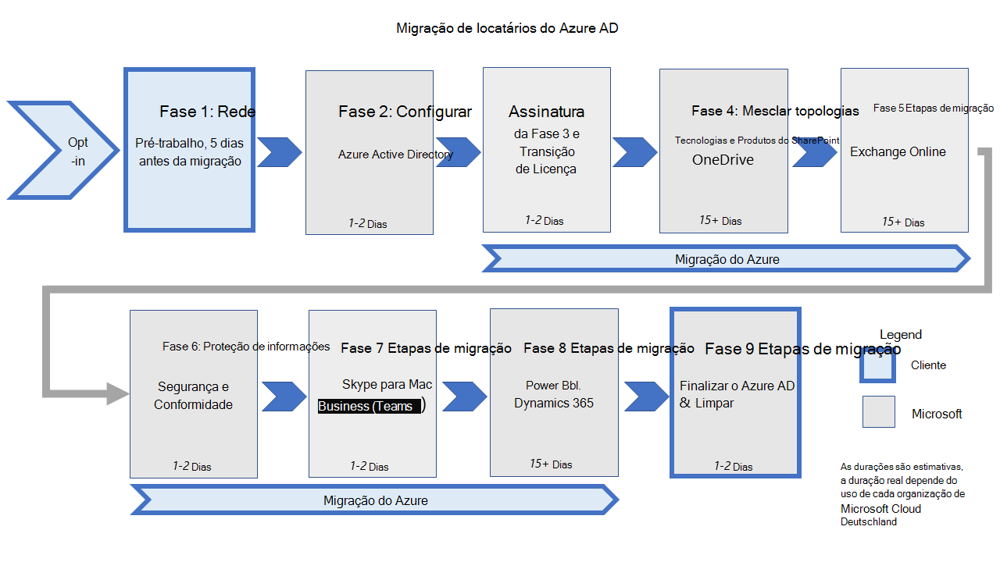

# <a name="migration-phases-actions-and-impacts-for-the-migration-from-microsoft-cloud-deutschland"></a><span data-ttu-id="35240-103">Ações e impactos de fases de migração para a migração do Microsoft Cloud Deutschland</span><span class="sxs-lookup"><span data-stu-id="35240-103">Migration phases actions and impacts for the migration from Microsoft Cloud Deutschland</span></span>

<span data-ttu-id="35240-104">As migrações de locatários do Microsoft Cloud Deutschland (MCD) para a região "Alemanha" dos serviços globais Office 365 da Microsoft são executadas como um conjunto de fases e suas ações configuradas para cada carga de trabalho.</span><span class="sxs-lookup"><span data-stu-id="35240-104">Tenant migrations from Microsoft Cloud Deutschland (MCD) to the region "Germany" of Microsoft's Office 365 Global services are executed as a set of phases and their configured actions for each workload.</span></span> <span data-ttu-id="35240-105">Esta figura mostra as dez fases de migração para os novos datacenters alemães.</span><span class="sxs-lookup"><span data-stu-id="35240-105">This figure shows the ten phases of migration to the new German datacenters.</span></span>

<span data-ttu-id="35240-106">[](../media/ms-cloud-germany-migration-opt-in/migration-organization.png#lightbox)</span><span class="sxs-lookup"><span data-stu-id="35240-106">[  ](../media/ms-cloud-germany-migration-opt-in/migration-organization.png#lightbox)</span></span>

<span data-ttu-id="35240-107">O processo de migração será concluído ao longo de muitas semanas, dependendo do tamanho geral e da complexidade da organização.</span><span class="sxs-lookup"><span data-stu-id="35240-107">The migration process will complete over many weeks depending on the overall size and complexity of the organization.</span></span> <span data-ttu-id="35240-108">Enquanto a migração está em andamento, os usuários e administradores podem continuar utilizando os serviços com alterações notáveis detalhadas nesta documentação.</span><span class="sxs-lookup"><span data-stu-id="35240-108">While the migration is underway, users and administrators are able to continue utilizing the services with notable changes detailed in this documentation.</span></span> <span data-ttu-id="35240-109">O gráfico e a tabela definem fases e etapas durante a migração.</span><span class="sxs-lookup"><span data-stu-id="35240-109">The graphic and table define phases and steps during the migration.</span></span>

> [!NOTE]
> <span data-ttu-id="35240-110">A migração dos serviços do Azure não faz parte desta documentação.</span><span class="sxs-lookup"><span data-stu-id="35240-110">The migration of Azure services is not part of this documentation.</span></span> <span data-ttu-id="35240-111">Para saber mais, confira [Diretrizes de migração para o Azure Germany](/azure/germany/germany-migration-main).</span><span class="sxs-lookup"><span data-stu-id="35240-111">For that information, see [Migration guidance for Azure Germany](/azure/germany/germany-migration-main).</span></span>

|<span data-ttu-id="35240-112">Etapa</span><span class="sxs-lookup"><span data-stu-id="35240-112">Step</span></span>|<span data-ttu-id="35240-113">Duration</span><span class="sxs-lookup"><span data-stu-id="35240-113">Duration</span></span>|<span data-ttu-id="35240-114">Responsável</span><span class="sxs-lookup"><span data-stu-id="35240-114">Responsible party</span></span>|<span data-ttu-id="35240-115">Descrição</span><span class="sxs-lookup"><span data-stu-id="35240-115">Description</span></span>|
|:--------|:--------|:--------|:--------|
|<span data-ttu-id="35240-116">Opt-In</span><span class="sxs-lookup"><span data-stu-id="35240-116">Opt-In</span></span>|<span data-ttu-id="35240-117">Horas</span><span class="sxs-lookup"><span data-stu-id="35240-117">Hours</span></span>|<span data-ttu-id="35240-118">Cliente</span><span class="sxs-lookup"><span data-stu-id="35240-118">Customer</span></span>|<span data-ttu-id="35240-119">Opte pela sua organização na migração.</span><span class="sxs-lookup"><span data-stu-id="35240-119">Opt your organization into the migration.</span></span>|
|<span data-ttu-id="35240-120">Pré-trabalho</span><span class="sxs-lookup"><span data-stu-id="35240-120">Pre-Work</span></span>|<span data-ttu-id="35240-121">Days</span><span class="sxs-lookup"><span data-stu-id="35240-121">Days</span></span>|<span data-ttu-id="35240-122">Cliente</span><span class="sxs-lookup"><span data-stu-id="35240-122">Customer</span></span>|<span data-ttu-id="35240-123">Conclua o trabalho necessário para preparar usuários, estações de trabalho e rede para migração.</span><span class="sxs-lookup"><span data-stu-id="35240-123">Complete the work needed to prepare users, workstations, and network for migration.</span></span>|
|<span data-ttu-id="35240-124">Azure Active Directory (Azure AD)</span><span class="sxs-lookup"><span data-stu-id="35240-124">Azure Active Directory (Azure AD)</span></span>|<span data-ttu-id="35240-125">1 a 2 dias</span><span class="sxs-lookup"><span data-stu-id="35240-125">1-2 days</span></span>|<span data-ttu-id="35240-126">Microsoft</span><span class="sxs-lookup"><span data-stu-id="35240-126">Microsoft</span></span>|<span data-ttu-id="35240-127">Migrar a organização do Azure AD para todo o mundo.</span><span class="sxs-lookup"><span data-stu-id="35240-127">Migrate Azure AD organization to worldwide.</span></span>|
|<span data-ttu-id="35240-128">Azure</span><span class="sxs-lookup"><span data-stu-id="35240-128">Azure</span></span>|<span data-ttu-id="35240-129">Semanas</span><span class="sxs-lookup"><span data-stu-id="35240-129">Weeks</span></span>|<span data-ttu-id="35240-130">Cliente</span><span class="sxs-lookup"><span data-stu-id="35240-130">Customer</span></span>|<span data-ttu-id="35240-131">Criar novas assinaturas do Azure em todo o mundo e [fazer a transição dos serviços do Azure.](/azure/azure-resource-manager/management/move-resource-group-and-subscription)</span><span class="sxs-lookup"><span data-stu-id="35240-131">Create new worldwide Azure subscriptions and [transition Azure services](/azure/azure-resource-manager/management/move-resource-group-and-subscription).</span></span>|
|<span data-ttu-id="35240-132">Transição de licença & assinatura</span><span class="sxs-lookup"><span data-stu-id="35240-132">Subscription & License Transition</span></span>|<span data-ttu-id="35240-133">1 a 2 dias</span><span class="sxs-lookup"><span data-stu-id="35240-133">1-2 days</span></span>|<span data-ttu-id="35240-134">Microsoft</span><span class="sxs-lookup"><span data-stu-id="35240-134">Microsoft</span></span>|<span data-ttu-id="35240-135">Compre assinaturas em todo o mundo, cancele assinaturas do Microsoft Cloud Deutschland e licenças de usuário de transição.</span><span class="sxs-lookup"><span data-stu-id="35240-135">Purchase worldwide subscriptions, cancel Microsoft Cloud Deutschland subscriptions, and transition user licenses.</span></span>|
|<span data-ttu-id="35240-136">SharePoint e OneDrive</span><span class="sxs-lookup"><span data-stu-id="35240-136">SharePoint and OneDrive</span></span>|<span data-ttu-id="35240-137">Mais de 15 dias</span><span class="sxs-lookup"><span data-stu-id="35240-137">15+ days</span></span>|<span data-ttu-id="35240-138">Microsoft</span><span class="sxs-lookup"><span data-stu-id="35240-138">Microsoft</span></span>|<span data-ttu-id="35240-139">Migre SharePoint e OneDrive for Business conteúdo, persistindo sharepoint.de URLs.</span><span class="sxs-lookup"><span data-stu-id="35240-139">Migrate SharePoint and OneDrive for Business content, persisting sharepoint.de URLs.</span></span>|
|<span data-ttu-id="35240-140">Exchange Online</span><span class="sxs-lookup"><span data-stu-id="35240-140">Exchange Online</span></span>|<span data-ttu-id="35240-141">Mais de 15 dias</span><span class="sxs-lookup"><span data-stu-id="35240-141">15+ days</span></span>|<span data-ttu-id="35240-142">Microsoft</span><span class="sxs-lookup"><span data-stu-id="35240-142">Microsoft</span></span>|<span data-ttu-id="35240-143">Migrar Exchange Online conteúdo e fazer a transição para URLs em todo o mundo.</span><span class="sxs-lookup"><span data-stu-id="35240-143">Migrate Exchange Online content and transition to worldwide URLs.</span></span>|
|<span data-ttu-id="35240-144">Conformidade e Segurança</span><span class="sxs-lookup"><span data-stu-id="35240-144">Security & Compliance</span></span>|<span data-ttu-id="35240-145">1 a 2 dias</span><span class="sxs-lookup"><span data-stu-id="35240-145">1-2 days</span></span>|<span data-ttu-id="35240-146">Microsoft</span><span class="sxs-lookup"><span data-stu-id="35240-146">Microsoft</span></span>|<span data-ttu-id="35240-147">Transição de & de conformidade e conteúdo.</span><span class="sxs-lookup"><span data-stu-id="35240-147">Transition security & compliance policies and content.</span></span>|
|<span data-ttu-id="35240-148">Skype for Business</span><span class="sxs-lookup"><span data-stu-id="35240-148">Skype for Business</span></span>|<span data-ttu-id="35240-149">1 a 2 dias</span><span class="sxs-lookup"><span data-stu-id="35240-149">1-2 days</span></span>|<span data-ttu-id="35240-150">Microsoft</span><span class="sxs-lookup"><span data-stu-id="35240-150">Microsoft</span></span>|<span data-ttu-id="35240-151">Transição de Skype for Business para Microsoft Teams.</span><span class="sxs-lookup"><span data-stu-id="35240-151">Transition from Skype for Business to Microsoft Teams.</span></span>|
|<span data-ttu-id="35240-152">Power BI & Dynamics 365</span><span class="sxs-lookup"><span data-stu-id="35240-152">Power BI & Dynamics 365</span></span>|<span data-ttu-id="35240-153">Mais de 15 dias</span><span class="sxs-lookup"><span data-stu-id="35240-153">15+ days</span></span>|<span data-ttu-id="35240-154">Microsoft</span><span class="sxs-lookup"><span data-stu-id="35240-154">Microsoft</span></span>|<span data-ttu-id="35240-155">Migre Power BI conteúdo do Dynamics 365.</span><span class="sxs-lookup"><span data-stu-id="35240-155">Migrate Power BI and Dynamics 365 content.</span></span>|
|<span data-ttu-id="35240-156">Finalizar o Azure AD</span><span class="sxs-lookup"><span data-stu-id="35240-156">Finalize Azure AD</span></span>|<span data-ttu-id="35240-157">1 a 2 dias</span><span class="sxs-lookup"><span data-stu-id="35240-157">1-2 days</span></span>|<span data-ttu-id="35240-158">Microsoft</span><span class="sxs-lookup"><span data-stu-id="35240-158">Microsoft</span></span>|<span data-ttu-id="35240-159">Concluir a recortamento de locatários para todo o mundo.</span><span class="sxs-lookup"><span data-stu-id="35240-159">Complete tenant cutover to worldwide.</span></span>|
|<span data-ttu-id="35240-160">Clean-Up</span><span class="sxs-lookup"><span data-stu-id="35240-160">Clean-Up</span></span>|<span data-ttu-id="35240-161">1 a 2 dias</span><span class="sxs-lookup"><span data-stu-id="35240-161">1-2 days</span></span>|<span data-ttu-id="35240-162">Cliente</span><span class="sxs-lookup"><span data-stu-id="35240-162">Customer</span></span>|<span data-ttu-id="35240-163">Limpe as conexões herdadas com o Microsoft Cloud Deutschland, como os Serviços de Federação do Active Directory (AD FS) Confiança de Parte Confiável, O Azure AD Conexão e Office cliente é reiniciado.</span><span class="sxs-lookup"><span data-stu-id="35240-163">Clean up legacy connections to Microsoft Cloud Deutschland, such as Active Directory Federation Services (AD FS) Relying Party Trust, Azure AD Connect, and Office client restarts.</span></span>|
|<span data-ttu-id="35240-164">Pontos de extremidade desabilitados</span><span class="sxs-lookup"><span data-stu-id="35240-164">Endpoints Disabled</span></span>|<span data-ttu-id="35240-165">30 dias</span><span class="sxs-lookup"><span data-stu-id="35240-165">30 days</span></span>|<span data-ttu-id="35240-166">Microsoft</span><span class="sxs-lookup"><span data-stu-id="35240-166">Microsoft</span></span>|<span data-ttu-id="35240-167">30 dias após a finalização do Azure AD, o serviço do Microsoft Cloud Deutschland Azure AD interromperá o acesso ao ponto de extremidade para a organização em transição.</span><span class="sxs-lookup"><span data-stu-id="35240-167">30 days after the finalization of Azure AD, the Microsoft Cloud Deutschland Azure AD service will stop endpoint access for the transitioned organization.</span></span> <span data-ttu-id="35240-168">As solicitações de ponto de extremidade, como Autenticação, falharão deste ponto em diante em relação ao serviço Microsoft Cloud Deutschland.</span><span class="sxs-lookup"><span data-stu-id="35240-168">Endpoint requests such as Authentication will fail from this point forward against the Microsoft Cloud Deutschland service.</span></span> |


<span data-ttu-id="35240-169">As fases e suas ações garantem que dados críticos e experiências sejam migrados para os serviços Office 365 Global.</span><span class="sxs-lookup"><span data-stu-id="35240-169">The phases and their actions ensure that critical data and experiences are migrated to the Office 365 Global services.</span></span> <span data-ttu-id="35240-170">Depois que o locatário for adicionado à fila de migração, cada carga de trabalho será concluída como um conjunto de etapas executadas no serviço de back-end.</span><span class="sxs-lookup"><span data-stu-id="35240-170">After your tenant is added to the migration queue, each workload will be completed as a set of steps that are executed on the backend service.</span></span> <span data-ttu-id="35240-171">Algumas cargas de trabalho podem exigir ações do administrador (ou do usuário) ou a migração pode afetar o uso das fases executadas e discutidas em Como a migração [é organizada?](ms-cloud-germany-transition.md#how-is-the-migration-organized)</span><span class="sxs-lookup"><span data-stu-id="35240-171">Some workloads may require actions by the administrator (or user), or the migration may affect usage for the phases that are executed and discussed in [How is the migration organized?](ms-cloud-germany-transition.md#how-is-the-migration-organized)</span></span>

<span data-ttu-id="35240-172">As seções a seguir contêm ações e efeitos para cargas de trabalho à medida que elas passam por várias fases da migração.</span><span class="sxs-lookup"><span data-stu-id="35240-172">The following sections contain actions and effects for workloads as they progress through various phases of the migration.</span></span> <span data-ttu-id="35240-173">Revise as tabelas e determine quais ações ou efeitos são aplicáveis à sua organização.</span><span class="sxs-lookup"><span data-stu-id="35240-173">Review the tables and determine which actions or effects are applicable to your organization.</span></span> <span data-ttu-id="35240-174">Verifique se você está preparado para executar as etapas nas respectivas fases, conforme necessário.</span><span class="sxs-lookup"><span data-stu-id="35240-174">Ensure that you're prepared to execute the steps in the respective phases as required.</span></span> <span data-ttu-id="35240-175">A falha ao concluir as etapas necessárias pode resultar em interrupção do serviço e pode atrasar a conclusão da migração para os serviços Office 365 serviços.</span><span class="sxs-lookup"><span data-stu-id="35240-175">Failure to complete necessary steps may result in service outage and might delay completion of the migration to the Office 365 services.</span></span>

## <a name="phase-opt-in"></a><span data-ttu-id="35240-176">Fase: Opt-In</span><span class="sxs-lookup"><span data-stu-id="35240-176">Phase: Opt-In</span></span>

<span data-ttu-id="35240-177">**Aplica-se** a : Todos os clientes com um locatário Office 365 hospedado no Microsoft Cloud Deutschland (MCD) A Microsoft não pode migrar Office 365 locatários hospedados no MCD sem consentimento.</span><span class="sxs-lookup"><span data-stu-id="35240-177">**Applies to**: All customers with an Office 365 tenant hosted in the Microsoft Cloud Deutschland (MCD) Microsoft can't migrate Office 365 tenants hosted in the MCD without consent.</span></span>

| <span data-ttu-id="35240-178">Step(s)</span><span class="sxs-lookup"><span data-stu-id="35240-178">Step(s)</span></span> | <span data-ttu-id="35240-179">Descrição</span><span class="sxs-lookup"><span data-stu-id="35240-179">Description</span></span> | <span data-ttu-id="35240-180">Impacto</span><span class="sxs-lookup"><span data-stu-id="35240-180">Impact</span></span> |
|:-------|:-----|:-------|
|<span data-ttu-id="35240-181">**Tarefa do cliente**: conceder consentimento para migração</span><span class="sxs-lookup"><span data-stu-id="35240-181">**Customer Task**: Grant consent for migration</span></span>| <span data-ttu-id="35240-182">O cliente concede consentimento para a migração para que a Microsoft obtém o direito de migrar e de orquestrar a transição de dados e serviços para a instância de serviços Office 365 Global.</span><span class="sxs-lookup"><span data-stu-id="35240-182">Customer grants consent for the migration so that Microsoft gains the right to migrate and to orchestrate the transition of data and services to the Office 365 Global services instance.</span></span> <span data-ttu-id="35240-183">Há duas maneiras</span><span class="sxs-lookup"><span data-stu-id="35240-183">There are two ways</span></span> <ol><li><span data-ttu-id="35240-184">O Office 365 de locatários opta pela migração orientada pela Microsoft.</span><span class="sxs-lookup"><span data-stu-id="35240-184">The Office 365 tenant administrator opts-in to the Microsoft-driven migration.</span></span> </li><li> <span data-ttu-id="35240-185">Os clientes renovaram quaisquer assinaturas em seus locatários mcd Office 365 1º de maio de 2020.</span><span class="sxs-lookup"><span data-stu-id="35240-185">Customers has renewed any subscriptions in their MCD Office 365 tenant after May 1, 2020.</span></span> <span data-ttu-id="35240-186">A Microsoft notifica esses clientes sobre o direito de migração a cada mês, espera 30 dias para dar aos clientes a chance de cancelar e, em seguida, optar diretamente.</span><span class="sxs-lookup"><span data-stu-id="35240-186">Microsoft notify these customers of the migration right each month, wait 30 days to give customers a chance to cancel, and then directly opt-in.</span></span></li></ol> | <ul><li><span data-ttu-id="35240-187">O locatário é marcado como consentido para migração, e o Centro de Administração exibe a confirmação.</span><span class="sxs-lookup"><span data-stu-id="35240-187">Tenant is marked as consented for migration, and Admin Center displays confirmation.</span></span> </li><li><span data-ttu-id="35240-188">O reconhecimento é postado no Centro de Mensagens Office 365 locatário.</span><span class="sxs-lookup"><span data-stu-id="35240-188">Acknowledgment is posted to the Office 365 tenant Message Center.</span></span> <span data-ttu-id="35240-189">A configuração do serviço continua dos pontos de extremidade do Microsoft Cloud Deutschland.</span><span class="sxs-lookup"><span data-stu-id="35240-189">Service configuration continues from Microsoft Cloud Deutschland endpoints.</span></span> </li><li> </li></ul>
|<span data-ttu-id="35240-190">**Administrador de Locatários**: Monitorar mensagens</span><span class="sxs-lookup"><span data-stu-id="35240-190">**Tenant Admin**: Monitor messages</span></span>|<span data-ttu-id="35240-191">O administrador de locatários deve monitorar Office 365 Central de Mensagens para atualizações sobre o status da fase de migração a partir deste momento.</span><span class="sxs-lookup"><span data-stu-id="35240-191">The tenant administrator must monitor the Office 365 Message Center for updates on the migration phase status from this time on.</span></span>|<span data-ttu-id="35240-192">O cliente pode executar as tarefas necessárias a tempo.</span><span class="sxs-lookup"><span data-stu-id="35240-192">Customer can execute necessary tasks in time.</span></span>
||||

## <a name="phase-1-before-the-migration-starts"></a><span data-ttu-id="35240-193">Fase 1: antes da migração começar</span><span class="sxs-lookup"><span data-stu-id="35240-193">Phase 1: Before the migration starts</span></span>

<span data-ttu-id="35240-194">Certifique-se de que você está familiarizado com as etapas de preparação de [migração que se aplicam a todos os clientes](ms-cloud-germany-transition-add-pre-work.md).</span><span class="sxs-lookup"><span data-stu-id="35240-194">Make sure that you are familiar with the [migration preparation steps that apply to all customers](ms-cloud-germany-transition-add-pre-work.md).</span></span>

<span data-ttu-id="35240-195">Caso você tenha definido um CNAME DNS chamado _msoid_ em um ou muitos namespaces DNS que você possui, você precisa remover o CNAME até o final da fase 8 no máximo.</span><span class="sxs-lookup"><span data-stu-id="35240-195">In case you have set a DNS CNAME called _msoid_ in one or many DNS namespaces that you own, you have to remove the CNAME until the end of phase 8 at the latest.</span></span> <span data-ttu-id="35240-196">Você pode remover o _msoid_ CNAME a qualquer momento antes do final da fase 8.</span><span class="sxs-lookup"><span data-stu-id="35240-196">You can remove the CNAME _msoid_ any time before the end of phase 8.</span></span> <span data-ttu-id="35240-197">Consulte o [pré-trabalho para DNS](ms-cloud-germany-transition-add-pre-work.md#dns-entries-for-custom-domains).</span><span class="sxs-lookup"><span data-stu-id="35240-197">See the [prework for DNS](ms-cloud-germany-transition-add-pre-work.md#dns-entries-for-custom-domains).</span></span>

<span data-ttu-id="35240-198">No caso de você estar usando o login único para Office 365 e o Azure na instância do Microsoft Cloud Deutschland, você deve preparar e agendar sua migração de assinatura do Azure de acordo.</span><span class="sxs-lookup"><span data-stu-id="35240-198">In case you are using single sign on for Office 365 and Azure in the Microsoft Cloud Deutschland instance, you must prepare and schedule your Azure subscription migration accordingly.</span></span> <span data-ttu-id="35240-199">Certifique-se de entender o [pré-trabalho para Microsoft Azure](ms-cloud-germany-transition-add-pre-work.md#microsoft-azure).</span><span class="sxs-lookup"><span data-stu-id="35240-199">Make sure that you understand the [prework for Microsoft Azure](ms-cloud-germany-transition-add-pre-work.md#microsoft-azure).</span></span>

### <a name="azure-ad-connect-with-ad-fs-federation"></a><span data-ttu-id="35240-200">Azure AD Conexão com federação do AD FS</span><span class="sxs-lookup"><span data-stu-id="35240-200">Azure AD Connect with AD FS federation</span></span>
<span data-ttu-id="35240-201">**Aplica-se a**: Clientes com federação do AD FS</span><span class="sxs-lookup"><span data-stu-id="35240-201">**Applies to**: Customers with AD FS federation</span></span>

<span data-ttu-id="35240-202">**Quando aplicado:** antes da fase 2 ser iniciada</span><span class="sxs-lookup"><span data-stu-id="35240-202">**When applied**: Before phase 2 starts</span></span>

<span data-ttu-id="35240-203">Se você estiver usando os Serviços de Federação do Active Directory (AD FS), certifique-se de fazer o back  up de sua configuração [do ADFS](ms-cloud-germany-transition-add-adfs.md) antes e depois de adicionar a confiança de parte confiável para o serviço global Office 365 antes do início da fase 2.</span><span class="sxs-lookup"><span data-stu-id="35240-203">If you are using Active Directory Federation Services (AD FS), make sure to [back up your ADFS configuration before and after adding the relying party trust](ms-cloud-germany-transition-add-adfs.md) for the Office 365 Global service **before** the beginning of phase 2.</span></span>

## <a name="phase-2-azure-ad-migration"></a><span data-ttu-id="35240-204">Fase 2: Migração do Azure AD</span><span class="sxs-lookup"><span data-stu-id="35240-204">Phase 2: Azure AD Migration</span></span>
<span data-ttu-id="35240-205">Nesta fase, o Azure Active Directory será migrado para a nova região do datacenter e se tornará ativo.</span><span class="sxs-lookup"><span data-stu-id="35240-205">In this phase the Azure Active Directory will be migrated to the new datacenter region and become active.</span></span> <span data-ttu-id="35240-206">Os pontos de extremidade antigos do Azure AD ainda estarão disponíveis.</span><span class="sxs-lookup"><span data-stu-id="35240-206">The old Azure AD endpoints will be still available.</span></span>

### <a name="exchange-online-hybrid---modify-authserver-on-premises"></a><span data-ttu-id="35240-207">Exchange Online Híbrido - Modificar o AuthServer local</span><span class="sxs-lookup"><span data-stu-id="35240-207">Exchange Online Hybrid - Modify AuthServer on-premises</span></span>
<span data-ttu-id="35240-208">**Aplica-se a:** Todos os clientes que usam uma configuração Exchange híbrida ativa com Exchange servidores locais</span><span class="sxs-lookup"><span data-stu-id="35240-208">**Applies to:** All customers using an active Exchange Hybrid Configuration with Exchange servers on-premises</span></span>

<span data-ttu-id="35240-209">**Quando aplicado :** após o final da fase 2</span><span class="sxs-lookup"><span data-stu-id="35240-209">**When applied**: After phase 2 ends</span></span>

<span data-ttu-id="35240-210">O AuthServer local deve estar apontando para STS (Serviço de Token de Segurança) global para autenticação após a conclusão da migração do Azure AD.</span><span class="sxs-lookup"><span data-stu-id="35240-210">The AuthServer on-premises must be pointing to global Security Token Service (STS) for authentication after Azure AD migration is complete.</span></span>
<span data-ttu-id="35240-211">Isso garante que as solicitações de autenticação para solicitações de Exchange de disponibilidade de usuários em estado de migração destinados ao ambiente local híbrido sejam autenticadas para acessar o serviço local.</span><span class="sxs-lookup"><span data-stu-id="35240-211">This ensures that authentication requests for Exchange availability requests from users in migration state that target the hybrid on-premises environment are authenticated to access the on-premises service.</span></span> <span data-ttu-id="35240-212">Da mesma forma, isso garantirá a autenticação de solicitações do local para Office 365 pontos de extremidade de serviços globais.</span><span class="sxs-lookup"><span data-stu-id="35240-212">Similarly, this will ensure authentication of requests from on-premises to Office 365 Global services endpoints.</span></span> <span data-ttu-id="35240-213">Depois que a migração do Azure AD (fase 2) for concluída, o administrador da topologia local Exchange (híbrida) deverá adicionar um novo ponto de extremidade do serviço de autenticação para os serviços Office 365 Global.</span><span class="sxs-lookup"><span data-stu-id="35240-213">After Azure AD migration (phase 2) is complete, the administrator of the on-premises Exchange (hybrid) topology must add a new authentication service endpoint for the Office 365 Global services.</span></span> <span data-ttu-id="35240-214">Com este comando do Exchange PowerShell, substitua pela ID de locatário da sua organização encontrada no `<TenantID>` portal do Azure no Azure Active Directory.</span><span class="sxs-lookup"><span data-stu-id="35240-214">With this command from Exchange PowerShell, replace `<TenantID>` with your organization's tenant ID found in the Azure portal on Azure Active Directory.</span></span>

```powershell
New-AuthServer GlobalMicrosoftSts -AuthMetadataUrl https://accounts.accesscontrol.windows.net/<TenantID>/metadata/json/1
```

<span data-ttu-id="35240-215">A falha na conclusão dessa tarefa pode resultar em solicitações híbridas de ocupado livre que não fornecem informações para usuários de caixa de correio que foram migrados do Microsoft Cloud Deutschland para serviços Office 365.</span><span class="sxs-lookup"><span data-stu-id="35240-215">Failing to complete this task may result in hybrid free-busy requests failing to provide information for mailbox users who have been migrated from Microsoft Cloud Deutschland to Office 365 services.</span></span>

## <a name="phase-3-subscription-transfer"></a><span data-ttu-id="35240-216">Fase 3: Transferência de assinatura</span><span class="sxs-lookup"><span data-stu-id="35240-216">Phase 3: Subscription transfer</span></span>

<span data-ttu-id="35240-217">**Aplica-se** a : todos os clientes com um locatário Office 365 hospedado no Microsoft Cloud Deutschland (MCD)</span><span class="sxs-lookup"><span data-stu-id="35240-217">**Applies to**: All customers with an Office 365 tenant hosted in the Microsoft Cloud Deutschland (MCD)</span></span>

<span data-ttu-id="35240-218">Os locatários do Microsoft Cloud Deutschland parceiros não serão migrados.</span><span class="sxs-lookup"><span data-stu-id="35240-218">Partner Microsoft Cloud Deutschland tenants won't be migrated.</span></span> <span data-ttu-id="35240-219">Os clientes CSP serão migrados para serviços Office 365 sob o novo locatário de serviços Office 365 do mesmo parceiro.</span><span class="sxs-lookup"><span data-stu-id="35240-219">CSP customers will be migrated to Office 365 services under the new Office 365 services tenant of the same partner.</span></span> <span data-ttu-id="35240-220">Após a migração do cliente, o parceiro pode gerenciar esse cliente somente a partir do locatário Office 365 serviços.</span><span class="sxs-lookup"><span data-stu-id="35240-220">After customer migration, the partner can manage this customer only from the Office 365 services tenant.</span></span>

| <span data-ttu-id="35240-221">Step(s)</span><span class="sxs-lookup"><span data-stu-id="35240-221">Step(s)</span></span> | <span data-ttu-id="35240-222">Descrição</span><span class="sxs-lookup"><span data-stu-id="35240-222">Description</span></span> | <span data-ttu-id="35240-223">Impacto</span><span class="sxs-lookup"><span data-stu-id="35240-223">Impact</span></span> |
|:-------|:-------|:-------|
| <span data-ttu-id="35240-224">Assinaturas são transferidas</span><span class="sxs-lookup"><span data-stu-id="35240-224">Subscriptions are transferred</span></span>| <span data-ttu-id="35240-225">A assinatura do Microsoft Cloud Deutschland será migrada para a assinatura correspondente Office 365 serviços Globais.</span><span class="sxs-lookup"><span data-stu-id="35240-225">The Microsoft Cloud Deutschland subscription will be migrated to corresponding Office 365 Global services subscription.</span></span> <ul><li><span data-ttu-id="35240-226">A Office 365 de serviços globais dessa assinatura é definida pela Microsoft (também conhecida como mapeamento _de oferta)._</span><span class="sxs-lookup"><span data-stu-id="35240-226">The Office 365 Global services offer of that subscription is defined by Microsoft (also known as _Offer mapping_).</span></span></li><li> <span data-ttu-id="35240-227">As assinaturas Office 365 serviços globais correspondentes são compradas na instância Office 365 Global para as assinaturas transferidas do Microsoft Cloud Deutschland.</span><span class="sxs-lookup"><span data-stu-id="35240-227">Corresponding Office 365 Global services subscriptions are purchased in the Office 365 Global instance for the transferred Microsoft Cloud Deutschland subscriptions.</span></span></li><li><span data-ttu-id="35240-228">As assinaturas herdada do Microsoft Cloud Deutschland são removidas do locatário de serviços Office 365 após a conclusão.</span><span class="sxs-lookup"><span data-stu-id="35240-228">Legacy Microsoft Cloud Deutschland subscriptions are removed from the Office 365 services tenant on completion.</span></span></li></ul>| <ul><li><span data-ttu-id="35240-229">As alterações nas assinaturas existentes serão bloqueadas (por exemplo, nenhuma nova compra de assinatura ou alterações na contagem de assentos) durante essa fase.</span><span class="sxs-lookup"><span data-stu-id="35240-229">Changes to existing subscriptions will be blocked (for example, no new subscription purchases or seat count changes) during this phase.</span></span></li><li><span data-ttu-id="35240-230">As alterações de atribuição de licença serão bloqueadas.</span><span class="sxs-lookup"><span data-stu-id="35240-230">License assignment changes will be blocked.</span></span></li><li><span data-ttu-id="35240-231">Quando a migração de assinatura for concluída, tanto os serviços Office 365 quanto as assinaturas do Microsoft Cloud Deutschland estarão visíveis no Portal de Administração do Office 365, com o status das assinaturas do Microsoft Cloud Deutschland como _desprovisionadas_.</span><span class="sxs-lookup"><span data-stu-id="35240-231">When subscription migration is complete, both Office 365 services and Microsoft Cloud Deutschland subscriptions will be visible in the Office 365 Admin Portal, with the status of Microsoft Cloud Deutschland subscriptions as _deprovisioned_.</span></span> </li><li><span data-ttu-id="35240-232">Todos os processos do cliente que tenham dependências de assinaturas do Microsoft Cloud Deutschland ou GUIDs SKU serão desfeitos e precisarão ser revisados com a oferta de serviços Office 365 serviços.</span><span class="sxs-lookup"><span data-stu-id="35240-232">Any customer processes that have dependencies on Microsoft Cloud Deutschland subscriptions or SKU GUIDs will be broken and need to be revised with the Office 365 services offering.</span></span> </li><li><span data-ttu-id="35240-233">As novas assinaturas nos serviços Office 365 serão compradas com o novo termo (mensal/trimestral/anual) e o cliente receberá um reembolso prorável para o saldo não usado da assinatura do Microsoft Cloud Deutschland.</span><span class="sxs-lookup"><span data-stu-id="35240-233">New subscriptions in the Office 365 services will be purchased with the new term (monthly/quarterly/yearly), and the customer will receive a prorated refund for the unused balance of the Microsoft Cloud Deutschland subscription.</span></span> </li></ul> |
|<span data-ttu-id="35240-234">As licenças são reatribuídas</span><span class="sxs-lookup"><span data-stu-id="35240-234">Licenses are reassigned</span></span>|<span data-ttu-id="35240-235">Os usuários com licenças do Microsoft Cloud Deutschland atribuídas receberão licenças na instância Office 365 Global.</span><span class="sxs-lookup"><span data-stu-id="35240-235">Users with assigned Microsoft Cloud Deutschland licenses will be assigned licenses in the Office 365 Global instance.</span></span>|<ul><li><span data-ttu-id="35240-236">Os usuários serão reatribuídos licenças vinculadas às novas assinaturas Office 365 serviços.</span><span class="sxs-lookup"><span data-stu-id="35240-236">Users will be reassigned licenses that are tied to the new Office 365 services subscriptions.</span></span> <span data-ttu-id="35240-237">As licenças de usuário de todos os usuários serão atribuídas automaticamente aos novos recursos.</span><span class="sxs-lookup"><span data-stu-id="35240-237">User licenses of all users will be automatically assigned to the new features.</span></span></li><li><span data-ttu-id="35240-238">O número de recursos (planos de serviço) oferecidos pelos serviços Office 365 pode ser maior do que na oferta original do Microsoft Cloud Deutschland.</span><span class="sxs-lookup"><span data-stu-id="35240-238">The number of features (service plans) offered by Office 365 services can be larger than in the original Microsoft Cloud Deutschland offer.</span></span> <span data-ttu-id="35240-239">As licenças de usuário Office 365 serviços serão atribuídas equivalentemente a recursos semelhantes do Microsoft Cloud Deutschland (planos de serviço).</span><span class="sxs-lookup"><span data-stu-id="35240-239">User licenses in Office 365 services will be equivalently assigned to similar Microsoft Cloud Deutschland features (service plans).</span></span> </li></ul> 
|<span data-ttu-id="35240-240">**Tarefa de administrador** Desabilitar recursos</span><span class="sxs-lookup"><span data-stu-id="35240-240">**Admin task** Disable features</span></span>|<span data-ttu-id="35240-241">O administrador precisa tomar uma ação explícita para desabilitar esses recursos, se necessário.</span><span class="sxs-lookup"><span data-stu-id="35240-241">The admin needs to take an explicit action to disable those features, if needed.</span></span> |<ul><li><span data-ttu-id="35240-242">Os usuários veem novos serviços desconhecidos no portal</span><span class="sxs-lookup"><span data-stu-id="35240-242">Users see new unknown services in the portal</span></span></li><li><span data-ttu-id="35240-243">A funcionalidade adicional está disponível (por exemplo, Microsoft Planner e Microsoft Flow), a menos que seja desabilitada pelo administrador de locatários. Para obter informações sobre como desabilitar planos de serviço atribuídos às licenças dos usuários, consulte Disable access to Microsoft 365 services while [assigning user licenses](disable-access-to-services-while-assigning-user-licenses.md).</span><span class="sxs-lookup"><span data-stu-id="35240-243">Additional functionality is available (for example, Microsoft Planner and Microsoft Flow), unless disabled by tenant admin. For information about how to disable service plans that are assigned to users' licenses, see [Disable access to Microsoft 365 services while assigning user licenses](disable-access-to-services-while-assigning-user-licenses.md).</span></span></li></ul>
|<span data-ttu-id="35240-244">**Tarefa de administrador**</span><span class="sxs-lookup"><span data-stu-id="35240-244">**Admin task**</span></span>|<span data-ttu-id="35240-245">Revise todos os processos do cliente que tenham dependências de assinaturas do Microsoft Cloud Deutschland ou guids SKU com a oferta Office 365 serviços de Office 365 do Microsoft Cloud</span><span class="sxs-lookup"><span data-stu-id="35240-245">Revise any customer processes that have dependencies on Microsoft Cloud Deutschland subscriptions or SKU GUIDs with the Office 365 services offering</span></span>|<span data-ttu-id="35240-246">Os processos do cliente continuam a funcionar.</span><span class="sxs-lookup"><span data-stu-id="35240-246">Customer processes continue to work.</span></span>
||||

<span data-ttu-id="35240-247">**Aplica-se a**: Parceiros microsoft que estão usando o Office 365 Partner Portal</span><span class="sxs-lookup"><span data-stu-id="35240-247">**Applies to**: Microsoft Partners which are using the Office 365 Partner Portal</span></span>

<span data-ttu-id="35240-248">Entre a Fase 2 e a fase 3, o Partner Portal pode não estar acessível.</span><span class="sxs-lookup"><span data-stu-id="35240-248">Between Phase 2 and phase 3, Partner Portal may not be accessible.</span></span> <span data-ttu-id="35240-249">Durante esse tempo, o Parceiro pode não conseguir acessar as informações do locatário no Portal do Parceiro.</span><span class="sxs-lookup"><span data-stu-id="35240-249">During this time, Partner may not be able to access the tenant's information on the Partner Portal.</span></span> <span data-ttu-id="35240-250">Como cada migração é diferente, a duração da acessibilidade pode ser em horas.</span><span class="sxs-lookup"><span data-stu-id="35240-250">Since each migration is different, the duration of in-accessibility could be in hours.</span></span>


## <a name="phase-4-sharepoint-online"></a><span data-ttu-id="35240-251">Fase 4: SharePoint Online</span><span class="sxs-lookup"><span data-stu-id="35240-251">Phase 4: SharePoint Online</span></span>

<span data-ttu-id="35240-252">**Aplica-se a**: todos os clientes que usam SharePoint Online</span><span class="sxs-lookup"><span data-stu-id="35240-252">**Applies to**: All customers using SharePoint Online</span></span>

<span data-ttu-id="35240-253">Caso ainda esteja usando fluxos de trabalho SharePoint 2013, limite o uso de fluxos de trabalho SharePoint 2013 durante a migração do SharePoint Online.</span><span class="sxs-lookup"><span data-stu-id="35240-253">In case you are still using SharePoint 2013 workflows, limit the use of SharePoint 2013 workflows during the SharePoint Online migration.</span></span>

| <span data-ttu-id="35240-254">Step(s)</span><span class="sxs-lookup"><span data-stu-id="35240-254">Step(s)</span></span> | <span data-ttu-id="35240-255">Descrição</span><span class="sxs-lookup"><span data-stu-id="35240-255">Description</span></span> | <span data-ttu-id="35240-256">Impacto</span><span class="sxs-lookup"><span data-stu-id="35240-256">Impact</span></span> |
|:-------|:-----|:-------|
| <span data-ttu-id="35240-257">SharePoint e OneDrive são transições</span><span class="sxs-lookup"><span data-stu-id="35240-257">SharePoint and OneDrive are transitioned</span></span> | <span data-ttu-id="35240-258">SharePoint Online e OneDrive for Business são migrados do Microsoft Cloud Deutschland para Office 365 serviços Globais nesta fase.</span><span class="sxs-lookup"><span data-stu-id="35240-258">SharePoint Online and OneDrive for Business are migrated from Microsoft Cloud Deutschland to Office 365 Global services in this phase.</span></span><br><ul><li><span data-ttu-id="35240-259">As URLs existentes do Microsoft Cloud Deutschland são preservadas (por exemplo, `contoso.sharepoint.de` ).</span><span class="sxs-lookup"><span data-stu-id="35240-259">Existing Microsoft Cloud Deutschland URLs are preserved (for example, `contoso.sharepoint.de`).</span></span></li><li><span data-ttu-id="35240-260">Os sites existentes são preservados.</span><span class="sxs-lookup"><span data-stu-id="35240-260">Existing sites are preserved.</span></span></li><li><span data-ttu-id="35240-261">Tokens de autenticação do lado do cliente que foram emitidos pelo Serviço de Token de Segurança (STS) na instância do Microsoft Cloud Deutschland ou Office 365 Global services são válidos durante a transição.</span><span class="sxs-lookup"><span data-stu-id="35240-261">Client-side authentication tokens that were issued by the Security Token Service (STS) in the Microsoft Cloud Deutschland or Office 365 Global services instance are valid during the transition.</span></span></li></ul>|<ul><li><span data-ttu-id="35240-262">O conteúdo será somente leitura por dois breves períodos durante a migração.</span><span class="sxs-lookup"><span data-stu-id="35240-262">Content will be read-only for two brief periods during migration.</span></span> <span data-ttu-id="35240-263">Durante esse tempo, espere um banner "você não pode editar conteúdo" no SharePoint.</span><span class="sxs-lookup"><span data-stu-id="35240-263">During this time, expect a "you can't edit content" banner in SharePoint.</span></span></li><li><span data-ttu-id="35240-264">O índice de pesquisa não será preservado e pode levar até 10 dias para ser reconstruído.</span><span class="sxs-lookup"><span data-stu-id="35240-264">The search index won't be preserved, and may take up to 10 days to be rebuilt.</span></span></li><li><span data-ttu-id="35240-265">SharePoint O conteúdo online e OneDrive for Business serão somente leitura por dois breves períodos durante a migração.</span><span class="sxs-lookup"><span data-stu-id="35240-265">SharePoint Online and OneDrive for Business content will be read-only for two brief periods during migration.</span></span> <span data-ttu-id="35240-266">Os usuários verão um banner "você não pode editar conteúdo" brevemente durante esse tempo.</span><span class="sxs-lookup"><span data-stu-id="35240-266">Users will see a "you can't edit content" banner briefly during this time.</span></span></li><li><span data-ttu-id="35240-267">Após a conclusão da migração do SharePoint Online, os resultados da pesquisa para o SharePoint Online e OneDrive for Business conteúdo podem ficar indisponíveis enquanto o índice é reconstruído.</span><span class="sxs-lookup"><span data-stu-id="35240-267">Upon completion of the SharePoint Online migration, the search results for SharePoint Online and OneDrive for Business content may be unavailable while the index is rebuilt.</span></span> <span data-ttu-id="35240-268">Durante esse período, as consultas de pesquisa podem não retornar resultados completos.</span><span class="sxs-lookup"><span data-stu-id="35240-268">During this period, search queries might not return complete results.</span></span> <span data-ttu-id="35240-269">Recursos que dependem dos índices de pesquisa, como o SharePoint Online News, podem ser afetados enquanto a reindexação é concluída.</span><span class="sxs-lookup"><span data-stu-id="35240-269">Features that are dependent on search indexes, such as SharePoint Online News, may be affected while reindexing completes.</span></span></li><li><span data-ttu-id="35240-270">SharePoint fluxos de trabalho 2013 serão interrompidos durante a migração e devem ser republicados após a migração.</span><span class="sxs-lookup"><span data-stu-id="35240-270">SharePoint 2013 workflows will be broken during migration and must be republished after migration.</span></span></li></ul>
|<span data-ttu-id="35240-271">**Administrador de SPO**: Republicar SharePoint fluxos de trabalho 2013</span><span class="sxs-lookup"><span data-stu-id="35240-271">**SPO Admin**: Republish SharePoint 2013 workflows</span></span>| <span data-ttu-id="35240-272">Um SharePoint administrador online republica os fluxos de trabalho SharePoint 2013 após a migração.</span><span class="sxs-lookup"><span data-stu-id="35240-272">A SharePoint Online admin republishes the SharePoint 2013 workflows after the migration.</span></span>|<span data-ttu-id="35240-273">SharePoint fluxos de trabalho 2013 estão disponíveis.</span><span class="sxs-lookup"><span data-stu-id="35240-273">SharePoint 2013 workflows are available.</span></span>
|<span data-ttu-id="35240-274">**Usuário do PowerShell**: atualizar para novo módulo</span><span class="sxs-lookup"><span data-stu-id="35240-274">**PowerShell user**: Update to new module</span></span>| <span data-ttu-id="35240-275">Todos os usuários do módulo do SharePoint Online PowerShell precisam atualizar o módulo/Microsoft.SharePointOnline.CSOM para a versão 16.0.20717.12000 ou superior após a conclusão da migração do SharePoint Online.</span><span class="sxs-lookup"><span data-stu-id="35240-275">All users of the SharePoint Online PowerShell module need to update module/Microsoft.SharePointOnline.CSOM to version 16.0.20717.12000 or above after the SharePoint Online migration is completed.</span></span> <span data-ttu-id="35240-276">A conclusão é comunicada no centro de mensagens.</span><span class="sxs-lookup"><span data-stu-id="35240-276">Completion is communicated in the message center.</span></span>| <span data-ttu-id="35240-277">SharePoint Online via PowerShell ou o modelo de objeto do lado do cliente não falhará mais.</span><span class="sxs-lookup"><span data-stu-id="35240-277">SharePoint Online via PowerShell or the client-side object model will no longer fail.</span></span>
||||

<span data-ttu-id="35240-278">Considerações adicionais:</span><span class="sxs-lookup"><span data-stu-id="35240-278">Additional considerations:</span></span>

- <span data-ttu-id="35240-279">Se sua organização ainda usa SharePoint fluxos de trabalho 2010, eles não funcionarão mais após 31 de dezembro de 2021.</span><span class="sxs-lookup"><span data-stu-id="35240-279">If your organization still uses SharePoint 2010 workflows, they'll no longer function after December 31, 2021.</span></span> <span data-ttu-id="35240-280">SharePoint fluxos de trabalho 2013 permanecerão com suporte, embora desligados por padrão para novos locatários a partir de 1º de novembro de 2020.</span><span class="sxs-lookup"><span data-stu-id="35240-280">SharePoint 2013 workflows will remain supported, although turned off by default for new tenants starting on November 1, 2020.</span></span> <span data-ttu-id="35240-281">Depois que a migração para o serviço SharePoint Online for concluída, recomendamos que você mude para Power Automate ou outras soluções com suporte.</span><span class="sxs-lookup"><span data-stu-id="35240-281">After migration to the SharePoint Online service is complete, we recommend that you to move to Power Automate or other supported solutions.</span></span>
 - <span data-ttu-id="35240-282">Os clientes do Microsoft Cloud Deutschland cuja instância do SharePoint Online ainda não foi migrada precisam permanecer no módulo do SharePoint PowerShell online/Microsoft.SharePointOnline.CSOM versão 16.0.20616.12000 ou abaixo.</span><span class="sxs-lookup"><span data-stu-id="35240-282">Microsoft Cloud Deutschland customers whose SharePoint Online instance is not yet migrated need to stay on SharePoint Online PowerShell module/Microsoft.SharePointOnline.CSOM version 16.0.20616.12000 or below.</span></span> <span data-ttu-id="35240-283">Caso contrário, as conexões SharePoint online por meio do PowerShell ou do modelo de objeto do lado do cliente falharão.</span><span class="sxs-lookup"><span data-stu-id="35240-283">Otherwise, connections to SharePoint Online via PowerShell or the client-side object model will fail.</span></span>
- <span data-ttu-id="35240-284">Durante essa fase, os endereços IP por trás SharePoint URLs serão mudadas.</span><span class="sxs-lookup"><span data-stu-id="35240-284">During this phase, the IP addresses behind the SharePoint URLs will change.</span></span> <span data-ttu-id="35240-285">Após a transição para os serviços globais do Office 365, os endereços das URLs de locatários preservados (por exemplo, e ) serão alterados para as URLs e intervalos de endereço IP do Microsoft 365 em todo o mundo `contoso.sharepoint.de` `contoso-my.sharepoint.de` [(SharePoint Online e OneDrive for Business)](/microsoft-365/enterprise/urls-and-ip-address-ranges?view=o365-worldwide#sharepoint-online-and-onedrive-for-business).</span><span class="sxs-lookup"><span data-stu-id="35240-285">After the transition to Office 365 Global services, the addresses for the preserved tenant URLs (for example, `contoso.sharepoint.de` and `contoso-my.sharepoint.de`) will be changed to the [Worldwide Microsoft 365 URLs and IP address ranges (SharePoint Online and OneDrive for Business)](/microsoft-365/enterprise/urls-and-ip-address-ranges?view=o365-worldwide#sharepoint-online-and-onedrive-for-business).</span></span>

> [!NOTE]
> <span data-ttu-id="35240-286">Caso esteja usando a Descoberta eDiscovery, certifique-se de estar ciente da experiência de [migração de Descoberta e.](ms-cloud-germany-transition-add-scc.md)</span><span class="sxs-lookup"><span data-stu-id="35240-286">In case you are using eDiscovery, make sure you are aware of the [eDiscovery migration experience](ms-cloud-germany-transition-add-scc.md).</span></span>

## <a name="phase-5-exchange-online"></a><span data-ttu-id="35240-287">Fase 5: Exchange Online</span><span class="sxs-lookup"><span data-stu-id="35240-287">Phase 5: Exchange Online</span></span> 
<span data-ttu-id="35240-288">A partir da fase 5, Exchange Online caixas de correio são movidas do Microsoft Cloud Deutschland para Office 365 Serviços Globais.</span><span class="sxs-lookup"><span data-stu-id="35240-288">Starting with phase 5, Exchange Online mailboxes are moved from Microsoft Cloud Deutschland to Office 365 Global services.</span></span>

<span data-ttu-id="35240-289">A Office 365 de serviços globais é definida como padrão, o que permite que o serviço interno de balanceamento de carga redistribua caixas de correio para a região padrão apropriada nos serviços Office 365.</span><span class="sxs-lookup"><span data-stu-id="35240-289">The Office 365 Global services region is set as default, which enables the internal load-balancing service to redistribute mailboxes to the appropriate default region in Office 365 services.</span></span> <span data-ttu-id="35240-290">Nesta transição, os usuários de ambos os lados (mcd ou serviços globais) estão na mesma organização e podem usar o ponto de extremidade da URL.</span><span class="sxs-lookup"><span data-stu-id="35240-290">In this transition, users on either side (MCD or Global services) are in the same organization and can use either URL endpoint.</span></span>

<span data-ttu-id="35240-291">A nova região "Alemanha" é adicionada à configuração da organização.</span><span class="sxs-lookup"><span data-stu-id="35240-291">The new region "Germany" is added to the organization setup.</span></span> <span data-ttu-id="35240-292">Exchange Online configuração adiciona a nova região go-local alemã à organização de transição.</span><span class="sxs-lookup"><span data-stu-id="35240-292">Exchange Online configuration adds the new go-local German region to the transitioning organization.</span></span>

- <span data-ttu-id="35240-293">Transições de usuários e serviços de urls MCD herdados ( ) para novas URLs de serviços Office 365 `https://outlook.office.de` ( `https://outlook.office365.com` ).</span><span class="sxs-lookup"><span data-stu-id="35240-293">Transition users and services from your legacy MCD URLs (`https://outlook.office.de`) to new Office 365 services URLs (`https://outlook.office365.com`).</span></span>
-  <span data-ttu-id="35240-294">Os serviços Exchange Online (Outlook Web Access e Exchange Admin Center) para a nova região do datacenter alemão estarão disponíveis a partir dessa fase, eles não estarão disponíveis antes.</span><span class="sxs-lookup"><span data-stu-id="35240-294">The Exchange Online services (Outlook Web Access and Exchange Admin Center) for the new German datacenter region will be available from this phase, they will not be available before.</span></span>
- <span data-ttu-id="35240-295">Os usuários podem continuar a acessar o serviço por meio de URLs MCD herdados durante a migração, no entanto, eles precisam parar de usar as URLs herdados na conclusão da migração.</span><span class="sxs-lookup"><span data-stu-id="35240-295">Users may continue to access the service through legacy MCD URLs during the migration, however they need to stop using the legacy URLs on completion of the migration.</span></span>
- <span data-ttu-id="35240-296">Os usuários devem fazer a transição para o uso do portal de Office para Office online (Calendário, Email, Pessoas).</span><span class="sxs-lookup"><span data-stu-id="35240-296">Users should transition to using the worldwide Office portal for Office Online features (Calendar, Mail, People).</span></span> <span data-ttu-id="35240-297">A navegação para serviços que ainda não foram migrados Office 365 serviços não funcionarão até que sejam migrados.</span><span class="sxs-lookup"><span data-stu-id="35240-297">Navigation to services that aren't yet migrated to Office 365 services won't function until they are migrated.</span></span> 
- <span data-ttu-id="35240-298">Essa limitação também se aplica a serviços em segundo plano, como "Minha Conta".</span><span class="sxs-lookup"><span data-stu-id="35240-298">This limitation applies to background services like "My Account" as well.</span></span> <span data-ttu-id="35240-299">Minha conta para serviços globais ficará disponível após a conclusão da fase 9.</span><span class="sxs-lookup"><span data-stu-id="35240-299">My Account for Global services will become available after completion of phase 9.</span></span> <span data-ttu-id="35240-300">Até isso, os usuários devem usar o portal MCD para gerenciar suas configurações de conta.</span><span class="sxs-lookup"><span data-stu-id="35240-300">Until this, users must use the MCD portal to manage their account settings.</span></span>
- <span data-ttu-id="35240-301">O Outlook Web App não fornecerá a experiência de pasta pública durante a migração.</span><span class="sxs-lookup"><span data-stu-id="35240-301">The Outlook Web App won't provide the public folder experience during migration.</span></span>

<span data-ttu-id="35240-302">Se você quiser modificar as fotos do usuário durante a fase 5, consulte Exchange Online PowerShell - Set-UserPhoto [durante a fase 5](#exchange-online-powershell).</span><span class="sxs-lookup"><span data-stu-id="35240-302">If you want to modify user photos during phase 5, see [Exchange Online PowerShell - Set-UserPhoto during phase 5](#exchange-online-powershell).</span></span>

### <a name="dns-record-for-autodiscover-in-exchange-online"></a><span data-ttu-id="35240-303">Registro DNS para Descoberta Automática no Exchange Online</span><span class="sxs-lookup"><span data-stu-id="35240-303">DNS Record for Autodiscover in Exchange Online</span></span>
<span data-ttu-id="35240-304">**Aplica-se a:** Clientes usando Exchange Online com um domínio personalizado</span><span class="sxs-lookup"><span data-stu-id="35240-304">**Applies to:** Customers using Exchange Online with a custom domain</span></span>

<span data-ttu-id="35240-305">As configurações de DNS gerenciadas pelo cliente para Descoberta Automática que apontam para o Microsoft Cloud Deutschland precisam ser atualizadas para se referir ao ponto de extremidade global do Office 365 na conclusão da fase Exchange Online (fase 5).</span><span class="sxs-lookup"><span data-stu-id="35240-305">Customer-managed DNS settings for Autodiscover that currently point to Microsoft Cloud Deutschland need to be updated to refer to the Office 365 Global endpoint on completion of the Exchange Online phase (phase 5).</span></span> <br> <span data-ttu-id="35240-306">Entradas DNS existentes com CNAME apontando para autodiscover-outlook.office.de precisam ser atualizadas para apontar para **autodiscover.outlook.com**.</span><span class="sxs-lookup"><span data-stu-id="35240-306">Existing DNS entries with CNAME pointing to autodiscover-outlook.office.de need to be updated to point to **autodiscover.outlook.com**.</span></span>

<span data-ttu-id="35240-307">Os clientes que não realizarem essas atualizações DNS após a conclusão da fase de migração **9** podem ter problemas de serviço quando a migração for finalizada.</span><span class="sxs-lookup"><span data-stu-id="35240-307">Customers who do not perform these DNS updates upon **completion of the migration phase 9** may experience service issues when the migration is finalized.</span></span>

> [!NOTE]
> <span data-ttu-id="35240-308">Erros de validação no Centro de Administração para domínios personalizados para a entrada descoberta automática podem ser ignorados.</span><span class="sxs-lookup"><span data-stu-id="35240-308">Validation errors in the Admin Center for custom domains for the Autodiscover entry can be ignored.</span></span> <span data-ttu-id="35240-309">Os serviços funcionarão corretamente somente quando o registro CNAME tiver sido alterado para autodiscover.outlook.com.</span><span class="sxs-lookup"><span data-stu-id="35240-309">Services will work properly only when the CNAME record has been changed to autodiscover.outlook.com.</span></span>

### <a name="exchange-online-powershell"></a><span data-ttu-id="35240-310">PowerShell do Exchange Online</span><span class="sxs-lookup"><span data-stu-id="35240-310">Exchange Online PowerShell</span></span>
<span data-ttu-id="35240-311">**Aplica-se a: Exchange Online** administradores usando Exchange Online PowerShell</span><span class="sxs-lookup"><span data-stu-id="35240-311">**Applies to:** Exchange Online Administrators using Exchange Online PowerShell</span></span>

<span data-ttu-id="35240-312">Durante a fase de migração, o uso dos cmdlets Do PowerShell **New-MigrationEndpoint,** **Set-MigrationEndpoint** e **Test-MigrationsServerAvailability** pode resultar em erros (erro no proxy).</span><span class="sxs-lookup"><span data-stu-id="35240-312">During the migration phase, using the PowerShell cmdlets **New-MigrationEndpoint**, **Set-MigrationEndpoint**, and **Test-MigrationsServerAvailability** can result in errors (error on proxy).</span></span> <span data-ttu-id="35240-313">Isso acontece quando a caixa de correio de arbitragem foi migrada para todo o mundo, mas a caixa de correio do administrador não foi ou vice-versa.</span><span class="sxs-lookup"><span data-stu-id="35240-313">This happens when the arbitration mailbox has migrated to worldwide but the admin mailbox hasn't or vice-versa.</span></span> <span data-ttu-id="35240-314">Para resolver isso, ao criar a sessão do Locatário do PowerShell, use a caixa de correio de arbitragem como a dica de roteamento **no ConnectionUri**.</span><span class="sxs-lookup"><span data-stu-id="35240-314">To resolve this, while creating the tenant PowerShell session, use the arbitration mailbox as the routing hint in the **ConnectionUri**.</span></span> <span data-ttu-id="35240-315">Por exemplo:</span><span class="sxs-lookup"><span data-stu-id="35240-315">For example:</span></span>

```powershell
New-PSSession 
    -ConfigurationName Microsoft.Exchange 
    -ConnectionUri "https://outlook.office365.com/powershell-liveid?email=Migration.8f3e7716-2011-43e4-96b1-aba62d229136@<tenant>.onmicrosoft.de"
    -Credential $UserCredential
    -Authentication Basic
    -AllowRedirection
```
<span data-ttu-id="35240-316">O uso do cmdlet **Set-UserPhoto** do PowerShell resulta em um erro se uma caixa de correio de usuário foi migrada, mas uma caixa de correio de administrador não foi migrada ou vice-versa.</span><span class="sxs-lookup"><span data-stu-id="35240-316">Using the PowerShell cmdlet **Set-UserPhoto** results in an error if a user mailbox has been migrated but an administrator mailbox hasn't been migrated, or vice-versa.</span></span> <span data-ttu-id="35240-317">Nessa situação, um administrador deve passar a ID de email do usuário cuja foto precisa ser alterada durante a criação da sessão `ConnectionUri` do PowerShell de locatário:</span><span class="sxs-lookup"><span data-stu-id="35240-317">In this situation, an admin must pass the email-ID  of the user whose photo needs to be changed in `ConnectionUri` while creating the tenant PowerShell session:</span></span> 
```powershell
-ConnectionUri "https://outlook.office.de/powershell-liveid?email=<user_email>" 
```
 <span data-ttu-id="35240-318">onde `<user_email>` é o espaço reservado para a ID de email da caixa de correio do usuário.</span><span class="sxs-lookup"><span data-stu-id="35240-318">where `<user_email>` is the placeholder for the email-ID of the  user mailbox.</span></span> 

<span data-ttu-id="35240-319">Considerações adicionais:</span><span class="sxs-lookup"><span data-stu-id="35240-319">Additional considerations:</span></span>
- <span data-ttu-id="35240-320">Os usuários de Outlook Web App que acessam uma caixa de correio compartilhada em outro ambiente (por exemplo, um usuário no ambiente MCD acessa uma caixa de correio compartilhada no ambiente Global) será solicitado a autenticar uma segunda vez.</span><span class="sxs-lookup"><span data-stu-id="35240-320">Users of Outlook Web App that access a shared mailbox in the other environment (for example, a user in the MCD environment accesses a shared mailbox in the Global environment) will be prompted to authenticate a second time.</span></span> <span data-ttu-id="35240-321">O usuário deve primeiro autenticar e acessar sua caixa de correio em , em seguida, abrir a caixa de correio `outlook.office.de` compartilhada que está em `outlook.office365.com` .</span><span class="sxs-lookup"><span data-stu-id="35240-321">The user must first authenticate and access their mailbox in `outlook.office.de`, then open the shared mailbox that is in `outlook.office365.com`.</span></span> <span data-ttu-id="35240-322">Eles precisarão autenticar uma segunda vez ao acessar os recursos compartilhados hospedados no outro serviço.</span><span class="sxs-lookup"><span data-stu-id="35240-322">They'll need to authenticate a second time when accessing the shared resources that are hosted in the other service.</span></span>
- <span data-ttu-id="35240-323">Para clientes existentes do Microsoft Cloud Deutschland ou aqueles em transição, quando uma caixa de correio compartilhada é adicionada ao Outlook usando o Arquivo **> Informações > Adicionar** Conta , a exibição de permissões de calendário pode falhar (o cliente Outlook tenta usar a API Rest `https://outlook.office.de/api/v2.0/Me/Calendars` ).</span><span class="sxs-lookup"><span data-stu-id="35240-323">For existing Microsoft Cloud Deutschland customers or those in transition, when a shared mailbox is added to Outlook by using **File > Info > Add Account**, viewing calendar permissions may fail (the Outlook client attempts to use the Rest API `https://outlook.office.de/api/v2.0/Me/Calendars`).</span></span> <span data-ttu-id="35240-324">Os clientes que quiserem adicionar uma conta para exibir permissões de calendário podem adicionar [a](https://support.microsoft.com/office/user-experience-changes-for-sharing-a-calendar-in-outlook-5978620a-fe6c-422a-93b2-8f80e488fdec) chave do Registro conforme descrito em Alterações de experiência do usuário para compartilhar um calendário no Outlook para garantir que essa ação seja bem-sucedida.</span><span class="sxs-lookup"><span data-stu-id="35240-324">Customers who want to add an account to view calendar permissions can add the registry key as described in [User experience changes for sharing a calendar in Outlook](https://support.microsoft.com/office/user-experience-changes-for-sharing-a-calendar-in-outlook-5978620a-fe6c-422a-93b2-8f80e488fdec) to ensure this action will succeed.</span></span> <span data-ttu-id="35240-325">Essa chave do Registro pode ser implantada em toda a organização usando a Política de Grupo.</span><span class="sxs-lookup"><span data-stu-id="35240-325">This registry key can be deployed organization-wide by using Group Policy.</span></span>
- <span data-ttu-id="35240-326">Todos os clientes que usam uma Configuração Híbrida Exchange ativa não são capazes de mover caixas de correio do Exchange Server local para Exchange Online, nem para a Microsoft Cloud Deutschland, nem para a nova região do datacenter na Alemanha.</span><span class="sxs-lookup"><span data-stu-id="35240-326">All customers using an active Exchange Hybrid Configuration are not able to move mailboxes from on-premises Exchange Server to Exchange Online, neither to Microsoft Cloud Deutschland, nor to the new datacenter region in Germany.</span></span> <span data-ttu-id="35240-327">Os clientes precisam garantir que as movimentações de caixa de correio em andamento tenham sido concluídas antes da fase 5 e serão retomadas após a conclusão desta fase.</span><span class="sxs-lookup"><span data-stu-id="35240-327">Customers need to ensure that ongoing mailbox moves have been completed prior to phase 5 and will be resumed after completion this phase.</span></span>
- <span data-ttu-id="35240-328">Verifique se todos os usuários que usam protocolos herdados (POP3/IMAP4/SMTP) para seus dispositivos estão preparados para alterar os pontos de extremidade em seu cliente depois que sua caixa de correio Exchange tiver sido movida para a nova região do datacenter alemão, conforme descrito nas etapas de [pré-migração do Exchange Online](ms-cloud-germany-transition-add-pre-work.md#exchange-online).</span><span class="sxs-lookup"><span data-stu-id="35240-328">Ensure that all users using legacy protocols (POP3/IMAP4/SMTP) for their devices are prepared to change the endpoints in their client after their Exchange mailbox has been moved to the new German datacenter region as described in the [pre-migration steps for Exchange Online](ms-cloud-germany-transition-add-pre-work.md#exchange-online).</span></span>
- <span data-ttu-id="35240-329">O agendamento Skype for Business reuniões no Outlook Web App não está mais disponível após a migração da caixa de correio.</span><span class="sxs-lookup"><span data-stu-id="35240-329">Scheduling Skype for Business meetings in Outlook Web App is not available anymore after the mailbox has been migrated.</span></span> <span data-ttu-id="35240-330">Se necessário, os usuários terão que usar Outlook em vez disso.</span><span class="sxs-lookup"><span data-stu-id="35240-330">If necessary, users have to use Outlook instead.</span></span>

<span data-ttu-id="35240-331">Para saber mais sobre as diferenças para as organizações na migração e depois que os recursos Exchange Online são migrados, revise as informações na experiência do cliente durante a migração para serviços Office 365 nas novas regiões do [datacenter](ms-cloud-germany-transition-experience.md)alemão.</span><span class="sxs-lookup"><span data-stu-id="35240-331">To find out more about the differences for organizations in migration and after Exchange Online resources are migrated, review the information in [Customer experience during the migration to Office 365 services in the new German datacenter regions](ms-cloud-germany-transition-experience.md).</span></span>

## <a name="phase-6-exchange-online-protection--security-and-compliance"></a><span data-ttu-id="35240-332">Fase 6: Proteção do Exchange Online / Segurança e Conformidade</span><span class="sxs-lookup"><span data-stu-id="35240-332">Phase 6: Exchange Online Protection / Security and Compliance</span></span>

<span data-ttu-id="35240-333">**Aplica-se a:** Todos os clientes usando Exchange Online</span><span class="sxs-lookup"><span data-stu-id="35240-333">**Applies to:** All customers using Exchange Online</span></span><br>

<span data-ttu-id="35240-334">Os recursos de Proteção do Exchange Online (EOP) são copiados para a nova região "Alemanha".</span><span class="sxs-lookup"><span data-stu-id="35240-334">Back-end Exchange Online Protection (EOP) features are copied to the new region "Germany".</span></span> <span data-ttu-id="35240-335">Exchange Online permite o roteamento de hosts externos para Office 365 e detalhes históricos do locatário estão sendo migrados, o que também inclui serviços back-end para recursos de Segurança e Conformidade.</span><span class="sxs-lookup"><span data-stu-id="35240-335">Exchange Online enables routing from external hosts to Office 365 and historical tenant details are being migrated, which also includes back-end services for Security and Compliance features.</span></span>

<span data-ttu-id="35240-336">Os clientes Exchange Online somente recursos (não híbridos) não precisam prestar atenção neste estágio.</span><span class="sxs-lookup"><span data-stu-id="35240-336">Customers using Exchange Online capabilities only (Non-Hybrid) do not need to pay attention at this stage.</span></span>

### <a name="exchange-online-hybrid-deployments"></a><span data-ttu-id="35240-337">Exchange Online Implantações híbridas</span><span class="sxs-lookup"><span data-stu-id="35240-337">Exchange Online Hybrid deployments</span></span>
<span data-ttu-id="35240-338">**Aplica-se a:** Todos os clientes que usam uma configuração Exchange híbrida ativa com Exchange servidores locais</span><span class="sxs-lookup"><span data-stu-id="35240-338">**Applies to:** All customers using an active Exchange Hybrid Configuration with Exchange servers on-premises</span></span>

<span data-ttu-id="35240-339">Certifique-se [de Exchange pré-trabalho](ms-cloud-germany-transition-add-pre-work.md#exchange-online-hybrid-customers) tenha sido aplicado antes do início da etapa de migração **5**.</span><span class="sxs-lookup"><span data-stu-id="35240-339">Make sure the [Exchange prework](ms-cloud-germany-transition-add-pre-work.md#exchange-online-hybrid-customers) have been applied **before the migration step phase 5 begins**.</span></span> <span data-ttu-id="35240-340">Exchange Online clientes híbridos devem executar a versão mais recente do Assistente de Configuração Híbrida do Exchange (HCW) no modo "Office 365 Alemanha" para preparar a configuração local para a migração para Office 365 serviços globais.</span><span class="sxs-lookup"><span data-stu-id="35240-340">Exchange Online hybrid customers must run the latest version of the Exchange Hybrid Configuration Wizard (HCW) in "Office 365 Germany" mode to prepare the on-premises configuration for the migration to Office 365 global services.</span></span>

<span data-ttu-id="35240-341">**Ações de administrador:**</span><span class="sxs-lookup"><span data-stu-id="35240-341">**Admin actions:**</span></span>
- <span data-ttu-id="35240-342">Entre o início da fase de migração 6 e a conclusão da fase de migração 9 (quando o aviso do Centro de Mensagens é publicado), você precisa executar o HCW novamente usando as configurações do Office 365 Worldwide para apontar seus sistemas locais para os serviços globais Office 365 do Office 365.</span><span class="sxs-lookup"><span data-stu-id="35240-342">Between the start of the migration phase 6 and the completion of the migration phase 9 (when the Message Center notice is published), you need to run the HCW again using Office 365 Worldwide settings to point your on-premises systems to the Office 365 Global services.</span></span> <span data-ttu-id="35240-343">A falha na conclusão dessa tarefa antes da fase 9 [Conclusão da Migração] pode resultar em NDRs para emails roteados entre sua implantação Exchange local e Office 365.</span><span class="sxs-lookup"><span data-stu-id="35240-343">Failing to complete this task before phase 9 [Migration Complete] may result in NDRs for mail routed between your on-premises Exchange deployment and Office 365.</span></span>
- <span data-ttu-id="35240-344">Pare ou exclua qualquer movimentação de caixa de correio de integração ou de offboard, ou seja, não mova caixas de correio entre Exchange local e Exchange Online.</span><span class="sxs-lookup"><span data-stu-id="35240-344">Stop or delete any onboarding or offboarding mailbox moves, namely don't move mailboxes between Exchange on-premises and Exchange Online.</span></span>  <span data-ttu-id="35240-345">Isso garante que as solicitações de movimentação de caixa de correio não falhem com um erro.</span><span class="sxs-lookup"><span data-stu-id="35240-345">This ensures the mailbox move requests don't fail with an error.</span></span> <span data-ttu-id="35240-346">A falha ao fazer isso pode resultar em falha do serviço ou Office clientes.</span><span class="sxs-lookup"><span data-stu-id="35240-346">Failure to do so may result in failure of the service or Office clients.</span></span>
- <span data-ttu-id="35240-347">As Send-Connectors que foram criadas além do conector criado pelo HCW e que estão direcionando para Exchange Online devem ser atualizadas nesta fase imediatamente após a execução do HCW ser executada, caso contrário, eles param de funcionar.</span><span class="sxs-lookup"><span data-stu-id="35240-347">Additional Send-Connectors that have been created besides the connector created by the HCW and which are targeting to Exchange Online must be updated in this phase immediately after the HCW run has been executed, otherwise they will stop working.</span></span> <span data-ttu-id="35240-348">O domínio TLS deve ser atualizado para esses Conectores de Envio.</span><span class="sxs-lookup"><span data-stu-id="35240-348">The TLS domain must be updated for these Send-Connectors.</span></span> <br> <span data-ttu-id="35240-349">Para atualizar o domínio TLS, use o seguinte comando do PowerShell em seu Exchange Server ambiente:</span><span class="sxs-lookup"><span data-stu-id="35240-349">To update the TLS domain, use the following PowerShell command in your Exchange Server environment:</span></span>
```powershell
Set-SendConnector -Identity <SendConnectorName> -TlsDomain "mail.protection.outlook.com"
```

## <a name="phase-7-skype-for-business-online---transition-to-microsoft-teams"></a><span data-ttu-id="35240-350">Fase 7: Skype for Business Online - Transição para Microsoft Teams</span><span class="sxs-lookup"><span data-stu-id="35240-350">Phase 7: Skype for Business Online - Transition to Microsoft Teams</span></span>
<span data-ttu-id="35240-351">**Aplica-se a:** Todos os clientes usando Skype for Business Online</span><span class="sxs-lookup"><span data-stu-id="35240-351">**Applies to:** All customers using Skype for Business Online</span></span>

<span data-ttu-id="35240-352">Revise as [etapas de pré-migração Skype for Business migração online](ms-cloud-germany-transition-add-pre-work.md#skype-for-business-online) e certifique-se de concluir todas as etapas.</span><span class="sxs-lookup"><span data-stu-id="35240-352">Review the [pre-migration steps for Skype for Business Online migration](ms-cloud-germany-transition-add-pre-work.md#skype-for-business-online) and make sure you completed all steps.</span></span>
<span data-ttu-id="35240-353">Nesta fase, Skype for Business serão migrados para Microsoft Teams.</span><span class="sxs-lookup"><span data-stu-id="35240-353">In this phase, Skype for Business will be migrated to Microsoft Teams.</span></span> <span data-ttu-id="35240-354">Os clientes Skype for Business existentes são migrados para Office 365 Serviços Globais na Europa e, em seguida, fazem a transição para Microsoft Teams na região "Alemanha" dos serviços Office 365.</span><span class="sxs-lookup"><span data-stu-id="35240-354">Existing Skype for Business customers are migrated to Office 365 Global services in Europe and then transitioned to Microsoft Teams in the region "Germany" of Office 365 services.</span></span>

- <span data-ttu-id="35240-355">Os usuários não poderão entrar no Skype for Business na data de migração.</span><span class="sxs-lookup"><span data-stu-id="35240-355">Users won't be able to sign in to Skype for Business on the migration date.</span></span> <span data-ttu-id="35240-356">Dez dias antes da migração, o cliente receberá uma mensagem no Centro de Administração que anuncia quando a migração ocorrerá e novamente quando a migração começar.</span><span class="sxs-lookup"><span data-stu-id="35240-356">Ten days before migration, the customer will receive a message in the Admin center which announces when the migration will take place, and again when the migration begins.</span></span>
- <span data-ttu-id="35240-357">A configuração da política é migrada.</span><span class="sxs-lookup"><span data-stu-id="35240-357">Policy configuration is migrated.</span></span>
- <span data-ttu-id="35240-358">Os usuários serão migrados para Teams e não terão mais acesso ao Skype for Business após a migração.</span><span class="sxs-lookup"><span data-stu-id="35240-358">Users will be migrated to Teams and will no longer have access to Skype for Business after migration.</span></span>
- <span data-ttu-id="35240-359">Os usuários devem ter o Microsoft Teams da área de trabalho instalado.</span><span class="sxs-lookup"><span data-stu-id="35240-359">Users must have the Microsoft Teams desktop client installed.</span></span> <span data-ttu-id="35240-360">A instalação ocorrerá durante os 10 dias por meio de política na infraestrutura Skype for Business, mas, se isso falhar, os usuários ainda precisarão baixar o cliente ou se conectar a um navegador com suporte.</span><span class="sxs-lookup"><span data-stu-id="35240-360">Installation will happen during the 10 days via policy on the Skype for Business infrastructure, but if this fails, users will still need to download the client or connect with a supported browser.</span></span>
- <span data-ttu-id="35240-361">Contatos e reuniões serão migrados para Microsoft Teams.</span><span class="sxs-lookup"><span data-stu-id="35240-361">Contacts and meetings will be migrated to Microsoft Teams.</span></span>
- <span data-ttu-id="35240-362">Os usuários não poderão entrar no Skype for Business entre as transições de serviço de tempo Office 365 serviços e não até que as entradas DNS do cliente sejam concluídas.</span><span class="sxs-lookup"><span data-stu-id="35240-362">Users won't be able to sign in to Skype for Business between time service transitions to Office 365 services, and not until customer DNS entries are completed.</span></span>
- <span data-ttu-id="35240-363">Contatos e reuniões existentes continuarão a funcionar como reuniões Skype for Business reuniões.</span><span class="sxs-lookup"><span data-stu-id="35240-363">Contacts and existing meetings will continue to function as Skype for Business meetings.</span></span>

<span data-ttu-id="35240-364">Quando um domínio de vaidade foi configurado para Skype for Business, as entradas DNS devem ser atualizadas.</span><span class="sxs-lookup"><span data-stu-id="35240-364">When a vanity domain has been configured for Skype for Business, the DNS entries must be updated.</span></span> <span data-ttu-id="35240-365">Consulte [Domínios no centro de](https://admin.microsoft.com/Adminportal/Home#/Domains) administração Microsoft 365 e aplique as alterações em sua configuração DNS.</span><span class="sxs-lookup"><span data-stu-id="35240-365">Please refer to [Domains in the Microsoft 365 admin center](https://admin.microsoft.com/Adminportal/Home#/Domains) and apply the changes in your DNS configuration.</span></span> 

<span data-ttu-id="35240-366">Se você tiver que se conectar ao Skype for Business Online com o PowerShell após a conclusão da fase de migração 9, use o seguinte código do PowerShell para se conectar:</span><span class="sxs-lookup"><span data-stu-id="35240-366">If you have to connect to Skype for Business Online with PowerShell after migration phase 9 has been completed, use the following PowerShell code to connect:</span></span>

```powershell
Import-Module MicrosoftTeams
$userCredential = Get-Credential
Connect-MicrosoftTeams -Credential $userCredential
```

### <a name="known-limitations-until-finalizing-azure-ad-migration"></a><span data-ttu-id="35240-367">Limitações conhecidas até finalizar a migração do Azure AD</span><span class="sxs-lookup"><span data-stu-id="35240-367">Known limitations until finalizing Azure AD migration</span></span>
<span data-ttu-id="35240-368">Microsoft Teams está aproveitando os recursos do Azure AD.</span><span class="sxs-lookup"><span data-stu-id="35240-368">Microsoft Teams is leveraging features of Azure AD.</span></span> <span data-ttu-id="35240-369">Embora a migração do Azure AD não seja concluída, alguns recursos Microsoft Teams não estão totalmente disponíveis.</span><span class="sxs-lookup"><span data-stu-id="35240-369">While the migration of Azure AD is not completed, some features of Microsoft Teams are not fully available.</span></span> <span data-ttu-id="35240-370">Após a fase 9, quando a migração do Azure AD foi finalizada, os seguintes recursos ficam totalmente disponíveis:</span><span class="sxs-lookup"><span data-stu-id="35240-370">After phase 9, when the migration of Azure AD has been finalized, the following features become fully available:</span></span>

- <span data-ttu-id="35240-371">Os aplicativos não podem ser gerenciados no Microsoft Teams de administração.</span><span class="sxs-lookup"><span data-stu-id="35240-371">Apps cannot be managed in the Microsoft Teams admin center.</span></span>
- <span data-ttu-id="35240-372">Novas equipes só podem ser criadas no cliente Microsoft Teams a menos que o administrador Teams tenha limitado as permissões para que os usuários criem novas equipes.</span><span class="sxs-lookup"><span data-stu-id="35240-372">New teams can be created in the Microsoft Teams client only unless the Teams administrator has limited the permissions for users to create new teams.</span></span> <span data-ttu-id="35240-373">Novas equipes não podem ser criadas no Microsoft Teams de administração.</span><span class="sxs-lookup"><span data-stu-id="35240-373">New teams cannot be created in the Microsoft Teams admin center.</span></span> 
- <span data-ttu-id="35240-374">A versão web do Microsoft Teams não está disponível.</span><span class="sxs-lookup"><span data-stu-id="35240-374">The web version of Microsoft Teams is not available.</span></span>

## <a name="phase-8-dynamics-365"></a><span data-ttu-id="35240-375">Fase 8: Dynamics 365</span><span class="sxs-lookup"><span data-stu-id="35240-375">Phase 8: Dynamics 365</span></span>

<span data-ttu-id="35240-376">**Aplica-se a:** Todos os clientes que usam o Microsoft Dynamics 365</span><span class="sxs-lookup"><span data-stu-id="35240-376">**Applies to:** All customers using Microsoft Dynamics 365</span></span>

<span data-ttu-id="35240-377">Certifique-se de que você está familiarizado com o pré-trabalho do procedimento de instalação do [Microsoft Dynamics 365.](ms-cloud-germany-transition-add-pre-work.md#dynamics365)</span><span class="sxs-lookup"><span data-stu-id="35240-377">Make sure that you are familiar with the [prework for your Microsoft Dynamics 365 installation](ms-cloud-germany-transition-add-pre-work.md#dynamics365) procedure.</span></span>

<span data-ttu-id="35240-378">Os clientes com o Dynamics 365 exigem envolvimento adicional para migrar as organizações do Dynamics da organização de forma independente.</span><span class="sxs-lookup"><span data-stu-id="35240-378">Customers with Dynamics 365 require additional engagement to migrate the organization's Dynamics organizations independently.</span></span>

| <span data-ttu-id="35240-379">Step(s)</span><span class="sxs-lookup"><span data-stu-id="35240-379">Step(s)</span></span> | <span data-ttu-id="35240-380">Descrição</span><span class="sxs-lookup"><span data-stu-id="35240-380">Description</span></span> | <span data-ttu-id="35240-381">Impacto</span><span class="sxs-lookup"><span data-stu-id="35240-381">Impact</span></span> |
|:-------|:-------|:-------|
| <span data-ttu-id="35240-382">Recursos do Microsoft Dynamics</span><span class="sxs-lookup"><span data-stu-id="35240-382">Microsoft Dynamics resources</span></span> | <span data-ttu-id="35240-383">Os clientes com o Microsoft Dynamics serão contratados pela Microsoft Engineering ou pelo Microsoft FastTrack para fazer a transição do Microsoft Dynamics 365 para a instância Office 365 serviços globais.\*</span><span class="sxs-lookup"><span data-stu-id="35240-383">Customers with Microsoft Dynamics will be engaged by Microsoft Engineering or Microsoft FastTrack to transition Microsoft Dynamics 365 to the Office 365 Global services instance.\*</span></span> |<ul><li><span data-ttu-id="35240-384">Após a migração, o administrador valida a organização.</span><span class="sxs-lookup"><span data-stu-id="35240-384">After migration, the admin validates the organization.</span></span> <</li><li><span data-ttu-id="35240-385">O administrador modifica fluxos de trabalho, conforme necessário.</span><span class="sxs-lookup"><span data-stu-id="35240-385">The admin modifies workflows, as necessary.</span></span> </li><li><span data-ttu-id="35240-386">O administrador limpa o modo AdminOnly conforme apropriado.</span><span class="sxs-lookup"><span data-stu-id="35240-386">The admin clears AdminOnly mode as appropriate.</span></span></li><li><span data-ttu-id="35240-387">O administrador altera o tipo de organização do _Sandbox_, conforme apropriado</span><span class="sxs-lookup"><span data-stu-id="35240-387">The admin changes the organization type from _Sandbox_, as appropriate</span></span></li><li><span data-ttu-id="35240-388">Notifique os usuários finais da nova URL para acessar a instância (org).</span><span class="sxs-lookup"><span data-stu-id="35240-388">Notify end users of the new URL to access the instance (org).</span></span></li><li><span data-ttu-id="35240-389">Atualize quaisquer conexões de entrada para a nova URL do ponto de extremidade.</span><span class="sxs-lookup"><span data-stu-id="35240-389">Update any inbound connections to the new endpoint URL.</span></span> </li><li><span data-ttu-id="35240-390">O serviço dynamics ficará indisponível para os usuários durante a transição.</span><span class="sxs-lookup"><span data-stu-id="35240-390">The Dynamics service will be unavailable to users during the transition.</span></span> </li><li><span data-ttu-id="35240-391">Os usuários são obrigados a validar a saúde e os recursos da organização após a migração de cada organização.</span><span class="sxs-lookup"><span data-stu-id="35240-391">Users are required to validate the org health and features after migration of each org.</span></span></li></ul>|
||||

<span data-ttu-id="35240-392">\* (i) Os clientes com o Microsoft Dynamics 365 devem tomar medidas nesse cenário de migração conforme definido pelo processo de migração fornecido.</span><span class="sxs-lookup"><span data-stu-id="35240-392">\* (i) Customers with Microsoft Dynamics 365 must take action in this migration scenario as defined by the migration process provided.</span></span> <span data-ttu-id="35240-393">(ii) A falha da ação do cliente significa que a Microsoft não poderá concluir a migração.</span><span class="sxs-lookup"><span data-stu-id="35240-393">(ii) Failure by the customer to take action will mean that Microsoft will be unable to complete the migration.</span></span> <span data-ttu-id="35240-394">(iii) Quando a Microsoft não conseguir concluir a migração devido à inação do cliente, a assinatura do cliente expirará em 29 de outubro de 2021.</span><span class="sxs-lookup"><span data-stu-id="35240-394">(iii) When Microsoft is unable to complete the migration due to the customer's inaction, then the customer's subscription will expire on October 29, 2021.</span></span>

## <a name="phase-8-power-bi"></a><span data-ttu-id="35240-395">Fase 8: Power BI</span><span class="sxs-lookup"><span data-stu-id="35240-395">Phase 8: Power BI</span></span>

<span data-ttu-id="35240-396">**Aplica-se a:** Todos os clientes que usam o Microsoft Power BI (PBI)</span><span class="sxs-lookup"><span data-stu-id="35240-396">**Applies to:** All customers using Microsoft Power BI (PBI)</span></span>

| <span data-ttu-id="35240-397">Step(s)</span><span class="sxs-lookup"><span data-stu-id="35240-397">Step(s)</span></span> | <span data-ttu-id="35240-398">Descrição</span><span class="sxs-lookup"><span data-stu-id="35240-398">Description</span></span> | <span data-ttu-id="35240-399">Impacto</span><span class="sxs-lookup"><span data-stu-id="35240-399">Impact</span></span> |
|:-------|:-------|:-------|
| <span data-ttu-id="35240-400">Migração de Power BI recursos</span><span class="sxs-lookup"><span data-stu-id="35240-400">Migration of Power BI resources</span></span> | <span data-ttu-id="35240-401">Os clientes com o Microsoft Power BI (PBI) serão contratados pela Microsoft Engineering ou pelo Microsoft FastTrack depois de disparar manualmente uma ferramenta de migração PBI existente para Power BI para a instância de serviços globais Office 365.\*\*</span><span class="sxs-lookup"><span data-stu-id="35240-401">Customers with Microsoft Power BI (PBI) will be engaged by Microsoft Engineering or Microsoft FastTrack after manually triggering an existing PBI migration tool to transition Power BI to the Office 365 Global services instance.\*\*</span></span> |<ul><li><span data-ttu-id="35240-402">Os Power BI itens _a_ seguir não serão transitivos, e eles terão que ser re-criados: <</span><span class="sxs-lookup"><span data-stu-id="35240-402">The following Power BI items will _not_ be transitioned, and they'll have to be re-created: <</span></span></li><li><span data-ttu-id="35240-403">Conjuntos de dados em tempo real (por exemplo, conjuntos de dados de streaming ou push).</span><span class="sxs-lookup"><span data-stu-id="35240-403">Real-time datasets (for example, streaming or push datasets).</span></span> </li><li><span data-ttu-id="35240-404">Power BI configuração de gateway de dados local e fonte de dados.</span><span class="sxs-lookup"><span data-stu-id="35240-404">Power BI on-premises data gateway configuration and data source.</span></span> </li><li><span data-ttu-id="35240-405">Os relatórios construídos sobre os conjuntos de dados em tempo real não estarão disponíveis após a migração e serão necessários para serem recriados.</span><span class="sxs-lookup"><span data-stu-id="35240-405">Reports built on top of the real-time datasets won't be available after migration and are required to be recreated.</span></span> </li><li><span data-ttu-id="35240-406">Power BI serviços estarão indisponíveis para os usuários durante a transição.</span><span class="sxs-lookup"><span data-stu-id="35240-406">Power BI services will be unavailable to users during the transition.</span></span> <span data-ttu-id="35240-407">A indisponibilidade do serviço não deve ser superior a 24 horas.</span><span class="sxs-lookup"><span data-stu-id="35240-407">The unavailability of the service shouldn't be more than 24 hours.</span></span></li><li><span data-ttu-id="35240-408">Os usuários serão obrigados a reconfigurar fontes de dados e seus gateways de dados locais com o serviço Power BI após a migração.</span><span class="sxs-lookup"><span data-stu-id="35240-408">Users will be required to reconfigure data sources and their on-premise data gateways with the Power BI service after migration.</span></span>  <span data-ttu-id="35240-409">Até que isso seja feito, os usuários não poderão usar essas fontes de dados para executar consultas agendadas de atualização e/ou diretas em relação a essas fontes de dados.</span><span class="sxs-lookup"><span data-stu-id="35240-409">Until they do so, users will be unable to use these data sources to perform scheduled refresh and/or direct queries against these data sources.</span></span> </li><li><span data-ttu-id="35240-410">Capacidades e espaços de trabalho premium não podem ser migrados.</span><span class="sxs-lookup"><span data-stu-id="35240-410">Capacities and premium workspaces cannot be migrated.</span></span> <span data-ttu-id="35240-411">Os clientes precisam excluir todas as capacidades antes da migração e re-criar após a migração.</span><span class="sxs-lookup"><span data-stu-id="35240-411">Customers need to delete all capacities before migration and re-create them after migration.</span></span> <span data-ttu-id="35240-412">Mova os espaços de trabalho de volta para as capacidades conforme desejado.</span><span class="sxs-lookup"><span data-stu-id="35240-412">Move workspaces back to capacities as desired.</span></span></li></ul>  |
||||

<span data-ttu-id="35240-413">\*\*(i) Os clientes com o Microsoft Power BI devem tomar medidas nesse cenário de migração conforme definido pelo processo de migração fornecido.</span><span class="sxs-lookup"><span data-stu-id="35240-413">\*\* (i) Customers with Microsoft Power BI must take action in this migration scenario as defined by the Migration process provided.</span></span> <span data-ttu-id="35240-414">(ii) A falha da ação do cliente significa que a Microsoft não poderá concluir a migração.</span><span class="sxs-lookup"><span data-stu-id="35240-414">(ii) Failure by the customer to take action will mean that Microsoft will be unable to complete the migration.</span></span> <span data-ttu-id="35240-415">(iii) Quando a Microsoft não conseguir concluir a migração devido à inação do cliente, a assinatura do cliente expirará em 29 de outubro de 2021.</span><span class="sxs-lookup"><span data-stu-id="35240-415">(iii) When Microsoft is unable to complete the migration due to the customer's inaction, then the customer's subscription will expire on October 29, 2021.</span></span>

## <a name="phase-9-office-apps"></a><span data-ttu-id="35240-416">Fase 9: Office Apps</span><span class="sxs-lookup"><span data-stu-id="35240-416">Phase 9: Office Apps</span></span>

<span data-ttu-id="35240-417">**Aplica-se a:** Todos os clientes que Office aplicativos da área de trabalho (Word, Excel, PowerPoint, Outlook, OneDrive ...)</span><span class="sxs-lookup"><span data-stu-id="35240-417">**Applies to:** All customers using Office desktop applications (Word, Excel, PowerPoint, Outlook, OneDrive ...)</span></span>

<span data-ttu-id="35240-418">Nesta fase, todos os aplicativos cliente e Office Online estão executando a replicação do cliente.</span><span class="sxs-lookup"><span data-stu-id="35240-418">In this phase, all client applications and Office Online are performing the client cutover.</span></span> <span data-ttu-id="35240-419">O Azure AD finaliza o escopo do locatário para apontar para os serviços Office 365 e os pontos de extremidade relacionados.</span><span class="sxs-lookup"><span data-stu-id="35240-419">Azure AD finalizes the tenant scope to point to the Office 365 services and the related endpoints.</span></span>

<span data-ttu-id="35240-420">Office 365 locatários em transição para a região "Alemanha" exigem que todos os usuários fechem, saiam do Office 365 e voltem para todos os aplicativos de área de trabalho do Office (Word, Excel, PowerPoint, Outlook, etc.) e OneDrive for Business cliente após a migração do locatário atingir a fase 9.</span><span class="sxs-lookup"><span data-stu-id="35240-420">Office 365 tenants transitioning to the region "Germany" require all users to close, sign out from Office 365 and back in for all Office desktop applications (Word, Excel, PowerPoint, Outlook, etc.) and OneDrive for Business client after the tenant migration has reached phase 9.</span></span> <span data-ttu-id="35240-421">Entrar e entrar, permite que os serviços Office obtenham novos tokens de autenticação do serviço global do Azure AD.</span><span class="sxs-lookup"><span data-stu-id="35240-421">Signing out and in, allows the Office services to obtain new authentication tokens from the global Azure AD service.</span></span>

<span data-ttu-id="35240-422">Caso os aplicativos de área de trabalho do Office não funcionem depois de executar o logon e o logon dos aplicativos, é recomendável executar Office Ferramenta de Recortamento de Cliente [(OCCT)](https://github.com/microsoft/OCCT) no computador afetado para corrigir o problema.</span><span class="sxs-lookup"><span data-stu-id="35240-422">In case the Office desktop applications will not work after performing signing out and signing in from the applications, we strongly recommend running the [Office Client Cutover Tool (OCCT)](https://github.com/microsoft/OCCT) on the affected machine to fix the problem.</span></span>

<span data-ttu-id="35240-423">Se Office Ferramenta de Recortamento de Cliente [(OCCT)](https://github.com/microsoft/OCCT) tiver sido implantada e agendada em clientes Windows com antecedência, o procedimento de entrada/entrada não será necessário.</span><span class="sxs-lookup"><span data-stu-id="35240-423">If the [Office Client Cutover Tool (OCCT)](https://github.com/microsoft/OCCT) has been deployed and scheduled on Windows clients in advance, the sign-out/sign-in procedure is not required.</span></span>

<span data-ttu-id="35240-424">A melhor experiência do usuário pode ser assegurada usando aplicativos Office mais recentes.</span><span class="sxs-lookup"><span data-stu-id="35240-424">The best user experience can be ensured by using most recent Office applications.</span></span> <span data-ttu-id="35240-425">As empresas devem considerar o uso do Canal de Enterprise Mensal.</span><span class="sxs-lookup"><span data-stu-id="35240-425">Enterprises should consider using the Monthly Enterprise Channel.</span></span>

<span data-ttu-id="35240-426">Certifique-se de ter concluído o [procedimento de pré-trabalho para dispositivos móveis.](ms-cloud-germany-transition-add-pre-work.md#mobile-device-management)</span><span class="sxs-lookup"><span data-stu-id="35240-426">Make sure you have completed the [prework for mobile devices](ms-cloud-germany-transition-add-pre-work.md#mobile-device-management) procedure.</span></span>

<span data-ttu-id="35240-427">Considerações adicionais:</span><span class="sxs-lookup"><span data-stu-id="35240-427">Additional considerations:</span></span>
- <span data-ttu-id="35240-428">Notifique os usuários Office todos os aplicativos e, em seguida, entre novamente (ou force os clientes a reiniciarem e os usuários a entrar) para permitir que Office clientes atendam à alteração.</span><span class="sxs-lookup"><span data-stu-id="35240-428">Notify users to close all Office apps and then sign back in (or force clients to restart and users to sign in) to enable Office clients to pick up the change.</span></span>
- <span data-ttu-id="35240-429">Notifique os usuários e a equipe de atendimento técnico de que os usuários podem ver uma faixa de Office que os solicita a reativar Office aplicativos dentro de 72 horas após a reativação.</span><span class="sxs-lookup"><span data-stu-id="35240-429">Notify users and help desk staff that users may see an Office banner that prompts them to reactivate Office apps within 72 hours of the cutover.</span></span>
- <span data-ttu-id="35240-430">Todos Office aplicativos em máquinas pessoais devem ser fechados e os usuários devem sair e entrar novamente.</span><span class="sxs-lookup"><span data-stu-id="35240-430">All Office applications on personal machines must be closed, and users must sign out then sign in again.</span></span> <span data-ttu-id="35240-431">Na barra de ativação Amarela, entre para reativar em Office 365 serviços.</span><span class="sxs-lookup"><span data-stu-id="35240-431">In the Yellow activation bar, sign in to reactivate against Office 365 services.</span></span>
- <span data-ttu-id="35240-432">As máquinas compartilhadas exigirão ações semelhantes a máquinas pessoais e não exigirão um procedimento especial.</span><span class="sxs-lookup"><span data-stu-id="35240-432">Shared machines will require actions that are similar to personal machines, and won't require a special procedure.</span></span>
- <span data-ttu-id="35240-433">Em dispositivos móveis, os usuários devem sair de aplicativos, fechar e entrar novamente.</span><span class="sxs-lookup"><span data-stu-id="35240-433">On mobile devices, users must sign out of apps, close them, and then sign in again.</span></span>

## <a name="phase-9-line-of-business-apps"></a><span data-ttu-id="35240-434">Fase 9: aplicativos de linha de negócios</span><span class="sxs-lookup"><span data-stu-id="35240-434">Phase 9: Line-of-business apps</span></span>

<span data-ttu-id="35240-435">**Aplica-se a:** Todos os clientes que usam aplicativos de linha de negócios conectados Office 365</span><span class="sxs-lookup"><span data-stu-id="35240-435">**Applies to:** All customers using line-of-business apps connected to Office 365</span></span>

<span data-ttu-id="35240-436">Caso você tenha aplicativos de linha de negócios, certifique-se de ter concluído o [pré-trabalho](ms-cloud-germany-transition-add-pre-work.md#line-of-business-apps) para o procedimento de aplicativos de linha de negócios.</span><span class="sxs-lookup"><span data-stu-id="35240-436">In case you have line-of-business apps, make sure you have completed the [prework for line-of-business apps](ms-cloud-germany-transition-add-pre-work.md#line-of-business-apps) procedure.</span></span>

## <a name="phase-9--10-azure-ad-finalization"></a><span data-ttu-id="35240-437">Fase 9 & 10: Finalização do Azure AD</span><span class="sxs-lookup"><span data-stu-id="35240-437">Phase 9 & 10: Azure AD Finalization</span></span>

<span data-ttu-id="35240-438">**Aplica-se a:** Todos os clientes</span><span class="sxs-lookup"><span data-stu-id="35240-438">**Applies to:** All customers</span></span>

<span data-ttu-id="35240-439">Quando o Office 365 locatário conclui a etapa final da migração (Fase 9: Finalização do Azure AD), todos os serviços são transições para todo o mundo.</span><span class="sxs-lookup"><span data-stu-id="35240-439">When the Office 365 tenant completes the final step of the migration (Phase 9: Azure AD Finalization), all services are transitioned to worldwide.</span></span> <span data-ttu-id="35240-440">Nenhum aplicativo ou usuário deve estar acessando recursos para o locatário em qualquer um dos pontos de extremidade do Microsoft Cloud Deutschland.</span><span class="sxs-lookup"><span data-stu-id="35240-440">No application or user should be accessing resources for the tenant against any of the Microsoft Cloud Deutschland endpoints.</span></span> <span data-ttu-id="35240-441">Automaticamente, 30 dias após a conclusão da finalização, o serviço do Microsoft Cloud Deutschland Azure AD interromperá o acesso ao ponto de extremidade para o locatário em transição.</span><span class="sxs-lookup"><span data-stu-id="35240-441">Automatically, 30 days after the finalization completes, the Microsoft Cloud Deutschland Azure AD service will stop endpoint access for the transitioned tenant.</span></span> <span data-ttu-id="35240-442">As solicitações de ponto de extremidade, como autenticação, falharão deste ponto em diante em relação ao serviço Microsoft Cloud Deutschland.</span><span class="sxs-lookup"><span data-stu-id="35240-442">Endpoint requests such as authentication will fail from this point forward against the Microsoft Cloud Deutschland service.</span></span>  

<span data-ttu-id="35240-443">Microsoft Azure clientes devem fazer a transição de suas cargas de trabalho do Azure seguindo as etapas descritas no playbook de migração do [Azure](/azure/germany/germany-migration-main) assim que o locatário concluir a migração para todo o mundo (Fase 9).</span><span class="sxs-lookup"><span data-stu-id="35240-443">Microsoft Azure customers must transition their Azure workloads following the steps described in the [Azure migration playbook](/azure/germany/germany-migration-main) as soon as their tenant completes the migration to worldwide (Phase 9).</span></span>  

| <span data-ttu-id="35240-444">Step(s)</span><span class="sxs-lookup"><span data-stu-id="35240-444">Step(s)</span></span> | <span data-ttu-id="35240-445">Descrição</span><span class="sxs-lookup"><span data-stu-id="35240-445">Description</span></span> | <span data-ttu-id="35240-446">Impacto</span><span class="sxs-lookup"><span data-stu-id="35240-446">Impact</span></span> |
|:-------|:-------|:-------|
| <span data-ttu-id="35240-447">Atualizar pontos de extremidade do usuário</span><span class="sxs-lookup"><span data-stu-id="35240-447">Update user endpoints</span></span> | <span data-ttu-id="35240-448">Garantir que todos os usuários acessem o serviço usando os pontos de extremidade do mundo inteiro da Microsoft apropriados</span><span class="sxs-lookup"><span data-stu-id="35240-448">Ensure all users access the service using the proper Microsoft worldwide endpoints</span></span> |<span data-ttu-id="35240-449">30 dias após a finalização da migração, os pontos de extremidade do Microsoft Cloud Deutschland param de receber solicitações; o tráfego de cliente ou aplicativo falhará.</span><span class="sxs-lookup"><span data-stu-id="35240-449">30 days after the migration finalizes, the Microsoft Cloud Deutschland endpoints will stop honoring requests; client or application traffic will fail.</span></span>  |
| <span data-ttu-id="35240-450">Atualizar pontos de extremidade do aplicativo do Azure AD</span><span class="sxs-lookup"><span data-stu-id="35240-450">Update Azure AD application endpoints</span></span> | <span data-ttu-id="35240-451">Você deve atualizar autenticação, Azure Active Directory (Azure AD) Graph e pontos de extremidade do MS Graph para seus aplicativos para os do serviço Microsoft Worldwide.</span><span class="sxs-lookup"><span data-stu-id="35240-451">You must update Authentication, Azure Active Directory (Azure AD) Graph, and MS Graph endpoints for your applications to those of the Microsoft Worldwide service.</span></span> | <span data-ttu-id="35240-452">30 dias após a finalização da migração, os pontos de extremidade do Microsoft Cloud Deutschland param de receber solicitações; o tráfego de cliente ou aplicativo falhará.</span><span class="sxs-lookup"><span data-stu-id="35240-452">30 days after the migration finalizes, the Microsoft Cloud Deutschland endpoints will stop honoring requests; client or application traffic will fail.</span></span> |
| <span data-ttu-id="35240-453">Migrar cargas de trabalho do Azure</span><span class="sxs-lookup"><span data-stu-id="35240-453">Migrate Azure Workloads</span></span> | <span data-ttu-id="35240-454">Os clientes de serviços do Azure devem provisionr novas assinaturas em todo o mundo para os serviços do Azure e executar a migração de acordo com o playbook de migração [do Azure.](/azure/germany/germany-migration-main)</span><span class="sxs-lookup"><span data-stu-id="35240-454">Azure services customers must provision new worldwide subscriptions for Azure services and execute migration per the [Azure migration playbook](/azure/germany/germany-migration-main).</span></span> | <span data-ttu-id="35240-455">Quando estiver totalmente em transição para o serviço mundial (Fase 10), os clientes não poderão mais acessar cargas de trabalho do Azure presentes no portal do Microsoft Cloud Deutschland Azure.</span><span class="sxs-lookup"><span data-stu-id="35240-455">When fully transitioned to the worldwide service (Phase 10), customers will no longer be able to access Azure workloads present in the Microsoft Cloud Deutschland Azure portal.</span></span> |
||||

### <a name="azure-ad-connect"></a><span data-ttu-id="35240-456">Azure AD Connect</span><span class="sxs-lookup"><span data-stu-id="35240-456">Azure AD Connect</span></span>
<span data-ttu-id="35240-457">**Aplica-se a:** Todos os clientes sincronizando identidades com a conexão do Azure AD</span><span class="sxs-lookup"><span data-stu-id="35240-457">**Applies to:** All customers synchronizing identities with Azure AD connect</span></span>

| <span data-ttu-id="35240-458">Step(s)</span><span class="sxs-lookup"><span data-stu-id="35240-458">Step(s)</span></span> | <span data-ttu-id="35240-459">Descrição</span><span class="sxs-lookup"><span data-stu-id="35240-459">Description</span></span> | <span data-ttu-id="35240-460">Impacto</span><span class="sxs-lookup"><span data-stu-id="35240-460">Impact</span></span> |
|:-------|:-------|:-------|
| <span data-ttu-id="35240-461">Atualize o Azure AD Conexão.</span><span class="sxs-lookup"><span data-stu-id="35240-461">Update Azure AD Connect.</span></span> | <span data-ttu-id="35240-462">Após a conclusão do corte no Azure AD, a organização está usando totalmente os serviços Office 365 e não está mais conectada ao Microsoft Cloud Deutschland.</span><span class="sxs-lookup"><span data-stu-id="35240-462">After the cut over to Azure AD is complete, the organization is fully using Office 365 services and is no longer connected to Microsoft Cloud Deutschland.</span></span> <span data-ttu-id="35240-463">Neste ponto, o cliente precisa garantir que o processo de sincronização delta tenha sido finalizado e, depois disso, altere o valor da cadeia de caracteres de `AzureInstance` 3 (Microsoft Cloud Deutschland) para 0 no caminho do `Computer\HKEY_LOCAL_MACHINE\SOFTWARE\Microsoft\Azure AD Connect` Registro.</span><span class="sxs-lookup"><span data-stu-id="35240-463">At this point, the customer needs to ensure that the delta sync process has been finalized, and after that, change the string value of `AzureInstance` from 3 (Microsoft Cloud Deutschland) to 0 in the registry path `Computer\HKEY_LOCAL_MACHINE\SOFTWARE\Microsoft\Azure AD Connect`.</span></span> | <span data-ttu-id="35240-464">Altere o valor `AzureInstance` de , a chave do Registro.</span><span class="sxs-lookup"><span data-stu-id="35240-464">Change the value of `AzureInstance`, the registry key.</span></span> <span data-ttu-id="35240-465">Se não fizer isso, os objetos não serão sincronizados depois que os pontos de extremidade do Microsoft Cloud Deutschland não estiverem mais disponíveis.</span><span class="sxs-lookup"><span data-stu-id="35240-465">Failing to do so, will lead to objects not being synchronized after the Microsoft Cloud Deutschland endpoints are no longer available.</span></span> |
|||||

## <a name="post-migration"></a><span data-ttu-id="35240-466">Pós-migração</span><span class="sxs-lookup"><span data-stu-id="35240-466">Post migration</span></span>

<span data-ttu-id="35240-467">Leia o artigo de atividades [de pós-migração](ms-cloud-germany-transition-add-experience.md) e execute-os de acordo.</span><span class="sxs-lookup"><span data-stu-id="35240-467">Make sure you read the [post migration activities](ms-cloud-germany-transition-add-experience.md) article and execute them accordingly.</span></span>
