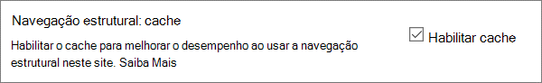

# <a name="navigation-options-for-sharepoint-online"></a><span data-ttu-id="3c547-103">Opções de navegação para o SharePoint Online</span><span class="sxs-lookup"><span data-stu-id="3c547-103">Navigation options for SharePoint Online</span></span>

<span data-ttu-id="3c547-104">Este artigo descreve os sites de opções de navegação com a publicação do SharePoint habilitada no SharePoint Online.</span><span class="sxs-lookup"><span data-stu-id="3c547-104">This article describes navigation options sites with SharePoint Publishing enabled in SharePoint Online.</span></span> <span data-ttu-id="3c547-105">A escolha e a configuração de navegação impactam significativamente o desempenho e a escalabilidade de sites no SharePoint Online.</span><span class="sxs-lookup"><span data-stu-id="3c547-105">The choice and configuration of navigation significantly impacts the performance and scalability of sites in SharePoint Online.</span></span> <span data-ttu-id="3c547-106">O modelo de site de publicação do SharePoint deve ser usado somente se necessário para um portal centralizado e o recurso de publicação só deve ser habilitado em sites específicos e apenas quando é absolutamente necessário, pois pode afetar o desempenho quando usado incorretamente.</span><span class="sxs-lookup"><span data-stu-id="3c547-106">The SharePoint Publishing site template should only be used if required for a centralized portal and the publishing feature should only be enabled on specific sites and only when absolutely required as it can impact performance when used incorrectly.</span></span>

>[!NOTE]
><span data-ttu-id="3c547-107">Se você estiver usando as opções de navegação modernas do SharePoint, como o menu mega, a navegação em cascata ou a navegação de Hub, este artigo não se aplicará ao seu site.</span><span class="sxs-lookup"><span data-stu-id="3c547-107">If you're using modern SharePoint navigation options like mega menu, cascading navigation, or hub navigation, this article does not apply to your site.</span></span> <span data-ttu-id="3c547-108">As arquiteturas modernas de sites do SharePoint aproveitam uma hierarquia de sites mais nivelada e um modelo Hub e spoke.</span><span class="sxs-lookup"><span data-stu-id="3c547-108">Modern SharePoint site architectures leverage a more flattened site hierarchy and a hub-and-spoke model.</span></span> <span data-ttu-id="3c547-109">Isso permite que muitos cenários sejam alcançados e não exijam o uso do recurso de publicação do SharePoint.</span><span class="sxs-lookup"><span data-stu-id="3c547-109">This allows many scenarios to be achieved that do NOT require use of the SharePoint Publishing feature.</span></span>

## <a name="overview-of-navigation-options"></a><span data-ttu-id="3c547-110">Visão geral das opções de navegação</span><span class="sxs-lookup"><span data-stu-id="3c547-110">Overview of navigation options</span></span>

<span data-ttu-id="3c547-111">A configuração do provedor de navegação pode impactar significativamente o desempenho de todo o site e é necessário fazer uma consideração cuidadosa para escolher um provedor de navegação e uma configuração que sejam dimensionados de forma eficaz para os requisitos de um site do SharePoint.</span><span class="sxs-lookup"><span data-stu-id="3c547-111">Navigation provider configuration can significantly impact performance for the entire site, and careful consideration must be taken to pick a navigation provider and configuration that scales effectively for the requirements of a SharePoint site.</span></span> <span data-ttu-id="3c547-112">Há dois provedores de navegação prontos para uso, bem como implementações de navegação personalizadas.</span><span class="sxs-lookup"><span data-stu-id="3c547-112">There are two out-of-the-box navigation providers, as well as custom navigation implementations.</span></span>

<span data-ttu-id="3c547-113">A primeira opção, [**navegação estrutural**](#using-structural-navigation-in-sharepoint-online), é a opção de navegação recomendada no SharePoint Online para sites clássicos do SharePoint, **se você ativar o cache estrutural de navegação para seu site**.</span><span class="sxs-lookup"><span data-stu-id="3c547-113">The first option, [**Structural navigation**](#using-structural-navigation-in-sharepoint-online), is the recommended navigation option in SharePoint Online for classic Sharepoint sites, **if you turn on structural navigation caching for your site**.</span></span> <span data-ttu-id="3c547-114">Este provedor de navegação exibe os itens de navegação abaixo do site atual e, opcionalmente, o site atual e seus irmãos.</span><span class="sxs-lookup"><span data-stu-id="3c547-114">This navigation provider displays the navigation items below the current site, and optionally the current site and its siblings.</span></span> <span data-ttu-id="3c547-115">Ele fornece recursos adicionais como filtragem de segurança e enumeração de estrutura do site.</span><span class="sxs-lookup"><span data-stu-id="3c547-115">It provides additional capabilities such as security trimming and site structure enumeration.</span></span> <span data-ttu-id="3c547-116">Se o cache estiver desabilitado, isso causará impacto negativo no desempenho e na escalabilidade e poderá estar sujeito à limitação.</span><span class="sxs-lookup"><span data-stu-id="3c547-116">If caching is disabled, this will negatively impact performance and scalability, and may be subject to throttling.</span></span>

<span data-ttu-id="3c547-117">A segunda opção, [**navegação gerenciada (metadados)**](#using-managed-navigation-and-metadata-in-sharepoint-online), representa itens de navegação usando um conjunto de termos de metadados gerenciados.</span><span class="sxs-lookup"><span data-stu-id="3c547-117">The second option, [**Managed (Metadata) navigation**](#using-managed-navigation-and-metadata-in-sharepoint-online), represents navigation items using a Managed Metadata term set.</span></span> <span data-ttu-id="3c547-118">Recomendamos que a filtragem de segurança seja desabilitada, a menos que seja necessário.</span><span class="sxs-lookup"><span data-stu-id="3c547-118">We recommend that security trimming be disabled unless required.</span></span> <span data-ttu-id="3c547-119">O aparamento de segurança está habilitado como uma configuração segura por padrão para este provedor de navegação; no entanto, muitos sites não exigem a sobrecarga da filtragem de segurança, já que os elementos de navegação freqüentemente são consistentes para todos os usuários do site.</span><span class="sxs-lookup"><span data-stu-id="3c547-119">Security trimming is enabled as a secure-by-default setting for this navigation provider; however, many sites do not require the overhead of security trimming since navigation elements often are consistent for all users of the site.</span></span> <span data-ttu-id="3c547-120">Com a configuração recomendada para desabilitar a filtragem de segurança, esse provedor de navegação não requer a enumeração da estrutura do site e é altamente escalável com impacto de desempenho aceitável.</span><span class="sxs-lookup"><span data-stu-id="3c547-120">With the recommended configuration to disable security trimming, this navigation provider does not require enumerating site structure and is highly scalable with acceptable performance impact.</span></span>

<span data-ttu-id="3c547-121">Além dos provedores de navegação prontos para uso, muitos clientes implementaram com êxito implementações de navegação personalizada alternativas.</span><span class="sxs-lookup"><span data-stu-id="3c547-121">In addition to the out-of-the-box navigation providers, many customers have successfully implemented alternative custom navigation implementations.</span></span> <span data-ttu-id="3c547-122">Confira [scripts do lado do cliente orientados por pesquisa](#using-search-driven-client-side-scripting) neste artigo.</span><span class="sxs-lookup"><span data-stu-id="3c547-122">See [Search-driven client-side scripting](#using-search-driven-client-side-scripting) in this article.</span></span>
  
## <a name="pros-and-cons-of-sharepoint-online-navigation-options"></a><span data-ttu-id="3c547-123">Prós e contras das opções de navegação do SharePoint Online</span><span class="sxs-lookup"><span data-stu-id="3c547-123">Pros and Cons of SharePoint Online navigation options</span></span>

<span data-ttu-id="3c547-124">A tabela a seguir resume os prós e contras de cada opção.</span><span class="sxs-lookup"><span data-stu-id="3c547-124">The following table summarizes the pros and cons of each option.</span></span>

|<span data-ttu-id="3c547-125">Navegação estrutural</span><span class="sxs-lookup"><span data-stu-id="3c547-125">Structural navigation</span></span>  |<span data-ttu-id="3c547-126">Navegação gerenciada</span><span class="sxs-lookup"><span data-stu-id="3c547-126">Managed navigation</span></span>  |<span data-ttu-id="3c547-127">Navegação orientada por pesquisa</span><span class="sxs-lookup"><span data-stu-id="3c547-127">Search-driven navigation</span></span>  |<span data-ttu-id="3c547-128">Provedor de navegação personalizada</span><span class="sxs-lookup"><span data-stu-id="3c547-128">Custom-navigation provider</span></span>  |
|---------|---------|---------|---------|
|<span data-ttu-id="3c547-129">Prós</span><span class="sxs-lookup"><span data-stu-id="3c547-129">Pros:</span></span><br/><br/><span data-ttu-id="3c547-130">Fácil de manter</span><span class="sxs-lookup"><span data-stu-id="3c547-130">Easy to maintain</span></span><br/><span data-ttu-id="3c547-131">Segurança cortada</span><span class="sxs-lookup"><span data-stu-id="3c547-131">Security trimmed</span></span><br/><span data-ttu-id="3c547-132">Atualiza automaticamente dentro de 24 horas quando o conteúdo é alterado</span><span class="sxs-lookup"><span data-stu-id="3c547-132">Automatically updates within 24 hours when content is changed</span></span><br/>     |<span data-ttu-id="3c547-133">Prós</span><span class="sxs-lookup"><span data-stu-id="3c547-133">Pros:</span></span><br/><br/><span data-ttu-id="3c547-134">Fácil de manter</span><span class="sxs-lookup"><span data-stu-id="3c547-134">Easy to maintain</span></span><br/>|<span data-ttu-id="3c547-135">Prós</span><span class="sxs-lookup"><span data-stu-id="3c547-135">Pros:</span></span><br/><br/><span data-ttu-id="3c547-136">Segurança cortada</span><span class="sxs-lookup"><span data-stu-id="3c547-136">Security trimmed</span></span><br/><span data-ttu-id="3c547-137">Atualiza automaticamente à medida que os sites são adicionados</span><span class="sxs-lookup"><span data-stu-id="3c547-137">Automatically updates as sites are added</span></span><br/><span data-ttu-id="3c547-138">Tempo de carregamento rápido e estrutura de navegação em cache local</span><span class="sxs-lookup"><span data-stu-id="3c547-138">Fast loading time and locally cached navigation structure</span></span><br/>|<span data-ttu-id="3c547-139">Prós</span><span class="sxs-lookup"><span data-stu-id="3c547-139">Pros:</span></span><br/><br/><span data-ttu-id="3c547-140">Escolha mais ampla de opções disponíveis</span><span class="sxs-lookup"><span data-stu-id="3c547-140">Wider choice of options available</span></span><br/><span data-ttu-id="3c547-141">Carregamento rápido quando o cache é usado corretamente</span><span class="sxs-lookup"><span data-stu-id="3c547-141">Fast loading when caching is used correctly</span></span><br/><span data-ttu-id="3c547-142">Muitas opções funcionam bem com o design de página responsivo</span><span class="sxs-lookup"><span data-stu-id="3c547-142">Many options work well with responsive page design</span></span><br/>|
|<span data-ttu-id="3c547-143">Contras</span><span class="sxs-lookup"><span data-stu-id="3c547-143">Cons:</span></span><br/><br/><span data-ttu-id="3c547-144">**Impacta o desempenho se o cache estiver desabilitado**</span><span class="sxs-lookup"><span data-stu-id="3c547-144">**Impacts performance if caching is disabled**</span></span><br/><span data-ttu-id="3c547-145">Sujeito à limitação</span><span class="sxs-lookup"><span data-stu-id="3c547-145">Subject to throttling</span></span><br/>|<span data-ttu-id="3c547-146">Contras</span><span class="sxs-lookup"><span data-stu-id="3c547-146">Cons:</span></span><br/><br/><span data-ttu-id="3c547-147">Não atualizado automaticamente para refletir a estrutura do site</span><span class="sxs-lookup"><span data-stu-id="3c547-147">Not automatically updated to reflect site structure</span></span><br/><span data-ttu-id="3c547-148">**Impacta o desempenho se a filtragem de segurança estiver habilitada** ou quando a estrutura de navegação for complexa</span><span class="sxs-lookup"><span data-stu-id="3c547-148">**Impacts performance if security trimming is enabled** or when navigation structure is complex</span></span><br/>|<span data-ttu-id="3c547-149">Contras</span><span class="sxs-lookup"><span data-stu-id="3c547-149">Cons:</span></span><br/><br/><span data-ttu-id="3c547-150">Sem capacidade para encomendar facilmente sites</span><span class="sxs-lookup"><span data-stu-id="3c547-150">No ability to easily order sites</span></span><br/><span data-ttu-id="3c547-151">Requer a personalização da página mestra (habilidades técnicas obrigatórias)</span><span class="sxs-lookup"><span data-stu-id="3c547-151">Requires customization of the master page (technical skills required)</span></span><br/>|<span data-ttu-id="3c547-152">Contras</span><span class="sxs-lookup"><span data-stu-id="3c547-152">Cons:</span></span><br/><br/><span data-ttu-id="3c547-153">O desenvolvimento personalizado é necessário</span><span class="sxs-lookup"><span data-stu-id="3c547-153">Custom development is required</span></span><br/><span data-ttu-id="3c547-154">A fonte de dados externa/cache armazenado é necessária, por exemplo, o Azure</span><span class="sxs-lookup"><span data-stu-id="3c547-154">External data source / cache stored is needed e.g. Azure</span></span><br/>|

<span data-ttu-id="3c547-155">A opção mais apropriada para seu site dependerá dos requisitos do seu site e do seu recurso técnico.</span><span class="sxs-lookup"><span data-stu-id="3c547-155">The most appropriate option for your site will depend on your site requirements and on your technical capability.</span></span> <span data-ttu-id="3c547-156">Se você quiser um provedor de navegação fácil de configurar que seja atualizado automaticamente quando o conteúdo for alterado, a navegação estrutural [com cache habilitado](https://support.office.com/article/structural-navigation-and-performance-f163053f-8eca-4b9c-b973-36b395093b43) será uma boa opção.</span><span class="sxs-lookup"><span data-stu-id="3c547-156">If you want an easy-to-configure navigation provider that automatically updates when content is changed, then structural navigation [with caching enabled](https://support.office.com/article/structural-navigation-and-performance-f163053f-8eca-4b9c-b973-36b395093b43) is a good option.</span></span>

>[!NOTE]
><span data-ttu-id="3c547-157">Aplicar o mesmo princípio de sites modernos do SharePoint simplificando a estrutura geral do site para uma estrutura não hierárquica do Flatter, melhora o desempenho e simplifica a movimentação para sites modernos do SharePoint.</span><span class="sxs-lookup"><span data-stu-id="3c547-157">Applying the same principle as modern SharePoint sites by simplifying the overall site structure to a flatter, non-hierarchical structure improves performance and simplifies moving to modern SharePoint sites.</span></span> <span data-ttu-id="3c547-158">Isso significa que, em vez de ter um único conjunto de sites com centenas de sites (subwebs), uma abordagem melhor é ter muitos conjuntos de sites com muito poucos subsites (subwebs).</span><span class="sxs-lookup"><span data-stu-id="3c547-158">What this means is that instead of having a single site collection with hundreds of sites (subwebs), a better approach is to have many site collections with very few subsites (subwebs).</span></span>

## <a name="analyzing-navigation-performance-in-sharepoint-online"></a><span data-ttu-id="3c547-159">Analisando o desempenho de navegação no SharePoint Online</span><span class="sxs-lookup"><span data-stu-id="3c547-159">Analyzing navigation performance in SharePoint Online</span></span>

<span data-ttu-id="3c547-160">A [ferramenta diagnóstico de página do SharePoint](https://aka.ms/perftool) é uma extensão de navegador para o Microsoft Edge e navegadores Chrome que analisa o portal moderno do SharePoint Online e as páginas do site de publicação clássica.</span><span class="sxs-lookup"><span data-stu-id="3c547-160">The [Page Diagnostics for SharePoint tool](https://aka.ms/perftool) is a browser extension for Microsoft Edge and Chrome browsers that analyzes both SharePoint Online modern portal and classic publishing site pages.</span></span> <span data-ttu-id="3c547-161">Essa ferramenta só funciona no SharePoint Online e não pode ser usada em uma página de sistema do SharePoint.</span><span class="sxs-lookup"><span data-stu-id="3c547-161">This tool only works for SharePoint Online, and cannot be used on a SharePoint system page.</span></span>

<span data-ttu-id="3c547-162">A ferramenta gera um relatório para cada página analisada mostrando como a página é executada em um conjunto de regras predefinido e exibe informações detalhadas quando os resultados de um teste ficam fora do valor da linha de base.</span><span class="sxs-lookup"><span data-stu-id="3c547-162">The tool generates a report for each analyzed page showing how the page performs against a pre-defined set of rules and displays detailed information when results for a test fall outside the baseline value.</span></span> <span data-ttu-id="3c547-163">Os administradores e designers do SharePoint Online podem usar a ferramenta para solucionar problemas de desempenho a fim de garantir que as novas páginas sejam otimizadas antes da publicação.</span><span class="sxs-lookup"><span data-stu-id="3c547-163">SharePoint Online administrators and designers can use the tool to troubleshoot performance issues to ensure that new pages are optimized prior to publishing.</span></span>

<span data-ttu-id="3c547-164">**SPRequestDuration** em particular é o tempo que o SharePoint leva para processar a página.</span><span class="sxs-lookup"><span data-stu-id="3c547-164">**SPRequestDuration** in particular is the time it takes for SharePoint to process the page.</span></span> <span data-ttu-id="3c547-165">Uma navegação intensa (como a inclusão de páginas na navegação), hierarquias de sites complexos e outras opções de configuração e topologia podem ser comparadas drasticamente a durações mais longas.</span><span class="sxs-lookup"><span data-stu-id="3c547-165">Heavy navigation (like including pages in navigation), complex site hierarchies, and other configuration and topology options can all dramatically contribute to longer durations.</span></span>

## <a name="using-structural-navigation-in-sharepoint-online"></a><span data-ttu-id="3c547-166">Usando a navegação estrutural no SharePoint Online</span><span class="sxs-lookup"><span data-stu-id="3c547-166">Using structural navigation in SharePoint Online</span></span>

<span data-ttu-id="3c547-167">Esta é a navegação pronta para uso, usada por padrão e é a solução mais direta.</span><span class="sxs-lookup"><span data-stu-id="3c547-167">This is the out-of-the-box navigation used by default and is the most straightforward solution.</span></span> <span data-ttu-id="3c547-168">Não requer personalização e um usuário não técnico também pode facilmente adicionar itens, ocultar itens e gerenciar a navegação na página Configurações.</span><span class="sxs-lookup"><span data-stu-id="3c547-168">It does not require any customization and a non-technical user can also easily add items, hide items, and manage the navigation from the settings page.</span></span> <span data-ttu-id="3c547-169">É recomendável [habilitar o cache](https://support.office.com/article/structural-navigation-and-performance-f163053f-8eca-4b9c-b973-36b395093b43), caso contrário, haverá uma compensação de desempenho dispendiosa.</span><span class="sxs-lookup"><span data-stu-id="3c547-169">We recommend [enabling caching](https://support.office.com/article/structural-navigation-and-performance-f163053f-8eca-4b9c-b973-36b395093b43), otherwise there is an expensive performance trade-off.</span></span>

### <a name="how-to-implement-structural-navigation-caching"></a><span data-ttu-id="3c547-170">Como implementar o cache de navegação estrutural</span><span class="sxs-lookup"><span data-stu-id="3c547-170">How to implement structural navigation caching</span></span>

<span data-ttu-id="3c547-171">Em **configurações do site**  >  **Look and Feel**  >  **navegação**de aparência, é possível validar se a navegação estrutural está selecionada para navegação global ou navegação atual.</span><span class="sxs-lookup"><span data-stu-id="3c547-171">Under **Site Settings** > **Look and Feel** > **Navigation**, you can validate if structural navigation is selected for either global navigation or current navigation.</span></span> <span data-ttu-id="3c547-172">Selecionar **Mostrar páginas** terá um impacto negativo no desempenho.</span><span class="sxs-lookup"><span data-stu-id="3c547-172">Selecting **Show pages** will have negative impact on performance.</span></span>


<span data-ttu-id="3c547-174">O armazenamento em cache pode ser habilitado ou desabilitado no nível do conjunto de sites e no nível do site e é habilitado por padrão.</span><span class="sxs-lookup"><span data-stu-id="3c547-174">Caching can be enabled or disabled at the site collection level and at the site level, and is enabled for both by default.</span></span> <span data-ttu-id="3c547-175">Para habilitar no nível do conjunto de sites, em **configurações do site**  >  **Site Collection Administration**  >  **navegação do conjunto de sites**da administração do conjunto de sites, marque a caixa de diálogo **Habilitar cache**.</span><span class="sxs-lookup"><span data-stu-id="3c547-175">To enable at the site collection level, under **Site Settings** > **Site Collection Administration** > **Site Collection Navigation**, check the box for **Enable caching**.</span></span>


<span data-ttu-id="3c547-177">Para habilitar no nível do site, em **Site Settings**  >  **navegação**de configurações do site, marque a caixa para **habilitar o cache**.</span><span class="sxs-lookup"><span data-stu-id="3c547-177">To enable at the site level, under **Site Settings** > **Navigation**, check the box for **Enable caching**.</span></span>



## <a name="using-managed-navigation-and-metadata-in-sharepoint-online"></a><span data-ttu-id="3c547-179">Usando a navegação gerenciada e metadados no SharePoint Online</span><span class="sxs-lookup"><span data-stu-id="3c547-179">Using managed navigation and metadata in SharePoint Online</span></span>

<span data-ttu-id="3c547-180">A navegação gerenciada é outra opção pronta para uso, que você pode usar para recriar a maior parte da mesma funcionalidade que a navegação estrutural.</span><span class="sxs-lookup"><span data-stu-id="3c547-180">Managed navigation is another out-of-the-box option that you can use to recreate most of the same functionality as structural navigation.</span></span> <span data-ttu-id="3c547-181">Os metadados gerenciados podem ser configurados para que o aparamento de segurança seja habilitado ou desabilitado.</span><span class="sxs-lookup"><span data-stu-id="3c547-181">Managed metadata can be configured to have security trimming enabled or disabled.</span></span> <span data-ttu-id="3c547-182">Quando configurado com o aparamento de segurança desabilitado, a navegação gerenciada é bastante eficiente, pois carrega todos os links de navegação com um número constante de chamadas do servidor.</span><span class="sxs-lookup"><span data-stu-id="3c547-182">When configured with security trimming disabled, managed navigation is fairly efficient as it loads all the navigation links with a constant number of server calls.</span></span> <span data-ttu-id="3c547-183">No entanto, a habilitação da filtragem de segurança elimina algumas das vantagens de desempenho da navegação gerenciada.</span><span class="sxs-lookup"><span data-stu-id="3c547-183">Enabling security trimming, however, negates some of the performance advantages of managed navigation.</span></span>

<span data-ttu-id="3c547-184">Se você precisar habilitar a filtragem de segurança, recomendamos que você:</span><span class="sxs-lookup"><span data-stu-id="3c547-184">If you need to enable security trimming, we recommend that you:</span></span>

- <span data-ttu-id="3c547-185">Atualizar todos os links de URL amigáveis para links simples</span><span class="sxs-lookup"><span data-stu-id="3c547-185">Update all friendly URL links to simple links</span></span>
- <span data-ttu-id="3c547-186">Adicionar nós de filtragem de segurança necessários como URLs amigáveis</span><span class="sxs-lookup"><span data-stu-id="3c547-186">Add required security trimming nodes as friendly URLs</span></span>
- <span data-ttu-id="3c547-187">Limitar o número de itens de navegação para não mais do que 100 e não mais de três níveis de profundidade</span><span class="sxs-lookup"><span data-stu-id="3c547-187">Limit the number of navigation items to no more than 100 and no more than 3 levels deep</span></span>

<span data-ttu-id="3c547-188">Muitos sites não exigem filtragem de segurança, já que a estrutura de navegação é geralmente consistente para todos os usuários do site.</span><span class="sxs-lookup"><span data-stu-id="3c547-188">Many sites do not require security trimming, as the navigation structure is often consistent for all users of the site.</span></span> <span data-ttu-id="3c547-189">Se a filtragem de segurança estiver desabilitada e um link for adicionado à navegação à qual nem todos os usuários tenham acesso, o link ainda será mostrado, mas levará a uma mensagem de acesso negado.</span><span class="sxs-lookup"><span data-stu-id="3c547-189">If security trimming is disabled and a link is added to navigation that not all users have access to, the link will still show but will lead to an access denied message.</span></span> <span data-ttu-id="3c547-190">Não há risco de acesso inadvertido ao conteúdo.</span><span class="sxs-lookup"><span data-stu-id="3c547-190">There is no risk of inadvertent access to the content.</span></span>

### <a name="how-to-implement-managed-navigation-and-the-results"></a><span data-ttu-id="3c547-191">Como implementar a navegação gerenciada e os resultados</span><span class="sxs-lookup"><span data-stu-id="3c547-191">How to implement managed navigation and the results</span></span>

<span data-ttu-id="3c547-192">Há vários artigos no docs.microsoft.com sobre os detalhes da navegação gerenciada.</span><span class="sxs-lookup"><span data-stu-id="3c547-192">There are several articles on docs.microsoft.com about the details of managed navigation.</span></span> <span data-ttu-id="3c547-193">Por exemplo, confira [visão geral da navegação gerenciada no SharePoint Server](https://docs.microsoft.com/sharepoint/administration/overview-of-managed-navigation).</span><span class="sxs-lookup"><span data-stu-id="3c547-193">For example, see [Overview of managed navigation in SharePoint Server](https://docs.microsoft.com/sharepoint/administration/overview-of-managed-navigation).</span></span>

<span data-ttu-id="3c547-194">Para implementar a navegação gerenciada, você configura termos com URLs correspondentes à estrutura de navegação do site.</span><span class="sxs-lookup"><span data-stu-id="3c547-194">In order to implement managed navigation, you set up terms with URLs corresponding to the navigation structure of the site.</span></span> <span data-ttu-id="3c547-195">A navegação gerenciada pode até ser organizada manualmente para substituir a navegação estrutural em muitos casos.</span><span class="sxs-lookup"><span data-stu-id="3c547-195">Managed navigation can even be manually curated to replace structural navigation in many cases.</span></span> <span data-ttu-id="3c547-196">Por exemplo:</span><span class="sxs-lookup"><span data-stu-id="3c547-196">For example:</span></span>

<span data-ttu-id="3c547-198">)</span><span class="sxs-lookup"><span data-stu-id="3c547-198">)</span></span>

## <a name="using-search-driven-client-side-scripting"></a><span data-ttu-id="3c547-199">Usando scripts do lado do cliente orientados por pesquisa</span><span class="sxs-lookup"><span data-stu-id="3c547-199">Using Search-driven client-side scripting</span></span>

<span data-ttu-id="3c547-200">Uma classe comum de implementações de navegação personalizadas engloba padrões de design renderizados pelo cliente que armazenam um cache local de nós de navegação.</span><span class="sxs-lookup"><span data-stu-id="3c547-200">One common class of custom navigation implementations embraces client-rendered design patterns that store a local cache of navigation nodes.</span></span>

<span data-ttu-id="3c547-201">Esses provedores de navegação têm algumas vantagens importantes:</span><span class="sxs-lookup"><span data-stu-id="3c547-201">These navigation providers have a couple of key advantages:</span></span>

- <span data-ttu-id="3c547-202">Em geral, eles funcionam bem com designs de página responsivos.</span><span class="sxs-lookup"><span data-stu-id="3c547-202">They generally work well with responsive page designs.</span></span>
- <span data-ttu-id="3c547-203">Eles são extremamente escalonáveis e de desempenho porque podem renderizar sem custo de recurso (e atualizar em segundo plano após um tempo limite).</span><span class="sxs-lookup"><span data-stu-id="3c547-203">They are extremely scalable and performant because they can render with no resource cost (and refresh in the background after a timeout).</span></span>
- <span data-ttu-id="3c547-204">Esses provedores de navegação podem recuperar dados de navegação usando várias estratégias, variando de configurações estáticas simples para vários provedores de dados dinâmicos.</span><span class="sxs-lookup"><span data-stu-id="3c547-204">These navigation providers can retrieve navigation data using various strategies, ranging from simple static configurations to various dynamic data providers.</span></span>

<span data-ttu-id="3c547-205">Um exemplo de um provedor de dados é usar uma **navegação orientada por pesquisa**, o que permite flexibilidade para enumerar nós de navegação e manipular a filtragem de segurança com eficiência.</span><span class="sxs-lookup"><span data-stu-id="3c547-205">An example of a data provider is to use a **Search-driven navigation**, which allows flexibility for enumerating navigation nodes and handling security trimming efficiently.</span></span>

<span data-ttu-id="3c547-206">Há outras opções populares para criar **provedores de navegação personalizados**.</span><span class="sxs-lookup"><span data-stu-id="3c547-206">There are other popular options to build **Custom navigation providers**.</span></span> <span data-ttu-id="3c547-207">Revise as [soluções de navegação para portais do SharePoint Online](https://docs.microsoft.com/sharepoint/dev/solution-guidance/portal-navigation) para obter mais orientações sobre a criação de um provedor de navegação personalizado.</span><span class="sxs-lookup"><span data-stu-id="3c547-207">Please review [Navigation solutions for SharePoint Online portals](https://docs.microsoft.com/sharepoint/dev/solution-guidance/portal-navigation) for further guidance on building a Custom navigation provider.</span></span>

<span data-ttu-id="3c547-208">Usando a pesquisa você pode aproveitar os índices criados em segundo plano usando o rastreamento contínuo.</span><span class="sxs-lookup"><span data-stu-id="3c547-208">Using search you can leverage the indexes that are built up in the background using continuous crawl.</span></span> <span data-ttu-id="3c547-209">Os resultados da pesquisa são extraídos do índice de pesquisa e os resultados são cortados de segurança.</span><span class="sxs-lookup"><span data-stu-id="3c547-209">The search results are pulled from the search index and the results are security-trimmed.</span></span> <span data-ttu-id="3c547-210">Isso é geralmente mais rápido do que os provedores de navegação prontos quando o aparamento de segurança é necessário.</span><span class="sxs-lookup"><span data-stu-id="3c547-210">This is generally faster than out-of-the-box navigation providers when security trimming is required.</span></span> <span data-ttu-id="3c547-211">Usando a pesquisa para navegação estrutural, especialmente se você tiver uma estrutura de site complexa, acelerará consideravelmente o tempo de carregamento da página.</span><span class="sxs-lookup"><span data-stu-id="3c547-211">Using search for structural navigation, especially if you have a complex site structure, will speed up page loading time considerably.</span></span> <span data-ttu-id="3c547-212">A principal vantagem disso sobre a navegação gerenciada é que você se beneficia da filtragem de segurança.</span><span class="sxs-lookup"><span data-stu-id="3c547-212">The main advantage of this over managed navigation is that you benefit from security trimming.</span></span>

<span data-ttu-id="3c547-213">Essa abordagem envolve a criação de uma página mestra personalizada e a substituição do código de navegação pronto com HTML personalizado.</span><span class="sxs-lookup"><span data-stu-id="3c547-213">This approach involves creating a custom master page and replacing the out-of-the-box navigation code with custom HTML.</span></span> <span data-ttu-id="3c547-214">Siga este procedimento descrito no exemplo a seguir para substituir o código de navegação no arquivo `seattle.html` .</span><span class="sxs-lookup"><span data-stu-id="3c547-214">Follow this procedure outlined in the following example to replace the navigation code in the file `seattle.html`.</span></span> <span data-ttu-id="3c547-215">Neste exemplo, você abrirá o `seattle.html` arquivo e substituirá o elemento inteiro `id="DeltaTopNavigation"` pelo código HTML personalizado.</span><span class="sxs-lookup"><span data-stu-id="3c547-215">In this example, you will open the `seattle.html` file and replace the whole element `id="DeltaTopNavigation"` with custom HTML code.</span></span>

### <a name="example-replace-the-out-of-the-box-navigation-code-in-a-master-page"></a><span data-ttu-id="3c547-216">Exemplo: substituir o código de navegação pronto em uma página mestra</span><span class="sxs-lookup"><span data-stu-id="3c547-216">Example: Replace the out-of-the-box navigation code in a master page</span></span>

1. <span data-ttu-id="3c547-217">Navegue até a página Configurações do site.</span><span class="sxs-lookup"><span data-stu-id="3c547-217">Navigate to the Site Settings page.</span></span>
2. <span data-ttu-id="3c547-218">Abra a Galeria de páginas mestras clicando em **páginas mestras**.</span><span class="sxs-lookup"><span data-stu-id="3c547-218">Open the master page gallery by clicking **Master Pages**.</span></span>
3. <span data-ttu-id="3c547-219">Aqui você pode navegar pela biblioteca e baixar o arquivo `seattle.master` .</span><span class="sxs-lookup"><span data-stu-id="3c547-219">From here you can navigate through the library and download the file `seattle.master`.</span></span>
4. <span data-ttu-id="3c547-220">Edite o código usando um editor de texto e exclua o bloco de código na captura de tela a seguir.</span><span class="sxs-lookup"><span data-stu-id="3c547-220">Edit the code using a text editor and delete the code block in the following screen shot.</span></span><br/><br/>
5. <span data-ttu-id="3c547-222">Remova o código entre as `<SharePoint:AjaxDelta id="DeltaTopNavigation">` `<\SharePoint:AjaxDelta>` marcas e e substitua-o pelo seguinte trecho:</span><span class="sxs-lookup"><span data-stu-id="3c547-222">Remove the code between the `<SharePoint:AjaxDelta id="DeltaTopNavigation">` and `<\SharePoint:AjaxDelta>` tags and replace it with the following snippet:</span></span><br/>

```javascript
<div id="loading">
  <!--Replace with path to loading image.-->
  <div style="background-image: url(''); height: 22px; width: 22px; ">
  </div>
</div>
<!-- Main Content-->
<div id="navContainer" style="display:none">
    <div data-bind="foreach: hierarchy" class="noindex ms-core-listMenu-horizontalBox">
        <a class="dynamic menu-item ms-core-listMenu-item ms-displayInline ms-navedit-linkNode" data-bind="attr: { href: item.Url, title: item.Title }">
            <span class="menu-item-text" data-bind="text: item.Title">
            </span>
        </a>
        <ul id="menu" data-bind="foreach: $data.children" style="padding-left:20px">
            <li class="static dynamic-children level1">
                <a class="static dynamic-children menu-item ms-core-listMenu-item ms-displayInline ms-navedit-linkNode" data-bind="attr: { href: item.Url, title: item.Title }">

                 <!-- ko if: children.length > 0-->
                    <span aria-haspopup="true" class="additional-background ms-navedit-flyoutArrow dynamic-children">
                        <span class="menu-item-text" data-bind="text: item.Title">
                        </span>
                    </span>
                <!-- /ko -->
                <!-- ko if: children.length == 0-->
                    <span aria-haspopup="true" class="ms-navedit-flyoutArrow dynamic-children">
                        <span class="menu-item-text" data-bind="text: item.Title">
                        </span>
                    </span>
                <!-- /ko -->
                </a>

                <!-- ko if: children.length > 0-->
                <ul id="menu"  data-bind="foreach: children;" class="dynamic  level2" >
                    <li class="dynamic level2">
                        <a class="dynamic menu-item ms-core-listMenu-item ms-displayInline  ms-navedit-linkNode" data-bind="attr: { href: item.Url, title: item.Title }">

          <!-- ko if: children.length > 0-->
          <span aria-haspopup="true" class="additional-background ms-navedit-flyoutArrow dynamic-children">
           <span class="menu-item-text" data-bind="text: item.Title">
           </span>
          </span>
           <!-- /ko -->
          <!-- ko if: children.length == 0-->
          <span aria-haspopup="true" class="ms-navedit-flyoutArrow dynamic-children">
           <span class="menu-item-text" data-bind="text: item.Title">
           </span>
          </span>
          <!-- /ko -->
                        </a>
          <!-- ko if: children.length > 0-->
         <ul id="menu" data-bind="foreach: children;" class="dynamic level3" >
          <li class="dynamic level3">
           <a class="dynamic menu-item ms-core-listMenu-item ms-displayInline ms-navedit-linkNode" data-bind="attr: { href: item.Url, title: item.Title }">
            <span class="menu-item-text" data-bind="text: item.Title">
            </span>
           </a>
          </li>
         </ul>
           <!-- /ko -->
                    </li>
                </ul>
                <!-- /ko -->
            </li>
        </ul>
    </div>
</div>
```

<br/>
6. <span data-ttu-id="3c547-223">Substitua a URL na marca de âncora carregar imagem no início, com um link para uma imagem de carregamento no seu conjunto de sites.</span><span class="sxs-lookup"><span data-stu-id="3c547-223">Replace the URL in the loading image anchor tag at the beginning, with a link to a loading image in your site collection.</span></span> <span data-ttu-id="3c547-224">Depois de fazer as alterações, renomeie o arquivo e carregue-o na Galeria de páginas mestras.</span><span class="sxs-lookup"><span data-stu-id="3c547-224">After you have made the changes, rename the file and then upload it to the master page gallery.</span></span> <span data-ttu-id="3c547-225">Isso gera um novo arquivo. master.</span><span class="sxs-lookup"><span data-stu-id="3c547-225">This generates a new .master file.</span></span><br/>
7. <span data-ttu-id="3c547-226">Este HTML é a marcação básica que será preenchida pelos resultados da pesquisa retornados do código JavaScript.</span><span class="sxs-lookup"><span data-stu-id="3c547-226">This HTML is the basic markup that will be populated by the search results returned from JavaScript code.</span></span> <span data-ttu-id="3c547-227">Você precisará editar o código para alterar o valor de var root = "URL do conjunto de sites", conforme demonstrado no seguinte trecho de código:</span><span class="sxs-lookup"><span data-stu-id="3c547-227">You will need to edit the code to change the value for var root = "site collection URL" as demonstrated in the following snippet:</span></span><br/>

```javascript
var root = "https://spperformance.sharepoint.com/sites/NavigationBySearch";
```

<br/>
8. <span data-ttu-id="3c547-228">Os resultados são atribuídos à matriz Self. Nodes e uma hierarquia é criada a partir dos objetos usando linq.js atribuindo a saída a uma hierarquia de matriz própria.</span><span class="sxs-lookup"><span data-stu-id="3c547-228">The results are assigned to the self.nodes array and a hierarchy is built out of the objects using linq.js assigning the output to an array self.hierarchy.</span></span> <span data-ttu-id="3c547-229">Esta matriz é o objeto que está vinculado ao HTML.</span><span class="sxs-lookup"><span data-stu-id="3c547-229">This array is the object that is bound to the HTML.</span></span> <span data-ttu-id="3c547-230">Isso é feito na função toggleView (), passando o autoobjeto para a função ko. applybinding ().</span><span class="sxs-lookup"><span data-stu-id="3c547-230">This is done in the toggleView() function by passing the self object to the ko.applyBinding() function.</span></span><br/><span data-ttu-id="3c547-231">Isso faz com que a matriz de hierarquia seja vinculada ao seguinte HTML:</span><span class="sxs-lookup"><span data-stu-id="3c547-231">This then causes the hierarchy array to be bound to the following HTML:</span></span><br/>

```javascript
<div data-bind="foreach: hierarchy" class="noindex ms-core-listMenu-horizontalBox">
```

<span data-ttu-id="3c547-232">Os manipuladores de eventos para `mouseenter` e `mouseexit` são adicionados à navegação de nível superior para lidar com os menus suspensos de subsites que é feito na `addEventsToElements()` função.</span><span class="sxs-lookup"><span data-stu-id="3c547-232">The event handlers for `mouseenter` and `mouseexit` are added to the top-level navigation to handle the subsite drop-down menus which is done in the `addEventsToElements()` function.</span></span>

<span data-ttu-id="3c547-233">No nosso exemplo de navegação complexa, uma nova carga de página sem o cache local mostra que o tempo gasto no servidor foi reduzido da navegação estrutural de benchmark para obter um resultado semelhante à abordagem de navegação gerenciada.</span><span class="sxs-lookup"><span data-stu-id="3c547-233">In our complex navigation example, a fresh page load without the local caching shows the time spent on the server has been cut down from the benchmark structural navigation to get a similar result as the managed navigation approach.</span></span>

### <a name="about-the-javascript-file"></a><span data-ttu-id="3c547-234">Sobre o arquivo JavaScript...</span><span class="sxs-lookup"><span data-stu-id="3c547-234">About the JavaScript file...</span></span>

>[!NOTE]
><span data-ttu-id="3c547-235">Se estiver usando JavaScript personalizado, verifique se a CDN pública está habilitada e se o arquivo está em um local de CDN.</span><span class="sxs-lookup"><span data-stu-id="3c547-235">If using custom JavaScript, ensure that public CDN is enabled and the file is in a CDN location.</span></span>

<span data-ttu-id="3c547-236">O arquivo JavaScript inteiro é o seguinte:</span><span class="sxs-lookup"><span data-stu-id="3c547-236">The entire JavaScript file is as follows:</span></span>

```javascript
//Models and Namespaces
var SPOCustom = SPOCustom || {};
SPOCustom.Models = SPOCustom.Models || {}
SPOCustom.Models.NavigationNode = function () {

    this.Url = ko.observable("");
    this.Title = ko.observable("");
    this.Parent = ko.observable("");

};

var root = "https://spperformance.sharepoint.com/sites/NavigationBySearch";
var baseUrl = root + "/_api/search/query?querytext=";
var query = baseUrl + "'contentClass=\"STS_Web\"+path:" + root + "'&trimduplicates=false&rowlimit=300";

var baseRequest = {
    url: "",
    type: ""
};


//Parses a local object from JSON search result.
function getNavigationFromDto(dto) {
    var item = new SPOCustom.Models.NavigationNode();
    if (dto != undefined) {

        var webTemplate = getSearchResultsValue(dto.Cells.results, 'WebTemplate');

        if (webTemplate != "APP") {
            item.Title(getSearchResultsValue(dto.Cells.results, 'Title')); //Key = Title
            item.Url(getSearchResultsValue(dto.Cells.results, 'Path')); //Key = Path
            item.Parent(getSearchResultsValue(dto.Cells.results, 'ParentLink')); //Key = ParentLink
        }

    }
    return item;
}

function getSearchResultsValue(results, key) {

    for (i = 0; i < results.length; i++) {
        if (results[i].Key == key) {
            return results[i].Value;
        }
    }
    return null;
}

//Parse a local object from the serialized cache.
function getNavigationFromCache(dto) {
    var item = new SPOCustom.Models.NavigationNode();

    if (dto != undefined) {

        item.Title(dto.Title);
        item.Url(dto.Url);
        item.Parent(dto.Parent);
    }

    return item;
}

/* create a new OData request for JSON response */
function getRequest(endpoint) {
    var request = baseRequest;
    request.type = "GET";
    request.url = endpoint;
    request.headers = { ACCEPT: "application/json;odata=verbose" };
    return request;
};

/* Navigation Module*/
function NavigationViewModel() {
    "use strict";
    var self = this;
    self.nodes = ko.observableArray([]);
    self.hierarchy = ko.observableArray([]);;
    self.loadNavigatioNodes = function () {
        //Check local storage for cached navigation datasource.
        var fromStorage = localStorage["nodesCache"];
        if (false) {
            var cachedNodes = JSON.parse(localStorage["nodesCache"]);

            if (cachedNodes && timeStamp) {
                //Check for cache expiration. Currently set to 3 hrs.
                var now = new Date();
                var diff = now.getTime() - timeStamp;
                if (Math.round(diff / (1000 * 60 * 60)) < 3) {

                    //return from cache.
                    var cacheResults = [];
                    $.each(cachedNodes, function (i, item) {
                        var nodeitem = getNavigationFromCache(item, true);
                        cacheResults.push(nodeitem);
                    });

                    self.buildHierarchy(cacheResults);
                    self.toggleView();
                    addEventsToElements();
                    return;
                }
            }
        }
        //No cache hit, REST call required.
        self.queryRemoteInterface();
    };

    //Executes a REST call and builds the navigation hierarchy.
    self.queryRemoteInterface = function () {
        var oDataRequest = getRequest(query);
        $.ajax(oDataRequest).done(function (data) {
            var results = [];
            $.each(data.d.query.PrimaryQueryResult.RelevantResults.Table.Rows.results, function (i, item) {

                if (i == 0) {
                    //Add root element.
                    var rootItem = new SPOCustom.Models.NavigationNode();
                    rootItem.Title("Root");
                    rootItem.Url(root);
                    rootItem.Parent(null);
                    results.push(rootItem);
                }
                var navItem = getNavigationFromDto(item);
                results.push(navItem);
            });
            //Add to local cache
            localStorage["nodesCache"] = ko.toJSON(results);

            localStorage["nodesCachedAt"] = new Date().getTime();
            self.nodes(results);
            if (self.nodes().length > 0) {
                var unsortedArray = self.nodes();
                var sortedArray = unsortedArray.sort(self.sortObjectsInArray);

                self.buildHierarchy(sortedArray);
                self.toggleView();
                addEventsToElements();
            }
        }).fail(function () {
            //Handle error here!!
            $("#loading").hide();
            $("#error").show();
        });
    };
    self.toggleView = function () {
        var navContainer = document.getElementById("navContainer");
        ko.applyBindings(self, navContainer);
        $("#loading").hide();
        $("#navContainer").show();

    };
    //Uses linq.js to build the navigation tree.
    self.buildHierarchy = function (enumerable) {
        self.hierarchy(Enumerable.From(enumerable).ByHierarchy(function (d) {
            return d.Parent() == null;
        }, function (parent, child) {
            if (parent.Url() == null || child.Parent() == null)
                return false;
            return parent.Url().toUpperCase() == child.Parent().toUpperCase();
        }).ToArray());

        self.sortChildren(self.hierarchy()[0]);
    };


    self.sortChildren = function (parent) {

        // sjip processing if no children
        if (!parent || !parent.children || parent.children.length === 0) {
            return;
        }

        parent.children = parent.children.sort(self.sortObjectsInArray2);

        for (var i = 0; i < parent.children.length; i++) {
            var elem = parent.children[i];

            if (elem.children && elem.children.length > 0) {
                self.sortChildren(elem);
            }
        }
    };

    // ByHierarchy method breaks the sorting in chrome and firefox
    // we need to resort  as ascending
    self.sortObjectsInArray2 = function (a, b) {
        if (a.item.Title() > b.item.Title())
            return 1;
        if (a.item.Title() < b.item.Title())
            return -1;
        return 0;
    };


    self.sortObjectsInArray = function (a, b) {
        if (a.Title() > b.Title())
            return -1;
        if (a.Title() < b.Title())
            return 1;
        return 0;
    }
}

//Loads the navigation on load and binds the event handlers for mouse interaction.
function InitCustomNav() {
    var viewModel = new NavigationViewModel();
    viewModel.loadNavigatioNodes();
}

function addEventsToElements() {
    //events.
      $("li.level1").mouseover(function () {
          var position = $(this).position();
          $(this).find("ul.level2").css({ width: 100, left: position.left + 10, top: 50 });
      })
   .mouseout(function () {
     $(this).find("ul.level2").css({  left: -99999, top: 0 });
   
    });
   
     $("li.level2").mouseover(function () {
          var position = $(this).position();
          console.log(JSON.stringify(position));
          $(this).find("ul.level3").css({ width: 100, left: position.left + 95, top:  position.top});
      })
   .mouseout(function () {
     $(this).find("ul.level3").css({  left: -99999, top: 0 });
    });
} _spBodyOnLoadFunctionNames.push("InitCustomNav");

```

<span data-ttu-id="3c547-237">Para resumir o código mostrado acima na `jQuery $(document).ready` função, há uma `viewModel object` criada e, em seguida, a `loadNavigationNodes()` função desse objeto é chamada.</span><span class="sxs-lookup"><span data-stu-id="3c547-237">To summarize the code shown above in the `jQuery $(document).ready` function there is a `viewModel object` created and then the `loadNavigationNodes()` function on that object is called.</span></span> <span data-ttu-id="3c547-238">Essa função carrega a hierarquia de navegação criada anteriormente armazenada no armazenamento local do HTML5 do navegador cliente ou chama a função `queryRemoteInterface()` .</span><span class="sxs-lookup"><span data-stu-id="3c547-238">This function either loads the previously built navigation hierarchy stored in the HTML5 local storage of the client browser or it calls the function `queryRemoteInterface()`.</span></span>

<span data-ttu-id="3c547-239">`QueryRemoteInterface()` Cria uma solicitação usando a `getRequest()` função com o parâmetro de consulta definido anteriormente no script e, em seguida, retorna dados do servidor.</span><span class="sxs-lookup"><span data-stu-id="3c547-239">`QueryRemoteInterface()` builds a request using the `getRequest()` function with the query parameter defined earlier in the script and then returns data from the server.</span></span> <span data-ttu-id="3c547-240">Esses dados são essencialmente uma matriz de todos os sites no conjunto de sites representados como objetos de transferência de dados com várias propriedades.</span><span class="sxs-lookup"><span data-stu-id="3c547-240">This data is essentially an array of all the sites in the site collection represented as data transfer objects with various properties.</span></span>

<span data-ttu-id="3c547-241">Esses dados são analisados nos objetos previamente definidos `SPO.Models.NavigationNode` que usam `Knockout.js` para criar propriedades observáveis para uso por dados associando os valores no HTML que definimos anteriormente.</span><span class="sxs-lookup"><span data-stu-id="3c547-241">This data is then parsed into the previously defined `SPO.Models.NavigationNode` objects which use `Knockout.js` to create observable properties for use by data binding the values into the HTML that we defined earlier.</span></span>

<span data-ttu-id="3c547-242">Os objetos são então colocados em uma matriz de resultados.</span><span class="sxs-lookup"><span data-stu-id="3c547-242">The objects are then put into a results array.</span></span> <span data-ttu-id="3c547-243">Essa matriz é analisada no JSON usando vazar e armazenada no armazenamento de navegador local para melhorar o desempenho em cargas de página futuras.</span><span class="sxs-lookup"><span data-stu-id="3c547-243">This array is parsed into JSON using Knockout and stored in the local browser storage for improved performance on future page loads.</span></span>

### <a name="benefits-of-this-approach"></a><span data-ttu-id="3c547-244">Benefícios dessa abordagem</span><span class="sxs-lookup"><span data-stu-id="3c547-244">Benefits of this approach</span></span>

<span data-ttu-id="3c547-245">Uma das principais vantagens dessa [abordagem](#example-replace-the-out-of-the-box-navigation-code-in-a-master-page) é que, usando o armazenamento local do HTML5, a navegação é armazenada localmente para o usuário na próxima vez que ele carregar a página.</span><span class="sxs-lookup"><span data-stu-id="3c547-245">One major benefit of [this approach](#example-replace-the-out-of-the-box-navigation-code-in-a-master-page) is that by using HTML5 local storage, the navigation is stored locally for the user the next time they load the page.</span></span> <span data-ttu-id="3c547-246">Obtemos grandes aprimoramentos de desempenho ao usar a API de pesquisa para navegação estrutural; no entanto, ele leva algum recurso técnico para executar e personalizar essa funcionalidade.</span><span class="sxs-lookup"><span data-stu-id="3c547-246">We get major performance improvements from using the search API for structural navigation; however, it takes some technical capability to execute and customize this functionality.</span></span>

<span data-ttu-id="3c547-247">Na [implementação de exemplo](#example-replace-the-out-of-the-box-navigation-code-in-a-master-page), os sites são classificados da mesma maneira que a navegação estrutural pronta para uso; ordem alfabética.</span><span class="sxs-lookup"><span data-stu-id="3c547-247">In the [example implementation](#example-replace-the-out-of-the-box-navigation-code-in-a-master-page), the sites are ordered in the same way as the out-of-the-box structural navigation; alphabetical order.</span></span> <span data-ttu-id="3c547-248">Se você quisesse se desviar dessa ordem, seria mais complicado desenvolver e manter.</span><span class="sxs-lookup"><span data-stu-id="3c547-248">If you wanted to deviate from this order, it would be more complicated to develop and maintain.</span></span> <span data-ttu-id="3c547-249">Além disso, essa abordagem exige que você se desvie das páginas mestras com suporte.</span><span class="sxs-lookup"><span data-stu-id="3c547-249">Also, this approach requires you to deviate from the supported master pages.</span></span> <span data-ttu-id="3c547-250">Se a página mestra personalizada não for mantida, seu site perderá as atualizações e melhorias que a Microsoft faz nas páginas mestras.</span><span class="sxs-lookup"><span data-stu-id="3c547-250">If the custom master page is not maintained, your site will miss out on updates and improvements that Microsoft makes to the master pages.</span></span>

<span data-ttu-id="3c547-251">O [código acima](#about-the-javascript-file) tem as seguintes dependências:</span><span class="sxs-lookup"><span data-stu-id="3c547-251">The [above code](#about-the-javascript-file) has the following dependencies:</span></span>

- <span data-ttu-id="3c547-252">jQuery https://jquery.com/</span><span class="sxs-lookup"><span data-stu-id="3c547-252">jQuery - https://jquery.com/</span></span>
- <span data-ttu-id="3c547-253">KnockoutJS - https://knockoutjs.com/</span><span class="sxs-lookup"><span data-stu-id="3c547-253">KnockoutJS - https://knockoutjs.com/</span></span>
- <span data-ttu-id="3c547-254">Linq.js- https://linqjs.codeplex.com/ ou github.com/neuecc/linq.js</span><span class="sxs-lookup"><span data-stu-id="3c547-254">Linq.js - https://linqjs.codeplex.com/, or github.com/neuecc/linq.js</span></span>

<span data-ttu-id="3c547-255">A versão atual do LinqJS não contém o método ByHierarchy usado no código acima e quebrará o código de navegação.</span><span class="sxs-lookup"><span data-stu-id="3c547-255">The current version of LinqJS does not contain the ByHierarchy method used in the above code and will break the navigation code.</span></span> <span data-ttu-id="3c547-256">Para corrigir isso, adicione o seguinte método ao arquivo de Linq.js antes da linha `Flatten: function ()` .</span><span class="sxs-lookup"><span data-stu-id="3c547-256">To fix this, add the following method to the Linq.js file before the line `Flatten: function ()`.</span></span>

```javascript
ByHierarchy: function(firstLevel, connectBy, orderBy, ascending, parent) {
     ascending = ascending == undefined ? true : ascending;
     var orderMethod = ascending == true ? 'OrderBy' : 'OrderByDescending';
     var source = this;
     firstLevel = Utils.CreateLambda(firstLevel);
     connectBy = Utils.CreateLambda(connectBy);
     orderBy = Utils.CreateLambda(orderBy);

     //Initiate or increase level
     var level = parent === undefined ? 1 : parent.level + 1;

    return new Enumerable(function() {
         var enumerator;
         var index = 0;

        var createLevel = function() {
                 var obj = {
                     item: enumerator.Current(),
                     level : level
                 };
                 obj.children = Enumerable.From(source).ByHierarchy(firstLevel, connectBy, orderBy, ascending, obj);
                 if (orderBy !== undefined) {
                     obj.children = obj.children[orderMethod](function(d) {
                         return orderBy(d.item); //unwrap the actual item for sort to work
                     });
                 }
                 obj.children = obj.children.ToArray();
                 Enumerable.From(obj.children).ForEach(function(child) {
                     child.getParent = function() {
                         return obj;
                     };
                 });
                 return obj;
             };

        return new IEnumerator(

        function() {
             enumerator = source.GetEnumerator();
         }, function() {
             while (enumerator.MoveNext()) {
                 var returnArr;
                 if (!parent) {
                     if (firstLevel(enumerator.Current(), index++)) {
                         return this.Yield(createLevel());
                     }

                } else {
                     if (connectBy(parent.item, enumerator.Current(), index++)) {
                         return this.Yield(createLevel());
                     }
                 }
             }
             return false;
         }, function() {
             Utils.Dispose(enumerator);
         })
     });
 },

```
  
## <a name="related-topics"></a><span data-ttu-id="3c547-257">Tópicos relacionados</span><span class="sxs-lookup"><span data-stu-id="3c547-257">Related topics</span></span>

[<span data-ttu-id="3c547-258">Visão geral da navegação gerenciada no SharePoint Server</span><span class="sxs-lookup"><span data-stu-id="3c547-258">Overview of managed navigation in SharePoint Server</span></span>](https://docs.microsoft.com/sharepoint/administration/overview-of-managed-navigation)

[<span data-ttu-id="3c547-259">Desempenho e cache de navegação estrutural</span><span class="sxs-lookup"><span data-stu-id="3c547-259">Structural navigation caching and performance</span></span>](https://support.office.com/article/structural-navigation-and-performance-f163053f-8eca-4b9c-b973-36b395093b43)
