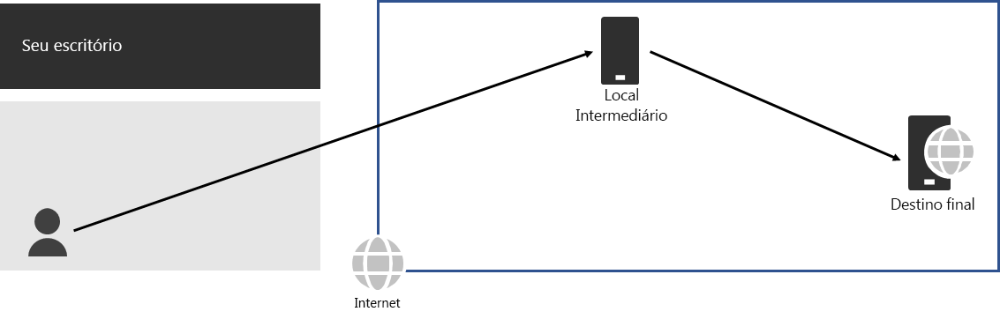
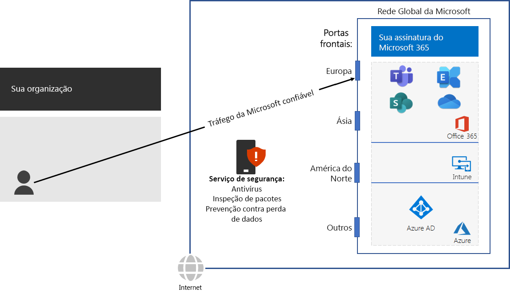

# Etapa 3: Evitar hairpins de rede

*Esta etapa é obrigatória e se aplica para as versões E3 e E5 do Microsoft 365 Enterprise*

Um [hairpin de rede](https://docs.microsoft.com/office365/enterprise/office-365-network-connectivity-principles#BKMK_P3) acontece quando o tráfego vinculado a um destino é direcionado primeiro para outro local intermediário, como uma pilha de segurança local, um agente de acesso à nuvem ou um gateway Web baseado em nuvem. Veja um exemplo.

Um hairpin de rede também pode ser causado por um roteamento insatisfatório na Internet, devido aos provedores de serviços de rede. 

Um hairpin adiciona latência e pode redirecionar o tráfego para um local distante geograficamente.

Para otimizar o desempenho do tráfego para serviços baseados em nuvem do Microsoft 365, verifique se o provedor que fornece a conexão local com a Internet tem um relacionamento de emparelhamento direto com a Rede Global da Microsoft bem próxima a esse local. Essas conexões não possuem hairpins.

Se você usa serviços de rede ou segurança baseados em nuvem para o tráfego do Microsoft 365, certifique-se de que o efeito do hairpin seja avaliado e seu impacto no desempenho seja compreendido. Analise o seguinte:

- O número e a localização dos provedores de serviços através dos quais o tráfego é encaminhado em relação às suas filiais e aos pontos de emparelhamento da Rede Global da Microsoft 
- A qualidade da relação de emparelhamento de rede do provedor de serviços com seu ISP e a Microsoft 
- O impacto no desempenho de backhaul na infraestrutura do provedor de serviços

Sempre que possível, configure seus roteadores de borda para enviar tráfego confiável do Microsoft 365 diretamente, em vez de fazer proxy ou encapsulamento por meio de um fornecedor terceirizado de segurança de rede baseado em nuvem ou na nuvem que processa o tráfego da Internet. 

Como um ponto de verificação provisório, é possível ver os [critérios de saída](networking-exit-criteria.md#crit-networking-step3) para esta etapa.

## Próxima etapa

|||
|:-------|:-----|
||[Configurar o bypass de tráfego](networking-configure-proxies-firewalls.md)|
