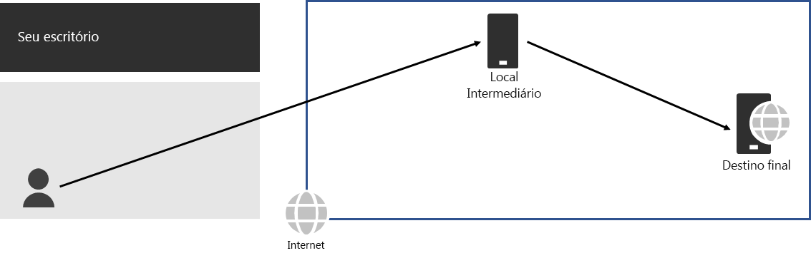
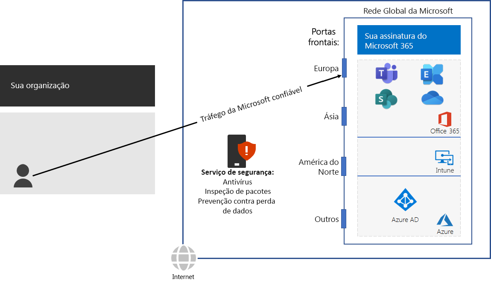

# Etapa 3: Evitar hairpins de redeStep 3: Avoid network hairpins

*Esta etapa é obrigatória e se aplica para as versões E3 e E5 do Microsoft 365 Enterprise**This step is required and applies to both the E3 and E5 versions of Microsoft 365 Enterprise*

Um [hairpin de rede](https://docs.microsoft.com/office365/enterprise/office-365-network-connectivity-principles#BKMK_P3) acontece quando o tráfego vinculado a um destino é direcionado primeiro para outro local intermediário, como uma pilha de segurança local, um agente de acesso à nuvem ou um gateway Web baseado em nuvem.A [network hairpin](https://docs.microsoft.com/office365/enterprise/office-365-network-connectivity-principles#BKMK_P3) happens when traffic bound for a destination is first directed to another intermediate location, such as an on-premises security stack, cloud access broker, or cloud-based web gateway. Veja um exemplo.Here is an example.

Um hairpin de rede também pode ser causado por um roteamento insatisfatório na Internet, devido aos provedores de serviços de rede.A network hairpin could also be caused by poor routing on the Internet due to network service providers. 

Um hairpin adiciona latência e pode redirecionar o tráfego para um local distante geograficamente.A hairpin adds latency and can potentially redirect traffic to a geographically distant location.

Para otimizar o desempenho do tráfego para serviços baseados em nuvem do Microsoft 365, verifique se o provedor que fornece a conexão local com a Internet tem um relacionamento de emparelhamento direto com a Rede Global da Microsoft bem próxima a esse local. Essas conexões não possuem hairpins.To optimize performance for traffic to Microsoft 365 cloud-based services, check whether the ISP providing the local Internet connection has a direct peering relationship with the Microsoft Global Network in close proximity to that location. These connections do not have hairpins.

Se você usa serviços de rede ou segurança baseados em nuvem para o tráfego do Microsoft 365, certifique-se de que o efeito do hairpin seja avaliado e seu impacto no desempenho seja compreendido. Analise o seguinte:If you use cloud-based network or security services for your Microsoft 365 traffic, ensure that the hairpinning effect is evaluated and its impact on performance is understood. Examine the following:

- O número e a localização dos provedores de serviços através dos quais o tráfego é encaminhado em relação às suas filiais e aos pontos de emparelhamento da Rede Global da MicrosoftThe number and locations of your service providers through which the traffic is forwarded in relationship to your branch offices and Microsoft Global Network peering points 
- A qualidade da relação de emparelhamento de rede do provedor de serviços com seu ISP e a MicrosoftThe quality of the network peering relationship of the service provider with your ISP and Microsoft 
- O impacto no desempenho de backhaul na infraestrutura do provedor de serviçosThe performance impact of backhauling in the service provider infrastructure

Sempre que possível, configure seus roteadores de borda para enviar tráfego confiável do Microsoft 365 diretamente, em vez de fazer proxy ou encapsulamento por meio de um fornecedor terceirizado de segurança de rede baseado em nuvem ou na nuvem que processa o tráfego da Internet.Whenever possible, configure your edge routers to send trusted Microsoft 365 traffic directly, instead of proxying or tunneling through a third-party cloud or cloud-based network security vendor that processes your Internet traffic. 

Para testar o quão perto você está de um ponto de entrada da rede global da Microsoft e o quão perto você está do ponto em que a rede da sua organização se conecta ao seu ISP, use a [ferramenta de Integração de Rede do Office 365](https://connectivity.office.com/).To test how close you are to an entry point for Microsoft’s global network and how close you are to the point where your organization network connects to your ISP, use the [Office 365 Network Onboarding tool](https://connectivity.office.com/).

Como um ponto de verificação provisório, é possível ver os [critérios de saída](networking-exit-criteria.md#crit-networking-step3) para esta etapa.As an interim checkpoint, you can see the [exit criteria](networking-exit-criteria.md#crit-networking-step3) for this step.

## Próxima etapaNext step

|||
|:-------|:-----|
||[Configurar o bypass de tráfegoConfigure traffic bypass](networking-configure-proxies-firewalls.md)|
