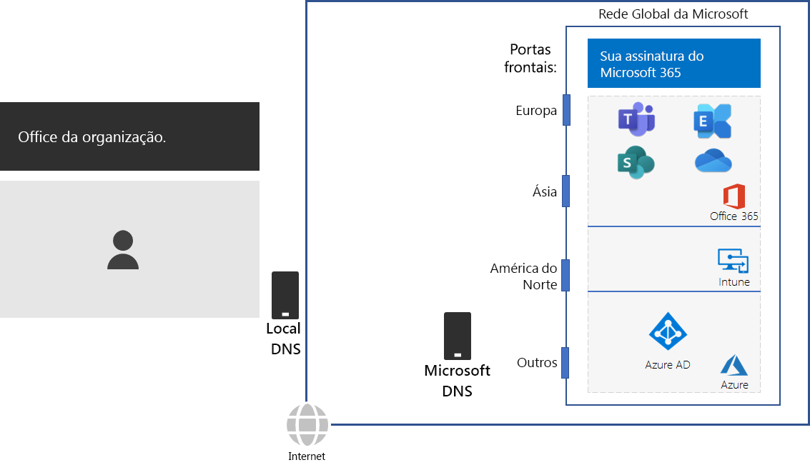
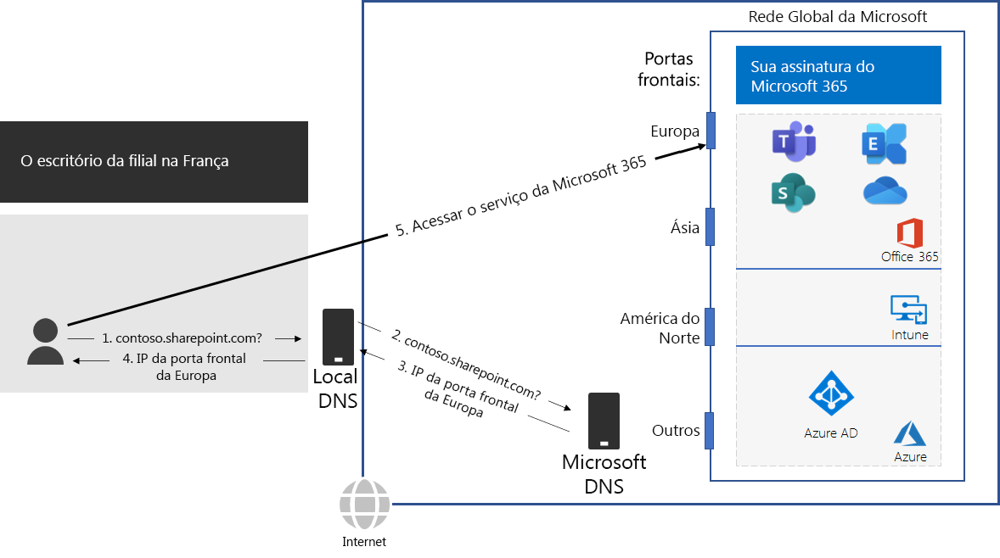

# Etapa 2: Configurar conexões locais com a Internet para cada escritório

*Esta etapa é obrigatória e se aplica para as versões E3 e E5 do Microsoft 365 Enterprise*

Na Etapa 2, você verifica se cada um dos escritórios tem conexões de Internet locais e usa servidores DNS locais. Esses dois elementos são necessários para reduzir a latência da conexão e garantir que os computadores clientes locais façam conexões com o ponto de entrada mais próximo dos serviços baseados em nuvem do Microsoft 365.

Em redes tradicionais para grandes organizações, o tráfego da Internet viaja pelo backbone da rede até uma conexão de Internet central. Isso não funciona bem para otimizar o desempenho de uma infraestrutura de Software como Serviço (SaaS) distribuída globalmente, que inclui os produtos do Office 365 e do Intune no Microsoft 365.

A Rede Global da Microsoft inclui uma infraestrutura de *Porta Frontal de Serviço Distribuído*, uma borda de rede altamente disponível e escalonável com locais distribuídos geograficamente. Ele finaliza as conexões do usuário final em um servidor de front-end e roteia com eficiência o tráfego do usuário final dentro da Rede Global da Microsoft.

Para obter o melhor desempenho, os clientes locais devem acessar um servidor de front-end que esteja geograficamente mais próximo deles, em vez de enviar o tráfego por um backbone de rede e ao servidor de front-end mais próximo da conexão central com a Internet da organização.

Veja um exemplo.

Quando um usuário na filial de Paris deseja acessar um site do SharePoint Online:

1. Ele envia uma consulta DNS para resolver um nome, como contoso.sharepoint.com. 
2. O servidor DNS fornecido pelo ISP encaminha essa consulta para um servidor DNS da Microsoft.
3. Os servidores DNS da Microsoft correspondem ao endereço IP de origem da consulta DNS encaminhada à região do mundo atribuída ao endereço. O servidor DNS da Microsoft responde com o endereço IP da front-end de Rede da Microsoft mais próxima na Europa.
4. O servidor DNS do ISP envia esse endereço IP para o usuário.
5. O usuário inicia uma conexão com o servidor do SharePoint pela front-end da Europa.

Para direcionar uma solicitação de cliente ao servidor de front-end geograficamente mais próximo, os servidores DNS da Microsoft usam as consultas DNS correspondentes à solicitação de conexão inicial do cliente.  Portanto, para a menor latência de rede mais baixa:

- Todos os escritórios da organização devem ter conexões de Internet locais para o tráfego de rede da categoria [Otimizar](https://docs.microsoft.com/office365/enterprise/office-365-network-connectivity-principles#new-office-365-endpoint-categories).
- Cada conexão de Internet local deve estar usando um servidor DNS local regionalmente para o tráfego de saída da Internet desse local.

Para saber mais, confira [Enviar conexões de rede de saída localmente](https://docs.microsoft.com/office365/enterprise/office-365-network-connectivity-principles#egress-network-connections-locally). 

Para testar o quão perto você está de um ponto de entrada da rede global da Microsoft e o quão perto você está do ponto em que a rede da sua organização se conecta ao seu ISP, use a [ferramenta de Integração de Rede do Office 365](https://connectivity.office.com/).

Como um ponto de verificação provisório, é possível ver os [critérios de saída](networking-exit-criteria.md#crit-networking-step2) para esta etapa.

## Próxima etapa

|||
|:-------|:-----|
||[Evitar hairpins de rede](networking-avoid-network-hairpins.md)|
