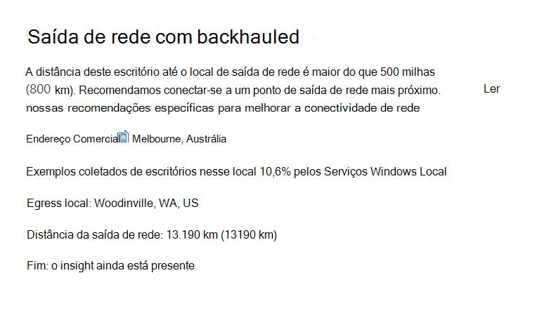
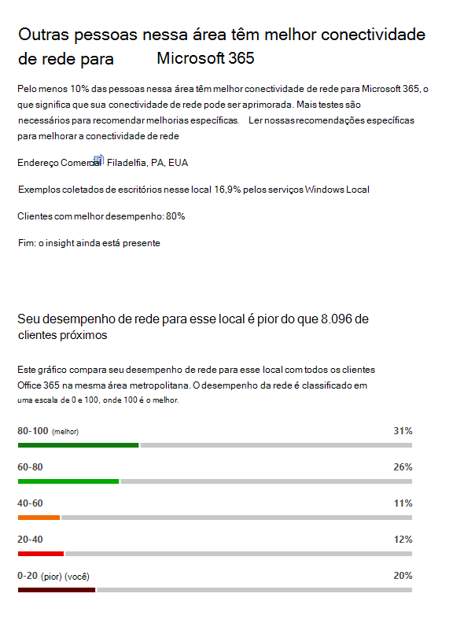
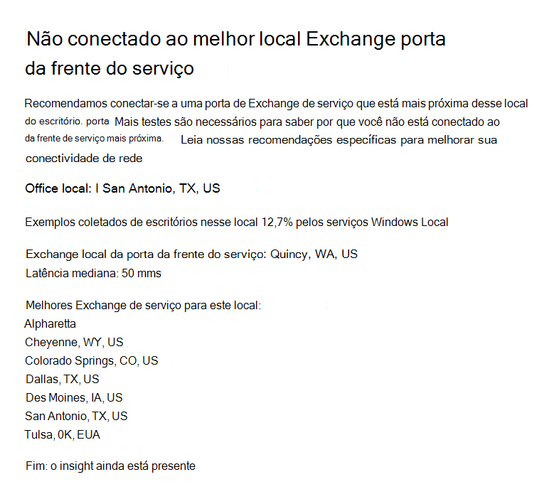
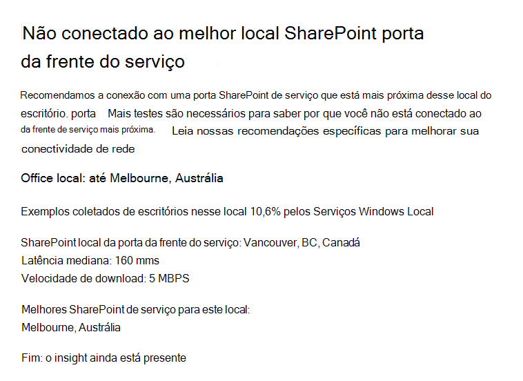

# Microsoft 365 Insights de rede

**As percepções de** rede são métricas de desempenho coletadas do seu locatário Microsoft 365 e disponíveis para exibição somente por usuários administrativos em seu locatário. Insights são exibidos no Centro de administração Microsoft 365 em <https://portal.microsoft.com/adminportal/home#/networkperformance> .

Os insights destinam-se a ajudar a projetar perímetros de rede para seus locais de escritório. Cada insight fornece detalhes ao vivo sobre as características de desempenho para um problema comum específico para cada local geográfico em que os usuários estão acessando seu locatário.

Há seis percepções de rede específicas que podem ser mostradas para cada local do escritório:

- [Saída de rede com backhauled](#backhauled-network-egress)
- [Dispositivo intermediário de rede](#network-intermediary-device)
- [Melhor desempenho detectado para clientes próximos a você](#better-performance-detected-for-customers-near-you)
- [Uso de uma porta de Exchange Online de serviço não ideal](#use-of-a-non-optimal-exchange-online-service-front-door)
- [Uso de uma porta de entrada de serviço SharePoint Online não ideal](#use-of-a-non-optimal-sharepoint-online-service-front-door)
- [Baixa velocidade de download SharePoint porta da frente](#low-download-speed-from-sharepoint-front-door)
- [Saída de rede ideal do usuário da China](#china-user-optimal-network-egress)

Há duas percepções de rede de nível de locatário que podem ser mostradas para o locatário. Elas também aparecem nas páginas de pontuação de produtividade:

- [Exchange conexões amostradas impactadas por problemas de conectividade](#exchange-sampled-connections-impacted-by-connectivity-issues)
- [SharePoint conexões amostradas impactadas por problemas de conectividade](#sharepoint-sampled-connections-impacted-by-connectivity-issues)

>[!IMPORTANT]
>Percepções de rede, recomendações de desempenho e avaliações no Centro de Administração do Microsoft 365 está atualmente em status de visualização e está disponível apenas para locatários de Microsoft 365 que foram inscritos no programa de visualização de recursos.

## Saída de rede com backhauled

Esse insight será exibido se o serviço de insights de rede detectar que a distância de um determinado local do usuário para a saída da rede é maior do que 800 milhas (800 km), indicando que o tráfego Microsoft 365 está sendo reagredido para um dispositivo ou proxy de borda da Internet comum.

Esse insight é abreviado como "Egress" em alguns exibições de resumo.

> [!div class="mx-imgBorder"]
> 

### O que isso significa?

Isso identifica que a distância entre o local do escritório e a saída de rede é de mais de 800 km (800 km). O local do escritório é identificado por um local do computador cliente ofuscado e o local de saída de rede é identificado usando o Endereço IP reverso para bancos de dados de localização. O local do escritório pode ser impreciso se Windows Serviços de Localização estiver desabilitado em máquinas. O local de saída de rede pode ser impreciso se as informações do banco de dados de endereço IP reverso não são imprecisas.

Os detalhes desse insight incluem o local do escritório, a porcentagem estimada do total de usuários do locatário no local, o local de saída de rede atual, a relevância do local de saída, a distância entre o local e o ponto de saída atual, a data em que a condição foi detectada pela primeira vez e a data em que a condição foi resolvida.

### O que devo fazer?

Para esse insight, recomendamos a saída de rede mais perto do local do office para que a conectividade possa roteá-lo de forma ideal para a rede global da Microsoft e para a porta de entrada de serviço de Microsoft 365 mais próxima. Ter uma saída de rede próxima aos locais de escritório dos usuários também permite melhorar o desempenho no futuro, à medida que a Microsoft expande os pontos de presença da rede e Microsoft 365 portas de frente do serviço no futuro.

Para obter mais informações sobre como resolver esse problema, consulte [Egress conexões](microsoft-365-network-connectivity-principles.md#egress-network-connections-locally) de rede localmente Office 365 Princípios de Conectividade [de Rede.](microsoft-365-network-connectivity-principles.md)

## Dispositivo intermediário de rede

Esse insight será exibido se detectarmos dispositivos entre seus usuários e a rede da Microsoft, o que pode afetar a experiência Office 365 usuário. É recomendável que eles sejam ignorados para tráfego de rede Microsoft 365 específico destinado a datacenters da Microsoft. Esta recomendação é descrita adicionalmente em [Microsoft 365 Princípios de Conectividade de Rede.](microsoft-365-network-connectivity-principles.md) 

Um insight intermediário de rede que mostramos é a quebra e a inspeção de SS Office 365 L quando pontos de extremidade de rede críticos para Exchange, SharePoint e Teams são interceptados e descriptografados por dispositivos intermediários de rede.

### O que isso significa?

Dispositivos intermediários de rede, como servidores proxy, VPNs e dispositivos de prevenção contra perda de dados, podem afetar o desempenho e a estabilidade Microsoft 365 clientes em que o tráfego é intermediário.

### O que devo fazer?

Configure o dispositivo intermediário de rede detectado para ignorar o processamento para Microsoft 365 de rede.

## Melhor desempenho detectado para clientes próximos a você

Esse insight será exibido se o serviço de insights de rede detectar que um número significativo de clientes em sua área de metro tem melhor desempenho do que os usuários em sua organização neste local do escritório.

Esse insight é abreviado como "Pares" em alguns pontos de exibição de resumo.

> [!div class="mx-imgBorder"]
> 

### O que isso significa?

Essa visão examina o desempenho agregado dos clientes Microsoft 365 na mesma cidade que esse local do escritório. Esse insight será exibido se a latência média de seus usuários for 10% maior do que a latência média de locatários vizinhos.

### O que devo fazer?

Pode haver muitos motivos para essa condição, incluindo latência em sua rede corporativa ou ISP, gargalos ou problemas de design de arquitetura. Examine a latência entre cada salto na rota entre sua rede do office e a porta Microsoft 365 atual. Para obter mais informações, [consulte Microsoft 365 Princípios de Conectividade de Rede](microsoft-365-network-connectivity-principles.md).

## Uso de uma porta de Exchange Online de serviço não ideal

Esse insight será exibido se o serviço de insights de rede detectar que os usuários em um local específico não estão se conectando a uma porta de Exchange Online de serviço ideal.

Esse insight é abreviado como "Roteamento" em alguns exibições de resumo.

> [!div class="mx-imgBorder"]
> 

### O que isso significa?

Listamos Exchange Online de serviço que são adequadas para uso na cidade de local do escritório com bom desempenho. Se o teste atual mostrar o uso de uma porta de Exchange Online de serviço não nesta lista, então chamaremos essa recomendação.

### O que devo fazer?

O uso de uma porta de entrada de serviço não ideal Exchange Online pode ser causado por backhaul de rede antes da saída da rede corporativa, nesse caso, recomendamos saída de rede local e direta. Ele também pode ser causado pelo uso de um servidor de Resolver Recursivo DNS remoto, nesse caso, recomendamos alinhar o servidor resolvedor recursivo DNS com a saída de rede.

## Uso de uma porta de entrada de serviço SharePoint Online não ideal

Esse insight será exibido se o serviço de insights de rede detectar que os usuários em um local específico não estão se conectando à porta de entrada de serviço mais próxima SharePoint Online.

Esse insight é abreviado como "Afd" em alguns pontos de exibição de resumo.

> [!div class="mx-imgBorder"]
> 

### O que isso significa?

Identificamos a porta SharePoint de serviço Online à qual o cliente de teste está se conectando. Em seguida, para a cidade de localização do escritório, comparamos isso com a porta de SharePoint de serviço online esperada para essa cidade. Se ele não corresponder, faremos essa recomendação.

### O que devo fazer?

O SharePoint uso de uma porta de entrada de serviço online não ideal pode ser causado por backhaul de rede antes da saída da rede corporativa, nesse caso, recomendamos saída de rede local e direta. Ele também pode ser causado pelo uso de um servidor de Resolver Recursivo DNS remoto, nesse caso, recomendamos alinhar o servidor resolvedor recursivo DNS com a saída de rede.

## Baixa velocidade de download SharePoint porta da frente

Esse insight será exibido se o serviço de insights de rede detectar que a largura de banda entre o local do escritório específico e o SharePoint Online é inferior a 1 MBps.

Esse insight é abreviado como "Produtividade" em alguns pontos de exibição de resumo.

### O que isso significa?

A velocidade de download que um usuário pode obter do SharePoint Online e OneDrive for Business de serviço é medida em megabytes por segundo (MBps). Se esse valor for menor que 1 MBps, forneceremos esse insight.

### O que devo fazer?

Para melhorar as velocidades de download, a largura de banda pode precisar ser aumentada. Como alternativa, pode haver congestionamento de rede entre máquinas de usuário no local do escritório e a porta de entrada do serviço SharePoint Online. Isso às vezes é chamado de perda congestiva e restringe a velocidade de download disponível para os usuários, mesmo se a largura de banda suficiente estiver disponível.

## Saída de rede ideal do usuário da China

Essa visão será exibida se sua organização tiver usuários na China se conectando ao seu locatário Microsoft 365 locatário em outras localizações geográficas. 

### O que isso significa?

Se sua organização tiver conectividade WAN privada, recomendamos configurar um circuito WAN de rede de seus locais de escritório na China que tenha saída de rede para a Internet em qualquer um dos seguintes locais:

- Hong-Kong
- Japão
- Taiwan
- Coreia do Sul
- Cingapura
- Malásia

A Saída da Internet mais longe dos usuários do que esses locais reduzirá o desempenho, e a saída na China pode causar problemas de alta latência e conectividade devido ao congestionamento entre fronteiras.

### O que devo fazer?

Para obter mais informações sobre como mitigar problemas de desempenho relacionados a esse insight, consulte Microsoft 365 otimização de desempenho do locatário [global para usuários da China.](microsoft-365-networking-china.md)

## Exchange conexões amostradas impactadas por problemas de conectividade

Esse insight mostrará quando 50% ou mais das conexões amostradas são impactadas. O impacto é definido pela avaliação Exchange inferior a 60% para cada amostra.

### O que isso significa?

É uma indicação de que a maioria dos seus usuários provavelmente está enfrentando problemas de experiência do usuário com Outlook se conectar ao Exchange Online. A porcentagem de amostras provavelmente representa a porcentagem de usuários que mostram abaixo de 60 pontos.  

### O que devo fazer?

Habilita a visibilidade de conectividade de rede de localização do escritório se você ainda não tiver feito isso. Você deseja identificar quais escritórios são afetados pela conectividade de rede ruim que está afetando Exchange e encontrar maneiras de melhorar o perímetro de rede em cada um que conecta os usuários à rede da Microsoft.

## SharePoint conexões amostradas impactadas por problemas de conectividade

Esse insight mostrará quando 50% ou mais das conexões amostradas são impactadas. O impacto é definido pela avaliação SharePoint inferior a 40% para cada amostra.

### O que isso significa?

É uma indicação de que a maioria dos seus usuários provavelmente está enfrentando problemas de experiência do usuário com SharePoint e OneDrive. A porcentagem de amostras provavelmente representa a porcentagem de usuários que mostram abaixo de 40 pontos.  

### O que devo fazer?

Habilita a visibilidade de conectividade de rede de localização do escritório se você ainda não tiver feito isso. Você deseja identificar quais escritórios são afetados pela conectividade de rede ruim que está afetando SharePoint e encontrar maneiras de melhorar o perímetro de rede em cada um que conecta os usuários à rede da Microsoft.

## Tópicos relacionados

[Conectividade de rede no Microsoft 365 Admin Center (visualização)](office-365-network-mac-perf-overview.md)

[Microsoft 365 de rede (visualização)](office-365-network-mac-perf-score.md)

[Microsoft 365 de teste de conectividade de rede (visualização)](office-365-network-mac-perf-onboarding-tool.md)

[Microsoft 365 Serviços de Localização de Conectividade de Rede (visualização)](office-365-network-mac-location-services.md)
