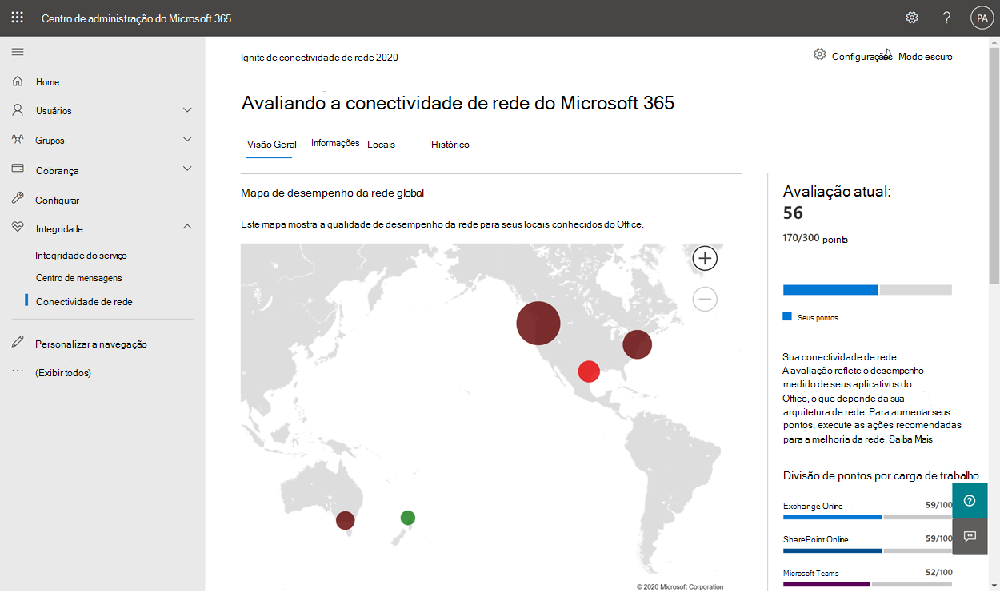
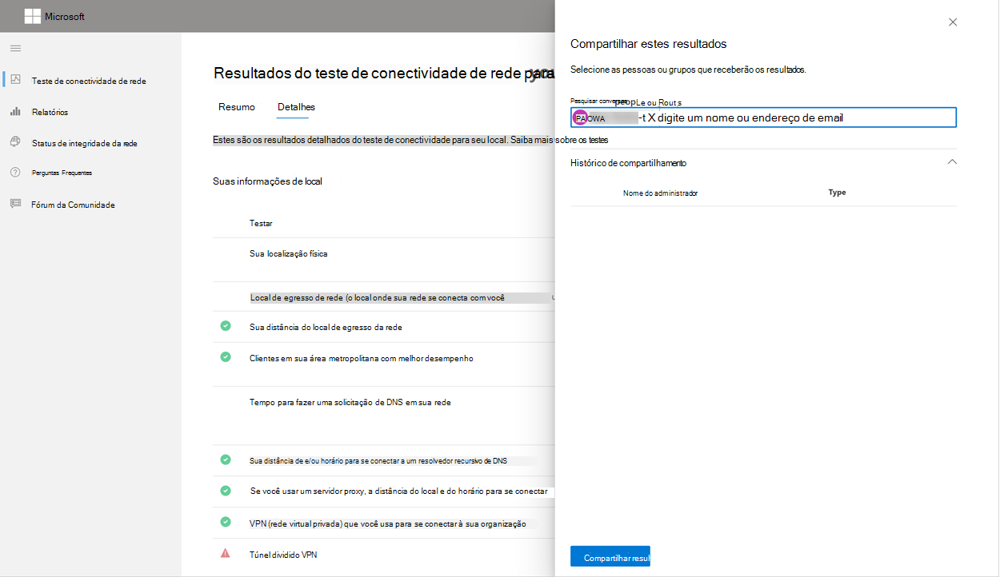
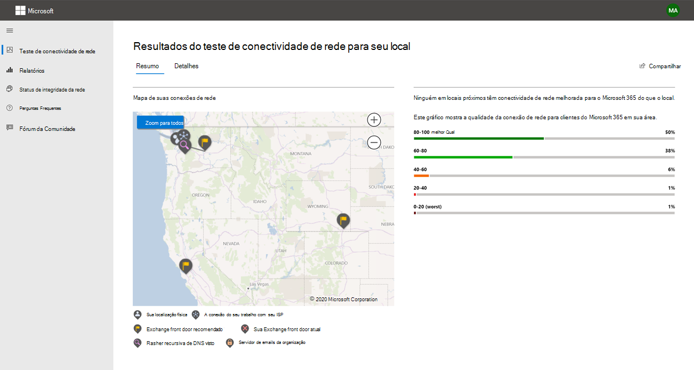
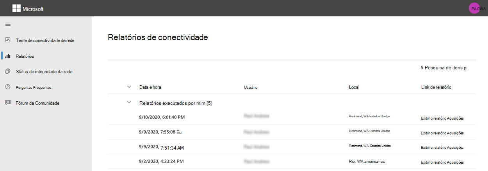
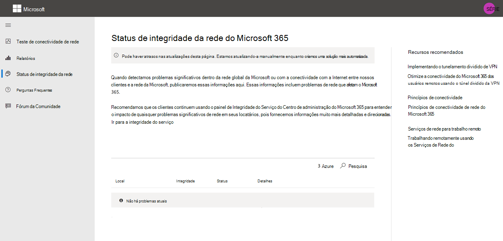

# Teste de conectividade de rede do Microsoft 365 (versão prévia)

A ferramenta de teste de conectividade de rede 365 da Microsoft está localizada em <https://connectivity.office.com> . É uma ferramenta do adjunct para as informações de avaliação de rede e insights de rede disponíveis no centro de administração do Microsoft 365 sob o **| ** Menu de conectividade.

>[!NOTE]
>A ferramenta de teste de conectividade de rede suporta locatários no WW Commercial e na Alemanha, mas não GCC moderada, GCC alta, DoD ou China.

Os insights de rede no centro de administração do Microsoft 365 são baseados em medidas regulares no produto para seu locatário do Microsoft 365 que são agregados a cada dia. Em comparação, os insights de rede do teste de conectividade de rede do Microsoft 365 são executados localmente e uma vez na ferramenta. Os testes que podem ser realizados no produto são limitados e executando testes locais para o usuário podem ser coletados, resultando em insights mais aprofundados. Considere que o insights de rede no centro de administração do Microsoft 365 mostrará que há um problema de rede para uso do Microsoft 365 em um local específico do escritório. O teste de conectividade do 365 da Microsoft pode ajudar a identificar a causa raiz do problema que leva a uma ação recomendada de melhoria do desempenho da rede.

Recomendamos que eles sejam usados em conjunto, onde o status de qualidade da rede pode ser avaliado para cada local do escritório no centro de administração do Microsoft 365 e mais específicos podem ser encontrados após a implantação do teste com base no teste de conectividade 365 da Microsoft.

>[!IMPORTANT]
>Os insights de rede, as recomendações de desempenho e as avaliações no centro de administração do Microsoft 365 estão atualmente no status de visualização e só estão disponíveis para os locatários do Microsoft 365 que foram registrados no programa de visualização de recurso.

## O aplicativo cliente de testes avançados

Há duas partes no teste de conectividade de rede do Microsoft 365; o site da Web <https://connectivity.office.com> e um aplicativo cliente do Windows para download que executa testes de conectividade de rede avançados. A maioria dos testes exige que o aplicativo seja executado. Ele preencherá os resultados de volta para a página da Web à medida que ele é executado.

Você será solicitado a baixar o aplicativo de teste avançado de cliente do site após a conclusão dos testes de navegador da Web. Abra e execute o arquivo quando solicitado.

## Compartilhando seu relatório de teste

O relatório de teste requer entrada na sua conta do Office 365. O administrador seleciona como você pode compartilhar seu relatório de teste.

### Compartilhando seu relatório com o administrador

Todos os relatórios de teste enquanto você está conectado são compartilhados com o administrador.

### Compartilhamento com sua equipe de conta da Microsoft, suporte ou outras pessoas

Relatórios de teste, excluindo qualquer identificação pessoal são compartilhados com funcionários da Microsoft. Isso é habilitado por padrão e pode ser desabilitado pelo administrador no **| Página conectividade de rede** no centro de administração do Microsoft 365.

### Compartilhamento com outros usuários que entram no mesmo locatário do Office 365

Você pode escolher os usuários para compartilhar seu relatório com o e este é habilitado por padrão. Ele também pode ser desabilitado pelo administrador.

### Compartilhamento com qualquer pessoa usando um link de ReportID

Você pode compartilhar seu relatório de teste com qualquer pessoa fornecendo acesso a um link de ReportID. Isso gera uma URL que você pode enviar para alguém para que eles possam exibir o relatório de teste sem entrar. Isso é desabilitado por padrão e deve ser habilitado pelo administrador.

## Resultados do teste de conectividade de rede

Os resultados são exibidos nas guias **Resumo** e **detalhes** . A guia Resumo mostra um mapa do perímetro de rede detectado e uma comparação entre a avaliação de rede e outros clientes do Office 365 próximos. Também permite o compartilhamento do relatório de teste. Veja a aparência dos resultados de resumo.

Veja um exemplo da saída da guia detalhes que a ferramenta mostra. Na guia detalhes, mostramos uma marca de seleção de círculo verde se o resultado foi comparado de forma favorável a um limite. Mostramos um ponto de exclamação de triângulo vermelho se o resultado exceder um limite indicando uma percepção de rede. As seções a seguir descrevem cada uma das linhas de resultados da guia detalhes e explica os limites usados para o insights de rede.

### Suas informações de local

Esta seção mostra os resultados do teste relacionados à sua localização.

#### Seu local

O local do usuário é detectado do navegador da Web usuários ou pode ser digitado na opção usuários. É usado para identificar as distâncias da rede para partes específicas do perímetro da rede corporativa. Somente a cidade dessa detecção de local e a distância para outros pontos de rede são salvas no relatório.

O local do escritório do usuário é mostrado no modo de exibição de mapa.

#### Local de egresso de rede (o local onde sua rede se conecta ao seu ISP)

Identificamos o endereço IP de egresso de rede no lado do servidor. Os bancos de dados de local são usados para pesquisar o local aproximado da saída da rede. Esses bancos de dados geralmente têm uma precisão de cerca de 90% dos endereços IP. Se o local procurado do endereço IP de egresso da rede não for preciso, isso levaria a um resultado falso desse teste. Para validar se esse erro está ocorrendo para um endereço IP específico, você pode usar sites locais de endereço IP de rede acessível publicamente para comparar o seu local real.

#### Sua distância do local de egresso da rede

Determinamos a distância desse local para o local do escritório. Isso é mostrado como uma visão de rede se a distância for maior do que **500 milhas** (800 quilômetros), já que provavelmente aumentará a latência TCP em mais de 25ms e poderá afetar a experiência do usuário.

O local de egresso de rede é mostrado no modo de exibição de mapa e conectado ao local do escritório do usuário, indicando a rede backhaul dentro da WAN corporativa.

A implementação da saída local e direta da rede do usuário locais do Office para a Internet é recomendada para a conectividade de rede do Microsoft 365. Os aprimoramentos de egresso local e direto são a melhor maneira de abordar esta percepção de rede.

#### Informações do servidor proxy

Identificamos os servidores proxy configurados na máquina local. Identificamos se qualquer um deles está configurado no caminho de rede para otimizar categoria de tráfego de rede do Microsoft 365. Identificamos a distância do local do escritório do usuário para os servidores proxy. A distância é testada primeiro pelo ping ICMP e, se isso falhar, testaremos com o ping TCP e, se isso falhar, Pesquisaremos o endereço IP do servidor proxy em um banco de dados de localização de endereços IP. Mostraremos uma visão da rede se o servidor proxy for mais de **500 milhas** (800 quilômetros) longe do local do escritório do usuário.

#### VPN (rede virtual privada) que você usa para se conectar à sua organização

Isso detectará se você estiver usando uma VPN para se conectar ao Office 365. Um resultado de passagem mostrará se você não tem nenhuma VPN ou se você tem uma VPN com a configuração de túnel dividido recomendada para o Office 365.

#### Túnel dividido VPN

Cada rota de categoria otimizada para o Exchange Online, o SharePoint Online e o Microsoft Teams é testada para ver se é tunnelled na VPN ou não. Uma carga de trabalho dividida evita a VPN completamente. Uma carga de trabalho do tunnelled é enviada pela VPN. Uma carga de trabalho seletiva tunnelled tem algumas rotas enviadas pela VPN e algumas divididas. Um resultado de passagem mostrará se todas as cargas de trabalho estão divididas ou tunnelleds de forma seletiva.

#### Clientes em sua área metropolitana com melhor desempenho

A latência de TCP da rede do local do escritório do usuário para a porta do serviço do Exchange Online é comparada a outros clientes do Microsoft 365 na mesma área de metrô. Uma visão da rede é mostrada se 10% ou mais clientes na mesma área de metrô têm melhor desempenho. Isso significa que seus usuários terão um desempenho melhor na interface de usuário do Microsoft 365.

Essa visão da rede é gerada com base no modo como todos os usuários em uma cidade têm acesso à mesma infraestrutura de telecomunicações e à mesma proximidade aos circuitos da Internet e à rede da Microsoft.

#### Tempo para fazer uma solicitação de DNS em sua rede

Isso mostra o servidor DNS configurado no computador cliente que executou os testes. Pode ser um servidor de resolvedor recursivo DNS, mas isso não é comum. É mais provável que seja um servidor de encaminhador de DNS que armazene em cache os resultados DNS e encaminhe qualquer solicitação DNS não armazenada em cache para outro servidor DNS.

Isso é fornecido apenas para informações e não contribui para qualquer percepção de rede.

#### Sua distância de e/ou horário para se conectar a um resolvedor recursivo de DNS

O resolvedor de DNS recursivo em uso é identificado fazendo uma solicitação DNS específica e, em seguida, solicitando ao servidor de nomes DNS o endereço IP para o qual recebeu a mesma solicitação. Esse endereço IP é o resolvedor de DNS recursivo e será pesquisado em bancos de dados de local de endereço IP para localizar o local. A distância entre o local do escritório do usuário e o local do servidor do resolvedor recursivo de DNS é calculada. Isso será mostrado como uma percepção de rede se a distância for maior do que **500 milhas** (800 quilômetros).

O local procurado do endereço IP de egresso da rede pode não ser preciso, e isso levaria a um resultado falso desse teste. Para validar se esse erro está ocorrendo para um endereço IP específico, você pode usar sites locais de endereço IP da rede acessível publicamente.

Esta visão da rede afetará especificamente a seleção da porta frontal do serviço do Exchange Online. Para resolver esta percepção local e a egresso da rede direta deve ser um pré-requisito e, em seguida, o resolvedor recursivo de DNS deve estar localizado próximo dessa saída da rede.

### Exchange Online

Esta seção mostra os resultados do teste relacionados ao Exchange Online.

#### Local da porta frontal do serviço Exchange

A porta frontal de serviço do Exchange em uso é identificada da mesma maneira que o Outlook faz isso e, em seguida, medemos a latência de TCP de rede do local do usuário para ele. A latência TCP é mostrada e a porta frontal de serviço do Exchange em uso é comparada com a lista de melhores portas de serviço para o local atual. Isso será mostrado como uma percepção de rede se uma das melhores portas de serviço do Exchange não estiver em uso.

Não usar uma das melhores portas (s) de serviço do Exchange pode ser causado por backhaul de rede antes da saída da rede corporativa, caso recomendamos a saída local e direta da rede. Também pode ser causado pelo uso de um servidor de resolvedor de DNS recursivo remoto, caso recomendamos alinhar o servidor do resolvedor de DNS recursivo com a saída da rede.

Calculamos uma possível melhoria na latência de TCP (MS) para a porta frontal de serviço do Exchange. Isso é feito examinando a latência da rede de local do escritório do usuário testado e subtraindo a latência da rede do local atual para a porta frontal do serviço de armários do Exchange. A diferença representa a oportunidade potencial de melhoria.

#### Melhores portas (s) de serviço do Exchange para seu local

Isso lista os melhores locais de porta frontal do serviço do Exchange por cidade para seu local.

#### Porta frontal do serviço registrada no DNS do cliente

Isso mostra o nome DNS e o endereço IP do servidor de porta frontal de serviço do Exchange ao qual você foi direcionado. Ele é fornecido apenas para informações e não há nenhuma percepção de rede associada.

### SharePoint Online

Esta seção mostra os resultados do teste relacionados ao SharePoint Online e ao OneDrive.

#### O local da porta frontal do serviço

A porta frontal de serviço do SharePoint em uso é identificada da mesma maneira que o cliente do OneDrive e que medemos a latência de TCP de rede do local do escritório do usuário para ele.

#### Velocidade de download

Medimos a velocidade de download de um arquivo 15Mb da porta frontal do serviço do SharePoint. O resultado é mostrado em megabytes por segundo para indicar qual arquivo de tamanho em megabytes pode ser baixado do SharePoint ou do OneDrive em **um segundo**. O número deve ser semelhante a um décimo da largura de banda mínima do circuito em megabits por segundo. Por exemplo, se você tiver uma conexão com 100 Mbps, poderá esperar 10 megabytes por segundo (10MBps).

#### Inchar de buffer

Durante o download do 15Mb, medimos a latência TCP para a porta frontal do serviço do SharePoint. Essa é a latência sob carga e é comparada com a latência quando não está sob carregamento. O aumento na latência quando o carregamento é freqüentemente atribuível aos buffers de dispositivo de rede do consumidor que estão sendo carregados (ou essumidos). Uma visão da rede é mostrada para qualquer infla de 1.000 ou mais.

#### Porta frontal do serviço registrada no DNS do cliente

Isso mostra o nome DNS e o endereço IP do servidor de porta frontal do serviço do SharePoint ao qual você foi direcionado. Ele é fornecido apenas para informações e não há nenhuma percepção de rede associada.

### Microsoft Teams

Esta seção mostra os resultados do teste relacionados ao Microsoft Teams.

#### Conectividade de mídia (compartilhamento de áudio, vídeo e aplicativos)

Isso testa a conectividade UDP para a porta frontal do serviço do Microsoft Teams. Se isso for bloqueado, o Microsoft Teams ainda poderá funcionar usando TCP, mas o áudio e o vídeo serão prejudicados. Leia mais sobre essas medidas de rede UDP que também se aplicam ao Microsoft Teams em [qualidade de mídia e desempenho de conectividade de rede no Skype for Business online](https://docs.microsoft.com/skypeforbusiness/optimizing-your-network/media-quality-and-network-connectivity-performance)

#### Perda de pacote

Mostra a perda de pacotes UDP medida em uma chamada de áudio de teste de 10 segundos do cliente para a porta frontal do serviço do Microsoft Teams. Deve ser inferior a **1, 0%** para uma passagem.

### Latência

Mostra a latência de UDP medida, que deve ser inferior a **100 ms**.

#### Torção

Mostra a variação de UDP medida, que deve ser menor do que **30ms**.

#### Conectividade

Testamos a conectividade HTTP do local do escritório do usuário para todos os pontos de extremidade de rede do Microsoft 365 necessários. Eles são publicados em [https://aka.ms/o365ip](https://aka.ms/o365ip) . Uma visão da rede é mostrada para qualquer ponto de extremidade de rede necessário que não possa ser conectado.

A conectividade é bloqueada por um servidor proxy, firewall ou outro dispositivo de segurança de rede no perímetro de rede corporativa ou em uso como um proxy de nuvem.

Testamos o certificado SSL em cada ponto de extremidade de rede do Microsoft 365 necessário, que está na categoria otimizar ou permitir, conforme definido em [https://aka.ms/o365ip](https://aka.ms/o365ip) . Se algum teste não localizar um certificado SSL da Microsoft, a rede criptografada conectada deve ter sido interceptada por um dispositivo de rede intermediário. Uma visão da rede é mostrada em qualquer ponto de extremidade de rede criptografada interceptada.

Quando é encontrado um certificado SSL que não é fornecido pela Microsoft, mostramos o FQDN para o teste e o proprietário do certificado SSL em uso. Este proprietário de certificado SSL pode ser um fornecedor de servidor proxy ou pode ser um certificado de AutoAssinatura empresarial.

#### Caminho de rede

Esta seção mostra os resultados de um traceroute do ICMP para a porta frontal do serviço do Exchange Online, a porta frontal do serviço do SharePoint Online e a porta frontal do serviço do Microsoft Teams. Ele é fornecido apenas para informações e não há nenhuma percepção de rede associada. Há três traceroutes fornecidos. Um traceroute para o _Outlook.office365.com_, um traceroute para o front-end do SharePoint de clientes ou para o _Microsoft.SharePoint.com_ , se não tiver sido fornecido, e um traceroute para o _World.TR.Teams.Microsoft.com_.

## O que acontece em cada etapa de teste

### Identificação de local do escritório

Quando você clica no botão Executar teste, mostramos a página de teste em execução e identificamos o local do escritório. Você pode digitar o local por cidade, estado e país ou pode ser detectado do navegador da Web. Se você detectá-lo, solicitaremos a latitude e a longitude do navegador da Web e limitará a precisão a 300m por 300m antes de usar. Fazemos isso porque não é necessário identificar o local com mais precisão do que o edifício para o desempenho da rede. 

### Testes de JavaScript

Após a identificação de local do Office, executamos um teste de latência TCP no JavaScript e solicitamos dados do serviço sobre o uso e os servidores de porta frontal de serviço recomendados do Office 365. Quando elas forem concluídas, elas serão mostradas no mapa e na guia detalhes, onde poderão ser exibidas antes da próxima etapa.

### Baixar o aplicativo cliente de testes avançados

Em seguida, começamos o download do aplicativo cliente de testes avançados. Confiamos no usuário para iniciar o aplicativo cliente e também deve ter o .NET Core instalado.

### Iniciar o aplicativo cliente de testes avançados

Depois que o aplicativo cliente iniciar a página da Web será atualizada para mostrar isso e testar os dados começarão a ser recebidos para a página da Web. Ele atualiza sempre que novos dados são recebidos e você pode revisar os dados conforme eles chegam.

### Testes avançados concluídos e carregamento do relatório de teste

Depois que os testes forem concluídos, a página da Web e o cliente de testes avançados indicarão isso e, se o usuário estiver conectado, o relatório de teste será carregado para o locatário Customers.

## Relatórios de conectividade

Quando você estiver conectado, poderá revisar os relatórios anteriores que você executou. Você também pode compartilhá-los ou excluí-los da lista.

## Status de integridade da rede

Isso mostra problemas de integridade significativos com a rede global da Microsoft, que pode afetar os clientes do Microsoft 365.

## Perguntas frequentes

Aqui estão as respostas para algumas das nossas perguntas frequentes.

### Essa ferramenta é lançada e tem suporte da Microsoft?

No momento, é uma visualização e planejamos fornecer as atualizações regularmente até atingirmos o status de lançamento de disponibilidade geral com o suporte da Microsoft. Forneça comentários para nos ajudar a melhorar o. Estamos planejando publicar um guia de integração de rede mais detalhado do Office 365 como parte dessa ferramenta, que é personalizada para a organização pelos resultados do teste.

### O que é necessário para executar o cliente de teste avançado?

O cliente de teste avançado requer o tempo de execução do .NET Core 3,1 desktop. Se você executar o cliente de teste avançado sem o instalado, você será direcionado para [a página do instalador do .NET Core 3,1](https://dotnet.microsoft.com/download/dotnet-core/3.1). Certifique-se de instalar o tempo de execução da área de trabalho e não o SDK ou o tempo de execução do ASP.NET Core que estão mais altos na página. As permissões de administrador no computador são reuqired para instalar o .NET Core. 

### O que é o Microsoft 365 Service front door?

O Microsoft 365 Service front door é um ponto de entrada na rede global da Microsoft, onde os clientes e serviços do Office terminam suas conexões de rede. Para uma conexão de rede ideal para o Microsoft 365, é recomendável que sua conexão de rede seja encerrada na porta frontal mais próxima do Microsoft 365 em sua cidade ou metro.

Observação: o Microsoft 365 Service front door não tem relação direta com o produto de **serviço do Azure front door** disponível no Azure Marketplace.

### Qual é a melhor porta frontal de serviço do Microsoft 365?

Uma melhor porta do serviço do Microsoft 365 (anteriormente conhecida como porta frontal de serviço ideal) é aquela mais próxima à saída da sua rede, geralmente na sua cidade ou área de metrô. Use a ferramenta de desempenho de rede do Microsoft 365 para determinar o local da sua porta de entrada de serviço do Microsoft 365 no uso e a (s) melhores portas de serviço. Se a ferramenta determinar que sua porta frontal de uso é uma das melhores, você deverá esperar uma boa conectividade para a rede global da Microsoft.

### O que é um local de egresso na Internet?

O local de egresso de Internet é o local onde o tráfego de rede sai da rede corporativa e se conecta à Internet. Isso também é identificado como o local onde você tem um dispositivo NAT (conversão de endereço de rede) e, em geral, onde você se conecta com um provedor de serviços de Internet (ISP). Se você vir uma longa distância entre o local e o local de saída da Internet, isso poderá identificar um backhaul WAN significativo.

## Tópicos relacionados

[Recomendações de desempenho de rede no centro de administração do Microsoft 365 (versão prévia)](office-365-network-mac-perf-overview.md)

[Microsoft 365 Network Performance insights (versão prévia)](office-365-network-mac-perf-insights.md)

[Avaliação de rede do Microsoft 365 (versão prévia)](office-365-network-mac-perf-score.md)

[Serviços de local de conectividade de rede da Microsoft 365 (versão prévia)](office-365-network-mac-location-services.md)
