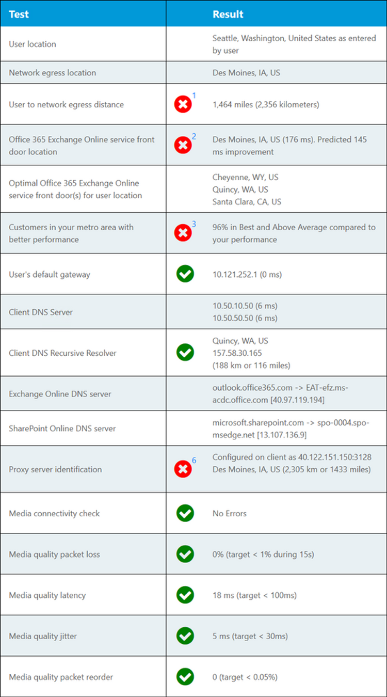

# Teste de conectividade do Microsoft 365 no centro de administração do Microsoft 365 (versão prévia)

O teste de conectividade 365 da Microsoft está localizado em <https://connectivity.office.com> . É uma ferramenta do adjunct para as informações de rede e informações de Pontuação de rede disponíveis no centro de administração do Microsoft 365 sob o **| Menu desempenho da rede** .

>[!NOTE]
>A ferramenta de integração oferece suporte a locatários no WW Commercial ou GCC moderado, mas não GCC alta, DoD, Alemanha ou China.

Os insights de rede no centro de administração do Microsoft 365 são baseados nas medidas no produto do Microsoft 365 locatário. Em comparação, os insights de rede do teste de conectividade do 365 da Microsoft são executados localmente na ferramenta. Os testes que podem ser realizados no produto são limitados e executando testes locais para o usuário podem ser coletados, resultando em insights mais aprofundados. Considere que o insights de rede no centro de administração do Microsoft 365 mostrará que há um problema de rede para uso do Microsoft 365 em um local específico do escritório. O teste de conectividade do 365 da Microsoft pode ajudar a identificar a causa raiz do problema que leva a uma ação recomendada de melhoria do desempenho da rede.

Recomendamos que eles sejam usados em conjunto, onde o status de qualidade da rede pode ser avaliado para cada local do escritório no centro de administração do Microsoft 365 e mais específicos podem ser encontrados após a implantação do teste com base no teste de conectividade 365 da Microsoft.

>[!IMPORTANT]
>Os insights de rede, as recomendações de desempenho e as avaliações no centro de administração do Microsoft 365 estão atualmente no status de visualização e só estão disponíveis para os locatários do Microsoft 365 que foram registrados no programa de visualização de recurso.

## O aplicativo cliente de testes avançados

Há duas partes no teste de conectividade 365 da Microsoft. Há <https://connectivity.office.com> um aplicativo cliente do Windows que pode ser baixado. O cliente baixável executa testes avançados de conectividade de rede e a maioria dos testes exige que isso seja executado.

Você pode executar o teste de cliente avançado no site da Web e ele preencherá os resultados de volta para a página da Web à medida que ele é executado.

## Local do escritório do usuário

O local do escritório do usuário é detectado do navegador da Web dos usuários. É usado para identificar as distâncias da rede para partes específicas do perímetro da rede corporativa.

O local do escritório do usuário é mostrado no modo de exibição de mapa.

## Distância para o local de egresso da rede

Identificamos o endereço IP de egresso de rede no lado do servidor. Os bancos de dados de local são usados para pesquisar o local aproximado da saída da rede e determinar a distância desse local para o local do escritório. Isso será mostrado como uma percepção de rede se a distância for maior do que 500 milhas (800 quilômetros).

O local de egresso de rede é mostrado no modo de exibição de mapa e conectado ao local do escritório do usuário, indicando a rede backhaul dentro da WAN corporativa.

O local procurado do endereço IP de egresso da rede pode não ser preciso, e isso levaria a um resultado falso desse teste. Para validar se esse erro está ocorrendo para um endereço IP específico, você pode usar sites locais de endereço IP da rede acessível publicamente.

A implementação da saída local e direta da rede do usuário locais do Office para a Internet é recomendada para a conectividade de rede do Microsoft 365. Os aprimoramentos de egresso local e direto são a melhor maneira de abordar esta percepção de rede.

## Porta frontal do serviço do Exchange Online

A porta de entrada do serviço do Exchange Online em uso é identificada da mesma maneira que o Outlook faz isso e que medemos a latência de TCP de rede do local do escritório do usuário para ele. Ambos são mostrados e a porta frontal de serviço no modo de uso do Exchange Online é comparada com a lista de portas de front-end ideais recomendadas para o local atual. Isso é mostrado como uma visão da rede se uma porta frontal do serviço do Exchange Online não ideal estiver em uso.

O uso de uma porta de entrada de serviço do Exchange Online não ideal pode ser causado pelo backhaul de rede antes da saída da rede corporativa, caso recomendamos a saída de rede local e direta. Também pode ser causado pelo uso de um servidor de resolvedor de DNS recursivo remoto, caso recomendamos alinhar o servidor do resolvedor de DNS recursivo com a saída da rede.

Calculamos uma possível melhoria na latência de TCP para a porta frontal do serviço Exchange Online. Isso é feito examinando a latência da rede de local do escritório do usuário testado e subtraindo a latência da rede do local atual para a porta frontal do serviço de armários do Exchange Online. A diferença representa a oportunidade potencial de melhoria.

## Comparação de desempenho de clientes na área

A latência de TCP da rede do local do escritório do usuário para a porta do serviço do Exchange Online é comparada a outros clientes do Microsoft 365 na mesma área de metrô. Uma visão da rede é mostrada se 10% ou mais clientes na mesma área de metrô têm melhor desempenho.

Essa visão da rede é gerada com base no modo como todos os usuários em uma cidade têm acesso à mesma infraestrutura de telecomunicações e à mesma proximidade aos circuitos da Internet e à rede da Microsoft.

## Em usar gateway padrão

O gateway padrão em uso é o roteador que o cliente de teste configurou para rotear conexões de rede TCP/IP.

Isso é fornecido apenas para informações e não contribui para qualquer percepção de rede.

## Em usar servidor (es) DNS

Isso mostra o servidor DNS configurado no computador cliente que executou os testes. Pode ser um servidor de resolvedor recursivo DNS, mas isso não é comum. É mais provável que seja um servidor de encaminhador de DNS que armazene em cache os resultados DNS e encaminhe qualquer solicitação DNS não armazenada em cache para outro servidor DNS.

Isso é fornecido apenas para informações e não contribui para qualquer percepção de rede.

## Servidor de resolução de DNS recursivo identificado

O resolvedor de DNS recursivo em uso é identificado fazendo uma solicitação DNS específica e, em seguida, solicitando ao servidor de nomes DNS o endereço IP para o qual recebeu a mesma solicitação. Esse endereço IP é o resolvedor de DNS recursivo e será pesquisado em bancos de dados de local de endereço IP para localizar o local. A distância entre o local do escritório do usuário e o local do servidor do resolvedor recursivo de DNS é calculada. Isso será mostrado como uma percepção de rede se a distância for maior do que 500 milhas (800 quilômetros).

O local procurado do endereço IP de egresso da rede pode não ser preciso, e isso levaria a um resultado falso desse teste. Para validar se esse erro está ocorrendo para um endereço IP específico, você pode usar sites locais de endereço IP da rede acessível publicamente.

Esta visão da rede afetará especificamente a seleção da porta frontal do serviço do Exchange Online. Para resolver esta percepção local e a egresso da rede direta deve ser um pré-requisito e, em seguida, o resolvedor recursivo de DNS deve estar localizado próximo dessa saída da rede.

## Pesquisa de DNS do servidor front-end do Exchange Online e do servidor front-end do SharePoint Online

Eles mostram o registro DNS da porta frontal de serviço para essas duas cargas de trabalho do Microsoft 365. Eles são fornecidos apenas para informações e não há idéias de rede associada.

## Identificação do servidor proxy

Identificamos os servidores proxy configurados na máquina local. Identificamos se qualquer um deles está configurado no caminho de rede para otimizar categoria de tráfego de rede do Microsoft 365. Identificamos a distância do local do escritório do usuário para os servidores proxy. A distância é testada primeiro pelo ping ICMP e, se isso falhar, testaremos com o ping TCP e, se isso falhar, Pesquisaremos o endereço IP do servidor proxy em um banco de dados de localização de endereços IP. Mostraremos uma visão da rede se o servidor proxy for mais de 500 milhas (800 quilômetros) longe do local do escritório do usuário.

## Verificações de qualidade de mídia

Este teste instala e executa a ferramenta de avaliação de rede do Skype for Business e interpreta os resultados. A ferramenta pode ser encontrada em [https://www.microsoft.com/download/details.aspx?id=53885](https://www.microsoft.com/download/details.aspx?id=53885) .

Estes são os testes de protocolo UDP usados pela funcionalidade de conferência e conferência de áudio e vídeo do Microsoft Teams. Testamos a perda de pacotes UDP, latência de rede UDP, tremulação de UDP e reordenação de pacotes UDP. Uma visão da rede será mostrada se qualquer um deles estiver acima do intervalo permitido.

## Testes de conectividade TCP

Testamos a conectividade HTTP do local do escritório do usuário para todos os pontos de extremidade de rede do Microsoft 365 necessários. Eles são publicados em [https://aka.ms/o365ip](https://aka.ms/o365ip) . Uma visão da rede é mostrada para qualquer ponto de extremidade de rede necessário que não possa ser conectado.

A conectividade é bloqueada por um servidor proxy, firewall ou outro dispositivo de segurança de rede no perímetro de rede corporativa ou em uso como um proxy de nuvem.

## Testes de interceptação SSL

Testamos o certificado SSL em cada ponto de extremidade de rede do Microsoft 365 necessário, que está na categoria otimizar ou permitir, conforme definido em [https://aka.ms/o365ip](https://aka.ms/o365ip) . Se algum teste não localizar um certificado SSL da Microsoft, a rede criptografada conectada deve ter sido interceptada por um dispositivo de rede intermediário. Uma visão da rede é mostrada em qualquer ponto de extremidade de rede criptografada interceptada.

Quando é encontrado um certificado SSL que não é fornecido pela Microsoft, mostramos o FQDN para o teste e o proprietário do certificado SSL em uso. Este proprietário de certificado SSL pode ser um fornecedor de servidor proxy ou pode ser um certificado de AutoAssinatura empresarial.

## Diagnóstico de caminho de rede

Esta seção mostra os resultados de um traceroute do ICMP para a porta frontal do serviço do Exchange Online, a porta frontal do serviço do SharePoint Online e a porta frontal do serviço do Microsoft Teams. Ele é fornecido apenas para informações e não há nenhuma percepção de rede associada.

## PERGUNTAS FREQÜENTES

Aqui estão as respostas para algumas das nossas perguntas frequentes.

### Essa ferramenta é lançada e tem suporte da Microsoft?

No momento, é uma prova de conceito e planejamos fornecer atualizações regularmente até que cheguemos ao status de lançamento de disponibilidade geral com o suporte da Microsoft. Forneça comentários para nos ajudar a melhorar o. Estamos planejando publicar um guia de integração de rede mais detalhado do Office 365 como parte dessa ferramenta, que é personalizada para a organização pelos resultados do teste.

### O que é o Microsoft 365 Service front door?

O Microsoft 365 Service front door é um ponto de entrada na rede global da Microsoft, onde os clientes e serviços do Office terminam suas conexões de rede. Para uma conexão de rede ideal para o Microsoft 365, é recomendável que sua conexão de rede seja encerrada na porta frontal mais próxima do Microsoft 365 em sua cidade ou metro.

Observação: o Microsoft 365 Service front door não tem relação direta com o produto "serviço de porta frontal do Azure" disponível no Azure Marketplace.

### Qual é a melhor porta de serviço do Microsoft 365?

Uma das melhores portas de serviço do Microsoft 365 é aquela mais próxima à sua rede de egresso, geralmente na cidade ou na área de metrô. Use a ferramenta de desempenho de rede do Microsoft 365 para determinar o local da sua porta de entrada de serviço do Microsoft 365 e a porta frontal de serviço ideal. Se a ferramenta determina que sua porta frontal de uso é ideal, então, você está se conectando de forma ideal à rede global da Microsoft.

### O que é um local de egresso na Internet?

O local de egresso de Internet é o local onde o tráfego de rede sai da rede corporativa e se conecta à Internet. Isso também é identificado como o local onde você tem um dispositivo NAT (conversão de endereço de rede) e, em geral, onde você se conecta com um provedor de serviços de Internet (ISP). Se você vir uma longa distância entre o local e o local de saída da Internet, isso poderá identificar um backhaul WAN significativo.

## Tópicos relacionados

[Recomendações de desempenho de rede no centro de administração do Microsoft 365 (versão prévia)](office-365-network-mac-perf-overview.md)

[Microsoft 365 Network Performance insights (versão prévia)](office-365-network-mac-perf-insights.md)

[Avaliação de rede do Microsoft 365 (versão prévia)](office-365-network-mac-perf-score.md)

[Serviços de local de conectividade de rede da Microsoft 365 (versão prévia)](office-365-network-mac-location-services.md)
