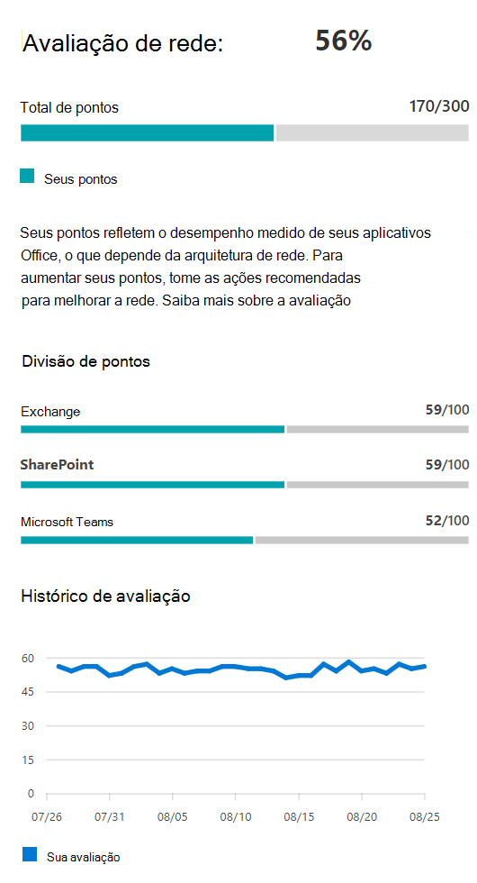

# Conectividade de rede no centro de administração do Microsoft 365 (versão prévia)

O centro de administração do Microsoft 365 agora inclui métricas de conectividade de rede agregadas coletadas do seu locatário do Microsoft 365 e disponíveis para visualização apenas por usuários administrativos em seu locatário.

**Avaliações de rede** e **insights de rede** são exibidos no centro de administração do Microsoft 365 em **Health | Conectividade**.

Você pode ser solicitado a participar da visualização pública desse recurso em nome da sua organização. A aceitação normalmente aconteceu imediatamente e, em seguida, você verá a página conectividade de rede. 

Ao navegar até a página conectividade de rede, você verá um painel Visão geral contendo um mapa de desempenho de rede global, uma avaliação de rede com escopo para o locatário inteiro e uma lista de problemas atuais. Para acessar essa página, você deve ser um administrador da organização no Microsoft 365. A função administrativa do leitor de relatórios terá acesso de leitura a essas informações. Para configurar locais e outros elementos de conectividade de rede, um administrador deve fazer parte de uma função de administrador de servidor, como a função de administrador de suporte de serviço. Na visão geral, você pode fazer uma busca detalhada para exibir as métricas e os problemas específicos de desempenho da rede por local. Para obter mais informações, consulte [visão geral da conectividade de rede no centro de administração do Microsoft 365](#network-connectivity-overview-in-the-microsoft-365-admin-center).

## Pré-requisitos para que as avaliações de conectividade de rede apareçam

Embora a conectividade de rede possa ser avaliada em toda a organização, qualquer aprimoramento de design de rede precisará ser feito para locais específicos do Office. As informações de conectividade de rede são fornecidas para cada local do escritório quando esses locais podem ser determinados. Há três opções para obter avaliações de rede de seus locais do Office:

### 1. habilitar os serviços de localização do Windows

Para esta opção, você deve ter pelo menos dois computadores executando em cada local do escritório que ofereçam suporte aos pré-requisitos. O OneDrive for Windows versão **19,232** ou superior deve estar instalado em cada computador. Para obter mais informações sobre as versões do OneDrive, consulte as [notas de versão do onedrive](https://support.office.com/article/onedrive-release-notes-845dcf18-f921-435e-bf28-4e24b95e5fc0). As medições de rede são planejadas para serem adicionadas em outros aplicativos cliente do Office 365 em um futuro próximo.

O serviço de localização do Windows deve ser consentido nas máquinas. Você pode testar isso executando o aplicativo **Maps** e localizando-se. Ela pode ser habilitada em uma única máquina com **as configurações | Privacidade | Local** onde a configuração _permitir que os aplicativos acessem seu local_ deve estar habilitada. O consentimento dos serviços de localização do Windows pode ser implantado em computadores usando o MDM ou a política de grupo com a configuração _LetAppsAccessLocation_.

Você não precisa adicionar locais no centro de administração com esse método, pois eles são identificados automaticamente na resolução da cidade. Você não pode mostrar vários locais do Office dentro de uma cidade usando os serviços de localização do Windows. As informações de local também são arredondadas para os 300 metros mais próximos de 300 metros antes de serem carregadas para que não seja possível acessar informações de local mais precisas.

As máquinas devem ter redes Wi-Fi, em vez de um cabo Ethernet. As máquinas com um cabo Ethernet não têm informações precisas sobre o local.

Os exemplos de medidas e locais do Office devem começar a aparecer 24 horas após os pré-requisitos terem sido atendidos.

### 2. Adicione locais e forneça informações de sub-rede de LAN

Para esta opção, não são necessários serviços de localização do Windows nem Wi-Fi. Você precisa do OneDrive for Windows versão **20,161** ou superior instalado em cada computador no local.

Você também precisa adicionar locais na página conectividade de rede do centro de administração ou importá-los de um arquivo CSV. Os locais adicionados devem incluir informações de sub-rede da LAN do Office.

Como você está adicionando os locais, é possível ter vários escritórios definidos em uma cidade.

Os exemplos de medidas e locais do Office devem começar a aparecer 24 horas após os pré-requisitos terem sido atendidos.

### 3. reúna manualmente relatórios de teste com a ferramenta de teste de conectividade de rede 365 da Microsoft

Para esta opção, você precisa identificar uma pessoa em cada local. Peça a eles para navegar até o [teste de conectividade de rede do Microsoft 365](https://connectivity.office.com) em um computador Windows no qual tenham permissões administrativas. No site, eles precisam entrar em sua conta do Office 365 para a mesma organização que você deseja ver os resultados. Em seguida, eles devem clicar em **Executar teste**. Durante o teste, há um executável de teste de conectividade baixado. Eles também precisam abrir e executar isso. Depois que os testes são concluídos, o resultado do teste é carregado para o Office 365.

Os relatórios de teste são vinculados a um local se ele tiver sido adicionado com informações de sub-rede da rede local, caso contrário, eles serão exibidos somente no local da cidade.

Amostras de medida e locais do Office devem começar a aparecer 2-3 minutos após um relatório de teste ser concluído. Para obter mais informações, consulte [o teste de conectividade de rede do Microsoft 365 (versão prévia)](office-365-network-mac-perf-onboarding-tool.md).

## Como usar essas informações?

Os **insights de rede**, suas recomendações de desempenho relacionadas e avaliações de rede têm a finalidade de ajudar na criação de perímetros de rede para seus locais do Office. Cada informação fornece detalhes sobre as características de desempenho para um problema comum específico para cada localização geográfica onde os usuários acessam o locatário. **Recomendações de desempenho** para cada percepção de rede oferecem alterações de design específicas de arquitetura de rede que você pode fazer para melhorar a experiência do usuário relacionada à conectividade de rede do Microsoft 365. A avaliação de rede mostra como a conectividade de rede impacta a experiência do usuário, permitindo a comparação de diferentes conexões de rede de local de usuário.

As **avaliações de rede** separam uma agregação de muitas métricas de desempenho de rede em um instantâneo da integridade da rede corporativa, representado por um valor de pontos de 0-100. As avaliações de rede têm o escopo para o locatário inteiro e para cada localização geográfica a partir da qual os usuários se conectam ao seu locatário, fornecendo aos administradores da Microsoft 365 uma maneira fácil de obter instantaneamente um Gestalt da integridade da rede da empresa e rapidamente se aprofundam em um relatório detalhado de qualquer local do escritório global.

As empresas complexas com vários locais do Office e arquiteturas de perímetro de rede não triviais podem se beneficiar dessas informações durante a integração inicial com o Microsoft 365 ou para corrigir problemas de desempenho de rede descobertos com o aumento do uso. Em geral, isso não é necessário para pequenas empresas que usam o Microsoft 365 ou qualquer empresa que já tenha conectividade de rede simples e direta. Empresas com mais de 500 usuários e vários locais do Office são mais beneficiadas.

>[!IMPORTANT]
>Os insights de rede, as recomendações de desempenho e as avaliações no centro de administração do Microsoft 365 estão atualmente no status de visualização e só estão disponíveis para os locatários do Microsoft 365 que foram registrados no programa de visualização de recurso.

## Desafios de conectividade de rede corporativa

Muitas empresas têm configurações de perímetro de rede que cresceram com o passar do tempo e foram basicamente projetadas para acomodar o acesso ao site da Internet para funcionários, onde a maioria dos sites não é conhecida e não é confiável. O foco predominante e necessário é evitar ataques de malware e pesca desses sites desconhecidos. Essa estratégia de configuração de rede, embora útil para fins de segurança, pode levar à degradação do desempenho do usuário do Microsoft 365 e da experiência do usuário.

## Como podemos resolver esses desafios

As empresas podem melhorar a experiência geral do usuário e proteger seu ambiente, seguindo os [princípios de conectividade do Office 365](https://aka.ms/pnc) e usando o recurso conectividade de rede do centro de administração do Microsoft 365. Na maioria dos casos, seguir esses princípios gerais terá um impacto positivo significativo sobre a latência do usuário final, a confiabilidade do serviço e o desempenho geral do Microsoft 365.

Às vezes, a Microsoft é solicitada a investigar problemas de desempenho da rede com o Microsoft 365 para clientes de grandes empresas, e essas muitas vezes têm uma causa raiz relacionada à infraestrutura de perímetro de rede do cliente. Quando uma causa raiz comum de um problema de perímetro de rede do cliente for encontrada, procuraremos a identificação de medidas de teste simples que a identificam. Um teste com um limite de medida que identifica um problema específico é importante porque podemos testar a mesma medição em qualquer local, diga se essa causa raiz está presente e compartilhe-a como uma percepção de rede com o administrador.

Alguns insights de rede simplesmente indicarão um problema que precisa de investigação adicional. Uma percepção de rede onde temos testes suficientes para mostrar uma ação de correção específica para corrigir a causa raiz é listada como uma **ação recomendada**. Essas recomendações, com base em métricas de Live, que revelam valores que estão fora de um limite pré-determinado, são muito mais valiosas que o Conselho geral de práticas recomendadas, uma vez que eles são específicos para seu ambiente e mostrarão o aprimoramento real depois que as alterações recomendadas forem feitas.

## Visão geral da conectividade de rede no centro de administração do Microsoft 365

A Microsoft tem medidas de rede existentes de vários clientes da Web e da área de trabalho do Office que dão suporte à operação do Microsoft 365. Essas medidas estão sendo usadas agora para fornecer insights de design de arquitetura de rede e uma avaliação de rede que são mostradas na página de **conectividade de rede** no centro de administração do Microsoft 365.

Por padrão, as informações aproximadas de local associadas às medições de rede identificam a cidade onde os dispositivos cliente estão localizados. A avaliação de rede em cada local é mostrada com cores e o número relativo de usuários em cada local é representado pelo tamanho do círculo.

A página Visão geral também mostra a avaliação de rede para o cliente como uma média ponderada em todos os locais do Office.

Você pode exibir um modo de exibição de tabela dos locais onde eles podem ser filtrados, classificados e editados na guia locais. Os locais com recomendações específicas também podem incluir uma melhoria de latência potencial estimada. Isso é calculado com a latência mediana dos usuários da organização no local e a subtração da latência mediana de todas as organizações na mesma cidade.

## Resumo de desempenho da rede de local específico do Office e insights

Selecionar um local do Office abre uma página de resumo específica do local mostrando detalhes da saída da rede que foi identificada por meio de medidas para esse local do escritório.

Um mapa da rede de perímetro para os usuários da sua organização no local é mostrado com alguns ou todos estes elementos:

- **Local do Office** -o local do escritório para a página que você está olhando
- **Perímetro de rede** -o local do endereço IP de origem para conexões do local do escritório. Isso depende da precisão dos bancos de dados de local de IP geográfico
- **Porta frontal de serviço ideal do Exchange** – uma das portas de entrada recomendadas do serviço do Exchange à qual os usuários neste local do Office devem se conectar
- **Porta frontal ótima do Exchange** -uma porta frontal de serviço do Exchange à qual os usuários estão conectados, mas não é recomendada
- **Porta frontal de serviço otimizada do SharePoint** – uma das portas do front-end do serviço do SharePoint para as quais os usuários neste local do escritório devem se conectar
- **Porta frontal de serviço do SharePoint** em uma porta frontal do serviço do SharePoint à qual os usuários estão conectados, mas não é recomendado
- **Servidor do resolvedor recursivo de DNS** -o local de um banco de dados de IP geográfico do resolvedor recursivo de DNS detectado usado para o Exchange Online (se disponível)
- **Seu servidor proxy** -o local de um banco de dados de IP geográfico do servidor proxy detectado (se disponível) 

A página de Resumo de local do Office também mostra a avaliação de rede do local, o histórico de avaliação de rede, uma comparação entre a avaliação desse local e outros clientes na mesma cidade e uma lista de ideias e recomendações específicas que você pode tomar para melhorar o desempenho e a confiabilidade da rede.

As comparações entre os clientes na mesma cidade têm como base a expectativa de que todos os clientes tenham acesso igual aos provedores de serviços de rede, à infraestrutura de telecomunicações e aos pontos de presença da rede Microsoft próximos.

A guia detalhes na página local do Office mostra os resultados de medição específicos que foram usados para surgir com as ideias, recomendações e avaliação de rede. Isso é fornecido para que os engenheiros de rede possam validar as recomendações e o fator em qualquer restrição ou especificações em seu ambiente.

## Importação de CSV para locais de escritório de sub-rede de LAN

Para a identificação do escritório da sub-rede da LAN, você precisa adicionar cada local com antecedência. Em vez de adicionar locais individuais do Office na guia **locais** , você pode importá-los de um arquivo CSV. É possível obter esses dados de outros locais que você armazenou como o painel de qualidade da chamada ou sites e serviços do Active Directory

No arquivo CSV, um local de cidade descoberto é mostrado na coluna userdigitou como em branco, e um local do escritório adicionado manualmente é mostrado como 1.

1. Na janela principal _conectividade com o Microsoft 365_ , clique na guia **locais** .
1. Clique no botão **importar** , logo acima da lista locais. O submenu **importar locais do Office** aparecerá.

   

1. Clique no link **baixar locais atuais do Office (. csv)** para exportar a lista de locais atuais para um arquivo CSV e salvá-lo no disco rígido local. Isso fornecerá um CSV formatado corretamente com os títulos de coluna para os quais você pode adicionar locais. Você pode deixar os locais exportados existentes como estão; Eles não serão duplicados quando você importar o CSV atualizado. Se você quiser alterar o endereço de um local existente, ele será atualizado quando você importar o CSV. Não é possível alterar o endereço de uma cidade descoberta.
1. Abra o CSV e adicione seus locais preenchendo os campos a seguir em uma nova linha para cada local que você deseja adicionar. Deixe todos os outros campos em branco; os valores inseridos em outros campos serão ignorados.
   1. **Userentered** (obrigatório): deve ser 1 para uma nova sub-rede de LAN local do escritório
   1. **Endereço** (obrigatório): o endereço físico do Office
   1. **Latitude** (opcional): preenchido da pesquisa do Bing Maps do endereço se estiver em branco
   1. **Longitude** (opcional): preenchida do Bing Maps pesquisa do endereço se estiver em branco
   1. **Intervalos de endereços IP de egresso 1-5** (opcional): para cada intervalo, insira o nome do circuito seguido por uma lista separada por espaço de endereços válidos IPv4 ou IPv6. Esses valores são usados para diferenciar vários locais do Office onde você usa os mesmos endereços IP de sub-rede da rede local.
   1. **LanIps** (obrigatório): lista os intervalos de sub-rede LAN em uso neste local do Office.
1. Após adicionar os locais do Office e salvar o arquivo, clique no botão **procurar** ao lado do campo **carregar o concluído** e selecione o arquivo CSV salvo.
1. O arquivo será validado automaticamente. Se houver erros de validação, você verá a mensagem de erro _há alguns erros no arquivo de importação. Revise os erros, corrija o arquivo de importação e tente novamente._ Clique no link **abrir detalhes do erro** para obter uma lista de erros de validação de campo específicos.

   

1. Se não houver erros no arquivo, você verá a mensagem _de que o relatório está pronto. Encontrados x locais para adicionar e x locais para atualizar._ Clique no botão **importar** para carregar o CSV.

   

## Perguntas frequentes

### O que é uma porta frontal de serviço do Microsoft 365?

O Microsoft 365 Service front door é um ponto de entrada na rede global da Microsoft, onde os clientes e serviços do Office terminam suas conexões de rede. Para uma conexão de rede ideal para o Microsoft 365, é recomendável que sua conexão de rede seja encerrada na porta frontal mais próxima do Microsoft 365.

>[!NOTE]
>O Microsoft 365 Service front door não tem relação direta com o produto de serviço do Azure front door disponível no Azure Marketplace.

### Qual é a melhor porta de serviço do Microsoft 365?

Uma das melhores portas de serviço do Microsoft 365 é aquela mais próxima à sua rede de egresso, geralmente na cidade ou na área de metrô. Use a [ferramenta de teste de conectividade do 365 da Microsoft (versão prévia)](office-365-network-mac-perf-onboarding-tool.md) para determinar o local da porta de entrada do Microsoft 365 Service e da porta frontal de serviço ideal. Se a ferramenta determina que sua porta frontal de uso é ideal, então, você está se conectando de forma ideal à rede global da Microsoft.

### O que é um local de egresso na Internet?

O local de egresso de Internet é o local onde o tráfego de rede sai da rede corporativa e se conecta à Internet. Isso também é identificado como o local onde você tem um dispositivo NAT (conversão de endereço de rede) e, em geral, onde você se conecta com um provedor de serviços de Internet (ISP). Se você vir uma longa distância entre o local e o local de saída da Internet, isso poderá indicar um backhaul WAN significativo.

## Tópicos relacionados

[Microsoft 365 Network insights (versão prévia)](office-365-network-mac-perf-insights.md)

[Avaliação de rede do Microsoft 365 (versão prévia)](office-365-network-mac-perf-score.md)

[Ferramenta de teste de conectividade 365 da Microsoft (versão prévia)](office-365-network-mac-perf-onboarding-tool.md)

[Serviços de local de conectividade de rede da Microsoft 365 (versão prévia)](office-365-network-mac-location-services.md)
