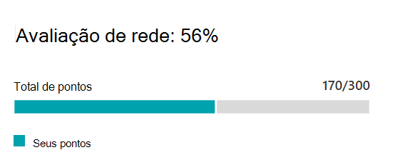
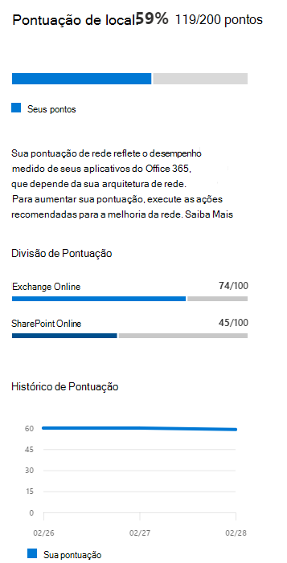

# Microsoft 365 de rede

Na conectividade Microsoft 365 de rede do Centro de Administração do Microsoft 365, as avaliações de rede **destilam** um agregado de muitas métricas de desempenho de rede em um instantâneo da sua saúde de perímetro de rede corporativa. Uma avaliação de rede informa o quanto o design de rede responsável pelo cliente está afetando Office 365 experiência do usuário. As avaliações de rede têm escopo para todo o locatário e para cada local geográfico a partir do qual os usuários se conectam ao seu locatário. As avaliações fornecem Microsoft 365 administradores com uma maneira fácil de obter instantaneamente uma noção da saúde da rede da empresa e detalhar rapidamente um relatório detalhado para qualquer local de escritório global.

O valor dos pontos de avaliação de rede é de 0 a 100 e é uma média de métricas de latência TCP, velocidade de download e qualidade de conexão UDP. Essas métricas são compiladas uma vez por dia. As métricas de desempenho para redes de propriedade da Microsoft são excluídas dessas medidas para garantir que os resultados da avaliação sejam nãombíguos e específicos da rede corporativa.

> [!div class="mx-imgBorder"]
> 

Um valor de avaliação de rede muito baixo sugere que Microsoft 365 clientes terão problemas significativos ao se conectar ao locatário ou manter uma experiência de usuário responsiva. Um valor alto indica uma rede configurada corretamente com poucos problemas de desempenho em andamento. Um valor de 80% representa uma linha de base saudável, acima da qual você não deve esperar receber reclamações de usuários regulares sobre Microsoft 365 conectividade ou capacidade de resposta devido ao desempenho da rede. À medida que as melhorias de conectividade de rede iterativas são feitas, esse valor aumenta junto com a experiência do usuário.

| Avaliação de rede | Experiência do usuário esperada |
| :----------------- | :----------------------- |
| 100                | Melhor                     |
| 80                 | Atende às recomendações    |
| 60                 | Aceitável               |
| 40                 | Os usuários podem ter problemas |
| 20                 | Os usuários podem reclamar       |
| 0                  | Problemas de rede um tópico comum de discussão |

>[!IMPORTANT]
>Percepções de rede, recomendações de desempenho e avaliações no Centro de Administração do Microsoft 365 está atualmente em status de visualização e está disponível apenas para locatários de Microsoft 365 que foram inscritos no programa de visualização de recursos.

## Painel de avaliação de rede

Cada avaliação de rede, seja com escopo para o locatário ou para um local de escritório específico, mostra um painel com detalhes sobre a avaliação. Este painel mostra um gráfico de barras da avaliação como porcentagem e como o total de pontos para cada carga de trabalho de componente, incluindo apenas cargas de trabalho em que os dados de medição foram recebidos. Para uma avaliação da rede de localização do escritório, também mostramos uma comparação com a porcentagem de clientes Microsoft 365 em cada um dos cinco quintos que relataram dados na mesma cidade que o local do seu escritório.

> [!div class="mx-imgBorder"]
> 

A **divisão Avaliação** no painel mostra a avaliação de cada uma das cargas de trabalho do componente.

O **histórico de Avaliação** mostra os últimos 30 dias da avaliação e do benchmark. Você também pode relatar o histórico de métricas para qualquer local do escritório por até dois anos usando a guia Histórico. A guia Histórico permite que você selecione seus atributos para relatar. Ao escolher um período de tempo de relatório, você pode realçar o impacto de um projeto de atualização de rede e ver a melhoria na avaliação da rede.

## Avaliações de rede de locatários e avaliações de rede de localização do escritório

Uma avaliação de rede mede o design do perímetro de rede de um local do office para a rede da Microsoft. As melhorias no perímetro de rede são melhores em cada local do escritório.

Mostramos um valor de avaliação de rede para todo o locatário Microsoft 365 na página visão geral do desempenho da rede. Esse valor é uma média ponderada das avaliações de rede para todos os locais do office. Também há um valor de avaliação de rede específico para cada local do escritório detectado na página de resumo desse local.

## Exchange Online

Para Exchange Online, a latência TCP da máquina cliente para a porta Exchange de serviço é medida. Essa latência pode ser impactada pela distância que a rede percorre pela LAN e WAN dos clientes. Ele também pode ser afetado por dispositivos ou serviços intermediários de rede, o que atrasa a conectividade ou faz com que os pacotes sejam ressentem. E isso é afetado pela distância entre a porta Exchange de serviço mais próxima. A mediana (também conhecida como o percentil 50 ou medida P50) é tomada para todas as medidas nos últimos três dias.

A Exchange Online é feita usando a tabela a seguir. Qualquer número de latência TCP entre os limites são atribuídos pontos linearmente dentro da faixa.

| Latência TCP   | Pontos |
| :------------ | :----- |
| 10 ms ou menos  | 100    |
| 25 ms          | 80     |
| 100 ms         | 60     |
| 200 ms         | 40     |
| 300 ms         | 20     |
| 350 ms ou mais | 0      |

## SharePoint Online

Para SharePoint Online, a velocidade de download disponível para um usuário acessar um documento SharePoint ou OneDrive é medida. Isso pode ser afetado pela largura de banda disponível em circuitos de rede entre a máquina cliente e a rede da Microsoft. Ele também é frequentemente afetado pelo congestionamento de rede que existe em gargalos em dispositivos de rede complexos ou em áreas Wi-Fi de cobertura. A velocidade de download é medida em megabytes por segundo, que é aproximadamente um décimo de um circuito classificado como megabits por segundo. O MegaByte por segunda unidade é útil porque você pode ver diretamente qual arquivo de tamanho pode ser baixado em 1 segundo. O percentil 25 (também conhecido como medida P25) é feito para todas as medições nos últimos três dias. Esse percentil 25 ajuda a reduzir o impacto de congestionamento variável ao longo do tempo.

A SharePoint online é feita usando a tabela a seguir. Qualquer número de velocidade de download entre os limites é atribuído a pontos linearmente dentro da faixa.

| Velocidade de download | Pontos |
| :------------- | :----- |
| 20MBps ou mais | 100    |
| 14MBps         | 80     |
| 8MBps          | 60     |
| 4MBps          | 40     |
| 2MBps          | 20     |
| 0MBps          | 0      |

## Microsoft Teams

Para Microsoft Teams a qualidade da rede é medida como latência UDP, tremedeira UDP e perda de pacote UDP. O UDP é usado para conectividade de mídia de áudio e vídeo de chamada e conferência para Microsoft Teams. Isso pode ser afetado pelos mesmos fatores que para latência e velocidade de download, além de lacunas de conectividade no suporte UDP de uma rede, já que o UDP é configurado separadamente para o protocolo TCP mais comum. A mediana (também conhecida como o percentil 50 ou medida P50) é tomada para todas as medidas nos últimos três dias. 

Calculamos uma pontuação média de opinião dessas medidas UDP para uma escala de um a cinco. Em seguida, mapeá-lo para a escala de 0 a 100 pontos para a avaliação Microsoft Teams rede.  O bem geral está acima de 87,5 pontos e o ruim geral está abaixo de 50 pontos.

## Tópicos relacionados

[Conectividade de rede no Microsoft 365 Admin Center (visualização)](office-365-network-mac-perf-overview.md)

[Microsoft 365 de desempenho da rede (visualização)](office-365-network-mac-perf-insights.md)

[Microsoft 365 de teste de conectividade de rede (visualização)](office-365-network-mac-perf-onboarding-tool.md)

[Microsoft 365 Serviços de Localização de Conectividade de Rede (visualização)](office-365-network-mac-location-services.md)
