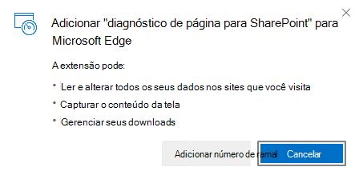
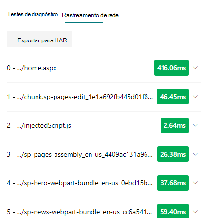
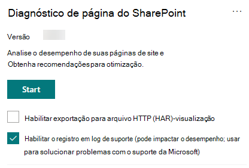

# Usar a ferramenta diagnóstico de página para SharePoint

Este artigo descreve como usar a **ferramenta diagnóstico de página para SharePoint** para analisar as páginas de site modernas e clássicas do SharePoint Online em um conjunto de critérios de desempenho predefinido.

A ferramenta diagnóstico de página para SharePoint pode ser instalada para:

- **Microsoft Edge** [(extensão de borda)](https://microsoftedge.microsoft.com/addons/detail/ocemkolpnamjcacndljdfmhlpcaoipji)
- **Chrome** [(ramal Chrome)](https://chrome.google.com/webstore/detail/inahogkhlkbkjkkaleonemeijihmfagi)

>[!TIP]
>A versão **2.0.0** e posterior inclui suporte para páginas modernas, além de páginas de site clássicas. Se não tiver certeza sobre qual versão da ferramenta você está usando, você pode selecionar o link **sobre** ou as reticências (...) para verificar sua versão. **Sempre atualize para a versão mais recente** ao usar a ferramenta.

A ferramenta Diagnóstico de Página para SharePoint é uma extensão do navegador para os novos navegadores Microsoft Edge (https://www.microsoft.com/edge) e Chrome que analisam o portal moderno do SharePoint Online e as páginas clássicas do site de publicação. Essa ferramenta só funciona no SharePoint Online e não pode ser usada em uma página de sistema do SharePoint.

A ferramenta gera um relatório para cada página analisada mostrando como a página é executada em um conjunto de regras predefinido e exibe informações detalhadas quando os resultados de um teste ficam fora do valor da linha de base. Os administradores e designers do SharePoint Online podem usar a ferramenta para solucionar problemas de desempenho e garantir que as novas páginas sejam otimizadas antes da publicação.

A ferramenta diagnóstico de página foi projetada para analisar somente as páginas do site do SharePoint, e não as páginas do sistema, como *AllItems. aspx* ou *SharePoint. aspx*. Se você tentar executar a ferramenta em uma página do sistema ou em qualquer outra página que não seja do site, receberá uma mensagem de erro informando que a ferramenta não pode ser executada para esse tipo de página.

Isso não é um erro na ferramenta, já que não há nenhum valor em avaliar bibliotecas ou páginas do sistema. Navegue até uma página de site do SharePoint para usar a ferramenta. Se esse erro ocorrer em uma página do SharePoint, verifique a página mestra para garantir que as marcas meta do SharePoint não foram removidas.

Para fornecer comentários sobre a ferramenta, selecione as reticências no canto superior direito da ferramenta e, em seguida, selecione [enviar comentários](https://go.microsoft.com/fwlink/?linkid=874109).

  
## Instalar a ferramenta diagnóstico de página para o SharePoint

O procedimento de instalação nesta seção funcionará para os navegadores Chrome e Microsoft Edge.

> [!IMPORTANT]
> A Microsoft não lê dados ou conteúdo de página que é analisado pela ferramenta diagnóstico de página para SharePoint e não capturamos informações pessoais, sites ou informações de download. As únicas informações identificáveis registradas na Microsoft pela ferramenta são o nome do locatário, as contagens de regras que falharam e a data e a hora em que a ferramenta foi executada. Essas informações são usadas pela Microsoft para entender melhor as tendências de uso do site de publicação e portal e problemas comuns de desempenho.

1. Instale a ferramenta diagnóstico de página para o SharePoint para **Microsoft Edge** [(extensão de borda)](https://microsoftedge.microsoft.com/addons/detail/ocemkolpnamjcacndljdfmhlpcaoipji) ou **Chrome** [(extensão Chrome)](https://chrome.google.com/webstore/detail/inahogkhlkbkjkkaleonemeijihmfagi). Revise a política de privacidade do usuário fornecida na página de descrição da loja. Ao adicionar a ferramenta ao navegador, você verá o aviso de permissões a seguir.

    

    Este aviso está no local porque uma página pode conter conteúdo de locais fora do SharePoint, dependendo das Web Parts e personalizações na página. Isso significa que a ferramenta lerá as solicitações e respostas quando o botão iniciar for clicado e apenas para a guia ativa do SharePoint, onde a ferramenta está em execução. Essas informações são capturadas localmente pelo navegador da Web e estão disponíveis por meio do botão **exportar para JSON** ou **exportar para o Har** na guia de _rastreamento de rede_ da ferramenta. **as informações não são enviadas ou capturadas pela Microsoft.** (A ferramenta respeita a política de privacidade da Microsoft acessível [aqui](https://go.microsoft.com/fwlink/p/?linkid=857875)).

    A permissão _gerenciar seus downloads_ abrange o uso da funcionalidade **exportar para JSON** da ferramenta. Siga as diretrizes de privacidade da sua empresa antes de compartilhar o arquivo JSON fora da sua organização, já que os resultados contêm URLs e que podem ser classificados como PII (informações de identificação pessoal).
1. Se você quiser usar a ferramenta no modo incógnito ou InPrivate, siga o procedimento para seu navegador:
    1. No Microsoft Edge, navegue até **extensões** ou digite _Edge://Extensions_ na barra URL e selecione **detalhes** para a extensão. Nas configurações de extensão, marque a caixa de seleção para **permitir no InPrivate**.
    1. No Chrome, navegue até **extensões** ou digite _Chrome://Extensions_ na barra URL e selecione **detalhes** para a extensão. Nas configurações de extensão, selecione o controle deslizante para **permitir no incógnito**.
1. Navegue até a página do site do SharePoint no SharePoint Online que você gostaria de revisar. Nós permitimos o "carregamento de atraso" dos itens nas páginas; Portanto, a ferramenta não será interrompida automaticamente (o design para acomodar todos os cenários de carregamento de página). Para interromper a coleta, selecione **parar**. Certifique-se de que a carga da página foi concluída antes de interromper a coleta de dados ou você só Capture um rastreamento parcial.
1. Clique no botão da barra de ferramentas da extensão  para carregar a ferramenta e será exibida a seguinte janela pop-up de extensão:

    

Selecione **Iniciar** para começar a coletar dados para análise.

## O que você verá na ferramenta diagnóstico de página para SharePoint

1. Clique nas reticências (...) no canto superior direito da ferramenta para localizar os seguintes links:
   1. O link **recursos adicionais** fornece orientações gerais e detalhes sobre a ferramenta, incluindo um link de volta para este artigo.
   1. O link **fornecer feedback** fornece um link para o site de _voz do usuário de colaboração e sites do SharePoint_ .
   1. O link **about** inclui a versão atualmente instalada da ferramenta e um link direto para o aviso de terceiros da ferramenta.  
1. A **ID de correlação, SPRequestDuration, SPIISLatency**, **tempo de carregamento de página**e detalhes de **URL** são informativas e podem ser usadas para alguns fins.

    

   - O **CorrelationId** é um elemento importante ao trabalhar com o suporte da Microsoft, pois ele permite coletar dados de diagnóstico adicionais para a página específica.
   - **SPRequestDuration** é o tempo necessário para que o SharePoint processe a página. Navegação estrutural, imagens grandes, muitas chamadas de API podem contribuir para durações mais longas.
   - **SPIISLatency** é o tempo em milissegundos levado para o SharePoint Online começar a carregar a página. Esse valor não inclui o tempo gasto para o aplicativo Web responder.
   - **Tempo de carregamento da página** é o tempo total registrado pela página a partir da hora da solicitação até o momento em que a resposta foi recebida e renderizada no navegador. Esse valor é afetado por vários fatores, incluindo latência de rede, o desempenho do computador e o tempo necessário para o navegador carregar a página.
   - A **URL da página** (Uniform Resource Locator) é o endereço da Web da página atual.

1. A guia [**testes de diagnóstico**](#how-to-use-the-diagnostic-tests-tab) exibe os resultados da análise em três categorias; **Nenhuma ação é necessária**, **oportunidades de melhoria** e **atenção requeridas**. Cada resultado de teste é representado por um item em uma destas categorias, conforme descrito na tabela a seguir:

    |Categoria  |Cor  |Descrição  |
    |---------|---------|---------|
    |**Atenção requerida** |Vermelho |O resultado do teste fica fora do valor da linha de base e afeta o desempenho da página. Siga as orientações de correção.|
    |**Oportunidades de aprimoramento** |Amarelo |O resultado do teste fica fora do valor da linha de base e pode estar contribuindo para problemas de desempenho. Critérios específicos de teste podem ser aplicados.|
    |**Nenhuma ação é necessária** |Verde |O resultado do teste cai dentro do valor da linha de base do teste.|

    

1. Uma guia [**rastreamento de rede**](#how-to-use-the-network-trace-tab) fornece detalhes sobre solicitações e respostas de compilação de página.

## Como usar a guia testes de diagnóstico

Quando você analisa uma página de portal moderna do SharePoint ou uma página de site de publicação clássica com a ferramenta diagnóstico de página para SharePoint, os resultados são analisados usando regras predefinidas que comparam resultados nos valores de linha de base e exibidos na guia **testes de diagnóstico** . as regras para determinados testes podem usar valores de linha de base diferentes para o portal moderno e sites de publicação clássicos, dependendo

Os resultados do teste que aparecem nas categorias **oportunidades de melhoria** ou **atenção obrigatória** indicam áreas que devem ser revisadas em relação às práticas recomendadas e podem ser selecionadas para exibir informações adicionais sobre o resultado. Os detalhes de cada item incluem um link _saiba mais_ , que o levará diretamente para a orientação apropriada relacionada ao teste. Os resultados do teste que aparecem na categoria **nenhuma ação necessária** indicam conformidade com a regra relevante e não exibem detalhes adicionais quando selecionados.

As informações na guia testes de diagnóstico não mostrarão como projetar páginas, mas destacarão fatores que podem afetar o desempenho da página. Algumas funcionalidades e personalizações de página têm um impacto inevitável no desempenho da página e devem ser examinadas em busca de possíveis remediação ou omissões da página, se o impacto for substancial.

Os resultados vermelhos ou amarelos também podem indicar Web Parts que atualizam os dados com muita frequência. Por exemplo, as notícias corporativas não são atualizadas a cada segundo, mas as Web Parts personalizadas costumam ser criadas para buscar as últimas notícias a cada segundo, em vez de implementar os elementos de cache que podem aprimorar a experiência geral do usuário. Tenha em mente quando incluir Web Parts em uma página que costuma haver maneiras simples de reduzir o impacto do desempenho, avaliando o valor de cada parâmetro disponível para garantir que ele seja definido apropriadamente para o objetivo desejado.

>[!NOTE]
>Os sites de equipe clássicos que não têm o recurso de publicação habilitado não podem fazer uso do CDNs. Quando você executa a ferramenta nesses sites, espera-se que o teste da CDN falhe e seja ignorado, mas todos os testes restantes são aplicáveis. A funcionalidade adicional do recurso de publicação do SharePoint pode aumentar o tempo de carregamento da página, portanto, ela não deve ser habilitada apenas para permitir a funcionalidade da CDN.

>[!IMPORTANT]
>As regras de teste são adicionadas e atualizadas regularmente, portanto, confira a versão mais recente da ferramenta para obter detalhes sobre as regras atuais e informações específicas incluídas nos resultados do teste. Você pode verificar a versão Gerenciando suas extensões e a extensão avisará se uma atualização está disponível.

## Como usar a guia rastreamento de rede

A guia **rastreamento de rede** fornece informações detalhadas sobre as duas solicitações para criar a página e as respostas recebidas do SharePoint.

1. **Procure tempos de carregamento de item sinalizados como vermelho**. Cada solicitação e resposta é codificada por cores para indicar seu impacto no desempenho geral da página usando as seguintes métricas de latência:
    - Verde: \< 500 milhões
    - Amarelo: 500-1000ms
    - Vermelho: \> 1000ms

    

    Na imagem mostrada acima, o item vermelho pertence à página padrão. Ele sempre mostrará vermelho, a menos que a página seja carregada no \< 1000ms (menos de 1 segundo).

2. **Teste os tempos de carregamento do item**. Em alguns casos, não haverá nenhum indicador de tempo ou de cor porque os itens já foram armazenados em cache pelo navegador. Para testar corretamente, abra a página, limpe o cache do navegador e, em seguida, clique em **Iniciar** como isso forçará uma carga de página "Cold" e será uma reflexão verdadeira da carga inicial da página. Isso deve ser comparado com a carga de página "quente" como isso também ajudará a determinar quais itens estão sendo armazenados em cache na página.

3. **Compartilhar detalhes relevantes com outras pessoas que podem ajudar a investigar problemas**. Para compartilhar os detalhes ou as informações fornecidas na ferramenta com seus desenvolvedores ou um profissional de suporte técnico, clique em **exportar para JSON** (conforme mostrado na imagem acima). Isso permitirá que você baixe os resultados, exibíveis com um visualizador de arquivos JSON.

    Se você optou por usar o recurso de visualização *habilitar exportação para Har* , o tipo de exportação aparecerá como **exportar para Har**.

    

> [!IMPORTANT]
> Esses resultados contêm URLs e que podem ser classificados como PII (informações de identificação pessoal). Certifique-se de seguir as diretrizes da sua organização antes de distribuir essas informações.

## Contratando o suporte da Microsoft

Incluímos um **recurso de nível de suporte da Microsoft** que só deve ser utilizado ao trabalhar diretamente em um caso de suporte. A utilização desse recurso não fornecerá nenhum benefício quando for usada sem o contrato de equipe de suporte e poderá fazer com que a página seja executada de forma significativamente mais lenta. Não há informações adicionais ao usar esse recurso na ferramenta, pois as informações adicionais são adicionadas ao registro em log no serviço.

Nenhuma alteração é visível, exceto que você será notificado de que a habilitou e o desempenho da página será significativamente reduzido por 2-3 vezes o desempenho mais lento durante a habilitação. Ele só será relevante para a página específica e essa sessão ativa. Por esse motivo, isso deve ser usado com moderação e apenas quando ativamente envolvido no suporte.

### Para habilitar o recurso de nível de suporte da Microsoft

1. Abra a ferramenta diagnóstico de página para SharePoint.
2. No teclado, pressione **Alt-Shift-L**. Isso exibirá a caixa de seleção **habilitar o log de suporte** .
3. Marque a caixa de seleção e clique em **Iniciar** para recarregar a página e gerar o registro em log detalhado.

    
  
    Você deve anotar o CorrelationId (exibido na parte superior da ferramenta) e fornecer ao representante de suporte para permitir que eles coletem informações adicionais sobre a sessão de diagnóstico.

## Tópicos relacionados

[Ajustar o desempenho do SharePoint Online](tune-sharepoint-online-performance.md)

[Ajustar o desempenho do Office 365](tune-microsoft-365-performance.md)

[Desempenho na experiência moderna do SharePoint](https://docs.microsoft.com/sharepoint/modern-experience-performance)

[Redes de distribuição de conteúdo](content-delivery-networks.md)

[Usar a Rede de Distribuição de Conteúdo (CDN) do Office 365 com o SharePoint Online](use-microsoft-365-cdn-with-spo.md)
