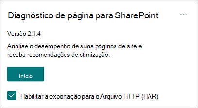
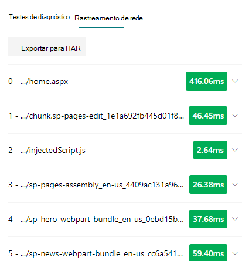

# Usar a ferramenta Diagnóstico de Página para SharePointUse the Page Diagnostics for SharePoint tool

Este artigo descreve como usar a ferramenta Diagnóstico de Página para SharePoint para analisar páginas de site modernas e clássicas do SharePoint Online em relação a um conjunto pré-definido de **critérios** de desempenho.This article describes how to use the **Page Diagnostics for SharePoint tool** to analyze SharePoint Online modern and classic site pages against a pre-defined set of performance criteria.

A ferramenta Diagnóstico de Página do SharePoint pode ser instalada para:The Page Diagnostics for SharePoint tool can be installed for:

- **Microsoft Edge** [(extensão de Borda)](https://microsoftedge.microsoft.com/addons/detail/ocemkolpnamjcacndljdfmhlpcaoipji)**Microsoft Edge** [(Edge extension)](https://microsoftedge.microsoft.com/addons/detail/ocemkolpnamjcacndljdfmhlpcaoipji)
- **Chrome** [(extensão do Chrome)](https://chrome.google.com/webstore/detail/inahogkhlkbkjkkaleonemeijihmfagi)**Chrome** [(Chrome extension)](https://chrome.google.com/webstore/detail/inahogkhlkbkjkkaleonemeijihmfagi)

>[!TIP]
>A **versão 2.0.0 e** posterior inclui suporte para páginas modernas, além de páginas de site clássicas.Version **2.0.0** and later includes support for modern pages in addition to classic site pages. Se você não tiver certeza de qual versão da ferramenta está usando, selecione o **link** Sobre ou as releituras (...) para verificar sua versão.If you are unsure which version of the tool you are using, you can select the **About** link or the ellipses (...) to verify your version. **Sempre atualize para a versão mais recente** ao usar a ferramenta.**Always update to the latest version** when using the tool.

A ferramenta Diagnóstico de Página para SharePoint é uma extensão do navegador para os novos navegadores Microsoft Edge (https://www.microsoft.com/edge) e Chrome que analisam o portal moderno do SharePoint Online e as páginas clássicas do site de publicação.The Page Diagnostics for SharePoint tool is a browser extension for the new Microsoft Edge (https://www.microsoft.com/edge) and Chrome browsers that analyzes both SharePoint Online modern portal and classic publishing site pages. Essa ferramenta só funciona para o SharePoint Online e não pode ser usada em uma página do sistema do SharePoint.This tool only works for SharePoint Online, and cannot be used on a SharePoint system page.

A ferramenta gera um relatório para cada página analisada mostrando como a página se executa em relação a um conjunto de regras pré-definido e exibe informações detalhadas quando os resultados de um teste estão fora do valor da linha de base.The tool generates a report for each analyzed page showing how the page performs against a pre-defined set of rules and displays detailed information when results for a test fall outside the baseline value. Os administradores e designers do SharePoint Online podem usar a ferramenta para solucionar problemas de desempenho e garantir que novas páginas sejam otimizadas antes da publicação.SharePoint Online administrators and designers can use the tool to troubleshoot performance issues and to ensure that new pages are optimized prior to publishing.

A ferramenta Diagnóstico de Página foi projetada para analisar apenas páginas de site do SharePoint, não páginas do sistema como *allitems.aspx* ou *sharepoint.aspx*.The Page Diagnostics tool is designed to analyze SharePoint site pages only, not system pages such as *allitems.aspx* or *sharepoint.aspx*. Se você tentar executar a ferramenta em uma página do sistema ou em qualquer outra página que não seja do site, receberá uma mensagem de erro avisando que a ferramenta não pode ser executado para esse tipo de página.If you attempt to run the tool on a system page or any other non-site page, you will receive an error message advising that the tool cannot be run for that type of page.

> [!div class="mx-imgBorder"]
> 

Isso não é um erro na ferramenta, pois não há valor na avaliação de bibliotecas ou páginas do sistema.This is not an error in the tool as there is no value in assessing libraries or system pages. Navegue até uma página de site do SharePoint para usar a ferramenta.Please navigate to a SharePoint site page to use the tool. Se esse erro ocorrer em uma página do SharePoint, verifique a página mestra para garantir que as metatags do SharePoint não tenham sido removidas.If this error occurs on a SharePoint page, please check the master page to ensure that the SharePoint metatags have not been removed.

Para fornecer comentários sobre a ferramenta, selecione a reellipse no canto superior direito da ferramenta e selecione [Dar comentários.](https://go.microsoft.com/fwlink/?linkid=874109)To provide feedback about the tool, select the ellipsis at the top right corner of the tool and then select [Give feedback](https://go.microsoft.com/fwlink/?linkid=874109).

> [!div class="mx-imgBorder"]
> 
  
## Instalar a ferramenta Diagnóstico de Página para SharePointInstall the Page Diagnostics for SharePoint tool

O procedimento de instalação nesta seção funcionará para os navegadores Chrome e Microsoft Edge.The installation procedure in this section will work for both the Chrome and Microsoft Edge browsers.

> [!IMPORTANT]
> A Microsoft não lê dados ou conteúdo de página que é analisado pela ferramenta Diagnóstico de Página para SharePoint e não capturamos informações pessoais, site ou download.Microsoft does not read data or page content that is analyzed by the Page Diagnostics for SharePoint tool, and we do not capture any personal information, website or download information. As únicas informações identificáveis registradas na Microsoft pela ferramenta são o nome do locatário, as contagens de regras que falharam e a data e a hora em que a ferramenta foi executado.The only identifiable information logged to Microsoft by the tool is the tenant name, counts of rules that have failed and the date and time the tool was run. Essas informações são usadas pela Microsoft para entender melhor as tendências de uso do site de publicação e o portal moderno e problemas comuns de desempenho.This information is used by Microsoft to better understand modern portal and publishing site usage trends and common performance issues.

1. Instale a ferramenta Diagnóstico de Página do SharePoint para **Microsoft Edge** (Extensão de [Borda)](https://microsoftedge.microsoft.com/addons/detail/ocemkolpnamjcacndljdfmhlpcaoipji) ou **Chrome** [(extensão do Chrome).](https://chrome.google.com/webstore/detail/inahogkhlkbkjkkaleonemeijihmfagi)Install the Page Diagnostics for SharePoint tool for **Microsoft Edge** [(Edge extension)](https://microsoftedge.microsoft.com/addons/detail/ocemkolpnamjcacndljdfmhlpcaoipji) or **Chrome** [(Chrome extension)](https://chrome.google.com/webstore/detail/inahogkhlkbkjkkaleonemeijihmfagi). Revise a Política de Privacidade do Usuário fornecida na página de descrição na loja.Please review the User Privacy Policy provided on the description page in the store. Ao adicionar a ferramenta ao navegador, você verá o aviso de permissões a seguir.When adding the tool to your browser, you will see the following permissions notice.

    > [!div class="mx-imgBorder"]
    > 

    Esse aviso está em andamento porque uma página pode conter conteúdo de locais fora do SharePoint, dependendo das Web Parts e personalizações na página.This notice is in place because a page may contain content from locations outside of SharePoint depending on the web parts and customizations on the page. Isso significa que a ferramenta lerá as solicitações e respostas quando o botão iniciar for clicado e somente para a guia ativa do SharePoint onde a ferramenta está sendo executado.This means that the tool will read the requests and responses when the start button is clicked and only for the active SharePoint tab where the tool is running. Essas informações são capturadas localmente pelo navegador da Web e estão disponíveis para você por  meio do botão Exportar para **JSON** ou Exportar para **HAR** na guia Rastreamento de rede da ferramenta. As informações não são enviadas ou capturadas pela **Microsoft.**This information is captured locally by the web browser and is available to you via the **Export to JSON** or **Export to HAR** button in the tool's _Network trace_ tab. **The information is not sent to or captured by Microsoft.** (A ferramenta respeita a política de privacidade da Microsoft acessível [aqui](https://go.microsoft.com/fwlink/p/?linkid=857875).)(The tool respects the Microsoft privacy policy accessible [here](https://go.microsoft.com/fwlink/p/?linkid=857875).)

    A _permissão Gerenciar seus downloads_ abrange o uso da funcionalidade Exportar para **JSON** da ferramenta.The _Manage your downloads_ permission covers use of the tool's **Export to JSON** functionality. Siga as próprias diretrizes de privacidade da sua empresa antes de compartilhar o arquivo JSON fora da sua organização, pois os resultados contêm URLs e que podem ser classificados como PII (Personally Identifiable Information).Please follow your company's own privacy guidelines before sharing the JSON file outside of your organization, as the results contain URLs and that can be classified as PII (Personally Identifiable Information).
1. Se você quiser usar a ferramenta no modo Incognito ou InPrivate, siga o procedimento do navegador:If you want to use the tool in Incognito or InPrivate mode, follow the procedure for your browser:
    1. No Microsoft Edge, navegue até **Extensões** ou digite _edge://extensions_ na barra de URL e selecione **Detalhes** para a extensão.In Microsoft Edge, navigate to **Extensions** or type _edge://extensions_ in the URL bar and select **Details** for the extension. Nas configurações de extensão, selecione a caixa de seleção **para permitir em InPrivate**.In the extension settings, select the checkbox for **allow in InPrivate**.
    1. No Chrome, navegue até **Extensões** ou digite _chrome://extensions_ na barra de URL e selecione **Detalhes** para a extensão.In Chrome, navigate to **Extensions** or type _chrome://extensions_ in the URL bar and select **Details** for the extension. Nas configurações de extensão, selecione o controle deslizante **para permitir em Incognito**.In the extension settings, select the slider for **allow in Incognito**.
1. Navegue até a página do site do SharePoint no SharePoint Online que você gostaria de revisar.Navigate to the SharePoint site page on SharePoint Online that you would like to review. Permitimos o "carregamento de atraso" de itens em páginas; portanto, a ferramenta não será parada automaticamente (isso é por design para acomodar todos os cenários de carga de página).We have allowed for "delay loading" of items on pages; therefore, the tool will not stop automatically (this is by design to accommodate all page load scenarios). Para interromper a coleção, selecione **Parar**.To stop collection, select **Stop**. Certifique-se de que a carga da página tenha sido concluída antes de interromper a coleta de dados ou apenas capturará um rastreamento parcial.Make sure that the page load has completed before you stop data collection or you will only capture a partial trace.
1. Clique no botão da barra de ferramentas da extensãoClick on the extension's toolbar button  para carregar a ferramenta e você será apresentado com a seguinte janela pop-up de extensão:to load the tool and you will be presented with the following extension popup window:

    

Selecione **Iniciar** para começar a coletar dados para análise.Select **Start** to begin collecting data for analysis.

## O que você verá na ferramenta Diagnóstico de Página para SharePointWhat you'll see in the Page Diagnostics for SharePoint tool

1. Clique nas releições (...) no canto superior direito da ferramenta para encontrar os seguintes links:Click the ellipses (...) in the top right corner of the tool to find the following links:
   1. O **link Recursos adicionais** fornece orientações gerais e detalhes sobre a ferramenta, incluindo um link de volta para este artigo.The **Additional resources** link provides general guidance and details regarding the tool including a link back to this article.
   1. O **link Dar comentários** fornece um link para o site de Voz do Usuário de Colaboração e Sites do _SharePoint._The **Give feedback** link provides a link to the _SharePoint Sites and Collaboration User Voice_ site.
   1. O  link Sobre inclui a versão instalada atualmente da ferramenta e um link direto para o aviso de terceiros da ferramenta.The **About** link includes the currently installed version of the tool and a direct link to the tool's third party notice.  
1. A **ID de correlação, SPRequestDuration, SPIISLatency,** tempo de carregamento da página **e** detalhes da **URL** são informações e podem ser usadas para alguns fins.The **Correlation ID, SPRequestDuration, SPIISLatency**, **Page load time**, and **URL** details are informational and can be used for a few purposes.

    > [!div class="mx-imgBorder"]
    > 

   - **CorrelationID** é um elemento importante ao trabalhar com o Suporte da Microsoft, pois permite coletar dados de diagnóstico adicionais para a página específica.**CorrelationID** is an important element when working with Microsoft Support as it allows them to gather additional diagnostic data for the specific page.
   - **SPRequestDuration** é o tempo que o SharePoint precisa para processar a página.**SPRequestDuration** is the time taken for SharePoint to process the page. Navegação estrutural, imagens grandes, muitas chamadas de API podem contribuir para durações mais longas.Structural navigation, large images, lots of API calls could all contribute to longer durations.
   - **SPIISLatency** é o tempo em milissegundos tomados para o SharePoint Online começar a carregar a página.**SPIISLatency** is the time in milliseconds taken for SharePoint Online begin loading the page. Esse valor não inclui o tempo de resposta do aplicativo Web.This value does not include the time taken for the web application to respond.
   - **O tempo de carregamento** da página é o tempo total registrado pela página desde o momento da solicitação até o momento em que a resposta foi recebida e renderizada no navegador.**Page load time** is the total time recorded by the page from the time of the request to the time the response was received and rendered in the browser. Esse valor é afetado por uma variedade de fatores, incluindo latência de rede, o desempenho do computador e o tempo necessário para o navegador carregar a página.This value is affected by a variety of factors including network latency, the performance of the computer and the time it takes for the browser to load the page.
   - A **URL da página** (Uniform Resource Locator) é o endereço web da página atual.The **Page URL** (Uniform Resource Locator) is the web address of the current page.

1. A [**guia Testes de**](#how-to-use-the-diagnostic-tests-tab) Diagnóstico exibe os resultados da análise em três categorias; **Nenhuma ação necessária,** **oportunidades de melhoria** e atenção **necessária.**The [**Diagnostic tests**](#how-to-use-the-diagnostic-tests-tab) tab displays the analysis results in three categories; **No action required**, **Improvement opportunities** and **Attention required**. Cada resultado de teste é representado por um item em uma dessas categorias, conforme descrito na tabela a seguir:Each test result is represented by an item in one of these categories as described in the following table:

    |CategoriaCategory  |CorColor  |DescriçãoDescription  |
    |---------|---------|---------|
    |**Atenção necessária****Attention required** |VermelhoRed |O resultado do teste fica fora do valor da linha de base e está afetando o desempenho da página.Test result falls outside the baseline value and is affecting page performance. Siga as diretrizes de correção.Follow remediation guidance.|
    |**Oportunidades de melhoria****Improvement opportunities** |AmareloYellow |O resultado do teste fica fora do valor da linha de base e pode estar contribuindo para problemas de desempenho.Test result falls outside the baseline value and could be contributing to performance issues. Critérios específicos de teste podem ser aplicados.Test-specific criteria may apply.|
    |**Nenhuma ação é necessária****No action required** |VerdeGreen |O resultado do teste está dentro do valor da linha de base do teste.Test result falls within the test's baseline value.|

    > [!div class="mx-imgBorder"]
    > 

1. Uma [**guia Rastreamento de**](#how-to-use-the-network-trace-tab-and-how-to-export-a-har-file) rede fornece detalhes sobre solicitações e respostas de com build de página.A [**Network trace**](#how-to-use-the-network-trace-tab-and-how-to-export-a-har-file) tab provides details about page build requests and responses.

## Como usar a guia Testes de diagnósticoHow to use the Diagnostic tests tab

Quando você analisa uma página de portal moderna do SharePoint ou uma página de site de publicação clássica com a ferramenta Diagnóstico  de Página para SharePoint, os resultados são analisados usando regras pré-definidas que comparam resultados com valores de linha de base e exibidos na guia Testes de diagnóstico. As regras para determinados testes podem usar valores de linha de base diferentes para portal moderno e sites de publicação clássicos, dependendo de como as características de desempenho específicas diferem entre os dois.When you analyze a SharePoint modern portal page or classic publishing site page with the Page Diagnostics for SharePoint tool, results are analyzed using pre-defined rules that compare results against baseline values and displayed in the **Diagnostic tests** tab. Rules for certain tests may use different baseline values for modern portal and classic publishing sites depending on how specific performance characteristics differ between the two.

Os resultados de  teste que  aparecem nas categorias Oportunidades de melhoria ou Atenção necessária indicam áreas que devem ser revisadas em relação às práticas recomendadas e podem ser selecionadas para exibir informações adicionais sobre o resultado.Test results that appear in the **Improvement opportunities** or **Attention required** categories indicate areas that should be reviewed against recommended practices, and can be selected to display additional information about the result. Os detalhes de cada item incluem um link _Saiba mais_ que o levará diretamente às diretrizes apropriadas relacionadas ao teste.Details for each item include a _Learn more_ link which will take you directly to the appropriate guidance related to the test. Os resultados de teste que aparecem na categoria **Nenhuma** ação necessária indicam a conformidade com a regra relevante e não exibem detalhes adicionais quando selecionados.Test results that appear in the **No action required** category indicate compliance with the relevant rule and do not display additional details when selected.

As informações na guia Testes de Diagnóstico não informam como projetar páginas, mas realçam fatores que podem afetar o desempenho da página.The information in the Diagnostics tests tab will not tell you how to design pages, but will highlight factors that may impact page performance. Algumas funcionalidades e personalizações de página têm um impacto inevitável no desempenho da página e devem ser revisadas para correção ou omissão potenciais da página se o impacto for substancial.Some page functionality and customizations have an unavoidable impact on page performance, and should be reviewed for potential remediation or omission from the page if their impact is substantial.

Os resultados vermelhos ou amarelos também podem indicar web parts que atualizem dados com muita frequência.Red or yellow results may also indicate web parts that refresh data too frequently. Por exemplo, as notícias corporativas não são atualizadas a cada segundo, mas web parts personalizadas geralmente são criadas para buscar as notícias mais recentes a cada segundo, em vez de implementar elementos de cache que poderiam melhorar a experiência geral do usuário.For example, corporate news is not updated every second but custom web parts are often built to fetch the latest news every second instead of implementing caching elements that could improve the overall user experience. Tenha em mente ao incluir web parts em uma página que muitas vezes há maneiras simples de reduzir seu impacto no desempenho avaliando o valor de cada parâmetro disponível para garantir que ele seja definido adequadamente para sua finalidade pretendida.Keep in mind when including web parts on a page that there are often simple ways to reduce their performance impact by evaluating the value of each available parameter to ensure it is set appropriately for its intended purpose.

>[!NOTE]
>Sites de equipe clássicos que não têm o recurso de publicação habilitado não podem usar CDNs.Classic team sites that don't have the publishing feature enabled cannot make use of CDNs. Quando você executar a ferramenta nesses sites, espera-se que o teste cdn falhe e possa ser ignorado, mas todos os testes restantes são aplicáveis.When you run the tool on these sites, the CDN test is expected to fail and can be ignored, but all of the remaining tests are applicable. A funcionalidade adicional do recurso de publicação do SharePoint pode aumentar o tempo de carregamento da página, portanto, ele não deve ser habilitado apenas para permitir a funcionalidade cdn.The additional functionality of the SharePoint publishing feature can increase page load times, so it should not be enabled just to allow CDN functionality.

>[!IMPORTANT]
>As regras de teste são adicionadas e atualizadas regularmente, portanto, consulte a versão mais recente da ferramenta para obter detalhes sobre regras atuais e informações específicas incluídas nos resultados do teste.Test rules are added and updated regularly so please refer to the latest version of the tool for details about current rules and specific information included in test results. Você pode verificar a versão gerenciando suas extensões e a extensão informará se uma atualização está disponível.You can verify the version by managing your extensions and the extension will advise whether an update is available.

## Como usar a guia Rastreamento de Rede e como exportar um arquivo HARHow to use the Network Trace tab and how to export a HAR file

A **guia Rastreamento de** Rede fornece informações detalhadas sobre as solicitações para criar a página e as respostas recebidas do SharePoint.The **Network Trace** tab provides detailed information about both requests to build the page and the responses received from SharePoint.

1. **Procure tempos de carga do item sinalizados como vermelho**.**Look for item load times flagged as red**. Cada solicitação e resposta é codificada por cores para indicar seu impacto no desempenho geral da página usando as seguintes métricas de latência:Each request and response is color coded to indicate its impact on overall page performance using the following latency metrics:
    - Verde: \< 500msGreen: \< 500ms
    - Amarelo: 500-1000msYellow: 500-1000ms
    - Vermelho: \> 1000msRed: \> 1000ms

    > [!div class="mx-imgBorder"]
    > 

    Na imagem mostrada acima, o item vermelho pertence à página padrão.In the image shown above, the red item pertains to the default page. Ele sempre mostrará vermelho, a menos que a página seja carregada em \< 1000ms (menos de 1 segundo).It will always show red unless the page loads in \< 1000ms (less than 1 second).

2. **Tempos de carregamento do item de teste**.**Test item load times**. Em alguns casos, não haverá nenhum indicador de tempo ou cor porque os itens já foram armazenados em cache pelo navegador.In some cases there will be no time or color indicator because the items have already been cached by the browser. Para testar corretamente, abra a página, limpe  o cache do navegador e clique em Iniciar, pois isso força uma carga de página "a frio" e será um verdadeiro reflexo da carga inicial da página.To test this correctly, open the page, clear browser cache, and then click **Start** as that will force a "cold" page load and be a true reflection of the initial page load. Isso deve ser comparado à carga de página "quente", pois isso também ajudará a determinar quais itens estão sendo armazenados em cache na página.This should then be compared to the "warm" page load as that will also help determine what items are being cached on the page.

3. **Compartilhe detalhes relevantes com outras pessoas que podem ajudar a investigar problemas.****Share relevant details with others who can help investigate issues**. Para compartilhar os detalhes ou informações fornecidos na ferramenta com seus desenvolvedores ou uma pessoa de suporte técnico, usar a abordagem Habilitar a exportação para **ARQUIVO HTTP (HAR)** é a abordagem recomendada.To share the details or information provided in the tool with your developers or a technical support person, using the **Enable exporting to HTTP Archive (HAR)** is the recommended approach. 

   > [!div class="mx-imgBorder"]
   > 

Isso deve ser habilitado antes de clicar em Iniciar, que habilita o modo de depuração no navegador.That should be enabled prior to clicking Start, which will then enable debug mode in your browser. Ele gerará um arquivo DE ARQUIVAMENTO HTTP (HAR) que pode ser acessado por meio da guia "Rastreamento de Rede". Clique em "Exportar para HAR" e ele baixará o arquivo para seu computador e você poderá compartilhá-lo de acordo.It will generate an HTTP Archive file (HAR) which can then be accessed through the "Network Trace" tab. Click the "Export to HAR" and it will download the file to your computer and you can then share it accordingly. O arquivo pode ser aberto em várias ferramentas de depuração, como Ferramentas de Desenvolvedor F12 e Fiddler.The file can be opened in a variety of debug tools, like F12 Developer Tools and Fiddler.

> [!div class="mx-imgBorder"]
> 

> [!IMPORTANT]
> Esses resultados contêm URLs e podem ser classificados como PII (Informações de identificação pessoal).These results contain URLs and that can be classified as PII (Personally Identifiable Information). Siga as diretrizes da sua organização antes de distribuir essas informações.Make sure to follow your organization's guidelines before distributing that information.

## Envolvimento com o suporte da MicrosoftEngaging with Microsoft Support

Incluímos um recurso de nível de suporte da **Microsoft** que só deve ser usado ao trabalhar diretamente em um caso de suporte.We have included a **Microsoft Support level feature** that should only be utilized when working directly on a support case. A utilização desse recurso não fornecerá nenhum benefício quando usado sem suporte ao envolvimento da equipe e pode fazer com que a página tenha um desempenho significativamente mais lento.Utilizing this feature will provide no benefit to you when used without support team engagement, and can make the page perform significantly slower. Não há informações adicionais ao usar esse recurso na ferramenta, pois as informações adicionais são adicionadas ao log no serviço.There is no additional information when using this feature in the tool as the additional information is added to the logging in the service.

Nenhuma alteração é visível, exceto que você será notificado de que a habilitará e seu desempenho de página será significativamente degradado por 2 a 3 vezes o desempenho mais lento enquanto estiver habilitado.No change is visible except that you will be notified that you have enabled it and your page performance will be significantly degraded by 2-3 times slower performance whilst enabled. Ele só será relevante para a página específica e essa sessão ativa.It will only be relevant for the particular page and that active session. Por esse motivo, isso deve ser usado com moderação e somente quando estiver ativamente envolvido com o suporte.For this reason, this should be used sparingly and only when actively engaged with support.

### Para habilitar o recurso de nível de suporte da MicrosoftTo enable the Microsoft Support level feature

1. Abra a ferramenta Diagnóstico de Página para SharePoint.Open the Page Diagnostics for SharePoint tool.
2. No teclado, pressione **ALT-Shift-L**.On your keyboard, press **ALT-Shift-L**. Isso exibirá a caixa **de seleção Habilitar log de** suporte.This will display the **Enable support logging** check box.
3. Marque a caixa de seleção e clique em **Iniciar** para recarregar a página e gerar log detalhado.Select the check box, and then click **Start** to reload the page and generate verbose logging.

   > [!div class="mx-imgBorder"]
   > 
  
    Observe a CorrelationID (exibida na parte superior da ferramenta) e forneça-a ao representante de suporte para permitir que eles reúnam informações adicionais sobre a sessão de diagnóstico.You should note the CorrelationID (displayed at the top of the tool) and provide it to your support representative to enable them to gather additional information about the diagnostic session.

## Tópicos relacionadosRelated topics

[Ajustar o desempenho do SharePoint OnlineTune SharePoint Online performance](tune-sharepoint-online-performance.md)

[Ajustar o desempenho do Office 365Tune Office 365 performance](tune-microsoft-365-performance.md)

[Desempenho na experiência moderna do SharePointPerformance in the modern SharePoint experience](/sharepoint/modern-experience-performance)

[Redes de distribuição de conteúdoContent delivery networks](content-delivery-networks.md)

[Usar a Rede de Distribuição de Conteúdo (CDN) do Office 365 com o SharePoint OnlineUse the Office 365 Content Delivery Network (CDN) with SharePoint Online](use-microsoft-365-cdn-with-spo.md)