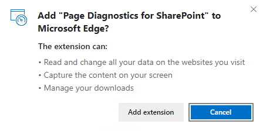
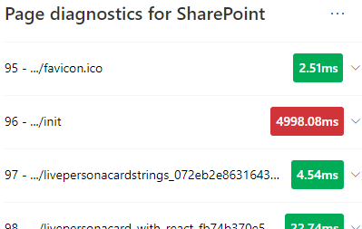

# Usar a ferramenta Diagnóstico de Página para SharePoint

Este artigo descreve como usar a ferramenta Diagnóstico de Página para SharePoint para analisar páginas de site modernas e clássicas do SharePoint Online em relação a um conjunto pré-definido de **critérios** de desempenho.

A ferramenta Diagnóstico de Página do SharePoint pode ser instalada para:

- **Microsoft Edge** [(extensão de Borda)](https://microsoftedge.microsoft.com/addons/detail/ocemkolpnamjcacndljdfmhlpcaoipji)
- **Chrome** [(extensão do Chrome)](https://chrome.google.com/webstore/detail/inahogkhlkbkjkkaleonemeijihmfagi)

>[!TIP]
>A **versão 2.0.0 e** posterior inclui suporte para páginas modernas, além de páginas de site clássicas. Se você não tiver certeza de qual versão da ferramenta está usando, selecione o **link** Sobre ou as releituras (...) para verificar sua versão. **Sempre atualize para a versão mais recente** ao usar a ferramenta.

A ferramenta Diagnóstico de Página para SharePoint é uma extensão do navegador para os novos navegadores Microsoft Edge (https://www.microsoft.com/edge) e Chrome que analisam o portal moderno do SharePoint Online e as páginas clássicas do site de publicação. Essa ferramenta só funciona para o SharePoint Online e não pode ser usada em uma página do sistema do SharePoint.

A ferramenta gera um relatório para cada página analisada mostrando como a página se executa em relação a um conjunto de regras pré-definido e exibe informações detalhadas quando os resultados de um teste estão fora do valor da linha de base. Os administradores e designers do SharePoint Online podem usar a ferramenta para solucionar problemas de desempenho e garantir que novas páginas sejam otimizadas antes da publicação.

A ferramenta Diagnóstico de Página foi projetada para analisar apenas páginas de site do SharePoint, não páginas do sistema como *allitems.aspx* ou *sharepoint.aspx*. Se você tentar executar a ferramenta em uma página do sistema ou em qualquer outra página que não seja do site, receberá uma mensagem de erro avisando que a ferramenta não pode ser executado para esse tipo de página.

> [!div class="mx-imgBorder"]
> 

Isso não é um erro na ferramenta, pois não há valor na avaliação de bibliotecas ou páginas do sistema. Navegue até uma página de site do SharePoint para usar a ferramenta. Se esse erro ocorrer em uma página do SharePoint, verifique a página mestra para garantir que as metatags do SharePoint não tenham sido removidas.

Para fornecer comentários sobre a ferramenta, selecione a reellipse no canto superior direito da ferramenta e selecione [Dar comentários.](https://go.microsoft.com/fwlink/?linkid=874109)

> [!div class="mx-imgBorder"]
> 
  
## Instalar a ferramenta Diagnóstico de Página para SharePoint

O procedimento de instalação nesta seção funcionará para os navegadores Chrome e Microsoft Edge.

> [!IMPORTANT]
> A Microsoft não lê dados ou conteúdo de página que é analisado pela ferramenta Diagnóstico de Página para SharePoint e não capturamos informações pessoais, site ou download. As únicas informações identificáveis registradas na Microsoft pela ferramenta são o nome do locatário, as contagens de regras que falharam e a data e a hora em que a ferramenta foi executado. Essas informações são usadas pela Microsoft para entender melhor as tendências de uso do site de publicação e o portal moderno e problemas comuns de desempenho.

1. Instale a ferramenta Diagnóstico de Página do SharePoint para **Microsoft Edge** (Extensão de [Borda)](https://microsoftedge.microsoft.com/addons/detail/ocemkolpnamjcacndljdfmhlpcaoipji) ou **Chrome** [(extensão do Chrome).](https://chrome.google.com/webstore/detail/inahogkhlkbkjkkaleonemeijihmfagi) Revise a Política de Privacidade do Usuário fornecida na página de descrição na loja. Ao adicionar a ferramenta ao navegador, você verá o aviso de permissões a seguir.

    > [!div class="mx-imgBorder"]
    > 

    Esse aviso está em andamento porque uma página pode conter conteúdo de locais fora do SharePoint, dependendo das Web Parts e personalizações na página. Isso significa que a ferramenta lerá as solicitações e respostas quando o botão iniciar for clicado e somente para a guia ativa do SharePoint onde a ferramenta está sendo executado. Essas informações são capturadas localmente pelo navegador da Web e estão disponíveis para você por  meio do botão Exportar para **JSON** ou Exportar para **HAR** na guia Rastreamento de rede da ferramenta. As informações não são enviadas ou capturadas pela **Microsoft.** (A ferramenta respeita a política de privacidade da Microsoft acessível [aqui](https://go.microsoft.com/fwlink/p/?linkid=857875).)

    A _permissão Gerenciar seus downloads_ abrange o uso da funcionalidade Exportar para **JSON** da ferramenta. Siga as próprias diretrizes de privacidade da sua empresa antes de compartilhar o arquivo JSON fora da sua organização, pois os resultados contêm URLs e que podem ser classificados como PII (Personally Identifiable Information).
1. Se você quiser usar a ferramenta no modo Incognito ou InPrivate, siga o procedimento do navegador:
    1. No Microsoft Edge, navegue até **Extensões** ou digite _edge://extensions_ na barra de URL e selecione **Detalhes** para a extensão. Nas configurações de extensão, selecione a caixa de seleção **para permitir em InPrivate**.
    1. No Chrome, navegue até **Extensões** ou digite _chrome://extensions_ na barra de URL e selecione **Detalhes** para a extensão. Nas configurações de extensão, selecione o controle deslizante **para permitir em Incognito**.
1. Navegue até a página do site do SharePoint no SharePoint Online que você gostaria de revisar. Permitimos o "carregamento de atraso" de itens em páginas; portanto, a ferramenta não será parada automaticamente (isso é por design para acomodar todos os cenários de carga de página). Para interromper a coleção, selecione **Parar**. Certifique-se de que a carga da página tenha sido concluída antes de interromper a coleta de dados ou apenas capturará um rastreamento parcial.
1. Clique no botão da barra de ferramentas da extensão  para carregar a ferramenta e você será apresentado com a seguinte janela pop-up de extensão:

    

Selecione **Iniciar** para começar a coletar dados para análise.

## O que você verá na ferramenta Diagnóstico de Página para SharePoint

1. Clique nas releições (...) no canto superior direito da ferramenta para encontrar os seguintes links:
   1. O **link Recursos adicionais** fornece orientações gerais e detalhes sobre a ferramenta, incluindo um link de volta para este artigo.
   1. O **link Dar comentários** fornece um link para o site de Voz do Usuário de Colaboração e Sites do _SharePoint._
   1. O  link Sobre inclui a versão instalada atualmente da ferramenta e um link direto para o aviso de terceiros da ferramenta.  
1. A **ID de correlação, SPRequestDuration, SPIISLatency,** tempo de carregamento da página **e** detalhes da **URL** são informações e podem ser usadas para alguns fins.

    > [!div class="mx-imgBorder"]
    > 

   - **CorrelationID** é um elemento importante ao trabalhar com o Suporte da Microsoft, pois permite coletar dados de diagnóstico adicionais para a página específica.
   - **SPRequestDuration** é o tempo que o SharePoint precisa para processar a página. Navegação estrutural, imagens grandes, muitas chamadas de API podem contribuir para durações mais longas.
   - **SPIISLatency** é o tempo em milissegundos tomados para o SharePoint Online começar a carregar a página. Esse valor não inclui o tempo de resposta do aplicativo Web.
   - **O tempo de carregamento** da página é o tempo total registrado pela página desde o momento da solicitação até o momento em que a resposta foi recebida e renderizada no navegador. Esse valor é afetado por uma variedade de fatores, incluindo latência de rede, o desempenho do computador e o tempo necessário para o navegador carregar a página.
   - A **URL da página** (Uniform Resource Locator) é o endereço web da página atual.

1. A [**guia Testes de**](#how-to-use-the-diagnostic-tests-tab) Diagnóstico exibe os resultados da análise em três categorias; **Nenhuma ação necessária,** **oportunidades de melhoria** e atenção **necessária.** Cada resultado de teste é representado por um item em uma dessas categorias, conforme descrito na tabela a seguir:

    |Categoria  |Cor  |Descrição  |
    |---------|---------|---------|
    |**Atenção necessária** |Vermelho |O resultado do teste fica fora do valor da linha de base e está afetando o desempenho da página. Siga as diretrizes de correção.|
    |**Oportunidades de melhoria** |Amarelo |O resultado do teste fica fora do valor da linha de base e pode estar contribuindo para problemas de desempenho. Critérios específicos de teste podem ser aplicados.|
    |**Nenhuma ação é necessária** |Verde |O resultado do teste está dentro do valor da linha de base do teste.|

    > [!div class="mx-imgBorder"]
    > 

1. Uma [**guia Rastreamento de**](#how-to-use-the-network-trace-tab-and-how-to-export-a-har-file) rede fornece detalhes sobre solicitações e respostas de com build de página.

## Como usar a guia Testes de diagnóstico

Quando você analisa uma página de portal moderna do SharePoint ou uma página de site de publicação clássica com a ferramenta Diagnóstico  de Página para SharePoint, os resultados são analisados usando regras pré-definidas que comparam resultados com valores de linha de base e exibidos na guia Testes de diagnóstico. As regras para determinados testes podem usar valores de linha de base diferentes para portal moderno e sites de publicação clássicos, dependendo de como as características de desempenho específicas diferem entre os dois.

Os resultados de  teste que  aparecem nas categorias Oportunidades de melhoria ou Atenção necessária indicam áreas que devem ser revisadas em relação às práticas recomendadas e podem ser selecionadas para exibir informações adicionais sobre o resultado. Os detalhes de cada item incluem um link _Saiba mais_ que o levará diretamente às diretrizes apropriadas relacionadas ao teste. Os resultados de teste que aparecem na categoria **Nenhuma** ação necessária indicam a conformidade com a regra relevante e não exibem detalhes adicionais quando selecionados.

As informações na guia Testes de Diagnóstico não informam como projetar páginas, mas realçam fatores que podem afetar o desempenho da página. Algumas funcionalidades e personalizações de página têm um impacto inevitável no desempenho da página e devem ser revisadas para correção ou omissão potenciais da página se o impacto for substancial.

Os resultados vermelhos ou amarelos também podem indicar web parts que atualizem dados com muita frequência. Por exemplo, as notícias corporativas não são atualizadas a cada segundo, mas web parts personalizadas geralmente são criadas para buscar as notícias mais recentes a cada segundo, em vez de implementar elementos de cache que poderiam melhorar a experiência geral do usuário. Tenha em mente ao incluir web parts em uma página que muitas vezes há maneiras simples de reduzir seu impacto no desempenho avaliando o valor de cada parâmetro disponível para garantir que ele seja definido adequadamente para sua finalidade pretendida.

>[!NOTE]
>Sites de equipe clássicos que não têm o recurso de publicação habilitado não podem usar CDNs. Quando você executar a ferramenta nesses sites, espera-se que o teste cdn falhe e possa ser ignorado, mas todos os testes restantes são aplicáveis. A funcionalidade adicional do recurso de publicação do SharePoint pode aumentar o tempo de carregamento da página, portanto, ele não deve ser habilitado apenas para permitir a funcionalidade cdn.

>[!IMPORTANT]
>As regras de teste são adicionadas e atualizadas regularmente, portanto, consulte a versão mais recente da ferramenta para obter detalhes sobre regras atuais e informações específicas incluídas nos resultados do teste. Você pode verificar a versão gerenciando suas extensões e a extensão informará se uma atualização está disponível.

## Como usar a guia Rastreamento de Rede e como exportar um arquivo HAR

A **guia Rastreamento de** Rede fornece informações detalhadas sobre as solicitações para criar a página e as respostas recebidas do SharePoint.

1. **Procure tempos de carga do item sinalizados como vermelho**. Cada solicitação e resposta é codificada por cores para indicar seu impacto no desempenho geral da página usando as seguintes métricas de latência:
    - Verde: \< 500ms
    - Amarelo: 500-1000ms
    - Vermelho: \> 1000ms

    > [!div class="mx-imgBorder"]
    > 

    Na imagem mostrada acima, o item vermelho pertence à página padrão. Ele sempre mostrará vermelho, a menos que a página seja carregada em \< 1000ms (menos de 1 segundo).

2. **Tempos de carregamento do item de teste**. Em alguns casos, não haverá nenhum indicador de tempo ou cor porque os itens já foram armazenados em cache pelo navegador. Para testar corretamente, abra a página, limpe  o cache do navegador e clique em Iniciar, pois isso força uma carga de página "a frio" e será um verdadeiro reflexo da carga inicial da página. Isso deve ser comparado à carga de página "quente", pois isso também ajudará a determinar quais itens estão sendo armazenados em cache na página.

3. **Compartilhe detalhes relevantes com outras pessoas que podem ajudar a investigar problemas.** Para compartilhar os detalhes ou informações fornecidos na ferramenta com seus desenvolvedores ou uma pessoa de suporte técnico, usar a abordagem Habilitar a exportação para **ARQUIVO HTTP (HAR)** é a abordagem recomendada. 

   > [!div class="mx-imgBorder"]
   > 

Isso deve ser habilitado antes de clicar em Iniciar, que habilita o modo de depuração no navegador. Ele gerará um arquivo DE ARQUIVAMENTO HTTP (HAR) que pode ser acessado por meio da guia "Rastreamento de Rede". Clique em "Exportar para HAR" e ele baixará o arquivo para seu computador e você poderá compartilhá-lo de acordo. O arquivo pode ser aberto em várias ferramentas de depuração, como Ferramentas de Desenvolvedor F12 e Fiddler.

> [!div class="mx-imgBorder"]
> 

> [!IMPORTANT]
> Esses resultados contêm URLs e podem ser classificados como PII (Informações de identificação pessoal). Siga as diretrizes da sua organização antes de distribuir essas informações.

## Envolvimento com o suporte da Microsoft

Incluímos um recurso de nível de suporte da **Microsoft** que só deve ser usado ao trabalhar diretamente em um caso de suporte. A utilização desse recurso não fornecerá nenhum benefício quando usado sem suporte ao envolvimento da equipe e pode fazer com que a página tenha um desempenho significativamente mais lento. Não há informações adicionais ao usar esse recurso na ferramenta, pois as informações adicionais são adicionadas ao log no serviço.

Nenhuma alteração é visível, exceto que você será notificado de que a habilitará e seu desempenho de página será significativamente degradado por 2 a 3 vezes o desempenho mais lento enquanto estiver habilitado. Ele só será relevante para a página específica e essa sessão ativa. Por esse motivo, isso deve ser usado com moderação e somente quando estiver ativamente envolvido com o suporte.

### Para habilitar o recurso de nível de suporte da Microsoft

1. Abra a ferramenta Diagnóstico de Página para SharePoint.
2. No teclado, pressione **ALT-Shift-L**. Isso exibirá a caixa **de seleção Habilitar log de** suporte.
3. Marque a caixa de seleção e clique em **Iniciar** para recarregar a página e gerar log detalhado.

   > [!div class="mx-imgBorder"]
   > 
  
    Observe a CorrelationID (exibida na parte superior da ferramenta) e forneça-a ao representante de suporte para permitir que eles reúnam informações adicionais sobre a sessão de diagnóstico.

## Tópicos relacionados

[Ajustar o desempenho do SharePoint Online](tune-sharepoint-online-performance.md)

[Ajustar o desempenho do Office 365](tune-microsoft-365-performance.md)

[Desempenho na experiência moderna do SharePoint](/sharepoint/modern-experience-performance)

[Redes de distribuição de conteúdo](content-delivery-networks.md)

[Usar a Rede de Distribuição de Conteúdo (CDN) do Office 365 com o SharePoint Online](use-microsoft-365-cdn-with-spo.md)