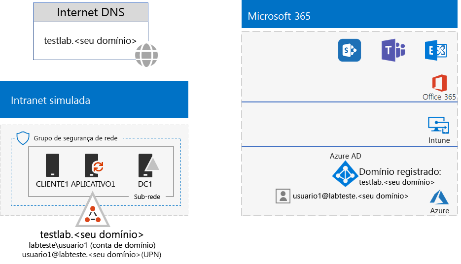
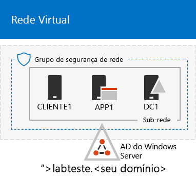
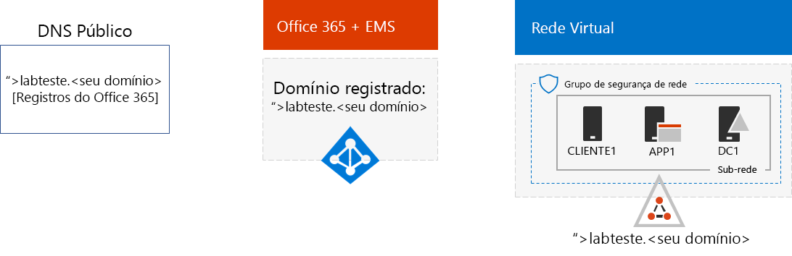

# <a name="password-hash-synchronization-for-your-microsoft-365-test-environment"></a>Sincronização de hash de senha para ambiente de teste do Microsoft 365

Muitas organizações usam o Azure AD Connect e a sincronização de hash de senha para sincronizar o conjunto de contas na própria floresta do Active Directory Domain Services (AD DS) local com o conjunto de contas no locatário do Azure AD de suas assinaturas do Office 365 e EMS E5. Este artigo descreve como adicionar a sincronização de hash de senha a seu ambiente de teste do Microsoft 365, resultando na seguinte configuração:
  

  
Há duas fases para configurar esse ambiente de teste:
  
1. Crie o ambiente de teste corporativo simulado do Microsoft 365.
2. Instale e configure o Azure AD Connect na APP1.
    
> [!TIP]
> Clique [aqui](https://aka.ms/m365etlgstack) para ver um mapa visual de todos os artigos da pilha do Guia de Laboratório de Teste do Microsoft 365 Enterprise.
  
## <a name="phase-1-create-the-microsoft-365-simulated-enterprise-test-environment"></a>Fase 1 – Criar o ambiente de teste corporativo simulado do Microsoft 365

Siga as instruções da [configuração base corporativa simulada do Microsoft 365](simulated-ent-base-configuration-microsoft-365-enterprise.md). Aqui está a configuração resultante.
  

  
Esta configuração consiste em: 
  
- Assinaturas pagas ou de avaliação do Office 365 E5 e EMS E5.
- Uma intranet de organização simplificada conectada à Internet, que consiste em máquinas virtuais do DC1, APP1 e CLIENT1 em uma rede virtual do Azure. O DC1 é um controlador de domínio para o testlab.\<seu nome de domínio público> domínio do Active Directory Domain Services (AD DS).

## <a name="phase-2-create-and-register-the-testlab-domain"></a>Fase 2 – Criar e registrar o domínio testlab

Nesta fase, você adiciona um domínio DNS público e o adiciona-o à assinatura.

Primeiro, trabalhe com um provedor de registro DNS público para criar um nome de domínio DNS público com base em um nome de domínio atual e adicioná-lo à assinatura do Office 365. Recomendamos usar o nome **testlab.**\<domínio público>. Por exemplo, se o nome de domínio público for <span>**contoso</span>.com**, adicione o nome de domínio público **<span>testlab</span>.contoso.com**.
  
Em seguida, adicione o **testlab.**\<seu domínio público> domínio da sua assinatura de avaliação ou paga do Office 365 por meio do processo de registro de domínio. Isso consiste em adicionar outros registros DNS ao **testlab.**\<seu domínio público> domínio. Confira mais informações em [Adicionar usuários e domínio ao Office 365](https://support.office.com/article/Add-users-and-domain-to-Office-365-6383f56d-3d09-4dcb-9b41-b5f5a5efd611). 

Esta é a configuração resultante.
  

  
Esta configuração consiste em:

- Assinaturas pagas ou de avaliação do Office 365 E5 e EMS E5 com o domínio DNS testlab.\<seu nome de domínio público> registrado.
- Uma intranet de organização simplificada conectado à Internet, que consiste em máquinas virtuais do DC1 APP1 e CLIENT1 em uma sub-rede de uma rede virtual do Azure.

Veja como o testlab.\<seu nome de domínio público> está agora:

- Compatível com registros DNS públicos.
- Registrado nas assinaturas do Office 365 e do EMS.
- O domínio AD DS na sua intranet simulada.
     
## <a name="phase-3-install-azure-ad-connect-on-app1"></a>Fase 3 – Instalar o Azure AD Connect na APP1

Nesta fase, instale e configure a ferramenta Azure AD Connect na APP1 e verifique se ela funciona.
  
Primeiro, instale e configure o Azure AD Connect na APP1.

1. No [Portal do Azure](https://portal.azure.com), entre com a conta de administrador global e conecte-se à APP1 com a conta \\Usuário1 do TestLab.
    
2. Na área de trabalho da APP1, abra um prompt de comando do nível de administrador do Windows PowerShell e execute estes comandos:
    
   ```
   Set-ItemProperty -Path "HKLM:\SOFTWARE\Microsoft\Active Setup\Installed Components\{A509B1A7-37EF-4b3f-8CFC-4F3A74704073}" -Name "IsInstalled" -Value 0
   Set-ItemProperty -Path "HKLM:\SOFTWARE\Microsoft\Active Setup\Installed Components\{A509B1A8-37EF-4b3f-8CFC-4F3A74704073}" -Name "IsInstalled" -Value 0
   Stop-Process -Name Explorer -Force
   ```

3. Na barra de tarefas, clique em **Internet Explorer** e acesse [https://aka.ms/aadconnect](https://aka.ms/aadconnect).
    
4. Na página do Microsoft Azure Active Directory Connect, clique em **Baixar** e, em seguida, clique em **Executar**.
    
5. Na página **Bem-vindo ao Azure AD Connect**, clique em **Concordo** e, em seguida, **Continuar**.
    
6. Na página **Configurações Expressas**, clique em **Usar configurações expressas**.
    
7. Na página **Conectar-se ao Azure AD**, digite o nome da conta de administrador global do Office 365 em **Nome de usuário**, digite a sua senha em **Senha** e clique em **Avançar**.
    
8. Na página **Conectar-se ao AD DS**, digite **TestLab\\Usuário1** no campo **Nome de usuário**, digite a senha no campo **Senha** e clique em **Avançar**.
    
9. Na página **Pronto para configurar**, clique em **Instalar**.
    
10. Na página **Configuração concluída**, clique em **Sair**.
    
11. No Internet Explorer, vá para o centro de administração do Microsoft 365 ([https://portal.microsoft.com](https://portal.microsoft.com)).
    
12. Na navegação à esquerda, clique em **Usuários > Usuários ativos**.
    
    Observe a conta denominada **Usuario1**. Essa conta fica no domínio TESTLAB do AD DS e é uma prova de que a sincronização de diretórios funcionou.
    
13. Clique na conta **Usuário1**. Para licenças de produto, clique em **Editar**.
    
14. Em **Licenças de produto**, selecione o país/região e clique no controle **Desativado** da licença do **Office 365 Enterprise E5** (mudando-o para **Ativado**). Faça o mesmo procedimento para a licença do **Enterprise Mobility + Security E5**. 

15. Clique em **Salvar**, no final da página, e clique em **Fechar**.
    
Em seguida, teste a capacidade de entrar na assinatura do Office 365 com a conta <strong>usuario1@testlab.</strong>\<seu nome de domínio > nome de usuário da conta Usuário1.

1. No APP1, encerre o Office 365 e entre novamente, mas desta vez especifique uma conta diferente.

2. Quando solicitado a fornecer o nome de usuário e a senha, especifique <strong>usuario1@testlab.</strong>\<seu nome de domínio público> e a senha de Usuário1. Você deve entrar como Usuário1. 
 
Observe que, embora o Usuario1 tenha permissões de administrador de domínio para o domínio TESTLAB do AD DS, ele não é um administrador global do Office 365. Portanto, o ícone **Administrador** não estará disponível como opção. 

Esta é a configuração resultante.


Esta configuração consiste em: 
  
- Assinaturas pagas ou de avaliação do Office 365 E5 e EMS E5 com o domínio DNS TESTLAB.\<seu nome de domínio> registrado.
- Uma intranet de organização simplificada conectado à Internet, que consiste em máquinas virtuais do DC1 APP1 e CLIENT1 em uma sub-rede de uma rede virtual do Azure. O Azure AD Connect é executado periodicamente no APP1 para sincronizar o domínio TESTLAB do AD DS com o locatário do Azure AD de suas assinaturas do Office 365 e EMS E5.
- A conta Usuario1 no domínio TESTLAB do AD DS foi sincronizada com o locatário do Azure AD.

## <a name="next-step"></a>Próxima etapa

Explorar recursos e funcionalidades adicionais de [identidade](m365-enterprise-test-lab-guides.md#identity) no ambiente de teste.

## <a name="see-also"></a>Confira também

[Guias do Laboratório de Teste do Microsoft 365 Enterprise](m365-enterprise-test-lab-guides.md)

[Implantar o Microsoft 365 Enterprise](deploy-microsoft-365-enterprise.md)

[Documentação do Microsoft 365 Enterprise](https://docs.microsoft.com/microsoft-365-enterprise/)


