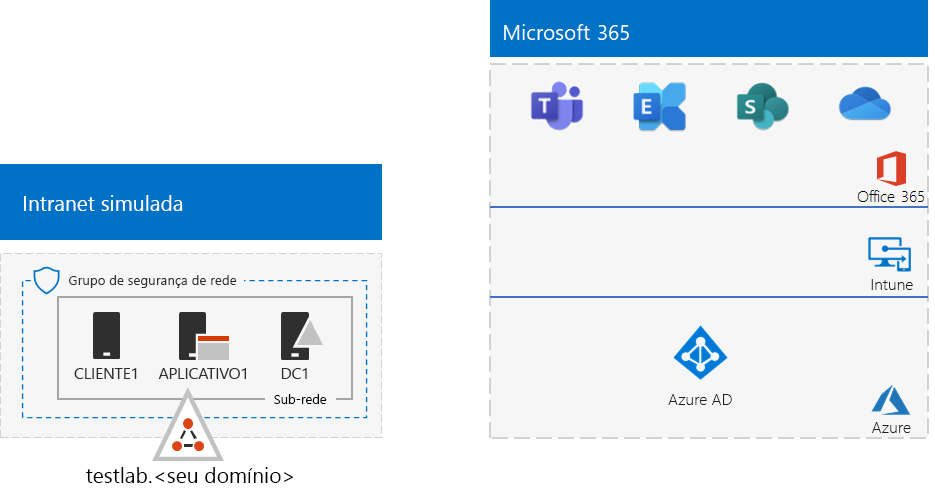
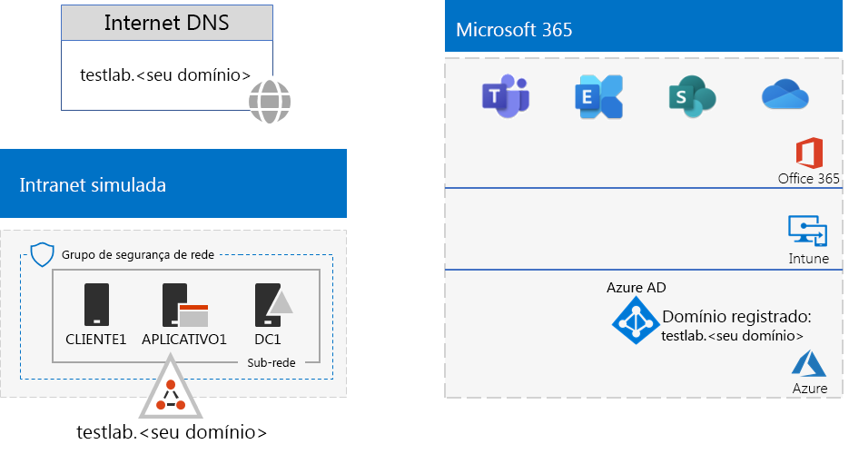

# <a name="password-hash-synchronization-for-your-microsoft-365-test-environment"></a><span data-ttu-id="4c3a8-103">Sincronização de hash de senha para ambiente de teste do Microsoft 365</span><span class="sxs-lookup"><span data-stu-id="4c3a8-103">Password hash synchronization for your Microsoft 365 test environment</span></span>

<span data-ttu-id="4c3a8-104">*Este Guia de Laboratório de Testes pode ser usado para ambientes de teste do Microsoft 365 Enterprise e do Office 365 Enterprise.*</span><span class="sxs-lookup"><span data-stu-id="4c3a8-104">*This Test Lab Guide can be used for both Microsoft 365 Enterprise and Office 365 Enterprise test environments.*</span></span>

<span data-ttu-id="4c3a8-105">Muitas organizações usam o Azure Ad Connect e a sincronização de hash de senha para sincronizar o conjunto de contas na própria floresta do Active Directory Domain Services (AD DS) com o conjunto de contas no locatário do Azure AD de sua assinatura do Microsoft 365 ou do Office 365.</span><span class="sxs-lookup"><span data-stu-id="4c3a8-105">Many organizations use Azure AD Connect and password hash synchronization to synchronize the set of accounts in their on-premises Active Directory Domain Services (AD DS) forest to the set of accounts in the Azure AD tenant of their Microsoft 365 or Office 365 subscription.</span></span> <span data-ttu-id="4c3a8-106">Este artigo descreve como adicionar a sincronização de hash de senha a seu ambiente de teste do Microsoft 365, resultando na seguinte configuração:</span><span class="sxs-lookup"><span data-stu-id="4c3a8-106">This article describes how you can add password hash synchronization to your Microsoft 365 test environment, resulting in the following configuration:</span></span>
  

  
<span data-ttu-id="4c3a8-108">Há duas fases para configurar esse ambiente de teste:</span><span class="sxs-lookup"><span data-stu-id="4c3a8-108">There are two phases to setting up this test environment:</span></span>
  
1. <span data-ttu-id="4c3a8-109">Crie o ambiente de teste corporativo simulado do Microsoft 365.</span><span class="sxs-lookup"><span data-stu-id="4c3a8-109">Create the Microsoft 365 simulated enterprise test environment.</span></span>
2. <span data-ttu-id="4c3a8-110">Instale e configure o Azure AD Connect na APP1.</span><span class="sxs-lookup"><span data-stu-id="4c3a8-110">Install and configure Azure AD Connect on APP1.</span></span>
    
> [!TIP]
> <span data-ttu-id="4c3a8-111">Clique [aqui](../media/m365-enterprise-test-lab-guides/Microsoft365EnterpriseTLGStack.pdf) para ver um mapa visual de todos os artigos da pilha do Guia de Laboratório de Teste do Microsoft 365 Enterprise.</span><span class="sxs-lookup"><span data-stu-id="4c3a8-111">Click [here](../media/m365-enterprise-test-lab-guides/Microsoft365EnterpriseTLGStack.pdf) for a visual map to all the articles in the Microsoft 365 Enterprise Test Lab Guide stack.</span></span>
  
## <a name="phase-1-create-the-microsoft-365-simulated-enterprise-test-environment"></a><span data-ttu-id="4c3a8-112">Fase 1 – Criar o ambiente de teste corporativo simulado do Microsoft 365</span><span class="sxs-lookup"><span data-stu-id="4c3a8-112">Phase 1: Create the Microsoft 365 simulated enterprise test environment</span></span>

<span data-ttu-id="4c3a8-p102">Siga as instruções da [configuração base corporativa simulada do Microsoft 365](simulated-ent-base-configuration-microsoft-365-enterprise.md). Aqui está a configuração resultante.</span><span class="sxs-lookup"><span data-stu-id="4c3a8-p102">Follow the instructions in [simulated enterprise base configuration for Microsoft 365](simulated-ent-base-configuration-microsoft-365-enterprise.md). Here is your resulting configuration.</span></span>
  

  
<span data-ttu-id="4c3a8-116">Esta configuração consiste em:</span><span class="sxs-lookup"><span data-stu-id="4c3a8-116">This configuration consists of:</span></span> 
  
- <span data-ttu-id="4c3a8-117">Assinatura de avaliação ou assinatura paga do Microsoft 365 E5 ou Office 365 E5.</span><span class="sxs-lookup"><span data-stu-id="4c3a8-117">Microsoft 365 E5 or Office 365 E5 trial or paid subscriptions.</span></span>
- <span data-ttu-id="4c3a8-118">Uma intranet de organização simplificada conectada à Internet, que consiste em máquinas virtuais do DC1, APP1 e CLIENT1 em uma rede virtual do Azure.</span><span class="sxs-lookup"><span data-stu-id="4c3a8-118">A simplified organization intranet connected to the Internet, consisting of the DC1, APP1, and CLIENT1 virtual machines in an Azure virtual network.</span></span> <span data-ttu-id="4c3a8-119">O DC1 é um controlador de domínio para o testlab.\<seu nome de domínio público> domínio do AD DS.</span><span class="sxs-lookup"><span data-stu-id="4c3a8-119">DC1 is a domain controller for the testlab.\<your public domain name> AD DS domain.</span></span>

## <a name="phase-2-create-and-register-the-testlab-domain"></a><span data-ttu-id="4c3a8-120">Fase 2 – Criar e registrar o domínio testlab</span><span class="sxs-lookup"><span data-stu-id="4c3a8-120">Phase 2: Create and register the testlab domain</span></span>

<span data-ttu-id="4c3a8-121">Nesta fase, você adiciona um domínio DNS público e o adiciona-o à assinatura.</span><span class="sxs-lookup"><span data-stu-id="4c3a8-121">In this phase you add a public DNS domain and add it to your subscription.</span></span>

<span data-ttu-id="4c3a8-p104">Primeiro, trabalhe com um provedor de registro DNS público para criar um nome de domínio DNS público com base em um nome de domínio atual e adicioná-lo à sua assinatura. Recomendamos usar o nome **testlab.**\<domínio público>. Por exemplo, se o nome de domínio público for **<span>contoso</span>.com**, adicione o nome de domínio público **<span>testlab</span>.contoso.com**.</span><span class="sxs-lookup"><span data-stu-id="4c3a8-p104">First, work with your public DNS registration provider to create a new public DNS domain name based on your current domain name and add it to your subscription. We recommend using the name **testlab.**\<your public domain>. For example, if your public domain name is **<span>contoso</span>.com**, add the public domain name **<span>testlab</span>.contoso.com**.</span></span>
  
<span data-ttu-id="4c3a8-125">Em seguida, adicione o domínio **testlab.**\<domínio público> da sua assinatura de avaliação ou paga do Microsoft 365 ou Office 365 por meio do processo de registro de domínio.</span><span class="sxs-lookup"><span data-stu-id="4c3a8-125">Next, you add the **testlab.**\<your public domain> domain to your Microsoft 365 or Office 365 trial or paid subscription by going through the domain registration process.</span></span> <span data-ttu-id="4c3a8-126">Isso consiste em adicionar outros registros DNS ao **testlab.**\<seu domínio público> domínio.</span><span class="sxs-lookup"><span data-stu-id="4c3a8-126">This consists of adding additional DNS records to the **testlab.**\<your public domain> domain.</span></span> <span data-ttu-id="4c3a8-127">Para saber mais, confira [Adicionar um domínio ao Office 365.](https://docs.microsoft.com/office365/admin/setup/add-domain)</span><span class="sxs-lookup"><span data-stu-id="4c3a8-127">For more information, see [Add a domain to Office 365](https://docs.microsoft.com/office365/admin/setup/add-domain).</span></span> 

<span data-ttu-id="4c3a8-128">Esta é a configuração resultante.</span><span class="sxs-lookup"><span data-stu-id="4c3a8-128">Here is your resulting configuration.</span></span>
  

  
<span data-ttu-id="4c3a8-130">Esta configuração consiste em:</span><span class="sxs-lookup"><span data-stu-id="4c3a8-130">This configuration consists of:</span></span>

- <span data-ttu-id="4c3a8-131">Assinaturas pagas ou de avaliação do Microsoft 365 E5 ou do Office 365 E5 com o domínio DNS testlab.\<seu nome de domínio público> registrado.</span><span class="sxs-lookup"><span data-stu-id="4c3a8-131">Microsoft 365 E5 or Office 365 E5 trial or paid subscriptions with the DNS domain testlab.\<your public domain name> registered.</span></span>
- <span data-ttu-id="4c3a8-132">Uma intranet de organização simplificada conectado à Internet, que consiste em máquinas virtuais do DC1 APP1 e CLIENT1 em uma sub-rede de uma rede virtual do Azure.</span><span class="sxs-lookup"><span data-stu-id="4c3a8-132">A simplified organization intranet connected to the Internet, consisting of the DC1, APP1, and CLIENT1 virtual machines on a subnet of an Azure virtual network.</span></span>

<span data-ttu-id="4c3a8-133">Veja como o testlab.\<seu nome de domínio público> está agora:</span><span class="sxs-lookup"><span data-stu-id="4c3a8-133">Notice how the testlab.\<your public domain name> is now:</span></span>

- <span data-ttu-id="4c3a8-134">Compatível com registros DNS públicos.</span><span class="sxs-lookup"><span data-stu-id="4c3a8-134">Supported by public DNS records.</span></span>
- <span data-ttu-id="4c3a8-135">Registrado nas assinaturas do Microsoft 365 ou do Office 365.</span><span class="sxs-lookup"><span data-stu-id="4c3a8-135">Registered in your Microsoft 365 or Office 365 subscriptions.</span></span>
- <span data-ttu-id="4c3a8-136">O domínio AD DS na sua intranet simulada.</span><span class="sxs-lookup"><span data-stu-id="4c3a8-136">The AD DS domain on your simulated intranet.</span></span>
     
## <a name="phase-3-install-azure-ad-connect-on-app1"></a><span data-ttu-id="4c3a8-137">Fase 3 – Instalar o Azure AD Connect na APP1</span><span class="sxs-lookup"><span data-stu-id="4c3a8-137">Phase 3: Install Azure AD Connect on APP1</span></span>

<span data-ttu-id="4c3a8-138">Nesta fase, instale e configure a ferramenta Azure AD Connect na APP1 e verifique se ela funciona.</span><span class="sxs-lookup"><span data-stu-id="4c3a8-138">In this phase, you install and configure the Azure AD Connect tool on APP1, and then verify that it works.</span></span>
  
<span data-ttu-id="4c3a8-139">Primeiro, instale e configure o Azure AD Connect na APP1.</span><span class="sxs-lookup"><span data-stu-id="4c3a8-139">First, you install and configure Azure AD Connect on APP1.</span></span>

1. <span data-ttu-id="4c3a8-140">No [Portal do Azure](https://portal.azure.com), entre com a conta de administrador global e conecte-se à APP1 com a conta \\Usuário1 do TestLab.</span><span class="sxs-lookup"><span data-stu-id="4c3a8-140">From the [Azure portal](https://portal.azure.com), sign in with your global administrator account, and then connect to APP1 with the TESTLAB\\User1 account.</span></span>
    
2. <span data-ttu-id="4c3a8-141">Na área de trabalho da APP1, abra um prompt de comando do nível de administrador do Windows PowerShell e execute estes comandos:</span><span class="sxs-lookup"><span data-stu-id="4c3a8-141">From the desktop of APP1, open an administrator-level Windows PowerShell command prompt, and then run these commands:</span></span>
    
   ```powershell
   Set-ItemProperty -Path "HKLM:\SOFTWARE\Microsoft\Active Setup\Installed Components\{A509B1A7-37EF-4b3f-8CFC-4F3A74704073}" -Name "IsInstalled" -Value 0
   Set-ItemProperty -Path "HKLM:\SOFTWARE\Microsoft\Active Setup\Installed Components\{A509B1A8-37EF-4b3f-8CFC-4F3A74704073}" -Name "IsInstalled" -Value 0
   Stop-Process -Name Explorer -Force
   ```

3. <span data-ttu-id="4c3a8-142">Na barra de tarefas, clique em **Internet Explorer** e acesse [https://aka.ms/aadconnect](https://aka.ms/aadconnect).</span><span class="sxs-lookup"><span data-stu-id="4c3a8-142">From the task bar, click **Internet Explorer** and go to [https://aka.ms/aadconnect](https://aka.ms/aadconnect).</span></span>
    
4. <span data-ttu-id="4c3a8-143">Na página do Microsoft Azure Active Directory Connect, clique em **Baixar** e, em seguida, clique em **Executar**.</span><span class="sxs-lookup"><span data-stu-id="4c3a8-143">On the Microsoft Azure Active Directory Connect page, click **Download**, and then click **Run**.</span></span>
    
5. <span data-ttu-id="4c3a8-144">Na página **Bem-vindo ao Azure AD Connect**, clique em **Concordo** e, em seguida, **Continuar**.</span><span class="sxs-lookup"><span data-stu-id="4c3a8-144">On the **Welcome to Azure AD Connect** page, click **I agree**, and then click **Continue**.</span></span>
    
6. <span data-ttu-id="4c3a8-145">Na página **Configurações Expressas**, clique em **Usar configurações expressas**.</span><span class="sxs-lookup"><span data-stu-id="4c3a8-145">On the **Express Settings** page, click **Use express settings**.</span></span>
    
7. <span data-ttu-id="4c3a8-146">Na página **Conectar-se ao Azure AD**, digite o nome de sua conta de administrador global em **Nome de usuário**, digite a sua senha em **Senha** e clique em **Avançar**.</span><span class="sxs-lookup"><span data-stu-id="4c3a8-146">On the **Connect to Azure AD** page, type your global administrator account name in **Username,** type its password in **Password**, and then click **Next**.</span></span>
    
8. <span data-ttu-id="4c3a8-147">Na página **Conectar-se ao AD DS**, digite **TestLab\\Usuário1** no campo **Nome de usuário**, digite a senha no campo **Senha** e clique em **Avançar**.</span><span class="sxs-lookup"><span data-stu-id="4c3a8-147">On the **Connect to AD DS** page, type **TESTLAB\\User1** in **Username,** type its password in **Password**, and then click **Next**.</span></span>
    
9. <span data-ttu-id="4c3a8-148">Na página **Pronto para configurar**, clique em **Instalar**.</span><span class="sxs-lookup"><span data-stu-id="4c3a8-148">On the **Ready to configure** page, click **Install**.</span></span>
    
10. <span data-ttu-id="4c3a8-149">Na página **Configuração concluída**, clique em **Sair**.</span><span class="sxs-lookup"><span data-stu-id="4c3a8-149">On the **Configuration complete** page, click **Exit**.</span></span>
    
11. <span data-ttu-id="4c3a8-150">No Internet Explorer, vá para o centro de administração do Microsoft 365 ([https://portal.microsoft.com](https://portal.microsoft.com)).</span><span class="sxs-lookup"><span data-stu-id="4c3a8-150">In Internet Explorer, go to the Microsoft 365 admin center ([https://portal.microsoft.com](https://portal.microsoft.com)).</span></span>
    
12. <span data-ttu-id="4c3a8-151">Na navegação à esquerda, clique em **Usuários > Usuários ativos**.</span><span class="sxs-lookup"><span data-stu-id="4c3a8-151">In the left navigation, click **Users > Active users**.</span></span>
    
    <span data-ttu-id="4c3a8-152">Observe a conta denominada **Usuario1**.</span><span class="sxs-lookup"><span data-stu-id="4c3a8-152">Note the account named **User1**.</span></span> <span data-ttu-id="4c3a8-153">Essa conta fica no domínio TESTLAB do AD DS e é uma prova de que a sincronização de diretórios funcionou.</span><span class="sxs-lookup"><span data-stu-id="4c3a8-153">This account is from the TESTLAB AD DS domain and is proof that directory synchronization has worked.</span></span>
    
13. <span data-ttu-id="4c3a8-154">Clique na conta **Usuário1** e, em seguida, clique em **Licenças e aplicativos**.</span><span class="sxs-lookup"><span data-stu-id="4c3a8-154">Click the **User1** account, and then click **Licenses and apps**.</span></span>
    
14. <span data-ttu-id="4c3a8-155">Em **Licenças de produto**, selecione sua localização (se necessário), desabilite a licença do **Office 365 E5** e habilite a licença do **Microsoft 365 E5**.</span><span class="sxs-lookup"><span data-stu-id="4c3a8-155">In **Product licenses**, select your location (if needed), disable the **Office 365 E5** license and enable the **Microsoft 365 E5** license.</span></span> 

15. <span data-ttu-id="4c3a8-156">Clique em **Salvar**, no final da página, e clique em **Fechar**.</span><span class="sxs-lookup"><span data-stu-id="4c3a8-156">Click **Save** at the bottom of the page, and then click **Close**.</span></span>
    
<span data-ttu-id="4c3a8-157">Em seguida, teste a capacidade de entrar na sua assinatura com a conta <strong>usuario1@testlab.</strong>\<nome de domínio> nome de usuário da conta Usuário1.</span><span class="sxs-lookup"><span data-stu-id="4c3a8-157">Next, you test the ability to sign in to your subscription with the <strong>user1@testlab.</strong>\<your domain name> user name of the User1 account.</span></span>

1. <span data-ttu-id="4c3a8-158">No APP1, saia e entre novamente, mas desta vez especifique uma conta diferente.</span><span class="sxs-lookup"><span data-stu-id="4c3a8-158">From APP1, sign out, and then sign in again, this time specifying a different account.</span></span>

2. <span data-ttu-id="4c3a8-p107">Quando solicitado a fornecer o nome de usuário e a senha, especifique <strong>usuario1@testlab.</strong>\<seu nome de domínio público> e a senha de Usuário1. Você deve entrar como Usuário1.</span><span class="sxs-lookup"><span data-stu-id="4c3a8-p107">When prompted for a user name and password, specify <strong>user1@testlab.</strong>\<your domain name> and the User1 password. You should successfully sign in as User1.</span></span> 
 
<span data-ttu-id="4c3a8-161">Observe que, embora o Usuário1 tenha permissões de administrador de domínio para o domínio TESTLAB do AD DS, ele não é um administrador global.</span><span class="sxs-lookup"><span data-stu-id="4c3a8-161">Notice that although User1 has domain administrator permissions for the TESTLAB AD DS domain, it is not a global administrator.</span></span> <span data-ttu-id="4c3a8-162">Portanto, o ícone **Administrador** não estará disponível como opção.</span><span class="sxs-lookup"><span data-stu-id="4c3a8-162">Therefore, you will not see the **Admin** icon as an option.</span></span> 

<span data-ttu-id="4c3a8-163">Esta é a configuração resultante.</span><span class="sxs-lookup"><span data-stu-id="4c3a8-163">Here is your resulting configuration.</span></span>


<span data-ttu-id="4c3a8-165">Esta configuração consiste em:</span><span class="sxs-lookup"><span data-stu-id="4c3a8-165">This configuration consists of:</span></span> 
  
- <span data-ttu-id="4c3a8-166">Assinaturas pagas ou de avaliação do Microsoft 365 E5 ou do Office 365 E5 com o domínio DNS TESTLAB.\<seu nome de domínio>registrado.</span><span class="sxs-lookup"><span data-stu-id="4c3a8-166">Microsoft 365 E5 or Office 365 E5 trial or paid subscriptions with the DNS domain TESTLAB.\<your domain name> registered.</span></span>
- <span data-ttu-id="4c3a8-167">Uma intranet de organização simplificada conectado à Internet, que consiste em máquinas virtuais do DC1 APP1 e CLIENT1 em uma sub-rede de uma rede virtual do Azure.</span><span class="sxs-lookup"><span data-stu-id="4c3a8-167">A simplified organization intranet connected to the Internet, consisting of the DC1, APP1, and CLIENT1 virtual machines on a subnet of an Azure virtual network.</span></span> <span data-ttu-id="4c3a8-168">O Azure Ad Connect é executado periodicamente no APP1 para sincronizar o domínio TESTLAB do AD DS com o locatário do Azure AD de sua assinatura do Microsoft 365 ou Office 365.</span><span class="sxs-lookup"><span data-stu-id="4c3a8-168">Azure AD Connect runs on APP1 to synchronize the TESTLAB AD DS domain to the Azure AD tenant of your Microsoft 365 or Office 365 subscription periodically.</span></span>
- <span data-ttu-id="4c3a8-169">A conta Usuario1 no domínio TESTLAB do AD DS foi sincronizada com o locatário do Azure AD.</span><span class="sxs-lookup"><span data-stu-id="4c3a8-169">The User1 account in the TESTLAB  AD DS domain has been synchronized with the Azure AD tenant.</span></span>

## <a name="next-step"></a><span data-ttu-id="4c3a8-170">Próxima etapa</span><span class="sxs-lookup"><span data-stu-id="4c3a8-170">Next step</span></span>

<span data-ttu-id="4c3a8-171">Explorar recursos e funcionalidades adicionais de [identidade](m365-enterprise-test-lab-guides.md#identity) no ambiente de teste.</span><span class="sxs-lookup"><span data-stu-id="4c3a8-171">Explore additional [identity](m365-enterprise-test-lab-guides.md#identity) features and capabilities in your test environment.</span></span>

## <a name="see-also"></a><span data-ttu-id="4c3a8-172">Confira também</span><span class="sxs-lookup"><span data-stu-id="4c3a8-172">See also</span></span>

[<span data-ttu-id="4c3a8-173">Guias do Laboratório de Teste do Microsoft 365 Enterprise</span><span class="sxs-lookup"><span data-stu-id="4c3a8-173">Microsoft 365 Enterprise Test Lab Guides</span></span>](m365-enterprise-test-lab-guides.md)

[<span data-ttu-id="4c3a8-174">Implantar o Microsoft 365 Enterprise</span><span class="sxs-lookup"><span data-stu-id="4c3a8-174">Deploy Microsoft 365 Enterprise</span></span>](deploy-microsoft-365-enterprise.md)

[<span data-ttu-id="4c3a8-175">Documentação do Microsoft 365 Enterprise</span><span class="sxs-lookup"><span data-stu-id="4c3a8-175">Microsoft 365 Enterprise documentation</span></span>](https://docs.microsoft.com/microsoft-365-enterprise/)


