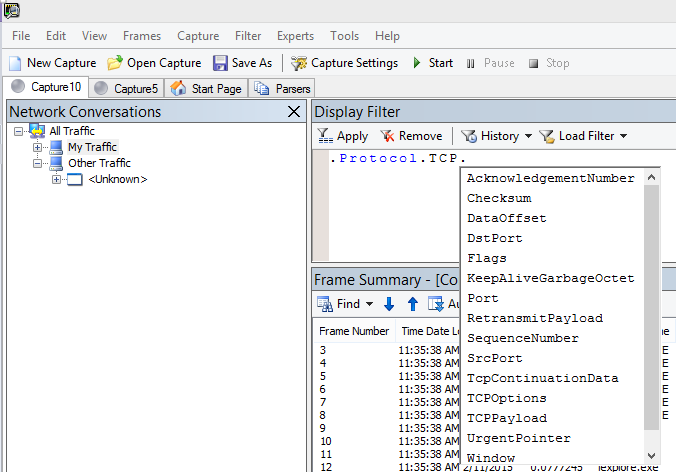
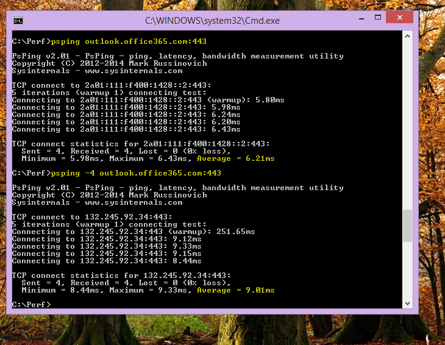
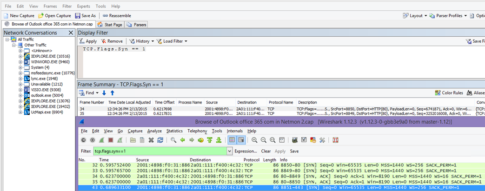
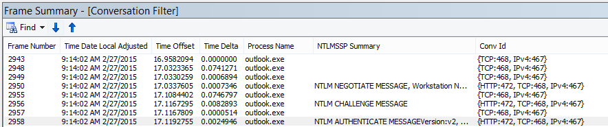
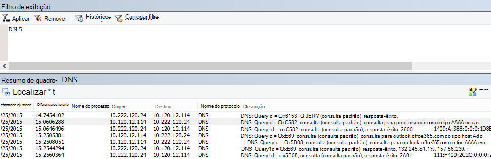
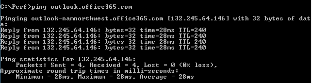

# <a name="performance-troubleshooting-plan-for-office-365"></a>Plano de solução de problemas de desempenho do Office 365

Você precisa saber as etapas a serem tomadas para identificar e corrigir o retardo, as interrupções e o desempenho lento entre o SharePoint Online, o OneDrive for Business, o Exchange Online ou o Skype for Business Online e o computador cliente? Antes de ligar para o suporte, este artigo pode ajudá-lo a solucionar problemas de desempenho do Office 365 e até mesmo corrigir alguns dos problemas mais comuns.
  
Este artigo é, na verdade, um plano de ação de exemplo que você pode usar para capturar dados valiosos sobre seu problema de desempenho, pois ele está ocorrendo. Alguns problemas principais também estão incluídos neste artigo.

Se você é novo no desempenho da rede e deseja fazer um plano de longo prazo para monitorar o desempenho entre suas máquinas clientes e o Office 365, confira o artigo sobre [ajuste de desempenho do office 365 e solução de problemas-admin e profissionais de ti](performance-tuning-using-baselines-and-history.md).
  
## <a name="sample-performance-troubleshooting-action-plan"></a>Exemplo de plano de ação de solução de problemas de desempenho

Este plano de ação contém duas partes; uma fase de preparação e uma fase de registro em log. Se você tem um problema de desempenho no momento e precisa fazer a coleta de dados, você pode começar a usar esse plano imediatamente.
  
### <a name="prepare-the-client-computer"></a>Preparar o computador cliente
  
- Encontre um computador cliente que possa reproduzir o problema de desempenho. Este computador será usado durante o curso de solução de problemas.
- Anote as etapas que causam o problema de desempenho para que você esteja pronto para testar.
- Instale as ferramentas de coleta e gravação de informações:
  - Instale o [Netmon 3,4](https://www.microsoft.com/download/details.aspx?id=4865) (ou use uma ferramenta de rastreamento de rede equivalente).
  - Instale a edição básica gratuita do [HTTPWatch](https://www.httpwatch.com/download/) (ou use uma ferramenta de rastreamento de rede equivalente).
  - Use um gravador de tela ou execute o gravador de passos (PSR.exe) que acompanha o Windows Vista e posterior, para manter um registro das etapas realizadas durante o teste.

### <a name="log-the-performance-issue"></a>Registrar o problema de desempenho
  
- Feche todos os navegadores da Internet estranhos.
- Inicie o gravador de etapas ou outro gravador de tela.
- Inicie o Netmon Capture (ou a ferramenta de rastreamento de rede).
- Limpe o cache DNS no computador cliente a partir da linha de comando digitando ipconfig/flushdns.
- Inicie uma nova sessão do navegador e ative o HTTPWatch.
- Opcional: se você estiver testando o Exchange Online, execute a ferramenta Analisador de desempenho de cliente do Exchange a partir do console de administração do Office 365.
- Reproduza as etapas exatas que causam o problema de desempenho.
- Interrompa seu Netmon ou o rastreamento de outra ferramenta.
- Na linha de comando, execute uma rota de rastreamento para sua assinatura do Office 365 digitando o seguinte comando e pressionando ENTER:

  ``` cmd
  tracert <subscriptionname>.onmicrosoft.com
  ```

- Interrompa o gravador de etapas e salve o vídeo. Certifique-se de incluir a data e a hora da captura e se ela demonstra um desempenho bom ou ruim.
- Salve os arquivos de rastreamento. Novamente, certifique-se de incluir a data e a hora da captura e se ela demonstra um desempenho bom ou ruim.

Se você não estiver familiarizado com a execução das ferramentas mencionadas neste artigo, não se preocupe porque fornecemos essas etapas em seguida. Se você estiver acostumado a fazer esse tipo de captura de rede, poderá ignorar [como coletar linhas de base](performance-tuning-using-baselines-and-history.md#how-to-collect-baselines), que descrevem a filtragem e a leitura dos logs.
  
### <a name="flush-the-dns-cache-first"></a>Liberar primeiro o cache DNS

Por quê? Liberando o cache DNS que você está iniciando em seus testes com uma ardósia limpa. Ao limpar o cache, você está redefinindo o conteúdo do resolvedor de DNS para as entradas mais atualizadas. Lembre-se de que um flush não remove as entradas de arquivo hosts. Se você usar entradas de arquivo de HOST extensivamente, você deve copiar essas entradas para um arquivo em outro diretório e, em seguida, esvaziar o arquivo HOST.
  
#### <a name="flush-your-dns-resolver-cache"></a>Liberar o cache do DNS resolver
  
1. Abra o prompt de comando, ( **inicie** \> **executar** \> **cmd** ou **tecla Windows** \> **cmd**).
2. Digite o comando a seguir e pressione ENTER:

    ``` cmd
    ipconfig /flushdns
    ```

## <a name="netmon"></a>Netmon

A ferramenta de monitoramento de rede da Microsoft ([Netmon](https://www.microsoft.com/download/details.aspx?id=4865)) analisa pacotes, o que é tráfego, que passa entre computadores em redes. Usando o netmon para rastrear o tráfego com o Office 365 você pode capturar, exibir e ler cabeçalhos de pacote, identificar dispositivos intervenientes, verificar as configurações importantes do hardware de rede, procurar pacotes descartados e acompanhar o fluxo de tráfego entre computadores em sua rede corporativa e o Office 365. Como o corpo real do tráfego é criptografado, ou seja, ele (viaja na porta 443 por SSL/TLS, você não pode ler os arquivos que estão sendo enviados. Em vez disso, você obtém um rastreamento não filtrado do caminho que o pacote realiza, o que pode ajudá-lo a rastrear o comportamento do problema.
  
Certifique-se de não aplicar um filtro no momento. Em vez disso, execute as etapas e demonstre o problema antes de interromper o rastreamento e salvar.
  
Após instalar o Netmon 3,4, abra a ferramenta e execute estas etapas:
  
### <a name="take-a-netmon-trace-and-reproduce-the-issue"></a>Faça um rastreamento do Netmon e reproduza o problema
  
1. Inicie o Netmon 3,4.
Há três painéis na página **inicial** : **capturas recentes**, **selecione redes**e a **introdução ao monitor de rede da Microsoft 3,4. Aviso**. O painel Selecionar redes também fornecerá uma lista das redes padrão que você pode capturar. Certifique-se de que as placas de rede estão selecionadas aqui.

2. Clique em **nova captura** na parte superior da página **inicial** . Isso adiciona uma nova guia ao lado da guia página **inicial** chamada **captura 1**.


3. Para fazer uma captura simples, clique em **Iniciar** na barra de ferramentas.

4. Reproduza as etapas que apresentam um problema de desempenho.

5. Clique em **parar** \> **arquivo** \> **salvar como**. Lembre-se de fornecer a data e hora com o fuso horário e para mencionar se ele demonstra um desempenho ruim ou bom.

## <a name="httpwatch"></a>HTTPWatch

O [HTTPWatch](https://www.httpwatch.com/download/) é cobrado e uma edição gratuita. O Basic Edition gratuito cobre tudo o que você precisa para este teste. O HTTPWatch monitora o tráfego de rede e o tempo de carregamento da página diretamente da janela do navegador. HTTPWatch é um plug-in para o Internet Explorer que descreve graficamente o desempenho. A análise pode ser salva e exibida no HTTPWatch Studio.
  
> [!NOTE]
> Se você usar outro navegador, como o Firefox, Google Chrome ou se não conseguir instalar o HTTPWatch no Internet Explorer, abra uma nova janela do navegador e pressione F12 no teclado. Você deve ver a ferramenta de desenvolvedor pop-up na parte inferior do seu navegador. Se você usar o Opera, pressione CTRL + SHIFT + I para Web inspector e, em seguida, clique na guia **rede** e conclua o teste descrito abaixo. As informações serão levemente diferentes, mas os tempos de carregamento ainda serão exibidos em milissegundos. > HTTPWatch também é muito útil para problemas com tempos de carregamento de página do SharePoint Online.
  
### <a name="run-httpwatch-and-reproduce-the-issue"></a>Executar o HTTPWatch e reproduzir o problema
  
HTTPWatch é um plug-in de navegador, então expor a ferramenta no navegador é um pouco diferente para cada versão do Internet Explorer. Normalmente, você pode encontrar HTTPWatch na barra de comandos no navegador Internet Explorer. Se você não vir o plug-in do HTTPWatch na janela do navegador, verifique a versão do navegador clicando em **ajuda** \> **sobre**ou em versões posteriores do Internet Explorer, clique no símbolo de engrenagem e **sobre o Internet Explorer**. Para iniciar a barra de **comandos** , clique com o botão direito do mouse na barra de menus no Internet Explorer e clique em **barra de comandos**.

No passado, o HTTPWatch foi associado aos comandos e às barras do Explorer, portanto, depois de instalar o, se você não vir imediatamente o ícone (mesmo após a reinicialização), as **ferramentas**de verificação e as barras de ferramentas do ícone. Lembre-se de que as barras de ferramentas podem ser personalizadas e as opções podem ser adicionadas a elas.


  
1. Inicie o HTTPWatch em uma janela do navegador Internet Explorer. Ele aparece encaixado no navegador na parte inferior da janela. Clique em **gravar**.

2. Reproduzir as etapas exatas envolvidas no problema de desempenho. Clique no botão **parar** no HTTPWatch.

3. **Salve** o HTTPWatch ou **envie por email**. Lembre-se de nomear o arquivo para que ele inclua informações de data e hora e uma indicação de que sua inspeção contém uma demonstração de desempenho bom ou ruim.


Esta captura de tela é da versão profissional do HTTPWatch. Você pode abrir rastreamentos feitos na versão básica em um computador com uma versão profissional e lê-lo. Informações adicionais podem estar disponíveis no rastreamento através desse método.

## <a name="problem-steps-recorder"></a>Gravador de etapas do problema

O gravador de etapas, ou PSR.exe, permite que você grave problemas à medida que estão ocorrendo. É uma ferramenta muito útil e muito simples de ser executada.
  
### <a name="run-problem-steps-recorder-psrexe-to-record-your-work"></a>Executar o gravador de etapas do problema (PSR.exe) para registrar seu trabalho
  
1. Use **Iniciar** \> **Run** \> tipo de execução **PSR.exe** \> **OK**ou clique no tipo de **tecla Windows** \> **PSR.exe** \> e pressione Enter.

2. Quando a janela de PSR.exe pequeno for exibida, clique em **Iniciar registro** e reproduza as etapas que reproduzirão o problema de desempenho. Você pode adicionar comentários conforme necessário, clicando em **adicionar comentários**.

3. Clique em **parar registro** quando você tiver concluído as etapas. Se o problema de desempenho for uma página renderizada, aguarde até que a página seja processada antes de interromper a gravação.

4. Clique em **Salvar**.


  
A data e hora são registradas para você. Isso vincula seu PSR ao seu rastreamento do Netmon e ao HTTPWatch no momento e ajuda na solução de problemas de precisão. A data e hora no registro PSR podem mostrar um minuto passado entre o login e a navegação da URL e o processamento parcial do site de administração, por exemplo.
  
## <a name="read-your-traces"></a>Ler seus rastreamentos

Não é possível ensinar tudo sobre a solução de problemas de rede e desempenho que alguém precisa saber por meio de um artigo. Obter uma boa qualidade de desempenho é a experiência e o conhecimento de como sua rede funciona e normalmente realiza. Mas é possível arredondar uma lista de principais problemas e mostrar como as ferramentas podem facilitar a eliminação dos problemas mais comuns.
  
Se você deseja pegar as habilidades de leitura de rastreamentos de rede para seus sites do Office 365, não há mais professores do que criar rastros de cargas de página regularmente e obtendo uma experiência de leitura. Por exemplo, quando você tiver uma chance, carregue um serviço do Office 365 e rastreie o processo. Filtrar o rastreamento do tráfego DNS ou pesquisar o FrameData para o nome do serviço que você navegou. Examine o rastreamento para ter uma ideia das etapas que ocorrem quando o serviço é carregado. Isso ajudará você a saber qual será a aparência da carga de página normal e, no caso de solução de problemas, especialmente em torno do desempenho, a comparação de rastreamentos ruins pode ensinar muito.
  
O Netmon usa o Microsoft IntelliSense no campo filtro de exibição. O IntelliSense ou o auto-completar de código inteligente é que o truque onde você digita um período e todas as opções disponíveis são exibidos em uma caixa de seleção suspensa. Se, por exemplo, você estiver preocupado sobre o dimensionamento de janela TCP, você pode encontrar o caminho para um filtro (como  `.protocol.tcp.window < 100` ) por esse meio.
  

  
Os rastreamentos do Netmon podem ter muito tráfego. Se você não tiver a leitura deles, provavelmente será sobrecarregado abrir o rastreamento pela primeira vez. A primeira coisa a fazer é separar o sinal do ruído de fundo no rastreamento. Você testou o Office 365, e esse é o tráfego que você deseja ver. Se você for usado para navegar pelos rastreamentos, talvez não precise desta lista.
  
O tráfego entre o cliente e o Office 365 passa via TLS, o que significa que o corpo do tráfego será criptografado e não legível em um rastreamento genérico do Netmon. Sua análise de desempenho não precisa saber as especificidades das informações no pacote. No entanto, é muito interessado nos cabeçalhos de pacote e nas informações que eles contêm.
  
### <a name="tips-to-get-a-good-trace"></a>Dicas para obter um bom rastreamento
  
- Saiba o valor do endereço IPv4 ou IPv6 do computador cliente. Você pode fazer isso no prompt de comando digitando **ipconfig** e pressionando ENTER. O conhecimento deste endereço permitirá que você informe rapidamente se o tráfego no rastreamento envolve diretamente o computador cliente. Se houver um proxy conhecido, execute o ping nele e também Obtenha seu endereço IP.

- Libere o cache do DNS resolver e, se possível, feche todos os navegadores, exceto aquele em que você está executando seus testes. Se não for possível fazer isso, por exemplo, se o suporte estiver usando uma ferramenta baseada em navegador para ver a área de trabalho do computador cliente, prepare-se para filtrar o rastreamento.

- Em um rastreamento ocupado, localize o serviço do Office 365 que você está usando. Se você nunca utilizou o tráfego antes ou raramente, esta é uma etapa útil para separar o problema de desempenho de outros ruídos de rede. Há algumas maneiras de fazer isso. Diretamente antes do teste, você pode usar _ping_ ou _PsPing_ em relação à URL do serviço específico ( `ping outlook.office365.com` ou `psping -4 microsoft-my.sharepoint.com:443` , por exemplo). Você também pode encontrar facilmente esse ping ou PsPing em um rastreamento do Netmon (por seu nome de processo). Isso fornecerá um lugar para começar a procurar.

Se você estiver usando o rastreamento do Netmon no momento do problema, não há problemas. Para se orientar, use um filtro como `ContainsBin(FrameData, ASCII, "office")` ou `ContainsBin(FrameData, ASCII, "outlook")` . Você pode gravar seu número de quadro do arquivo de rastreamento. Você também pode querer rolar o painel de _Resumo do quadro_ completamente para a direita e procurar a coluna ID da conversa. Há um número indicado na ID dessa conversa específica que você também pode registrar e examinar em isolamento mais tarde. Lembre-se de remover este filtro antes de aplicar qualquer outra filtragem.

> [!TIP]
> O Netmon tem muitos filtros internos úteis. Experimente o botão **carregar filtro** na parte superior do painel Filtro de _exibição_ .
  

  

  
Familiarize-se com o seu tráfego e saiba como localizar as informações necessárias. Por exemplo, saiba como determinar qual pacote no rastreamento tem a primeira referência para o serviço do Office 365 que você está usando (como "Outlook").

Como fazer o Office 365 Outlook online como exemplo, o tráfego começa algo assim:
  
- Consulta padrão de DNS e resposta de DNS para outlook.office365.com com QueryIDs correspondentes. É importante observar a diferença de horário para esta opção, bem como o local em que o DNS global do Office 365 envia a solicitação de resolução de nomes. O ideal é o mais local possível, em vez de na metade do mundo.

- Uma solicitação HTTP GET cujo relatório de status é movido permanentemente (301)

- O tráfego de RWS, incluindo as solicitações de conexão de RWS e conexão de respostas. (Esse é um Winsock remoto que faz uma conexão para você.)

- Uma conversa TCP SYN e TCP SYN/ACK. Muitas das configurações nesta conversa afetam seu desempenho.

- Em seguida, uma série de TLS: tráfego TLS, onde ocorre o handshake TLS e as conversas do certificado TLS. (Lembre-se de que os dados são criptografados via SSL/TLS).

Todas as partes do tráfego são importantes e estão conectadas, mas pequenas partes do rastreamento contêm informações particularmente importantes em termos de solução de problemas de desempenho, portanto, vamos nos concentrar nessas áreas. Além disso, como fizemos a solução de problemas comuns de desempenho do Office 365 na Microsoft para compilar uma lista dos dez principais problemas comuns, nos concentraremos nesses problemas e como usar as ferramentas que temos que fazer a raiz.
  
Se você ainda não instalou todos os itens prontos, a matriz abaixo faz uso de várias ferramentas. Sempre que possível. Os links são fornecidos aos pontos de instalação. A lista inclui ferramentas comuns de rastreamento de rede como o [Netmon](https://www.microsoft.com/download/details.aspx?id=4865) e o [Wireshark](https://www.wireshark.org/), mas use qualquer ferramenta de rastreamento com a qual você se sinta confortável e, em que você está acostumado a filtrar o tráfego de rede. Quando você estiver testando, lembre-se:
  
- *Feche seus navegadores e teste apenas um navegador executando*  : isso reduzirá o tráfego geral que você captura. Ele faz um rastreamento de menos ocupado.
- *Libere o cache do resolvedor de DNS no computador cliente*  -este será um Tablet limpo quando você começar a usar a captura para um rastreamento mais limpo.

## <a name="common-issues"></a>Problemas comuns

Alguns problemas comuns que você pode enfrentar e como encontrá-los em seu rastreamento de rede.

### <a name="tcp-windows-scaling"></a>Escala TCP do Windows

Encontrado no SYN-SYN/ACK. O hardware herdado ou de envelhecimento pode não aproveitar a escala TCP do Windows.  Sem as configurações corretas de dimensionamento TCP do Windows, o buffer de 16 bits padrão em cabeçalhos TCP é preenchido em milissegundos.  O tráfego não pode continuar a enviar até que o cliente receba uma confirmação de que os dados originais foram recebidos, causando atrasos.

#### <a name="tools"></a>Ferramentas

- Netmon
- Wireshark

#### <a name="what-to-look-for"></a>O que procurar

Procure o tráfego SYN-SYN/ACK em seu rastreamento de rede.  No Netmon, use um filtro como  `tcp.flags.syn == 1` . Esse filtro é o mesmo no Wireshark.  



Observe que, para cada SYN, há um número de porta de origem (SrcPort) que corresponde à porta de destino (DstPort) da confirmação relacionada (SYN/ACK).

Para ver o valor de escala do Windows usado pela sua conexão de rede, expanda primeiro o SYN e, em seguida, o SYN/ACK relacionado.  

  

### <a name="tcp-idle-time-settings"></a>Configurações de tempo ocioso do TCP

Historicamente, a maioria das redes de perímetro é configurada para conexões transitórias, ou seja, as conexões ociosas geralmente são terminadas. As sessões TCP ociosas podem ser terminadas por proxies e firewalls em mais de 100 a 300 segundos. Isso é problemático para o Outlook online porque ele cria e usa conexões de longo prazo, estando elas ociosas ou não.  

Quando as conexões são encerradas por dispositivos de proxy ou firewall, o cliente não é informado e uma tentativa de usar o Outlook online significa que um computador cliente tentará, repetidamente, para reutilizar a conexão antes de criar uma nova. Você pode ver interrupções no produto, prompts ou baixo desempenho na carga da página.

#### <a name="tools"></a>Ferramentas

- Netmon
- Wireshark

#### <a name="what-to-look-for"></a>O que procurar

No Netmon, observe o campo de diferença de horário para uma viagem de ida e volta. Uma viagem de ida e volta é o tempo entre o cliente que envia uma solicitação para o servidor e recebe uma resposta. Verifique entre o cliente e o ponto de egresso (ex. Client-- \> proxy) ou o cliente para o office 365 (Client-- \> Office 365). Você pode ver isso em vários tipos de pacotes.

Por exemplo, o filtro no Netmon pode parecer  `.Protocol.IPv4.Address == 10.102.14.112 AND .Protocol.IPv4.Address == 10.201.114.12` , ou, no Wireshark,  `ip.addr == 10.102.14.112 &amp;&amp; ip.addr == 10.201.114.12` .  

> [!TIP]
> Não sabe se o endereço IP em seu rastreamento pertence ao seu servidor DNS? Tente procurá-lo na linha de comando. Clique em **Iniciar** \> **executar** \> e digite **cmd**ou pressione a **tecla Windows** \> e digite **cmd**. No prompt, digite  `nslookup <the IP address from the network trace>` . Para testar, use nslookup em relação ao endereço IP do seu próprio computador. > para ver uma lista dos intervalos de IP da Microsoft, confira [URLs e intervalos de endereços IP do Office 365](https://technet.microsoft.com/library/hh373144.aspx).

Se houver um problema, espere que as compensações de tempo longo sejam exibidas, neste caso (Outlook online), especialmente em TLS: pacotes TLS que mostram a passagem de dados de aplicativo (por exemplo, no Netmon, é possível encontrar pacotes de dados de aplicativos via  `.Protocol.TLS AND Description == "TLS:TLS Rec Layer-1 SSL Application Data"` ). Você deve ver uma progressão suave no momento da sessão. Se você vir atrasos longos ao atualizar o Outlook online, isso pode ser causado por um alto grau de redefinições que estão sendo enviadas.

### <a name="latencyround-trip-time"></a>Tempo de ida e volta de latência

Latência é uma medida que pode mudar muito, dependendo de muitas variáveis, atualizando dispositivos de envelhecimento, adicionando um grande número de usuários a uma rede e a porcentagem de largura de banda geral consumida por outras tarefas em uma conexão de rede.

Há calculadoras de largura de banda para o Office 365 disponível neste [planejamento de rede e ajuste de desempenho para](network-planning-and-performance.md) a página do Office 365.  

Precisa medir a velocidade da conexão ou a largura de banda da sua conexão de provedor? Experimente este site (ou sites como ele): [speedtest site oficial](https://www.speedtest.net/)ou consulte seu mecanismo de pesquisa favorito para obter o **teste de velocidade**da frase.

#### <a name="tools"></a>Ferramentas

- Deverá
- PsPing
- Netmon
- Wireshark

#### <a name="what-to-look-for"></a>O que procurar

Para acompanhar a latência em um rastreamento, você se beneficiará de ter gravado o endereço IP do computador cliente e o endereço IP do servidor DNS no Office 365. Isso se aplica à finalidade da filtragem de rastreamento mais fácil. Se você se conectar por meio de um proxy, precisará do endereço IP do computador cliente, do endereço IP de proxy/egresso e do endereço IP do DNS do Office 365, para facilitar o trabalho.  

Uma solicitação de ping enviada para o outlook.office365.com informará o nome do datacenter que receberá a solicitação, mesmo que  *o ping não possa se*  conectar para enviar os pacotes ICMP consecutivos de marca registrada. Se você usar o PsPing (uma ferramenta gratuita para download) e especificar a porta (443) e talvez usar IPv4 (-4), receberá um tempo médio de ida e volta para os pacotes enviados. Isso funcionará para outras URLs nos serviços do Office 365, como `psping -4 yourSite.sharepoint.com:443` . Na verdade, você pode especificar um número de pings para obter uma amostra maior para sua média, tente algo como `psping -4 -n 20 yourSite-my.sharepoint.com:443` .  

> [!NOTE]
> PsPing não envia pacotes ICMP. Ele efetua ping com pacotes TCP por meio de uma porta específica, para que você possa usar qualquer um que você sabe que está aberto. No Office 365, que usa SSL/TLS, tente anexar a porta: 443 ao seu PsPing.


Se você carregou a página de lentidão de execução do Office 365 durante a execução de um rastreamento de rede, filtre um rastreamento Netmon ou Wireshark para o `DNS` . Este é um dos IPs que estamos procurando.  

Aqui estão as etapas a serem executadas para filtrar o Netmon e obter o endereço IP (e examinar a latência de DNS). Este exemplo usa outlook.office365.com, mas também pode usar a URL de um locatário do SharePoint Online (hithere.sharepoint.com, por exemplo).  

1. Execute o ping na URL `ping outlook.office365.com` e, nos resultados, registre o nome e o endereço IP do servidor DNS para o qual a solicitação ping foi enviada.
2. Rastreamento de rede abrindo a página ou executando a ação que dá a você o problema de desempenho ou, se você vir uma alta latência no ping, em si, o rastreamento de rede.
3. Abra o rastreamento no Netmon e o filtro para DNS (esse filtro também funciona no Wireshark, mas é confidencial para o caso `-- dns` ). Como você sabe o nome do servidor DNS do seu ping, você também pode filtrar mais speedily no Netmon da seguinte maneira: `DNS AND ContainsBin(FrameData, ASCII, "namnorthwest")` , que tem a seguinte aparência no Wireshark DNS e frame contém "namnorthwest".<br/>Abra o pacote de resposta e, na janela de detalhes do Netmon **frame** , clique em **DNS** para expandir para obter mais informações. Nas informações de DNS, você encontrará o endereço IP do servidor DNS no qual a solicitação foi enviada no Office 365. Você precisará desse endereço IP para a próxima etapa (a ferramenta PsPing). Remover o filtro, clique com o botão direito do mouse na resposta de DNS em Netmon (**Resumo de quadros** \> **Localizar conversas** \> **DNS**) para ver a consulta DNS e a resposta lado a lado.
4. No Netmon, observe também a coluna de diferença de horário entre a solicitação de DNS e a resposta. Na próxima etapa, a ferramenta de [PsPing](https://technet.microsoft.com/sysinternals/jj729731.aspx) fácil de instalar e usar é muito útil, pois o ICMP é freqüentemente bloqueado em firewalls, e como o PsPing rastreia a latência de maneira elegante em milissegundos. O PsPing completa uma conexão TCP com um endereço e uma porta (em nosso caso, a porta aberta 443).
5. Instale o PsPing.
6. Abra um prompt de comando (iniciar \> execução \> digite cmd ou tipo de tecla \> do Windows cmd) e altere o diretório para o diretório onde você instalou o PsPing para executar o comando PsPing. Nos meus exemplos, você pode ver que fiz uma pasta ' perf ' na raiz de C. Você pode fazer o mesmo para acesso rápido.
7. Digite o comando para que você esteja fazendo o PsPing em relação ao endereço IP do servidor DNS do Office 365 do seu rastreamento anterior do Netmon, incluindo o número da porta, como `psping -n 20 132.245.24.82:445` . Isso fornecerá uma amostra de 20 pings e a média da latência quando o PsPing parar.

Se você for o Office 365 por meio de um servidor proxy, as etapas são um pouco diferentes. Você primeiro PsPing ao seu servidor proxy para obter um valor médio de latência em milissegundos para proxy/saída e para trás e, em seguida, executar o PsPing no proxy ou em um computador com uma conexão direta com a Internet para obter o valor ausente (o para o Office 365 e o back).  

Se você escolher executar o PsPing do proxy, terá dois valores de milissegundos: computador cliente para servidor proxy ou ponto de saída e servidor proxy para o Office 365. E você terminou! Bem, gravar valores, de qualquer forma.  

Se você executar o PsPing em outro computador cliente que tenha uma conexão direta com a Internet, ou seja, sem um proxy, você terá dois valores de milissegundos: computador cliente para servidor proxy ou ponto de saída e computador cliente para o Office 365. Nesse caso, subtrair o valor do computador cliente para o servidor proxy ou o ponto de saída do valor de computador cliente para o Office 365 e você terá os números de RTT do computador cliente para o servidor proxy ou ponto de saída e do servidor proxy ou ponto de saída para o Office 365.

No entanto, se for possível localizar um computador cliente no local afetado que esteja conectado diretamente ou ignorar o proxy, você poderá optar por ver se o problema reproduzirá o computador e testá-lo posteriormente.

Latência, conforme visto em um rastreamento do Netmon, esses milissegundos extras podem ser adicionados, se houver um suficiente em uma determinada sessão.  


> [!NOTE]
> Seu endereço IP pode ser diferente do IPs mostrado aqui, por exemplo, o ping pode retornar algo como 157.56.0.0/16 ou um intervalo semelhante. Para obter uma lista de intervalos usados pelo Office 365, confira [URLs e intervalos de endereços IP do office 365](https://technet.microsoft.com/library/hh373144.aspx).

Lembre-se de expandir todos os nós (há um botão na parte superior para isso) se você deseja pesquisar, por exemplo, 132,245.

### <a name="proxy-authentication"></a>Autenticação de proxy

Isso só se aplica a você se você estiver indo por um servidor proxy. Caso contrário, você pode ignorar estas etapas. Quando estiver funcionando corretamente, a autenticação de proxy deve ocorrer em milissegundos, de forma consistente. Você não deve ver desempenho intermitente incorreto durante períodos de pico de uso (por exemplo).  

Se a autenticação de proxy estiver ativada, sempre que você fizer uma nova conexão TCP com o Office 365 para obter informações, será necessário passar por um processo de autenticação em segundo plano. Portanto, por exemplo, ao alternar do calendário para email no Outlook online, você irá autenticar. E no SharePoint Online, se uma página Exibir mídia ou dados de vários sites ou locais, você será autenticado para cada conexão TCP diferente que é necessária para renderizar os dados.  

No Outlook online, você pode experimentar tempos de carregamento lentos sempre que alterna entre o calendário e sua caixa de correio, ou cargas de página lentas no SharePoint Online. No entanto, há outros sintomas não listados aqui.

A autenticação de proxy é uma configuração no seu servidor proxy de saída. Se estiver causando um problema de desempenho com o Office 365, você deve consultar sua equipe de rede.  

#### <a name="tools"></a>Ferramentas

- Netmon
- Wireshark

#### <a name="what-to-look-for"></a>O que procurar

A autenticação de proxy ocorre sempre que uma nova sessão TCP deve ser girada, geralmente para solicitar arquivos ou informações do servidor ou fornecer informações. Por exemplo, você pode ver a autenticação de proxy em torno de solicitações HTTP GET ou HTTP POST. Se você deseja ver os quadros em que você está Autenticando solicitações em seu rastreamento, adicione a coluna ' Resumo do NTLMSSP ' ao Netmon e o filtro  `.property.NTLMSSPSummary` . Para ver quanto tempo a autenticação está levando, adicione a coluna intervalo de tempo.

Para adicionar uma coluna ao Netmon:

1. Clique com o botão direito do mouse em uma coluna, como **Descrição**.
2. Clique em **escolher colunas**.
3. Localize o _Resumo do NTLMSSP_ e o intervalo de _tempo_ na lista e clique em **Adicionar**.
4. Mova as novas colunas para o lugar antes ou para trás da coluna _Descrição_ para que você possa lê-las lado a lado.
5. Clique em **OK**.

Mesmo que você não adicione a coluna, o filtro do Netmon funcionará. Mas sua solução de problemas será muito mais fácil se você puder ver qual estágio de autenticação você está.

Ao procurar instâncias de autenticação de proxy, não se esqueça de estudar todos os quadros em que há um desafio NTLM ou uma mensagem de autenticação está presente. Se necessário, clique com o botão direito do mouse no trecho específico de tráfego e encontre as conversas \> TCP. Esteja ciente dos valores Delta de tempo nessas conversas.



Um atraso de quatro segundos na autenticação de proxy, como visto no Wireshark. O **intervalo de tempo da coluna de quadro exibida anterior** foi feito por meio do clique com o botão direito do mouse no campo com o mesmo nome nos detalhes do quadro e selecionando Adicionar como coluna.  <br/> 

### <a name="dns-performance"></a>Desempenho de DNS

A resolução de nomes funciona melhor e com mais rapidez quando ocorre o mais próximo possível do país do cliente.

Se a resolução de nomes DNS estiver ocorrendo no exterior, poderá adicionar segundos à página. Idealmente, a resolução de nome ocorre em 100 ms. Caso contrário, você deve fazer uma investigação adicional.

> [!TIP]
> Não sabe como a conectividade do cliente funciona no Office 365? Confira o documento de referência de conectividade do cliente [aqui](https://technet.microsoft.com/library/dn741250.aspx).

#### <a name="tools"></a>Ferramentas

- Netmon
- Wireshark
- PsPing

#### <a name="what-to-look-for"></a>O que procurar

Analisar o desempenho do DNS normalmente é outro trabalho para um rastreamento de rede. No entanto, o PsPing também é útil para a tratação de uma possível causa.

O tráfego DNS é baseado em solicitações TCP e UDP, e as respostas são claramente marcadas com uma ID que ajudará a corresponder a uma solicitação específica com sua resposta específica. Você verá o tráfego de DNS quando, por exemplo, o SharePoint Online usa um nome de rede ou URL em uma página da Web. Como regra geral, a maior parte desse tráfego, exceto durante a transferência de zonas, é executada sobre UDP.

No Netmon e no Wireshark, o filtro mais básico que permitirá que você examine o tráfego de DNS é simplesmente `dns` . Certifique-se de usar minúsculas ao especificar o filtro. Lembre-se de liberar o cache do DNS resolver antes de começar a reproduzir o problema no computador cliente. Por exemplo, se você tiver uma carga de página lenta do SharePoint Online para a Home Page, deverá fechar todos os navegadores, abrir um novo navegador, iniciar o rastreamento, liberar o cache do DNS resolver e navegar até o site do SharePoint Online. Depois que a página inteira for resolvida, você deverá parar e salvar o rastreamento.



Você deseja examinar a diferença de horário aqui. E pode ser útil adicionar a coluna intervalo de **tempo** para Netmon, o que pode ser feito executando estas etapas:

1. Clique com o botão direito do mouse em uma coluna, como **Descrição**.
2. Clique em **escolher colunas**.
3. Localize o _intervalo de tempo_ na lista e clique em **Adicionar**.
4. Mova a nova coluna para o lugar antes ou para trás da coluna _Descrição_ para que você possa lê-las lado a lado.
5. Clique em **OK**.

Se você encontrar uma consulta de interesse, considere isolá-la clicando com o botão direito do mouse na consulta no painel de detalhes do quadro, escolhendo **encontrar conversas** \> **DNS**. Observe que o painel conversas de rede salta diretamente para a conversa específica em seu log de tráfego UDP.


No Wireshark, você pode criar uma coluna para o tempo de DNS. Leve seu rastreamento (ou abra um rastreamento) no Wireshark e filtre por `dns` ou, mais útil,  `dns.time` . Clique em qualquer consulta DNS e, no painel mostrando detalhes, expanda os  `Domain Name System (response)` detalhes. Você verá um campo para hora (por exemplo, `[Time: 0.001111100 seconds]` . Clique com o botão direito do mouse neste momento e selecione **aplicar como coluna**. Isso fornecerá uma coluna de **tempo** para a classificação mais rápida do seu rastreamento. Clique na nova coluna para classificar por valores decrescentes para ver qual chamada DNS levou mais tempo para ser resolvida.

[Uma procura do SharePoint Online filtrada no Wireshark por dns.time (minúsculas), com o tempo dos detalhes transformado em uma coluna e classificado em ordem crescente.](../media/1439dcc2-12ff-4ee2-9ef3-1484cf79c384.PNG)

Se quiser fazer mais investigações do tempo de resolução de DNS, tente uma PsPing na porta DNS usada pelo TCP (por exemplo,  `psping <IP address of DNS server>:53` ). Você ainda está vendo um problema de desempenho? Se você fizer isso, é mais provável que o problema seja um problema de rede mais amplo do que um problema de uma questão específica do aplicativo DNS que você está atingindo para fazer a resolução. Vale a pena mencionar, novamente, que um ping para o outlook.office365.com informará onde a resolução de nomes DNS do Outlook online está ocorrendo (por exemplo, outlook-namnorthwest.office365.com).

Se o problema for ser específico de DNS, talvez seja necessário entrar em contato com o departamento de ti para ver as configurações de DNS e os encaminhadores de DNS para investigar ainda mais esse problema.

### <a name="proxy-scalability"></a>Escalabilidade de proxy

Serviços como o Outlook online no Office 365 concedem a clientes várias conexões de longo prazo. Portanto, cada usuário pode usar mais conexões que exijam uma vida mais longa.  

#### <a name="tools"></a>Ferramentas

Matemática  

#### <a name="what-to-look-for"></a>O que procurar

Não há nenhuma ferramenta de rastreamento de rede ou solução de problemas específica. Em vez disso, ele baseia-se nos cálculos de largura de banda, dadas as limitações e outras variáveis.  

### <a name="tcp-max-segment-size"></a>Tamanho máximo de segmento TCP

Encontrado no SYN-SYN/ACK.  Faça essa verificação em qualquer rastreamento de rede de desempenho que você executou para garantir que os pacotes TCP estejam configurados para transportar a quantidade máxima de dados possível.

O objetivo é ver um MSS de 1460 bytes para a transmissão de dados. Se estiver por trás de um proxy, ou se estiver usando um NAT, lembre-se de executar esse teste de cliente para proxy/saída/NAT, e do proxy/saída/NAT para o Office 365 para obter os melhores resultados! Essas são sessões TCP diferentes.

#### <a name="tools"></a>Ferramentas

Netmon

#### <a name="what-to-look-for"></a>O que procurar

O tamanho de segmento máximo TCP (MSS) é outro parâmetro do handshake de três vias no seu rastreamento de rede, isso significa que você encontrará os dados necessários no pacote SYN-SYN/ACK. O MSS é realmente muito simples de ver.

Abra qualquer rastreamento de rede de desempenho que você tem e encontre a conexão que você está curioso ou que demonstra o problema de desempenho.

> [!NOTE]
> Se você estiver olhando para um rastreamento e precisar encontrar o tráfego relevante para sua conversa, filtre pelo IP do cliente ou pelo IP do servidor proxy ou ponto de saída ou ambos. Indo diretamente, você precisará executar o ping na URL que você está testando para o endereço IP do Office 365 no rastreamento e filtrá-la.

Examinando o rastreamento de segunda mão? Tente usar filtros para se orientar. No Netmon, execute uma pesquisa com base na URL, como `Containsbin(framedata, ascii, "sphybridExample")` , anote o número do quadro.

No Wireshark, use algo como  `frame contains "sphybridExample"` . Se você notar que encontrou tráfego de Winsock (RWS) remoto (pode aparecer como [PSH, ACK] no Wireshark), lembre-se de que o RWS se conecta pode ser visto logo antes de SYN-SYN/ACKs relevantes, conforme discutido anteriormente.

Neste ponto, você pode gravar o número do quadro, remover o filtro, clicar em **toda** a janela de conversas da rede no netmon para examinar o SYN mais próximo.

Importante, se você não recebeu nenhuma das informações de endereço IP no momento do rastreamento, localizar a URL no rastreamento (parte do `sphybridExample-my.sharepoint.com` , por exemplo) fornecerá endereços IP para filtrar por.

Localize a conexão no rastreamento que você está interessado em ver. Você pode fazer isso verificando o rastreamento, filtrando por endereços IP ou selecionando IDs de conversa específicas usando a janela conversas de rede no Netmon. Depois de encontrar o pacote SYN, expanda TCP (no Netmon) ou protocolo de controle de transmissão (no Wireshark) no painel detalhes do quadro. Expanda as opções de TCP e MaxSegmentSize. Localize o quadro SYN-ACK relacionado e expanda as opções TCP e MaxSegmentSize. O menor dos dois valores será seu tamanho máximo de segmento. Nesta imagem, uso a coluna interna no Netmon chamada solução de problemas TCP.  


A coluna interna fica na parte superior do painel de **detalhes do quadro** . (Para retornar ao modo de exibição normal, clique em **colunas** novamente e escolha **fuso horário**.)


Aqui está um rastreamento filtrado no Wireshark. Há um filtro específico para o valor de MSS ( `tcp.options.mss` ). Os quadros de um handshake SYN, SYN/ACK, ACK são vinculados na parte inferior do Wireshark equivalente ao quadro detalhes (de forma que o quadro 47 ACK, links para 46 SYN/ACK, links para 43 SYN) para facilitar esse tipo de trabalho.


Se você precisar verificar a **confirmação seletiva** (próximo tópico desta matriz), não feche seu rastreamento!

### <a name="selective-acknowledgment"></a>Reconhecimento seletivo

Encontrado no SYN-SYN/ACK. Deve ser relatado como permitido em SYN e SYN/ACK. O SACK (reconhecimento seletivo) permite a retransmissão mais suave de dados quando um pacote ou pacotes estão ausentes. Os dispositivos podem desabilitar esse recurso, que pode levar a problemas de desempenho.

Se estiver por trás de um proxy, ou se estiver usando um NAT, lembre-se de executar esse teste de cliente para proxy/saída/NAT, e do proxy/saída/NAT para o Office 365 para obter os melhores resultados! Essas são sessões TCP diferentes.

#### <a name="tools"></a>Ferramentas

Netmon

#### <a name="what-to-look-for"></a>O que procurar

O SACK (reconhecimento seletivo) é outro parâmetro no handshake SYN-SYN/ACK. Você pode filtrar seu rastreamento para SYN-SYN/ACK de várias maneiras.

Localize a conexão no rastreamento que você está interessado em ver examinando o rastreamento, filtragem por endereços IP ou clicando em uma ID de conversa usando a janela conversas de rede no Netmon. Depois de encontrar o pacote SYN, expanda TCP no Netmon ou protocolo de controle de transmissão no Wireshark na seção detalhes do quadro. Expanda as opções TCP e o SACK. Localize o quadro SYN-ACK relacionado e expanda as opções TCP e seu campo de SACK. Certifique-se de que o SACK seja permitido tanto no SYN quanto no SYN/ACK. Aqui estão os valores de SACK como visto no Netmon e no Wireshark.


### <a name="dns-geolocation"></a>Localização geográfica de DNS

Onde no mundo da empresa 365 tenta resolver seus efeitos de chamada DNS sua velocidade de conexão.

No Outlook online, após a conclusão da primeira pesquisa de DNS, a localização desse DNS será usada para se conectar ao seu datacenter mais próximo. Você será conectado a um servidor CAS do Outlook online, que usará a rede de backbone para se conectar ao datacenter (dC) onde seus dados estão armazenados. Isso é mais rápido.

Ao acessar o SharePoint Online, um usuário viajando o exterior será direcionado para o seu data center ativo, que é o dC cujo local se baseia na base do locatário do SPO (portanto, um dC nos EUA se o usuário for baseado em USA).

O Lync Online tem nós ativos em mais de um dC por vez. Quando as solicitações são enviadas para instâncias do Lync Online, o DNS da Microsoft determinará em que parte do mundo a solicitação veio e retornarão endereços IP do dC regional mais próximo onde o Lync Online está ativo.

> [!TIP]
> Precisa saber mais sobre como os clientes se conectam ao Office 365? Dê uma olhada no artigo de referência de [conectividade do cliente](https://technet.microsoft.com/library/dn741250.aspx) (e seus gráficos úteis).

#### <a name="tools"></a>Ferramentas

- Deverá
- PsPing

#### <a name="what-to-look-for"></a>O que procurar

As solicitações de resolução de nome dos servidores DNS do cliente para os servidores DNS da Microsoft devem, na maioria dos casos, resultar no DNS da Microsoft que está retornando o endereço IP de um datacenter regional (dC). O que isso significa para você? Se sua sede estiver em Bangalore, Índia, mas você estiver viajando nos Estados Unidos, quando o navegador fizer uma solicitação para o Outlook online, os servidores DNS da Microsoft devem mãos a seus endereços IP aos datacenters no datacenter regional dos Estados Unidos. Se o email for necessário no Outlook, esses dados viajarão através da rede de backbone rápido da Microsoft entre os data centers.

O DNS funciona mais rápido quando a resolução de nome é feita o mais próximo possível ao local do usuário. Se você estiver na Europa, você deseja ir para um DNS da Microsoft na Europa e (idealmente) lidar com um datacenter na Europa. O desempenho de um cliente na Europa indo para o DNS e um datacenter na América será mais lento.

Execute a ferramenta Ping em relação ao outlook.office365.com para determinar onde no mundo sua solicitação de DNS está sendo roteada. Se você estiver na Europa, deverá ver uma resposta de algo semelhante a outlook-emeawest.office365.com. Nas Américas, espere algo como outlook-namnorthwest.office365.com.

Abra o prompt de comando no computador cliente (por meio de iniciar \> executar \> cmd ou tipo de tecla do Windows \> cmd). Digite ping outlook.office365.com e pressione ENTER. Lembre-se de especificar-4 se você quiser especificar o ping via IPv4. Você pode não conseguir receber uma resposta dos pacotes ICMP, mas deve ver o nome do DNS para o qual a solicitação foi encaminhada. Se você quiser ver os números de latência para esta conexão, tente PsPing para o endereço IP do servidor retornado por ping.  




### <a name="office-365-application-troubleshooting"></a>Solução de problemas de aplicativos do Office 365

#### <a name="tools"></a>Ferramentas

- Netmon
- HTTPWatch
- Console F12 no navegador

Não abordaremos as ferramentas usadas na solução de problemas específica do aplicativo neste artigo específico da rede. Mas você encontrará recursos que  *podem*  ser usados [nesta página](https://support.office.com/article/Network-planning-and-performance-tuning-for-Office-365-e5f1228c-da3c-4654-bf16-d163daee8848).

## <a name="related-topics"></a>Tópicos Relacionados

[Gerenciar pontos de extremidade do Office 365](https://support.office.com/article/99cab9d4-ef59-4207-9f2b-3728eb46bf9a)
  
[Perguntas frequentes sobre pontos de extremidade do Office 365](https://support.office.com/article/d4088321-1c89-4b96-9c99-54c75cae2e6d)
