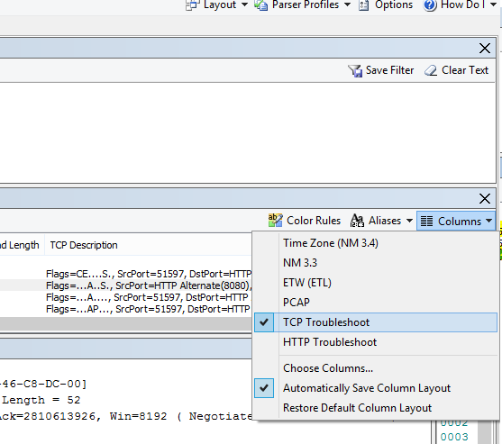

# <a name="performance-troubleshooting-plan-for-office-365"></a>Plano de solução de problemas de desempenho do Office 365

Você precisa conhecer as etapas a serem tomadas para identificar e corrigir atrasos, travas e desempenho lento entre o SharePoint Online, o OneDrive for Business, o Exchange Online ou o Skype for Business Online e seu computador cliente? Antes de chamar o suporte, este artigo pode ajudá-lo a solucionar problemas de desempenho do Office 365 e até mesmo corrigir alguns dos problemas mais comuns.

Este artigo é, na verdade, um plano de ação de exemplo que você pode usar para capturar dados valiosos sobre seu problema de desempenho enquanto isso está acontecendo. Alguns dos principais problemas também estão incluídos neste artigo.

Se você é novo no desempenho de rede e deseja fazer um plano de longo prazo para monitorar o desempenho entre seus máquinas cliente e o Office 365, dê uma olhada no ajuste de desempenho e solução de problemas do [Office 365 -](performance-tuning-using-baselines-and-history.md)Administrador e profissional de TI.

## <a name="sample-performance-troubleshooting-action-plan"></a>Exemplo de plano de ação de solução de problemas de desempenho

Este plano de ação contém duas partes; uma fase de preparação e uma fase de registro em log. Se você tiver um problema de desempenho no momento e precisar fazer a coleta de dados, poderá começar a usar esse plano imediatamente.

### <a name="prepare-the-client-computer"></a>Preparar o computador cliente

- Encontre um computador cliente que possa reproduzir o problema de desempenho. Este computador será usado durante a solução de problemas.
- Anote as etapas que causam o problema de desempenho para que você esteja pronto na hora de testar.
- Instale ferramentas para coletar e registrar informações:
  - Instale [o Netmon 3.4](https://www.microsoft.com/download/details.aspx?id=4865) (ou use uma ferramenta equivalente de rastreamento de rede).
  - Instale a Edição Básica gratuita do [HTTPWatch](https://www.httpwatch.com/download/) (ou use uma ferramenta equivalente de Rastreamento de rede).
  - Use um gravador de tela ou execute o gravador de etapas (PSR.exe) que vem com o Windows Vista e posterior, para manter um registro das etapas que você realizar durante o teste.

### <a name="log-the-performance-issue"></a>Registrar o problema de desempenho

- Feche todos os navegadores da Internet.
- Inicie o Gravador de Etapas ou outro gravador de tela.
- Inicie a captura do Netmon (ou a ferramenta de rastreamento de rede).
- Limpe o cache DNS no computador cliente da linha de comando digitando ipconfig /flushdns.
- Inicie uma nova sessão do navegador e a ligue HTTPWatch.
- Opcional: se você estiver testando o Exchange Online, execute a ferramenta Analisador de Desempenho do Cliente do Exchange no console de administração do Office 365.
- Reproduza as etapas exatas que causam o problema de desempenho.
- Pare o Netmon ou o rastreamento de outra ferramenta.
- Na linha de comando, execute uma rota de rastreamento para sua assinatura do Office 365 digitando o seguinte comando e pressionando ENTER:

  ``` cmd
  tracert <subscriptionname>.onmicrosoft.com
  ```

- Pare o Gravador de Etapas e salve o vídeo. Certifique-se de incluir a data e a hora da captura e se ela demonstra um desempenho bom ou ruim.
- Salve os arquivos de rastreamento. Novamente, certifique-se de incluir a data e a hora da captura e se ela demonstra um desempenho bom ou ruim.

Se você não estiver familiarizado com a execução das ferramentas mencionadas neste artigo, não se preocupe, pois forneceremos estas etapas em seguida. Se você estiver acostumado a fazer esse tipo de captura de rede, poderá pular para Como coletar linhas de [base,](performance-tuning-using-baselines-and-history.md#how-to-collect-baselines)que descreve a filtragem e a leitura dos logs.

### <a name="flush-the-dns-cache-first"></a>Liberar primeiro o Cache DNS

Por quê? Ao liberar o cache DNS, você inicia os testes com uma slate limpa. Ao limpar o cache, você está redefinindo o conteúdo do resolvedor DNS para as entradas mais atualizadas. Lembre-se de que uma liberação não remove entradas de arquivo HOSTs. Se você usa extensivamente entradas de arquivo HOST, deve copiar essas entradas para um arquivo em outro diretório e, em seguida, esvaziar o arquivo HOST.

#### <a name="flush-your-dns-resolver-cache"></a>Liberar o cache do resolvedor DNS

1. Abra o prompt de comando (cmd **Iniciar** \>  \> **Executar ou cmd** da tecla **Windows).** \> 
2. Digite o comando a seguir e pressione ENTER:

    ``` cmd
    ipconfig /flushdns
    ```

## <a name="netmon"></a>Netmon

A ferramenta de Monitoramento de Rede da Microsoft ([Netmon](https://www.microsoft.com/download/details.aspx?id=4865)) analisa pacotes, ou seja, tráfego, que passa entre computadores em redes. Usando o Netmon para rastrear o tráfego com o Office 365, você pode capturar, exibir e ler os headers de pacotes, identificar dispositivos de intervenção, verificar configurações importantes no hardware da rede, procurar pacotes descartados e seguir o fluxo de tráfego entre computadores em sua rede corporativa e o Office 365. Como o corpo real do tráfego é criptografado, ou seja, (na porta 443 via SSL/TLS, você não pode ler os arquivos que estão sendo enviados. Em vez disso, você recebe um rastreamento não filtrado do caminho que o pacote leva, o que pode ajudá-lo a rastrear o comportamento do problema.

Certifique-se de não aplicar um filtro no momento. Em vez disso, execute as etapas e demonstre o problema antes de parar o rastreamento e salvar.

Depois de instalar o Netmon 3.4, abra a ferramenta e tome estas etapas:

### <a name="take-a-netmon-trace-and-reproduce-the-issue"></a>Fazer um rastreamento do Netmon e reproduzir o problema

1. Iniciar o Netmon 3.4.
Há três painéis  na página Inicial: **Capturas** Recentes, Selecionar **Redes** e o **Getting Started with Microsoft Network Monitor 3.4. Aviso.** O painel Selecionar Redes também lhe dará uma lista das redes padrão das quais você pode capturar. Certifique-se de que as placas de rede estão selecionadas aqui.

2. Clique **em Nova** Captura na parte superior da **página** Iniciar. Isso adiciona uma nova guia ao lado da **guia Página** Inicial chamada **Captura 1**.


3. Para fazer uma captura simples, clique **em Iniciar** na barra de ferramentas.

4. Reproduza as etapas que apresentam um problema de desempenho.

5. Clique **em Parar** \> **Arquivo** Salvar \> **como**. Lembre-se de dar a data e hora com o fuso horário e mencionar se ele demonstra um desempenho ruim ou bom.

## <a name="httpwatch"></a>HTTPWatch

[HTTPWatch](https://www.httpwatch.com/download/) é cobrado e uma edição gratuita. A Edição Básica gratuita abrange tudo o que você precisa para esse teste. O HTTPWatch monitora o tráfego de rede e o tempo de carregamento da página desde a janela do navegador. HTTPWatch é um plug-in do Internet Explorer que descreve graficamente o desempenho. A análise pode ser salva e visualizada no HTTPWatch Studio.

> [!NOTE]
> Se você usar outro navegador, como o Firefox, o Google Chrome ou se não conseguir instalar o HTTPWatch no Internet Explorer, abra uma nova janela do navegador e pressione F12 no teclado. Você deverá ver o pop-up da Ferramenta de Desenvolvedor na parte inferior do navegador. Se você usar o Opera, pressione CTRL+SHIFT+I  para Web Inspector e clique na guia Rede e conclua o teste descrito abaixo. As informações serão ligeiramente diferentes, mas os tempos de carregamento ainda serão exibidos em milissegundos. > HTTPWatch também é muito útil para problemas com tempos de carregamento de página do SharePoint Online.

### <a name="run-httpwatch-and-reproduce-the-issue"></a>Executar HTTPWatch e reproduzir o problema

HTTPWatch é um plug-in do navegador, portanto, expor a ferramenta no navegador é um pouco diferente para cada versão do Internet Explorer. Normalmente, você pode encontrar HTTPWatch na barra de Comandos no navegador Internet Explorer. Se você não vir o plug-in HTTPWatch na janela do navegador,  verifique a versão do navegador clicando em Ajuda Sobre ou em versões posteriores do Internet Explorer, clique no símbolo de engrenagem e no \>  **Internet Explorer.** Para iniciar a barra **de Comandos,** clique com o botão direito do mouse na barra de menus no Internet Explorer e clique **na barra de Comandos.**

No passado, HTTPWatch era associado aos comandos e às barras do Explorer, portanto, depois de instalar, se você não vir imediatamente o ícone (mesmo após a reinicialização) verifique Ferramentas e suas barras de ferramentas para o ícone. Lembre-se de que as barras de ferramentas podem ser personalizadas e as opções podem ser adicionadas a elas.


1. Iniciar HTTPWatch em uma janela do navegador Internet Explorer. Ele aparecerá encaixado no navegador na parte inferior dessa janela. Clique **em Registro.**

2. Reproduza as etapas exatas envolvidas no problema de desempenho. Clique no **botão Parar** em HTTPWatch.

3. **Salve** o HTTPWatch ou **Enviar por Email.** Lembre-se de nomear o arquivo para que ele inclua informações de data e hora e uma indicação de se sua relógio contém uma demonstração de bom ou ruim desempenho.


Esta captura de tela é da versão Professional do HTTPWatch. Você pode abrir rastreamentos feitos na Versão Básica em um computador com uma versão Professional e lê-la lá. Informações extras podem estar disponíveis no rastreamento por meio desse método.

## <a name="problem-steps-recorder"></a>Gravador de etapas do problema

O Gravador de Etapas, ou PSR.exe, permite que você grave os problemas à medida que eles estão ocorrendo. É uma ferramenta muito útil e muito simples de executar.

### <a name="run-problem-steps-recorder-psrexe-to-record-your-work"></a>Execute o Gravador de Etapas do Problema (PSR.exe) para gravar seu trabalho

1. Use o **tipo** iniciar executarPSR.exeOK ou clique no tipo de tecla \>  \> do  \>  **Windows** \> **PSR.exe** \> pressione ENTER.

2. Quando a janela PSR.exe pequena for exibida, clique em **Iniciar Registro** e reproduza as etapas que reproduzem o problema de desempenho. Você pode adicionar comentários conforme necessário, clicando em **Adicionar Comentários.**

3. Clique **em Parar Registro** quando concluir as etapas. Se o problema de desempenho for uma renderização de página, aguarde a renderização da página antes de interromper a gravação.

4. Clique em **Salvar**.


A data e a hora são gravadas para você. Isso vincula seu PSR ao rastreamento netmon e HTTPWatch no tempo e ajuda na solução de problemas de precisão. A data e a hora no registro PSR podem mostrar que um minuto se passou entre o logon e a navegação da URL e a renderização parcial do site de administração, por exemplo.

## <a name="read-your-traces"></a>Ler seus rastreamentos

Não é possível ensinar tudo sobre a solução de problemas de rede e desempenho que alguém precisa conhecer por meio de um artigo. Obter bom desempenho requer experiência e conhecimento de como sua rede funciona e normalmente funciona. Mas é possível arredondar uma lista dos principais problemas e mostrar como as ferramentas podem facilitar a eliminação dos problemas mais comuns.

Se você quiser adquirir habilidades de leitura de rastreamentos de rede para seus sites do Office 365, não há melhor professor do que criar rastreamentos de cargas de página regularmente e obter experiência para lê-los. Por exemplo, quando você tiver uma chance, carregue um serviço do Office 365 e rastreie o processo. Filtre o rastreamento do tráfego DNS ou pesquise nos FrameData o nome do serviço que você navegue. Digitalizar o rastreamento para ter uma ideia das etapas que ocorrem quando o serviço é carregado. Isso ajudará você a saber qual deve ser a aparência normal da carga de página e, no caso de solução de problemas, especialmente em relação ao desempenho, comparar rastreamentos bons a rastreamentos ruins pode ensinar muito você.

O Netmon usa o Microsoft Intellisense no campo Filtro de exibição. O Intellisense ou a conclusão inteligente de código é aquele truque em que você digita um ponto e todas as opções disponíveis são exibidas em uma caixa de seleção de lista. Se, por exemplo, você não estiver certo sobre o dimensionamento da janela TCP, poderá encontrar um filtro  `.protocol.tcp.window < 100` (como) por esse meio.


Rastreamentos do Netmon podem ter muito tráfego neles. Se você não tiver experiência com a leitura, provavelmente ficará sobrecarregado ao abrir o rastreamento pela primeira vez. A primeira coisa a fazer é separar o sinal do ruído de fundo no rastreamento. Você testou em relação ao Office 365, e esse é o tráfego que você deseja ver. Se você estiver acostumado a navegar por rastreamentos, talvez não precise dessa lista.

O tráfego entre seu cliente e o Office 365 viaja via TLS, o que significa que o corpo do tráfego será criptografado e não poderá ser lido em um rastreamento netmon genérico. Sua análise de desempenho não precisa saber as especificidades das informações no pacote. No entanto, ele está muito interessado em headers de pacotes e nas informações que eles contêm.

### <a name="tips-to-get-a-good-trace"></a>Dicas para obter um bom rastreamento

- Conheça o valor do endereço IPv4 ou IPv6 do computador cliente. Você pode obter isso no prompt de comando digitando **IPConfig** e pressionando ENTER. Saber esse endereço permitirá que você diga rapidamente se o tráfego no rastreamento envolve diretamente seu computador cliente. Se houver um proxy conhecido, ping-lo e obter seu endereço IP também.

- Flush your DNS resolve cache and, if possible, close all browsers except the one in which you are running your tests. Se você não conseguir fazer isso, por exemplo, se o suporte estiver usando alguma ferramenta baseada em navegador para ver a área de trabalho do computador cliente, esteja preparado para filtrar o rastreamento.

- Em um rastreamento de ocupado, localize o serviço do Office 365 que você está usando. Se você nunca ou raramente viu seu tráfego antes, esta é uma etapa útil na separação do problema de desempenho de outros ruídos de rede. Há algumas maneiras de fazer isso. Diretamente antes do teste, você pode usar _ping_ ou _PsPing_ na URL do serviço específico ( `ping outlook.office365.com` ou , por `psping -4 microsoft-my.sharepoint.com:443` exemplo). Você também pode encontrar facilmente esse ping ou PsPing em um rastreamento do Netmon (pelo nome do processo). Isso lhe dará um lugar para começar a procurar.

Se você estiver usando apenas o rastreamento de Netmon no momento do problema, tudo bem também. Para orientar a si mesmo, use um filtro como `ContainsBin(FrameData, ASCII, "office")` ou `ContainsBin(FrameData, ASCII, "outlook")` . Você pode gravar o número do quadro do arquivo de rastreamento. Você também pode rolar o _painel_ Resumo de Quadros até a direita e procurar a coluna ID da Conversa. Há um número indicado para a ID dessa conversa específica que você também pode registrar e olhar isoladamente mais tarde. Lembre-se de remover esse filtro antes de aplicar qualquer outra filtragem.

> [!TIP]
> O Netmon tem muitos filtros integrados úteis. Experimente o **botão Carregar Filtro** na parte superior do painel Filtro de Exibição. 


Familiarize-se com o tráfego e saiba como localizar as informações necessárias. Por exemplo, saiba como determinar qual pacote no rastreamento tem a primeira referência ao serviço do Office 365 que você está usando (como "Outlook").

Tendo o Office 365 Outlook Online como exemplo, o tráfego começa algo assim:

- Consulta Padrão DNS e resposta DNS para outlook.office365.com com QueryIDs correspondentes. É importante observar o deslocamento de tempo para essa mudança, bem como onde no mundo o DNS global do Office 365 envia a solicitação para resolução de nomes. Idealmente, o mais localmente possível, em vez de no meio do mundo.

- Uma solicitação HTTP GET cujo relatório de status foi movido permanentemente (301)

- Tráfego RWS, incluindo solicitações do RWS Connect e respostas do Connect. (Esse é o Winsock remoto fazendo uma conexão para você.)

- Uma conversa TCP SYN e TCP SYN/ACK. Muitas das configurações dessa conversa têm impacto sobre o desempenho.

- Em seguida, ocorre uma série de tráfego TLS:TLS, que é onde ocorre o handshake TLS e as conversas de certificado TLS. (Lembre-se de que os dados são criptografados via SSL/TLS.)

Todas as partes do tráfego são importantes e conectadas, mas pequenas partes do rastreamento contêm informações particularmente importantes em termos de solução de problemas de desempenho, portanto, vamos nos concentrar nessas áreas. Além disso, como já fizemos soluções suficientes de problemas de desempenho do Office 365 na Microsoft para compilar uma lista dos dez principais problemas comuns, nos concentraremos nesses problemas e em como usar as ferramentas necessárias para raizá-los em seguida.

Se você ainda não tiver instalado todos eles, a matriz a seguir usará várias ferramentas. Sempre que possível. Links são fornecidos para os pontos de instalação. A lista inclui ferramentas comuns de rastreamento de rede, como [Netmon](https://www.microsoft.com/download/details.aspx?id=4865) e [Wireshark,](https://www.wireshark.org/)mas use qualquer ferramenta de rastreamento com a qual você esteja confortável e na qual esteja acostumado a filtrar o tráfego de rede. Ao testar, lembre-se:

- *Feche seus navegadores e teste com apenas um navegador*  em execução. Isso reduzirá o tráfego geral que você capturar. Isso torna um rastreamento menos ocupado.
- *Liberar o cache do resolvedor DNS*  no computador cliente- Isso lhe dará uma limpeza de slate quando você começar a fazer a captura, para um rastreamento mais limpo.

## <a name="common-issues"></a>Problemas comuns

Alguns problemas comuns que você pode enfrentar e como encontrá-los em seu rastreamento de rede.

### <a name="tcp-windows-scaling"></a>Dimensionamento do Windows TCP

Encontrado no SYN - SYN/ACK. O hardware herdado ou de idade pode não tirar proveito do dimensionamento de janelas TCP.  Sem as configurações de dimensionamento adequadas das janelas TCP, o buffer de 16 bits padrão nos headers TCP preenche em milissegundos.  O tráfego não pode continuar a enviar até que o cliente receba uma confirmação de que os dados originais foram recebidos, causando atrasos.

#### <a name="tools"></a>Ferramentas

- Netmon
- Wireshark

#### <a name="what-to-look-for"></a>O que procurar

Procure o tráfego SYN - SYN/ACK no rastreamento de rede.  No Netmon, use um filtro como  `tcp.flags.syn == 1` . Esse filtro é o mesmo no Wireshark.


Observe que, para cada SYN, há um número de porta de origem (SrcPort) que é atendido na porta de destino (DstPort) do Reconhecimento relacionado (SYN/ACK).

Para ver o valor de Dimensionamento do Windows usado pela conexão de rede, expanda primeiro o SYN e, em seguida, o SYN/ACK relacionado.


### <a name="tcp-idle-time-settings"></a>Configurações de Tempo Ocioso do TCP

Historicamente, a maioria das redes de perímetro é configurada para conexões transitórias, o que significa que as conexões ociosas geralmente são encerradas. As sessões TCP ociosas podem ser encerradas por proxies e firewalls em mais de 100 a 300 segundos. Isso é problemático para o Outlook Online porque ele cria e usa conexões de longo prazo, se elas estão ociosas ou não.

Quando as conexões são encerradas por dispositivos proxy ou firewall, o cliente não é informado e uma tentativa de usar o Outlook Online significa que um computador cliente tentará, repetidamente, evitar a conexão antes de fazer uma nova. Você pode ver travas no produto, prompts ou desempenho lento no carregamento da página.

#### <a name="tools"></a>Ferramentas

- Netmon
- Wireshark

#### <a name="what-to-look-for"></a>O que procurar

No Netmon, veja o campo Deslocamento de Tempo para uma viagem de ida e volta. Uma viagem de ida e volta é o tempo entre o cliente enviar uma solicitação para o servidor e receber uma resposta de volta. Verifique entre o Cliente e o ponto de saída (ex. Cliente -- \> Proxy) ou o cliente para o Office 365 (cliente – \> Office 365). Você pode ver isso em vários tipos de pacotes.

Por exemplo, o filtro no Netmon pode parecer  `.Protocol.IPv4.Address == 10.102.14.112 AND .Protocol.IPv4.Address == 10.201.114.12` ou, no Wireshark,  `ip.addr == 10.102.14.112 &amp;&amp; ip.addr == 10.201.114.12` .

> [!TIP]
> Não sabe se o endereço IP no rastreamento pertence ao seu servidor DNS? Tente procurá-lo na linha de comando. Clique **em Iniciar** \> **Executar** e digite \> **cmd** ou pressione **Windows Key** e digite \> **cmd**. No prompt, digite  `nslookup <the IP address from the network trace>` . Para testar, use o nslookup no endereço IP do seu próprio computador. > Para ver uma lista de intervalos de IP da Microsoft, confira URLs e intervalos de [endereços IP do Office 365.](https://technet.microsoft.com/library/hh373144.aspx)

Se houver um problema, espere que apareçam deslocamentos de tempo longos, neste caso (Outlook Online), especialmente em pacotes TLS:TLS que mostram a passagem dos Dados do Aplicativo (por exemplo, no Netmon, você pode encontrar pacotes de dados de aplicativo via  `.Protocol.TLS AND Description == "TLS:TLS Rec Layer-1 SSL Application Data"` ). Você deverá ver uma progressão suave no tempo durante a sessão. Se você vir atrasos longos ao atualizar seu Outlook Online, isso pode ser causado por um alto grau de redefinições sendo enviadas.

### <a name="latencyround-trip-time"></a>Tempo de latência/viagem de ida e volta

A latência é uma medida que pode mudar muito dependendo de muitas variáveis, como a atualização de dispositivos de idade, a adição de um grande número de usuários a uma rede e a porcentagem de largura de banda geral consumida por outras tarefas em uma conexão de rede.

Há calculadoras de largura de banda para o Office 365 disponíveis na página Planejamento de rede e ajuste de desempenho [do Office 365.](network-planning-and-performance.md)

Precisa medir a velocidade da conexão ou a largura de banda da conexão ISP? Experimente este site (ou sites como ele): acelerar o [Site](https://www.speedtest.net/)Oficial ou consultar seu mecanismo de pesquisa favorito para o teste de velocidade **de frase.**

#### <a name="tools"></a>Ferramentas

- Ping
- PsPing
- Netmon
- Wireshark

#### <a name="what-to-look-for"></a>O que procurar

Para rastrear a latência em um rastreamento, você se beneficiará de ter registrado o endereço IP do computador cliente e o endereço IP do servidor DNS no Office 365. Isso é para facilitar a filtragem de rastreamento. Se você se conectar por meio de um proxy, precisará do endereço IP do computador cliente, do endereço IP de proxy/saída e do endereço IP DNS do Office 365 para facilitar o trabalho.

Uma solicitação de ping enviada ao outlook.office365.com dirá o nome do datacenter que recebe a solicitação, mesmo que o  *ping*  possa não ser capaz de se conectar para enviar os pacotes ICMP consecutivos da marca. Se você usar psPing (uma ferramenta gratuita para download) e a porta específica (443) e talvez usar IPv4 (-4), você obterá um tempo médio de viagem de ida e volta para pacotes enviados. Isso funcionará para outras URLs nos serviços do Office 365, como `psping -4 yourSite.sharepoint.com:443` . Na verdade, você pode especificar um número de pings para obter uma amostra maior para sua média, tente algo como `psping -4 -n 20 yourSite-my.sharepoint.com:443` .

> [!NOTE]
> O PsPing não envia pacotes ICMP. Ele é ping com pacotes TCP por uma porta específica, para que você possa usar qualquer um que saiba que está aberto. No Office 365, que usa SSL/TLS, tente anexar a porta :443 ao PsPing.


Se você carregou a página de desempenho lento do Office 365 durante um rastreamento de rede, você deve filtrar um rastreamento de Netmon ou Wireshark para `DNS` . Este é um dos IPs que estamos procurando.

Aqui estão as etapas a serem tomadas para filtrar o Netmon para obter o endereço IP (e dar uma olhada na Latência dns). Este exemplo usa outlook.office365.com, mas também pode usar a URL de um locatário do SharePoint Online (hithere.sharepoint.com por exemplo).

1. Ping a URL e, nos resultados, grave o nome e o endereço IP do servidor DNS para `ping outlook.office365.com` o que a solicitação de ping foi enviada.
2. Rastreamento de rede abrindo a página ou fazendo a ação que oferece o problema de desempenho, ou, se você vir uma alta latência no ping em si, rastreá-lo na rede.
3. Abra o rastreamento no Netmon e filtre o DNS (esse filtro também funciona no Wireshark, mas é sensível ao `-- dns` caso). Como você sabe o nome do servidor DNS do seu ping, você também pode filtrar mais rapidamente no Netmon assim: , que fica assim no dns do Wireshark e o quadro contém `DNS AND ContainsBin(FrameData, ASCII, "namnorthwest")` "namnorthwest".<br/>Abra o pacote de resposta e, na janela Detalhes **do** Quadro do Netmon, clique em **DNS** para expandir para obter mais informações. Nas informações de DNS, você encontrará o endereço IP do servidor DNS para o que a solicitação foi no Office 365. Você precisará desse endereço IP para a próxima etapa (a ferramenta PsPing). Remova o filtro, clique com o botão direito do mouse na Resposta DNS no Netmon (DNS de Busca de Resumo de Quadros de Conversas) para ver a Consulta DNS e a Resposta \>  \> lado a lado.
4. No Netmon, observe também a coluna Deslocamento de Tempo entre a Solicitação de DNS e a Resposta. Na próxima etapa, a ferramenta [PsPing](https://technet.microsoft.com/sysinternals/jj729731.aspx) fácil de instalar e usar é muito útil, pois o ICMP geralmente é bloqueado em Firewalls e o PsPing rastreia a latência com elegância em milissegundos. O PsPing conclui uma conexão TCP com um endereço e uma porta (no nosso caso, porta aberta 443).
5. Instale o PsPing.
6. Abra um prompt de comando (cmd do tipo Iniciar Executar ou tipo de chave do Windows) e altere o diretório para o diretório onde você instalou o PsPing para executar o comando \> \> \> PsPing. Nos meus exemplos, você pode ver que eu fizemos uma pasta 'Perf' na raiz de C. Você pode fazer o mesmo para acesso rápido.
7. Digite o comando para que você esteja fazendo seu PsPing no endereço IP do servidor DNS do Office 365 a partir do rastreamento netmon anterior, incluindo o número da porta, como `psping -n 20 132.245.24.82:445` . Isso lhe dará uma amostragem de 20 pings e a latência média quando o PsPing parar.

Se você for para o Office 365 por meio de um servidor proxy, as etapas são um pouco diferentes. Primeiro, você deve fazer o PsPing no seu servidor proxy para obter um valor médio de latência em milissegundos para proxy/saída e depois executar psPing no proxy ou em um computador com uma conexão direta à Internet para obter o valor ausente (o do Office 365 e de volta).

Se você optar por executar o PsPing a partir do proxy, terá dois valores de milissegundos: computador cliente para servidor proxy ou ponto de saída e servidor proxy para o Office 365. E pronto! Bem, gravando valores, mesmo assim.

Se você executar o PsPing em outro computador cliente que tenha uma conexão direta com a Internet, ou seja, sem um proxy, você terá dois valores de milissegundos: computador cliente para servidor proxy ou ponto de saída e computador cliente com o Office 365. Nesse caso, subtraia o valor do computador cliente para o servidor proxy ou ponto de saída do valor do computador cliente para o Office 365, e você terá os números RTT do computador cliente para o servidor proxy ou ponto de saída e do servidor proxy ou ponto de saída para o Office 365.

No entanto, se você encontrar um computador cliente no local afetado que está diretamente conectado ou ignorar o proxy, você pode optar por ver se o problema se reproduz lá para começar e testar usá-lo depois disso.

A latência, como visto em um rastreamento do Netmon, esses milissegundos extras podem ser somados, se houver suficiente deles em uma determinada sessão.


> [!NOTE]
> Seu endereço IP pode ser diferente dos IPs mostrados aqui, por exemplo, seu ping pode retornar algo mais como 157.56.0.0/16 ou um intervalo semelhante. Para uma lista de intervalos usados pelo Office 365, confira URLs e intervalos de [endereços IP do Office 365.](https://technet.microsoft.com/library/hh373144.aspx)

Lembre-se de expandir todos os nós (há um botão na parte superior para isso) se você quiser pesquisar, por exemplo, 132.245.

### <a name="proxy-authentication"></a>Autenticação de Proxy

Isso só se aplica a você se você estiver passando por um servidor proxy. Caso não seja, ignore estas etapas. Quando estiver funcionando corretamente, a autenticação de proxy deve ocorrer em milissegundos, de forma consistente. Você não deverá ver um desempenho intermitente ruim durante períodos de pico de uso (por exemplo).

Se a autenticação de proxy estiver conexões, sempre que você fizer uma nova conexão TCP com o Office 365 para obter informações, precisará passar por um processo de autenticação nos bastidores. Portanto, por exemplo, ao alternar de Calendário para Email no Outlook Online, você fará a autenticação. E no SharePoint Online, se uma página exibir mídia ou dados de vários sites ou locais, você fará a autenticação para cada conexão TCP diferente necessária para renderizar os dados.

No Outlook Online, você pode experimentar tempos de carregamento lentos sempre que alterna entre o Calendário e sua caixa de correio, ou páginas lentas são carregadas no SharePoint Online. No entanto, há outros sintomas não listados aqui.

A autenticação de proxy é uma configuração em seu servidor proxy de saída. Se isso estiver causando um problema de desempenho com o Office 365, você deve consultar sua equipe de rede.

#### <a name="tools"></a>Ferramentas

- Netmon
- Wireshark

#### <a name="what-to-look-for"></a>O que procurar

A autenticação de proxy ocorre sempre que uma nova sessão TCP deve ser realizada, normalmente para solicitar arquivos ou informações do servidor ou para fornecer informações. Por exemplo, você pode ver a autenticação de proxy em torno de solicitações HTTP GET ou HTTP POST. Se você quiser ver os quadros em que está autenticando solicitações em seu rastreamento, adicione a coluna 'Resumo NTLMSSP' ao Netmon e filtre  `.property.NTLMSSPSummary` . Para ver quanto tempo a autenticação está demorando, adicione a coluna Delta de Tempo.

Para adicionar uma coluna ao Netmon:

1. Clique com o botão direito do mouse em uma coluna, como **Descrição.**
2. Clique **em Escolher Colunas.**
3. Localize _o Resumo NTLMSSP_ e o _Delta de_ Tempo na lista e clique em **Adicionar**.
4. Mova as novas colunas para o lugar antes ou para trás da coluna _Descrição_ para que você possa lê-las lado a lado.
5. Clique em **OK**.

Mesmo que você não adicione a coluna, o filtro Netmon funcionará. Mas a solução de problemas será muito mais fácil se você puder ver em qual estágio de autenticação você está.

Ao procurar instâncias de Autenticação de Proxy, certifique-se de estudo de todos os quadros em que há um desafio NTLM ou uma mensagem de autenticação está presente. Se necessário, clique com o botão direito do mouse na parte específica do tráfego e encontre \> conversas TCP. Esteja ciente dos valores de Delta de Tempo nestas Conversas.


Um atraso de quatro segundos na autenticação de proxy, como visto no Wireshark. O **delta de tempo da coluna** de quadros exibida anteriormente foi feita clicando com o botão direito do mouse no campo do mesmo nome nos detalhes do quadro e selecionando Adicionar como Coluna.  <br/> 

### <a name="dns-performance"></a>Desempenho de DNS

A resolução de nomes funciona melhor e mais rapidamente quando ocorre o mais próximo possível do país do cliente.

Se a resolução de nomes DNS estiver ocorrendo em lugares diferentes, ela poderá adicionar segundos aos carregamentos de página. Idealmente, a resolução de nomes ocorre em menos de 100 ms. Caso não seja, você deve fazer uma investigação mais.

> [!TIP]
> Não sabe ao certo como a Conectividade de Cliente funciona no Office 365? Dê uma olhada no documento de Referência de Conectividade do [Cliente aqui.](https://technet.microsoft.com/library/dn741250.aspx)

#### <a name="tools"></a>Ferramentas

- Netmon
- Wireshark
- PsPing

#### <a name="what-to-look-for"></a>O que procurar

Analisar o desempenho de DNS normalmente é outro trabalho para um rastreamento de rede. No entanto, o PsPing também é útil para causar, ou não, uma possível causa.

O tráfego DNS é baseado em solicitações e respostas TCP e UDP são claramente marcadas com uma ID que ajudará a corresponder a uma solicitação específica com sua resposta específica. Você verá o tráfego DNS quando, por exemplo, o SharePoint Online usar um nome de rede ou URL em uma página da Web. Como regra geral, a maior parte desse tráfego, exceto ao transferir zonas, é sobre UDP.

No Netmon e no Wireshark, o filtro mais básico que permitirá que você veja o tráfego DNS é simplesmente `dns` . Certifique-se de usar uma caixa inferior ao especificar o filtro. Lembre-se de liberar o cache do resolvedor DNS antes de começar a reproduzir o problema no computador cliente. Por exemplo, se você tiver uma carga lenta de página do SharePoint Online para a home page, deverá fechar todos os navegadores, abrir um novo navegador, iniciar o rastreamento, liberar o cache do resolvedor dns e navegar até o site do SharePoint Online. Depois que a página inteira é resolvida, você deve parar e salvar o rastreamento.


Você deseja ver o deslocamento de tempo aqui. E pode ser útil adicionar a coluna **Delta** de Tempo ao Netmon, o que você pode fazer ao concluir estas etapas:

1. Clique com o botão direito do mouse em uma coluna, como **Descrição.**
2. Clique **em Escolher Colunas.**
3. Localize _o Delta_ de Tempo na lista e clique em **Adicionar.**
4. Mova a nova coluna para o lugar antes ou para trás _da_ coluna Descrição para que você possa lê-la lado a lado.
5. Clique em **OK**.

Se você encontrar uma consulta de interesse, considere isola-la clicando com o  botão direito do mouse nessa consulta no painel de detalhes do quadro, escolhendo Encontrar \> **conversas DNS**. Observe que o painel De conversas na rede vai direto para a conversa específica em seu log de tráfego UDP.


No Wireshark, você pode fazer uma coluna para o horário DNS. Fazer o rastreamento (ou abrir um rastreamento) no Wireshark e filtrar `dns` por, ou, mais útilmente,  `dns.time` . Clique em qualquer consulta DNS e, no painel mostrando detalhes, expanda os  `Domain Name System (response)` detalhes. Você verá um campo por tempo (por exemplo, `[Time: 0.001111100 seconds]` . Clique com o botão direito do mouse desta vez e selecione **Aplicar como Coluna.** Isso lhe dará uma **coluna Hora** para a classificação mais rápida do rastreamento. Clique na nova coluna para classificar por valores em ordem decrescente para ver qual chamada de DNS levou mais tempo para ser resolvida.

[Uma procura do SharePoint Online filtrada no Wireshark por dns.time (minúsculas), com o tempo dos detalhes transformado em uma coluna e classificado em ordem crescente.](../media/1439dcc2-12ff-4ee2-9ef3-1484cf79c384.PNG)

Se você quiser fazer mais investigação do tempo de resolução dns, tente um PsPing em relação à porta DNS usada por TCP (por exemplo,  `psping <IP address of DNS server>:53` ) . Você ainda vê um problema de desempenho? Se você fizer isso, é mais provável que o problema seja um problema de rede mais amplo do que um problema específico do aplicativo DNS que você está atingindo para resolver. Também vale a pena mencionar, novamente, que um ping no outlook.office365.com dirá onde está ocorrendo a resolução de nome DNS para o Outlook Online (por exemplo, outlook-namnorthwest.office365.com).

Se o problema parecer específico do DNS, talvez seja necessário entrar em contato com seu departamento de IT para analisar as configurações de DNS e os Encaminhadores de DNS para investigar esse problema ainda mais.

### <a name="proxy-scalability"></a>Escalabilidade de proxy

Serviços como o Outlook Online no Office 365 concedem aos clientes várias conexões de longo prazo. Portanto, cada usuário pode usar mais conexões que exigem uma vida mais longa.

#### <a name="tools"></a>Ferramentas

Matemática

#### <a name="what-to-look-for"></a>O que procurar

Não há nenhuma ferramenta de rastreamento de rede ou solução de problemas específica para isso. Em vez disso, ele se baseia em cálculos de largura de banda, considerando limitações e outras variáveis.

### <a name="tcp-max-segment-size"></a>Tamanho máximo do segmento TCP

Encontrado no SYN - SYN/ACK.  Faça essa verificação em qualquer rastreamento de rede de desempenho que você tenha feito para garantir que os pacotes TCP sejam configurados para transportar a quantidade máxima de dados possível.

O objetivo é ver um MSS de 1460 bytes para transmissão de dados. Se você estiver por trás de um proxy ou estiver usando um NAT, lembre-se de executar esse teste de cliente para proxy/saída/NAT e de proxy/egress/NAT para o Office 365 para melhores resultados! São sessões TCP diferentes.

#### <a name="tools"></a>Ferramentas

Netmon

#### <a name="what-to-look-for"></a>O que procurar

TCP Max Segment Size (MSS) é outro parâmetro do handshake de três vias em seu rastreamento de rede, isso significa que você encontrará os dados necessários no pacote SYN - SYN/ACK. MSS é bastante simples de ver.

Abra qualquer rastreamento de rede de desempenho que você tenha e encontre a conexão que você está curioso ou que demonstre o problema de desempenho.

> [!NOTE]
> Se você estiver analisando um rastreamento e precisar localizar o tráfego relevante para sua conversa, filtre pelo IP do Cliente ou pelo IP do servidor proxy ou ponto de saída, ou ambos. Diretamente, você precisará fazer ping na URL que está testando para o endereço IP do Office 365 no rastreamento e filtre por ela.

Olhando para o rastreamento de segunda mão? Tente usar filtros para orientar a si mesmo. No Netmon, execute uma pesquisa com base na URL, `Containsbin(framedata, ascii, "sphybridExample")` como, anote o número do quadro.

No Wireshark, use algo  `frame contains "sphybridExample"` como. Se você perceber que encontrou o tráfego RWS (Remote Winsock) (ele pode aparecer como um [PSH, ACK] no Wireshark), lembre-se de que as versões RWS podem ser vistas pouco antes de SYN - SYN/ACKs relevantes, conforme discutido anteriormente.

Neste ponto, você pode gravar o número do  quadro, soltar o filtro, clicar em Todo o Tráfego na janela conversas de rede no Netmon para olhar para o SYN mais próximo.

Importante, se você não recebeu nenhuma informação de endereço IP no momento do rastreamento, localizar sua URL no rastreamento (parte de , por exemplo), lhe dará endereços IP para `sphybridExample-my.sharepoint.com` filtrar.

Localize a conexão no rastreamento que você está interessado em ver. Você pode fazer isso digitalizando o rastreamento, filtrando por endereços IP ou selecionando IDs de Conversa específicas usando a janela Conversas na Rede no Netmon. Depois de encontrar o pacote SYN, expanda TCP (no Netmon) ou Transmission Control Protocol (no Wireshark) no painel Detalhes do Quadro. Expanda opções de TCP e MaxSegmentSize. Localize o quadro SYN-ACK relacionado e expanda opções TCP e MaxSegmentSize. O menor dos dois valores será seu Tamanho Máximo de Segmento. Nesta imagem, eu uso a Coluna interna no Netmon chamada Solução de Problemas TCP.


A coluna de dentro fica na parte superior do painel **Detalhes do** Quadro. (Para voltar ao seu modo de exibição normal, clique em **Colunas** novamente e escolha **Fuso Horário.)**



Aqui está um rastreamento filtrado no Wireshark. Há um filtro específico para o valor MSS ( `tcp.options.mss` ). Os quadros de um SYN, SYN/ACK, handshake do ACK são vinculados na parte inferior do Wireshark equivalente aos Detalhes do Quadro (portanto, o quadro 47 ACK, links para 46 SYN/ACK, links para 43 SYN) para facilitar esse tipo de trabalho.


Se você precisar verificar a **Confirmação Seletiva** (próximo tópico nesta matriz), não feche o rastreamento!

### <a name="selective-acknowledgment"></a>Confirmação Seletiva

Encontrado no SYN - SYN/ACK. Deve ser relatado como Permitido em SYN e SYN/ACK. A Confirmação Seletiva (CASO) permite uma retransmissão mais suave de dados quando um pacote ou pacotes estão ausentes. Os dispositivos podem desabilitar esse recurso, o que pode levar a problemas de desempenho.

Se você estiver por trás de um proxy ou estiver usando um NAT, lembre-se de executar esse teste de cliente para proxy/saída/NAT e de proxy/egress/NAT para o Office 365 para melhores resultados! São sessões TCP diferentes.

#### <a name="tools"></a>Ferramentas

Netmon

#### <a name="what-to-look-for"></a>O que procurar

Selective Acknowledgment (SYN) is another parameter in the SYN-SYN/ACK handshake. Você pode filtrar o rastreamento de SYN - SYN/ACK de várias maneiras.

Localize a conexão no rastreamento que você está interessado em ver, digitalizando o rastreamento, filtrando por endereços IP ou clicando em uma ID de Conversa usando a janela Conversas de Rede no Netmon. Depois de encontrar o pacote SYN, expanda O TCP no Netmon ou o Protocolo de Controle de Transmissão no Wireshark na seção Detalhes do Quadro. Expanda as Opções de TCP e, em seguida, oPP. Localize o quadro SYN-ACK relacionado e expanda opções TCP e seu campo TAMBÉM. Certifique-se de que o SYN seja permitido em SYN e SYN/ACK. Aqui estão os valores DE VALOR, conforme visto no Netmon e no Wireshark.


### <a name="dns-geolocation"></a>Geolocalização DNS

Onde no mundo o Office 365 tenta resolver seus efeitos de chamada DNS afeta sua velocidade de conexão.

No Outlook Online, após a conclusão da primeira pesquisa de DNS, o local desse DNS será usado para se conectar ao datacenter mais próximo. Você será conectado a um servidor CAS do Outlook Online, que usará a rede backbone para se conectar ao datacenter (dC) onde os dados estão armazenados. Isso é mais rápido.

Ao acessar o SharePoint Online, um usuário que está viajando será direcionado para seu datacenter ativo , que é o dC cuja localização é baseada na base base do locatário do SPO (portanto, um dC nos EUA se o usuário se basear nos EUA).

O Lync online tem nós ativos em mais de um dC por vez. Quando as solicitações são enviadas para instâncias do Lync online, o DNS da Microsoft determinará de onde a solicitação veio e retornará endereços IP do dC regional mais próximo em que o Lync online está ativo.

> [!TIP]
> Precisa saber mais sobre como os clientes se conectam ao Office 365? Dê uma olhada no artigo [de referência de Conectividade](https://technet.microsoft.com/library/dn741250.aspx) do Cliente (e seus gráficos úteis).

#### <a name="tools"></a>Ferramentas

- Ping
- PsPing

#### <a name="what-to-look-for"></a>O que procurar

As solicitações de resolução de nomes dos servidores DNS do cliente para os servidores DNS da Microsoft devem, na maioria dos casos, resultar no DNS da Microsoft retornando o endereço IP de um datacenter regional (dC). O que isso significa para você? Se sua sede estiver em Bangalore, na Índia, mas você estiver viajando nos Estados Unidos, quando seu navegador fizer uma solicitação para o Outlook Online, os servidores DNS da Microsoft deverão entregar endereços IP a datacenters nos Estados Unidos, um datacenter regional. Se o email for necessário do Outlook, esses dados passarão pela rede de backbone rápido da Microsoft entre os datacenters.

O DNS funciona mais rápido quando a resolução de nomes é feita o mais próximo possível do local do usuário. Se você estiver na Europa, você deseja ir para um DNS da Microsoft na Europa e (idealmente) lidar com um datacenter na Europa. O desempenho de um cliente na Europa indo para o DNS e um datacenter na América será mais lento.

Execute a ferramenta Ping em outlook.office365.com para determinar para onde no mundo sua solicitação DNS está sendo roteada. Se você estiver na Europa, deverá ver uma resposta de algo como outlook-emeawest.office365.com. Nas Américas, espere algo como outlook-namnorthwest.office365.com.

Abra o prompt de comando no computador cliente (por meio do cmd Start \> Run ou do tipo de tecla \> \> windows). Digite ping outlook.office365.com e pressione ENTER. Lembre-se de especificar -4 se quiser especificar o ping via IPv4. Você pode não conseguir obter uma resposta dos pacotes do ICMP, mas deverá ver o nome do DNS para o qual a solicitação foi encaminhada. Se você quiser ver os números de latência para esta conexão, tente PsPing para o endereço IP do servidor que é retornado por ping.


### <a name="office-365-application-troubleshooting"></a>Solução de problemas de aplicativos do Office 365

#### <a name="tools"></a>Ferramentas

- Netmon
- HTTPWatch
- Console F12 no navegador

Não abrangemos as ferramentas usadas na solução de problemas específica do aplicativo neste artigo específico da rede. Mas você encontrará recursos que *pode usar* [nesta página.](https://support.office.com/article/Network-planning-and-performance-tuning-for-Office-365-e5f1228c-da3c-4654-bf16-d163daee8848)

## <a name="related-topics"></a>Tópicos Relacionados

[Gerenciar pontos de extremidade do Office 365](https://support.office.com/article/99cab9d4-ef59-4207-9f2b-3728eb46bf9a)

[Perguntas frequentes sobre pontos de extremidade do Office 365](https://support.office.com/article/d4088321-1c89-4b96-9c99-54c75cae2e6d)
