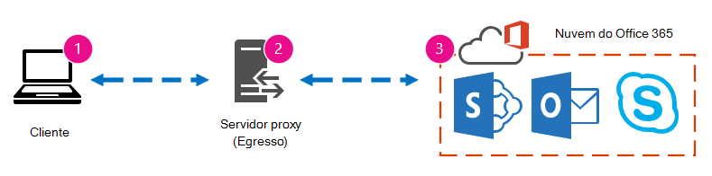
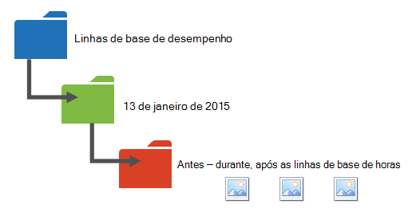

# Ajuste de desempenho do Office 365 usando linhas de base e histórico de desempenhoOffice 365 performance tuning using baselines and performance history

Existem algumas maneiras simples de verificar o desempenho da conexão entre Office 365 e sua empresa que permitirão que você estabeleça uma linha de base aproximada de sua conectividade.There are some simple ways to check the connection performance between Office 365 and your business that will let you establish a rough baseline of your connectivity. Conhecer o histórico de desempenho de suas conexões de computador cliente pode ajudá-lo a detectar problemas emergentes no início, identificar e prever problemas.Knowing the performance history of your client computer connections can help you detect emerging issues early, identify, and predict problems.
  
Se você não estiver acostumado a trabalhar em problemas de desempenho, este artigo foi projetado para ajudá-lo a considerar algumas perguntas comuns.If you're not used to working on performance issues, this article is designed to help you consider some common questions. Como você sabe que o problema que você está vendo é um problema de desempenho e não um Office 365 de serviço?How do you know the problem you're seeing is a performance issue and not an Office 365 service incident? Como planejar um bom desempenho, a longo prazo?How can you plan for good performance, long term? Como você pode manter um olho no desempenho?How can you keep an eye on performance? Se sua equipe ou clientes estão vendo um desempenho lento durante o uso Office 365 e você se pergunta sobre qualquer uma dessas perguntas, continue a leitura.If your team or clients are seeing slow performance while using Office 365, and you wonder about any of these questions, read on.
  
> [!IMPORTANT]
> **Tem um problema de desempenho entre seu cliente e Office 365 agora?****Have a performance issue between your client and Office 365 right now?** Siga as etapas descritas no [plano de solução](performance-troubleshooting-plan.md)de problemas de desempenho para Office 365 .Follow the steps outlined in the [Performance troubleshooting plan for Office 365](performance-troubleshooting-plan.md). 
    
## Algo que você deve saber sobre Office 365 desempenhoSomething you should know about Office 365 performance

Office 365 vive dentro de uma rede da Microsoft dedicada de alta capacidade que é monitorada pela automação e por pessoas reais.Office 365 lives inside a high-capacity, dedicated Microsoft network that is monitored by automation and real people. Parte da manutenção da nuvem Office 365 de desempenho é ajustar e ajustar o desempenho sempre que possível.Part of maintaining the Office 365 cloud is performance tuning and streamlining where possible. Como os clientes da Office 365 de nuvem têm que se conectar pela Internet, há um esforço contínuo para ajustar o desempenho em todos os serviços Office 365 também.Since clients of the Office 365 cloud have to connect across the Internet, there's ongoing effort to fine-tune the performance across Office 365 services too.

As melhorias de desempenho nunca param na nuvem, portanto, nem a experiência em manter a nuvem saudável e rápida.Performance improvements never really stop in the cloud, so neither does experience with keeping the cloud healthy and quick. Se você tiver um problema de desempenho ao se conectar do seu local ao Office 365, é melhor não começar ou aguardar um caso de Suporte.Should you have a performance issue connecting from your location to Office 365, it's best not to start with or wait on a Support case. Em vez disso, você deve começar a investigar o problema de "de dentro para fora".Instead, you should begin investigating the problem from 'the inside out'. Ou seja, comece dentro de sua rede e trabalhe até Office 365.That is, start inside of your network, and work your way out to Office 365. Antes de abrir um caso com o Suporte, você pode coletar dados e tomar ações que explorarão e poderão resolver o problema.Before you open a case with Support, you can gather data and take actions that will explore, and may resolve, the problem.
  
> [!IMPORTANT]
> Esteja ciente do planejamento de capacidade e dos limites Office 365.Be aware of capacity planning and limits in Office 365. Essas informações o colocarão à frente da curva ao tentar resolver um problema de desempenho.That information will put you ahead of the curve when trying to resolve a performance issue. Aqui está um link para as descrições Microsoft 365 [e Office 365 serviço.](/office365/servicedescriptions/office-365-service-descriptions-technet-library)Here's a link to the [Microsoft 365 and Office 365 service descriptions](/office365/servicedescriptions/office-365-service-descriptions-technet-library). Este é um hub central e todos os serviços oferecidos pela Office 365 têm um link que vai para suas próprias Descrições de Serviço a partir daqui.This is a central hub, and all the services offered by Office 365 have a link that goes to their own Service Descriptions from here. Isso significa que, se você precisar ver os limites padrão para o SharePoint Online, por exemplo, você clicaria em [SharePoint Descrição](/office365/servicedescriptions/sharepoint-online-service-description/sharepoint-online-service-description) do Serviço Online e [localizaria sua seção](/office365/servicedescriptions/sharepoint-online-service-description/sharepoint-online-limits)Limites do SharePoint Online.That means, should you need to see the standard limits for SharePoint Online, for example, you would click [SharePoint Online Service Description](/office365/servicedescriptions/sharepoint-online-service-description/sharepoint-online-service-description) and locate its [SharePoint Online Limits section](/office365/servicedescriptions/sharepoint-online-service-description/sharepoint-online-limits).
  
Certifique-se de entrar em sua solução de problemas com a compreensão de que o desempenho é uma escala de deslizamento.Make sure you go into your troubleshooting with the understanding that performance is a sliding scale. Não se trata de alcançar um valor idealizado e mantê-lo permanentemente.It's not about achieving an idealized value and maintaining it permanently. Tarefas ocasionais de alta largura de banda, como o internamento de um grande número de usuários, ou a realização de grandes migrações de dados serão estressantes, portanto, *planeje* os impactos no desempenho.Occasional high-bandwidth tasks like on-boarding a large number of users, or doing large data migrations will be stressful, so *plan* for performance impacts then. Você deve ter uma ideia aproximada de suas metas de desempenho, mas muitas variáveis têm desempenho, portanto, o desempenho varia.You should have a rough idea of your performance targets, but many variables play into performance, so performance varies.
  
A solução de problemas de desempenho não se trata de cumprir metas específicas e manter esses números indefinidamente, trata-se de melhorar as atividades existentes, considerando todas as variáveis.Performance troubleshooting isn't about meeting specific goals and maintaining those numbers indefinitely, it's about improving existing activities, given all the variables. 
  
## Ok, qual é a aparência de um problema de desempenho?Okay, what does a performance problem look like?

Primeiro, você precisa certificar-se de que o que você está enfrentando é realmente um problema de desempenho e não um incidente de serviço.First, you need to make sure that what you are experiencing is indeed a performance issue and not a service incident. Um problema de desempenho é diferente de um incidente de serviço Office 365.A performance problem is different from a service incident in Office 365. Veja como diferencia-los.Here's how to tell them apart.
  
Incidentes de serviço ocorrem quando o Office 365 em si está com problemas.Service Incidents happen when the Office 365 service itself is having issues. Você pode ver ícones vermelhos ou amarelos em **Saúde** atual no Centro de administração do Microsoft 365.You may see red or yellow icons under **Current health** in the Microsoft 365 admin center. Você pode observar que o desempenho em computadores cliente que se conectam Office 365 é lento.You may notice performance on client computers connecting to Office 365 is slow. Por exemplo, se a saúde atual  relata um ícone vermelho e você vê Investigando ao lado Exchange, você também pode receber chamadas de pessoas em sua organização que reclamam que as caixas de correio do cliente usando Exchange Online são lentas.For example, if Current health reports a red icon and you see **Investigating** beside Exchange, you might then also get calls from people in your organization who complain that client mailboxes using Exchange Online are slow. Nesse caso, é razoável supor que seu desempenho Exchange Online foi uma vítima de problemas de Serviço.In that case, it's reasonable to assume that your Exchange Online performance was a victim of Service issues.
  

  
Neste ponto, você, o administrador Office 365,  deve verificar a saúde atual e, em seguida, Exibir detalhes e histórico **,** com frequência, para manter-se atualizado sobre a manutenção no sistema.At this point, you, the Office 365 admin, should check **Current health** and then **View details and history**, often, to keep up to date on maintenance on the system. O **painel de saúde** atual foi feito para atualizá-lo sobre alterações e problemas no serviço.The **Current health** dashboard was made to update you about changes to, and problems in, the service. As anotações e explicações escritas no histórico de saúde, administrador para administrador, estão lá para ajudá-lo a avaliar e para mantê-lo postado sobre o trabalho contínuo.The notes and explanations written to health history, admin to admin, are there to help you gauge, and to keep you posted about ongoing work.
  

  
Um problema de desempenho não é um incidente de serviço, mesmo que os incidentes possam causar um desempenho lento.A performance issue isn't a service incident, even though incidents can cause slow performance. Um problema de desempenho tem esta aparência:A performance issue looks like this:
  
- Ocorre um problema de desempenho, independentemente do que o centro de administração **Atual está** relatando para o serviço.A performance issue occurs no matter what the admin center **Current health** is reporting for the service.
    
-  Um comportamento usado para fluir leva muito tempo para ser concluído ou nunca concluído.A behavior that used to flow takes a long time to complete or never completes.
    
- Você também pode replicar o problema ou saber se isso acontecerá se você fizer a série correta de etapas.You can replicate the problem too, or know it will happen if you do the right series of steps.
    
-  Se o problema for intermitente, ainda pode haver um padrão.If the problem is intermittent, there can still be a pattern. Por exemplo, você sabe que às 10:00 você terá chamadas de usuários que nem sempre podem acessar Office 365.For example, you know that by 10:00 AM you'll have calls from users who can't always access Office 365. As chamadas terminarão por volta do meio-dia.The calls will end around noon.
    
Essa lista provavelmente parece familiar; talvez muito familiar.This list probably sounds familiar; maybe too familiar. Quando você está ciente de que é um problema de desempenho, a pergunta se torna: "O que você fará em seguida?"Once you're aware it's a performance problem, the question becomes, "What do you do next?" O restante deste artigo ajuda você a determinar exatamente isso.The rest of this article helps you determine exactly that.
  
## Como definir e testar o problema de desempenhoHow to define and test the performance problem

Problemas de desempenho geralmente surgem ao longo do tempo, portanto, pode ser um desafio definir o problema real.Performance issues often emerge over time, so it can be challenging to define the actual problem. Crie uma boa instrução problem com uma boa ideia de contexto de problema e, em seguida, você precisa repetir as etapas de teste.Create a good problem statement with a good idea of issue context, and then you need to repeatable testing steps. Aqui estão alguns exemplos de instruções de problemas que não fornecem informações suficientes:Here are some examples of problems statements that don't provide enough information:
  
- Mudar da minha Caixa de Entrada para o meu Calendário era algo que eu não tinha notado e agora é uma pausa para café.Switching from my Inbox to my Calendar used to be something I didn't notice, and now it's a coffee-break. Você pode fazer com que ele aja como antes?Can you make it act like it used to?
    
- Carregar meus arquivos para SharePoint Online está demorando muito.Uploading my files to SharePoint Online is taking forever. Por que é lento à tarde, mas a qualquer outro momento, é rápido?Why is it slow in the afternoon, but any other time, it's fast? Não pode ser rápido?Can't it just be fast?
    
Há vários grandes desafios colocados pelas instruções de problema acima.There are several large challenges posed by the problem statements above. Especificamente, há muitas ambiguidades para lidar.Specifically, too many ambiguities to deal with. por exemplo:for example:
  
- Não está claro como a alternação entre Caixa de Entrada e Calendário era usada para agir no laptop.It's unclear how switching between Inbox and Calendar used to act on the laptop.
    
- Quando o usuário diz, "Não pode ser rápido", o que é "rápido"?When the user says, "Can't it just be fast", what's "fast"?
    
- Quanto tempo é "para sempre"?How long is "forever"? São vários segundos?Is that several seconds? Ou muitos minutos?Or many minutes? Ou o usuário poderia fazer o almoço e a ação terminaria 10 minutos depois de voltar?Or could the user take lunch and the action would finish up 10 minutes after they got back?
    
O administrador e o solucionador de  problemas não podem estar cientes dos detalhes do problema de instruções gerais como estas.The admin and troubleshooter can't be aware of the *details* of the problem from general statements like these. Por exemplo, eles não sabem quando o problema começou a acontecer.For example, they don't know when the problem started happening. O solucionador de problemas pode não saber que o usuário trabalha em casa e só vê a alternação lenta enquanto estiver em sua rede local.The troubleshooter might not know the user works from home and only ever sees slow switching while on their home network. Ou que o usuário executa outros aplicativos intensivos de RAM no cliente local.Or that the user runs other RAM intensive applications on the local client. Os administradores podem não saber que o usuário está executando um sistema operacional mais antigo ou que não executaram atualizações recentes.Admins may not know the user is running an older operating system or hasn't run recent updates.
  
Quando os usuários relatam um problema de desempenho, há muitas informações a coletar.When users report a performance problem, there's a lot of information to collect. Obter e gravar informações é chamado de escolhamento do problema.Getting and recording information is called scoping the issue. Aqui está uma lista básica de scoping que você pode usar para coletar informações sobre problemas de desempenho.Here is a basic scoping list you can use to collect information about performance issues. Esta lista não é exaustiva, mas é um local para começar:This list is not exhaustive, but it's a place to start:
  
- Em que data o problema aconteceu e em que hora do dia ou da noite?On what date did the issue happen, and around what time of day or night?
    
- Que tipo de computador cliente você estava usando e como ele se conecta à rede de negócios (VPN, Com fio, Sem fio)?What kind of client computer were you using, and how does it connect to the business network (VPN, Wired, Wireless)?
    
- Estava trabalhando remotamente ou estava no escritório?Were you working remotely or were you in the office?
    
- Você tentou as mesmas ações em outro computador e viu o mesmo comportamento?Did you try the same actions on another computer and see the same behavior?
    
- Ande pelas etapas que estão lhe dando problemas para que você possa escrever as ações que você faz.Walk through the steps that are giving you the trouble so that you can write the actions you take down.
    
- Quão lento em segundos ou minutos é o desempenho?How slow in seconds or minutes is the performance?
    
- Onde no mundo você está localizado?Where in the world are you located?
    
Algumas dessas perguntas são mais óbvias do que outras.Some of these questions are more obvious than others. A maioria das pessoas compreenderá que um solucionador de problemas precisa das etapas exatas para reproduzir o problema.Most everyone will understand a troubleshooter needs the exact steps to reproduce the issue. Afinal, de que outra forma você pode registrar o que há de errado e como testar se o problema foi corrigido?After all, how else can you record what's wrong, and how else can you test if the issue is fixed? Menos óbvias são as coisas como "Qual data e hora você viu o problema?", e "Onde no mundo você está localizado?", informações que podem ser usadas em tandem.Less obvious are things like "What date and time did you see the issue?", and "Where in the world are you located?", information that can be used in tandem. Dependendo de quando o usuário estava trabalhando, algumas horas de diferença de tempo podem significar que a manutenção já está em andamento em partes da rede da sua empresa.Depending on when the user was working, a few hours of time difference may mean maintenance is already underway on parts of your company's network. Se, por exemplo, sua empresa tiver uma implementação híbrida, como uma Pesquisa de SharePoint híbrida, que pode consultar índices de pesquisa no SharePoint Online e em uma instância local do SharePoint Server 2013, as atualizações podem estar em andamento no farm local.If, for example, your company has a hybrid implementation, like a hybrid SharePoint Search, which can query search indexes in both SharePoint Online and an On-premises SharePoint Server 2013 instance, updates may be underway in the on-premises farm. Se a sua empresa estiver toda na nuvem, a manutenção do sistema pode incluir a adição ou remoção de hardware de rede, a implantação de atualizações em toda a empresa ou a fazer alterações no DNS ou em outra infraestrutura principal.If your company is all in the cloud, system maintenance may include adding or removing network hardware, rolling out updates that are company-wide, or making changes to DNS, or other core infrastructure.
  
Quando você está solucionando um problema de desempenho, é um pouco como uma cena de crime, você precisa ser preciso e observador para tirar conclusões das evidências.When you're troubleshooting a performance problem, it's a bit like a crime scene, you need to be precise and observant to draw any conclusions from the evidence. Para fazer isso, você deve obter uma boa declaração de problema coletando evidências.In order to do this, you must get a good problem statement by gathering evidence. Ele deve incluir o contexto do computador, o contexto do usuário, quando o problema começou e as etapas exatas que expusem o problema de desempenho.It should include the computer's context, the user's context, when the problem began, and the exact steps that exposed the performance issue. Esta instrução de problema deve ser, e permanecer, a página mais alta em suas anotações.This problem statement should be, and stay, the topmost page in your notes. Ao passar pela instrução problem novamente depois de trabalhar na resolução, você está tomando as etapas para testar e provar se as ações realizadas resolveram o problema.By walking through the problem statement again after you work on the resolution, you are taking the steps to test and prove whether the actions you take have resolved the issue. Isso é fundamental para saber quando seu trabalho, lá, é feito.This is critical to knowing when your work, there, is done.
  
## Você sabe como o desempenho era quando era bom?Do you know how performance used to look when it was good?

Se você não tiver sorte, ninguém saberá.If you're unlucky, nobody knows. Ninguém tinha números.Nobody had numbers. Isso significa que ninguém pode responder à pergunta simples "Sobre quantos segundos foi usado para trazer uma Caixa de Entrada no Office 365?", ou "Quanto tempo demorava quando os Executivos tinham uma reunião do Lync Online?", que é um cenário comum para muitas empresas.That means nobody can answer the simple question "About how many seconds did it used to take to bring up an Inbox in Office 365?", or "How long did it used to take when the Executives had a Lync Online meeting?", which is a common scenario for many companies.
  
O que está faltando aqui é uma linha de base de desempenho.What's missing here is a performance baseline.
  
As linhas de base dão a você um contexto para seu desempenho.Baselines give you a context for your performance. Você deve fazer uma linha de base ocasionalmente com frequência, dependendo das necessidades da sua empresa.You should take a baseline occasionally to frequently, depending on the needs of your company. Se você for uma empresa maior, sua equipe de Operações poderá ter linhas de base para seu ambiente local.If you are a larger company, your Operations team may take baselines for your on-premises environment already. Por exemplo, se você corrigir todos os servidores Exchange na primeira segunda-feira do mês e todos os servidores SharePoint na terceira segunda-feira, sua equipe de Operações provavelmente terá uma lista de tarefas e cenários que executa após o patch, para provar que as funções críticas estão operacionais.For example, if you patch all the Exchange servers on the first Monday of the month, and all your SharePoint servers on the third Monday, your Operations team probably has a list of tasks and scenarios it runs post-patching, to prove that critical functions are operational. Por exemplo, abrindo a Caixa de Entrada, clicando em Enviar/Receber e fazendo com que as pastas atualizem ou, em SharePoint, navegando pela página principal do site, entrando na página de Pesquisa corporativa e fazendo uma pesquisa que retorna resultados.For example, opening the Inbox, clicking Send/Receive, and making sure the folders update, or, in SharePoint, browsing the main page of the site, going into the enterprise Search page, and doing a search that returns results.
  
Se seus aplicativos estão em Office 365, algumas das linhas de base mais fundamentais que você pode medir o tempo (em milissegundos) de um computador cliente dentro de sua rede, até um ponto de saída, ou o ponto em que você sai da rede e sai para Office 365.If your applications are in Office 365, some of the most fundamental baselines you can take measure the time (in milliseconds) from a client computer inside your network, to an egress point, or the point where you leave your network and go out to Office 365. Aqui estão algumas linhas de base úteis que você pode investigar e registrar:Here are some helpful baselines that you can investigate and record:
  
- Identifique os dispositivos entre seu computador cliente e seu ponto de saída, por exemplo, seu servidor proxy.Identify the devices between your client computer and your egress point, for example, your proxy server.
    
  - Você precisa conhecer seus dispositivos para que você tenha contexto (endereços IP, tipo de dispositivo, etc.) para problemas de desempenho que surgem.You need to know your devices so that you have context (IP addresses, type of device, et cetera) for performance problems that arise.
    
  - Os servidores proxy são pontos de saída comuns, portanto, você pode verificar o navegador da Web para ver qual servidor proxy ele está definido para usar, se for o caso.Proxy servers are common egress points, so you can check your web browser to see what proxy server it is set to use, if any.
    
  - Há ferramentas de terceiros que podem descobrir e mapear sua rede, mas a maneira mais segura de saber seus dispositivos é perguntar a um membro da sua equipe de rede.There are third party tools that can discover and map your network, but the safest way to know your devices is to ask a member of your network team.
    
- Identifique seu provedor de serviços de Internet (ISP), anote suas informações de contato e pergunte quantos circuitos você tem.Identify your Internet service provider (ISP), write down their contact information, and ask how many circuits how much bandwidth you have.
    
- Dentro da sua empresa, identifique recursos para os dispositivos entre seu cliente e o ponto de saída ou identifique um contato de emergência com o qual falar sobre problemas de rede.Inside your company, identify resources for the devices between your client and the egress point, or identify an emergency contact to talk to about networking issues.
    
Aqui estão algumas linhas de base que testes simples com ferramentas podem calcular para você:Here are some baselines that simple testing with tools can calculate for you:
  
- Tempo do computador cliente para o ponto de saída em milissegundosTime from your client computer to your egress point in milliseconds
    
- O tempo de saída aponta para Office 365 milissegundosTime from your egress point to Office 365 in milliseconds
    
- Local no mundo do servidor que resolve as URLS para Office 365 quando você navegaLocation in the world of the server that resolves the URLS for Office 365 when you browse
    
- A velocidade da resolução DNS do SEU ISP em milissegundos, inconsistências na chegada de pacotes (tremida de rede), tempos de carregamento e download em milissegundosThe speed of your ISP's DNS resolution in milliseconds, inconsistencies in packet arrival (network jitter), upload and download times in milliseconds
    
Se você não estiver familiarizado com como executar essas etapas, entraremos em mais detalhes neste artigo.If you're unfamiliar with how to carry out these steps, we'll go into more detail in this article. 
  
## O que é uma linha de base?What is a baseline?

Você conhecerá o impacto quando ele ficar ruim, mas se você não conhecer seus dados de desempenho histórico, não será possível ter um contexto de quão ruim ele pode ter se tornado e quando.You'll know the impact when it goes bad, but if you don't know your historical performance data, it's not possible to have a context for how bad it may have become, and when. Portanto, sem uma linha de base, você está perdendo a dica-chave para resolver o quebra-cabeça: a imagem na caixa do quebra-cabeça.So without a baseline, you're missing the key clue to solve the puzzle: the picture on the puzzle box. Na solução de problemas de desempenho, você precisa de um ponto de  *comparação*  .In performance troubleshooting, you need a point of  *comparison*  . Linhas de base de desempenho simples não são difíceis de aceitar.Simple performance baselines aren't difficult to take. Sua equipe de Operações pode ter a tarefa de realizar isso em um cronograma.Your Operations team can be tasked with carrying these out on a schedule. Por exemplo, digamos que sua conexão seja assim:For example, let's say your connection looks like this: 
  

  
Isso significa que você verificou com sua equipe de rede e descobriu que você deixou sua empresa para a Internet por meio de um servidor proxy e que o proxy lida com todas as solicitações que seu computador cliente envia para a nuvem.That means you've checked with your network team and found out that you leave your company for the Internet through a proxy server, and that proxy handles all the requests your client computer sends to the cloud. Nesse caso, você deve desenhar uma versão simplificada da sua conexão que lista todos os dispositivos interveniáveis.In this case, you should draw a simplified version of your connection that lists all the intervening devices. Agora, insira ferramentas que você pode usar para testar o desempenho entre o cliente, o ponto de saída (onde você deixa sua rede para a Internet) e a Office 365 nuvem.Now, insert tools that you can use to test the performance between the client, the egress point (where you leave your network for the Internet), and the Office 365 cloud.
  

  
As opções são listadas como **Simples** e **Avançada** devido à quantidade de experiência necessária para encontrar os dados de desempenho.The options are listed as **Simple** and **Advanced** because of the amount of expertise you need in order to find the performance data. Um rastreamento de rede levará muito tempo, em comparação com a execução de ferramentas de linha de comando, como PsPing e TraceTCP.A network trace will take a lot of time, compared to running command-line tools like PsPing and TraceTCP. Essas duas ferramentas de linha de comando foram escolhidas porque não usam pacotes ICMP, que serão bloqueados pelo Office 365 e porque eles dão o tempo em milissegundos necessários para sair do computador cliente ou do servidor proxy (se você tiver acesso) e chegar ao Office 365.These two command-line tools were chosen because they don't use ICMP packets, which will be blocked by Office 365, and because they give the time in milliseconds that it takes to leave the client computer, or proxy server (if you have access) and arrive at Office 365. Cada salto individual de um computador para outro terminará com um valor de tempo, e isso é ótimo para linhas de base!Each individual hop from one computer to another will end up with a time value, and that's great for baselines! Assim como o mais importante, essas ferramentas de linha de comando permitem adicionar um número de porta ao comando, isso é útil porque o Office 365 se comunica pela porta 443, que é a porta usada pelo Secure Sockets Layer and Transport Layer Security (SSL e TLS).Just as importantly, these command-line tools allow you to add a port number onto the command, this is useful because Office 365 communicates over port 443, which is the port used by Secure Sockets Layer and Transport Layer Security (SSL and TLS). No entanto, outras ferramentas de terceiros podem ser melhores soluções para sua situação.However, other third-party tools may be better solutions for your situation. A Microsoft não dá suporte a todas essas ferramentas, portanto, se, por algum motivo, você não conseguir fazer o PsPing e TraceTCP funcionarem, vá para um rastreamento de rede com uma ferramenta como Netmon.Microsoft doesn't support all of these tools, so if, for some reason, you can't get PsPing and TraceTCP working, move on to a network trace with a tool like Netmon. 
  
Você pode fazer uma linha de base antes do horário comercial, novamente durante o uso intenso e, em seguida, novamente após o horário.You can take a baseline before business hours, again during heavy use, and then again after hours. Isso significa que você pode ter uma estrutura de pasta que se parece um pouco com esta no final:This means you may have a folder structure that looks a bit like this in the end:
  

  
Você também deve escolher uma convenção de nomenissar seus arquivos.You should also pick a naming convention your files. Aqui estão alguns exemplos:Here are some examples:
  
- Feb_09_2015_9amPST_PerfBaseline_Netmon_ClientToEgress_NormalFeb_09_2015_9amPST_PerfBaseline_Netmon_ClientToEgress_Normal
    
- Jan_10_2015_3pmCST_PerfBaseline_PsPing_ClientToO365_bypassProxy_SLOWJan_10_2015_3pmCST_PerfBaseline_PsPing_ClientToO365_bypassProxy_SLOW
    
- Feb_08_2015_2pmEST_PerfBaseline_BADPerfFeb_08_2015_2pmEST_PerfBaseline_BADPerf
    
- Feb_08_2015_8-30amEST_PerfBaseline_GoodPerfFeb_08_2015_8-30amEST_PerfBaseline_GoodPerf
    
Há muitas maneiras diferentes de fazer isso, mas usar o formato **\<dateTime\>\<what's happening in the test\>** é um bom lugar para começar.There are lots of different ways to do this, but using the format **\<dateTime\>\<what's happening in the test\>** is a good place to start. Ser diligente sobre isso ajudará muito quando você estiver tentando solucionar problemas mais tarde.Being diligent about this will help a lot when you are trying to troubleshoot issues later. Mais tarde, você poderá dizer "Eu fiz dois rastreamentos em 8 de fevereiro, um mostrou bom desempenho e outro mostrou mau desempenho, para que possamos compará-los".Later, you'll be able to say "I took two traces on February 8th, one showed good performance and one showed bad, so we can compare them". Isso é extremamente útil para solucionar problemas.This is extremely helpful for troubleshooting. 
  
Você precisa ter uma maneira organizada de manter suas linhas de base históricas.You need to have an organized way to keep your historical baselines. Neste exemplo, os métodos simples produziram três saídas de linha de comando e os resultados foram coletados como capturas de tela, mas você pode ter arquivos de captura de rede.In this example, the simple methods produced three command line outputs and the results were collected as screen shots, but you may have network capture files instead. Use o método que funciona melhor para você.Use the method that works best for you. Armazene suas linhas de base históricas e consulte-as em pontos em que você nota alterações no comportamento dos serviços online.Store your historical baselines and refer to them at points where you notice changes in the behavior of online services. 
  
## Por que coletar dados de desempenho durante um piloto?Why collect performance data during a pilot?

Não há tempo melhor para começar a fazer linhas de base do que durante um piloto do Office 365 serviço.There is no better time to start making baselines than during a pilot of the Office 365 service. Seu escritório pode ter milhares de usuários, centenas de milhares ou pode ter cinco, mas mesmo com um pequeno número de usuários, você pode realizar testes para medir flutuações no desempenho.Your office may have thousands of users, hundreds of thousands, or it may have five, but even with a small number of users, you can perform tests to measure fluctuations in performance. No caso de uma grande empresa, um exemplo representativo de várias centenas de usuários pilotando Office 365 pode ser projetado para fora para vários milhares para que você saiba onde podem surgir problemas antes que eles aconteçam.In the case of a large company, a representative sample of several hundred users piloting Office 365 can be projected outward to several thousands so you know where issues might arise before they happen.
  
No caso de uma pequena empresa, em que a abordagem significa que todos os usuários vão para o serviço ao mesmo tempo e não há piloto, mantenha medidas de desempenho para que você tenha dados para mostrar a qualquer pessoa que possa ter que solucionar problemas de uma operação com mau desempenho.In the case of a small company, where on-boarding means that all users go to the service at the same time and there is no pilot, keep performance measures so that you have data to show to anyone who may have to troubleshoot a badly performing operation. Por exemplo, se você observar que, de repente, você pode dar a volta ao seu edifício no tempo necessário para carregar um gráfico de tamanho médio onde ele costumava acontecer muito rapidamente.For example, if you notice that all of a sudden you can walk around your building in the time it takes to upload a medium-sized graphic where it used to happen very quickly.
  
## Como coletar linhas de baseHow to collect baselines

Para todos os planos de solução de problemas, você precisa identificar essas coisas no mínimo:For all troubleshooting plans you need to identify these things at a minimum:
  
- O computador cliente que você está usando (o tipo de computador ou dispositivo, um endereço IP e as ações que causaram o problema)The client computer you're using (the type of computer or device, an IP address, and the actions that caused the issue)
    
- Onde o computador cliente está localizado no mundo (por exemplo, se esse usuário em uma VPN para a rede, trabalhando remotamente ou na intranet da empresa)Where the client computer is located in the world (for example, whether this user on a VPN to the network, working remotely, or on the company intranet)
    
- O ponto de saída que o computador cliente usa da sua rede (o ponto no qual o tráfego deixa sua empresa para um ISP ou a Internet)The egress point the client computer uses from your network (the point at which traffic leaves your business for an ISP or the Internet)
    
 Você pode descobrir o layout da rede do administrador de rede.You can find out the layout of your network from the network administrator. Se você estiver em uma rede pequena, dê uma olhada nos dispositivos que o conectam à Internet e chame seu ISP se tiver dúvidas sobre o layout.If you're on a small network, take a look at the devices connecting you to the Internet, and call your ISP if you have questions about the layout. Crie um gráfico do layout final para sua referência.Create a graphic of the final layout for your reference. 
  
Esta seção é dividida em ferramentas e métodos simples de linha de comando e opções de ferramentas mais avançadas.This section is broken into simple command-line tools and methods, and more advanced tools options. Primeiro, vamos abranger métodos simples.We'll cover simple methods first. Mas, se você tiver um problema de desempenho agora, você deve ir para métodos avançados e experimentar o plano de ação de solução de problemas de desempenho de exemplo.But if you've got a performance problem right now, you should jump to advanced methods and try out the sample performance-troubleshooting action plan.
  
### Métodos simplesSimple methods

O objetivo desses métodos simples é aprender a tomar, entender e armazenar adequadamente linhas de base de desempenho simples ao longo do tempo para que você seja informado sobre Office 365 desempenho.The objective of these simple methods is to learn to take, understand, and properly store simple performance baselines over time so that you are informed about Office 365 performance. Aqui está o diagrama muito simples para simples, como você já viu antes:Here's the very simple diagram for simple, as you've seen before:
  

  
> [!NOTE]
> TraceTCP está incluído nesta captura de tela porque é uma ferramenta útil para mostrar, em milissegundos, quanto tempo uma solicitação leva para processar e quantos saltos de rede ou conexões de um computador para o próximo, que a solicitação leva para chegar a um destino.TraceTCP is included in this screen shot because it's a useful tool for showing, in milliseconds, how long a request takes to process, and how many network hops, or connections from one computer to the next, that the request takes to reach a destination. TraceTCP também pode dar os nomes dos servidores usados durante saltos, o que pode ser útil para um Microsoft Office 365 solução de problemas em Support.TraceTCP can also give the names of servers used during hops, which can be useful to a Microsoft Office 365 troubleshooter in Support. > comandos TraceTCP podem ser muito simples, como: >> Lembre-se de incluir  `tracetcp.exe outlook.office365.com:443` o número da porta no comando!> TraceTCP commands can be very simple, such as: >  `tracetcp.exe outlook.office365.com:443`> Remember to include the port number in the command! > [TraceTCP](https://simulatedsimian.github.io/tracetcp_download.html) é um download gratuito, mas depende do Wincap. > [TraceTCP](https://simulatedsimian.github.io/tracetcp_download.html) is a free download, but relies on Wincap. O Wincap é uma ferramenta que também é usada e instalada pelo Netmon.Wincap is a tool that is also used and installed by Netmon. Também usamos Netmon na seção métodos avançados.We also use Netmon in the advanced methods section. 
  
 Se você tiver vários escritórios, também precisará manter um conjunto de dados de um cliente em cada um desses locais.If you have multiple offices, you'll need to keep a set of data from a client in each of those locations as well. Este teste mede a latência, que, nesse caso, é um valor de número que descreve a quantidade de tempo entre um cliente que envia uma solicitação para Office 365 e Office 365 respondendo à solicitação.This test measures latency, which, in this case, is a number value that describes the amount of time between a client sending a request to Office 365, and Office 365 responding to the request. O teste se origina dentro do seu domínio em um computador cliente e procura medir uma viagem de ida e volta de dentro de sua rede, através de um ponto de saída, através da Internet para Office 365 e voltar.The testing originates inside your domain on a client computer, and looks to measure a round trip from inside your network, out through an egress point, across the Internet to Office 365, and back. 
  
Há algumas maneiras de lidar com o ponto de saída, nesse caso, o servidor proxy.There are a few ways to deal with the egress point, in this case, the proxy server. Você pode rastrear de 1 a 2 e, em seguida, de 2 a 3 e, em seguida, adicionar os números em milissegundos para obter um total final à borda da rede.You can either trace from 1 to 2 and then 2 to 3, and then add the numbers in milliseconds to get a final total to the edge of your network. Ou, você pode configurar a conexão para ignorar o proxy para Office 365 endereços.Or, you can configure the connection to bypass the proxy for Office 365 addresses. Em uma rede maior com um firewall, proxy reverso ou alguma combinação dos dois, talvez seja necessário fazer exceções no servidor proxy que permitirão que o tráfego passe por muitas URLs.In a larger network with a firewall, reverse proxy, or some combination of the two, you may need to make exceptions on the proxy server that will allow traffic to pass for a lot of URLs. Para ver a lista de pontos de extremidade usados pelo Office 365, [consulte Office 365 URLs e intervalos de endereços IP.](https://support.office.com/article/8548a211-3fe7-47cb-abb1-355ea5aa88a2)For the list of endpoints used by Office 365, see [Office 365 URLs and IP address ranges](https://support.office.com/article/8548a211-3fe7-47cb-abb1-355ea5aa88a2). Se você tiver um proxy de autenticação, comece testando exceções para o seguinte:If you have an authenticating proxy, begin by testing exceptions for the following:
  
- Portas 80 e 443Ports 80 and 443
    
- TCP e HTTPsTCP and HTTPs
    
- Conexões que são de saída para qualquer uma dessas URLs:Connections that are outbound to any of these URLs:
    
- \*.microsoftonline.com\*.microsoftonline.com
    
- \*.microsoftonline-p.com\*.microsoftonline-p.com
    
- \*.sharepoint.com\*.sharepoint.com
    
- \*.outlook.com\*.outlook.com
    
- \*.lync.com\*.lync.com
    
- osub.microsoft.comosub.microsoft.com
    
Todos os usuários precisam ter permissão para chegar a esses endereços sem qualquer interferência de proxy ou autenticação.All users need to be allowed to get to these addresses without any proxy interference or authentication. Em uma rede menor, você deve adicioná-los à sua lista de bypass de proxy no navegador da Web.On a smaller network, you should add these to your proxy bypass list in your web browser. 
  
Para adicioná-los à sua lista de desvios de proxy no Internet Explorer, acesse **Ferramentas** \> **Opções da Internet** \> **Configurações** de LAN \> **avançadas** \> .To add these to your proxy bypass list in Internet Explorer, go to **Tools** \> **Internet Options** \> **Connections** \> **LAN settings** \> **Advanced**. A guia avançada também é onde você encontrará o servidor proxy e a porta do servidor proxy.The advanced tab is also where you will find your proxy server and proxy server port. Talvez seja necessário clicar na caixa de seleção **Use um servidor proxy para sua LAN**, para acessar o **botão** Avançado.You may need to click the checkbox **Use a proxy server for your LAN**, to access the **Advanced** button. Você deve verificar se o servidor **proxy bypass para endereços locais** está verificado.You'll want to make sure that **Bypass proxy server for local addresses** is checked. Depois de clicar **em Avançado,** você verá uma caixa de texto onde poderá inserir exceções.Once you click **Advanced**, you'll see a text box where you can enter exceptions. Separe as URLs curinga listadas acima com ponto-e-vírgula, por exemplo:Separate the wildcard URLs listed above with semi-colons, for example:
  
\*.microsoftonline.com; \*.sharepoint.com\*.microsoftonline.com; \*.sharepoint.com
  
Depois de ignorar seu proxy, você poderá usar ping ou PsPing diretamente em uma URL Office 365.Once you bypass your proxy, you should be able to use ping or PsPing directly on an Office 365 URL. A próxima etapa será testar o ping **outlook.office365.com**.The next step will be to test ping **outlook.office365.com**. Ou, se você estiver usando PsPing ou outra ferramenta que permitirá fornecer um número de porta para o comando, psPing contra **portal.microsoftonline.com:443** para ver o tempo médio de viagem de ida e volta em milissegundos.Or, if you're using PsPing or another tool that will let you supply a port number to the command, PsPing against **portal.microsoftonline.com:443** to see the average round trip time in milliseconds. 
  
O tempo de ida e volta, ou RTT, é um valor de número que mede quanto tempo leva para enviar uma solicitação HTTP para um servidor como outlook.office365.com e obter uma resposta de volta que confirme que o servidor sabe que você fez isso.The round trip time, or RTT, is a number value that measures how long it takes to send a HTTP request to a server like outlook.office365.com and get a response back that acknowledges the server knows that you did it. Às vezes, você verá isso abreviado como RTT.You'll sometimes see this abbreviated as RTT. Esse deve ser um período de tempo relativamente curto.This should be a relatively short amount of time.
  
Você precisa usar [PSPing](/sysinternals/downloads/psping) ou outra ferramenta que não use pacotes ICMP bloqueados por Office 365 para fazer esse teste.You have to use [PSPing](/sysinternals/downloads/psping) or another tool that does not use ICMP packets which are blocked by Office 365 in order to do this test. 
  
 **Como usar o PsPing para obter um tempo geral de viagem de ida e volta em milissegundos diretamente de uma URL Office 365 url****How to use PsPing to get an overall round trip time in milliseconds directly from an Office 365 URL**
  
1. Execute um prompt de comando com elevação concluindo estas etapas:Run an elevated command prompt by completing these steps:
    
1. Clique em **Iniciar**.Click **Start**.
    
2. Na caixa **Iniciar Pesquisa,** digite cmd e pressione CTRL+SHIFT+ENTER.In the **Start Search** box, type cmd, and then press CTRL+SHIFT+ENTER.
    
3. Se a **caixa de diálogo** Controle de Conta de Usuário for exibida, confirme se a ação exibida é o que você deseja e clique em **Continuar**.If the **User Account Control** dialog box appears, confirm that the action it displays is what you want, and then click **Continue**.
    
2. Navegue até a pasta onde a ferramenta (neste caso, PsPing) está instalada e teste essas URLs Office 365:Navigate to the folder where the tool (in this case PsPing) is installed and test these Office 365 URLs:
    
  - psping admin.microsoft.com:443psping admin.microsoft.com:443
    
  - psping microsoft-my.sharepoint.com:443psping microsoft-my.sharepoint.com:443
    
  - psping outlook.office365.com:443psping outlook.office365.com:443
    
  - psping www.yammer.com:443psping www.yammer.com:443
    
    
  
Certifique-se de incluir o número de porta 443.Be sure to include the port number of 443. Lembre-se Office 365 funciona em um canal criptografado.Remember that Office 365 works on an encrypted channel. Se você PsPing sem o número da porta, sua solicitação falhará.If you PsPing without the port number, your request will fail. Depois de fazer o ping da sua lista curta, procure o tempo médio em milissegundos (ms).Once you've pinged your short list, look for the Average time in milliseconds (ms). Isso é o que você deseja gravar!That is what you want to record!
  

  
Se você não estiver familiarizado com o bypass de proxy e preferir fazer as coisas passo a passo, primeiro você precisará descobrir o nome do seu servidor proxy.If you're not familiar with proxy bypass, and prefer to take things step-by-step, you need to first find out the name of your proxy server. No Internet Explorer, acesse **Ferramentas** \> **Opções da Internet Configurações** de LAN \>  \> **avançadas** \> .In Internet Explorer go to **Tools** \> **Internet Options** \> **Connections** \> **LAN settings** \> **Advanced**. A **guia Avançado** é onde você verá seu servidor proxy listado.The **Advanced** tab is where you will see your proxy server listed. Ping that proxy server at a command prompt by completing this task:Ping that proxy server at a command prompt by completing this task: 
  
 **Para pingar o servidor proxy e obter um valor de ida e volta em milissegundos para o estágio 1 a 2****To ping the proxy server and get a round trip value in milliseconds for stage 1 to 2**
  
1. Execute um prompt de comando com elevação concluindo estas etapas:Run an elevated command prompt by completing these steps:
    
1. Clique em **Iniciar**.Click **Start**.
    
2. Na caixa **Iniciar Pesquisa,** digite cmd e pressione CTRL+SHIFT+ENTER.In the **Start Search** box, type cmd, and then press CTRL+SHIFT+ENTER.
    
3. Se a **caixa de diálogo** Controle de Conta de Usuário for exibida, confirme se a ação exibida é o que você deseja e clique em **Continuar**.If the **User Account Control** dialog box appears, confirm that the action it displays is what you want, and then click **Continue**.
    
2. Digite ping \<the name of the proxy server your browser uses, or the IP address of the proxy server\> e pressione ENTER.Type ping \<the name of the proxy server your browser uses, or the IP address of the proxy server\> and then press ENTER. Se você tiver o PsPing ou outra ferramenta instalada, poderá optar por usar essa ferramenta.If you have PsPing, or some other tool, installed, you can choose to use that tool instead. 
    
    Seu comando pode ter a aparência de qualquer um desses exemplos:Your command may look like any of these examples: 
    
  - ping ourproxy.ourdomain.industry.business.comping ourproxy.ourdomain.industry.business.com
    
  - ping 155.55.121.55ping 155.55.121.55
    
  - ping ourproxyping ourproxy
    
  - psping ourproxy.ourdomain.industry.business.com:80psping ourproxy.ourdomain.industry.business.com:80
    
  - psping 155.55.121.55:80psping 155.55.121.55:80
    
  - psping ourproxy:80psping ourproxy:80
    
3. Quando o rastreamento parar de enviar pacotes de teste, você obterá um pequeno resumo que lista uma média, em milissegundos, e esse é o valor que você está procurando.When the trace stops sending test packets, you'll get a small summary that lists an average, in milliseconds, and that's the value you're after. Tire uma captura de tela do prompt e salve-o usando sua convenção de nomenis.Take a screen shot of the prompt and save it using your naming convention. Neste ponto, ele também pode ajudar a preencher o diagrama com o valor.At this point it may also help to fill in the diagram with the value.
    
Talvez você tenha feito um rastreamento no início da manhã e seu cliente possa chegar ao proxy (ou qualquer servidor de saída para a Internet) rapidamente.Maybe you've taken a trace in the early morning, and your client can get to the proxy (or whatever egress server exits to the Internet) quickly. Nesse caso, seus números podem ter esta aparência:In this case, your numbers may look like this:
  

  
Se o computador cliente for um dos poucos selecionados com acesso ao servidor proxy (ou saída), você poderá executar a próxima etapa do teste conectando-se remotamente a esse computador, executando o prompt de comando para PsPing para uma URL de Office 365 a partir daí.If your client computer is one of the select few with access to the proxy (or egress) server, you can run the next leg of the test by remotely connecting to that computer, running the command prompt to PsPing to an Office 365 URL from there. Se você não tiver acesso a esse computador, entre em contato com seus recursos de rede para obter ajuda com a próxima etapa e obter números exatos dessa forma.If you don't have access to that computer, you can contact your network resources for help with the next leg and get exact numbers that way. Se isso não for possível, leve um PsPing contra a URL Office 365 em questão e compare-a com o tempo de PsPing ou Ping em relação ao seu servidor proxy.If that's not possible, take a PsPing against the Office 365 URL in question and compare it to the PsPing or Ping time against your proxy server. 
  
Por exemplo, se você tiver 51,84 milissegundos do cliente para a URL do Office 365 e tiver 2,8 milissegundos do cliente para o proxy (ou ponto de saída), você terá 49,04 milissegundos da saída para Office 365.For example, if you have 51.84 milliseconds from the client to the Office 365 URL, and you have 2.8 milliseconds from the client to the proxy (or egress point), then you have 49.04 milliseconds from the egress to Office 365. Da mesma forma, se você tiver um PsPing de 12,25 milissegundos do cliente para o proxy durante a altura do dia e 62,01 milissegundos do cliente para a URL do Office 365, seu valor médio para o proxy egressar para a URL do Office 365 é 49,76 milissegundos.Likewise, if you have a PsPing of 12.25 milliseconds from the client to the proxy during the height of the day, and 62.01 milliseconds from the client to the Office 365 URL, then your average value for the proxy egress to the Office 365 URL is 49.76 milliseconds.
  

  
Em termos de solução de problemas, você pode encontrar algo interessante apenas por manter essas linhas de base.In terms of troubleshooting, you may find something interesting just from keeping these baselines. Por exemplo, se você descobrir que geralmente tem cerca de 40 a 59 milissegundos de latência do proxy ou ponto de saída para a URL Office 365, e ter um cliente para proxy ou latência de ponto de saída de cerca de 3 a 7 milissegundos (dependendo da quantidade de tráfego de rede que você está vendo durante essa hora do dia), então você certamente saberá que algo é problemático se seus últimos três clientes para proxy ou linhas de base de saída mostrarem uma latência de 45 milissegundos.For example, if you find that you generally have about 40 to 59 milliseconds of latency from the proxy or egress point to the Office 365 URL, and have a client to proxy or egress point latency of about 3 to 7 milliseconds (depending on the amount network traffic you're seeing during that time of day) then you will surely know something is problematic if your last three client to proxy or egress baselines show a latency of 45 milliseconds.
  
### Métodos avançadosAdvanced methods

Se você realmente quiser saber o que está acontecendo com suas solicitações de Internet para Office 365, você precisa se familiarizar com rastreamentos de rede.If you really want to know what is happening with your Internet requests to Office 365, you need to become familiar with network traces. Não importa quais ferramentas você prefere para esses rastreamentos, HTTPWatch, Netmon, Analisador de Mensagens, Wireshark, Fiddler, Ferramenta de Painel de Desenvolvedor ou qualquer outra, contanto que essa ferramenta possa capturar e filtrar o tráfego de rede.It does not matter which tools you prefer for these traces, HTTPWatch, Netmon, Message Analyzer, Wireshark, Fiddler, Developer Dashboard tool or any other will do as long as that tool can capture and filter network traffic. Você verá nesta seção que é útil executar mais de uma dessas ferramentas para obter uma imagem mais completa do problema.You'll see in this section that it's beneficial to run more than one of these tools to get a more complete picture of the problem. Quando você está testando, algumas dessas ferramentas também agem como proxies por conta própria.When you're testing, some of these tools also act as proxies in their own right. Ferramentas usadas no artigo de parceiro, [Plano](performance-troubleshooting-plan.md)de solução de problemas de desempenho para Office 365 , incluem [Netmon 3.4](https://www.microsoft.com/download/details.aspx?id=4865), [HTTPWatch](https://www.httpwatch.com/download/)ou [WireShark](https://www.wireshark.org/).Tools used in the companion article, [Performance troubleshooting plan for Office 365](performance-troubleshooting-plan.md), include [Netmon 3.4](https://www.microsoft.com/download/details.aspx?id=4865), [HTTPWatch](https://www.httpwatch.com/download/), or [WireShark](https://www.wireshark.org/).
  
Fazer uma linha de base de desempenho é a parte simples deste método, e muitas das etapas são as mesmas que quando você soluciona um problema de desempenho.Taking a performance baseline is the simple part of this method, and many of the steps are the same as when you troubleshoot a performance issue. Os métodos mais avançados de criação de linhas de base para desempenho exigem que você pegue e armazene rastreamentos de rede.The more advanced methods of creating baselines for performance requires you to take and store network traces. A maioria dos exemplos neste artigo usa o SharePoint Online, mas você deve desenvolver uma lista de ações comuns nos serviços Office 365 aos quais você se inscreve para testar e gravar.Most of the examples in this article use SharePoint Online, but you should develop a list of common actions across the Office 365 services to which you subscribe to test and record. Aqui está um exemplo de linha de base:Here is a baseline example:
  
- Lista de linha de base para SPO - \*\* Etapa 1: \*\* Navegue pela home page do site do SPO e faça um rastreamento de rede.Baseline list for SPO - \*\* Step 1: \*\* Browse the home page of the SPO website and do a network trace. Salve o rastreamento.Save the trace. 
    
- Lista de linha de base para SPO - Etapa **2:** Pesquisar um termo (como o nome da sua empresa) por meio Enterprise Pesquisar e fazer um rastreamento de rede.Baseline list for SPO - **Step 2:** Search for a term (such as your company name) via Enterprise Search and do a network trace. Salve o rastreamento.Save the trace. 
    
- Lista de linha de base para SPO - Etapa **3:** Upload um arquivo grande para uma biblioteca de documentos SharePoint Online e faça um rastreamento de rede.Baseline list for SPO - **Step 3:** Upload a large file to a SharePoint Online document library and do a network trace. Salve o rastreamento.Save the trace. 
    
- Lista de linha de base para SPO - Etapa **4:** navegue pela home page do site OneDrive site e faça um rastreamento de rede.Baseline list for SPO - **Step 4:** Browse the home page of the OneDrive website and do a network trace. Salve o rastreamento.Save the trace. 
    
Essa lista deve incluir as ações comuns mais importantes que os usuários têm contra SharePoint Online.This list should include the most important common actions that users take against SharePoint Online. Observe que a última etapa, para rastrear indo para OneDrive for Business, cria uma comparação entre a carga da home page do SharePoint Online (que geralmente é personalizada pelas empresas) e OneDrive for Business home page, que raramente é personalizada.Notice that the last step, to trace going to OneDrive for Business, builds-in a comparison between the load of the SharePoint Online home page (which is often customized by companies) and OneDrive for Business home page, which is seldom customized. Este é um teste muito básico quando se trata de um site SharePoint Online de carregamento lento.This is a very basic test when it comes to a slow-loading SharePoint Online site. Você pode criar um registro dessa diferença em seu teste.You can build a record of this difference into your testing.
  
Se você estiver no meio de um problema de desempenho, muitas das etapas serão as mesmas ao fazer uma linha de base.If you are in the middle of a performance problem, many of the steps are the same as when taking a baseline. Os rastreamentos de rede tornam-se críticos, portanto, trataremos  *como*  seguir os rastreamentos importantes.Network traces become critical, so we'll handle  *how*  to take the important traces next. 
  
Para resolver um problema de  *desempenho,*  agora , você precisa fazer um rastreamento no momento em que está enfrentando o problema de desempenho.To tackle a performance problem,  *right now*  , you need to be taking a trace at the time you are experiencing the performance issue. Você precisa ter as ferramentas adequadas disponíveis para coletar logs e precisa de um plano de ação, ou seja, uma lista de ações de solução de problemas a ser tomada para coletar as melhores informações que puder.You need to have the proper tools available to gather logs, and you need an action plan, that is, a list of troubleshooting actions to take to gather the best information that you can. A primeira coisa a fazer é gravar a data e a hora do teste para que os arquivos possam ser salvos em uma pasta que reflita o tempo.The first thing to do is record the date and time of the test so that the files can be saved in a folder that reflect the timing. Em seguida, reduza as etapas do problema por conta própria.Next, narrow down to the problem steps themselves. Estas são as etapas exatas que você usará para testes.These are the exact steps you will use for testing. Não se esqueça das noções básicas: se o problema estiver apenas com Outlook, certifique-se de registrar que o comportamento do problema acontece em apenas um serviço Office 365.Don't forget the basics: if the issue is only with Outlook, make sure to record that the problem behavior happens in only one Office 365 service. Restringir o escopo desse problema ajudará você a se concentrar em algo que você pode resolver.Narrowing down the scope of this issue will help you to focus on something you can resolve. 
  
## Confira tambémSee also

[Gerenciar pontos de extremidade do Office 365Managing Office 365 endpoints](https://support.office.com/article/99cab9d4-ef59-4207-9f2b-3728eb46bf9a)