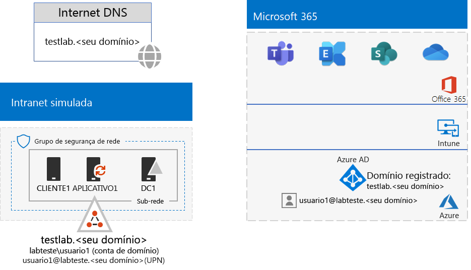

# <a name="identity-and-device-access-prerequisites-for-password-hash-synchronization-in-your-microsoft-365-test-environment"></a>Pré-requisitos de acesso a identidades e dispositivos para sincronização de hash de senha no seu ambiente de teste do Microsoft 365

*Este guia de laboratório de teste só pode ser usado para o Microsoft 365 para ambientes de teste corporativos.*

[As configurações de acesso de dispositivo e identidade](../security/office-365-security/microsoft-365-policies-configurations.md) são um conjunto de configurações e políticas de acesso condicional para proteger o acesso a todos os serviços no Microsoft 365 for Enterprise integrados ao Azure Active Directory (Azure AD).

Este artigo descreve como configurar um ambiente de teste do Microsoft 365 que atenda aos requisitos do [Active Directory com a configuração de pré-requisito de sincronização de hash de senha](../security/office-365-security/identity-access-prerequisites.md#prerequisites) para acesso a identidades e dispositivos.

Existem oito fases para configurar este ambiente de teste:

1.  Crie uma empresa simulada com o ambiente de teste de sincronização de hash de senha
2.  Configurar logon único contínuo do Azure AD
3.  Configurar localizações nomeadas
4.  Configurar o write-back de senha
5.  Configurar redefinição de senha de autoatendimento para todas as contas de usuário
6.  Configurar autenticação multifator para todas as contas de usuário
7.  Habilitar o Azure AD Identity Protection
8.  Habilite a autenticação moderna para o Exchange Online e o Skype for Business Online

## <a name="phase-1-build-out-your-simulated-enterprise-with-password-hash-sync-microsoft-365-test-environment"></a>Fase 1: construa sua empresa simulada com sincronização de hash de senha no ambiente de teste do Microsoft 365

Siga as instruções em [Sincronização de hash de senha](password-hash-sync-m365-ent-test-environment.md).
Esta é a configuração resultante.


 
## <a name="phase-2-configure-azure-ad-seamless-single-sign-on"></a>Fase 2: configurar o logon único contínuo do Azure AD

Siga as instruções na [Fase 2 do Guia do Laboratório de Testes de Logon Único Contínuo do Azure AD](single-sign-on-m365-ent-test-environment.md#phase-2-configure-azure-ad-connect-on-app1-for-azure-ad-seamless-sso).

## <a name="phase-3-configure-named-locations"></a>Fase 3: Configurar locais nomeados

Primeiro, determine os endereços IP públicos ou os intervalos de endereços usados por sua organização.

Em seguida, siga as instruções em [Configurar locais nomeados no Active Directory do Azure](https://docs.microsoft.com/azure/active-directory/reports-monitoring/quickstart-configure-named-locations) para adicionar os endereços ou intervalos de endereços como locais nomeados. 

## <a name="phase-4-configure-password-writeback"></a>Fase 4: Configurar write-back de senha

Siga as instruções da [Fase 2 do Guia do Laboratório de Teste de write-back de senha](password-writeback-m365-ent-test-environment.md#phase-2-enable-password-writeback-for-the-testlab-ad-ds-domain).

## <a name="phase-5-configure-self-service-password-reset"></a>Fase 5: Configurar a redefinição da senha de autoatendimento

Siga as instruções na [Fase 3 do Guia do Laboratório de Teste de redefinição de senha](password-reset-m365-ent-test-environment.md#phase-3-configure-and-test-password-reset). 

Ao habilitar a redefinição de senha para as contas em um grupo específico do Azure AD, adicione essas contas ao grupo **Redefinição de senha**:

- Usuário 2
- Usuário 3
- Usuário 4
- Usuário 5

Teste a redefinição de senha somente para a conta do Usuário 2.

## <a name="phase-6-configure-multi-factor-authentication"></a>Fase 6: Configurar a autenticação multifator

Siga as instruções na [Fase 2 do Guia do Laboratório de Teste de autenticação multifator](multi-factor-authentication-microsoft-365-test-environment.md#phase-2-enable-and-test-multi-factor-authentication-for-the-user-2-account) para as seguintes contas de usuário:

- Usuário 2
- Usuário 3
- Usuário 4
- Usuário 5

Teste a autenticação de vários fatores somente para a conta do Usuário 2.

## <a name="phase-7-enable-azure-ad-identity-protection"></a>Fase 7: ativar a proteção de identidade do Azure AD

Siga as instruções na [Fase 2 do Guia do Laboratório de Teste do Azure AD Identity Protection](azure-ad-identity-protection-microsoft-365-test-environment.md#phase-2-use-azure-ad-identity-protection). 

## <a name="phase-8-enable-modern-authentication-for-exchange-online-and-skype-for-business-online"></a>Fase 8: habilite a autenticação moderna para o Exchange Online e o Skype for Business Online

Para o Exchange Online, siga [estas instruções](https://docs.microsoft.com/Exchange/clients-and-mobile-in-exchange-online/enable-or-disable-modern-authentication-in-exchange-online#enable-or-disable-modern-authentication-in-exchange-online-for-client-connections-in-outlook-2013-or-later). 

Para o Skype for Business Online:

1. Conecte-se ao [Skype for Business Online](https://docs.microsoft.com/SkypeForBusiness/set-up-your-computer-for-windows-powershell/set-up-your-computer-for-windows-powershell).

2. Execute este comando.

  ```powershell
  Set-CsOAuthConfiguration -ClientAdalAuthOverride Allowed
  ```

3. Verifique se a mudança foi bem sucedida com este comando.

  ```powershell
  Get-CsOAuthConfiguration
  ```

O resultado é um ambiente de teste que atende aos requisitos de [configuração de pré-requisito de sincronização de hash de senha do Active Directory](../security/office-365-security/identity-access-prerequisites.md#prerequisites) para acesso a identidades e dispositivos. 

## <a name="next-step"></a>Próxima etapa

Use [Políticas comuns de acesso a identidades e dispositivos](identity-access-policies.md) para configurar as políticas criadas com base nos pré-requisitos e proteger identidades e dispositivos.

## <a name="see-also"></a>Confira também

[Guias adicionais de laboratório de teste de identidade](m365-enterprise-test-lab-guides.md#identity)

[Roteiro de identidade](identity-roadmap-microsoft-365.md)

[Guias do Laboratório de Teste do Microsoft 365 para empresas](m365-enterprise-test-lab-guides.md)

[Visão geral do Microsoft 365 para empresas](microsoft-365-overview.md)

[Documentação da Microsoft 365 para empresas](https://docs.microsoft.com/microsoft-365-enterprise/)
