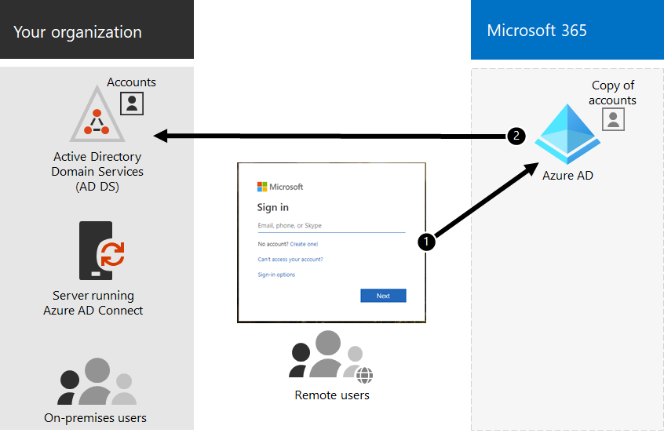

# Identidade híbrida e sincronização de diretórios para o Microsoft 365

*Este artigo se aplica tanto ao Microsoft 365 Enterprise quanto ao Office 365 Enterprise.*

Dependendo das suas necessidades de negócios e dos requisitos técnicos, o modelo de identidade híbrida e a sincronização de diretórios é a escolha mais comum para clientes corporativos que estão adotando o Microsoft 365. A sincronização de diretórios permite que você gerencie identidades em seus Serviços de Domínio do Active Directory (AD DS) e todas as atualizações para contas de usuário, grupos e contatos são sincronizadas com o locatário do Azure Active Directory (Azure AD) de sua assinatura do Microsoft 365.

>[!Note]
>Quando as contas de usuário do AD DS são sincronizadas pela primeira vez, elas não são atribuídas automaticamente a uma licença do Microsoft 365 e não podem acessar serviços do Microsoft 365, como email. Primeiro, você deve atribuir a eles um local de uso. Em seguida, atribua uma licença a essas contas de usuário, individualmente ou dinamicamente por meio da associação ao grupo.
>

## Autenticação para identidade híbrida

Há dois tipos de autenticação ao usar o modelo de identidade híbrida:

- Autenticação gerenciada

  O Azure AD lida com o processo de autenticação usando uma versão com hashed armazenada localmente da senha ou envia as credenciais para um agente de software local a ser autenticado pelo AD DS local.

- Autenticação federada

  O Azure AD redireciona o computador cliente solicitando autenticação para outro provedor de identidade.

### Autenticação gerenciada

Há dois tipos de autenticação gerenciada:

- Sincronização de hash de senha (PHS)

  O Azure AD realiza a própria autenticação.

- Autenticação de passagem (PTA)

  O Azure AD faz o AD DS executar a autenticação.

#### Sincronização de hash de senha (PHS)

Com o PHS, você sincroniza suas contas de usuário do AD DS com o Microsoft 365 e gerencia seus usuários no local. Hashes de senhas de usuário são sincronizados do AD DS para o Azure AD para que os usuários tenham a mesma senha local e na nuvem. Essa é a maneira mais simples de habilitar a autenticação para identidades do AD DS no Azure AD. 

Quando as senhas são alteradas ou redefinidas no local, os novos hashes de senha são sincronizados com o Azure AD para que seus usuários sempre possam usar a mesma senha para recursos de nuvem e recursos locais. As senhas de usuário nunca são enviadas ao Azure AD ou armazenadas no Azure AD em texto claro. Alguns recursos premium do Azure AD, como a Proteção de Identidade, exigem PHS independentemente do método de autenticação selecionado.
  
Confira [escolher o método de autenticação correto](/azure/active-directory/hybrid/choose-ad-authn) para saber mais.
  
#### Autenticação de passagem (PTA)

O PTA fornece uma validação de senha simples para os serviços de autenticação do Azure AD usando um agente de software em execução em um ou mais servidores locais para validar os usuários diretamente com seu AD DS. Com o PTA, você sincroniza contas de usuário do AD DS com o Microsoft 365 e gerencia seus usuários no local. 

O PTA permite que os usuários entre em recursos e aplicativos locais e do Microsoft 365 usando sua conta local e senha. Essa configuração valida as senhas dos usuários diretamente em seu AD DS local sem armazenar hashes de senha no Azure AD. 

O PTA também é para organizações com um requisito de segurança para impor imediatamente estados de conta de usuário locais, políticas de senha e horário de logon. 
  
Confira [escolher o método de autenticação correto](/azure/active-directory/hybrid/choose-ad-authn) para saber mais.
  
### Autenticação federada

A autenticação federada é principalmente para organizações de grandes empresas com requisitos de autenticação mais complexos. As identidades do AD DS são sincronizadas com o Microsoft 365 e as contas de usuários são gerenciadas no local. Com a autenticação federada, os usuários têm a mesma senha local e na nuvem e não precisam entrar novamente para usar o Microsoft 365. 

A autenticação federada pode dar suporte a requisitos de autenticação adicionais, como autenticação baseada em cartão inteligente ou autenticação multifato de terceiros e normalmente é necessária quando as organizações têm um requisito de autenticação não suportado nato pelo Azure AD.
 
Confira [escolher o método de autenticação correto](/azure/active-directory/hybrid/choose-ad-authn) para saber mais.
  
#### Provedores de identidade e autenticação de terceiros

Os objetos de diretório local podem ser sincronizados com o Microsoft 365 e o acesso a recursos na nuvem é gerenciado principalmente por um provedor de identidade de terceiros (IdP). Se sua organização usa uma solução de federação de terceiros, você pode configurar o login com essa solução para o Microsoft 365, desde que a solução de federação de terceiros seja compatível com o Azure AD.
  
Consulte a lista de compatibilidade de federação do [Azure AD](/azure/active-directory/connect/active-directory-aadconnect-federation-compatibility) para saber mais.
  
## Preparação do AD DS

Para ajudar a garantir uma transição perfeita para o Microsoft 365 usando a sincronização, você deve preparar sua floresta do AD DS antes de iniciar a implantação de sincronização de diretórios do Microsoft 365.
  
A preparação do diretório deve se concentrar nas seguintes tarefas:

- Remover os **atributos proxyAddress** e **userPrincipalName.**
- Atualizar atributos **userPrincipalName em** branco e inválidos com atributos **userPrincipalName** válidos.
- Remova caracteres inválidos e questionáveis nos atributos **givenName**, sobrenome ( **sn** ), **sAMAccountName,** **displayName,** **mail,** **proxyAddresses,** **mailNickname** e **userPrincipalName.** Para obter detalhes sobre como preparar atributos, consulte Lista de atributos sincronizados pela Ferramenta de Sincronização [do Azure Active Directory.](https://go.microsoft.com/fwlink/p/?LinkId=396719)

    > [!NOTE]
    > Esses são os mesmos atributos que o Azure AD Connect sincroniza. 
  
## Considerações sobre a implantação de várias florestas

Para várias florestas e opções de SSO, use uma [Instalação Personalizada do Azure AD Connect](/azure/active-directory/hybrid/how-to-connect-install-custom).
  
Se sua organização tiver várias florestas para autenticação (florestas de logon), recomendamos o seguinte:
  
- **Considere consolidar suas florestas.** Em geral, há mais sobrecarga necessária para manter várias florestas. A menos que sua organização tenha restrições de segurança que ditam a necessidade de florestas separadas, considere simplificar seu ambiente local.
- **Use somente em sua floresta de logon principal.** Considere a implantação do Microsoft 365 somente na floresta de logon principal para a distribuição inicial do Microsoft 365. 

Se você não puder consolidar sua implantação do AD DS de várias florestas ou estiver usando outros serviços de diretório para gerenciar identidades, talvez seja possível sincroná-los com a ajuda da Microsoft ou de um parceiro.
  
Confira [Topologias do Azure AD Connect](/azure/active-directory/hybrid/plan-connect-topologies) para obter mais informações.
  
## Recursos que dependem da sincronização de diretórios
  
A sincronização de diretórios é necessária para os seguintes recursos e funcionalidade:
  
- Single Sign-On (SSO) do Azure AD
- Coexistência do Skype
- Implantação híbrida do Exchange, incluindo:
  - Gal (lista de endereços global totalmente compartilhada) entre seu ambiente local do Exchange e o Microsoft 365.
  - Sincronizar informação de GAL de sistemas de email diferentes.
  - A capacidade de adicionar usuários e remover usuários das ofertas de serviço do Microsoft 365. Isto exige o seguinte:
  - A sincronização de duas vias deve ser configurada durante a configuração de sincronização de diretório. Por padrão, as ferramentas de sincronização de diretórios gravarão informações de diretório somente na nuvem. Quando você configura a sincronização de duas vias, habilita a funcionalidade de retorno de gravação para que um número limitado de atributos de objeto seja copiado da nuvem e, em seguida, os escreva de volta para o AD DS local. O write-back também é conhecido como modo híbrido do Exchange. 
  - Uma implantação híbrida local do Exchange
  - A capacidade de mover algumas caixas de correio de usuário para o Microsoft 365 enquanto mantém outras caixas de correio de usuário no local.
  - Os envios seguros e os envios bloqueados no local são replicados para o Microsoft 365.
  - Delegação básica e funcionalidade de email enviar em nome de.
  - Você tem um cartão inteligente local integrado ou uma solução de autenticação multifação.
- Sincronização de fotos, miniaturas, salas de conferência e grupos de segurança

## Próxima etapa

Quando estiver pronto para implantar a identidade híbrida, consulte [Prepare for directory synchronization](prepare-for-directory-synchronization.md).
