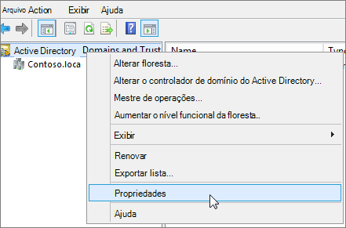

# <a name="prepare-a-non-routable-domain-for-directory-synchronization"></a><span data-ttu-id="8c445-103">Preparar um domínio não roteável para sincronização de diretórios</span><span class="sxs-lookup"><span data-stu-id="8c445-103">Prepare a non-routable domain for directory synchronization</span></span>
<span data-ttu-id="8c445-104">Ao sincronizar seu diretório local com o Microsoft 365, você precisa ter um domínio verificado no Azure Active Directory (Azure AD).</span><span class="sxs-lookup"><span data-stu-id="8c445-104">When you synchronize your on-premises directory with Microsoft 365 you have to have a verified domain in Azure Active Directory (Azure AD).</span></span> <span data-ttu-id="8c445-105">Somente os nomes principais de usuário (UPN) associados ao domínio local são sincronizados.</span><span class="sxs-lookup"><span data-stu-id="8c445-105">Only the User Principal Names (UPN) that are associated with the on-premises domain are synchronized.</span></span> <span data-ttu-id="8c445-106">No entanto, qualquer UPN que contenha um domínio não roteável, por exemplo. local (como billa@contoso. local), será sincronizado com um domínio. onmicrosoft.com (como billa@contoso.onmicrosoft.com).</span><span class="sxs-lookup"><span data-stu-id="8c445-106">However, any UPN that contains an non-routable domain, for example .local (like billa@contoso.local), will be synchronized to an .onmicrosoft.com domain (like billa@contoso.onmicrosoft.com).</span></span> 

<span data-ttu-id="8c445-107">Se você usa atualmente um domínio. local para suas contas de usuário nos serviços de domínio do Active Directory (AD DS), recomenda-se alterá-lo para usar um domínio verificado (como o billa@contoso.com) a fim de sincronizar corretamente com seu domínio do Microsoft 365.</span><span class="sxs-lookup"><span data-stu-id="8c445-107">If you currently use a .local domain for your user accounts in Active Directory Domain Services (AD DS) it's recommended that you change them to use a verified domain (like billa@contoso.com) in order to properly sync with your Microsoft 365 domain.</span></span>
  
## <a name="what-if-i-only-have-a-local-on-premises-domain"></a><span data-ttu-id="8c445-108">E se eu só tiver um domínio. local local?</span><span class="sxs-lookup"><span data-stu-id="8c445-108">What if I only have a .local on-premises domain?</span></span>

<span data-ttu-id="8c445-109">A ferramenta mais recente que você pode usar para sincronizar seu AD DS com o Azure AD é chamada Azure AD Connect.</span><span class="sxs-lookup"><span data-stu-id="8c445-109">The most recent tool you can use for synchronizing your AD DS to Azure AD is named Azure AD Connect.</span></span> <span data-ttu-id="8c445-110">Para obter mais informações, consulte [integrando suas identidades locais com o Azure ad](https://docs.microsoft.com/azure/architecture/reference-architectures/identity/azure-ad).</span><span class="sxs-lookup"><span data-stu-id="8c445-110">For more information, see [Integrating your on-premises identities with Azure AD](https://docs.microsoft.com/azure/architecture/reference-architectures/identity/azure-ad).</span></span>
  
<span data-ttu-id="8c445-111">O Azure AD Connect sincroniza o UPN e a senha dos usuários para que os usuários possam entrar com as mesmas credenciais que usam no local.</span><span class="sxs-lookup"><span data-stu-id="8c445-111">Azure AD Connect synchronizes your users' UPN and password so that users can sign in with the same credentials they use on-premises.</span></span> <span data-ttu-id="8c445-112">No entanto, o Azure AD Connect sincroniza apenas os usuários em domínios verificados pelo Microsoft 365.</span><span class="sxs-lookup"><span data-stu-id="8c445-112">However, Azure AD Connect only synchronizes users to domains that are verified by Microsoft 365.</span></span> <span data-ttu-id="8c445-113">Isso significa que o domínio também é verificado pelo Azure AD porque as identidades do Microsoft 365 são gerenciadas pelo Azure AD.</span><span class="sxs-lookup"><span data-stu-id="8c445-113">This means that the domain also is verified by Azure AD because Microsoft 365 identities are managed by Azure AD.</span></span> <span data-ttu-id="8c445-114">Em outras palavras, o domínio deve ser um domínio válido da Internet (por exemplo,. com,. org, .net,. us, etc.).</span><span class="sxs-lookup"><span data-stu-id="8c445-114">In other words, the domain has to be a valid Internet domain (for example, .com, .org, .net, .us, etc.).</span></span> <span data-ttu-id="8c445-115">Se o AD DS interno usar apenas um domínio não roteável (por exemplo,. local), isso não poderá corresponder ao domínio verificado que você tem no Microsoft 365.</span><span class="sxs-lookup"><span data-stu-id="8c445-115">If your internal AD DS only uses a non-routable domain (for example, .local), this can't possibly match the verified domain you have on Microsoft 365.</span></span> <span data-ttu-id="8c445-116">Você pode corrigir esse problema alterando seu domínio primário no AD DS local ou adicionando um ou mais sufixos UPN.</span><span class="sxs-lookup"><span data-stu-id="8c445-116">You can fix this issue by either changing your primary domain in your on premises AD DS, or by adding one or more UPN suffixes.</span></span>
  
### <a name="change-your-primary-domain"></a><span data-ttu-id="8c445-117">**Alterar seu domínio primário**</span><span class="sxs-lookup"><span data-stu-id="8c445-117">**Change your primary domain**</span></span>

<span data-ttu-id="8c445-118">Altere o domínio primário para um domínio verificado no Microsoft 365, por exemplo, contoso.com.</span><span class="sxs-lookup"><span data-stu-id="8c445-118">Change your primary domain to a domain you have verified in Microsoft 365, for example, contoso.com.</span></span> <span data-ttu-id="8c445-119">Todos os usuários que têm o domínio contoso. local é atualizado para o contoso.com.</span><span class="sxs-lookup"><span data-stu-id="8c445-119">Every user that has the domain contoso.local is then updated to contoso.com.</span></span> <span data-ttu-id="8c445-120">Esse é um processo muito envolvido, no entanto, e uma solução mais fácil é descrita na seção a seguir.</span><span class="sxs-lookup"><span data-stu-id="8c445-120">This is a very involved process, however, and an easier solution is described in the following section.</span></span>
  
### <a name="add-upn-suffixes-and-update-your-users-to-them"></a><span data-ttu-id="8c445-121">**Adicionar sufixos UPN e atualizar seus usuários para eles**</span><span class="sxs-lookup"><span data-stu-id="8c445-121">**Add UPN suffixes and update your users to them**</span></span>

<span data-ttu-id="8c445-122">Você pode resolver o problema. local registrando novos sufixos de UPN ou sufixos no AD DS para corresponder ao domínio (ou domínios) que você verificou no Microsoft 365.</span><span class="sxs-lookup"><span data-stu-id="8c445-122">You can solve the .local problem by registering new UPN suffix or suffixes in AD DS to match the domain (or domains) you verified in Microsoft 365.</span></span> <span data-ttu-id="8c445-123">Depois de registrar o novo sufixo, você atualizará os UPNs do usuário para substituir o. local pelo novo nome de domínio, por exemplo, para que uma conta de usuário se pareça com billa@contoso.com.</span><span class="sxs-lookup"><span data-stu-id="8c445-123">After you register the new suffix, you update the user UPNs to replace the .local with the new domain name for example so that a user account looks like billa@contoso.com.</span></span>
  
<span data-ttu-id="8c445-124">Depois de atualizar os UPNs para usar o domínio verificado, você estará pronto para sincronizar seu AD DS local com o Microsoft 365.</span><span class="sxs-lookup"><span data-stu-id="8c445-124">After you have updated the UPNs to use the verified domain, you are ready to synchronize your on-premises AD DS with Microsoft 365.</span></span>
  
 <span data-ttu-id="8c445-125">**Etapa 1: Adicionar o novo sufixo UPN**</span><span class="sxs-lookup"><span data-stu-id="8c445-125">**Step 1: Add the new UPN suffix**</span></span>
  
1. <span data-ttu-id="8c445-126">No controlador de domínio do AD DS, no Gerenciador de servidores, escolha **ferramentas** \> **domínios e relações de confiança do Active Directory**.</span><span class="sxs-lookup"><span data-stu-id="8c445-126">On the AD DS domain controller, in the Server Manager choose **Tools** \> **Active Directory Domains and Trusts**.</span></span>
    
    <span data-ttu-id="8c445-127">**Ou, se você não tiver o Windows Server 2012**</span><span class="sxs-lookup"><span data-stu-id="8c445-127">**Or, if you don't have Windows Server 2012**</span></span>
    
    <span data-ttu-id="8c445-128">Pressione a **tecla Windows + R** para abrir a caixa de diálogo **executar** e digite domain. msc e, em seguida, escolha **OK**.</span><span class="sxs-lookup"><span data-stu-id="8c445-128">Press **Windows key + R** to open the **Run** dialog, and then type in Domain.msc, and then choose **OK**.</span></span>
    
    
  
2. <span data-ttu-id="8c445-130">Na janela **domínios e relações de confiança do Active Directory** , clique com o botão direito em **domínios e relações de confiança do Active Directory** e escolha **Propriedades**.</span><span class="sxs-lookup"><span data-stu-id="8c445-130">On the **Active Directory Domains and Trusts** window, right-click **Active Directory Domains and Trusts**, and then choose **Properties**.</span></span>
    
    
  
3. <span data-ttu-id="8c445-132">Na guia **sufixos UPN** , na caixa **sufixos UPN alternativos** , digite seu novo sufixo UPN ou sufixos e, em seguida, escolha **Adicionar** \> **aplicar**.</span><span class="sxs-lookup"><span data-stu-id="8c445-132">On the **UPN Suffixes** tab, in the **Alternative UPN Suffixes** box, type your new UPN suffix or suffixes, and then choose **Add** \> **Apply**.</span></span>
    
    
  
    <span data-ttu-id="8c445-134">Escolha **OK** quando terminar de adicionar os sufixos.</span><span class="sxs-lookup"><span data-stu-id="8c445-134">Choose **OK** when you're done adding suffixes.</span></span> 
    
 <span data-ttu-id="8c445-135">**Etapa 2: alterar o sufixo UPN para usuários existentes**</span><span class="sxs-lookup"><span data-stu-id="8c445-135">**Step 2: Change the UPN suffix for existing users**</span></span>
  
1. <span data-ttu-id="8c445-136">No controlador de domínio do AD DS, no Gerenciador de servidores, escolha **ferramentas** \> **usuários e computadores do Active Directory**.</span><span class="sxs-lookup"><span data-stu-id="8c445-136">On the AD DS domain controller, in the Server Manager choose **Tools** \> **Active Directory Users and Computers**.</span></span>
    
    <span data-ttu-id="8c445-137">**Ou, se você não tiver o Windows Server 2012**</span><span class="sxs-lookup"><span data-stu-id="8c445-137">**Or, if you don't have Windows Server 2012**</span></span>
    
    <span data-ttu-id="8c445-138">Pressione a **tecla Windows + R** para abrir a caixa de diálogo **executar** e digite dsa. msc e clique em **OK**</span><span class="sxs-lookup"><span data-stu-id="8c445-138">Press **Windows key + R** to open the **Run** dialog, and then type in Dsa.msc, and then click **OK**</span></span>
    
2. <span data-ttu-id="8c445-139">Selecione um usuário, clique com o botão direito do mouse e escolha **Propriedades**.</span><span class="sxs-lookup"><span data-stu-id="8c445-139">Select a user, right-click, and then choose **Properties**.</span></span>
    
3. <span data-ttu-id="8c445-140">Na guia **conta** , na lista suspensa sufixo de UPN, escolha o novo sufixo UPN e, em seguida, escolha **OK**.</span><span class="sxs-lookup"><span data-stu-id="8c445-140">On the **Account** tab, in the UPN suffix drop-down list, choose the new UPN suffix, and then choose **OK**.</span></span>
    
    
  
4. <span data-ttu-id="8c445-142">Conclua estas etapas para cada usuário.</span><span class="sxs-lookup"><span data-stu-id="8c445-142">Complete these steps for every user.</span></span>
    
   
### <a name="you-can-also-use-windows-powershell-to-change-the-upn-suffix-for-all-users"></a><span data-ttu-id="8c445-143">**Você também pode usar o Windows PowerShell para alterar o sufixo UPN de todos os usuários**</span><span class="sxs-lookup"><span data-stu-id="8c445-143">**You can also use Windows PowerShell to change the UPN suffix for all users**</span></span>

<span data-ttu-id="8c445-144">Se você tiver muitos usuários para atualizar, é mais fácil usar o Windows PowerShell.</span><span class="sxs-lookup"><span data-stu-id="8c445-144">If you have a lot of users to update, it is easier to use Windows PowerShell.</span></span> <span data-ttu-id="8c445-145">O exemplo a seguir usa os cmdlets [Get-ADUser](https://go.microsoft.com/fwlink/p/?LinkId=624312) e [set-ADUser](https://go.microsoft.com/fwlink/p/?LinkId=624313) para alterar todos os sufixos contoso. local para contoso.com.</span><span class="sxs-lookup"><span data-stu-id="8c445-145">The following example uses the cmdlets [Get-ADUser](https://go.microsoft.com/fwlink/p/?LinkId=624312) and [Set-ADUser](https://go.microsoft.com/fwlink/p/?LinkId=624313) to change all contoso.local suffixes to contoso.com.</span></span> 

<span data-ttu-id="8c445-146">Por exemplo, você pode executar os seguintes comandos do Windows PowerShell para atualizar todos os sufixos contoso. local para contoso.com:</span><span class="sxs-lookup"><span data-stu-id="8c445-146">For example, you could run the following Windows PowerShell commands to update all contoso.local suffixes to contoso.com:</span></span>
    
  ```powershell
  $LocalUsers = Get-ADUser -Filter "UserPrincipalName -like '*contoso.local'" -Properties userPrincipalName -ResultSetSize $null
  $LocalUsers | foreach {$newUpn = $_.UserPrincipalName.Replace("@contoso.local","@contoso.com"); $_ | Set-ADUser -UserPrincipalName $newUpn}
  ```

<span data-ttu-id="8c445-147">Consulte [Active Directory Windows PowerShell Module](https://go.microsoft.com/fwlink/p/?LinkId=624314) para saber mais sobre como usar o Windows PowerShell no AD DS.</span><span class="sxs-lookup"><span data-stu-id="8c445-147">See [Active Directory Windows PowerShell module](https://go.microsoft.com/fwlink/p/?LinkId=624314) to learn more about using Windows PowerShell in AD DS.</span></span> 

