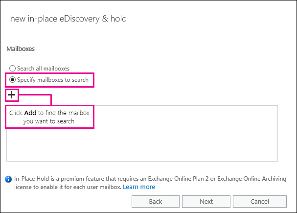
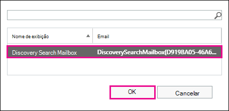
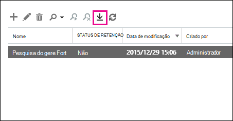

# Recuperar itens excluídos em uma caixa de correio de usuário

**Este artigo é para administradores. Você está tentando recuperar itens excluídos em sua própria caixa de correio?** Tente uma das seguintes opções:
- [Recuperar itens excluídos no Outlook para Windows](https://support.office.com/article/49e81f3c-c8f4-4426-a0b9-c0fd751d48ce)
- [Recuperar itens ou emails excluídos no Outlook Web App](https://support.office.com/article/c3d8fc15-eeef-4f1c-81df-e27964b7edd4)
- [Restaurar mensagens de email excluídas no Outlook na Web](https://support.office.com/article/a8ca78ac-4721-4066-95dd-571842e9fb11)
- [Outlook.com](https://go.microsoft.com/fwlink/p/?LinkID=623435)
   
Um usuário excluiu permanentemente itens da caixa de correio do Outlook? O usuário deseja refazê-los, mas não pode recuperá-los. Você pode ser capaz de recuperar os itens removidos se eles não foram removidos permanentemente da caixa de correio do usuário. Para fazer isso, use a ferramenta de descoberta eletrônica in-loco no Exchange Online para pesquisar emails excluídos e outros itens, como contatos, compromissos de calendário e tarefas — na caixa de correio de um usuário. Se encontrar os itens excluídos, você poderá exportá-los para um arquivo PST (também chamado de arquivo de dados do Outlook), que o usuário pode usar para restaurar os itens de volta à caixa de correio.
  
Aqui estão as etapas para recuperar itens excluídos na caixa de correio de um usuário. Quanto tempo isso levará? A primeira vez pode levar 20 ou 30 minutos para concluir todas as etapas, dependendo de quantos itens você está tentando recuperar.
  
> [!NOTE]
> Você precisa ser um **administrador do Exchange** ou um **Administrador Global** no Microsoft 365 ou ser membro do grupo de função gerenciamento da organização no Exchange Online para executar as etapas neste artigo. Para obter mais informações, consulte [Sobre as funções de administrador do Microsoft 365](https://support.office.com/article/da585eea-f576-4f55-a1e0-87090b6aaa9d). 
  
## Etapa 1: atribuir permissões de descoberta eletrônica por conta própria

A primeira etapa é atribuir as permissões necessárias no Exchange Online para que você possa usar a ferramenta de descoberta eletrônica in-loco para pesquisar a caixa de correio de um usuário. Isso só precisa ser feito uma vez. Se você precisar pesquisar outra caixa de correio no futuro, ignore esta etapa.
  
1. [Onde entrar no Microsoft 365 for Business](https://support.microsoft.com/office/where-to-sign-into-microsoft-365-for-business-e9eb7d51-5430-4929-91ab-6157c5a050b4) com sua conta corporativa ou de estudante. 
    
2. Selecione o ícone do inicializador  no canto superior esquerdo e clique em **administrador**.
    
3. Na navegação à esquerda no centro de administração do Microsoft 365, expanda **centros de administração**e clique em **Exchange**.
    
    
  
4. No centro de administração do Exchange, clique em **permissões**e, em seguida, clique em **funções de administrador**.
    
5. No modo de exibição de lista, selecione **Gerenciamento de descoberta**e clique em **Editar**  .
    
    
  
6. Em **grupo de função**, em **Membros**, clique em **Adicionar**  .
    
7. Em **selecionar Membros**, selecione-se na lista de nomes, clique em **Adicionar**e, em seguida, clique em **OK**.
    
    > [!NOTE]
    > Você também pode adicionar um grupo do qual você é membro, como gerenciamento da organização ou TenantAdmins. Se você adicionar um grupo, as permissões necessárias para executar a ferramenta de descoberta eletrônica in-loco serão atribuídas a outros membros do grupo. 
  
8. Em **grupo de funções**, clique em **salvar**.
    
9. Saia do Microsoft 365.
    
    Você deve sair antes de iniciar a próxima etapa para que as novas permissões entrem em vigor.
    
> [!CAUTION]
> Os membros do grupo de função gerenciamento de descoberta podem acessar o conteúdo de mensagens confidenciais. Isso inclui pesquisar todas as caixas de correio em sua organização, Visualizar os resultados da pesquisa (e outros itens de caixa de correio), copiar os resultados para uma caixa de correio de descoberta e exportar os resultados da pesquisa para um arquivo PST. 
  
[Return to top](recover-deleted-items-in-a-mailbox.md)
  
## Etapa 2: Pesquisar itens excluídos na caixa de correio do usuário

Quando você executa uma pesquisa de descoberta eletrônica in-loco, a pasta itens recuperáveis na caixa de correio que você pesquisa é automaticamente incluída na pesquisa. A pasta itens recuperáveis é onde os itens excluídos permanentemente são armazenados até serem limpos (permanentemente removidos) da caixa de correio. Portanto, se um item não tiver sido removido, você deverá ser capaz de encontrá-lo usando a ferramenta de descoberta eletrônica in-loco.
  
1. [Onde entrar no Microsoft 365 for Business](https://support.microsoft.com/office/where-to-sign-into-microsoft-365-for-business-e9eb7d51-5430-4929-91ab-6157c5a050b4) com sua conta corporativa ou de estudante. 
    
2. Selecione o ícone do inicializador  no canto superior esquerdo e clique em **administrador**.
    
3. Na navegação à esquerda no centro de administração do Microsoft 365, expanda **administrador**e clique em **Exchange**.
    
4. No centro de administração do Exchange, clique em **Gerenciamento de conformidade**, clique **em &amp; bloqueio de descoberta eletrônica in-loco**e, em seguida, clique em **novo**  .
    
    
  
5. Na página **nome e descrição** , digite um nome para a pesquisa (como o nome do usuário para o qual você está recuperando o email), uma descrição opcional e clique em **Avançar**.
    
6. Na página **caixas de correio** , clique em **especificar caixas de correio a serem pesquisadas**e, em seguida, clique em **Adicionar**  .
    
    
  
7. Localize e selecione o nome do usuário para o qual você está recuperando o email excluído, clique em **Adicionar**e, em seguida, clique em **OK**.
    
8. Clique em **Avançar**.
    
    A página de **consulta de pesquisa** é exibida. É aqui que você define os critérios de pesquisa que o ajudarão a encontrar os itens ausentes na caixa de correio do usuário. 
    
9. Na página **Consulta de pesquisa**, preencha os seguintes campos: 
    
  - **Incluir todo o conteúdo** Selecione essa opção para incluir todo o conteúdo na caixa de correio do usuário nos resultados da pesquisa. Se você selecionar essa opção, não poderá especificar critérios de pesquisa adicionais. 
    
  - **Filtro com base nos critérios** Selecione essa opção para especificar os critérios de pesquisa, incluindo palavras-chave, datas de início e término, endereços do remetente e do destinatário e tipos de mensagem. 
    
    
  
|**Field**|**Use para...**|
|:-----|:-----|
|             |Especifique palavras-chave, intervalo de datas, destinatários e tipos de mensagens.    |
|             |Pesquise mensagens com palavras-chave ou frases e use operadores lógicos, como **e** ou **ou**.    |
|             |Pesquisar mensagens enviadas ou recebidas em um intervalo de datas.    |
|             |Pesquisar mensagens recebidas ou enviadas para pessoas específicas.    |
|             |Procure todos os tipos de mensagem ou selecione os específicos.    |
   
   > [!TIP]
   >  Veja algumas dicas sobre como criar uma consulta de pesquisa para localizar itens ausentes. Tente obter o máximo de informações do usuário para ajudá-lo a criar uma consulta de pesquisa para que você possa encontrar o que está procurando. Se você não tiver certeza de como localizar uma mensagem ausente, considere o uso da opção **incluir todo o conteúdo** . Os resultados da pesquisa incluirão todos os itens na pasta itens recuperáveis do usuário, incluindo a pasta oculta (chamada de pasta limpezas) que contêm itens que foram removidos pelo usuário. Em seguida, você pode ir para a etapa 3, copiar os resultados para uma caixa de correio de descoberta e examinar a mensagem na pasta oculta. Se você souber aproximadamente quando a mensagem ausente foi originalmente enviada ou recebida pelo usuário, use as opções **especificar data de início** e **especificar data de término** para fornecer um intervalo de datas. Isso retornará todas as mensagens enviadas ou recebidas pelo usuário dentro desse intervalo de datas. A especificação de um intervalo de datas é uma ótima maneira de restringir os resultados da pesquisa. Se você souber quem enviou o email ausente, use a caixa **de** para especificar esse remetente. Se você deseja restringir os resultados da pesquisa para diferentes tipos de itens de caixa de correio, clique em **Selecionar tipos de mensagem**, clique em **selecionar os tipos de mensagem para pesquisa**e escolha um tipo de mensagem específico a ser pesquisado. Por exemplo, você pode pesquisar apenas itens de calendário ou contatos. Aqui está uma captura de tela dos diferentes tipos de mensagens que você pode pesquisar; o padrão é Pesquisar todos os tipos de mensagem. 
  
   Clique em **Avançar** quando você tiver concluído a página de **consulta de pesquisa** . 
    
10. Na página **configurações de bloqueio in-loco** , clique em **concluir** para iniciar a pesquisa. Para recuperar emails excluídos, não há motivo para colocar a caixa de correio do usuário em espera. 
    
    Depois que você iniciar a pesquisa, o Exchange exibirá uma estimativa do tamanho total e do número de itens que será retornado pela pesquisa com base nos critérios que você especificou.
    
11. Selecione a pesquisa que você acabou de criar e clique em **Atualizar**  para atualizar as informações exibidas no painel de detalhes. O status da **estimativa com êxito** indica que a pesquisa foi concluída. O Exchange também exibe uma estimativa do número total de itens (e seu tamanho) encontrado pela pesquisa com base nos critérios de pesquisa que você especificou na etapa 9. 
    
12. No painel de detalhes, clique em **Visualizar resultados da pesquisa** para exibir os itens que foram encontrados. Isso pode ajudar a identificar o (s) item (ns) que você está procurando. Se encontrar o (s) item (ns) que você está tentando recuperar, vá para a etapa 4 para exportar os resultados da pesquisa para um arquivo PST. 
    
    
  
13. Se não encontrar o que você está procurando, você poderá revisar seus critérios de pesquisa selecionando a pesquisa, clicando em **Editar**  e, em seguida, clicando em **consulta de pesquisa**. Altere o critério de pesquisa e execute a pesquisa novamente.
    
[Return to top](recover-deleted-items-in-a-mailbox.md)
  
## Opcion Etapa 3: copiar os resultados da pesquisa para uma caixa de correio de descoberta

Se não for possível localizar itens visualizando os resultados da pesquisa ou se quiser ver quais itens estão na pasta itens recuperáveis do usuário, você pode copiar os resultados da pesquisa para uma caixa de correio especial (chamada de caixa de correio de descoberta) e abrir essa caixa de correio no Outlook na Web para exibir os itens reais. O melhor motivo para copiar os resultados da pesquisa é que você possa exibir os itens na pasta itens recuperáveis do usuário. Mais do que provavelmente, o item que você está tentando recuperar está localizado na subpasta limpezas. 
  
1. No centro de administração do Exchange, vá para **Gerenciamento de conformidade** e \> **descoberta &amp; eletrônica in-loco**.
    
2. Na lista de pesquisas, selecione a pesquisa que você criou na etapa 2.
    
3. Clique **Search**em  de pesquisa e, em seguida, clique em **copiar resultados da pesquisa** na lista suspensa. 
    
    
  
4. Na página **copiar resultados da pesquisa** , clique em **procurar**.
    
    
  
5. Em **nome para exibição**, clique em **caixa de correio de pesquisa de descoberta**e, em seguida, clique em **OK**.
    
    
  
    > [!NOTE]
    > A caixa de correio de pesquisa de descoberta é uma caixa de correio de descoberta padrão criada automaticamente na sua organização do Microsoft 365. 
  
6. De volta à página **copiar resultados da pesquisa** , clique em **copiar** para iniciar o processo para copiar os resultados da pesquisa para a caixa de correio de pesquisa de descoberta. 
    
    
  
7. Clique em **Atualizar**  para atualizar as informações sobre o status de cópia exibido no painel de detalhes. 
    
8. Quando a cópia estiver concluída, clique em **abrir** para abrir a caixa de correio de pesquisa de descoberta para exibir os resultados da pesquisa. 
    
    
  
    Os resultados da pesquisa copiados para a caixa de correio de pesquisa de descoberta são colocados em uma pasta com o mesmo nome da pesquisa de descoberta eletrônica in-loco. Você pode clicar em uma pasta para exibir os itens dessa pasta.
    
    
  
    Quando você executa uma pesquisa, a pasta itens recuperáveis do usuário também é pesquisada. Isso significa que se os itens na pasta itens recuperáveis atenderem aos critérios de pesquisa, eles serão incluídos nos resultados da pesquisa. Itens na pasta exclusões são itens que o usuário excluiu permanentemente (excluindo um item da pasta itens excluídos ou selecionando-o e pressionando **Shift + Delete**. Um usuário pode usar a ferramenta recuperar itens excluídos no Outlook ou no Outlook na Web para recuperar itens na pasta exclusões. Itens na pasta expurgações são itens que o usuário limpou usando a ferramenta recuperar itens excluídos ou itens que eles foram automaticamente limpos por uma política aplicada à caixa de correio. Em ambos os casos, somente um administrador pode recuperar itens na pasta expurgações. 
    
    > [!TIP]
    > Se um usuário não conseguir localizar um item excluído usando a ferramenta itens recuperáveis, mas esse item ainda for recuperável (o que significa que ele não foi removido permanentemente da caixa de correio), é mais do que provavelmente localizado na pasta limpezas. Portanto, certifique-se de examinar a pasta limpezas do item excluído que você está tentando recuperar para um usuário. 
  
[Return to top](recover-deleted-items-in-a-mailbox.md)
  
## Etapa 4: exportar os resultados da pesquisa para um arquivo PST

Após localizar o item que você está tentando recuperar para um usuário, a próxima etapa é exportar os resultados da pesquisa executada na etapa 2 para um arquivo PST. O usuário usará esse arquivo PST na próxima etapa para restaurar o item excluído à caixa de correio.
  
1. No centro de administração do Exchange, vá para **Gerenciamento de conformidade** e \> **descoberta &amp; eletrônica in-loco**.
    
2. Na lista de pesquisas, selecione a pesquisa que você criou na etapa 2.
    
3. Clique em **exportar para um arquivo PST**.
    
    
  
4. Se você for solicitado a instalar a ferramenta de exportação de descoberta eletrônica, clique em **executar**.
    
5. Na ferramenta de exportação de PST de descoberta eletrônica, clique em **procurar** para especificar o local onde você deseja baixar o arquivo PST. 
    
    
  
    Você pode ignorar as opções para habilitar a eliminação de duplicação e incluir itens não pesquisáveis.
    
6. Clique em **Iniciar** para baixar o arquivo pst em seu computador. 
    
    A **ferramenta de exportação de PST de descoberta eletrônica** exibe informações de status sobre o processo de exportação. Quando a exportação estiver concluída, você poderá acessar o arquivo no local onde foi baixado. 
    
[Return to top](recover-deleted-items-in-a-mailbox.md)
  
## Etapa 5: restaurar os itens recuperados para a caixa de correio do usuário

A etapa final é usar o arquivo PST que foi exportado na etapa 4 para restaurar os itens recuperados para a caixa de correio do usuário. Depois de enviar o arquivo PST ao usuário, o restante desta etapa é executado pelo usuário para abrir o arquivo PST e, em seguida, mover os itens recuperados para outra pasta na caixa de correio. Para obter instruções passo a passo, você também pode enviar ao usuário um link para este tópico: [abrir e fechar arquivos de dados do Outlook (. pst)](https://support.office.com/article/381b776d-7511-45a0-953a-0935c79d24f2). Ou você pode enviar ao usuário um link para a seção [restaurar itens excluídos para uma caixa de correio usando um arquivo PST](recover-deleted-items-in-a-mailbox.md#restoredeleteditems) abaixo e pedir que eles executem essas etapas. 
  
 **Enviar o arquivo PST ao usuário**
  
A etapa final que você precisa realizar é enviar o arquivo PST que foi exportado na etapa 4 para o usuário. Há algumas maneiras de fazer isso:
  
- Anexe o arquivo PST a uma mensagem de email. Se o Outlook estiver configurado para bloquear arquivos PST, você terá que compactar o arquivo e anexá-lo à mensagem. Veja como:
    
1. No Windows Explorer ou no explorador de arquivos, navegue até o arquivo PST.
    
2. Clique com o botão direito do mouse no arquivo e selecione **Enviar para** \> **pasta compactada (zipada)**. O Windows cria um novo arquivo zip e fornece um nome idêntico ao arquivo PST.
    
3. Anexe o arquivo PST compactado a uma mensagem de email e envie-o ao usuário, que pode descompactar o arquivo simplesmente clicando nele.
    
- Copie o arquivo PST para uma pasta compartilhada que o usuário possa acessar e recuperá-lo.
    
As etapas da próxima seção são executadas pelo usuário para restaurar os itens excluídos para a caixa de correio.
  
 
**Restaurar itens excluídos para uma caixa de correio usando um arquivo PST**
  
Você precisa usar o aplicativo da área de trabalho do Outlook para restaurar um item excluído usando um arquivo PST. Você não pode usar o Outlook Web App ou o Outlook na Web para abrir um arquivo PST.
  
1. No Outlook 2013 ou no Outlook 2016, clique na guia **arquivo** . 
    
2. Clique em **abrir &amp; exportação**e, em seguida, clique em **Abrir arquivo de dados do Outlook**.
    
3. Navegue até o local onde você salvou o arquivo PST enviado pelo administrador.
    
4. Selecione o PST e clique em **abrir**.
    
    O arquivo PST aparece na barra de navegação à esquerda no Outlook.
    
    
  
5. Clique nas setas para expandir o arquivo PST e as pastas abaixo dele para localizar o item que você deseja recuperar.
    
    
  
    > [!TIP]
    > Procure na pasta limpezas do item que você deseja recuperar. Esta é uma pasta oculta à qual os itens excluídos são movidos. É provável que o item que o administrador tenha recuperado esteja nessa pasta. 
  
6. Clique com o botão direito do mouse no item que você deseja recuperar e clique em **mover** \> **outra pasta**.
    
    
  
7. Para mover o item para a caixa de entrada, clique em **caixa de entrada**e, em seguida, clique em **OK**.
    
    **Dica:** Para recuperar outros tipos de itens, siga um destes procedimentos: 
    
  - Para recuperar um item de calendário, clique nele com o botão direito do mouse e, em seguida, clique em **mover** \> **outro** \> **calendário**de pasta.
    
  - Para recuperar um contato, clique nele com o botão direito do mouse e, em seguida, clique em **mover** \> **outros** \> **contatos**da pasta.
    
  - Para recuperar uma tarefa, clique com o botão direito do mouse e clique em **mover** \> **outras** \> **tarefas**da pasta.
    

  
   > [!NOTE]
   > Itens de calendário, contatos e tarefas estão localizados diretamente na pasta limpezas e não em uma subpasta Calendário, contatos ou tarefas. No entanto, você pode classificar por **tipo** para agrupar tipos semelhantes de itens. 
    
8. Quando tiver terminado a recuperação de itens excluídos, clique com o botão direito do mouse no arquivo PST na barra de navegação à esquerda e selecione **fechar "nome do arquivo pst"**.
    
[Return to top](recover-deleted-items-in-a-mailbox.md)
  
## Mais informações

- Pode ser possível para um usuário recuperar um item permanentemente excluído se o período de retenção do item excluído para o item não tiver expirado. Como administrador, você pode ter especificado por quanto tempo os itens na pasta itens recuperáveis estão disponíveis para recuperação. Por exemplo, pode haver uma política que exclua tudo o que está na pasta itens excluídos de um usuário por 30 dias e outra política que permite aos usuários recuperar itens na pasta itens recuperáveis por até mais 14 dias. No entanto, depois de 14 dias, você ainda poderá recuperar um item na caixa de correio de um usuário usando os procedimentos deste tópico.
    
- Os usuários podem recuperar um item excluído se ele não tiver sido eliminado e se seu período de retenção não estiver expirado. Para ajudar os usuários a recuperar itens excluídos em suas caixas de correio, aponte-os para um dos seguintes tópicos:
    
  - [Recuperar itens excluídos no Outlook para Windows](https://support.office.com/article/49e81f3c-c8f4-4426-a0b9-c0fd751d48ce)
    
  - [Recuperar itens excluídos no Outlook 2010](https://support.office.com/article/cd9dfe12-8e8c-4a21-bbbf-4bd103a3f1fe)
    
  - [Recuperar itens ou emails excluídos no Outlook Web App](https://support.office.com/article/c3d8fc15-eeef-4f1c-81df-e27964b7edd4)
    
  - [Restaurar mensagens de email excluídas no Outlook na Web](https://support.office.com/article/a8ca78ac-4721-4066-95dd-571842e9fb11)
    
  - [Recuperar um contato excluído no Outlook](https://support.office.com/article/51c83288-6888-4dcd-8c99-4932daabf643)
    
  - [Restaurar mensagens de email excluídas no Outlook.com](https://go.microsoft.com/fwlink/p/?LinkID=623435)
    
[Return to top](recover-deleted-items-in-a-mailbox.md)
  

