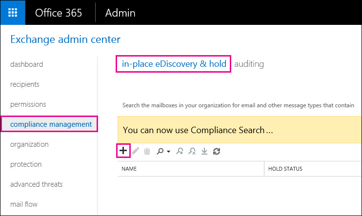
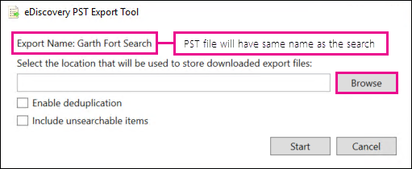
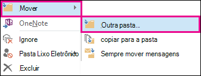

# Recuperar itens excluídos em uma caixa de correio de usuárioRecover deleted items in a user mailbox

**Este artigo é para administradores. Você está tentando recuperar itens excluídos em sua própria caixa de correio?****This article is for administrators. Are you trying to recover deleted items in your own mailbox?** Tente uma das seguintes opções:Try one of the following:
- [Recuperar itens excluídos no Outlook para WindowsRecover deleted items in Outlook for Windows](https://support.office.com/article/49e81f3c-c8f4-4426-a0b9-c0fd751d48ce)
- [Recuperar itens ou emails excluídos no Outlook Web AppRecover deleted items or email in Outlook Web App](https://support.office.com/article/c3d8fc15-eeef-4f1c-81df-e27964b7edd4)
- [Restaurar mensagens de email excluídas no Outlook na WebRestore deleted email messages in Outlook on the web](https://support.office.com/article/a8ca78ac-4721-4066-95dd-571842e9fb11)
- [Outlook.comOutlook.com](https://go.microsoft.com/fwlink/p/?LinkID=623435)
   
Um usuário excluiu permanentemente itens da caixa de correio do Outlook?Did a user permanently delete items from their Outlook mailbox? O usuário deseja refazê-los, mas não pode recuperá-los.The user wants them back but can't recover them. Você pode ser capaz de recuperar os itens removidos se eles não foram removidos permanentemente da caixa de correio do usuário.You may be able recover the purged items if they haven't been permanently removed from the user's mailbox. Para fazer isso, use a ferramenta de descoberta eletrônica in-loco no Exchange Online para pesquisar emails excluídos e outros itens, como contatos, compromissos de calendário e tarefas — na caixa de correio de um usuário.You do this by using the In-Place eDiscovery tool in Exchange Online to search for deleted email and other items—and such as contacts, calendar appointments, and tasks—in a user's mailbox. Se encontrar os itens excluídos, você poderá exportá-los para um arquivo PST (também chamado de arquivo de dados do Outlook), que o usuário pode usar para restaurar os itens de volta à caixa de correio.If you find the deleted items, you can export them to a PST file (also called an Outlook Data File), which the user can then use to restore the items back to their mailbox.
  
Aqui estão as etapas para recuperar itens excluídos na caixa de correio de um usuário.Here are the steps for recovering deleted items in a user's mailbox. Quanto tempo isso levará?How long will this take? A primeira vez pode levar 20 ou 30 minutos para concluir todas as etapas, dependendo de quantos itens você está tentando recuperar.The first time might take 20 or 30 minutes to complete all the steps, depending on how many items you're trying to recover.
  
> [!NOTE]
> Você precisa ser um **administrador do Exchange** ou um **Administrador Global** no Microsoft 365 ou ser membro do grupo de função gerenciamento da organização no Exchange Online para executar as etapas neste artigo.You have to be an **Exchange administrator** or **Global administrator** in Microsoft 365 or be a member of the Organization Management role group in Exchange Online to perform the steps in this article. Para obter mais informações, consulte [Sobre as funções de administrador do Microsoft 365](https://support.office.com/article/da585eea-f576-4f55-a1e0-87090b6aaa9d).For more information, see [About Microsoft 365 admin roles](https://support.office.com/article/da585eea-f576-4f55-a1e0-87090b6aaa9d). 
  
## Etapa 1: atribuir permissões de descoberta eletrônica por conta própriaStep 1: Assign yourself eDiscovery permissions

A primeira etapa é atribuir as permissões necessárias no Exchange Online para que você possa usar a ferramenta de descoberta eletrônica in-loco para pesquisar a caixa de correio de um usuário.The first step is to assign yourself the necessary permissions in Exchange Online so you can use the In-Place eDiscovery tool to search a user's mailbox. Isso só precisa ser feito uma vez.You only have to do this once. Se você precisar pesquisar outra caixa de correio no futuro, ignore esta etapa.If you have to search another mailbox in the future, you can skip this step.
  
1. [Onde entrar no Microsoft 365 for Business](https://support.microsoft.com/office/where-to-sign-into-microsoft-365-for-business-e9eb7d51-5430-4929-91ab-6157c5a050b4) com sua conta corporativa ou de estudante.[Where to sign in to Microsoft 365 for business](https://support.microsoft.com/office/where-to-sign-into-microsoft-365-for-business-e9eb7d51-5430-4929-91ab-6157c5a050b4) with your work or school account. 
    
2. Selecione o ícone do inicializador  no canto superior esquerdo e clique em **administrador**.Select the app launcher icon  in the upper-left and click **Admin**.
    
3. Na navegação à esquerda no centro de administração do Microsoft 365, expanda **centros de administração**e clique em **Exchange**.In the left navigation in the Microsoft 365 admin center, expand **Admin centers**, and then click **Exchange**.
    
    
  
4. No centro de administração do Exchange, clique em **permissões**e, em seguida, clique em **funções de administrador**.In the Exchange admin center, click **Permissions**, and then click **Admin roles**.
    
5. No modo de exibição de lista, selecione **Gerenciamento de descoberta**e clique em **Editar**  .In the list view, select **Discovery Management**, and then click **Edit**.
    
    
  
6. Em **grupo de função**, em **Membros**, clique em **Adicionar**  .In **Role Group**, under **Members**, click **Add**.
    
7. Em **selecionar Membros**, selecione-se na lista de nomes, clique em **Adicionar**e, em seguida, clique em **OK**.In **Select Members**, select yourself from the list of names, click **Add**, and then click **OK**.
    
    > [!NOTE]
    > Você também pode adicionar um grupo do qual você é membro, como gerenciamento da organização ou TenantAdmins.You can also add a group that you are a member of, such as Organization Management or TenantAdmins. Se você adicionar um grupo, as permissões necessárias para executar a ferramenta de descoberta eletrônica in-loco serão atribuídas a outros membros do grupo.If you add a group, other members of the group will be assigned the necessary permissions to run the In-Place eDiscovery tool. 
  
8. Em **grupo de funções**, clique em **salvar**.In **Role Group**, click **Save**.
    
9. Saia do Microsoft 365.Sign out of Microsoft 365.
    
    Você deve sair antes de iniciar a próxima etapa para que as novas permissões entrem em vigor.You have to sign out before you start the next step so the new permissions will take effect.
    
> [!CAUTION]
> Os membros do grupo de função gerenciamento de descoberta podem acessar o conteúdo de mensagens confidenciais.Members of the Discovery Management role group can access sensitive message content. Isso inclui pesquisar todas as caixas de correio em sua organização, Visualizar os resultados da pesquisa (e outros itens de caixa de correio), copiar os resultados para uma caixa de correio de descoberta e exportar os resultados da pesquisa para um arquivo PST.This includes searching all mailboxes in your organization, previewing the search results (and other mailbox items), copying the results to a discovery mailbox, and exporting the search results to a PST file. 
  
[Return to topReturn to top](recover-deleted-items-in-a-mailbox.md)
  
## Etapa 2: Pesquisar itens excluídos na caixa de correio do usuárioStep 2: Search the user's mailbox for deleted items

Quando você executa uma pesquisa de descoberta eletrônica in-loco, a pasta itens recuperáveis na caixa de correio que você pesquisa é automaticamente incluída na pesquisa.When you run an In-Place eDiscovery search, the Recoverable Items folder in the mailbox that you search is automatically included in the search. A pasta itens recuperáveis é onde os itens excluídos permanentemente são armazenados até serem limpos (permanentemente removidos) da caixa de correio.The Recoverable Items folder is where permanently deleted items are stored until they're purged (permanently removed) from the mailbox. Portanto, se um item não tiver sido removido, você deverá ser capaz de encontrá-lo usando a ferramenta de descoberta eletrônica in-loco.So, if an item hasn't been purged, you should be able to find it by using the In-Place eDiscovery tool.
  
1. [Onde entrar no Microsoft 365 for Business](https://support.microsoft.com/office/where-to-sign-into-microsoft-365-for-business-e9eb7d51-5430-4929-91ab-6157c5a050b4) com sua conta corporativa ou de estudante.[Where to sign in to Microsoft 365 for business](https://support.microsoft.com/office/where-to-sign-into-microsoft-365-for-business-e9eb7d51-5430-4929-91ab-6157c5a050b4) with your work or school account. 
    
2. Selecione o ícone do inicializador  no canto superior esquerdo e clique em **administrador**.Select the app launcher icon  in the upper-left and click **Admin**.
    
3. Na navegação à esquerda no centro de administração do Microsoft 365, expanda **administrador**e clique em **Exchange**.In the left navigation in the Microsoft 365 admin center, expand **Admin**, and then click **Exchange**.
    
4. No centro de administração do Exchange, clique em **Gerenciamento de conformidade**, clique **em &amp; bloqueio de descoberta eletrônica in-loco**e, em seguida, clique em **novo**  .In the Exchange admin center, click **Compliance management**, click **In-Place eDiscovery &amp; Hold**, and then click **New**.
    
    
  
5. Na página **nome e descrição** , digite um nome para a pesquisa (como o nome do usuário para o qual você está recuperando o email), uma descrição opcional e clique em **Avançar**.On the **Name and description** page, type a name for the search (such as the name of the user you're recovering email for), an optional description, and then click **Next**.
    
6. Na página **caixas de correio** , clique em **especificar caixas de correio a serem pesquisadas**e, em seguida, clique em **Adicionar**  .On the **Mailboxes** page, click **Specify mailboxes to search**, and then click **Add**.
    
    
  
7. Localize e selecione o nome do usuário para o qual você está recuperando o email excluído, clique em **Adicionar**e, em seguida, clique em **OK**.Find and select the name of the user that you're recovering the deleted email for, click **Add**, and then click **OK**.
    
8. Clique em **Avançar**.Click **Next**.
    
    A página de **consulta de pesquisa** é exibida.The **Search query** page is displayed. É aqui que você define os critérios de pesquisa que o ajudarão a encontrar os itens ausentes na caixa de correio do usuário.This is where you define the search criteria that will help you find the missing items in user's mailbox. 
    
9. Na página **Consulta de pesquisa**, preencha os seguintes campos:On the **Search query** page, complete the following fields: 
    
  - **Incluir todo o conteúdo** Selecione essa opção para incluir todo o conteúdo na caixa de correio do usuário nos resultados da pesquisa.**Include all content** Select this option to include all content in the user's mailbox in the search results. Se você selecionar essa opção, não poderá especificar critérios de pesquisa adicionais.If you select this option, you can't specify additional search criteria. 
    
  - **Filtro com base nos critérios** Selecione essa opção para especificar os critérios de pesquisa, incluindo palavras-chave, datas de início e término, endereços do remetente e do destinatário e tipos de mensagem.**Filter based on criteria** Select this option to specify the search criteria, including keywords, start and end dates, sender and recipient addresses, and message types. 
    
    
  
|**Field****Field**|**Use para...****Use this to...**|
|:-----|:-----|
|             |Especifique palavras-chave, intervalo de datas, destinatários e tipos de mensagens.Specify keywords, date range, recipients, and message types.    |
|             |Pesquise mensagens com palavras-chave ou frases e use operadores lógicos, como **e** ou **ou**.Search for messages with keywords or phrases, and use logical operators such as **AND** or **OR**.    |
|             |Pesquisar mensagens enviadas ou recebidas em um intervalo de datas.Search for messages sent or received within a date range.    |
|             |Pesquisar mensagens recebidas ou enviadas para pessoas específicas.Search for messages received from or sent to specific people.    |
|             |Procure todos os tipos de mensagem ou selecione os específicos.Search for all message types or select specific ones.    |
   
   > [!TIP]
   >  Veja algumas dicas sobre como criar uma consulta de pesquisa para localizar itens ausentes.Here are a few tips about how to build a search query to find missing items. Tente obter o máximo de informações do usuário para ajudá-lo a criar uma consulta de pesquisa para que você possa encontrar o que está procurando.Try to get as much information from the user to help you create a search query so you can find what you're looking for. Se você não tiver certeza de como localizar uma mensagem ausente, considere o uso da opção **incluir todo o conteúdo** .If you are not sure how to find a missing message, consider using the **Include all content** option. Os resultados da pesquisa incluirão todos os itens na pasta itens recuperáveis do usuário, incluindo a pasta oculta (chamada de pasta limpezas) que contêm itens que foram removidos pelo usuário.The search results will include all items in the user's Recoverable Items folder, including the hidden folder (called the Purges folder) that contain items that have been purged by the user. Em seguida, você pode ir para a etapa 3, copiar os resultados para uma caixa de correio de descoberta e examinar a mensagem na pasta oculta.Then you can go to Step 3, copy the results to a discovery mailbox, and look at the message in the hidden folder. Se você souber aproximadamente quando a mensagem ausente foi originalmente enviada ou recebida pelo usuário, use as opções **especificar data de início** e **especificar data de término** para fornecer um intervalo de datas.If you know approximately when the missing message was originally sent or received by the user, use the **Specify start date** and **Specify end date** options to provide a date range. Isso retornará todas as mensagens enviadas ou recebidas pelo usuário dentro desse intervalo de datas.This will return all messages sent or received by the user within that date range. A especificação de um intervalo de datas é uma ótima maneira de restringir os resultados da pesquisa.Specifying a date range is a really good way to narrow the search results. Se você souber quem enviou o email ausente, use a caixa **de** para especificar esse remetente.If you know who sent the missing email, use the **From** box to specify this sender. Se você deseja restringir os resultados da pesquisa para diferentes tipos de itens de caixa de correio, clique em **Selecionar tipos de mensagem**, clique em **selecionar os tipos de mensagem para pesquisa**e escolha um tipo de mensagem específico a ser pesquisado.If you want to narrow the search results to different types of mailbox items, click **Select message types**, click **Select the message types to search**, and then choose a specific message type to search for. Por exemplo, você pode pesquisar apenas itens de calendário ou contatos.For example, you can search only for calendar items or contacts. Aqui está uma captura de tela dos diferentes tipos de mensagens que você pode pesquisar; o padrão é Pesquisar todos os tipos de mensagem.Here's a screenshot of the different message types you can search for; the default is to search for all message types. 
  
   Clique em **Avançar** quando você tiver concluído a página de **consulta de pesquisa** .Click **Next** when you've completed the **Search query** page. 
    
10. Na página **configurações de bloqueio in-loco** , clique em **concluir** para iniciar a pesquisa.On the **In-Place Hold settings** page, click **Finish** to start the search. Para recuperar emails excluídos, não há motivo para colocar a caixa de correio do usuário em espera.To recover deleted email, there's no reason to place the user's mailbox on hold. 
    
    Depois que você iniciar a pesquisa, o Exchange exibirá uma estimativa do tamanho total e do número de itens que será retornado pela pesquisa com base nos critérios que você especificou.After you start the search, Exchange will display an estimate of the total size and number of items that will be returned by the search based on the criteria you specified.
    
11. Selecione a pesquisa que você acabou de criar e clique em **Atualizar**  para atualizar as informações exibidas no painel de detalhes.Select the search you just created and click **Refresh** to update the information displayed in the details pane. O status da **estimativa com êxito** indica que a pesquisa foi concluída.The status of **Estimate Succeeded** indicates that the search has finished. O Exchange também exibe uma estimativa do número total de itens (e seu tamanho) encontrado pela pesquisa com base nos critérios de pesquisa que você especificou na etapa 9.Exchange also displays an estimate of the total number of items (and their size) found by the search based on the search criteria you specified in step 9. 
    
12. No painel de detalhes, clique em **Visualizar resultados da pesquisa** para exibir os itens que foram encontrados.In the details pane, click **Preview search results** to view the items that were found. Isso pode ajudar a identificar o (s) item (ns) que você está procurando.This might help you identify the item(s) that you're looking for. Se encontrar o (s) item (ns) que você está tentando recuperar, vá para a etapa 4 para exportar os resultados da pesquisa para um arquivo PST.If you find the item(s) you're trying to recover, go to step 4 to export the search results to a PST file. 
    
    
  
13. Se não encontrar o que você está procurando, você poderá revisar seus critérios de pesquisa selecionando a pesquisa, clicando em **Editar**  e, em seguida, clicando em **consulta de pesquisa**.If you don't find what you're looking for, you can revise your search criteria by selecting the search, clicking **Edit**, and then clicking **Search query**. Altere o critério de pesquisa e execute a pesquisa novamente.Change the search criteria and then rerun the search.
    
[Return to topReturn to top](recover-deleted-items-in-a-mailbox.md)
  
## Opcion Etapa 3: copiar os resultados da pesquisa para uma caixa de correio de descoberta(Optional) Step 3: Copy the search results to a discovery mailbox

Se não for possível localizar itens visualizando os resultados da pesquisa ou se quiser ver quais itens estão na pasta itens recuperáveis do usuário, você pode copiar os resultados da pesquisa para uma caixa de correio especial (chamada de caixa de correio de descoberta) e abrir essa caixa de correio no Outlook na Web para exibir os itens reais.If you can't find an items by previewing the search results or if you want to see which items are in the user's Recoverable Items folder, then you can copy the search results to a special mailbox (called a discovery mailbox) and then open that mailbox in Outlook on the web to view the actual items. O melhor motivo para copiar os resultados da pesquisa é que você possa exibir os itens na pasta itens recuperáveis do usuário.The best reason to copy the search results is so you can view the items in the user's Recoverable Items folder. Mais do que provavelmente, o item que você está tentando recuperar está localizado na subpasta limpezas.More than likely, the item you're trying to recover is located in the Purges subfolder. 
  
1. No centro de administração do Exchange, vá para **Gerenciamento de conformidade** e \> **descoberta &amp; eletrônica in-loco**.In the Exchange admin center, go to **Compliance management** \> **In-Place eDiscovery &amp; Hold**.
    
2. Na lista de pesquisas, selecione a pesquisa que você criou na etapa 2.In the list of searches, select the search that you created in Step 2.
    
3. Clique **Search**em  de pesquisa e, em seguida, clique em **copiar resultados da pesquisa** na lista suspensa.Click **Search**, and then click **Copy search results** from the drop-down list. 
    
    
  
4. Na página **copiar resultados da pesquisa** , clique em **procurar**.On the **Copy Search Results** page, click **Browse**.
    
    
  
5. Em **nome para exibição**, clique em **caixa de correio de pesquisa de descoberta**e, em seguida, clique em **OK**.Under **Display Name**, click **Discovery Search Mailbox**, and then click **OK**.
    
    
  
    > [!NOTE]
    > A caixa de correio de pesquisa de descoberta é uma caixa de correio de descoberta padrão criada automaticamente na sua organização do Microsoft 365.The Discovery Search Mailbox is a default discovery mailbox that is automatically created in your Microsoft 365 organization. 
  
6. De volta à página **copiar resultados da pesquisa** , clique em **copiar** para iniciar o processo para copiar os resultados da pesquisa para a caixa de correio de pesquisa de descoberta.Back on the **Copy Search Results** page, click **Copy** to start the process to copy the search results to the Discovery Search Mailbox. 
    
    
  
7. Clique em **Atualizar**  para atualizar as informações sobre o status de cópia exibido no painel de detalhes.Click **Refresh** to update the information about the copying status that is displayed in the details pane. 
    
8. Quando a cópia estiver concluída, clique em **abrir** para abrir a caixa de correio de pesquisa de descoberta para exibir os resultados da pesquisa.When the copying is complete, click **Open** to open the Discovery Search Mailbox to view the search results. 
    
    
  
    Os resultados da pesquisa copiados para a caixa de correio de pesquisa de descoberta são colocados em uma pasta com o mesmo nome da pesquisa de descoberta eletrônica in-loco.The search results copied to the Discovery Search Mailbox are placed in a folder that has the same name as the In-Place eDiscovery search. Você pode clicar em uma pasta para exibir os itens dessa pasta.You can click a folder to display the items in that folder.
    
    
  
    Quando você executa uma pesquisa, a pasta itens recuperáveis do usuário também é pesquisada.When you run a search, the user's Recoverable Items folder is also searched. Isso significa que se os itens na pasta itens recuperáveis atenderem aos critérios de pesquisa, eles serão incluídos nos resultados da pesquisa.That means if items in the Recoverable Items folder meet the search criteria, they are included in the search results. Itens na pasta exclusões são itens que o usuário excluiu permanentemente (excluindo um item da pasta itens excluídos ou selecionando-o e pressionando **Shift + Delete**.Items in the Deletions folder are items that the user permanently deleted (by deleting an item from the Deleted Items folder or by selecting it and pressing **Shift+Delete**. Um usuário pode usar a ferramenta recuperar itens excluídos no Outlook ou no Outlook na Web para recuperar itens na pasta exclusões.A user can use the Recover Deleted Items tool in Outlook or Outlook on the web to recover items in the Deletions folder. Itens na pasta expurgações são itens que o usuário limpou usando a ferramenta recuperar itens excluídos ou itens que eles foram automaticamente limpos por uma política aplicada à caixa de correio.Items in the Purges folder are items that the user purged by using the Recover Deleted Items tool or items they were automatically purged by a policy applied to the mailbox. Em ambos os casos, somente um administrador pode recuperar itens na pasta expurgações.In either case, only an admin can recover items in the Purges folder. 
    
    > [!TIP]
    > Se um usuário não conseguir localizar um item excluído usando a ferramenta itens recuperáveis, mas esse item ainda for recuperável (o que significa que ele não foi removido permanentemente da caixa de correio), é mais do que provavelmente localizado na pasta limpezas.If a user can't find a deleted item using the Recoverable Items tool, but that item is still recoverable (meaning that it hasn't been permanently removed from the mailbox), it's more than likely located in the Purges folder. Portanto, certifique-se de examinar a pasta limpezas do item excluído que você está tentando recuperar para um usuário.So, be sure to look in the Purges folder for the deleted item you're trying to recover for a user. 
  
[Return to topReturn to top](recover-deleted-items-in-a-mailbox.md)
  
## Etapa 4: exportar os resultados da pesquisa para um arquivo PSTStep 4: Export the search results to a PST file

Após localizar o item que você está tentando recuperar para um usuário, a próxima etapa é exportar os resultados da pesquisa executada na etapa 2 para um arquivo PST.After you find the item you're trying to recover for a user, the next step is to export the results from the search you ran in Step 2 to a PST file. O usuário usará esse arquivo PST na próxima etapa para restaurar o item excluído à caixa de correio.The user will use this PST file in the next step to restore the deleted item to their mailbox.
  
1. No centro de administração do Exchange, vá para **Gerenciamento de conformidade** e \> **descoberta &amp; eletrônica in-loco**.In the Exchange admin center, go to **Compliance management** \> **In-Place eDiscovery &amp; Hold**.
    
2. Na lista de pesquisas, selecione a pesquisa que você criou na etapa 2.In the list of searches, select the search that you created in Step 2.
    
3. Clique em **exportar para um arquivo PST**.Click **Export to a PST file**.
    
    
  
4. Se você for solicitado a instalar a ferramenta de exportação de descoberta eletrônica, clique em **executar**.If you're prompted to install the eDiscovery Export Tool, click **Run**.
    
5. Na ferramenta de exportação de PST de descoberta eletrônica, clique em **procurar** para especificar o local onde você deseja baixar o arquivo PST.In the eDiscovery PST Export Tool, click **Browse** to specify the location where you want to download the PST file. 
    
    
  
    Você pode ignorar as opções para habilitar a eliminação de duplicação e incluir itens não pesquisáveis.You can ignore the options to enable deduplication and include unsearchable items.
    
6. Clique em **Iniciar** para baixar o arquivo pst em seu computador.Click **Start** to download the PST file to your computer. 
    
    A **ferramenta de exportação de PST de descoberta eletrônica** exibe informações de status sobre o processo de exportação.The **eDiscovery PST Export Tool** displays status information about the export process. Quando a exportação estiver concluída, você poderá acessar o arquivo no local onde foi baixado.When the export is complete, you can access the file in the location where it was downloaded. 
    
[Return to topReturn to top](recover-deleted-items-in-a-mailbox.md)
  
## Etapa 5: restaurar os itens recuperados para a caixa de correio do usuárioStep 5: Restore the recovered items to the user's mailbox

A etapa final é usar o arquivo PST que foi exportado na etapa 4 para restaurar os itens recuperados para a caixa de correio do usuário.The final step is to use the PST file that was exported in step 4 to restore the recovered items to the user's mailbox. Depois de enviar o arquivo PST ao usuário, o restante desta etapa é executado pelo usuário para abrir o arquivo PST e, em seguida, mover os itens recuperados para outra pasta na caixa de correio.After you send the PST file to the user, the remainder of this step is performed by the user to open the PST file and then move the recovered items to another folder in their mailbox. Para obter instruções passo a passo, você também pode enviar ao usuário um link para este tópico: [abrir e fechar arquivos de dados do Outlook (. pst)](https://support.office.com/article/381b776d-7511-45a0-953a-0935c79d24f2).For step-by-step instructions, you can also send the user a link to this topic: [Open and close Outlook Data Files (.pst)](https://support.office.com/article/381b776d-7511-45a0-953a-0935c79d24f2). Ou você pode enviar ao usuário um link para a seção [restaurar itens excluídos para uma caixa de correio usando um arquivo PST](recover-deleted-items-in-a-mailbox.md#restoredeleteditems) abaixo e pedir que eles executem essas etapas.Or you can send the user a link to the [Restore deleted items to a mailbox using a PST file](recover-deleted-items-in-a-mailbox.md#restoredeleteditems) section below and ask them to perform these steps. 
  
 **Enviar o arquivo PST ao usuário****Send the PST file to the user**
  
A etapa final que você precisa realizar é enviar o arquivo PST que foi exportado na etapa 4 para o usuário.The final step that you need to perform is sending the PST file that was exported in step 4 to the user. Há algumas maneiras de fazer isso:There are a few ways to do this:
  
- Anexe o arquivo PST a uma mensagem de email.Attach the PST file to an email message. Se o Outlook estiver configurado para bloquear arquivos PST, você terá que compactar o arquivo e anexá-lo à mensagem.If Outlook is configured to block PST files, then you will have to zip the file and then attach it to the message. Veja como:Here's how:
    
1. No Windows Explorer ou no explorador de arquivos, navegue até o arquivo PST.In Windows Explorer or File Explorer, browse to the PST file.
    
2. Clique com o botão direito do mouse no arquivo e selecione **Enviar para** \> **pasta compactada (zipada)**.Right-click the file, and then select **Send to** \> **Compressed (zipped) folder**. O Windows cria um novo arquivo zip e fornece um nome idêntico ao arquivo PST.Windows creates a new zip file and gives it an identical name as the PST file.
    
3. Anexe o arquivo PST compactado a uma mensagem de email e envie-o ao usuário, que pode descompactar o arquivo simplesmente clicando nele.Attach the compressed PST file to an email message and send it to the user, who can then decompress the file just by clicking it.
    
- Copie o arquivo PST para uma pasta compartilhada que o usuário possa acessar e recuperá-lo.Copy the PST file to a shared folder that the user can access and retrieve it.
    
As etapas da próxima seção são executadas pelo usuário para restaurar os itens excluídos para a caixa de correio.The steps in the next section are performed by the user to restore the deleted items to their mailbox.
  
 
**Restaurar itens excluídos para uma caixa de correio usando um arquivo PST****Restore deleted items to a mailbox using a PST file**
  
Você precisa usar o aplicativo da área de trabalho do Outlook para restaurar um item excluído usando um arquivo PST.You have to use the Outlook desktop app to restore a deleted item by using a PST file. Você não pode usar o Outlook Web App ou o Outlook na Web para abrir um arquivo PST.You can't use Outlook Web App or Outlook on the web to open a PST file.
  
1. No Outlook 2013 ou no Outlook 2016, clique na guia **arquivo** .In Outlook 2013 or Outlook 2016, click the **File** tab. 
    
2. Clique em **abrir &amp; exportação**e, em seguida, clique em **Abrir arquivo de dados do Outlook**.Click **Open &amp; Export**, and then click **Open Outlook Data File**.
    
3. Navegue até o local onde você salvou o arquivo PST enviado pelo administrador.Browse to the location where you saved the PST file that your administrator sent.
    
4. Selecione o PST e clique em **abrir**.Select the PST and then click **Open**.
    
    O arquivo PST aparece na barra de navegação à esquerda no Outlook.The PST file appears in the left-nav bar in Outlook.
    
    
  
5. Clique nas setas para expandir o arquivo PST e as pastas abaixo dele para localizar o item que você deseja recuperar.Click the arrows to expand the PST file and the folders under it to locate the item you want to recover.
    
    
  
    > [!TIP]
    > Procure na pasta limpezas do item que você deseja recuperar.Look in the Purges folder for the item you want to recover. Esta é uma pasta oculta à qual os itens excluídos são movidos.This is a hidden folder that purged items are moved to. É provável que o item que o administrador tenha recuperado esteja nessa pasta.It's likely the item that your administrator recovered is in this folder. 
  
6. Clique com o botão direito do mouse no item que você deseja recuperar e clique em **mover** \> **outra pasta**.Right-click the item you want to recover and then click **Move** \> **Other Folder**.
    
    
  
7. Para mover o item para a caixa de entrada, clique em **caixa de entrada**e, em seguida, clique em **OK**.To move the item to your inbox, click **Inbox**, and then click **OK**.
    
    **Dica:** Para recuperar outros tipos de itens, siga um destes procedimentos:**Tip:** To recover other types of items, do one of the following: 
    
  - Para recuperar um item de calendário, clique nele com o botão direito do mouse e, em seguida, clique em **mover** \> **outro** \> **calendário**de pasta.To recover a calendar item, right-click it, and then click **Move** \> **Other Folder** \> **Calendar**.
    
  - Para recuperar um contato, clique nele com o botão direito do mouse e, em seguida, clique em **mover** \> **outros** \> **contatos**da pasta.To recover a contact, right-click it, and then click **Move** \> **Other Folder** \> **Contacts**.
    
  - Para recuperar uma tarefa, clique com o botão direito do mouse e clique em **mover** \> **outras** \> **tarefas**da pasta.To recover a task, right-click it, and then click **Move** \> **Other Folder** \> **Tasks**.
    

  
   > [!NOTE]
   > Itens de calendário, contatos e tarefas estão localizados diretamente na pasta limpezas e não em uma subpasta Calendário, contatos ou tarefas.Calendar items, contacts, and tasks are located directly in the Purges folder, and not in a Calendar, Contacts, or Tasks subfolder. No entanto, você pode classificar por **tipo** para agrupar tipos semelhantes de itens.However, you can sort by **Type** to group similar types of items. 
    
8. Quando tiver terminado a recuperação de itens excluídos, clique com o botão direito do mouse no arquivo PST na barra de navegação à esquerda e selecione **fechar "nome do arquivo pst"**.When you're finished recovering deleted items, right-click the PST file in the left-nav bar and select **Close "name of PST file"**.
    
[Return to topReturn to top](recover-deleted-items-in-a-mailbox.md)
  
## Mais informaçõesMore information

- Pode ser possível para um usuário recuperar um item permanentemente excluído se o período de retenção do item excluído para o item não tiver expirado.It might be possible for a user to recover a permanently deleted item if the deleted item retention period for the item hasn't expired. Como administrador, você pode ter especificado por quanto tempo os itens na pasta itens recuperáveis estão disponíveis para recuperação.As an admin you may have specified how long items in the Recoverable Items folder are available for recovery. Por exemplo, pode haver uma política que exclua tudo o que está na pasta itens excluídos de um usuário por 30 dias e outra política que permite aos usuários recuperar itens na pasta itens recuperáveis por até mais 14 dias.For example, there might be a policy that deletes anything that's been in a user's Deleted Items folder for 30 days, and another policy that lets users recover items in the Recoverable Items folder for up to another 14 days. No entanto, depois de 14 dias, você ainda poderá recuperar um item na caixa de correio de um usuário usando os procedimentos deste tópico.However, after this 14 days, you may still be able to recover an item in a user's mailbox by using the procedures in this topic.
    
- Os usuários podem recuperar um item excluído se ele não tiver sido eliminado e se seu período de retenção não estiver expirado.Users can recover a deleted item if it hasn't been purged and if the deleted item retention period for that item hasn't expired. Para ajudar os usuários a recuperar itens excluídos em suas caixas de correio, aponte-os para um dos seguintes tópicos:To help users recover deleted items in their mailbox, point them to one of the following topics:
    
  - [Recuperar itens excluídos no Outlook para WindowsRecover deleted items in Outlook for Windows](https://support.office.com/article/49e81f3c-c8f4-4426-a0b9-c0fd751d48ce)
    
  - [Recuperar itens excluídos no Outlook 2010Recover deleted items in Outlook 2010](https://support.office.com/article/cd9dfe12-8e8c-4a21-bbbf-4bd103a3f1fe)
    
  - [Recuperar itens ou emails excluídos no Outlook Web AppRecover deleted items or email in Outlook Web App](https://support.office.com/article/c3d8fc15-eeef-4f1c-81df-e27964b7edd4)
    
  - [Restaurar mensagens de email excluídas no Outlook na WebRestore deleted email messages in Outlook on the web](https://support.office.com/article/a8ca78ac-4721-4066-95dd-571842e9fb11)
    
  - [Recuperar um contato excluído no OutlookRecover a deleted contact in Outlook](https://support.office.com/article/51c83288-6888-4dcd-8c99-4932daabf643)
    
  - [Restaurar mensagens de email excluídas no Outlook.comRestore deleted email messages in Outlook.com](https://go.microsoft.com/fwlink/p/?LinkID=623435)
    
[Return to topReturn to top](recover-deleted-items-in-a-mailbox.md)
  

