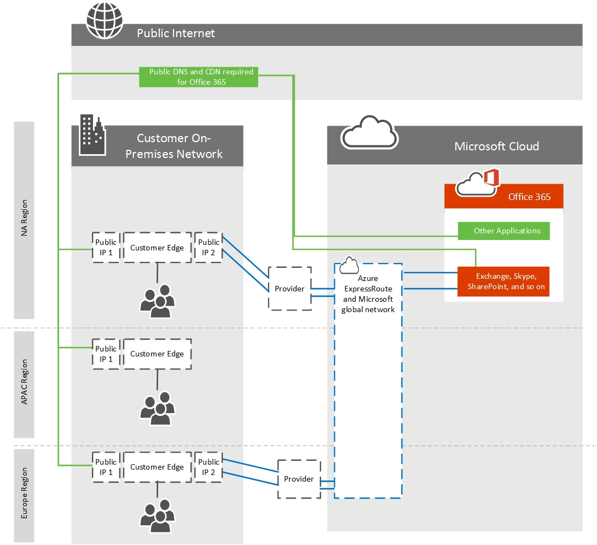

# Como rotear com o ExpressRoute para Office 365

*Este artigo se aplica tanto ao Microsoft 365 Enterprise quanto ao Office 365 Enterprise.*

Para entender corretamente o tráfego de roteamento para o Office 365 usando o Azure ExpressRoute, você precisará de uma compreensão firme dos principais requisitos de roteamento [expressRoute](/azure/expressroute/expressroute-routing) e dos circuitos [ExpressRoute](/azure/expressroute/expressroute-circuit-peerings)e domínios de roteamento. Eles estabelecem os fundamentos para o uso do ExpressRoute em que os clientes do Office 365 dependerão.
  
Alguns dos principais itens nos artigos acima que você precisará entender incluem:
  
- Os circuitos ExpressRoute não são mapeados para infraestrutura física específica, mas são uma conexão lógica feita em um único local de peering pela Microsoft e um provedor de paring em seu nome.

- Há um mapeamento 1:1 entre um circuito ExpressRoute e uma chave do cliente.

- Cada circuito pode dar suporte a duas relações de paração independentes (o Azure Private peering e o paring da Microsoft); O Office 365 requer o peering da Microsoft.

- Cada circuito tem uma largura de banda fixa que é compartilhada em todas as relações de paridade.

- Quaisquer endereços IPv4 públicos e números as públicos que serão usados para o circuito ExpressRoute devem ser validados como pertencentes a você ou atribuídos exclusivamente ao proprietário do intervalo de endereços.

- Os circuitos expressRoute virtuais são redundantes globalmente e seguirão as práticas padrão de roteamento BGP. É por isso que recomendamos dois circuitos físicos por saída para seu provedor em uma configuração ativa/ativa.

Consulte a [página perguntas frequentes para](/azure/expressroute/expressroute-faqs) obter mais informações sobre serviços com suporte, custos e detalhes de configuração. Consulte o [artigo Locais do ExpressRoute para](/azure/expressroute/expressroute-locations) obter informações sobre a lista de provedores de conectividade que oferecem suporte ao par da Microsoft. Também gravamos uma série de treinamento do [Azure ExpressRoute](https://channel9.msdn.com/series/aer) de 10 partes para o Office 365 no Canal 9 para ajudar a explicar melhor os conceitos.
  
## Garantindo a simetria de rota

Os servidores front-end do Office 365 estão acessíveis na Internet e no ExpressRoute. Esses servidores preferirão roteá-los de volta para circuitos locais em vez de circuitos ExpressRoute quando ambos estão disponíveis. Por isso, há a possibilidade de rotear a assimetria se o tráfego de sua rede preferir rotear por seus circuitos da Internet. Rotas assimétricas são um problema porque dispositivos que executam inspeção de pacotes de estado podem bloquear o tráfego de retorno que segue um caminho diferente dos pacotes de saída seguidos.
  
Independentemente de você iniciar uma conexão com o Office 365 pela Internet ou ExpressRoute, a origem deve ser um endereço publicamente instável. Com muitos clientes olhando diretamente para a Microsoft, ter endereços particulares onde a duplicação é possível entre clientes não é viável.
  
A seguir estão os cenários em que as comunicações do Office 365 para sua rede local serão iniciadas. Para simplificar seu design de rede, recomendamos roteá-los pelo caminho da Internet.
  
- Serviços SMTP, como emails de um locatário do Exchange Online para um host local ou Email do SharePoint Online enviado do SharePoint Online para um host local. O protocolo SMTP é usado mais amplamente na rede da Microsoft do que os prefixos de rota compartilhados nos circuitos ExpressRoute e os servidores SMTP locais de publicidade via ExpressRoute causarão falhas com esses outros serviços.

- ADFS durante a validação de senha para entrar.

- [Exchange Server implantações híbridas.](/exchange/exchange-hybrid)

- [Pesquisa híbrida federada do SharePoint](/SharePoint/hybrid/display-hybrid-federated-search-results-in-sharepoint-online).

- [BCS híbrido do SharePoint](/SharePoint/hybrid/deploy-a-business-connectivity-services-hybrid-solution).

- [Federação híbrida](/skypeforbusiness/hybrid/plan-hybrid-connectivity?bc=%2fSkypeForBusiness%2fbreadcrumb%2ftoc.json&toc=%2fSkypeForBusiness%2ftoc.json) do Skype for Business e/ou [Skype for Business.](/office365/servicedescriptions/skype-for-business-online-service-description/skype-for-business-online-features)

- [Skype for Business Cloud Connector](/skypeforbusiness/skype-for-business-hybrid-solutions/plan-your-phone-system-cloud-pbx-solution/plan-skype-for-business-cloud-connector-edition).

Para que a Microsoft volte para sua rede para esses fluxos de tráfego bi-direcional, as rotas BGP para seus dispositivos locais devem ser compartilhadas com a Microsoft. Ao anunciar prefixos de rota para a Microsoft via ExpressRoute, siga estas práticas recomendadas:

1) Não anuncione o mesmo prefixo de rota de endereço IP público para a Internet pública e por meio do ExpressRoute. É recomendável que os anúncios de Prefixo de Rota de IP BGP para a Microsoft sobre ExpressRoute sejam de um intervalo que não é anunciado para a Internet. Se isso não for possível de alcançar devido ao espaço de Endereço IP disponível, é essencial garantir que você anuncia um intervalo mais específico no ExpressRoute do que qualquer circuito da Internet.

2) Use pools IP NAT separados por circuito ExpressRoute e separados aos circuitos da Internet.

3) Esteja ciente de que qualquer rota anunciada para a Microsoft atrairá o tráfego de rede de qualquer servidor na rede da Microsoft, não apenas aqueles para os quais as rotas são anunciadas para sua rede por via ExpressRoute. Somente anunciar rotas para servidores em que os cenários de roteamento são definidos e bem compreendidos pela sua equipe. Anuncione prefixos de rota de endereço IP separados em cada um dos vários circuitos ExpressRoute de sua rede.
  
## Decidir quais aplicativos e recursos são roteado pelo ExpressRoute

Ao configurar uma relação de paridade usando o domínio de roteamento de peering da Microsoft e for aprovado para o acesso apropriado, você poderá ver todos os serviços PaaS e SaaS disponíveis no ExpressRoute. Os serviços do Office 365 projetados para ExpressRoute podem ser gerenciados com comunidades [BGP](./bgp-communities-in-expressroute.md) ou [filtros de rota.](/azure/expressroute/how-to-routefilter-portal)
  
Outros aplicativos, como o Vídeo do Office 365, são um aplicativo do Office 365; no entanto, o Vídeo do Office 365 é composto por três componentes diferentes, o portal, o serviço de streaming e a rede de entrega de conteúdo. O portal mora no SharePoint Online, o serviço de streaming reside nos Serviços de Mídia do Azure e a rede de entrega de conteúdo está dentro da CDN do Azure. A tabela a seguir descreve esses componentes.

|**Componente**|**Aplicativo subjacente**|**Incluído na Comunidade BGP do SharePoint Online?**|**Usar**|
|:-----|:-----|:-----|:-----|
|Portal de vídeo do Office 365    |SharePoint Online    |Sim    |Configuração, upload    |
|Serviço de streaming de vídeo do Office 365    |Serviços de Mídia do Azure    |Não    |Serviço de streaming, usado no caso de o vídeo não estar disponível na CDN    |
|Rede de entrega de conteúdo de vídeo do Office 365    |Azure CDN    |Não    |Principal fonte de download/streaming de vídeo. [Saiba mais sobre a rede de vídeo do Office 365.](https://support.office.com/article/Office-365-Video-networking-Frequently-Asked-Questions-FAQ-2bed67a1-4052-49ff-a4ce-b7e6530eb98e)    |

Cada um dos recursos do Office 365 que estão disponíveis usando o peering da Microsoft estão listados no artigo pontos de extremidade do [Office 365](https://support.office.com/article/Office-365-URLs-and-IP-address-ranges-8548a211-3fe7-47cb-abb1-355ea5aa88a2) por tipo de aplicativo e FQDN. O motivo para usar o FQDN nas tabelas é permitir que os clientes gerenciem o tráfego usando arquivos PAC ou outras configurações de proxy, consulte nosso guia para gerenciar pontos de extremidade do [Office 365,](./managing-office-365-endpoints.md) por exemplo, arquivos PAC.
  
Em algumas situações, utilizamos um domínio curinga em que um ou mais sub-FQDNs são anunciados de forma diferente do domínio curinga de nível superior. Isso geralmente acontece quando o curinga representa uma longa lista de servidores que são todos anunciados para o ExpressRoute e a Internet, enquanto um pequeno subconjunto de destinos é anunciado apenas para a Internet ou o inverso. Consulte as tabelas abaixo para entender onde estão as diferenças.
  
Esta tabela exibe os FQDNs curinga anunciados para a Internet e o Azure ExpressRoute juntamente com os sub-FQDNs anunciados somente para a Internet.

|**Domínio curinga anunciado para circuitos ExpressRoute e Internet**|**Sub-FQDN anunciado somente em circuitos da Internet**|
|:-----|:-----|
|\*.microsoftonline.com    |click.email.microsoftonline.com    portal.microsoftonline.com    provisioningapi.microsoftonline.com    adminwebservice.microsoftonline.com    |
|\*.officeapps.live.com    |nexusRules.officeapps.live.com    nexus.officeapps.live.com    odc.officeapps.live.com    odc.officeapps.live.com    cdn.odc.officeapps.live.com    ols.officeapps.live.com    ocsredir.officeapps.live.com    ocws.officeapps.live.com    ocsa.officeapps.live.com    |

Normalmente, os arquivos PAC destinam-se a enviar solicitações de rede para pontos de extremidade anunciados do ExpressRoute diretamente para o circuito e todas as outras solicitações de rede para seu proxy. Se você estiver configurando um arquivo PAC como este, recomponha seu arquivo PAC na seguinte ordem:
  
1. Inclua os sub-FQDNs da coluna dois na tabela acima na parte superior do arquivo PAC, enviando o tráfego para seu proxy. Construímos um arquivo PAC de exemplo para você usar em nosso artigo sobre como gerenciar pontos de extremidade do [Office 365.](./managing-expressroute-for-connectivity.md)

2. Inclua todos os FQDNs marcados  anunciados para ExpressRoute neste artigo abaixo da primeira seção, enviando o tráfego diretamente para o seu circuito expressRoute.

3. Inclua quaisquer outros pontos de extremidade de rede ou regras abaixo dessas duas entradas, enviando o tráfego em direção ao proxy.

Esta tabela exibe os domínios curinga que são anunciados em circuitos da Internet apenas juntamente com os sub-FQDNs anunciados para circuitos do Azure ExpressRoute e internet. Para o arquivo PAC acima, os FQDNs na coluna 2 da tabela abaixo são listados como sendo anunciados para ExpressRoute no link referenciado, o que significa que eles seriam incluídos no segundo grupo de entradas no arquivo.

|**Domínio curinga anunciado somente em circuitos da Internet**|**Sub-FQDN anunciado para circuitos ExpressRoute e Internet**|
|:-----|:-----|
|\*.office.com    |\*.outlook.office.com    home.office.com    outlook.office.com    portal.office.com    
www.office.com
    |
|\*.office.net    |agent.office.net    |
|\*.office365.com    |outlook.office365.com    smtp.office365.com    |
|\*.outlook.com    |\*.protection.outlook.com    \*.mail.protection.outlook.com    descoberta automática- \<tenant\> .outlook.com    |
|\*.windows.net    |login.windows.net    |

## Roteamento do tráfego do Office 365 pela Internet e ExpressRoute

Para rotear para o aplicativo do Office 365 de sua escolha, você precisará determinar vários fatores-chave.
  
1. Quanta largura de banda o aplicativo exigirá. A amostragem do uso existente é o único método confiável para determinar isso em sua organização.

2. De que locais de saída você deseja que o tráfego de rede deixe sua rede. Você deve planejar minimizar a latência de rede para conectividade com o Office 365, pois isso afetará o desempenho. Como o Skype for Business usa voz e vídeo em tempo real, ele é particularmente suscetível à latência de rede ruim.

3. Se você quiser que todos ou um subconjunto de seus locais de rede usem ExpressRoute.

4. De onde o provedor de rede escolhido oferece o ExpressRoute.

Depois de determinar as respostas a essas perguntas, você pode provisionar um circuito ExpressRoute que atenda às necessidades de largura de banda e local. Para obter mais assistência de planejamento de rede, consulte o guia de ajuste de rede do [Office 365](./network-planning-and-performance.md) e o estudo de caso sobre como a Microsoft lida com o planejamento [de desempenho de rede.](https://aka.ms/tunemsit)
  
### Exemplo 1: Localização geográfica única
  
Este exemplo é um cenário para uma empresa fictícia chamada Trey Research que tem uma única localização geográfica.
  
Os funcionários da Trey Research só têm permissão para se conectar aos serviços e sites na Internet que o departamento de segurança explicitamente permite no par de proxies de saída que ficam entre a rede corporativa e seu ISP.
  
Trey Research planeja usar o Azure ExpressRoute para o Office 365 e reconhece que alguns tráfegos, como o tráfego destinado a redes de entrega de conteúdo, não poderão rotear pela conexão ExpressRoute para Office 365. Como todo o tráfego já se encaminha para os dispositivos proxy por padrão, essas solicitações continuarão a funcionar como antes. Depois que Trey Research determinar que eles podem atender aos requisitos de roteamento do Azure ExpressRoute, eles continuarão a criar um circuito, configurar o roteamento e vincular o novo circuito ExpressRoute a uma rede virtual. Depois [que a](./managing-office-365-endpoints.md)  configuração básica do Azure ExpressRoute está em uso, a Trey Research usa o arquivo PAC #2 que publicamos para rotear o tráfego com dados específicos do cliente por meio do ExpressRoute direto para conexões do Office 365.
  
Conforme mostrado no diagrama a seguir, Trey Research é capaz de atender ao requisito de rotear o tráfego do Office 365 pela Internet e um subconjunto de tráfego no ExpressRoute usando uma combinação de alterações de configuração de proxy de roteamento e saída.
  
1. Usando o [#2 pac que](./managing-office-365-endpoints.md) publicamos para rotear o tráfego por meio de um ponto de saída de Internet separado para o Azure ExpressRoute para Office 365.

2. Os clientes são configurados com uma rota padrão para os proxies de Trey Research.

Neste cenário de exemplo, Trey Research está usando um dispositivo proxy de saída. Da mesma forma, os clientes que não estão usando o Azure ExpressRoute para Office 365 podem querer usar essa técnica para rotear o tráfego com base no custo de inspecionar o tráfego destinado a pontos de extremidade de alto volume conhecidos.
  
Os FQDNs de maior volume para Exchange Online, SharePoint Online e Skype for Business Online são os seguintes:
  

  
- outlook.office365.com, outlook.office.com

- \<tenant-name\>.sharepoint.com, \<tenant-name\> -my.sharepoint.com, \<tenant-name\> - \<app\> .sharepoint.com

- \*. Lync.com com os intervalos IP para tráfego não TCP

- \*broadcast.officeapps.live.com, \* excel.officeapps.live.com, \* onenote.officeapps.live.com, \* powerpoint.officeapps.live.com, \* view.officeapps.live.com, \* visio.officeapps.live.com, \* word-edit.officeapps.live.com, \* word-view.officeapps.live.com, office.live.com

Saiba mais sobre como implantar e gerenciar configurações de proxy no [Windows 8](/archive/blogs/deploymentguys/windows-8-supporting-proxy-services-with-static-configurations-web-hosted-pac-files-and-domain-policy-configured-proxy) e garantir que o [Office 365](https://blogs.technet.com/b/onthewire/archive/2014/03/28/ensuring-your-office-365-network-connection-isn-t-throttled-by-your-proxy.aspx)não seja acelerada pelo proxy .
  
Com um único circuito ExpressRoute, não há alta disponibilidade para Trey Research. Caso o par redundante de dispositivos de borda de Trey que estão atendendo a conectividade ExpressRoute falhe, não há um circuito expressRoute adicional para o failover. Isso deixa Trey Research em uma situação difícil, pois a falha na Internet exigirá reconfiguração manual e, em alguns casos, novos endereços IP. Se Trey quiser adicionar alta disponibilidade, a solução mais simples é adicionar circuitos expressRoute adicionais para cada local e configurar os circuitos de forma ativa/ativa.
  
## Roteamento expressRoute para Office 365 com vários locais

O último cenário, roteamento do tráfego do Office 365 pelo ExpressRoute é a base para uma arquitetura de roteamento ainda mais complexa. Independentemente do número de locais, número de continentes onde esses locais existem, número de circuitos ExpressRoute e assim por diante, ser capaz de rotear algum tráfego para a Internet e algum tráfego sobre ExpressRoute será necessário.
  
As perguntas adicionais que devem ser respondidas para clientes com vários locais em várias regiões geográficas incluem:
  
1. Você precisa de um circuito ExpressRoute em todos os locais? Se você estiver usando o Skype for Business Online ou estiver preocupado com a sensibilidade de latência para o SharePoint Online ou o Exchange Online, um par redundante de circuitos ExpressRoute ativos/ativos é recomendado em cada local. Consulte o guia de conectividade de rede e qualidade de mídia do Skype for Business para obter mais detalhes.

2. Se um circuito ExpressRoute não estiver disponível em uma região específica, como o tráfego destinado ao Office 365 deve ser roteado?

3. Qual é o método preferencial para consolidar o tráfego no caso de redes com muitos locais pequenos?

Cada uma delas apresenta um desafio exclusivo que exige que você avalie sua própria rede e as opções disponíveis da Microsoft.

|**Considerações**|**Componentes de rede a avaliar**|
|:-----|:-----|
|Circuitos em mais de um local    |Recomendamos um mínimo de dois circuitos configurados de forma ativa/ativa.    As necessidades de custo, latência e largura de banda devem ser comparadas.    Use o custo de rota BGP, arquivos PAC e NAT para gerenciar o roteamento com vários circuitos.    |
|Roteamento de locais sem um circuito ExpressRoute    |Recomendamos saída e resolução DNS o mais próximo da pessoa que inicia a solicitação para o Office 365.    O encaminhamento DNS pode ser usado para permitir que escritórios remotos descubram o ponto de extremidade apropriado.    Os clientes no escritório remoto devem ter uma rota disponível que fornece acesso ao circuito ExpressRoute.    |
|Consolidação de pequenos escritório    |A largura de banda disponível e o uso de dados devem ser cuidadosamente comparados.    |

> [!NOTE]
> A Microsoft preferirá o ExpressRoute pela Internet se a rota estiver disponível independentemente da localização física.
  
Cada uma dessas considerações deve ser levada em consideração para cada rede exclusiva. Abaixo está um exemplo.
  
### Exemplo 2: localizações multi-geográficas
  
Este exemplo é um cenário para uma empresa fictícia chamada Humongous Insurance que tem várias localizações geográficas.
  
Humongous Insurance é geograficamente disperso com escritórios em todo o mundo. Eles querem implementar o Azure ExpressRoute para o Office 365 para manter a maioria do tráfego do Office 365 em conexões de rede diretas. A Humongous Insurance também tem escritórios em dois continentes adicionais. Os funcionários no escritório remoto onde o ExpressRoute não é viável precisarão rotear de volta para uma ou ambas as instalações principais para usar uma conexão ExpressRoute.
  
O princípio de orientação é obter o tráfego destinado ao Office 365 para um datacenter da Microsoft o mais rápido possível. Neste exemplo, a Humongous Insurance deve decidir se seus escritórios remotos devem rotear pela Internet para chegar a um datacenter da Microsoft em qualquer conexão o mais rápido possível ou se seus escritórios remotos devem rotear por uma rede interna para chegar a um datacenter da Microsoft por meio de uma conexão ExpressRoute o mais rápido possível.
  
Os datacenters, redes e arquitetura de aplicativos da Microsoft foram projetados para levar comunicações globalmente diferentes e a serviceá-las da maneira mais eficiente possível. Essa é uma das maiores redes do mundo. As solicitações destinadas ao Office 365 que permanecem em redes de clientes por mais tempo do que o necessário não poderão tirar proveito dessa arquitetura.
  
Na situação do Seguro Humongous, eles devem continuar dependendo dos aplicativos que pretendem usar no ExpressRoute. Por exemplo, se eles são clientes do Skype for Business Online ou planejam usar a conectividade ExpressRoute ao se conectar a reuniões externas do Skype for Business Online, o design recomendado no guia de conectividade de rede e qualidade de mídia do Skype for Business Online é provisionar um circuito expressRoute adicional para o terceiro local. Isso pode ser mais caro de uma perspectiva de rede; no entanto, as solicitações de roteamento de um continente para outro antes de entregar a um datacenter da Microsoft podem causar uma experiência ruim ou inutilizável durante reuniões e comunicações do Skype for Business Online.
  
Se a Humongous Insurance não estiver usando ou não planeja usar o Skype for Business Online de alguma forma, rotear o tráfego de rede destinado ao Office 365 para um continente com uma conexão ExpressRoute pode ser viável, mas pode causar latência desnecessária ou congestionamento TCP. Em ambos os casos, o roteamento do tráfego destinado à Internet para a Internet no site local é recomendado para aproveitar as redes de entrega de conteúdo nas quais o Office 365 depende.
  

  
Quando a Humongous Insurance está planejando sua estratégia de várias geografias, há várias coisas a considerar em torno do tamanho do circuito, número de circuitos, failover e assim por diante.
  
Com o ExpressRoute em um único local com várias regiões tentando usar o circuito, a Humongous Insurance deseja garantir que as conexões com o Office 365 do escritório remoto sejam enviadas para o datacenter do Office 365 mais próximo da sede e recebidas pelo local da sede. Para fazer isso, a Humongous Insurance implementa o encaminhamento DNS para reduzir o número de viagens de ida e volta e as consultas DNS necessárias para estabelecer a conexão apropriada com o ambiente do Office 365 mais próximo do ponto de saída da Internet da sede. Isso impede que o cliente resolva um servidor front-end local e garante que o servidor Front-End que a pessoa se conecta para estar perto da sede em que o Seguro Humongous está olhando para a Microsoft. Você também pode aprender [a Atribuir um Encaminhador Condicional para um Nome de Domínio](/previous-versions/windows/it-pro/windows-server-2008-R2-and-2008/cc794735(v=ws.10)).
  
Nesse cenário, o tráfego do escritório remoto resolveria a infraestrutura front-end do Office 365 na América do Norte e usaria o Office 365 para se conectar aos servidores back-end de acordo com a arquitetura do aplicativo do Office 365. Por exemplo, o Exchange Online encerraria a conexão na América do Norte e esses servidores front-end se conectariam ao servidor de caixa de correio de back-end onde quer que o locatário residisse. Todos os serviços têm um serviço de porta frontal amplamente distribuído composto por destinos unicast e anycast.
  
Se Humongous tiver escritórios principais em vários continentes, um mínimo de dois circuitos ativos/ativos por região será recomendado para reduzir a latência para aplicativos confidenciais, como o Skype for Business Online. Se todos os escritórios estão em um único continente ou não está usando a colaboração em tempo real, ter um ponto de saída consolidado ou distribuído é uma decisão específica do cliente. Quando vários circuitos estão disponíveis, o roteamento BGP garantirá o failover caso qualquer único circuito se torne indisponível.
  
Saiba mais sobre configurações de [roteamento de exemplo e](/azure/expressroute/expressroute-config-samples-routing) [https://azure.microsoft.com/documentation/articles/expressroute-config-samples-nat/](/azure/expressroute/expressroute-config-samples-nat) .
  
## Roteamento seletivo com ExpressRoute

O roteamento seletivo com o ExpressRoute pode ser necessário por vários motivos, como testes, implantação do ExpressRoute para um subconjunto de usuários. Há várias ferramentas que os clientes podem usar para rotear seletivamente o tráfego de rede do Office 365 pelo ExpressRoute:
  
1. **Filtragem/segregação** de rota - permitindo que o BGP rotee para o Office 365 por ExpressRoute para um subconjunto de suas sub-redes ou roteadores. Isso encaminha seletivamente por segmento de rede do cliente ou local de escritório físico. Isso é comum para a rolagem escalonada do ExpressRoute para Office 365 e é configurado em seus dispositivos BGP.

2. **Arquivos pac/URLs** - direcionando o tráfego de rede destinado ao Office 365 para FQDNs específicos para rotear em um caminho específico. Isso encaminha seletivamente pelo computador cliente conforme identificado pela [implantação de arquivo PAC.](./managing-office-365-endpoints.md)

3. **Filtragem de rota**  -  [Os filtros](/azure/expressroute/how-to-routefilter-portal) de rota são uma maneira de consumir um subconjunto de serviços com suporte por meio do peering da Microsoft.

4. **Comunidades BGP** - a filtragem com base em marcas de comunidade [BGP](./bgp-communities-in-expressroute.md) permite que um cliente determine quais aplicativos do Office 365 atravessarão o ExpressRoute e quais percorrerão a Internet.

Aqui está um link curto que você pode usar para voltar: [https://aka.ms/erorouting]()
  
## Tópicos Relacionados

[Avaliando a conectividade de rede do Office 365](assessing-network-connectivity.md)
  
[Microsoft Azure ExpressRoute para Office 365](azure-expressroute.md)
  
[Como gerenciar o ExpressRoute para a conectividade do Office 365](managing-expressroute-for-connectivity.md)
  
[Planejamento de rede com o ExpressRoute para Office 365](network-planning-with-expressroute.md)
  
[Como implementar o ExpressRoute para Office 365](implementing-expressroute.md)
  
[Qualidade da mídia e desempenho de conectividade de rede no Skype for Business Online](https://support.office.com/article/5fe3e01b-34cf-44e0-b897-b0b2a83f0917)
  
[Como otimizar a sua rede para o Skype for Business Online](https://support.office.com/article/b363bdca-b00d-4150-96c3-ec7eab5a8a43)
  
[ExpressRoute e QoS no Skype for Business Online](https://support.office.com/article/20c654da-30ee-4e4f-a764-8b7d8844431d)
  
[Fluxo de chamadas usando o ExpressRoute](https://support.office.com/article/413acb29-ad83-4393-9402-51d88e7561ab)
  
[Usando comunidades BGP no ExpressRoute para cenários do Office 365](bgp-communities-in-expressroute.md)
  
[Ajuste de desempenho do Office 365 usando linhas de base e histórico de desempenho](performance-tuning-using-baselines-and-history.md)
  
[Plano de solução de problemas de desempenho do Office 365](performance-troubleshooting-plan.md)
  
[URLs e intervalos de endereços IP do Office 365](https://support.office.com/article/8548a211-3fe7-47cb-abb1-355ea5aa88a2)
  
[Rede do Office 365 e ajuste de desempenho](network-planning-and-performance.md)