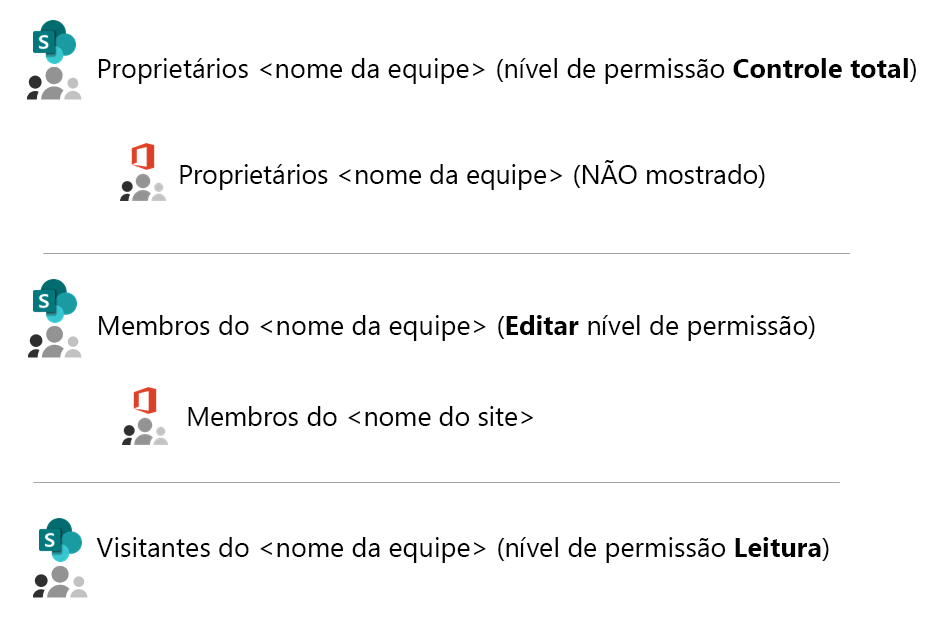
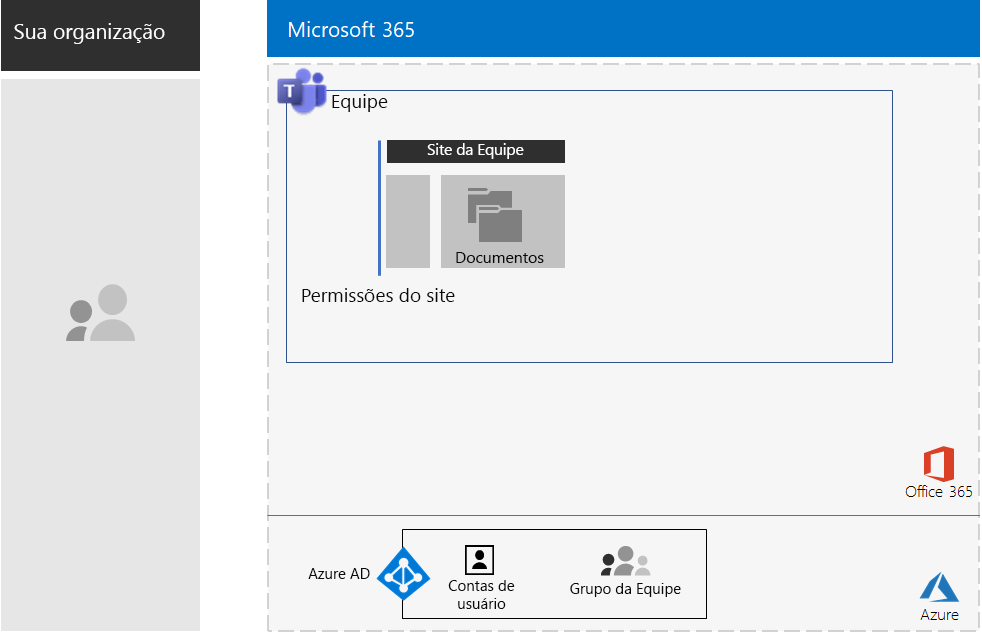
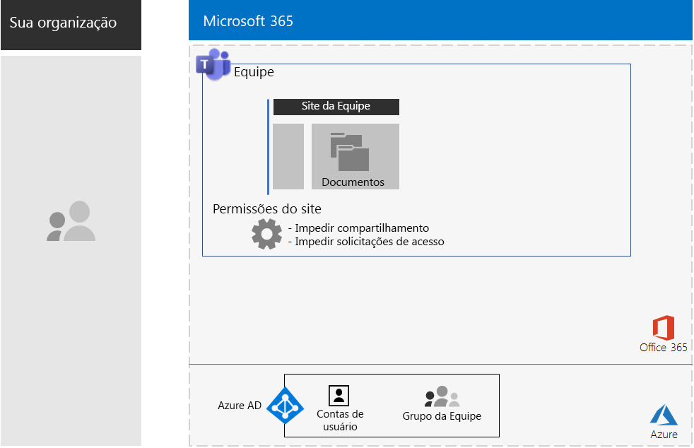
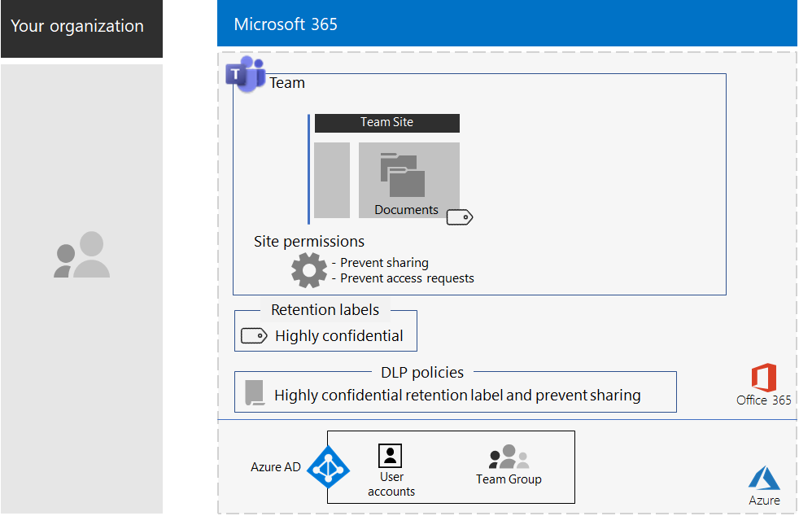
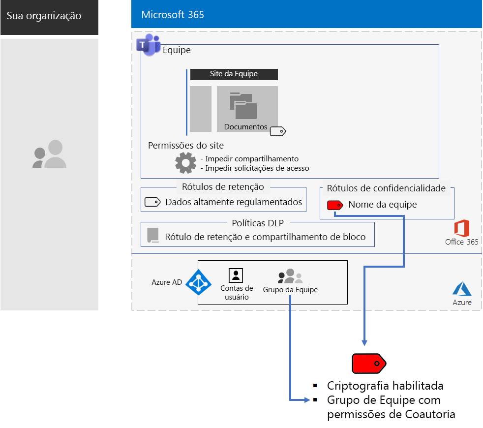
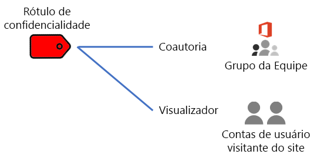
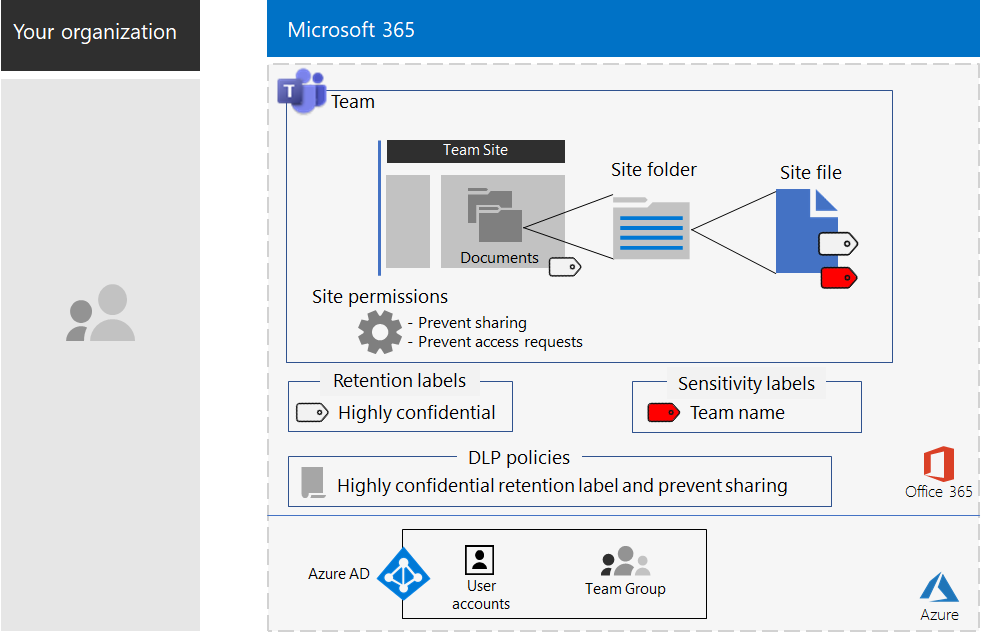

# Teams para dados altamente regulamentadosMicrosoft Teams for highly regulated data

Este artigo fornece recomendações e passo a passo para configurar uma equipe privada no Microsoft Teams que bloqueia o acesso aos recursos do Teams, como chats, reuniões e arquivos, somente para membros e proprietários do grupo do Office 365 da equipe.This article provides you with recommendations and steps to configure a private team in Microsoft Teams that locks down access to Teams features—such as chats, meetings, and files—to only members and owners of the Office 365 group for the team. 

Além do acesso privado baseado no grupo do Office 365, este artigo descreve como configurar o site de equipe particular e subjacente do SharePoint, que você pode na seção de **Arquivos** de um canal de equipe e obter a segurança adicional necessária para armazenar dados altamente regulamentados.Beyond the private access based on the Office 365 group, this article describes how to configure the underlying private SharePoint team site, which you can access from the **Files** section of a team channel, for the additional security needed to store highly regulated data. Neste site de equipe do SharePoint, você pode armazenar e colaborar em arquivos, páginas, um calendário compartilhado, tarefas, um bloco de anotações e listas.On this SharePoint team site, you can store and collaborate on files, pages, a shared calendar, tasks, a notebook, and lists.

Os elementos de configuração de uma equipe para dados altamente regulamentados são:The elements of configuration for a team for highly regulated data are:

- Uma equipe privada com um grupo correspondente do Office 365 que tem contas de usuário de proprietário e membro.A private team with a corresponding Office 365 group that has owner and member user accounts.
- Segurança adicional no site subjacente do SharePoint para a equipe que:Additional security on the underlying SharePoint site for the team that:
  - Impede que membros do site concedam acesso a outras pessoas.Members of the site from granting access to others.
  - Impede que não membros do site solicitem acesso a ele.Non-members of the site from requesting access to the site.
- Um rótulo de retenção do Office 365 para o site do SharePoint subjacente que é aplicado automaticamente a novos arquivos no site como uma maneira padrão de definir políticas de retenção.An Office 365 retention label for the underlying SharePoint site that is automatically applied to new files on the site as a default way to define retention policies.
- Uma política de Prevenção contra Perda de Dados (DLP) que usa o rótulo de retenção e impede que os usuários compartilhem ou enviem arquivos para fora da organização.A Data Loss Prevention (DLP) policy that uses the retention label and blocks users from sharing or sending files outside the organization.
- Um rótulo de confidencialidade do Office 365 de ou sub-rótulo de um rótulo altamente regulamentado com criptografia habilitada e permissões de Coautor para o grupo da equipe do Office 365.An Office 365 sensitivity label or a sublabel of a highly regulated label that has encryption enabled and Co-Author permissions for the Office 365 group of the team. Os usuários aplicam o rótulo ou sub-rótulo aos arquivos armazenados na seção de **Arquivos** da equipe na opção da barra de menus Confidencialidade do Word, Excel e PowerPoint.Users apply the label or sublabel to files stored in **Files** section of the team from the Sensitivity menu bar option in Word, Excel, and PowerPoint.

Esta é a configuração resultante com um rótulo de confidencialidade.Here is the resulting configuration with a sensitivity label.

 
## Fase 1: Configurar uma equipe para dados altamente regulamentadosPhase 1: Configure a team for highly regulated data

A configuração de ponta a ponta consiste nas seguintes etapas:The end-to-end configuration consists of these steps:

1. Configurações de identidade e acesso a dispositivo.Configure identity and device access.
2. Criação de uma equipe privada.Create a team
3. Configuração de site do SharePoint subjacente para segurança adicional.Configure the underlying SharePoint site for additional security.
4. Criação de um rótulo de retenção e uma política DLP.Create a retention label and DLP policy.
5. Criação de rótulo ou sub-rótulo de rótulo altamente regulamentado.Create the label or sublabel of the highly regulated label.

### Etapa 1: configurações de identidade e acesso a dispositivo.Step 1: Configure identity and device access

Para proteger o acesso à equipe e ao site do SharePoint subjacente, assegure-se de ter configurado as[políticas de identidade e acesso a dispositivo](https://docs.microsoft.com/microsoft-365/enterprise/identity-access-policies) e as [políticas de acesso do SharePoint Online](https://docs.microsoft.com/microsoft-365/enterprise/sharepoint-file-access-policies) recomendadas.To protect access to the team or SharePoint Online site, ensure that you have configured [identity and device access policies](https://docs.microsoft.com/microsoft-365/enterprise/identity-access-policies) and the [recommended SharePoint Online access policies](https://docs.microsoft.com/microsoft-365/enterprise/sharepoint-file-access-policies).

### Etapa 2: criação de uma equipe privada.Step 2: Create a private team

Use [essas instruções](https://support.office.com/article/create-a-team-from-scratch-174adf5f-846b-4780-b765-de1a0a737e2b) para criar uma equipe privada.Follow [these instructions](https://support.office.com/article/create-a-team-from-scratch-174adf5f-846b-4780-b765-de1a0a737e2b) to create a private SharePoint team site.

Ao criar uma equipe privada, estas são as permissões padrão:When you create a private team, here are the default permissions:

- O grupo do Office 365 para a equipe (o Grupo da Equipe) tem proprietários e membros do grupoThe Office 365 group for the team (the Team Group) has group owners and group members
- Do site do SharePoint subjacente para a equipe (o Site da Equipe):For the underlying SharePoint site for the team (the Team Site):
  - Os Administradores de Conjunto de Sites estão configurados para os proprietários de Grupo de EquipeThe Site Collection Administrators is configured for the Team Group owners
  - Para o Site de Equipe:For the Team Site: 
    - O grupo do SharePoint de Proprietários de Site de Equipe, com o nível de permissão Controle Total, está definido para os proprietários de Grupo de EquipeThe Team Site Owners SharePoint group—with the Full Control permission level—is set to the Team Group owners
    - O grupo do SharePoint de Proprietários de Site de Equipe, com o nível de permissão Editar, está definido para os proprietários de Grupo de EquipeThe Team Site Members SharePoint group—with the Edit permission level—is set to the Team Group members
    - O grupo do SharePoint de Visitantes de Site de Equipe, com o nível de permissão de Leitura, não tem grupos ou contas de usuáriosThe Team Site Visitors SharePoint group—with the Read permission level—has no groups or user accounts

Estas são as permissões padrão para o Site de Equipe.Here are the default permissions for the Team Site.

 
>[!Note]
>Se você visualizar o grupo do SharePoint de Proprietários de \<nome da equipe> para o nível de permissão Editar, ele não exibirá os Proprietários de \<nome da equipe>.If you view the \<team name> Owners SharePoint group for the Edit permission level, it does not display \<team name> Owners.
>

As permissões resultantes permitem:The resulting permissions allow:

- Proprietários de Grupo de Equipe para administrar o site e ter controle total sobre o conteúdo do site.Team Group owners to administer the site and have full control over the site contents.
- Membros de Grupo de Equipe para criar e editar arquivos no site.Team Group members to create and edit files on the site. 

A manutenção de permissões é igual para manutenção de proprietário e membro de equipe.Permissions maintenance is the same as team member and owner maintenance.

Esta é a configuração resultante até o momento.Here’s the resulting configuration so far.

 
### Etapa 3: Configuração do site subjacente do SharePoint para segurança adicionalStep 3: Configure the underlying SharePoint site for additional security

No Site da Equipe, defina estas configurações de permissão.From the SharePoint site, configure these permission settings.

1. Na barra de ferramentas, clique no ícone de configurações e, em seguida, clique em **Permissões do site**.In the tool bar, click the settings icon, and then click **Site permissions**.
2. No painel **Permissões do site**, em **Configurações de Compartilhamento**, clique em **Alterar configurações de compartilhamento**.In the **Site permissions** pane, under **Sharing Settings**, click **Change sharing settings**.
3. Em **Permissões de compartilhamento**, **Somente proprietários do site podem compartilhar arquivos, pastas e o site**.Under **Sharing permissions**, choose **Only site owners can share files, folders, and the site**.
4. Desabilite **Permitir solicitações de acesso** e clique em **Salvar**.Turn off **Allow access requests**, and then click **Save**.

Com essas configurações, a capacidade de membros do Grupo de Equipe compartilharem o Site da Equipe com outros membros ou para que não membros possam solicitar acesso ao site é desabilitada.With these settings, the ability for site group members to share the site with other members or for non-members to request access to the site is disabled.

Esta é a configuração resultante até o momento.Here’s the resulting configuration so far.

 
### Etapa 4: Criação de um rótulo de retenção e uma política DLP.Step 4: Create a retention label and DLP policy

Use [estas instruções](https://docs.microsoft.com/microsoft-365/compliance/protect-sharepoint-online-files-with-office-365-labels-and-dlp) para:Use [these instructions](https://docs.microsoft.com/microsoft-365/compliance/protect-sharepoint-online-files-with-office-365-labels-and-dlp) to:

1. Crie e publique um rótulo de retenção para dados altamente regulamentados (se necessário).Create and publish a retention label for highly regulated data (if needed).
2. Configure o Site de Equipe para o rótulo de retenção criado na etapa 1.Configure the site for the retention label created in step 1.
3. Crie uma política DLP para dados altamente regulamentados que usam o rótulo de retenção criado na etapa 2 e impede que os usuários enviem arquivos para fora da organização.Create a DLP policy for highly regulated data that uses the retention label created in step 2 and blocks users from sending files outside the organization Você também pode configurar a política para requisitos adicionais, como os de regulamentos do setor financeiro e de saúde, com base nos [modelos de política DLP](https://docs.microsoft.com/microsoft-365/compliance/data-loss-prevention-policies#dlp-policy-templates).You can also configure the policy for additional requirements, such as those for health and financial industry regulations, based on [DLP policy templates](https://docs.microsoft.com/microsoft-365/compliance/data-loss-prevention-policies#dlp-policy-templates).

Esta é a configuração resultante até o momento.Here’s the resulting configuration so far.

 
### Etapa 5: criação de rótulo ou sub-rótulo de rótulo altamente regulamentado.Step 5: Create the label or a sublabel of the highly regulated label

Ao contrário de um rótulo de confidencialidade para dados altamente regulamentados que qualquer pessoa pode aplicar a qualquer arquivo, uma equipe segura precisa de seu próprio rótulo ou sub-rótulo, assim os arquivos atribuídos:Unlike a sensitivity label for highly regulated data that anyone can apply to any file, a secure site needs its own sublabel so that files with the sublabel assigned:

- São criptografados e a criptografia acompanha o arquivo.Are encrypted and the encryption travels with the file.
- Contêm permissões personalizadas para que somente os membros do grupo de sites possam abri-lo.Contain custom permissions so that only members of the site group can open it.

Para atingir esse nível adicional de segurança para os arquivos armazenados no Site de Equipe, você deve configurar um novo rótulo de confidencialidade, que é um sub-rótulo do rótulo geral para arquivos altamente regulamentados.To accomplish this additional level of security for files stored in the site, you must configure a new sensitivity label that is a sublabel of the general label for highly regulated files. Somente os membros do Grupo de Equipe vão vê-los na lista de rótulos.Only Team Group members will see it in their list of labels.

Use um rótulo de confidencialidade quando precisar de um pequeno número de rótulos para uso global e equipes privadas individuais.Use a sensitivity label when you need a small number of labels for both global use and individual private teams. Use um sub-rótulo de confidencialidade quando você tiver um grande número de rótulos ou quiser organizar rótulos para equipes privadas sob o rótulo altamente regulamentado.Use a sensitivity sublabel when you have a large number of labels or want to organize labels for private teams the under the highly regulated label.

[Use estas instruçõess](https://docs.microsoft.com/microsoft-365/compliance/encryption-sensitivity-labels) para configurar um rótulo separado ou um sub-rótulo com as seguintes configurações:[Use these instructions](https://docs.microsoft.com/microsoft-365/compliance/encryption-sensitivity-labels) to configure a separate label or a sublabel with the following settings:

- O nome do rótulo contém o nome da equipeThe name of the label contains the name of the team
- A criptografia está ativadaEncryption is enabled.
- O Grupo de Equipe tem permissões de CoautoriaThe Team Group has Co-Author permissions

Esta é a configuração resultante com o novo rótulo.Here’s the resulting configuration with the new label.

Esta é a relação entre o rótulo de confidencialidade e o Grupo de Equipe.Here’s the relationship between the sensitivity label and the Team Group.

>[!Note]
>Se você configurar o rótulo ou sub-rótulo de confidencialidade para permissões definidas pelo usuário ou com uma data de validade, não poderá abrir o arquivo no Teams ou no SharePoint.If you configure the sensitivity label or sublabel for user-defined permissions or with an expiration date, you cannot open the file from Teams or SharePoint. Você deve usar um aplicativo do Office.You must use an Office app.
>

### Permissões personalizadasCustom permissions

Você também pode configurar permissões de site do SharePoint personalizadas para o Site da Equipe e, se necessário, seu rótulo de confidencialidade correspondente.You can also configure custom SharePoint site permissions for the Team Site and, if needed, its corresponding sensitivity label. Veja dois exemplos.Here are two examples based on SQL:

#### Exemplo 1: delegar a administração de sites do SharePointExample 1: Delegating SharePoint site administration

Se o proprietário da equipe não tiver experiência em administração do SharePoint ou desejar delegar a administração do Site de Equipe, ele poderá adicionar a conta de usuário de um administrador do SharePoint à lista de proprietários da equipe.If the team owner does not have SharePoint administration experience or wants to delegate administration of the Team Site, they could add the user account of a SharePoint administrator to the list of team owners. No entanto, o administrador do SharePoint teria acesso total à equipe e a todos os seus recursos e poderia abrir um arquivo com o rótulo de confidencialidade aplicado.But then the SharePoint administrator would have full access to the team and all its resources and would be able to open a file with the sensitivity label applied. 

Para evitar essa concessão excessiva de privilégios, adicione a conta de usuário do administrador do SharePoint ao grupo de Proprietários do SharePoint de Site de Equipe nas configurações de permissões avançadas do site.To prevent this over-granting of privileges, add the user account of the SharePoint administrator to the Team Site Owners SharePoint group in the advanced permissions settings of the site. O administrador do SharePoint pode administrar o site, mas não poderá acessar a equipe e nenhum de seus recursos ou abrir os arquivos com o rótulo de confidencialidade atribuído.The SharePoint administrator can administer the site but will not be able to access the team and any of its resources or open the files with the sensitivity label assigned.

#### Exemplo 2: permitir acesso somente de exibição a arquivos rotuladosExample 2: Allowing view-only access to labeled files

Se algum membro da equipe precisar visualizar somente o conteúdo dos arquivos rotulados no Site da Equipe, adicione suas contas de usuário individuais ao:If some staff only need to view the contents of labeled files in the Team Site, add their individual user accounts to the:

- Grupo do SharePoint de Visitantes de \<nome da equipe>, que por padrão tem o nível de permissão de Leitura.\<team name> Visitors SharePoint group, which by default has the Read permission level. 
- O rótulo de confidencialidade com as permissões de Visualizador.The sensitivity label with the Viewer permissions.

Estas são as permissões resultantes do rótulo.Here are the resulting permissions on the label.

 
Os visitantes do site poderão acessar o Site da Equipe diretamente e visualizar o conteúdo dos arquivos aos quais o sub-rótulo foi aplicado.The site visitors will be able to access the Team Site directly and view the contents of files that have the sublabel applied. No entanto, como eles não são membros do Grupo de Equipe, não poderão acessar a equipe ou nenhum de seus recursos.But because they are not members of the Team Group, they will not be able to access the team or any of its resources.

## Fase 2: Impulsionar a adoção do usuário para membros da equipePhase 2: Drive user adoption for remote workers

Com a equipe no local, é hora de impulsionar a adoção dessa equipe e sua segurança adicional aos membros da equipe.With the team in place, it’s time to drive the adoption of this team and its additional security to team members.

### Etapa 1: treinar os usuáriosStep 1: Train your users

Os membros do Grupo de Equipe podem acessar a equipe e todos os seus recursos, incluindo chats, reuniões e outros aplicativos.Members of the Team Group can access the team and all of its resources, including chats, meetings, and other apps. Ao trabalhar com arquivos da seção de **Arquivos** de um canal, os membros do Grupo de Equipe devem atribuir o rótulo ou sub-rótulo de confidencialidade aos arquivos criados para a equipe segura.When working with files from the **Files** section of a channel, members of the Team Group must assign the sensitivity label or sublabel to files created for the secure team. Veja um exemplo.Here’s an example.

 
Quando o rótulo for aplicado ao arquivo, ele será protegido.When the label gets applied to the file it is secured. Os membros do Grupo de Equipe podem abri-lo no Teams e colaborar em tempo real.Members of the Team Group can open it in Teams and collaborate in real time. Ele é criptografado e inclui as permissões de Coautor definidas para os membros do Grupo de Equipe.It is encrypted and includes the Co-Author permissions set to the Team Group members. Se o arquivo sair do site e for encaminhado para um usuário mal-intencionado, eles terão que fornecer as credenciais de uma conta de usuário que seja membro do Grupo de Equipe para abrir o arquivo e exibir seu conteúdo.If the file leaves the site and gets forwarded to a malicious user, they will have to supply credentials of a user account that is member of the Team Group to open the file and view its contents. 

Treine os membros da sua equipe:Train your team members:

- Sobre a importância de usar a nova equipe para bate-papos, reuniões, arquivos e outros recursos do Site da Equipe e as consequências de um vazamento de dados altamente regulamentados, como ramificações legais, multas regulatórias, ransomware ou perda de vantagem competitiva.On the importance of using the new site to protect valuable files and the consequences of a highly regulated data leak, such as legal ramifications, regulatory fines, ransomware, or loss of competitive advantage.
- Como acessar a equipe.How to access the team.
- Como criar novos arquivos no site e carregar novos arquivos armazenados localmente.How to create new files on the site and upload new files stored locally.
- Como a política DLP bloqueia o compartilhamento de arquivos externamente por parte do usuário.How the DLP policy blocks them from sharing files externally.
- Como rotular arquivos com o rótulo personalizado ou sub-rótulo da equipe.How to label files with the custom label or sublabel for the team.
- Como o rótulo ou o sub-rótulo protege os arquivos, mesmo quando vazam do site.How the label or sublabel protects files even when they are leaked off the site.

Esse treinamento deve incluir exercícios práticos para que os membros da sua equipe possam experimentar esses recursos e seus resultados.This training should include hands-on exercises so that your students can experience these capabilities and their results.

### Etapa 2: Realize análises de uso periódicas e gerencie os comentários dos membros da equipeStep 2: Conduct periodic reviews of usage and address worker feedback

Nas semanas após o treinamento:In the weeks after training:

- Aborde rapidamente os comentários dos membros da equipe e ajuste as políticas e configurações.Quickly address remote worker feedback and fine tune polices and configurations.
- Analise o uso da equipe e compare-o com as expectativas de uso.Analyze usage for the site or team and compare it with usage expectations.
- Verifique se os arquivos altamente regulamentados foram rotulados corretamente com o rótulo ou sub-rótulo de confidencialidade personalizado.Verify that sensitive or highly regulated files have been properly labeled with the appropriate sensitivity label.

  Você pode verificar quais arquivos têm um rótulo atribuído exibindo uma pasta no SharePoint e adicionando a coluna **Confidencialidade** por meio da opção **Mostrar/ocultar colunas** da **coluna Adicionar**.You can see which files have a label assigned by viewing a folder in SharePoint and adding the **Sensitivity** column through the **Show/hide columns** option of **Add column**.

Repita o treinamento dos usuários conforme necessário.Retrain your users as needed.

## Confira tambémSee also

[Sites do SharePoint para dados altamente regulamentadosSharePoint sites for highly regulated data](teams-sharepoint-online-sites-highly-regulated-data.md)

[Cargas de trabalho e cenários do Microsoft 365 EnterpriseMicrosoft 365 Enterprise workloads and scenarios](deploy-workloads.md)

[Biblioteca de produtividade do Microsoft 365](https://aka.ms/productivitylibrary) (https://aka.ms/productivitylibrary)[Microsoft 365 Productivity Library](https://aka.ms/productivitylibrary) (https://aka.ms/productivitylibrary)

[Guia de implantaçãoDeployment guide](deploy-microsoft-365-enterprise.md)
