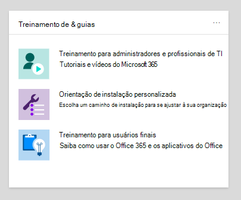
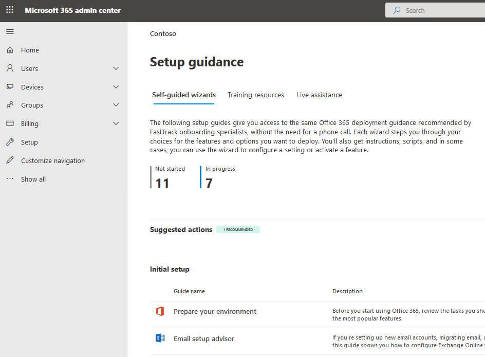

# Guias de configuração para os serviços Microsoft 365 e Office 365Setup guides for Microsoft 365 and Office 365 services

Microsoft 365 e Office 365 de configuração dão orientações e recursos personalizados para planejar e implantar seu locatário, aplicativos e serviços.Microsoft 365 and Office 365 setup guides give you tailored guidance and resources for planning and deploying your tenant, apps, and services. Esses guias são criados usando  as mesmas práticas recomendadas que Microsoft 365 FastTrack especialistas em integração compartilham em interações individuais e estão disponíveis para todos os administradores no Centro de administração do Microsoft 365.These guides are created using the same best practices that [Microsoft 365 FastTrack](https://www.microsoft.com/fasttrack/microsoft-365) onboarding specialists share in individual interactions, and they're available to all admins within the Microsoft 365 admin center. Eles fornecem informações sobre a configuração do produto, habilitando recursos de segurança, implantando ferramentas de colaboração e fornecendo scripts para acelerar implantações avançadas.They give information on product setup, enabling security features, deploying collaboration tools, and provide scripts to speed up advanced deployments.

## Como acessar guias de configuração no Centro de administração do Microsoft 365How to access setup guides in the Microsoft 365 admin center

Os guias de configuração são acessíveis na página de orientação [de](https://aka.ms/setupguidance) Instalação no Centro de administração do Microsoft 365.The setup guides are accessible from the [Setup guidance](https://aka.ms/setupguidance) page in the Microsoft 365 admin center. Você pode acompanhar o status do seu progresso e tem a opção de retornar a qualquer momento para concluir um guia.You can keep track of the status of your progress and you have the option to return at any time to complete a guide. Para chegar à **página de orientação da** Instalação:To reach the **Setup guidance** page:

1. Na página [Centro de administração do Microsoft 365](https://admin.microsoft.com/), vá para a **Home** page.In the [Microsoft 365 admin center](https://admin.microsoft.com/), go to the **Home** page.

2. Encontre o **cartão De & guias de** treinamento.Find the **Training & guides** card. 

   

3. Selecione **Diretrizes de configuração personalizadas**.Select **Customized setup guidance**.

   

>[!NOTE]
>As permissões de administrador de locatários são necessárias para acessar o Centro de administração do Microsoft 365.Tenant administrator permissions are required to access the Microsoft 365 admin center.

## Como os guias de instalação funcionam no Centro de administração do Microsoft 365?How do setup guides work in the Microsoft 365 admin center?

Cada guia fornece instruções passo a passo, recursos, artigos e, quando necessário, scripts que você pode usar para fazer alterações de configuração.Each guide provides you with step-by-step instructions, resources, articles, and when needed, scripts you can use to make configuration changes. Esses guias fornecem opções que refletem as necessidades específicas de organizações pequenas e grandes.These guides provide you with choices that reflect the specific needs of both small and large organizations. Além disso, as diretrizes incluem assistência para administradores novos e mais experientes.Additionally, the guidance includes assistance for both new and more experienced admins.

Você pode usar os guias para saber mais sobre recursos Microsoft 365 e Office 365 específicos durante a fase de planejamento, durante a implantação e distribuição ou para revisá-los depois de concluir uma implantação para modificar uma configuração.You can use the guides to learn more about specific Microsoft 365 and Office 365 features during the planning phase, during deployment and rollout, or to revisit them after you've completed a deployment to modify a setting.

## Guias para a instalação inicialGuides for initial setup

### Preparar seu ambientePrepare your environment

O [guia Preparar seu ambiente](https://aka.ms/prepareyourenvironment) ajuda você a preparar o ambiente da sua organização para Microsoft 365 e Office 365 serviços.The [Prepare your environment](https://aka.ms/prepareyourenvironment) guide helps you prepare your organization's environment for Microsoft 365 and Office 365 services. Independentemente de suas metas, há tarefas que você precisará concluir para garantir uma implantação bem-sucedida.Regardless of your goals, there are tasks you'll need to complete to ensure a successful deployment. Para evitar erros durante a preparação do ambiente, você recebe instruções passo a passo para conectar seu domínio, adicionar usuários, atribuir licenças, configurar emails com Exchange Online e instalar ou implantar aplicativos Office.To avoid any errors while preparing your environment, you're provided with step-by-step instructions to connect your domain, add users, assign licenses, set up email with Exchange Online, and install or deploy Office apps. 

### Consultor de configuração de emailEmail setup advisor

O [consultor de configuração](https://aka.ms/office365setup) de email fornece as orientações passo a passo necessárias para configurar o Exchange Online para sua organização.The [Email setup advisor](https://aka.ms/office365setup) provides you with the step-by-step guidance needed for configuring Exchange Online for your organization. Isso inclui configurar novas contas de email, migrar email e configurar a proteção de email.This includes setting up new email accounts, migrating email, and configuring email protection. Para uma configuração de email bem-sucedida, use este consultor e você receberá o método de migração recomendado com base no sistema de email atual da sua organização, o número de caixas de correio que estão sendo migradas e como você deseja gerenciar usuários e seu acesso.For a successful email set up, use this advisor and you'll receive the recommended migration method based on your organization's current mail system, the number of mailboxes being migrated, and how you want to manage users and their access.

### Migrar contatos do Gmail e itens de calendárioMigrate Gmail contacts and calendar items

Quando você migra a caixa de correio de um usuário do Gmail para Microsoft 365, as mensagens de email são migradas, mas os contatos e os itens de calendário não são.When you migrate a Gmail user's mailbox to Microsoft 365, email messages are migrated, but contacts and calendar items are not. O consultor de calendário e contatos do [Gmail](https://aka.ms/gmailcontactscalendar) fornece etapas para importar contatos do Google e itens de calendário do Google para Microsoft 365 usando métodos de importação e exportação com Outlook.com, o cliente Outlook ou o PowerShell.The [Gmail contacts and calendar advisor](https://aka.ms/gmailcontactscalendar) provides steps for importing Google contacts and Google calendar items to Microsoft 365 using import and export methods with Outlook.com, the Outlook client, or PowerShell.

### Microsoft 365 de implantaçãoMicrosoft 365 deployment advisor

O [Microsoft 365 de implantação](https://aka.ms/microsoft365setupguide) fornece orientações ao configurar ferramentas de produtividade, políticas de segurança e recursos de gerenciamento de dispositivos.The [Microsoft 365 deployment advisor](https://aka.ms/microsoft365setupguide) provides you with guidance when setting up productivity tools, security policies, and device management capabilities. Com uma Microsoft 365 Business Premium ou Microsoft 365 para assinatura corporativa, você pode usar esse consultor para configurar e configurar os dispositivos da sua organização.With a Microsoft 365 Business Premium or Microsoft 365 for enterprise subscription, you can use this advisor to set up and configure your organization's devices. 

Você receberá orientações e acesso a recursos para habilitar seus serviços de nuvem, atualizar dispositivos para a versão mais recente com suporte do Windows 10 e ingressar dispositivos no Active Directory do Azure (Azure AD), tudo em um local central.You'll receive guidance and access to resources to enable your cloud services, update devices to the latest supported version of Windows 10, and join devices to Azure Active Directory (Azure AD), all in one central location.

### Guia de configuração de trabalho remotoRemote work setup guide

O [guia de configuração](https://aka.ms/remoteworksetup) de trabalho remoto fornece às organizações as dicas e os recursos necessários para garantir que seus usuários possam trabalhar remotamente, seus dados são seguros e as credenciais dos usuários são salvas.The [Remote work setup guide](https://aka.ms/remoteworksetup) provides organizations with the tips and resources needed to ensure your users can successfully work remotely, your data is secure, and users' credentials are safeguarded. 

Você receberá orientações para otimizar o tráfego de dispositivos de funcionários remotos Microsoft 365 recursos na nuvem e na rede da sua organização, o que reduzirá a tensão em sua infraestrutura vpn de acesso remoto.You'll receive guidance to optimize remote workers' device traffic to both Microsoft 365 resources in the cloud and your organization's network, which will reduce the strain on your remote access VPN infrastructure. 

### Windows Guia de configuração da Área de Trabalho VirtualWindows Virtual Desktop setup guide

Windows A Área de Trabalho Virtual é um serviço abrangente de virtualização de aplicativos e área de trabalho em execução na nuvem.Windows Virtual Desktop is a comprehensive desktop and app virtualization service running in the cloud. É a única infraestrutura de área de trabalho virtual (VDI) que oferece gerenciamento simplificado, Windows 10 de várias sessões, otimizações para Microsoft 365 Apps e suporte para ambientes de Serviços de Área de Trabalho Remota (RDS).It's the only virtual desktop infrastructure (VDI) that delivers simplified management, multi-session Windows 10, optimizations for Microsoft 365 Apps, and support for Remote Desktop Services (RDS) environments. Implante e dimensione suas Windows de trabalho e aplicativos para o Azure em minutos e receba recursos de segurança e conformidade integrados.Deploy and scale your Windows desktops and apps to Azure in minutes and get built-in security and compliance features. 

O Windows de configuração da Área de Trabalho [Virtual](https://aka.ms/wvdsetupguide) fornece aos administradores recursos de planejamento e os pré-requisitos para implantação, diretrizes de instalação e recursos adicionais.The [Windows Virtual Desktop setup guide](https://aka.ms/wvdsetupguide) provides administrators with planning resources and the prerequisites for deployment, setup guidance, and additional resources. 

### Microsoft Edge de configuraçãoMicrosoft Edge setup guide

Microsoft Edge foi reconstruído do zero para trazer compatibilidade e desempenho de classe mundial, a segurança e privacidade que você merece e novos recursos projetados para trazer o melhor da Web.Microsoft Edge has been rebuilt from the ground up to bring you world-class compatibility and performance, the security and privacy you deserve, and new features designed to bring you the best of the web.

O guia de instalação do [Microsoft Edge](https://aka.ms/edgeadvisor) ajudará você a configurar o Enterprise Descoberta de Site para ver quais sites acessados em sua organização podem precisar usar o modo IE, revisar e configurar recursos de segurança importantes, configurar políticas de privacidade e políticas adicionais para atender aos requisitos da sua organização e gerenciar o acesso à Web em seus dispositivos.The [Microsoft Edge setup guide](https://aka.ms/edgeadvisor) will help you configure Enterprise Site Discovery to see which sites accessed in your org might need to use IE mode, review and configure important security features, configure privacy policies and additional policies to meet your org's requirements, and manage web access on your devices. Você pode baixar Microsoft Edge para dispositivos individuais ou mostraremos como implantar vários usuários em sua organização com o Configuration Manager ou Microsoft Intune.You can download Microsoft Edge to individual devices, or we'll show you how to deploy to multiple users in your org with Configuration Manager or Microsoft Intune. 

### Pesquisa da Microsoft guia de configuraçãoMicrosoft Search setup guide

Pesquisa da Microsoft ajuda sua organização a encontrar o que precisam para concluir o que estão trabalhando.Microsoft Search helps your organization find what they need to complete what they're working on. Se ele está procurando por pessoas, arquivos, gráficos de organização, sites ou respostas para perguntas comuns, sua organização pode usar Pesquisa da Microsoft todo o dia de trabalho para obter respostas.Whether it's searching for people, files, org charts, sites, or answers to common questions, your org can use Microsoft Search throughout their workday to get answers.

O [Pesquisa da Microsoft de](https://aka.ms/MicrosoftSearchSetup) instalação ajuda você a configurar Pesquisa da Microsoft se você deseja pilotá-lo para um grupo de usuários ou roll-lo para todos em sua organização. Você atribuirá administradores de pesquisa e editores de Pesquisa e personalizará a experiência de pesquisa para seus usuários com respostas e opções adicionais, como adicionar a extensão Bing ao Chrome ou definir o Bing como seu mecanismo de pesquisa padrão.The [Microsoft Search setup guide](https://aka.ms/MicrosoftSearchSetup) helps you configure Microsoft Search whether you want to pilot it to a group of users or roll it out to everyone in your org. You'll assign Search admins and Search editors and then customize the search experience for your users with answers and additional options, like adding the Bing extension to Chrome or setting Bing as your default search engine.

### Guia de configuração de co-gerenciamento do Gerenciador de Configurações do IntuneIntune Configuration Manager co-management setup guide

Use o guia de configuração de co-gerenciamento do Gerenciador de Configurações do [Intune](https://aka.ms/comanagementsetup) para dispositivos cliente do Configuration Manager existentes e novos dispositivos baseados na Internet que sua organização deseja gerenciar em co-gerenciar com o Microsoft Intune e o Configuration Manager.Use the [Intune Configuration Manager co-management setup guide](https://aka.ms/comanagementsetup) for existing Configuration Manager client devices and new internet-based devices that your org wants to co-manage with both Microsoft Intune and Configuration Manager. Este guia de implantação de co-gerenciamento permite que você gerencie Windows 10 dispositivos e adiciona novas funcionalidades aos dispositivos da sua organização, ao mesmo tempo em que recebe os benefícios das duas soluções.This co-management deployment guide allows you to manage Windows 10 devices and adds new functionality to your org's devices, while receiving the benefits of both solutions.

## Guias para autenticação e acessoGuides for authentication and access

### Guia de configuração do Azure ADAzure AD setup guide

O guia de configuração do [Azure AD](https://aka.ms/aadpguidance) fornece informações para garantir que sua organização tenha uma base de segurança forte.The [Azure AD setup guide](https://aka.ms/aadpguidance) provides information to ensure your organization has a strong security foundation. Neste guia, você configurará recursos iniciais, como o controle de acesso baseado em função do Azure (Azure RBAC) para administradores, o Azure AD Conexão para o diretório local e o Azure AD Conexão Health, para que você possa monitorar a saúde da sua identidade híbrida durante sincronizações automatizadas.In this guide you’ll set up initial features, like Azure role-based access control (Azure RBAC) for admins, Azure AD Connect for your on-premises directory, and Azure AD Connect Health, so you can monitor your hybrid identity's health during automated syncs. 

Ele também inclui informações essenciais sobre a habilitação de redefinições de senha de autoatendados, acesso condicional e entrada integrada de terceiros, incluindo proteção de identidade avançada opcional e automação de provisionamento de usuário.It also includes essential information on enabling self-service password resets, conditional access and integrated third-party sign-on including optional advanced identity protection and user provisioning automation.

### Sincronizar usuários do diretório da sua organizaçãoSync users from your org’s directory

O [assistente Sincronizar usuários do](https://aka.ms/directorysyncsetup) diretório da sua organização orienta você a ligar a sincronização de diretórios.The [Sync users from your org’s directory wizard](https://aka.ms/directorysyncsetup) walks you through turning on directory synchronization. Isso reúne suas identidades locais e de nuvem para facilitar o acesso e o gerenciamento simplificado.This brings your on-premises and cloud identities together for easier access and simplified management. Desbloqueie novos recursos, como entrada única, opções de autoatendência, provisionamento automático de conta, controles de acesso condicional e políticas de conformidade.Unlock new capabilities, like single sign-on, self-service options, automatic account provisioning, conditional access controls, and compliance policies. Isso garante que seus usuários tenham acesso aos recursos necessários de qualquer lugar.This ensures that your users have access to the resources they need from anywhere.

### Planejar sua implantação sem senhaPlan your passwordless deployment

Atualize para uma abordagem de entrada alternativa que permite que os usuários acessem seus dispositivos com segurança com um dos seguintes métodos de autenticação sem senha:Upgrade to an alternative sign-in approach that allows users to access their devices securely with one of the following passwordless authentication methods: 

- Windows Hello para EmpresasWindows Hello for Business
- O aplicativo Microsoft AuthenticatorThe Microsoft Authenticator app
- Chaves de segurançaSecurity keys 

Use o [assistente Planejar sua](https://aka.ms/passwordlesssetup) implantação sem senha para descobrir os melhores métodos de autenticação sem senha para usar e receber orientações sobre como implantá-los.Use the [Plan your passwordless deployment wizard](https://aka.ms/passwordlesssetup) to discover the best passwordless authentication methods to use and receive guidance on how to deploy them. 

### Planejar sua implantação de redefinição de senha de autoatendados (SSPR)Plan your self-service password reset (SSPR) deployment

Dê aos usuários a capacidade de alterar ou redefinir sua senha independentemente, se a conta estiver bloqueada ou se esquecerem da senha sem a necessidade de contatar um engenheiro de ajuda.Give users the ability to change or reset their password independently, if their account is locked, or they forget their password without the need to contact a helpdesk engineer. 

Use o Assistente de implantação de redefinição de senha de autoatendados para receber artigos e instruções relevantes para configurar as opções de portal apropriadas do Azure para [ajudá-lo](https://aka.ms/SSPRSetupGuide) a implantar o SSPR em seu ambiente.Use the [Plan your self-service password reset deployment wizard](https://aka.ms/SSPRSetupGuide) to receive relevant articles and instructions for configuring the appropriate Azure portal options to help you deploy SSPR in your environment.

### Consultor de implantação dos Serviços de Federação do Active Directory (AD FS)Active Directory Federation Services (AD FS) deployment advisor

O consultor de implantação do [AD FS](https://aka.ms/adfsguidance) fornece orientações passo a passo sobre a implantação de uma infraestrutura local do AD FS que autentica usuários para serviços Microsoft 365 e Office 365 local.The [AD FS deployment advisor](https://aka.ms/adfsguidance) provides you with step-by-step guidance on deploying an on-premises AD FS infrastructure that authenticates users for Microsoft 365 and Office 365 services. Com este guia, sua organização pode revisar os componentes e requisitos do AD FS, adquirir e instalar certificados SSL necessários para implantação e instalar um servidor proxy de aplicativo Web necessário.With this guide, your organization can review AD FS components and requirements, acquire and install SSL certificates that are necessary for deployment, and install a required web application proxy server. 

## Guias de segurança e conformidadeGuides for security and compliance

### Microsoft Intune de configuraçãoMicrosoft Intune setup guide 

Configurar Microsoft Intune gerenciar dispositivos em sua organização.Set up Microsoft Intune to manage devices in your organization. Para controle total de dispositivos corporativos, você usará os recursos de gerenciamento de dispositivo móvel (MDM) do Intune.For full control of corporate devices, you’ll use Intune’s mobile device management (MDM) features. Para gerenciar os dados da sua organização em dispositivos pessoais e compartilhados, você pode usar os recursos de gerenciamento de aplicativos móveis (MAM) do Intune.To manage your organization's data on shared and personal devices, you can use Intune’s mobile application management (MAM) features. 

Com o [Microsoft Intune](https://aka.ms/intunesetupguide)de configuração, você configurará políticas de conformidade de dispositivos e aplicativos, atribuirá políticas de proteção de aplicativos e monitorará o status de proteção de dispositivos e aplicativos.With the [Microsoft Intune setup guide](https://aka.ms/intunesetupguide), you'll set up device and app compliance policies, assign app protection policies, and monitor the device and app protection status. 

### Consultor do Microsoft Defender para Ponto de ExtremidadeMicrosoft Defender for Endpoint advisor

O [consultor do Microsoft Defender para Ponto de](https://aka.ms/mdatpsetup) Extremidade fornece instruções que ajudarão sua rede corporativa a evitar, detectar, investigar e responder a ameaças avançadas.The [Microsoft Defender for Endpoint advisor](https://aka.ms/mdatpsetup) provides instructions that will help your enterprise network prevent, detect, investigate, and respond to advanced threats. Faça uma avaliação informada da vulnerabilidade da sua organização e decida quais são os melhores métodos de configuração e pacote de implantação.Make an informed assessment of your organization's vulnerability and decide which deployment package and configuration methods are best. 

>[!NOTE]
>Uma Licença de Volume da Microsoft é necessária para o Microsoft Defender para o Ponto de Extremidade.A Microsoft Volume License is required for Microsoft Defender for Endpoint.

### Proteção do Exchange Online guia de instalaçãoExchange Online Protection setup guide

Microsoft Exchange Online Proteção (EOP) é um serviço de filtragem de email baseado em nuvem para proteção contra spam e malware, com recursos para proteger sua organização contra violações de política de mensagens.Microsoft Exchange Online Protection (EOP) is a cloud-based email filtering service for protection against spam and malware, with features to safeguard your organization from messaging policy violations. 

Use o [Proteção do Exchange Online](https://aka.ms/EOPguidance) de instalação para configurar o EOP selecionando qual dos três cenários de implantação caixas de correio locais, caixas de correio híbridas (combinação de caixas de correio locais e na nuvem) ou todas as caixas de correio de nuvem se ajustam à sua &mdash; &mdash; organização.Use the [Exchange Online Protection setup guide](https://aka.ms/EOPguidance) to set up EOP by selecting which of the three deployment scenarios&mdash;on-premises mailboxes, hybrid (mix of on-premises and cloud) mailboxes, or all cloud mailboxes&mdash;fits your organization. O guia fornece informações e recursos para configurar e revisar o licenciamento do usuário, atribuir permissões no Centro de administração do Microsoft 365 e configurar as políticas anti-malware e spam da sua organização no Centro de Conformidade & Segurança.The guide provides information and resources to set up and review your user's licensing, assign permissions in the Microsoft 365 admin center, and configure your organization's anti-malware and spam policies in the Security & Compliance Center. 

### Microsoft Defender for Office 365 advisorMicrosoft Defender for Office 365 advisor

O [microsoft Defender for Office 365](https://aka.ms/oatpsetup) protege sua organização contra ameaças mal-intencionadas que seu ambiente pode encontrar por meio de mensagens de email, links e ferramentas de colaboração de terceiros.The [Microsoft Defender for Office 365 advisor](https://aka.ms/oatpsetup) safeguards your organization against malicious threats that your environment might encounter through email messages, links, and third-party collaboration tools. Este guia fornece os recursos e informações para ajudá-lo a preparar e identificar o Defender para Office 365 plano para se ajustar às necessidades da sua organização.This guide provides you with the resources and information to help you prepare and identify the Defender for Office 365 plan to fit your organization's needs. 

### proteção de informações da Microsoft de configuraçãoMicrosoft information protection setup guide

Obter uma visão geral dos recursos que você pode aplicar à sua estratégia de Proteção de Informações para que você possa ter certeza de que suas informações confidenciais estão protegidas.Get an overview of the capabilities you can apply to your Information Protection strategy so you can be confident your sensitive information is protected. Use uma abordagem de ciclo de vida em quatro estágios na qual você descobre, classifica, protege e monitora as informações confidenciais.Use a four-stage lifecycle approach in which you discover, classify, protect, and monitor sensitive information. O [Guia de configuração da proteção de informações da Microsoft](https://aka.ms/mipsetupguide) fornece orientações para completar cada uma dessas etapas.The [Microsoft information protection setup guide](https://aka.ms/mipsetupguide) provides guidance for completing each of these stages.

### Guia de configuração de governança de informações da MicrosoftMicrosoft information governance setup guide

O guia de configuração de [governança](https://aka.ms/migsetupguide) de Informações da Microsoft fornece as informações necessárias para configurar e gerenciar a estratégia de governança da sua organização, para garantir que seus dados são classificados e gerenciados de acordo com as diretrizes de ciclo de vida específicas definidas.The [Microsoft Information governance setup guide](https://aka.ms/migsetupguide) provides you with the information you'll need to set up and manage your organization's governance strategy, to ensure that your data is classified and managed according to the specific lifecycle guidelines you set. Com este guia, você aprenderá a criar, aplicar automaticamente ou publicar rótulos, políticas de rótulo e políticas de retenção aplicadas aos registros de conformidade e conteúdo reutilizável da sua organização.With this guide, you'll learn how to create, auto-apply, or publish labels, label policies, and retention policies that are applied to your organization's reusable content and compliance records. Você também obterá informações sobre a importação de arquivos CSV com um plano de arquivo para cenários em massa ou para aplicação manualmente a documentos individuais.You'll also get information on importing CSV files with a file plan for bulk scenarios or for applying them manually to individual documents. 

## Guias para colaboraçãoGuides for collaboration

### Microsoft 365 Apps de implantaçãoMicrosoft 365 Apps deployment advisor

O [Microsoft 365 Apps](https://aka.ms/OPPquickstartguide) de implantação ajuda você a fazer com que os dispositivos dos usuários executam a versão mais recente de produtos Office como Word, Excel, PowerPoint e OneNote.The [Microsoft 365 Apps deployment advisor](https://aka.ms/OPPquickstartguide) helps you get your users' devices running the latest version of Office products like Word, Excel, PowerPoint, and OneNote. Você obterá orientações sobre os vários métodos de implantação que incluem opções de auto-instalação fáceis para implantações corporativas com ferramentas de gerenciamento.You'll get guidance on the various deployment methods that include easy self-install options to enterprise deployments with management tools. As instruções ajudarão você a avaliar seu ambiente, descobrir seus requisitos específicos de implantação e implementar as ferramentas de suporte necessárias para garantir uma instalação bem-sucedida.The instructions will help you assess your environment, figure out your specific deployment requirements, and implement the necessary support tools to ensure a successful install. 

### Guia de configuração de aplicativos móveisMobile apps setup guide

O [guia de configuração](https://aka.ms/officeappguidance) de aplicativos móveis fornece instruções para o download e a instalação de aplicativos Office em seus Windows, iOS e dispositivos móveis Android.The [Mobile apps setup guide](https://aka.ms/officeappguidance) provides instructions for the download and installation of Office apps on your Windows, iOS, and Android mobile devices. Este guia fornece informações passo a passo para baixar e instalar Microsoft 365 e Office 365 aplicativos em seus dispositivos de telefone e tablet.This guide provides you with step-by-step information to download and install Microsoft 365 and Office 365 apps on your phone and tablet devices.

### Microsoft Teams de configuraçãoMicrosoft Teams setup guide

O [Microsoft Teams](https://aka.ms/teamsguidance) guia de instalação fornece orientação à sua organização para configurar espaços de trabalho de equipe que hospedam conversas em tempo real por meio de mensagens, chamadas e reuniões de áudio ou vídeo para a equipe e a comunicação privada.The [Microsoft Teams setup guide](https://aka.ms/teamsguidance) provides your organization with guidance to set up team workspaces that host real-time conversations through messaging, calls, and audio or video meetings for both team and private communication. Você receberá as instruções para determinar os requisitos de rede da sua organização usando a ferramenta Planejador de Rede e o consultor de Teams no centro de administração do Teams.You'll receive the instructions for determining your organization's network requirements by using the Network Planner tool and the Teams advisor within the Teams admin center. Uma vez concluída a implantação, o guia incluirá recursos úteis para começar a utilizar o Teams.Once your deployment is complete, the guide includes helpful resources to get started using Teams.

### SharePoint de configuraçãoSharePoint setup guide

O [guia SharePoint](https://aka.ms/spoguidance) de instalação ajuda você a configurar o armazenamento de documentos SharePoint gerenciamento de conteúdo, criar sites, configurar compartilhamento externo, migrar dados e configurar configurações avançadas e impulsionar o envolvimento e a comunicação do usuário em sua organização.The [SharePoint setup guide](https://aka.ms/spoguidance) helps you set up your SharePoint document storage and content management, create sites, configure external sharing, migrate data and configure advanced settings, and drive user engagement and communication within your organization. Você seguirá etapas para configurar suas políticas de permissão de compartilhamento de conteúdo, escolher suas ferramentas de sincronização de migração, bem como habilitar as configurações de segurança para seu ambiente SharePoint de migração.You'll follow steps for configuring your content-sharing permission policies, choose your migration sync tools, as well as enable the security settings for your SharePoint environment. 

### OneDrive de configuraçãoOneDrive setup guide

Use o [OneDrive de configuração](https://aka.ms/ODfBquickstartguide) para começar OneDrive armazenamento de arquivos, compartilhamento, colaboração e recursos de sincronização.Use the [OneDrive setup guide](https://aka.ms/ODfBquickstartguide) to get started with OneDrive file storage, sharing, collaboration, and syncing capabilities. OneDrive fornece um local central onde os usuários podem sincronizar seus arquivos Microsoft 365 Apps, configurar o compartilhamento externo, migrar dados do usuário e configurar configurações avançadas de segurança e acesso a dispositivos.OneDrive provides a central location where users can sync their Microsoft 365 Apps files, configure external sharing, migrate user data, and configure advanced security and device access settings. O OneDrive de instalação pode ser implantado usando uma assinatura OneDrive ou um plano OneDrive autônomo.The OneDrive setup guide can be deployed using a OneDrive subscription or a standalone OneDrive plan. 

### Yammer de implantaçãoYammer deployment advisor

Conexão e se envolva em toda a sua organização com Yammer.Connect and engage across your organization with Yammer. O [Yammer de](https://aka.ms/yammerdeploymentguide) implantação prepara sua rede Yammer adicionando domínios, definindo administradores e combinando Yammer redes.The [Yammer deployment advisor](https://aka.ms/yammerdeploymentguide) prepares your Yammer network by adding domains, defining admins, and combining Yammer networks. Você obterá orientações para implantar o Yammer e, em seguida, personalizar a aparência, configurar a segurança e a conformidade e refinar as configurações.You'll get guidance to deploy Yammer and then customize the look, configure security and compliance, and refine the settings.

## Assistentes avançadosAdvanced wizards

### Atualização in-local com o Configuration ManagerIn-place upgrade with Configuration Manager

Use o [guia Atualização in-locar](https://aka.ms/win10upgradedemo) com o Configuration Manager ao atualizar os dispositivos Windows 7 e Windows 8.1 para a versão mais recente do Windows 10.Use the [In-place upgrade with Configuration Manager guide](https://aka.ms/win10upgradedemo) when upgrading Windows 7 and Windows 8.1 devices to the latest version of Windows 10. Você usará o script fornecido para verificar os pré-requisitos e configurar automaticamente uma atualização local.You'll use the script provided to check the prerequisites and automatically configure an in-place upgrade.

### Implantar Office para seus usuáriosDeploy Office to your users

Implante Office aplicativos da nuvem com a capacidade de personalizar sua instalação usando a ferramenta Office implantação.Deploy Office apps from the cloud with the ability to customize your installation by using the Office Deployment Tool. O [guia Implantar Office](https://aka.ms/proplusodt) para seus usuários ajuda você a criar uma configuração Office personalizada com configurações avançadas ou pode usar uma configuração recomendada pré-criada.The [Deploy Office to your users guide ](https://aka.ms/proplusodt) helps you create a customized Office configuration with advanced settings, or you can use a pre-built recommended configuration. Se os usuários estão realizando uma auto-instalação ou se você está implantando para seus usuários individualmente ou em massa, este assistente avançado fornece instruções passo a passo para dar aos usuários uma instalação Office personalizada para sua organização.Whether your users are conducting a self-install or you're deploying to your users individually or in bulk, this advanced wizard provides you with step-by-step instructions to give users an Office installation tailored to your organization.

### Implantar Office usuários remotosDeploy Office to remote users

Agora que trabalhar remotamente é a norma, os usuários precisam receber as configurações de Office da sua organização quando não estão conectados à sua rede interna ou ao usar seus próprios dispositivos.Now that working remotely is the norm, users need to receive your organization's Office settings when they're not connected to your internal network or when using their own devices. 

Use o guia [Implantar Office](https://aka.ms/officeremoteinstall) para usuários remotos para criar uma instalação Office personalizada e, em seguida, enviar aos usuários um script gerado do PowerShell que instalará o Office com sua configuração.Use the [Deploy Office to remote users guide](https://aka.ms/officeremoteinstall) to create a customized Office installation and then send users a generated PowerShell script that will seamlessly install Office with your configuration.

### Implantar e atualizar Microsoft 365 Apps com o Configuration ManagerDeploy and update Microsoft 365 Apps with Configuration Manager

Para organizações que usam o Configuration Manager, você pode usar o assistente Implantar e atualizar o Microsoft 365 Apps com o [Configuration Manager](https://aka.ms/oppinstall) para gerar um script que configurará automaticamente sua implantação Microsoft 365 Apps usando as práticas recomendadas pelos engenheiros FastTrack.For organizations using Configuration Manager, you can use the [Deploy and update Microsoft 365 Apps with Configuration Manager advisor](https://aka.ms/oppinstall) to generate a script that will automatically configure your Microsoft 365 Apps deployment using best practices recommended by FastTrack engineers. Use este guia para criar seus grupos de implantação, personalizar seus aplicativos e recursos do Office, configurar instalações dinâmicas ou enxutas e, em seguida, executar o script para criar aplicativos, regras de implantação automática e coleções de dispositivos que você precisa para direcionar sua implantação.Use this guide to build your deployment groups, customize your Office apps and features, configure dynamic or lean installations, and then run the script to create the applications, automatic deployment rules, and device collections you need to target your deployment. 

