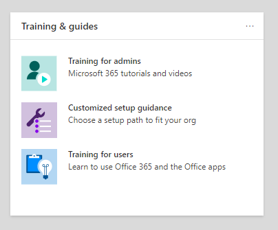

# Guias de configuração para os serviços Microsoft 365 e Office 365Setup guides for Microsoft 365 and Office 365 services

Os guias de instalação do Microsoft 365 e do Office 365 apresentam orientações e recursos personalizados para planejar e implantar seu locatário, aplicativos e serviços.Microsoft 365 and Office 365 setup guides give you tailored guidance and resources for planning and deploying your tenant, apps, and services. Esses guias são criados usando as mesmas práticas recomendadas que os especialistas de integração do [Microsoft 365 FastTrack](https://www.microsoft.com/fasttrack/microsoft-365) compartilham em interações individuais e estão disponíveis para todos os administradores no Centro de administração do Microsoft 365.These guides are created using the same best practices that [Microsoft 365 FastTrack](https://www.microsoft.com/fasttrack/microsoft-365) onboarding specialists share in individual interactions, and they're available to all admins within the Microsoft 365 admin center. Eles fornecem informações sobre a configuração do produto, habilitando recursos de segurança, implantando ferramentas de colaboração e fornecem scripts para acelerar as implantações avançadas.They give information on product setup, enabling security features, deploying collaboration tools, and provide scripts to speed up advanced deployments.

## Como acessar os guias de configuração no Centro de administração do Microsoft 365How to access setup guides in the Microsoft 365 admin center

Os guias de configuração podem ser acessados na página de orientação [de](https://aka.ms/setupguidance) Instalação no Centro de administração do Microsoft 365.The setup guides are accessible from the [Setup guidance](https://aka.ms/setupguidance) page in the Microsoft 365 admin center. Você pode acompanhar o status do seu progresso e tem a opção de retornar a qualquer momento para concluir um guia.You can keep track of the status of your progress and you have the option to return at any time to complete a guide. Para chegar à **página de diretrizes da** Instalação:To reach the **Setup guidance** page:

1. No centro [de administração do Microsoft 365,](https://admin.microsoft.com/)vá para a **home** page.In the [Microsoft 365 admin center](https://admin.microsoft.com/), go to the **Home** page.

2. Encontre o **cartão de guias de & treinamento.**Find the **Training & guides** card. 

   

3. Selecione **diretrizes de instalação personalizadas.**Select **Customized setup guidance**.

   

>[!NOTE]
>As permissões de administrador de locatários são necessárias para acessar o Centro de administração do Microsoft 365.Tenant administrator permissions are required to access the Microsoft 365 admin center.

## Como os guias de instalação funcionam no Centro de administração do Microsoft 365?How do setup guides work in the Microsoft 365 admin center?

Cada guia fornece instruções passo a passo, recursos, artigos e, quando necessário, scripts que você pode usar para fazer alterações na configuração.Each guide provides you with step-by-step instructions, resources, articles, and when needed, scripts you can use to make configuration changes. Esses guias fornecem opções que refletem as necessidades específicas de pequenas e grandes organizações.These guides provide you with choices that reflect the specific needs of both small and large organizations. Além disso, as diretrizes incluem assistência para administradores novos e mais experientes.Additionally, the guidance includes assistance for both new and more experienced admins.

Você pode usar os guias para saber mais sobre recursos específicos do Microsoft 365 e do Office 365 durante a fase de planejamento, durante a implantação e distribuição, ou para revisá-los depois de concluir uma implantação para modificar uma configuração.You can use the guides to learn more about specific Microsoft 365 and Office 365 features during the planning phase, during deployment and rollout, or to revisit them after you've completed a deployment to modify a setting.

## Guias para configuração inicialGuides for initial setup

### Preparar seu ambientePrepare your environment

O [guia Preparar seu ambiente](https://aka.ms/prepareyourenvironment) ajuda você a preparar o ambiente da sua organização para os serviços do Microsoft 365 e Office 365.The [Prepare your environment](https://aka.ms/prepareyourenvironment) guide helps you prepare your organization's environment for Microsoft 365 and Office 365 services. Independentemente de suas metas, há tarefas que você precisará concluir para garantir uma implantação bem-sucedida.Regardless of your goals, there are tasks you'll need to complete to ensure a successful deployment. Para evitar erros ao preparar seu ambiente, você recebe instruções passo a passo para conectar seu domínio, adicionar usuários, atribuir licenças, configurar emails com o Exchange Online e instalar ou implantar aplicativos do Office.To avoid any errors while preparing your environment, you're provided with step-by-step instructions to connect your domain, add users, assign licenses, set up email with Exchange Online, and install or deploy Office apps. 

### Consultor de configuração de emailEmail setup advisor

O [consultor de configuração](https://aka.ms/office365setup) de email fornece as orientações passo a passo necessárias para configurar o Exchange Online para sua organização.The [Email setup advisor](https://aka.ms/office365setup) provides you with the step-by-step guidance needed for configuring Exchange Online for your organization. Isso inclui configurar novas contas de email, migrar emails e configurar a proteção de email.This includes setting up new email accounts, migrating email, and configuring email protection. Para uma configuração de email bem-sucedida, use este consultor e você receberá o método de migração recomendado com base no sistema de email atual da sua organização, no número de caixas de correio que estão sendo migradas e em como você deseja gerenciar usuários e seu acesso.For a successful email set up, use this advisor and you'll receive the recommended migration method based on your organization's current mail system, the number of mailboxes being migrated, and how you want to manage users and their access.

### Migrar itens de calendário e contatos do GmailMigrate Gmail contacts and calendar items

Quando você migra a caixa de correio de um usuário do Gmail para o Microsoft 365, as mensagens de email são migradas, mas os contatos e itens de calendário não são.When you migrate a Gmail user's mailbox to Microsoft 365, email messages are migrated, but contacts and calendar items are not. O consultor de calendário e contatos do [Gmail](https://aka.ms/gmailcontactscalendar) fornece etapas para importar contatos do Google e itens de calendário do Google para o Microsoft 365 usando métodos de importação e exportação com o Outlook.com, o cliente do Outlook ou o PowerShell.The [Gmail contacts and calendar advisor](https://aka.ms/gmailcontactscalendar) provides steps for importing Google contacts and Google calendar items to Microsoft 365 using import and export methods with Outlook.com, the Outlook client, or PowerShell.

### Consultor de implantação do Microsoft 365Microsoft 365 deployment advisor

O consultor de implantação do [Microsoft 365](https://aka.ms/microsoft365setupguide) fornece orientações ao configurar ferramentas de produtividade, políticas de segurança e recursos de gerenciamento de dispositivos.The [Microsoft 365 deployment advisor](https://aka.ms/microsoft365setupguide) provides you with guidance when setting up productivity tools, security policies, and device management capabilities. Com uma assinatura do Microsoft 365 Business Premium ou do Microsoft 365 para empresas, você pode usar esse consultor para configurar e configurar os dispositivos da sua organização.With a Microsoft 365 Business Premium or Microsoft 365 for enterprise subscription, you can use this advisor to set up and configure your organization's devices. 

Você receberá orientações e acesso a recursos para habilitar seus serviços de nuvem, atualizar dispositivos para a versão mais recente com suporte do Windows 10 e ingressar dispositivos no Azure Active Directory (Azure AD), tudo em um local central.You'll receive guidance and access to resources to enable your cloud services, update devices to the latest supported version of Windows 10, and join devices to Azure Active Directory (Azure AD), all in one central location.

### Guia de configuração de trabalho remotoRemote work setup guide

O [guia de](https://aka.ms/remoteworksetup) configuração de trabalho remoto fornece às organizações as dicas e os recursos necessários para garantir que os usuários possam trabalhar remotamente, que seus dados sejam seguros e que as credenciais dos usuários sejam salvas.The [Remote work setup guide](https://aka.ms/remoteworksetup) provides organizations with the tips and resources needed to ensure your users can successfully work remotely, your data is secure, and users' credentials are safeguarded. 

Você receberá orientações para otimizar o tráfego de dispositivos dos funcionários remotos para os recursos do Microsoft 365 na nuvem e na rede da sua organização, o que reduzirá a diminuição da infraestrutura vpn de acesso remoto.You'll receive guidance to optimize remote workers' device traffic to both Microsoft 365 resources in the cloud and your organization's network, which will reduce the strain on your remote access VPN infrastructure. 

### Guia de configuração da Área de Trabalho Virtual do WindowsWindows Virtual Desktop setup guide

A Área de Trabalho Virtual do Windows é um serviço abrangente de virtualização de aplicativos e área de trabalho em execução na nuvem.Windows Virtual Desktop is a comprehensive desktop and app virtualization service running in the cloud. É a única infraestrutura de área de trabalho virtual (VDI) que oferece gerenciamento simplificado, Várias sessões do Windows 10, otimizações para Aplicativos do Microsoft 365 e suporte para ambientes RDS (Serviços de Área de Trabalho Remota).It's the only virtual desktop infrastructure (VDI) that delivers simplified management, multi-session Windows 10, optimizations for Microsoft 365 Apps, and support for Remote Desktop Services (RDS) environments. Implante e dimensione seus aplicativos e áreas de trabalho do Windows para o Azure em minutos e receba recursos de segurança e conformidade integrados.Deploy and scale your Windows desktops and apps to Azure in minutes and get built-in security and compliance features. 

O [guia de configuração da Área](https://aka.ms/wvdsetupguide) de Trabalho Virtual do Windows fornece aos administradores recursos de planejamento e os pré-requisitos para implantação, orientação de configuração e recursos adicionais.The [Windows Virtual Desktop setup guide](https://aka.ms/wvdsetupguide) provides administrators with planning resources and the prerequisites for deployment, setup guidance, and additional resources. 

### Guia de configuração do Microsoft EdgeMicrosoft Edge setup guide

O Microsoft Edge foi refeita do zero para trazer a você a compatibilidade e o desempenho de nível mundial, a segurança e a privacidade que você ganhou e novos recursos projetados para trazer o melhor da Web.Microsoft Edge has been rebuilt from the ground up to bring you world-class compatibility and performance, the security and privacy you deserve, and new features designed to bring you the best of the web.

O guia de configuração do [Microsoft Edge](https://aka.ms/edgeadvisor) ajudará você a configurar o Enterprise Site Discovery para ver quais sites acessados em sua organização talvez precisem usar o modo IE, revisar e configurar recursos de segurança importantes, configurar políticas de privacidade e políticas adicionais para atender aos requisitos da sua organização e gerenciar o acesso à Web em seus dispositivos.The [Microsoft Edge setup guide](https://aka.ms/edgeadvisor) will help you configure Enterprise Site Discovery to see which sites accessed in your org might need to use IE mode, review and configure important security features, configure privacy policies and additional policies to meet your org's requirements, and manage web access on your devices. Você pode baixar o Microsoft Edge em dispositivos individuais ou mostraremos como implantar para vários usuários em sua organização com o Configuration Manager ou o Microsoft Intune.You can download Microsoft Edge to individual devices, or we'll show you how to deploy to multiple users in your org with Configuration Manager or Microsoft Intune. 

### Guia de configuração da Pesquisa da MicrosoftMicrosoft Search setup guide

A Pesquisa da Microsoft ajuda sua organização a encontrar o que precisa para concluir o que está trabalhando.Microsoft Search helps your organization find what they need to complete what they're working on. Seja pesquisando pessoas, arquivos, organogramas, sites ou respostas para perguntas comuns, sua organização pode usar a Pesquisa da Microsoft durante todo o dia de trabalho para obter respostas.Whether it's searching for people, files, org charts, sites, or answers to common questions, your org can use Microsoft Search throughout their workday to get answers.

O [guia de configuração da](https://aka.ms/MicrosoftSearchSetup) Pesquisa da Microsoft ajuda você a configurar a Pesquisa da Microsoft se você quiser pilotá-la para um grupo de usuários ou roll-out para todos em sua organização. Você atribuirá administradores de Pesquisa e editores de Pesquisa e personalizará a experiência de pesquisa para seus usuários com respostas e opções adicionais, como adicionar a extensão do Bing ao Chrome ou configurar o Bing como mecanismo de pesquisa padrão.The [Microsoft Search setup guide](https://aka.ms/MicrosoftSearchSetup) helps you configure Microsoft Search whether you want to pilot it to a group of users or roll it out to everyone in your org. You'll assign Search admins and Search editors and then customize the search experience for your users with answers and additional options, like adding the Bing extension to Chrome or setting Bing as your default search engine.

### Guia de configuração de co-gerenciamento do Intune Configuration ManagerIntune Configuration Manager co-management setup guide

Use o guia de configuração de [co-gerenciamento do Intune Configuration Manager](https://aka.ms/comanagementsetup) para dispositivos cliente existentes do Configuration Manager e novos dispositivos baseados na Internet que sua organização deseja gerenciar em co-gerenciar com o Microsoft Intune e o Configuration Manager.Use the [Intune Configuration Manager co-management setup guide](https://aka.ms/comanagementsetup) for existing Configuration Manager client devices and new internet-based devices that your org wants to co-manage with both Microsoft Intune and Configuration Manager. Este guia de implantação de co-gerenciamento permite que você gerencie dispositivos Windows 10 e adiciona novas funcionalidades aos dispositivos da sua organização, enquanto recebe os benefícios de ambas as soluções.This co-management deployment guide allows you to manage Windows 10 devices and adds new functionality to your org's devices, while receiving the benefits of both solutions.

## Guias para autenticação e acessoGuides for authentication and access

### Guia de configuração do Azure ADAzure AD setup guide

O [guia de instalação do Azure AD](https://aka.ms/aadpguidance) fornece informações para garantir que sua organização tenha uma base de segurança forte.The [Azure AD setup guide](https://aka.ms/aadpguidance) provides information to ensure your organization has a strong security foundation. Neste guia, você configurará os recursos iniciais, como o controle de acesso baseado em função do Azure (Azure RBAC) para administradores, o Azure AD Connect para seu diretório local e o Azure AD Connect Health, para que você possa monitorar a saúde da sua identidade híbrida durante sincronizações automatizadas.In this guide you’ll set up initial features, like Azure role-based access control (Azure RBAC) for admins, Azure AD Connect for your on-premises directory, and Azure AD Connect Health, so you can monitor your hybrid identity's health during automated syncs. 

Ele também inclui informações essenciais sobre a habilitação de redefinições de senha de autoatendenciamento, acesso condicional e entrada integrada de terceiros, incluindo proteção avançada de identidade opcional e automação de provisionamento do usuário.It also includes essential information on enabling self-service password resets, conditional access and integrated third-party sign-on including optional advanced identity protection and user provisioning automation.

### Sincronizar usuários do diretório da sua organizaçãoSync users from your org’s directory

Os [usuários de sincronização do assistente de diretório da](https://aka.ms/directorysyncsetup) sua organização orientam você durante adoção da sincronização de diretórios.The [Sync users from your org’s directory wizard](https://aka.ms/directorysyncsetup) walks you through turning on directory synchronization. Isso reúne suas identidades locais e de nuvem para facilitar o acesso e o gerenciamento simplificado.This brings your on-premises and cloud identities together for easier access and simplified management. Desbloqueie novos recursos, como o single sign-on, opções de autoatendência, provisionamento automático de conta, controles de acesso condicional e políticas de conformidade.Unlock new capabilities, like single sign-on, self-service options, automatic account provisioning, conditional access controls, and compliance policies. Isso garante que os usuários tenham acesso aos recursos necessários de qualquer lugar.This ensures that your users have access to the resources they need from anywhere.

### Planejar sua implantação sem senhaPlan your passwordless deployment

Atualize para uma abordagem de entrada alternativa que permita que os usuários acessem seus dispositivos com segurança com um dos seguintes métodos de autenticação sem senha:Upgrade to an alternative sign-in approach that allows users to access their devices securely with one of the following passwordless authentication methods: 

- Windows Hello para EmpresasWindows Hello for Business
- O aplicativo Microsoft AuthenticatorThe Microsoft Authenticator app
- Chaves de segurançaSecurity keys 

Use o [assistente de](https://aka.ms/passwordlesssetup) implantação sem senha para descobrir os melhores métodos de autenticação sem senha para usar e receber orientações sobre como implantá-los.Use the [Plan your passwordless deployment wizard](https://aka.ms/passwordlesssetup) to discover the best passwordless authentication methods to use and receive guidance on how to deploy them. 

### Planejar sua implantação de redefinição de senha de autoatendado (SSPR)Plan your self-service password reset (SSPR) deployment

Dê aos usuários a capacidade de alterar ou redefinir suas senhas independentemente, se a conta estiver bloqueada ou se esquecerem da senha sem a necessidade de entrar em contato com um engenheiro de helpdesk.Give users the ability to change or reset their password independently, if their account is locked, or they forget their password without the need to contact a helpdesk engineer. 

Use o assistente de implantação de redefinição de senha de autoatendado para receber artigos relevantes e instruções para configurar as opções apropriadas do portal do Azure para [ajudá-lo](https://aka.ms/SSPRSetupGuide) a implantar o SSPR em seu ambiente.Use the [Plan your self-service password reset deployment wizard](https://aka.ms/SSPRSetupGuide) to receive relevant articles and instructions for configuring the appropriate Azure portal options to help you deploy SSPR in your environment.

### Consultor de implantação dos Serviços de Federação do Active Directory (AD FS)Active Directory Federation Services (AD FS) deployment advisor

O consultor de implantação do [AD FS](https://aka.ms/adfsguidance) fornece orientações passo a passo sobre como implantar uma infraestrutura local do AD FS que autentica os usuários dos serviços do Microsoft 365 e do Office 365.The [AD FS deployment advisor](https://aka.ms/adfsguidance) provides you with step-by-step guidance on deploying an on-premises AD FS infrastructure that authenticates users for Microsoft 365 and Office 365 services. Com este guia, sua organização pode revisar os componentes e requisitos do AD FS, adquirir e instalar certificados SSL necessários para a implantação e instalar um servidor proxy de aplicativo Web necessário.With this guide, your organization can review AD FS components and requirements, acquire and install SSL certificates that are necessary for deployment, and install a required web application proxy server. 

## Guias de segurança e conformidadeGuides for security and compliance

### Guia de configuração do Microsoft IntuneMicrosoft Intune setup guide 

Configurar o Microsoft Intune para gerenciar dispositivos em sua organização.Set up Microsoft Intune to manage devices in your organization. Para controle total dos dispositivos corporativos, você usará os recursos de gerenciamento de dispositivo móvel (MDM) do Intune.For full control of corporate devices, you’ll use Intune’s mobile device management (MDM) features. Para gerenciar os dados da sua organização em dispositivos compartilhados e pessoais, você pode usar os recursos de gerenciamento de aplicativo móvel (MAM) do Intune.To manage your organization's data on shared and personal devices, you can use Intune’s mobile application management (MAM) features. 

Com o guia de instalação do [Microsoft Intune,](https://aka.ms/intunesetupguide)você configurará políticas de conformidade de dispositivos e aplicativos, atribuirá políticas de proteção de aplicativos e monitorará o status de proteção de dispositivos e aplicativos.With the [Microsoft Intune setup guide](https://aka.ms/intunesetupguide), you'll set up device and app compliance policies, assign app protection policies, and monitor the device and app protection status. 

### Consultor do Microsoft Defender para Pontos de ExtremidadeMicrosoft Defender for Endpoint advisor

O [consultor de pontos](https://aka.ms/mdatpsetup) de extremidade do Microsoft Defender fornece instruções que ajudarão sua rede corporativa a evitar, detectar, investigar e responder a ameaças avançadas.The [Microsoft Defender for Endpoint advisor](https://aka.ms/mdatpsetup) provides instructions that will help your enterprise network prevent, detect, investigate, and respond to advanced threats. Faça uma avaliação informada da vulnerabilidade da sua organização e decida quais são os melhores métodos de configuração e pacote de implantação.Make an informed assessment of your organization's vulnerability and decide which deployment package and configuration methods are best. 

>[!NOTE]
>Uma Licença de Volume da Microsoft é necessária para o Microsoft Defender para o Ponto de Extremidade.A Microsoft Volume License is required for Microsoft Defender for Endpoint.

### Guia de configuração do Proteção do Exchange OnlineExchange Online Protection setup guide

O Microsoft Proteção do Exchange Online (EOP) é um serviço de filtragem de email baseado em nuvem para proteção contra spam e malware, com recursos para proteger sua organização contra violações de política de mensagens.Microsoft Exchange Online Protection (EOP) is a cloud-based email filtering service for protection against spam and malware, with features to safeguard your organization from messaging policy violations. 

Use o guia de configuração do Proteção do [Exchange Online](https://aka.ms/EOPguidance) para configurar o EOP selecionando qual dos três cenários de implantação caixas de correio locais, caixas de correio híbridas (combinação de caixas de correio locais e na nuvem) ou todas as caixas de correio na nuvem se ajustam à sua &mdash; &mdash; organização.Use the [Exchange Online Protection setup guide](https://aka.ms/EOPguidance) to set up EOP by selecting which of the three deployment scenarios&mdash;on-premises mailboxes, hybrid (mix of on-premises and cloud) mailboxes, or all cloud mailboxes&mdash;fits your organization. O guia fornece informações e recursos para configurar e revisar o licenciamento do usuário, atribuir permissões no Centro de administração do Microsoft 365 e configurar as políticas anti-malware e & spam da sua organização no Centro de Conformidade e Segurança.The guide provides information and resources to set up and review your user's licensing, assign permissions in the Microsoft 365 admin center, and configure your organization's anti-malware and spam policies in the Security & Compliance Center. 

### Consultor do Microsoft Defender para Office 365Microsoft Defender for Office 365 advisor

O [consultor do Microsoft Defender para Office 365](https://aka.ms/oatpsetup) protege sua organização contra ameaças mal-intencionadas que seu ambiente pode encontrar por meio de mensagens de email, links e ferramentas de colaboração de terceiros.The [Microsoft Defender for Office 365 advisor](https://aka.ms/oatpsetup) safeguards your organization against malicious threats that your environment might encounter through email messages, links, and third-party collaboration tools. Este guia fornece os recursos e informações para ajudá-lo a preparar e identificar o plano do Defender for Office 365 para se ajustar às necessidades da sua organização.This guide provides you with the resources and information to help you prepare and identify the Defender for Office 365 plan to fit your organization's needs. 

### Guia de configuração da proteção de informações da MicrosoftMicrosoft information protection setup guide

Obter uma visão geral dos recursos que você pode aplicar à sua estratégia de Proteção de Informações para que você possa ter certeza de que suas informações confidenciais estão protegidas.Get an overview of the capabilities you can apply to your Information Protection strategy so you can be confident your sensitive information is protected. Use uma abordagem de ciclo de vida em quatro estágios na qual você descobre, classifica, protege e monitora as informações confidenciais.Use a four-stage lifecycle approach in which you discover, classify, protect, and monitor sensitive information. O [guia de configuração de proteção](https://aka.ms/mipsetupguide) de informações da Microsoft fornece orientações para concluir cada um desses estágios.The [Microsoft information protection setup guide](https://aka.ms/mipsetupguide) provides guidance for completing each of these stages.

### Guia de configuração de governança de informações da MicrosoftMicrosoft information governance setup guide

O guia de configuração de governança de Informações da [Microsoft](https://aka.ms/migsetupguide) fornece as informações necessárias para configurar e gerenciar a estratégia de governança da sua organização, para garantir que seus dados são classificados e gerenciados de acordo com as diretrizes de ciclo de vida específicas definidas.The [Microsoft Information governance setup guide](https://aka.ms/migsetupguide) provides you with the information you'll need to set up and manage your organization's governance strategy, to ensure that your data is classified and managed according to the specific lifecycle guidelines you set. Com este guia, você aprenderá a criar, aplicar automaticamente ou publicar rótulos, políticas de rótulo e políticas de retenção que são aplicadas aos registros de conformidade e conteúdo reutilizável da sua organização.With this guide, you'll learn how to create, auto-apply, or publish labels, label policies, and retention policies that are applied to your organization's reusable content and compliance records. Você também obterá informações sobre como importar arquivos CSV com um plano de arquivo para cenários em massa ou para aplicação manual a documentos individuais.You'll also get information on importing CSV files with a file plan for bulk scenarios or for applying them manually to individual documents. 

## Guias para colaboraçãoGuides for collaboration

### Consultor de implantação do Microsoft 365 AppsMicrosoft 365 Apps deployment advisor

O consultor de implantação do [Microsoft 365 Apps](https://aka.ms/OPPquickstartguide) ajuda você a fazer com que os dispositivos dos usuários executam a versão mais recente dos produtos do Office, como Word, Excel, PowerPoint e OneNote.The [Microsoft 365 Apps deployment advisor](https://aka.ms/OPPquickstartguide) helps you get your users' devices running the latest version of Office products like Word, Excel, PowerPoint, and OneNote. Você obterá orientações sobre os vários métodos de implantação que incluem opções de auto-instalação fáceis para implantações corporativas com ferramentas de gerenciamento.You'll get guidance on the various deployment methods that include easy self-install options to enterprise deployments with management tools. As instruções ajudarão você a avaliar seu ambiente, descobrir seus requisitos de implantação específicos e implementar as ferramentas de suporte necessárias para garantir uma instalação bem-sucedida.The instructions will help you assess your environment, figure out your specific deployment requirements, and implement the necessary support tools to ensure a successful install. 

### Guia de configuração de aplicativos móveisMobile apps setup guide

O [guia de instalação de aplicativos](https://aka.ms/officeappguidance) móveis fornece instruções para baixar e instalar aplicativos do Office em seus dispositivos móveis Windows, iOS e Android.The [Mobile apps setup guide](https://aka.ms/officeappguidance) provides instructions for the download and installation of Office apps on your Windows, iOS, and Android mobile devices. Este guia fornece informações passo a passo para baixar e instalar aplicativos do Microsoft 365 e office 365 em seus dispositivos de telefone e tablet.This guide provides you with step-by-step information to download and install Microsoft 365 and Office 365 apps on your phone and tablet devices.

### Guia de configuração do Microsoft TeamsMicrosoft Teams setup guide

O guia de configuração do [Microsoft Teams](https://aka.ms/teamsguidance) fornece à sua organização orientações para configurar espaços de trabalho de equipe que hospedam conversas em tempo real por meio de mensagens, chamadas e reuniões de áudio ou vídeo para a equipe e a comunicação privada.The [Microsoft Teams setup guide](https://aka.ms/teamsguidance) provides your organization with guidance to set up team workspaces that host real-time conversations through messaging, calls, and audio or video meetings for both team and private communication. Você receberá as instruções para determinar os requisitos de rede da sua organização usando a ferramenta Planejador de Rede e o consultor do Teams no centro de administração do Teams.You'll receive the instructions for determining your organization's network requirements by using the Network Planner tool and the Teams advisor within the Teams admin center. Uma vez concluída a implantação, o guia incluirá recursos úteis para começar a utilizar o Teams.Once your deployment is complete, the guide includes helpful resources to get started using Teams.

### Guia de configuração do SharePointSharePoint setup guide

O guia de configuração do [SharePoint](https://aka.ms/spoguidance) ajuda você a configurar o armazenamento e o gerenciamento de conteúdo de documentos do SharePoint, criar sites, configurar o compartilhamento externo, migrar dados e definir configurações avançadas e impulsionar o envolvimento e a comunicação do usuário em sua organização.The [SharePoint setup guide](https://aka.ms/spoguidance) helps you set up your SharePoint document storage and content management, create sites, configure external sharing, migrate data and configure advanced settings, and drive user engagement and communication within your organization. Você seguirá as etapas para configurar suas políticas de permissão de compartilhamento de conteúdo, escolher suas ferramentas de sincronização de migração, bem como habilitar as configurações de segurança para seu ambiente do SharePoint.You'll follow steps for configuring your content-sharing permission policies, choose your migration sync tools, as well as enable the security settings for your SharePoint environment. 

### Guia de configuração do OneDriveOneDrive setup guide

Use o [guia de configuração do OneDrive](https://aka.ms/ODfBquickstartguide) para começar a usar os recursos de armazenamento, compartilhamento, colaboração e sincronização de arquivos do OneDrive.Use the [OneDrive setup guide](https://aka.ms/ODfBquickstartguide) to get started with OneDrive file storage, sharing, collaboration, and syncing capabilities. O OneDrive fornece um local central onde os usuários podem sincronizar seus arquivos do Microsoft 365 Apps, configurar o compartilhamento externo, migrar dados do usuário e definir configurações avançadas de segurança e acesso ao dispositivo.OneDrive provides a central location where users can sync their Microsoft 365 Apps files, configure external sharing, migrate user data, and configure advanced security and device access settings. O guia de configuração do OneDrive pode ser implantado usando uma assinatura do OneDrive ou um plano autônomo do OneDrive.The OneDrive setup guide can be deployed using a OneDrive subscription or a standalone OneDrive plan. 

### Consultor de implantação do YammerYammer deployment advisor

Conecte-se e envolva-se em toda a organização com o Yammer.Connect and engage across your organization with Yammer. O [consultor de implantação do Yammer](https://aka.ms/yammerdeploymentguide) prepara sua rede do Yammer adicionando domínios, definindo administradores e combinando redes do Yammer.The [Yammer deployment advisor](https://aka.ms/yammerdeploymentguide) prepares your Yammer network by adding domains, defining admins, and combining Yammer networks. Você obterá orientações para implantar o Yammer e personalizar a aparência, configurar a segurança e a conformidade e refinar as configurações.You'll get guidance to deploy Yammer and then customize the look, configure security and compliance, and refine the settings.

## Assistentes avançadosAdvanced wizards

### Atualização no local com o Configuration ManagerIn-place upgrade with Configuration Manager

Use a atualização local com o guia [do Configuration Manager](https://aka.ms/win10upgradedemo) ao atualizar dispositivos Windows 7 e Windows 8.1 para a versão mais recente do Windows 10.Use the [In-place upgrade with Configuration Manager guide](https://aka.ms/win10upgradedemo) when upgrading Windows 7 and Windows 8.1 devices to the latest version of Windows 10. Você usará o script fornecido para verificar os pré-requisitos e configurar automaticamente uma atualização local.You'll use the script provided to check the prerequisites and automatically configure an in-place upgrade.

### Implantar o Office para seus usuáriosDeploy Office to your users

Implante aplicativos do Office da nuvem com a capacidade de personalizar sua instalação usando a Ferramenta de Implantação do Office.Deploy Office apps from the cloud with the ability to customize your installation by using the Office Deployment Tool. O [guia Implantar o Office ](https://aka.ms/proplusodt) para seus usuários ajuda você a criar uma configuração personalizada do Office com configurações avançadas ou pode usar uma configuração recomendada pré-criada.The [Deploy Office to your users guide ](https://aka.ms/proplusodt) helps you create a customized Office configuration with advanced settings, or you can use a pre-built recommended configuration. Se os usuários estão realizando uma instalação automática ou se você está implantando para os usuários individualmente ou em massa, este assistente avançado fornece instruções passo a passo para dar aos usuários uma instalação do Office adaptada à sua organização.Whether your users are conducting a self-install or you're deploying to your users individually or in bulk, this advanced wizard provides you with step-by-step instructions to give users an Office installation tailored to your organization.

### Implantar o Office para usuários remotosDeploy Office to remote users

Agora que trabalhar remotamente é a norma, os usuários precisam receber as configurações do Office da sua organização quando não estão conectados à sua rede interna ou ao usar seus próprios dispositivos.Now that working remotely is the norm, users need to receive your organization's Office settings when they're not connected to your internal network or when using their own devices. 

Use o [guia Implantar o Office](https://aka.ms/officeremoteinstall) para usuários remotos para criar uma instalação personalizada do Office e, em seguida, enviar aos usuários um script do PowerShell gerado que instalará perfeitamente o Office com sua configuração.Use the [Deploy Office to remote users guide](https://aka.ms/officeremoteinstall) to create a customized Office installation and then send users a generated PowerShell script that will seamlessly install Office with your configuration.

### Implantar e atualizar os Aplicativos do Microsoft 365 com o Configuration ManagerDeploy and update Microsoft 365 Apps with Configuration Manager

Para organizações que usam o Gerenciador de Configurações, você pode usar o assistente Implantar e atualizar os Aplicativos do [Microsoft 365](https://aka.ms/oppinstall) com o Configuration Manager para gerar um script que configurará automaticamente sua implantação do Microsoft 365 Apps usando as práticas recomendadas pelos engenheiros do FastTrack.For organizations using Configuration Manager, you can use the [Deploy and update Microsoft 365 Apps with Configuration Manager advisor](https://aka.ms/oppinstall) to generate a script that will automatically configure your Microsoft 365 Apps deployment using best practices recommended by FastTrack engineers. Use este guia para criar seus grupos de implantação, personalizar seus aplicativos e recursos do Office, configurar instalações dinâmicas ou enxutos e, em seguida, executar o script para criar os aplicativos, regras de implantação automática e coleções de dispositivos que você precisa para direcionar sua implantação.Use this guide to build your deployment groups, customize your Office apps and features, configure dynamic or lean installations, and then run the script to create the applications, automatic deployment rules, and device collections you need to target your deployment. 
