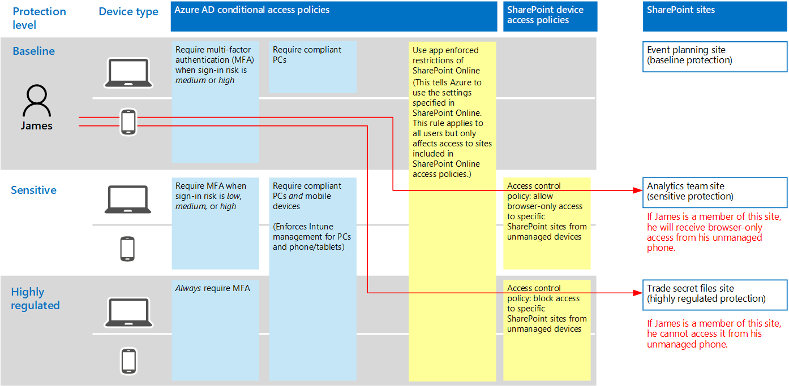

# Recomendações de política para a proteção de arquivos e sites do SharePoint
Este artigo descreve como implementar a identidade recomendada e políticas de acesso de dispositivo para proteger o SharePoint Online e o OneDrive for Business. Esta orientação amplia a [identidade e políticas de acesso de dispositivo comuns](identity-access-policies.md). 

Estas recomendações se baseiam em três níveis diferentes de segurança e proteção para arquivos do SharePoint que podem ser aplicadas com base na granulação das suas necessidades: **linha de base**, **confidenciais**e **altamente regulamentado**. Você pode aprender mais sobre esses níveis de segurança e os sistemas operacionais do cliente recomendado, referenciados por essas recomendações no [a visão geral](microsoft-365-policies-configurations.md).

Além de implementar esta orientação, certifique-se de configurar sites do SharePoint com a quantidade correta de proteção, incluindo a definição de permissões apropriadas para conteúdo confidencial e altamente regulamentado. Para obter mais informações sobre como criar sites para proteção de linha de base, confidenciais e altamente regulamentado, consulte [arquivos e sites seguro do SharePoint Online](https://docs.microsoft.com/office365/enterprise/secure-sharepoint-online-sites-and-files). 

## Atualizando diretivas comuns para incluir o SharePoint e o OneDrive for Business
O diagrama a seguir ilustra o conjunto de diretivas recomendadas para proteger os arquivos no SharePoint Online e o OneDrive for Business. Indica quais políticas devem ser atualizadas ou recém-criadas para adicionar a proteção para o SharePoint Online e o OneDrive for Business.

Se você incluiu o SharePoint Online quando você criou as políticas comuns, você só precisa criar novas políticas. Ao configurar regras de acesso condicional, SharePoint Online inclui OneDrive for Business.

As novas políticas implementam a proteção de dispositivo do conteúdo confidencial e altamente regulamentado aplicando requisitos específicos de acesso aos sites do SharePoint que você especificar. 

A tabela a seguir lista as políticas que é preciso examinar e atualizar ou criar novos para o SharePoint Online. As políticas comuns link para as instruções de configuração associada no artigo [comuns políticas de acesso de dispositivo e identidade](identity-access-policies.md) .

|Nível de Proteção|Diretivas|Mais informações|
|:---------------|:-------|:----------------|
|**Linha de base**|[Exige MFA após a entrada risco *média* ou *alta*](identity-access-policies.md#require-mfa-based-on-sign-in-risk)|Incluir o SharePoint Online na atribuição de aplicativos de nuvem|
|        |[Bloquear os clientes que não oferecem suporte a autenticação moderna](identity-access-policies.md#block-clients-that-dont-support-modern-authentication)|Incluir o SharePoint Online na atribuição de aplicativos de nuvem|
|        |[Definir políticas de proteção de aplicativos](identity-access-policies.md#define-app-protection-policies)|Certifique-se de que todos os aplicativos recomendados estão incluídos na lista de aplicativos. Certifique-se atualizar a política em cada plataforma (iOS, Android, Windows)|
|        |[Exigir compatível com PCs](identity-access-policies.md#require-compliant-pcs-but-not-compliant-phones-and-tablets)|Inclua o SharePoint Online na lista de aplicativos de nuvem|
|        |[App imposta restrições de uso no SharePoint Online](#use-app-enforced-restrictions-in-sharepoint-online)|Adicione essa nova política. Isso informa o Azure AD para usar as configurações especificadas no SharePoint Online. Esta regra se aplica a todos os usuários, mas afeta somente o acesso aos sites incluídos nas políticas de acesso do SharePoint Online|
|**Confidencial**|[Exige MFA após a entrada risco *baixa*, *média* ou *alta*](identity-access-policies.md#require-mfa-based-on-sign-in-risk)|Incluir o SharePoint Online nas atribuições de aplicativos de nuvem|
|         |[Exigir compatível com PCs *e* dispositivos móveis](identity-access-policies.md#require-compliant-pcs-and-mobile-devices)|Incluir SharePoint Online na lista de aplicativos de nuvem|
||[Diretiva de controle de acesso do SharePoint Online](#sharepoint-online-access-control-policies): permitir acesso somente navegador a sites do SharePoint específicos de dispositivos não gerenciados|Isso impede que a edição e o download de arquivos. Usar o PowerShell para especificar os sites|
|**Altamente controlado**|[*Sempre* solicitar MFA](identity-access-policies.md#require-mfa-based-on-sign-in-risk)|Incluir o SharePoint Online na atribuição de aplicativos de nuvem|
||[Diretiva de controle de acesso do SharePoint Online](#use-app-enforced-restrictions-in-sharepoint-online): bloquear o acesso a sites do SharePoint específicos de dispositivos não gerenciados|Usar o PowerShell para especificar os sites|

## Restrições impostas pelo aplicativo de uso no SharePoint Online
Se você implementar a controles de acesso no SharePoint Online, você deve criar essa política de acesso condicional no Azure AD para informar o Azure AD para aplicar as políticas que você configurar no SharePoint Online. Esta regra se aplica a todos os usuários, mas afeta somente o acesso aos sites que você especifica usando o PowerShell quando você criar os controles de acesso no SharePoint Online.

Para configurar desse tipo, consulte diretiva "bloquear ou o limite de acesso a contas de OneDrive ou conjuntos de sites específicos do SharePoint" neste artigo: [controlar o acesso de dispositivos não gerenciados](https://support.office.com/article/Control-access-from-unmanaged-devices-5ae550c4-bd20-4257-847b-5c20fb053622).

## Diretivas de controle de acesso do SharePoint Online
A Microsoft recomenda que você proteja o conteúdo nos sites do SharePoint com conteúdo confidencial e altamente regulamentado com controles de acesso de dispositivo. Você pode fazer isso criando uma política que especifica o nível de proteção e aplicar a proteção para os sites. 
- Sites confidenciais: permitir acesso somente de navegador. Isso impede que usuários edição e baixar arquivos.
- Altamente regulamentado sites: bloquear o acesso a dispositivos não gerenciados.

Consulte "bloquear ou limite o acesso às contas de OneDrive ou conjuntos de sites específicos do SharePoint" neste artigo: [controlar o acesso de dispositivos não gerenciados](https://support.office.com/article/Control-access-from-unmanaged-devices-5ae550c4-bd20-4257-847b-5c20fb053622) . 

## Como essas diretivas funcionam em conjunto
É importante entender que as permissões de site do SharePoint geralmente são baseadas em necessidade comercial de acesso aos sites. Essas permissões são gerenciadas por proprietários de sites e podem ser altamente dinâmicas. Usar políticas de acesso de dispositivo garante a proteção a esses sites, independentemente se os usuários são atribuídos a um grupo do Windows Azure AD do SharePoint associados a linha de base, minúsculas, ou altamente regulamentado proteção. 

A ilustração a seguir fornece um exemplo de como as políticas de acesso de dispositivo do SharePoint protegem o acesso aos sites.

Na ilustração:
- James é atribuído às políticas de acesso condicional associadas à proteção de linha de base, mas ele pode ser oferecido acesso aos sites do SharePoint associados à proteção sigilosas ou altamente regulamentado. 
- Se James acessa um site sigilosos ou altamente regulamentado, ele é um membro do uso do seu PC, o seu acesso será concedido desde que seu PC é compatível com.
- Se James acessa um site confidencial, que ele é um membro da usando seu telefone não gerenciado, que é permitido para usuários de linha de base, ele receberá somente de navegador acesso ao site confidencial devido a política de acesso de dispositivo configurado para este site. 
- Se James acessa um site altamente regulamentado, ele é um membro da usando seu telefone não gerenciado, ele será bloqueado devido a política de acesso configurada para este site. Ele só poderá acessar este site usando seu PC compatível ou não gerenciado.

<!---
##Block access to content from unmanaged devices (SharePoint admin center)
In the case of SharePoint Online, when a conditional access policy is applied to enforce Intune app protection policies, this might not apply to all applications that access SharePoint Online. Some applications, such as Exchange, have access to some SharePoint resources. For example, Exchange allows attaching SharePoint files by default. Conditional access policies applied to SharePoint Online will not restrict this access. 

To ensure baseline protection is applied uniformly, regardless of which service is accessing SharePoint Online and OneDrive for Business, configure access controls directly in SharePoint admin center. We recommend you configure the following:
- Block access from unmanaged devices. This includes devices that aren't compliant or joined to a domain. 
- Block access from app that don't use modern authentication.

See [Control access from unmanaged devices](https://support.office.com/article/Control-access-from-unmanaged-devices-5ae550c4-bd20-4257-847b-5c20fb053622).
-->

## Próximas etapas
[Proteger arquivos e sites do SharePoint Online](https://docs.microsoft.com/office365/enterprise/secure-sharepoint-online-sites-and-files)
