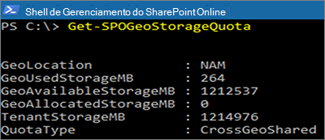

# <a name="sharepoint-storage-quotas-in-multi-geo-environments"></a>Cotas de armazenamento do SharePoint em ambientes multigeográficos

Por padrão, todas as localizações geográficas de um ambiente multigeográfico compartilham a cota de armazenamento disponível do locatário.

Com as configurações de cota de armazenamento geográfico do SharePoint é possível gerenciar a cota de armazenamento para cada localização geográfica. Ao alocar a cota de armazenamento de uma localização geográfica, ela torna-se a quantidade máxima de armazenamento disponível daquela localização geográfica e será deduzida da cota de armazenamento disponível do locatário. A cota de armazenamento do locatário disponível restante é, em seguida, compartilhada entre as localizações geográficas configuradas para as quais uma cota de armazenamento específica não foi alocada.

A cota de armazenamento do SharePoint de qualquer localização geográfica pode ser alocada pelo administrador do SharePoint Online ao conectar-se à localização central. Administradores geográficos para localizações via satélite podem exibir a cota de armazenamento, mas não podem alocá-la.

## <a name="configure-a-storage-quota-for-a-geo-location"></a>Definir uma cota de armazenamento para uma localização geográfica

Use o [Módulo do Microsoft SharePoint Online](https://www.microsoft.com/download/details.aspx?id=35588) e conecte-se a uma localização central para alocar a cota de armazenamento de uma localização geográfica.

Para alocar uma Cota de Armazenamento para um localização, execute o cmdlet:

```powershell
Set-SPOGeoStorageQuota -GeoLocation <geolocationcode> -StorageQuotaMB <value>
```

Para exibir a Cota de Armazenamento da localização geográfica atual, execute:

```powershell
Get-SPOGeoStorageQuota
```



Para exibir a Cota de Armazenamento para todas as localizações geográficas, execute:

```powershell
Get-SPOGeoStorageQuota -AllLocations
```

Para remover a cota de armazenamento alocado para uma localização geográfica, defina `StorageQuota value = 0`:

```powershell
Set-SPOGeoStorageQuota -GeoLocation <geolocationcode> -StorageQuotaMB 0
```
