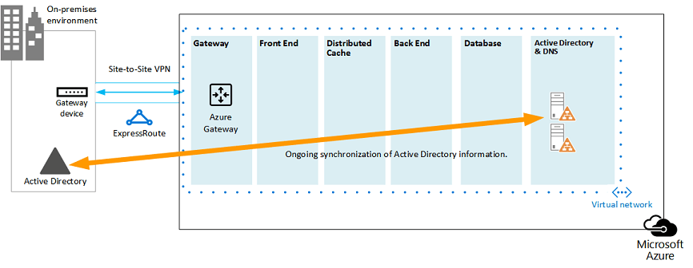

# <a name="sharepoint-server-2013-disaster-recovery-in-microsoft-azure"></a><span data-ttu-id="aa1d9-103">Recuperação de Desastre do SharePoint Server 2013 no Microsoft Azure</span><span class="sxs-lookup"><span data-stu-id="aa1d9-103">SharePoint Server 2013 Disaster Recovery in Microsoft Azure</span></span>

 <span data-ttu-id="aa1d9-104">Usando o Azure, você pode criar um ambiente de recuperação de desastres para seu farm do SharePoint local.</span><span class="sxs-lookup"><span data-stu-id="aa1d9-104">Using Azure, you can create a disaster-recovery environment for your on-premises SharePoint farm.</span></span> <span data-ttu-id="aa1d9-105">Este artigo descreve como criar e implementar esta solução.</span><span class="sxs-lookup"><span data-stu-id="aa1d9-105">This article describes how to design and implement this solution.</span></span>

 <span data-ttu-id="aa1d9-106">**Assista ao vídeo de visão geral de recuperação de desastres do SharePoint Server 2013**</span><span class="sxs-lookup"><span data-stu-id="aa1d9-106">**Watch the SharePoint Server 2013 disaster recovery overview video**</span></span>
> [!VIDEO https://www.microsoft.com/videoplayer/embed/1b73ec8f-29bd-44eb-aa3a-f7932784bfd9?autoplay=false]
  
 <span data-ttu-id="aa1d9-107">Quando um desastre atinge seu ambiente local do SharePoint, sua principal prioridade é executar o sistema novamente rapidamente.</span><span class="sxs-lookup"><span data-stu-id="aa1d9-107">When disaster strikes your SharePoint on-premises environment, your top priority is to get the system running again quickly.</span></span> <span data-ttu-id="aa1d9-108">A recuperação de desastres com o SharePoint é mais rápida e fácil quando você já tem um ambiente de backup em execução no Microsoft Azure.</span><span class="sxs-lookup"><span data-stu-id="aa1d9-108">Disaster recovery with SharePoint is quicker and easier when you have a backup environment already running in Microsoft Azure.</span></span> <span data-ttu-id="aa1d9-109">Este vídeo explica os principais conceitos de um ambiente de failover morno do SharePoint e complementa todos os detalhes disponíveis neste artigo.</span><span class="sxs-lookup"><span data-stu-id="aa1d9-109">This video explains the main concepts of a SharePoint warm failover environment and complements the full details available in this article.</span></span>
  
<span data-ttu-id="aa1d9-110">Use este artigo com o seguinte modelo de solução: Recuperação **de desastre do SharePoint no Microsoft Azure.**</span><span class="sxs-lookup"><span data-stu-id="aa1d9-110">Use this article with the following solution model: **SharePoint Disaster Recovery in Microsoft Azure**.</span></span>
  
<span data-ttu-id="aa1d9-111">[](https://go.microsoft.com/fwlink/p/?LinkId=392555)</span><span class="sxs-lookup"><span data-stu-id="aa1d9-111">[](https://go.microsoft.com/fwlink/p/?LinkId=392555)</span></span>
  
 <span data-ttu-id="aa1d9-112">[PDF](https://go.microsoft.com/fwlink/p/?LinkId=392555) |  [Visio](https://go.microsoft.com/fwlink/p/?LinkId=392554)</span><span class="sxs-lookup"><span data-stu-id="aa1d9-112">[PDF](https://go.microsoft.com/fwlink/p/?LinkId=392555) |  [Visio](https://go.microsoft.com/fwlink/p/?LinkId=392554)</span></span>
  
## <a name="use-azure-infrastructure-services-for-disaster-recovery"></a><span data-ttu-id="aa1d9-113">Usar os Serviços de Infraestrutura do Azure para recuperação de desastre</span><span class="sxs-lookup"><span data-stu-id="aa1d9-113">Use Azure Infrastructure Services for disaster recovery</span></span>

<span data-ttu-id="aa1d9-114">Muitas organizações não têm um ambiente de recuperação de desastres para o SharePoint, o que pode ser caro para criar e manter no local.</span><span class="sxs-lookup"><span data-stu-id="aa1d9-114">Many organizations do not have a disaster recovery environment for SharePoint, which can be expensive to build and maintain on-premises.</span></span> <span data-ttu-id="aa1d9-115">Os Serviços de Infraestrutura do Azure oferece opções atraentes para ambientes de recuperação de desastres que são mais flexíveis e mais caros do que as alternativas locais.</span><span class="sxs-lookup"><span data-stu-id="aa1d9-115">Azure Infrastructure Services provides compelling options for disaster recovery environments that are more flexible and less expensive than the on-premises alternatives.</span></span>
  
<span data-ttu-id="aa1d9-116">As vantagens de usar os Serviços de Infraestrutura do Azure incluem:</span><span class="sxs-lookup"><span data-stu-id="aa1d9-116">The advantages for using Azure Infrastructure Services include:</span></span>
  
- <span data-ttu-id="aa1d9-117">**Menos recursos custoso** Manter e pagar por menos recursos do que ambientes de recuperação de desastres locais.</span><span class="sxs-lookup"><span data-stu-id="aa1d9-117">**Fewer costly resources** Maintain and pay for fewer resources than on-premises disaster recovery environments.</span></span> <span data-ttu-id="aa1d9-118">O número de recursos depende de qual ambiente de recuperação de desastres você escolher: espera a frio, espera espera a frio ou espera a frio.</span><span class="sxs-lookup"><span data-stu-id="aa1d9-118">The number of resources depends on which disaster-recovery environment you choose: cold standby, warm standby, or hot standby.</span></span>
    
- <span data-ttu-id="aa1d9-119">**Melhor flexibilidade de recursos** Em caso de desastre, dimensione facilmente seu farm do SharePoint de recuperação para atender aos requisitos de carga.</span><span class="sxs-lookup"><span data-stu-id="aa1d9-119">**Better resource flexibility** In the event of a disaster, easily scale out your recovery SharePoint farm to meet load requirements.</span></span> <span data-ttu-id="aa1d9-120">Dimensione quando não precisar mais dos recursos.</span><span class="sxs-lookup"><span data-stu-id="aa1d9-120">Scale in when you no longer need the resources.</span></span>
    
- <span data-ttu-id="aa1d9-121">**Menos compromisso de datacenter** Use os Serviços de Infraestrutura do Azure em vez de investir em um datacenter secundário em uma região diferente.</span><span class="sxs-lookup"><span data-stu-id="aa1d9-121">**Lower datacenter commitment** Use Azure Infrastructure Services instead of investing in a secondary datacenter in a different region.</span></span>
    
<span data-ttu-id="aa1d9-122">Há opções menos complexas para as organizações que estão apenas começando a trabalhar com recuperação de desastres e opções avançadas para organizações com requisitos de alta resiliência.</span><span class="sxs-lookup"><span data-stu-id="aa1d9-122">There are less-complex options for organizations just getting started with disaster recovery and advanced options for organizations with high-resilience requirements.</span></span> <span data-ttu-id="aa1d9-123">As definições para ambientes de espera a frio, quentes e quentes são um pouco diferentes quando o ambiente é hospedado em uma plataforma de nuvem.</span><span class="sxs-lookup"><span data-stu-id="aa1d9-123">The definitions for cold, warm, and hot standby environments are a little different when the environment is hosted on a cloud platform.</span></span> <span data-ttu-id="aa1d9-124">A tabela a seguir descreve esses ambientes para a criação de um farm de recuperação do SharePoint no Azure.</span><span class="sxs-lookup"><span data-stu-id="aa1d9-124">The following table describes these environments for building a SharePoint recovery farm in Azure.</span></span>
  
<span data-ttu-id="aa1d9-125">**Tabela: Ambientes de recuperação**</span><span class="sxs-lookup"><span data-stu-id="aa1d9-125">**Table: Recovery environments**</span></span>

|<span data-ttu-id="aa1d9-126">**Tipo de ambiente de recuperação**</span><span class="sxs-lookup"><span data-stu-id="aa1d9-126">**Type of recovery environment**</span></span>|<span data-ttu-id="aa1d9-127">**Descrição**</span><span class="sxs-lookup"><span data-stu-id="aa1d9-127">**Description**</span></span>|
|:-----|:-----|
|<span data-ttu-id="aa1d9-128">Hot</span><span class="sxs-lookup"><span data-stu-id="aa1d9-128">Hot</span></span>  <br/> |<span data-ttu-id="aa1d9-129">Um farm totalmente dimensionado é provisionado, atualizado e executado em modo de espera.</span><span class="sxs-lookup"><span data-stu-id="aa1d9-129">A fully sized farm is provisioned, updated, and running on standby.</span></span>  <br/> |
|<span data-ttu-id="aa1d9-130">Morno</span><span class="sxs-lookup"><span data-stu-id="aa1d9-130">Warm</span></span>  <br/> |<span data-ttu-id="aa1d9-131">O farm é criado e as máquinas virtuais estão em execução e atualizadas.</span><span class="sxs-lookup"><span data-stu-id="aa1d9-131">The farm is built and virtual machines are running and updated.</span></span>  <br/> <span data-ttu-id="aa1d9-132">A recuperação inclui anexar bancos de dados de conteúdo, provisionar aplicativos de serviço e rastrear conteúdo.</span><span class="sxs-lookup"><span data-stu-id="aa1d9-132">Recovery includes attaching content databases, provisioning service applications, and crawling content.</span></span>  <br/> <span data-ttu-id="aa1d9-133">O farm pode ser uma versão menor do farm de produção e dimensionado para atender à base completa de usuários.</span><span class="sxs-lookup"><span data-stu-id="aa1d9-133">The farm can be a smaller version of the production farm and then scaled out to serve the full user base.</span></span>  <br/> |
|<span data-ttu-id="aa1d9-134">A frio</span><span class="sxs-lookup"><span data-stu-id="aa1d9-134">Cold</span></span>  <br/> |<span data-ttu-id="aa1d9-135">O farm é totalmente criado, mas as máquinas virtuais são interrompidas.</span><span class="sxs-lookup"><span data-stu-id="aa1d9-135">The farm is fully built, but the virtual machines are stopped.</span></span>  <br/> <span data-ttu-id="aa1d9-136">A manutenção do ambiente inclui iniciar as máquinas virtuais de tempos em tempos, a correção, a atualização e a verificação do ambiente.</span><span class="sxs-lookup"><span data-stu-id="aa1d9-136">Maintaining the environment includes starting the virtual machines from time to time, patching, updating, and verifying the environment.</span></span>  <br/> <span data-ttu-id="aa1d9-137">Inicie o ambiente completo em caso de desastre.</span><span class="sxs-lookup"><span data-stu-id="aa1d9-137">Start the full environment in the event of a disaster.</span></span>  <br/> |
   
<span data-ttu-id="aa1d9-138">É importante avaliar os Objetivos de Tempo de Recuperação (RTOs) e os Objetivos de Ponto de Recuperação (RPOs) da sua organização.</span><span class="sxs-lookup"><span data-stu-id="aa1d9-138">It's important to evaluate your organization's Recovery Time Objectives (RTOs) and Recovery Point Objectives (RPOs).</span></span> <span data-ttu-id="aa1d9-139">Esses requisitos determinam qual ambiente é o investimento mais apropriado para sua organização.</span><span class="sxs-lookup"><span data-stu-id="aa1d9-139">These requirements determine which environment is the most appropriate investment for your organization.</span></span>
  
<span data-ttu-id="aa1d9-140">As diretrizes neste artigo descrevem como implementar um ambiente de espera espera esperada.</span><span class="sxs-lookup"><span data-stu-id="aa1d9-140">The guidance in this article describes how to implement a warm standby environment.</span></span> <span data-ttu-id="aa1d9-141">Você também pode adaptá-lo a um ambiente de espera a frio, embora precise seguir procedimentos adicionais para dar suporte a esse tipo de ambiente.</span><span class="sxs-lookup"><span data-stu-id="aa1d9-141">You can also adapt it to a cold standby environment, although you need to follow additional procedures to support this kind of environment.</span></span> <span data-ttu-id="aa1d9-142">Este artigo não descreve como implementar um ambiente de espera.</span><span class="sxs-lookup"><span data-stu-id="aa1d9-142">This article does not describe how to implement a hot standby environment.</span></span>
  
<span data-ttu-id="aa1d9-143">For more information about disaster recovery solutions, see [High availability and disaster recovery concepts in SharePoint 2013](https://go.microsoft.com/fwlink/p/?LinkID=393114) and Choose a disaster recovery strategy for [SharePoint 2013](https://go.microsoft.com/fwlink/p/?linkid=203228).</span><span class="sxs-lookup"><span data-stu-id="aa1d9-143">For more information about disaster recovery solutions, see [High availability and disaster recovery concepts in SharePoint 2013](https://go.microsoft.com/fwlink/p/?LinkID=393114) and [Choose a disaster recovery strategy for SharePoint 2013](https://go.microsoft.com/fwlink/p/?linkid=203228).</span></span>
  
## <a name="solution-description"></a><span data-ttu-id="aa1d9-144">Descrição da solução</span><span class="sxs-lookup"><span data-stu-id="aa1d9-144">Solution description</span></span>

<span data-ttu-id="aa1d9-145">A solução de recuperação de desastre de espera a espera exige o seguinte ambiente:</span><span class="sxs-lookup"><span data-stu-id="aa1d9-145">The warm standby disaster-recovery solution requires the following environment:</span></span>
  
- <span data-ttu-id="aa1d9-146">Um farm de produção local do SharePoint</span><span class="sxs-lookup"><span data-stu-id="aa1d9-146">An on-premises SharePoint production farm</span></span>
    
- <span data-ttu-id="aa1d9-147">Um farm do SharePoint de recuperação no Azure</span><span class="sxs-lookup"><span data-stu-id="aa1d9-147">A recovery SharePoint farm in Azure</span></span>
    
- <span data-ttu-id="aa1d9-148">Uma conexão VPN site a site entre os dois ambientes</span><span class="sxs-lookup"><span data-stu-id="aa1d9-148">A site-to-site VPN connection between the two environments</span></span>
    
<span data-ttu-id="aa1d9-149">A figura a seguir ilustra esses três elementos.</span><span class="sxs-lookup"><span data-stu-id="aa1d9-149">The following figure illustrates these three elements.</span></span>
  
<span data-ttu-id="aa1d9-150">**Figura: Elementos de uma solução de espera morna no Azure**</span><span class="sxs-lookup"><span data-stu-id="aa1d9-150">**Figure: Elements of a warm standby solution in Azure**</span></span>


  
<span data-ttu-id="aa1d9-152">O envio de logs do SQL Server com DFSR (Distributed File System Replication) é usado para copiar backups de banco de dados e logs de transação para o farm de recuperação no Azure:</span><span class="sxs-lookup"><span data-stu-id="aa1d9-152">SQL Server log shipping with Distributed File System Replication (DFSR) is used to copy database backups and transaction logs to the recovery farm in Azure:</span></span> 
  
- <span data-ttu-id="aa1d9-153">O DFSR transfere logs do ambiente de produção para o ambiente de recuperação.</span><span class="sxs-lookup"><span data-stu-id="aa1d9-153">DFSR transfers logs from the production environment to the recovery environment.</span></span> <span data-ttu-id="aa1d9-154">Em um cenário WAN, a DFSR é mais eficiente do que enviar os logs diretamente para o servidor secundário no Azure.</span><span class="sxs-lookup"><span data-stu-id="aa1d9-154">In a WAN scenario, DFSR is more efficient than shipping the logs directly to the secondary server in Azure.</span></span>
    
- <span data-ttu-id="aa1d9-155">Os logs são repetição para o SQL Server no ambiente de recuperação no Azure.</span><span class="sxs-lookup"><span data-stu-id="aa1d9-155">Logs are replayed to the SQL Server in the recovery environment in Azure.</span></span>
    
- <span data-ttu-id="aa1d9-156">Você não anexa bancos de dados de conteúdo do SharePoint enviados por log no ambiente de recuperação até que um exercício de recuperação seja executado.</span><span class="sxs-lookup"><span data-stu-id="aa1d9-156">You don't attach log-shipped SharePoint content databases in the recovery environment until a recovery exercise is performed.</span></span>
    
<span data-ttu-id="aa1d9-157">Execute as seguintes etapas para recuperar o farm:</span><span class="sxs-lookup"><span data-stu-id="aa1d9-157">Perform the following steps to recover the farm:</span></span>
  
1. <span data-ttu-id="aa1d9-158">Pare o envio de log.</span><span class="sxs-lookup"><span data-stu-id="aa1d9-158">Stop log shipping.</span></span>
    
2. <span data-ttu-id="aa1d9-159">Pare de aceitar tráfego para o farm primário.</span><span class="sxs-lookup"><span data-stu-id="aa1d9-159">Stop accepting traffic to the primary farm.</span></span>
    
3. <span data-ttu-id="aa1d9-160">Repetir os logs de transações finais.</span><span class="sxs-lookup"><span data-stu-id="aa1d9-160">Replay the final transaction logs.</span></span>
    
4. <span data-ttu-id="aa1d9-161">Anexe os bancos de dados de conteúdo ao farm.</span><span class="sxs-lookup"><span data-stu-id="aa1d9-161">Attach the content databases to the farm.</span></span>
    
5. <span data-ttu-id="aa1d9-162">Restaure os aplicativos de serviço dos bancos de dados de serviços replicados.</span><span class="sxs-lookup"><span data-stu-id="aa1d9-162">Restore service applications from the replicated services databases.</span></span>
    
6. <span data-ttu-id="aa1d9-163">Atualize os registros DNS (Sistema de Nomes de Domínio) para apontar para o farm de recuperação.</span><span class="sxs-lookup"><span data-stu-id="aa1d9-163">Update Domain Name System (DNS) records to point to the recovery farm.</span></span>
    
7. <span data-ttu-id="aa1d9-164">Inicie um rastreamento completo.</span><span class="sxs-lookup"><span data-stu-id="aa1d9-164">Start a full crawl.</span></span>
    
<span data-ttu-id="aa1d9-165">Recomendamos que você recomende essas etapas regularmente e documente-as para ajudar a garantir que a recuperação ao vivo seja executado sem problemas.</span><span class="sxs-lookup"><span data-stu-id="aa1d9-165">We recommend that you rehearse these steps regularly and document them to help ensure that your live recovery runs smoothly.</span></span> <span data-ttu-id="aa1d9-166">Anexar bancos de dados de conteúdo e restaurar aplicativos de serviço pode levar algum tempo e geralmente envolve alguma configuração manual.</span><span class="sxs-lookup"><span data-stu-id="aa1d9-166">Attaching content databases and restoring service applications can take some time and typically involves some manual configuration.</span></span>
  
<span data-ttu-id="aa1d9-167">Depois que uma recuperação é executada, essa solução fornece os itens listados na tabela a seguir.</span><span class="sxs-lookup"><span data-stu-id="aa1d9-167">After a recovery is performed, this solution provides the items listed in the following table.</span></span>
  
<span data-ttu-id="aa1d9-168">**Tabela: Objetivos de recuperação de solução**</span><span class="sxs-lookup"><span data-stu-id="aa1d9-168">**Table: Solution recovery objectives**</span></span>

|<span data-ttu-id="aa1d9-169">**Item**</span><span class="sxs-lookup"><span data-stu-id="aa1d9-169">**Item**</span></span>|<span data-ttu-id="aa1d9-170">**Descrição**</span><span class="sxs-lookup"><span data-stu-id="aa1d9-170">**Description**</span></span>|
|:-----|:-----|
|<span data-ttu-id="aa1d9-171">Sites e conteúdo</span><span class="sxs-lookup"><span data-stu-id="aa1d9-171">Sites and content</span></span>  <br/> |<span data-ttu-id="aa1d9-172">Sites e conteúdo estão disponíveis no ambiente de recuperação.</span><span class="sxs-lookup"><span data-stu-id="aa1d9-172">Sites and content are available in the recovery environment.</span></span>  <br/> |
|<span data-ttu-id="aa1d9-173">Uma nova instância de pesquisa</span><span class="sxs-lookup"><span data-stu-id="aa1d9-173">A new instance of search</span></span>  <br/> |<span data-ttu-id="aa1d9-174">Nesta solução de espera morna, a pesquisa não é restaurada dos bancos de dados de pesquisa.</span><span class="sxs-lookup"><span data-stu-id="aa1d9-174">In this warm standby solution, search is not restored from search databases.</span></span> <span data-ttu-id="aa1d9-175">Os componentes de pesquisa no farm de recuperação são configurados da mesma forma possível para o farm de produção.</span><span class="sxs-lookup"><span data-stu-id="aa1d9-175">Search components in the recovery farm are configured as similarly as possible to the production farm.</span></span> <span data-ttu-id="aa1d9-176">Depois que os sites e o conteúdo são restaurados, um rastreamento completo é iniciado para recriar o índice de pesquisa.</span><span class="sxs-lookup"><span data-stu-id="aa1d9-176">After the sites and content are restored, a full crawl is started to rebuild the search index.</span></span> <span data-ttu-id="aa1d9-177">Não é necessário aguardar a conclusão do rastreamento para disponibilizar os sites e o conteúdo.</span><span class="sxs-lookup"><span data-stu-id="aa1d9-177">You do not need to wait for the crawl to complete to make the sites and content available.</span></span>  <br/> |
|<span data-ttu-id="aa1d9-178">Serviços</span><span class="sxs-lookup"><span data-stu-id="aa1d9-178">Services</span></span>  <br/> | <span data-ttu-id="aa1d9-179">Os serviços que armazenam dados em bancos de dados são restaurados a partir dos bancos de dados enviados por log.</span><span class="sxs-lookup"><span data-stu-id="aa1d9-179">Services that store data in databases are restored from the log-shipped databases.</span></span> <span data-ttu-id="aa1d9-180">Os serviços que não armazenam dados em bancos de dados são simplesmente iniciados.</span><span class="sxs-lookup"><span data-stu-id="aa1d9-180">Services that do not store data in databases are simply started.</span></span> <br/>  <span data-ttu-id="aa1d9-181">Nem todos os serviços com bancos de dados precisam ser restaurados.</span><span class="sxs-lookup"><span data-stu-id="aa1d9-181">Not all services with databases need to be restored.</span></span> <span data-ttu-id="aa1d9-182">Os seguintes serviços não precisam ser restaurados dos bancos de dados e podem simplesmente ser iniciados após o failover:</span><span class="sxs-lookup"><span data-stu-id="aa1d9-182">The following services do not need to be restored from databases and can simply be started after failover:</span></span> <br/>  <span data-ttu-id="aa1d9-183">Coleta de Dados de Uso e Integridade</span><span class="sxs-lookup"><span data-stu-id="aa1d9-183">Usage and Health Data Collection</span></span> <br/>  <span data-ttu-id="aa1d9-184">Serviço de Controle de Sessão</span><span class="sxs-lookup"><span data-stu-id="aa1d9-184">State service</span></span> <br/>  <span data-ttu-id="aa1d9-185">Automação do Word</span><span class="sxs-lookup"><span data-stu-id="aa1d9-185">Word automation</span></span> <br/>  <span data-ttu-id="aa1d9-186">Qualquer outro serviço que não use um banco de dados</span><span class="sxs-lookup"><span data-stu-id="aa1d9-186">Any other service that doesn't use a database</span></span> <br/> |
   
<span data-ttu-id="aa1d9-187">Você pode trabalhar com o Microsoft Consulting Services (MCS) ou com um parceiro para abordar os objetivos de recuperação mais complexos.</span><span class="sxs-lookup"><span data-stu-id="aa1d9-187">You can work with Microsoft Consulting Services (MCS) or a partner to address more-complex recovery objectives.</span></span> <span data-ttu-id="aa1d9-188">Eles estão resumidos na tabela a seguir.</span><span class="sxs-lookup"><span data-stu-id="aa1d9-188">These are summarized in the following table.</span></span>
  
<span data-ttu-id="aa1d9-189">**Tabela: Outros itens que podem ser abordados por MCS ou um parceiro**</span><span class="sxs-lookup"><span data-stu-id="aa1d9-189">**Table: Other items that can be addressed by MCS or a partner**</span></span>

|<span data-ttu-id="aa1d9-190">**Item**</span><span class="sxs-lookup"><span data-stu-id="aa1d9-190">**Item**</span></span>|<span data-ttu-id="aa1d9-191">**Descrição**</span><span class="sxs-lookup"><span data-stu-id="aa1d9-191">**Description**</span></span>|
|:-----|:-----|
|<span data-ttu-id="aa1d9-192">Sincronizando soluções de farm personalizadas</span><span class="sxs-lookup"><span data-stu-id="aa1d9-192">Synchronizing custom farm solutions</span></span>  <br/> |<span data-ttu-id="aa1d9-193">O ideal é que a configuração do farm de recuperação seja idêntica ao farm de produção.</span><span class="sxs-lookup"><span data-stu-id="aa1d9-193">Ideally, the recovery farm configuration is identical to the production farm.</span></span> <span data-ttu-id="aa1d9-194">Você pode trabalhar com um consultor ou parceiro para avaliar se as soluções de farm personalizadas são replicadas e se o processo está em uso para manter os dois ambientes sincronizados.</span><span class="sxs-lookup"><span data-stu-id="aa1d9-194">You can work with a consultant or partner to evaluate whether custom farm solutions are replicated and whether the process is in place for keeping the two environments synchronized.</span></span>  <br/> |
|<span data-ttu-id="aa1d9-195">Conexões com fontes de dados no local</span><span class="sxs-lookup"><span data-stu-id="aa1d9-195">Connections to data sources on-premises</span></span>  <br/> |<span data-ttu-id="aa1d9-196">Pode não ser prático replicar conexões com sistemas de dados back-end, como conexões BDC (controlador de domínio de backup) e fontes de conteúdo de pesquisa.</span><span class="sxs-lookup"><span data-stu-id="aa1d9-196">It might not be practical to replicate connections to back-end data systems, such as backup domain controller (BDC) connections and search content sources.</span></span>  <br/> |
|<span data-ttu-id="aa1d9-197">Cenários de restauração de pesquisa</span><span class="sxs-lookup"><span data-stu-id="aa1d9-197">Search restore scenarios</span></span>  <br/> |<span data-ttu-id="aa1d9-198">Como as implantações de pesquisa corporativa tendem a ser bastante exclusivas e complexas, restaurar a pesquisa de bancos de dados requer um investimento maior.</span><span class="sxs-lookup"><span data-stu-id="aa1d9-198">Because enterprise search deployments tend to be fairly unique and complex, restoring search from databases requires a greater investment.</span></span> <span data-ttu-id="aa1d9-199">Você pode trabalhar com um consultor ou parceiro para identificar e implementar cenários de restauração de pesquisa que sua organização pode exigir.</span><span class="sxs-lookup"><span data-stu-id="aa1d9-199">You can work with a consultant or partner to identify and implement search restore scenarios that your organization might require.</span></span>  <br/> |
   
<span data-ttu-id="aa1d9-200">A orientação fornecida neste artigo supõe que o farm local já foi projetado e implantado.</span><span class="sxs-lookup"><span data-stu-id="aa1d9-200">The guidance provided in this article assumes that the on-premises farm is already designed and deployed.</span></span>
  
## <a name="detailed-architecture"></a><span data-ttu-id="aa1d9-201">Arquitetura detalhada</span><span class="sxs-lookup"><span data-stu-id="aa1d9-201">Detailed architecture</span></span>

<span data-ttu-id="aa1d9-202">Idealmente, a configuração do farm de recuperação no Azure é idêntica ao farm de produção local, incluindo o seguinte:</span><span class="sxs-lookup"><span data-stu-id="aa1d9-202">Ideally, the recovery farm configuration in Azure is identical to the production farm on-premises, including the following:</span></span>
  
- <span data-ttu-id="aa1d9-203">A mesma representação de funções de servidor</span><span class="sxs-lookup"><span data-stu-id="aa1d9-203">The same representation of server roles</span></span>
    
- <span data-ttu-id="aa1d9-204">A mesma configuração de personalizações</span><span class="sxs-lookup"><span data-stu-id="aa1d9-204">The same configuration of customizations</span></span>
    
- <span data-ttu-id="aa1d9-205">A mesma configuração de componentes de pesquisa</span><span class="sxs-lookup"><span data-stu-id="aa1d9-205">The same configuration of search components</span></span>
    
<span data-ttu-id="aa1d9-206">O ambiente no Azure pode ser uma versão menor do farm de produção.</span><span class="sxs-lookup"><span data-stu-id="aa1d9-206">The environment in Azure can be a smaller version of the production farm.</span></span> <span data-ttu-id="aa1d9-207">Se você planeja dimensionar o farm de recuperação após o failover, é importante que cada tipo de função de servidor seja representado inicialmente.</span><span class="sxs-lookup"><span data-stu-id="aa1d9-207">If you plan to scale out the recovery farm after failover, it's important that each type of server role be initially represented.</span></span>
  
<span data-ttu-id="aa1d9-208">Algumas configurações podem não ser práticas de replicação no ambiente de failover.</span><span class="sxs-lookup"><span data-stu-id="aa1d9-208">Some configurations might not be practical to replicate in the failover environment.</span></span> <span data-ttu-id="aa1d9-209">Certifique-se de testar os procedimentos de failover e o ambiente para ajudar a garantir que o farm de failover fornece o nível de serviço esperado.</span><span class="sxs-lookup"><span data-stu-id="aa1d9-209">Be sure to test the failover procedures and environment to help ensure that the failover farm provides the expected service level.</span></span>
  
<span data-ttu-id="aa1d9-210">Esta solução não prescrita uma topologia específica para um farm do SharePoint.</span><span class="sxs-lookup"><span data-stu-id="aa1d9-210">This solution doesn't prescribe a specific topology for a SharePoint farm.</span></span> <span data-ttu-id="aa1d9-211">O foco dessa solução é usar o Azure para o farm de failover e implementar o envio de log e DFSR entre os dois ambientes.</span><span class="sxs-lookup"><span data-stu-id="aa1d9-211">The focus of this solution is to use Azure for the failover farm and to implement log shipping and DFSR between the two environments.</span></span>
  
### <a name="warm-standby-environments"></a><span data-ttu-id="aa1d9-212">Ambientes de espera ativas</span><span class="sxs-lookup"><span data-stu-id="aa1d9-212">Warm standby environments</span></span>

<span data-ttu-id="aa1d9-213">Em um ambiente de espera morna, todas as máquinas virtuais no ambiente do Azure estão em execução.</span><span class="sxs-lookup"><span data-stu-id="aa1d9-213">In a warm standby environment, all virtual machines in the Azure environment are running.</span></span> <span data-ttu-id="aa1d9-214">O ambiente está pronto para um exercício ou evento de failover.</span><span class="sxs-lookup"><span data-stu-id="aa1d9-214">The environment is ready for a failover exercise or event.</span></span>
  
<span data-ttu-id="aa1d9-215">A figura a seguir ilustra uma solução de recuperação de desastre de um farm do SharePoint local para um farm do SharePoint baseado no Azure configurado como um ambiente de espera espera.</span><span class="sxs-lookup"><span data-stu-id="aa1d9-215">The following figure illustrates a disaster recovery solution from an on-premises SharePoint farm to an Azure-based SharePoint farm that is configured as a warm standby environment.</span></span>
  
<span data-ttu-id="aa1d9-216">**Figura: Topologia e elementos principais de um farm de produção e um farm de recuperação de espera espera esperada**</span><span class="sxs-lookup"><span data-stu-id="aa1d9-216">**Figure: Topology and key elements of a production farm and a warm standby recovery farm**</span></span>


  
<span data-ttu-id="aa1d9-218">Neste diagrama:</span><span class="sxs-lookup"><span data-stu-id="aa1d9-218">In this diagram:</span></span>
  
- <span data-ttu-id="aa1d9-219">Dois ambientes são ilustrados lado a lado: o farm do SharePoint local e o farm de esperada no Azure.</span><span class="sxs-lookup"><span data-stu-id="aa1d9-219">Two environments are illustrated side by side: the on-premises SharePoint farm and the warm standby farm in Azure.</span></span>
    
- <span data-ttu-id="aa1d9-220">Cada ambiente inclui um compartilhamento de arquivos.</span><span class="sxs-lookup"><span data-stu-id="aa1d9-220">Each environment includes a file share.</span></span>
    
- <span data-ttu-id="aa1d9-221">Cada farm inclui quatro camadas.</span><span class="sxs-lookup"><span data-stu-id="aa1d9-221">Each farm includes four tiers.</span></span> <span data-ttu-id="aa1d9-222">Para alcançar alta disponibilidade, cada camada inclui dois servidores ou máquinas virtuais que são configurados de forma idêntica para uma função específica, como serviços front-end, cache distribuído, serviços de back-end e bancos de dados.</span><span class="sxs-lookup"><span data-stu-id="aa1d9-222">To achieve high availability, each tier includes two servers or virtual machines that are configured identically for a specific role, such as front-end services, distributed cache, back-end services, and databases.</span></span> <span data-ttu-id="aa1d9-223">Não é importante nesta ilustração chamar componentes específicos.</span><span class="sxs-lookup"><span data-stu-id="aa1d9-223">It isn't important in this illustration to call out specific components.</span></span> <span data-ttu-id="aa1d9-224">Os dois farms são configurados de forma idêntica.</span><span class="sxs-lookup"><span data-stu-id="aa1d9-224">The two farms are configured identically.</span></span>
    
- <span data-ttu-id="aa1d9-225">A quarta camada é a camada do banco de dados.</span><span class="sxs-lookup"><span data-stu-id="aa1d9-225">The fourth tier is the database tier.</span></span> <span data-ttu-id="aa1d9-226">O envio de logs é usado para copiar logs do servidor de banco de dados secundário no ambiente local para o compartilhamento de arquivos no mesmo ambiente.</span><span class="sxs-lookup"><span data-stu-id="aa1d9-226">Log shipping is used to copy logs from the secondary database server in the on-premises environment to the file share in the same environment.</span></span>
    
- <span data-ttu-id="aa1d9-227">A DFSR copia os arquivos do compartilhamento de arquivos no ambiente local para o compartilhamento de arquivos no ambiente Azure.</span><span class="sxs-lookup"><span data-stu-id="aa1d9-227">DFSR copies files from the file share in the on-premises environment to the file share in the Azure environment.</span></span>
    
- <span data-ttu-id="aa1d9-228">O envio de logs reproduz os logs do compartilhamento de arquivos no ambiente Azure para a réplica primária no grupo de disponibilidade AlwaysOn do SQL Server no ambiente secundário.</span><span class="sxs-lookup"><span data-stu-id="aa1d9-228">Log shipping replays the logs from the file share in the Azure environment to the primary replica in the SQL Server AlwaysOn availability group in the recovery environment.</span></span>
    
### <a name="cold-standby-environments"></a><span data-ttu-id="aa1d9-229">Ambientes de espera a frio</span><span class="sxs-lookup"><span data-stu-id="aa1d9-229">Cold standby environments</span></span>

<span data-ttu-id="aa1d9-230">Em um ambiente de espera a frio, a maioria das máquinas virtuais do farm do SharePoint pode ser desligado.</span><span class="sxs-lookup"><span data-stu-id="aa1d9-230">In a cold standby environment, most of the SharePoint farm virtual machines can be shut down.</span></span> <span data-ttu-id="aa1d9-231">(Recomendamos ocasionalmente iniciar as máquinas virtuais, como a cada duas semanas ou uma vez por mês, para que cada máquina virtual possa sincronizar com o domínio.) As seguintes máquinas virtuais no ambiente de recuperação do Azure devem permanecer em execução para ajudar a garantir operações contínuas de envio de log e DFSR:</span><span class="sxs-lookup"><span data-stu-id="aa1d9-231">(We recommend occasionally starting the virtual machines, such as every two weeks or once a month, so that each virtual machine can sync with the domain.) The following virtual machines in the Azure recovery environment must remain running to help ensure continuous operations of log shipping and DFSR:</span></span>
  
- <span data-ttu-id="aa1d9-232">O compartilhamento de arquivos</span><span class="sxs-lookup"><span data-stu-id="aa1d9-232">The file share</span></span>
    
- <span data-ttu-id="aa1d9-233">Servidor de banco de dados principal</span><span class="sxs-lookup"><span data-stu-id="aa1d9-233">The primary database server</span></span>
    
- <span data-ttu-id="aa1d9-234">Pelo menos uma máquina virtual executando os Serviços de Domínio Active Directory e o DNS do Windows Server</span><span class="sxs-lookup"><span data-stu-id="aa1d9-234">At least one virtual machine running Windows Server Active Directory Domain Services and DNS</span></span>
    
<span data-ttu-id="aa1d9-235">A figura a seguir mostra um ambiente de failover do Azure no qual a máquina virtual de compartilhamento de arquivos e a máquina virtual de banco de dados principal do SharePoint estão em execução.</span><span class="sxs-lookup"><span data-stu-id="aa1d9-235">The following figure shows an Azure failover environment in which the file share virtual machine and the primary SharePoint database virtual machine are running.</span></span> <span data-ttu-id="aa1d9-236">Todas as outras máquinas virtuais do SharePoint são interrompidas.</span><span class="sxs-lookup"><span data-stu-id="aa1d9-236">All other SharePoint virtual machines are stopped.</span></span> <span data-ttu-id="aa1d9-237">A máquina virtual que está executando o Windows Server Active Directory e o DNS não é mostrada.</span><span class="sxs-lookup"><span data-stu-id="aa1d9-237">The virtual machine that is running Windows Server Active Directory and DNS is not shown.</span></span>
  
<span data-ttu-id="aa1d9-238">**Figura: Farm de recuperação em espera a frio com máquinas virtuais em execução**</span><span class="sxs-lookup"><span data-stu-id="aa1d9-238">**Figure: Cold standby recovery farm with running virtual machines**</span></span>


  
<span data-ttu-id="aa1d9-240">Após o failover para um ambiente de espera a frio, todas as máquinas virtuais são iniciadas, e o método para obter alta disponibilidade dos servidores de banco de dados deve ser configurado, como grupos de disponibilidade AlwaysOn do SQL Server.</span><span class="sxs-lookup"><span data-stu-id="aa1d9-240">After failover to a cold standby environment, all virtual machines are started, and the method to achieve high availability of the database servers must be configured, such as SQL Server AlwaysOn availability groups.</span></span>
  
<span data-ttu-id="aa1d9-241">Se vários grupos de armazenamento são implementados (bancos de dados estão espalhados por mais de um conjunto de alta disponibilidade do SQL Server), o banco de dados principal para cada grupo de armazenamento deve estar em execução para aceitar os logs associados ao seu grupo de armazenamento.</span><span class="sxs-lookup"><span data-stu-id="aa1d9-241">If multiple storage groups are implemented (databases are spread across more than one SQL Server high availability set), the primary database for each storage group must be running to accept the logs associated with its storage group.</span></span>
  
### <a name="skills-and-experience"></a><span data-ttu-id="aa1d9-242">Habilidades e experiência</span><span class="sxs-lookup"><span data-stu-id="aa1d9-242">Skills and experience</span></span>

<span data-ttu-id="aa1d9-243">Várias tecnologias são usadas nesta solução de recuperação de desastres.</span><span class="sxs-lookup"><span data-stu-id="aa1d9-243">Multiple technologies are used in this disaster recovery solution.</span></span> <span data-ttu-id="aa1d9-244">Para ajudar a garantir que essas tecnologias interajam conforme o esperado, cada componente no ambiente local e no Azure deve ser instalado e configurado corretamente.</span><span class="sxs-lookup"><span data-stu-id="aa1d9-244">To help ensure that these technologies interact as expected, each component in the on-premises and Azure environment must be installed and configured correctly.</span></span> <span data-ttu-id="aa1d9-245">Recomendamos que a pessoa ou equipe que configura essa solução tenha um conhecimento prático e habilidades práticos com as tecnologias descritas nos seguintes artigos:</span><span class="sxs-lookup"><span data-stu-id="aa1d9-245">We recommend that the person or team who sets up this solution have a strong working knowledge of and hands-on skills with the technologies described in the following articles:</span></span>
  
- [<span data-ttu-id="aa1d9-246">Serviços de Replicação do Sistema de Arquivos Distribuídos (DFS)</span><span class="sxs-lookup"><span data-stu-id="aa1d9-246">Distributed File System (DFS) Replication Services</span></span>](https://go.microsoft.com/fwlink/p/?LinkId=392698)
    
- [<span data-ttu-id="aa1d9-247">Clustering de Failover do Windows Server (WSFC) com SQL Server</span><span class="sxs-lookup"><span data-stu-id="aa1d9-247">Windows Server Failover Clustering (WSFC) with SQL Server</span></span>](https://go.microsoft.com/fwlink/p/?LinkId=392701)
    
- [<span data-ttu-id="aa1d9-248">Grupos de Disponibilidade AlwaysOn (SQL Server)</span><span class="sxs-lookup"><span data-stu-id="aa1d9-248">AlwaysOn Availability Groups (SQL Server)</span></span>](https://go.microsoft.com/fwlink/p/?LinkId=392725)
    
- [<span data-ttu-id="aa1d9-249">Backup e restauração de bancos de dados do SQL Server</span><span class="sxs-lookup"><span data-stu-id="aa1d9-249">Back Up and Restore of SQL Server Databases</span></span>](https://go.microsoft.com/fwlink/p/?LinkId=392728)
    
- [<span data-ttu-id="aa1d9-250">Instalação do SharePoint Server 2013 e implantação de farm</span><span class="sxs-lookup"><span data-stu-id="aa1d9-250">SharePoint Server 2013 installation and farm deployment</span></span>](https://go.microsoft.com/fwlink/p/?LinkId=393119)
    
- [<span data-ttu-id="aa1d9-251">Microsoft Azure</span><span class="sxs-lookup"><span data-stu-id="aa1d9-251">Microsoft Azure</span></span>](https://go.microsoft.com/fwlink/p/?LinkId=392729)
    
<span data-ttu-id="aa1d9-252">Por fim, recomendamos habilidades de script que você pode usar para automatizar tarefas associadas a essas tecnologias.</span><span class="sxs-lookup"><span data-stu-id="aa1d9-252">Finally, we recommend scripting skills that you can use to automate tasks associated with these technologies.</span></span> <span data-ttu-id="aa1d9-253">É possível usar as interfaces de usuário disponíveis para concluir todas as tarefas descritas nesta solução.</span><span class="sxs-lookup"><span data-stu-id="aa1d9-253">It's possible to use the available user interfaces to complete all the tasks described in this solution.</span></span> <span data-ttu-id="aa1d9-254">No entanto, uma abordagem manual pode ser demorada e propensa a erros e fornece resultados inconsistentes.</span><span class="sxs-lookup"><span data-stu-id="aa1d9-254">However, a manual approach can be time consuming and error prone and delivers inconsistent results.</span></span>
  
<span data-ttu-id="aa1d9-255">Além do Windows PowerShell, também há bibliotecas do Windows PowerShell para SQL Server, SharePoint Server e Azure.</span><span class="sxs-lookup"><span data-stu-id="aa1d9-255">In addition to Windows PowerShell, there are also Windows PowerShell libraries for SQL Server, SharePoint Server, and Azure.</span></span> <span data-ttu-id="aa1d9-256">Não se esqueça do T-SQL, que também pode ajudar a reduzir o tempo para configurar e manter seu ambiente de recuperação de desastres.</span><span class="sxs-lookup"><span data-stu-id="aa1d9-256">Don't forget T-SQL, which can also help reduce the time to configure and maintain your disaster-recovery environment.</span></span>
  
## <a name="disaster-recovery-roadmap"></a><span data-ttu-id="aa1d9-257">Mapa de recuperação de desastres</span><span class="sxs-lookup"><span data-stu-id="aa1d9-257">Disaster recovery roadmap</span></span>


  
<span data-ttu-id="aa1d9-259">Este mapa supõe que você já tenha um farm do SharePoint Server 2013 implantado em produção.</span><span class="sxs-lookup"><span data-stu-id="aa1d9-259">This roadmap assumes that you already have a SharePoint Server 2013 farm deployed in production.</span></span>
  
<span data-ttu-id="aa1d9-260">**Tabela: Roteiro para recuperação de desastre**</span><span class="sxs-lookup"><span data-stu-id="aa1d9-260">**Table: Roadmap for disaster recovery**</span></span>

|<span data-ttu-id="aa1d9-261">**Fase**</span><span class="sxs-lookup"><span data-stu-id="aa1d9-261">**Phase**</span></span>|<span data-ttu-id="aa1d9-262">**Descrição**</span><span class="sxs-lookup"><span data-stu-id="aa1d9-262">**Description**</span></span>|
|:-----|:-----|
|<span data-ttu-id="aa1d9-263">Fase 1</span><span class="sxs-lookup"><span data-stu-id="aa1d9-263">Phase 1</span></span>  <br/> |<span data-ttu-id="aa1d9-264">Projete o ambiente de recuperação de desastres.</span><span class="sxs-lookup"><span data-stu-id="aa1d9-264">Design the disaster recovery environment.</span></span>  <br/> |
|<span data-ttu-id="aa1d9-265">Fase 2</span><span class="sxs-lookup"><span data-stu-id="aa1d9-265">Phase 2</span></span>  <br/> |<span data-ttu-id="aa1d9-266">Crie a rede virtual do Azure e a conexão VPN.</span><span class="sxs-lookup"><span data-stu-id="aa1d9-266">Create the Azure virtual network and VPN connection.</span></span>  <br/> |
|<span data-ttu-id="aa1d9-267">Fase 3</span><span class="sxs-lookup"><span data-stu-id="aa1d9-267">Phase 3</span></span>  <br/> |<span data-ttu-id="aa1d9-268">Implante o Windows Active Directory e os Serviços de Nomes de Domínio na rede virtual do Azure.</span><span class="sxs-lookup"><span data-stu-id="aa1d9-268">Deploy Windows Active Directory and Domain Name Services to the Azure virtual network.</span></span>  <br/> |
|<span data-ttu-id="aa1d9-269">Fase 4</span><span class="sxs-lookup"><span data-stu-id="aa1d9-269">Phase 4</span></span>  <br/> |<span data-ttu-id="aa1d9-270">Implante o farm de recuperação do SharePoint no Azure.</span><span class="sxs-lookup"><span data-stu-id="aa1d9-270">Deploy the SharePoint recovery farm in Azure.</span></span>  <br/> |
|<span data-ttu-id="aa1d9-271">Fase 5</span><span class="sxs-lookup"><span data-stu-id="aa1d9-271">Phase 5</span></span>  <br/> |<span data-ttu-id="aa1d9-272">Configurar DFSR entre os farms.</span><span class="sxs-lookup"><span data-stu-id="aa1d9-272">Set up DFSR between the farms.</span></span>  <br/> |
|<span data-ttu-id="aa1d9-273">Fase 6</span><span class="sxs-lookup"><span data-stu-id="aa1d9-273">Phase 6</span></span>  <br/> |<span data-ttu-id="aa1d9-274">Configurar o envio de log para o farm de recuperação.</span><span class="sxs-lookup"><span data-stu-id="aa1d9-274">Set up log shipping to the recovery farm.</span></span>  <br/> |
|<span data-ttu-id="aa1d9-275">Fase 7</span><span class="sxs-lookup"><span data-stu-id="aa1d9-275">Phase 7</span></span>  <br/> | <span data-ttu-id="aa1d9-276">Validar soluções de failover e recuperação.</span><span class="sxs-lookup"><span data-stu-id="aa1d9-276">Validate failover and recovery solutions.</span></span> <span data-ttu-id="aa1d9-277">Isso inclui os seguintes procedimentos e tecnologias:</span><span class="sxs-lookup"><span data-stu-id="aa1d9-277">This includes the following procedures and technologies:</span></span> <br/>  <span data-ttu-id="aa1d9-278">Pare o envio de log.</span><span class="sxs-lookup"><span data-stu-id="aa1d9-278">Stop log shipping.</span></span> <br/>  <span data-ttu-id="aa1d9-279">Restaure os backups.</span><span class="sxs-lookup"><span data-stu-id="aa1d9-279">Restore the backups.</span></span> <br/>  <span data-ttu-id="aa1d9-280">Rastrear conteúdo.</span><span class="sxs-lookup"><span data-stu-id="aa1d9-280">Crawl content.</span></span> <br/>  <span data-ttu-id="aa1d9-281">Recuperar serviços.</span><span class="sxs-lookup"><span data-stu-id="aa1d9-281">Recover services.</span></span> <br/>  <span data-ttu-id="aa1d9-282">Gerenciar registros DNS.</span><span class="sxs-lookup"><span data-stu-id="aa1d9-282">Manage DNS records.</span></span> <br/> |
   
## <a name="phase-1-design-the-disaster-recovery-environment"></a><span data-ttu-id="aa1d9-283">Fase 1: Projetar o ambiente de recuperação de desastres</span><span class="sxs-lookup"><span data-stu-id="aa1d9-283">Phase 1: Design the disaster recovery environment</span></span>

<span data-ttu-id="aa1d9-284">Use as diretrizes nas Arquiteturas do [Microsoft Azure para SharePoint 2013](microsoft-azure-architectures-for-sharepoint-2013.md) para projetar o ambiente de recuperação de desastres, incluindo o farm de recuperação do SharePoint.</span><span class="sxs-lookup"><span data-stu-id="aa1d9-284">Use the guidance in [Microsoft Azure Architectures for SharePoint 2013](microsoft-azure-architectures-for-sharepoint-2013.md) to design the disaster-recovery environment, including the SharePoint recovery farm.</span></span> <span data-ttu-id="aa1d9-285">Você pode usar os gráficos na Solução de Recuperação de Desastres do SharePoint no [arquivo do Azure](https://go.microsoft.com/fwlink/p/?LinkId=392554) Visio para iniciar o processo de design.</span><span class="sxs-lookup"><span data-stu-id="aa1d9-285">You can use the graphics in the [SharePoint Disaster Recovery Solution in Azure](https://go.microsoft.com/fwlink/p/?LinkId=392554) Visio file to start the design process.</span></span> <span data-ttu-id="aa1d9-286">Recomendamos que você projete todo o ambiente antes de começar qualquer trabalho no ambiente do Azure.</span><span class="sxs-lookup"><span data-stu-id="aa1d9-286">We recommend that you design the entire environment before beginning any work in the Azure environment.</span></span>
  
<span data-ttu-id="aa1d9-287">Além das diretrizes fornecidas nas Arquiteturas do [Microsoft Azure para SharePoint 2013](microsoft-azure-architectures-for-sharepoint-2013.md) para projetar a rede virtual, a conexão VPN, o Active Directory e o farm do SharePoint, certifique-se de adicionar uma função de compartilhamento de arquivos ao ambiente do Azure.</span><span class="sxs-lookup"><span data-stu-id="aa1d9-287">In addition to the guidance provided in [Microsoft Azure Architectures for SharePoint 2013](microsoft-azure-architectures-for-sharepoint-2013.md) for designing the virtual network, VPN connection, Active Directory, and SharePoint farm, be sure to add a file share role to the Azure environment.</span></span>
  
<span data-ttu-id="aa1d9-288">Para dar suporte ao envio de log em uma solução de recuperação de desastres, uma máquina virtual de compartilhamento de arquivos é adicionada à sub-rede onde residem as funções de banco de dados.</span><span class="sxs-lookup"><span data-stu-id="aa1d9-288">To support log shipping in a disaster-recovery solution, a file share virtual machine is added to the subnet where the database roles reside.</span></span> <span data-ttu-id="aa1d9-289">O compartilhamento de arquivos também serve como o terceiro nó de uma maioria de nó para o grupo de disponibilidade AlwaysOn do SQL Server.</span><span class="sxs-lookup"><span data-stu-id="aa1d9-289">The file share also serves as the third node of a Node Majority for the SQL Server AlwaysOn availability group.</span></span> <span data-ttu-id="aa1d9-290">Essa é a configuração recomendada para um farm padrão do SharePoint que usa grupos de disponibilidade AlwaysOn do SQL Server.</span><span class="sxs-lookup"><span data-stu-id="aa1d9-290">This is the recommended configuration for a standard SharePoint farm that uses SQL Server AlwaysOn availability groups.</span></span> 
  
> [!NOTE]
> <span data-ttu-id="aa1d9-291">É importante revisar os pré-requisitos para que um banco de dados participe de um grupo de disponibilidade AlwaysOn do SQL Server.</span><span class="sxs-lookup"><span data-stu-id="aa1d9-291">It is important to review the prerequisites for a database to participate in a SQL Server AlwaysOn availability group.</span></span> <span data-ttu-id="aa1d9-292">Para saber mais, confira [Pré-requisitos, restrições](https://go.microsoft.com/fwlink/p/?LinkId=510870)e recomendações para grupos de disponibilidade AlwaysOn.</span><span class="sxs-lookup"><span data-stu-id="aa1d9-292">For more information, see [Prerequisites, Restrictions, and Recommendations for AlwaysOn Availability Groups](https://go.microsoft.com/fwlink/p/?LinkId=510870).</span></span> 
  
<span data-ttu-id="aa1d9-293">**Figura: Posicionamento de um servidor de arquivos usado para uma solução de recuperação de desastre**</span><span class="sxs-lookup"><span data-stu-id="aa1d9-293">**Figure: Placement of a file server used for a disaster recovery solution**</span></span>


  
<span data-ttu-id="aa1d9-295">Neste diagrama, uma máquina virtual de compartilhamento de arquivos é adicionada à mesma sub-rede no Azure que contém as funções de servidor de banco de dados.</span><span class="sxs-lookup"><span data-stu-id="aa1d9-295">In this diagram, a file share virtual machine is added to the same subnet in Azure that contains the database server roles.</span></span> <span data-ttu-id="aa1d9-296">Não adicione a máquina virtual de compartilhamento de arquivos a um conjunto de disponibilidade com outras funções de servidor, como as funções do SQL Server.</span><span class="sxs-lookup"><span data-stu-id="aa1d9-296">Do not add the file share virtual machine to an availability set with other server roles, such as the SQL Server roles.</span></span>
  
<span data-ttu-id="aa1d9-297">Se você estiver preocupado com a alta disponibilidade dos logs, considere usar uma abordagem diferente usando o backup e a restauração do SQL Server com o Serviço de Armazenamento de [Blob do Azure.](https://go.microsoft.com/fwlink/p/?LinkId=393113)</span><span class="sxs-lookup"><span data-stu-id="aa1d9-297">If you are concerned about the high availability of the logs, consider taking a different approach by using [SQL Server backup and restore with Azure Blob Storage Service](https://go.microsoft.com/fwlink/p/?LinkId=393113).</span></span> <span data-ttu-id="aa1d9-298">Esse é um novo recurso no Azure que salva logs diretamente em uma URL de armazenamento de blob.</span><span class="sxs-lookup"><span data-stu-id="aa1d9-298">This is a new feature in Azure that saves logs directly to a blob storage URL.</span></span> <span data-ttu-id="aa1d9-299">Esta solução não inclui orientações sobre como usar esse recurso.</span><span class="sxs-lookup"><span data-stu-id="aa1d9-299">This solution does not include guidance about using this feature.</span></span>
  
<span data-ttu-id="aa1d9-300">Ao projetar o farm de recuperação, tenha em mente que um ambiente de recuperação de desastres bem-sucedido reflete com precisão o farm de produção que você deseja recuperar.</span><span class="sxs-lookup"><span data-stu-id="aa1d9-300">When you design the recovery farm, keep in mind that a successful disaster recovery environment accurately reflects the production farm that you want to recover.</span></span> <span data-ttu-id="aa1d9-301">O tamanho do farm de recuperação não é a coisa mais importante no design, implantação e teste do farm de recuperação.</span><span class="sxs-lookup"><span data-stu-id="aa1d9-301">The size of the recovery farm is not the most important thing in the recovery farm's design, deployment, and testing.</span></span> <span data-ttu-id="aa1d9-302">A escala do farm varia de organização para organização com base nos requisitos de negócios.</span><span class="sxs-lookup"><span data-stu-id="aa1d9-302">Farm scale varies from organization to organization based on business requirements.</span></span> <span data-ttu-id="aa1d9-303">Talvez seja possível usar um farm dimensionado para uma breve insalação ou até que as demandas de desempenho e capacidade o rebaçam.</span><span class="sxs-lookup"><span data-stu-id="aa1d9-303">It might be possible to use a scaled-down farm for a short outage or until performance and capacity demands require you to scale the farm.</span></span>
  
<span data-ttu-id="aa1d9-304">Configure o farm de recuperação da mesma forma possível para o farm de produção para que ele atenda aos requisitos do seu contrato de nível de serviço (SLA) e fornece a funcionalidade de que você precisa para dar suporte ao seu negócio.</span><span class="sxs-lookup"><span data-stu-id="aa1d9-304">Configure the recovery farm as identically as possible to the production farm so that it meets your service level agreement (SLA) requirements and provides the functionality that you need to support your business.</span></span> <span data-ttu-id="aa1d9-305">Ao projetar o ambiente de recuperação de desastres, também veja seu processo de gerenciamento de alterações para seu ambiente de produção.</span><span class="sxs-lookup"><span data-stu-id="aa1d9-305">When you design the disaster recovery environment, also look at your change management process for your production environment.</span></span> <span data-ttu-id="aa1d9-306">Recomendamos que você estenda o processo de gerenciamento de alterações para o ambiente de recuperação atualizando o ambiente de recuperação no mesmo intervalo que o ambiente de produção.</span><span class="sxs-lookup"><span data-stu-id="aa1d9-306">We recommend that you extend the change management process to the recovery environment by updating the recovery environment at the same interval as the production environment.</span></span> <span data-ttu-id="aa1d9-307">Como parte do processo de gerenciamento de alterações, recomendamos manter um inventário detalhado da configuração, aplicativos e usuários do farm.</span><span class="sxs-lookup"><span data-stu-id="aa1d9-307">As part of the change management process, we recommend maintaining a detailed inventory of your farm configuration, applications, and users.</span></span> 
  
## <a name="phase-2-create-the-azure-virtual-network-and-vpn-connection"></a><span data-ttu-id="aa1d9-308">Fase 2: Criar a rede virtual do Azure e a conexão VPN</span><span class="sxs-lookup"><span data-stu-id="aa1d9-308">Phase 2: Create the Azure virtual network and VPN connection</span></span>

<span data-ttu-id="aa1d9-309">Conectar uma rede local a uma rede virtual do [Microsoft Azure](connect-an-on-premises-network-to-a-microsoft-azure-virtual-network.md) mostra como planejar e implantar a rede virtual no Azure e como criar a conexão VPN.</span><span class="sxs-lookup"><span data-stu-id="aa1d9-309">[Connect an on-premises network to a Microsoft Azure virtual network](connect-an-on-premises-network-to-a-microsoft-azure-virtual-network.md) shows you how to plan and deploy the virtual network in Azure and how to create the VPN connection.</span></span> <span data-ttu-id="aa1d9-310">Siga as orientações no tópico para concluir os seguintes procedimentos:</span><span class="sxs-lookup"><span data-stu-id="aa1d9-310">Follow the guidance in the topic to complete the following procedures:</span></span>
  
- <span data-ttu-id="aa1d9-311">Planeje o espaço de endereço IP privado da Rede Virtual.</span><span class="sxs-lookup"><span data-stu-id="aa1d9-311">Plan the private IP address space of the Virtual Network.</span></span>
    
- <span data-ttu-id="aa1d9-312">Planeje as alterações de infraestrutura de roteamento para a Rede Virtual.</span><span class="sxs-lookup"><span data-stu-id="aa1d9-312">Plan the routing infrastructure changes for the Virtual Network.</span></span>
    
- <span data-ttu-id="aa1d9-313">Planeje regras de firewall para tráfego de e para o dispositivo VPN local.</span><span class="sxs-lookup"><span data-stu-id="aa1d9-313">Plan firewall rules for traffic to and from the on-premises VPN device.</span></span>
    
- <span data-ttu-id="aa1d9-314">Crie a rede virtual entre locais no Azure.</span><span class="sxs-lookup"><span data-stu-id="aa1d9-314">Create the cross-premises virtual network in Azure.</span></span>
    
- <span data-ttu-id="aa1d9-315">Configure o roteamento entre sua rede local e a rede virtual.</span><span class="sxs-lookup"><span data-stu-id="aa1d9-315">Configure routing between your on-premises network and the Virtual Network.</span></span>
    
## <a name="phase-3-deploy-active-directory-and-domain-name-services-to-the-azure-virtual-network"></a><span data-ttu-id="aa1d9-316">Fase 3: Implantar o Active Directory e os Serviços de Nome de Domínio na rede virtual do Azure</span><span class="sxs-lookup"><span data-stu-id="aa1d9-316">Phase 3: Deploy Active Directory and Domain Name Services to the Azure virtual network</span></span>

<span data-ttu-id="aa1d9-317">Esta fase inclui a implantação do Active Directory do Windows Server e do DNS na Rede Virtual em um cenário híbrido, conforme descrito em Arquiteturas do [Microsoft Azure para SharePoint 2013](microsoft-azure-architectures-for-sharepoint-2013.md) e conforme ilustrado na figura a seguir.</span><span class="sxs-lookup"><span data-stu-id="aa1d9-317">This phase includes deploying both Windows Server Active Directory and DNS to the Virtual Network in a hybrid scenario as described in [Microsoft Azure Architectures for SharePoint 2013](microsoft-azure-architectures-for-sharepoint-2013.md) and as illustrated in the following figure.</span></span>
  
<span data-ttu-id="aa1d9-318">**Figura: Configuração de domínio do Active Directory Híbrido**</span><span class="sxs-lookup"><span data-stu-id="aa1d9-318">**Figure: Hybrid Active Directory domain configuration**</span></span>


  
<span data-ttu-id="aa1d9-320">Na ilustração, duas máquinas virtuais são implantadas na mesma sub-rede.</span><span class="sxs-lookup"><span data-stu-id="aa1d9-320">In the illustration, two virtual machines are deployed to the same subnet.</span></span> <span data-ttu-id="aa1d9-321">Cada uma dessas máquinas virtuais hospeda duas funções: Active Directory e DNS.</span><span class="sxs-lookup"><span data-stu-id="aa1d9-321">These virtual machines are each hosting two roles: Active Directory and DNS.</span></span>
  
<span data-ttu-id="aa1d9-322">Antes de implantar o Active Directory no Azure, leia Diretrizes para implantar o [Windows Server Active Directory em máquinas virtuais do Azure.](https://go.microsoft.com/fwlink/p/?linkid=392681)</span><span class="sxs-lookup"><span data-stu-id="aa1d9-322">Before deploying Active Directory in Azure, read [Guidelines for Deploying Windows Server Active Directory on Azure Virtual Machines](https://go.microsoft.com/fwlink/p/?linkid=392681).</span></span> <span data-ttu-id="aa1d9-323">Essas diretrizes ajudam a determinar se você precisa de uma arquitetura diferente ou definições de configuração diferentes para sua solução.</span><span class="sxs-lookup"><span data-stu-id="aa1d9-323">These guidelines help you determine whether you need a different architecture or different configuration settings for your solution.</span></span>
  
<span data-ttu-id="aa1d9-324">Para obter orientações detalhadas sobre como configurar um controlador de domínio no Azure, consulte Instalar um Controlador de Domínio do Active Directory de Réplica nas Redes Virtuais do [Azure.](https://go.microsoft.com/fwlink/p/?LinkId=392687)</span><span class="sxs-lookup"><span data-stu-id="aa1d9-324">For detailed guidance on setting up a domain controller in Azure, see [Install a Replica Active Directory Domain Controller in Azure Virtual Networks](https://go.microsoft.com/fwlink/p/?LinkId=392687).</span></span>
  
<span data-ttu-id="aa1d9-325">Antes desta fase, você não implantou máquinas virtuais na Rede Virtual.</span><span class="sxs-lookup"><span data-stu-id="aa1d9-325">Before this phase, you didn't deploy virtual machines to the Virtual Network.</span></span> <span data-ttu-id="aa1d9-326">As máquinas virtuais para hospedar o Active Directory e o DNS provavelmente não são as maiores máquinas virtuais de que você precisa para a solução.</span><span class="sxs-lookup"><span data-stu-id="aa1d9-326">The virtual machines for hosting Active Directory and DNS are likely not the largest virtual machines you need for the solution.</span></span> <span data-ttu-id="aa1d9-327">Antes de implantar essas máquinas virtuais, primeiro crie a maior máquina virtual que você planeja usar em sua Rede Virtual.</span><span class="sxs-lookup"><span data-stu-id="aa1d9-327">Before you deploy these virtual machines, first create the largest virtual machine that you plan to use in your Virtual Network.</span></span> <span data-ttu-id="aa1d9-328">Isso ajuda a garantir que sua solução chegar a uma marca no Azure que permita o maior tamanho necessário.</span><span class="sxs-lookup"><span data-stu-id="aa1d9-328">This helps ensure that your solution lands on a tag in Azure that allows the largest size you need.</span></span> <span data-ttu-id="aa1d9-329">Você não precisa configurar essa máquina virtual no momento.</span><span class="sxs-lookup"><span data-stu-id="aa1d9-329">You do not need to configure this virtual machine at this time.</span></span> <span data-ttu-id="aa1d9-330">Basta criar e desem vale-la.</span><span class="sxs-lookup"><span data-stu-id="aa1d9-330">Simply create it, and set it aside.</span></span> <span data-ttu-id="aa1d9-331">Se você não fizer isso, poderá encontrar uma limitação ao tentar criar máquinas virtuais maiores posteriormente, o que era um problema no momento em que este artigo foi escrito.</span><span class="sxs-lookup"><span data-stu-id="aa1d9-331">If you do not do this, you might run into a limitation when you try to create larger virtual machines later, which was an issue at the time this article was written.</span></span> 
  
## <a name="phase-4-deploy-the-sharepoint-recovery-farm-in-azure"></a><span data-ttu-id="aa1d9-332">Fase 4: Implantar o farm de recuperação do SharePoint no Azure</span><span class="sxs-lookup"><span data-stu-id="aa1d9-332">Phase 4: Deploy the SharePoint recovery farm in Azure</span></span>

<span data-ttu-id="aa1d9-333">Implante o farm do SharePoint em sua Rede Virtual de acordo com seus planos de design.</span><span class="sxs-lookup"><span data-stu-id="aa1d9-333">Deploy the SharePoint farm in your Virtual Network according to your design plans.</span></span> <span data-ttu-id="aa1d9-334">Pode ser útil revisar o Planejamento do [SharePoint 2013](https://go.microsoft.com/fwlink/p/?LinkId=400984) nos Serviços de Infraestrutura do Azure antes de implantar as funções do SharePoint no Azure.</span><span class="sxs-lookup"><span data-stu-id="aa1d9-334">It might be helpful to review [Planning for SharePoint 2013 on Azure Infrastructure Services](https://go.microsoft.com/fwlink/p/?LinkId=400984) before you deploy SharePoint roles in Azure.</span></span>
  
<span data-ttu-id="aa1d9-335">Considere as seguintes práticas que aprendemos criando nosso ambiente de prova de conceito:</span><span class="sxs-lookup"><span data-stu-id="aa1d9-335">Consider the following practices that we learned by building our proof of concept environment:</span></span>
  
- <span data-ttu-id="aa1d9-336">Crie máquinas virtuais usando o portal do Azure ou o PowerShell.</span><span class="sxs-lookup"><span data-stu-id="aa1d9-336">Create virtual machines by using the Azure portal or PowerShell.</span></span>
    
- <span data-ttu-id="aa1d9-337">O Azure e o Hyper-V não suportam memória dinâmica.</span><span class="sxs-lookup"><span data-stu-id="aa1d9-337">Azure and Hyper-V do not support dynamic memory.</span></span> <span data-ttu-id="aa1d9-338">Certifique-se de que isso seja fatorado em seus planos de desempenho e capacidade.</span><span class="sxs-lookup"><span data-stu-id="aa1d9-338">Be sure this is factored into your performance and capacity plans.</span></span>
    
- <span data-ttu-id="aa1d9-339">Reinicie as máquinas virtuais por meio da interface do Azure, e não do logon da máquina virtual em si.</span><span class="sxs-lookup"><span data-stu-id="aa1d9-339">Restart virtual machines through the Azure interface, not from the virtual machine logon itself.</span></span> <span data-ttu-id="aa1d9-340">Usar a interface do Azure funciona melhor e é mais previsível.</span><span class="sxs-lookup"><span data-stu-id="aa1d9-340">Using the Azure interface works better and is more predictable.</span></span>
    
- <span data-ttu-id="aa1d9-341">Se você quiser desligar uma máquina virtual para economizar custos, use a interface do Azure.</span><span class="sxs-lookup"><span data-stu-id="aa1d9-341">If you want to shut down a virtual machine to save costs, use the Azure interface.</span></span> <span data-ttu-id="aa1d9-342">Se você desligar do logon da máquina virtual, os encargos continuarão acumulando.</span><span class="sxs-lookup"><span data-stu-id="aa1d9-342">If you shut down from the virtual machine logon, charges continue to accrue.</span></span>
    
- <span data-ttu-id="aa1d9-343">Use uma convenção de nomen por máquinas virtuais.</span><span class="sxs-lookup"><span data-stu-id="aa1d9-343">Use a naming convention for the virtual machines.</span></span>
    
- <span data-ttu-id="aa1d9-344">Preste atenção em qual local do datacenter as máquinas virtuais estão sendo implantadas.</span><span class="sxs-lookup"><span data-stu-id="aa1d9-344">Pay attention to which datacenter location the virtual machines are being deployed.</span></span>
    
- <span data-ttu-id="aa1d9-345">O recurso de dimensionamento automático no Azure não é suportado para funções do SharePoint.</span><span class="sxs-lookup"><span data-stu-id="aa1d9-345">The automatic scaling feature in Azure is not supported for SharePoint roles.</span></span>
    
- <span data-ttu-id="aa1d9-346">Não configure itens no farm que serão restaurados, como os conjunto de sites.</span><span class="sxs-lookup"><span data-stu-id="aa1d9-346">Do not configure items in the farm that will be restored, such as site collections.</span></span> 
    
## <a name="phase-5-set-up-dfsr-between-the-farms"></a><span data-ttu-id="aa1d9-347">Fase 5: Configurar DFSR entre os farms</span><span class="sxs-lookup"><span data-stu-id="aa1d9-347">Phase 5: Set up DFSR between the farms</span></span>

<span data-ttu-id="aa1d9-348">Para configurar a replicação de arquivo usando DFSR, use o snap-in Gerenciamento de DNS.</span><span class="sxs-lookup"><span data-stu-id="aa1d9-348">To set up file replication by using DFSR, use the DNS Management snap-in.</span></span> <span data-ttu-id="aa1d9-349">No entanto, antes da instalação do DFSR, faça logoff no servidor de arquivos local e no servidor de arquivos do Azure e habilita o serviço no Windows.</span><span class="sxs-lookup"><span data-stu-id="aa1d9-349">However, before the DFSR setup, log on to your on-premises file server and Azure file server and enable the service in Windows.</span></span>
  
<span data-ttu-id="aa1d9-350">No Painel do Gerenciador de Servidores, conclua as seguintes etapas:</span><span class="sxs-lookup"><span data-stu-id="aa1d9-350">From the Server Manager Dashboard, complete the following steps:</span></span>
  
- <span data-ttu-id="aa1d9-351">Configure o servidor local.</span><span class="sxs-lookup"><span data-stu-id="aa1d9-351">Configure the local server.</span></span>
    
- <span data-ttu-id="aa1d9-352">Inicie o **Assistente de Adição de Funções e Recursos**.</span><span class="sxs-lookup"><span data-stu-id="aa1d9-352">Start the **Add Roles and Features Wizard**.</span></span>
    
- <span data-ttu-id="aa1d9-353">Abra o **nó Serviços de Arquivo e Armazenamento.**</span><span class="sxs-lookup"><span data-stu-id="aa1d9-353">Open the **File and Storage Services** node.</span></span>
    
- <span data-ttu-id="aa1d9-354">Selecione **Namespaces DFS e** **replicação DFS.**</span><span class="sxs-lookup"><span data-stu-id="aa1d9-354">Select **DFS Namespaces** and **DFS replication**.</span></span>
    
- <span data-ttu-id="aa1d9-355">Clique **em Próximo** para concluir as etapas do assistente.</span><span class="sxs-lookup"><span data-stu-id="aa1d9-355">Click **Next** to finish the wizard steps.</span></span>
    
<span data-ttu-id="aa1d9-356">A tabela a seguir fornece links para artigos de referência dfSR e postagens de blog.</span><span class="sxs-lookup"><span data-stu-id="aa1d9-356">The following table provides links to DFSR reference articles and blog posts.</span></span>
  
<span data-ttu-id="aa1d9-357">**Tabela: Artigos de referência para DFSR**</span><span class="sxs-lookup"><span data-stu-id="aa1d9-357">**Table: Reference articles for DFSR**</span></span>

|<span data-ttu-id="aa1d9-358">**Título**</span><span class="sxs-lookup"><span data-stu-id="aa1d9-358">**Title**</span></span>|<span data-ttu-id="aa1d9-359">**Descrição**</span><span class="sxs-lookup"><span data-stu-id="aa1d9-359">**Description**</span></span>|
|:-----|:-----|
|[<span data-ttu-id="aa1d9-360">Replicação</span><span class="sxs-lookup"><span data-stu-id="aa1d9-360">Replication</span></span>](https://go.microsoft.com/fwlink/p/?LinkId=392732) <br/> |<span data-ttu-id="aa1d9-361">Tópico do TechNet de Gerenciamento dfS com links para replicação</span><span class="sxs-lookup"><span data-stu-id="aa1d9-361">DFS Management TechNet topic with links for replication</span></span>  <br/> |
|[<span data-ttu-id="aa1d9-362">Replicação do DFS: Guia de sobrevivência</span><span class="sxs-lookup"><span data-stu-id="aa1d9-362">DFS Replication: Survival Guide</span></span>](https://go.microsoft.com/fwlink/p/?LinkId=392737) <br/> |<span data-ttu-id="aa1d9-363">Wiki com links para informações DFS</span><span class="sxs-lookup"><span data-stu-id="aa1d9-363">Wiki with links to DFS information</span></span>  <br/> |
|[<span data-ttu-id="aa1d9-364">Replicação dfs: perguntas frequentes</span><span class="sxs-lookup"><span data-stu-id="aa1d9-364">DFS Replication: Frequently Asked Questions</span></span>](https://go.microsoft.com/fwlink/p/?LinkId=392738) <br/> |<span data-ttu-id="aa1d9-365">Tópico techNet de replicação do DFS</span><span class="sxs-lookup"><span data-stu-id="aa1d9-365">DFS Replication TechNet topic</span></span>  <br/> |
|[<span data-ttu-id="aa1d9-366">Blog de Carlos Teo</span><span class="sxs-lookup"><span data-stu-id="aa1d9-366">Jose Barreto's Blog</span></span>](https://go.microsoft.com/fwlink/p/?LinkId=392739) <br/> |<span data-ttu-id="aa1d9-367">Blog escrito por um Gerente de Programa Principal na equipe do Servidor de Arquivos da Microsoft</span><span class="sxs-lookup"><span data-stu-id="aa1d9-367">Blog written by a Principal Program Manager on the File Server team at Microsoft</span></span>  <br/> |
|[<span data-ttu-id="aa1d9-368">The Storage Team at Microsoft - File Cabinet Blog</span><span class="sxs-lookup"><span data-stu-id="aa1d9-368">The Storage Team at Microsoft - File Cabinet Blog</span></span>](https://go.microsoft.com/fwlink/p/?LinkId=392740) <br/> |<span data-ttu-id="aa1d9-369">Blog sobre serviços de arquivo e recursos de armazenamento no Windows Server</span><span class="sxs-lookup"><span data-stu-id="aa1d9-369">Blog about file services and storage features in Windows Server</span></span>  <br/> |
   
## <a name="phase-6-set-up-log-shipping-to-the-recovery-farm"></a><span data-ttu-id="aa1d9-370">Fase 6: Configurar o envio de log para o farm de recuperação</span><span class="sxs-lookup"><span data-stu-id="aa1d9-370">Phase 6: Set up log shipping to the recovery farm</span></span>

<span data-ttu-id="aa1d9-371">O envio de log é o componente crítico para configurar a recuperação de desastre neste ambiente.</span><span class="sxs-lookup"><span data-stu-id="aa1d9-371">Log shipping is the critical component for setting up disaster recovery in this environment.</span></span> <span data-ttu-id="aa1d9-372">Você pode usar o envio de log para enviar automaticamente arquivos de log de transação para bancos de dados de uma instância do servidor de banco de dados principal para uma instância do servidor de banco de dados secundário.</span><span class="sxs-lookup"><span data-stu-id="aa1d9-372">You can use log shipping to automatically send transaction log files for databases from a primary database server instance to a secondary database server instance.</span></span> <span data-ttu-id="aa1d9-373">Para configurar o envio de log, consulte [Configurar o envio de log no SharePoint 2013.](https://docs.microsoft.com/sharepoint/administration/configure-log-shipping)</span><span class="sxs-lookup"><span data-stu-id="aa1d9-373">To set up log shipping, see [Configure log shipping in SharePoint 2013](https://docs.microsoft.com/sharepoint/administration/configure-log-shipping).</span></span> 
  
> [!IMPORTANT]
> <span data-ttu-id="aa1d9-374">O suporte ao envio de log no SharePoint Server é limitado a determinados bancos de dados.</span><span class="sxs-lookup"><span data-stu-id="aa1d9-374">Log shipping support in SharePoint Server is limited to certain databases.</span></span> <span data-ttu-id="aa1d9-375">Para obter mais informações, consulte As opções de recuperação de desastres e alta disponibilidade suportadas para bancos de dados do [SharePoint (SharePoint 2013)](https://go.microsoft.com/fwlink/p/?LinkId=393121).</span><span class="sxs-lookup"><span data-stu-id="aa1d9-375">For more information, see [Supported high availability and disaster recovery options for SharePoint databases (SharePoint 2013)](https://go.microsoft.com/fwlink/p/?LinkId=393121).</span></span> 
  
## <a name="phase-7-validate-failover-and-recovery"></a><span data-ttu-id="aa1d9-376">Fase 7: Validar failover e recuperação</span><span class="sxs-lookup"><span data-stu-id="aa1d9-376">Phase 7: Validate failover and recovery</span></span>

<span data-ttu-id="aa1d9-377">O objetivo desta fase final é verificar se a solução de recuperação de desastres funciona conforme o planejado.</span><span class="sxs-lookup"><span data-stu-id="aa1d9-377">The goal of this final phase is to verify that the disaster recovery solution works as planned.</span></span> <span data-ttu-id="aa1d9-378">Para fazer isso, crie um evento de failover que desligue o farm de produção e inicia o farm de recuperação como substituto.</span><span class="sxs-lookup"><span data-stu-id="aa1d9-378">To do this, create a failover event that shuts down the production farm and starts up the recovery farm as a replacement.</span></span> <span data-ttu-id="aa1d9-379">Você pode iniciar um cenário de failover manualmente ou usando scripts.</span><span class="sxs-lookup"><span data-stu-id="aa1d9-379">You can start a failover scenario manually or by using scripts.</span></span>
  
<span data-ttu-id="aa1d9-380">A primeira etapa é interromper as solicitações de entrada do usuário para serviços ou conteúdo do farm.</span><span class="sxs-lookup"><span data-stu-id="aa1d9-380">The first step is to stop incoming user requests for farm services or content.</span></span> <span data-ttu-id="aa1d9-381">Você pode fazer isso desabilitando entradas DNS ou desligando os servidores Web front-end.</span><span class="sxs-lookup"><span data-stu-id="aa1d9-381">You can do this by disabling DNS entries or by shutting down the front-end web servers.</span></span> <span data-ttu-id="aa1d9-382">Depois que o farm está "inonte", você pode fazer fail over para o farm de recuperação.</span><span class="sxs-lookup"><span data-stu-id="aa1d9-382">After the farm is "down," you can fail over to the recovery farm.</span></span>
  
### <a name="stop-log-shipping"></a><span data-ttu-id="aa1d9-383">Parar o envio de log</span><span class="sxs-lookup"><span data-stu-id="aa1d9-383">Stop log shipping</span></span>

<span data-ttu-id="aa1d9-384">Você deve parar o envio de log antes da recuperação do farm.</span><span class="sxs-lookup"><span data-stu-id="aa1d9-384">You must stop log shipping before farm recovery.</span></span> <span data-ttu-id="aa1d9-385">Pare o envio de log no servidor secundário no Azure primeiro e pare-o no servidor primário local.</span><span class="sxs-lookup"><span data-stu-id="aa1d9-385">Stop log shipping on the secondary server in Azure first, and then stop it on the primary server on-premises.</span></span> <span data-ttu-id="aa1d9-386">Use o script a seguir para interromper o envio de log no servidor secundário primeiro e depois no servidor primário.</span><span class="sxs-lookup"><span data-stu-id="aa1d9-386">Use the following script to stop log shipping on the secondary server first and then on the primary server.</span></span> <span data-ttu-id="aa1d9-387">Os nomes dos bancos de dados no script podem ser diferentes, dependendo do seu ambiente.</span><span class="sxs-lookup"><span data-stu-id="aa1d9-387">The database names in the script might be different, depending on your environment.</span></span>
  
```
-- This script removes log shipping from the server.
-- Commands must be executed on the secondary server first and then on the primary server.

SET NOCOUNT ON
DECLARE  @PriDB nvarchar(max)
,@SecDB nvarchar(250)
,@PriSrv nvarchar(250)
,@SecSrv nvarchar(250)

Set @PriDB= ''
SET @PriDB = UPPER(@PriDB)
SET @PriDB = REPLACE(@PriDB, ' ', '')
SET @PriDB = '''' + REPLACE(@PriDB, ',', ''', ''') + ''''

Set @SecDB = @PriDB

Exec ( 'Select  ''exec master..sp_delete_log_shipping_secondary_database '' + '''''''' + prm.primary_database +  ''''''''   
from msdb.dbo.log_shipping_monitor_primary prm INNER JOIN msdb.dbo.log_shipping_primary_secondaries sec  ON  prm.primary_database=sec.secondary_database
where prm.primary_database in ( ' + @PriDB + ' )')

Exec ( 'Select  ''exec master..sp_delete_log_shipping_primary_secondary '' + '''''''' + prm.Primary_Database + '''''', '''''' + sec.Secondary_Server + '''''', '''''' + sec.Secondary_database + ''''''''   
from msdb.dbo.log_shipping_monitor_primary prm INNER JOIN msdb.dbo.log_shipping_primary_secondaries sec  ON  prm.primary_database=sec.secondary_database
where prm.primary_database in ( ' + @PriDB + ' )')

Exec ( 'Select  ''exec master..sp_delete_log_shipping_primary_database '' + '''''''' + prm.primary_database +  ''''''''   
from msdb.dbo.log_shipping_monitor_primary prm INNER JOIN msdb.dbo.log_shipping_primary_secondaries sec  ON  prm.primary_database=sec.secondary_database
where prm.primary_database in ( ' + @PriDB + ' )')

Exec ( 'Select  ''exec master..sp_delete_log_shipping_secondary_primary '' + '''''''' + prm.primary_server + '''''', '''''' + prm.primary_database +  ''''''''   
from msdb.dbo.log_shipping_monitor_primary prm INNER JOIN msdb.dbo.log_shipping_primary_secondaries sec  ON  prm.primary_database=sec.secondary_database
where prm.primary_database in ( ' + @PriDB + ' )')

```

### <a name="restore-the-backups"></a><span data-ttu-id="aa1d9-388">Restaurar os backups</span><span class="sxs-lookup"><span data-stu-id="aa1d9-388">Restore the backups</span></span>

<span data-ttu-id="aa1d9-389">Os backups devem ser restaurados na ordem em que foram criados.</span><span class="sxs-lookup"><span data-stu-id="aa1d9-389">Backups must be restored in the order in which they were created.</span></span> <span data-ttu-id="aa1d9-390">Antes de restaurar um backup de log de transação específico, primeiro você deve restaurar os backups anteriores a seguir sem reverter transações não confirmadas (ou seja, usando  `WITH NORECOVERY` ):</span><span class="sxs-lookup"><span data-stu-id="aa1d9-390">Before you can restore a particular transaction log backup, you must first restore the following previous backups without rolling back uncommitted transactions (that is, by using  `WITH NORECOVERY`):</span></span>
  
- <span data-ttu-id="aa1d9-391">O backup completo do banco de dados e o último backup diferencial - restaure esses backups, se existirem, feitos antes do backup do log de transações específico.</span><span class="sxs-lookup"><span data-stu-id="aa1d9-391">The full database backup and the last differential backup - Restore these backups, if any exist, taken before the particular transaction log backup.</span></span> <span data-ttu-id="aa1d9-392">Antes da criação do backup completo ou diferencial mais recente do banco de dados, o banco de dados estava usando o modelo de recuperação completa ou o modelo de recuperação em massa.</span><span class="sxs-lookup"><span data-stu-id="aa1d9-392">Before the most recent full or differential database backup was created, the database was using the full recovery model or bulk-logged recovery model.</span></span>
    
- <span data-ttu-id="aa1d9-393">Todos os backups do log de transações - restaure quaisquer backups do log de transações feitos após o backup completo do banco de dados ou do backup diferencial (se você restaurar um) e antes do backup do log de transações específico.</span><span class="sxs-lookup"><span data-stu-id="aa1d9-393">All transaction log backups - Restore any transaction log backups taken after the full database backup or the differential backup (if you restore one) and before the particular transaction log backup.</span></span> <span data-ttu-id="aa1d9-394">Os backups de log devem ser aplicados na sequência em que foram criados, sem lacunas na cadeia de log.</span><span class="sxs-lookup"><span data-stu-id="aa1d9-394">Log backups must be applied in the sequence in which they were created, without any gaps in the log chain.</span></span>
    
<span data-ttu-id="aa1d9-395">Para recuperar o banco de dados de conteúdo no servidor secundário para que os sites renderizarem, remova todas as conexões de banco de dados antes da recuperação.</span><span class="sxs-lookup"><span data-stu-id="aa1d9-395">To recover the content database on the secondary server so that the sites render, remove all database connections before recovery.</span></span> <span data-ttu-id="aa1d9-396">Para restaurar o banco de dados, execute a seguinte instrução SQL.</span><span class="sxs-lookup"><span data-stu-id="aa1d9-396">To restore the database, run the following SQL statement.</span></span>
  
```
restore database WSS_Content with recovery

```

> [!IMPORTANT]
> <span data-ttu-id="aa1d9-397">Ao usar o T-SQL explicitamente, especifique **WITH NORECOVERY** ou **WITH RECOVERY** em cada instrução RESTORE para eliminar a ambiguidade— isso é muito importante ao escrever scripts.</span><span class="sxs-lookup"><span data-stu-id="aa1d9-397">When you use T-SQL explicitly, specify either **WITH NORECOVERY** or **WITH RECOVERY** in every RESTORE statement to eliminate ambiguity—this is very important when writing scripts.</span></span> <span data-ttu-id="aa1d9-398">Depois que os backups completo e diferencial são restaurados, os logs de transação podem ser restaurados no SQL Server Management Studio.</span><span class="sxs-lookup"><span data-stu-id="aa1d9-398">After the full and differential backups are restored, the transaction logs can be restored in SQL Server Management Studio.</span></span> <span data-ttu-id="aa1d9-399">Além disso, como o envio de log já está parado, o banco de dados de conteúdo está em estado de espera, portanto, você deve alterar o estado para acesso total.</span><span class="sxs-lookup"><span data-stu-id="aa1d9-399">Also, because log shipping is already stopped, the content database is in a standby state, so you must change the state to full access.</span></span>
  
<span data-ttu-id="aa1d9-400">No SQL Server Management Studio, clique com o botão direito do mouse no banco de dados **do WSS_Content,** aponte para Restauração de Tarefas e clique em Log de Transações (se você não tiver restaurado o backup completo, isso não estará  >    disponível).</span><span class="sxs-lookup"><span data-stu-id="aa1d9-400">In SQL Server Management Studio, right-click the **WSS_Content** database, point to **Tasks** > **Restore**, and then click **Transaction Log** (if you have not restored the full backup, this is not available).</span></span> <span data-ttu-id="aa1d9-401">Para obter mais informações,[consulte Restaurar um backup do log de transações (SQL Server).](https://go.microsoft.com/fwlink/p/?LinkId=392778)</span><span class="sxs-lookup"><span data-stu-id="aa1d9-401">For more information, see[Restore a Transaction Log Backup (SQL Server)](https://go.microsoft.com/fwlink/p/?LinkId=392778).</span></span>
  
### <a name="crawl-the-content-source"></a><span data-ttu-id="aa1d9-402">Rastrear a fonte de conteúdo</span><span class="sxs-lookup"><span data-stu-id="aa1d9-402">Crawl the content source</span></span>

<span data-ttu-id="aa1d9-403">Você deve iniciar um rastreamento completo para cada fonte de conteúdo para restaurar o Serviço de Pesquisa.</span><span class="sxs-lookup"><span data-stu-id="aa1d9-403">You must start a full crawl for each content source to restore the Search Service.</span></span> <span data-ttu-id="aa1d9-404">Observe que você perde algumas informações de análise do farm local, como recomendações de pesquisa.</span><span class="sxs-lookup"><span data-stu-id="aa1d9-404">Note that you lose some analytics information from the on-premises farm, such as search recommendations.</span></span> <span data-ttu-id="aa1d9-405">Antes de iniciar os rastreamentos completos, use o cmdlet Do Windows PowerShell **Restore-SPEnterpriseSearchServiceApplication** e especifique o banco de dados de Administração de Pesquisa enviado por log e replicado, **Search_Service__DB_ <GUID>**.</span><span class="sxs-lookup"><span data-stu-id="aa1d9-405">Before you start the full crawls, use the Windows PowerShell cmdlet **Restore-SPEnterpriseSearchServiceApplication** and specify the log-shipped and replicated Search Administration database, **Search_Service__DB_<GUID>**.</span></span> <span data-ttu-id="aa1d9-406">Este cmdlet fornece a configuração de pesquisa, o esquema, as propriedades gerenciadas, as regras e as fontes e cria um conjunto padrão dos outros componentes.</span><span class="sxs-lookup"><span data-stu-id="aa1d9-406">This cmdlet gives the search configuration, schema, managed properties, rules, and sources and creates a default set of the other components.</span></span>
  
<span data-ttu-id="aa1d9-407">Para iniciar um rastreamento completo, conclua as seguintes etapas:</span><span class="sxs-lookup"><span data-stu-id="aa1d9-407">To start a full crawl, complete the following steps:</span></span>
  
1. <span data-ttu-id="aa1d9-408">Na Administração Central do SharePoint 2013, vá para Aplicativos de Serviço de Gerenciamento de Aplicativos Gerenciar aplicativos de serviço e clique no aplicativo de Serviço de Pesquisa que   >    >  você deseja rastrear.</span><span class="sxs-lookup"><span data-stu-id="aa1d9-408">In the SharePoint 2013 Central Administration, go to **Application Management** > **Service Applications** > **Manage service applications**, and then click the Search Service application that you want to crawl.</span></span>
    
2. <span data-ttu-id="aa1d9-409">Na página **Administração da** Pesquisa, clique em Fontes de **Conteúdo,** aponte para a fonte de conteúdo que você deseja, clique na seta e clique em Iniciar **Rastreamento Completo.**</span><span class="sxs-lookup"><span data-stu-id="aa1d9-409">On the **Search Administration** page, click **Content Sources**, point to the content source that you want, click the arrow, and then click **Start Full Crawl**.</span></span>
    
### <a name="recover-farm-services"></a><span data-ttu-id="aa1d9-410">Recuperar serviços do farm</span><span class="sxs-lookup"><span data-stu-id="aa1d9-410">Recover farm services</span></span>

<span data-ttu-id="aa1d9-411">A tabela a seguir mostra como recuperar serviços que têm bancos de dados enviados por log, os serviços que têm bancos de dados, mas não são recomendados para restauração com envio de log e os serviços que não têm bancos de dados.</span><span class="sxs-lookup"><span data-stu-id="aa1d9-411">The following table shows how to recover services that have log-shipped databases, the services that have databases but are not recommended to restore with log shipping, and the services that do not have databases.</span></span>
  
> [!IMPORTANT]
> <span data-ttu-id="aa1d9-412">Restaurar um banco de dados do SharePoint local no ambiente do Azure não recuperará nenhum serviço do SharePoint que você ainda não tenha instalado no Azure manualmente.</span><span class="sxs-lookup"><span data-stu-id="aa1d9-412">Restoring an on-premises SharePoint database into the Azure environment will not recover any SharePoint services that you did not already install in Azure manually.</span></span> 
  
<span data-ttu-id="aa1d9-413">**Tabela: Referência do banco de dados do aplicativo de serviço**</span><span class="sxs-lookup"><span data-stu-id="aa1d9-413">**Table: Service application database reference**</span></span>

|<span data-ttu-id="aa1d9-414">**Restaurar esses serviços de bancos de dados enviados por log**</span><span class="sxs-lookup"><span data-stu-id="aa1d9-414">**Restore these services from log-shipped databases**</span></span>|<span data-ttu-id="aa1d9-415">**Esses serviços têm bancos de dados, mas recomendamos que você inicie esses serviços sem restaurar seus bancos de dados**</span><span class="sxs-lookup"><span data-stu-id="aa1d9-415">**These services have databases, but we recommend that you start these services without restoring their databases**</span></span>|<span data-ttu-id="aa1d9-416">**Esses serviços não armazenam dados em bancos de dados; iniciar esses serviços após o failover**</span><span class="sxs-lookup"><span data-stu-id="aa1d9-416">**These services do not store data in databases; start these services after failover**</span></span>|
|:-----|:-----|:-----|
| <span data-ttu-id="aa1d9-417">Serviço de Tradução Automática</span><span class="sxs-lookup"><span data-stu-id="aa1d9-417">Machine Translation Service</span></span> <br/>  <span data-ttu-id="aa1d9-418">Serviço de Metadados Gerenciados</span><span class="sxs-lookup"><span data-stu-id="aa1d9-418">Managed Metadata Service</span></span> <br/>  <span data-ttu-id="aa1d9-419">Serviço de Repositório Seguro</span><span class="sxs-lookup"><span data-stu-id="aa1d9-419">Secure Store Service</span></span> <br/>  <span data-ttu-id="aa1d9-420">Perfil de Usuário.</span><span class="sxs-lookup"><span data-stu-id="aa1d9-420">User Profile.</span></span> <span data-ttu-id="aa1d9-421">(Somente os bancos de dados de Marcação de Perfil e Social são suportados.</span><span class="sxs-lookup"><span data-stu-id="aa1d9-421">(Only the Profile and Social Tagging databases are supported.</span></span> <span data-ttu-id="aa1d9-422">Não há suporte para o banco de dados de Sincronização.)</span><span class="sxs-lookup"><span data-stu-id="aa1d9-422">The Synchronization database is not supported.)</span></span> <br/>  <span data-ttu-id="aa1d9-423">Serviço de Configurações de Assinatura do Microsoft SharePoint Foundation</span><span class="sxs-lookup"><span data-stu-id="aa1d9-423">Microsoft SharePoint Foundation Subscription Settings Service</span></span> <br/> | <span data-ttu-id="aa1d9-424">Coleta de Dados de Uso e Integridade</span><span class="sxs-lookup"><span data-stu-id="aa1d9-424">Usage and Health Data Collection</span></span> <br/>  <span data-ttu-id="aa1d9-425">Serviço de Controle de Sessão</span><span class="sxs-lookup"><span data-stu-id="aa1d9-425">State service</span></span> <br/>  <span data-ttu-id="aa1d9-426">Automação do Word</span><span class="sxs-lookup"><span data-stu-id="aa1d9-426">Word automation</span></span> <br/> | <span data-ttu-id="aa1d9-427">Serviços do Excel</span><span class="sxs-lookup"><span data-stu-id="aa1d9-427">Excel Services</span></span> <br/>  <span data-ttu-id="aa1d9-428">Serviços do PerformancePoint</span><span class="sxs-lookup"><span data-stu-id="aa1d9-428">PerformancePoint Services</span></span> <br/>  <span data-ttu-id="aa1d9-429">Conversão do PowerPoint</span><span class="sxs-lookup"><span data-stu-id="aa1d9-429">PowerPoint Conversion</span></span> <br/>  <span data-ttu-id="aa1d9-430">Serviço de Gráficos do Visio</span><span class="sxs-lookup"><span data-stu-id="aa1d9-430">Visio Graphics Service</span></span> <br/>  <span data-ttu-id="aa1d9-431">Gerenciamento de Trabalho</span><span class="sxs-lookup"><span data-stu-id="aa1d9-431">Work Management</span></span> <br/> |
   
<span data-ttu-id="aa1d9-432">O exemplo a seguir mostra como restaurar o serviço de Metadados Gerenciados de um banco de dados.</span><span class="sxs-lookup"><span data-stu-id="aa1d9-432">The following example shows how to restore the Managed Metadata service from a database.</span></span>
  
<span data-ttu-id="aa1d9-433">Isso usa o banco de dados de Managed_Metadata_DB existente.</span><span class="sxs-lookup"><span data-stu-id="aa1d9-433">This uses the existing Managed_Metadata_DB database.</span></span> <span data-ttu-id="aa1d9-434">Esse banco de dados é enviado por log, mas não há um aplicativo de serviço ativo no farm secundário, portanto, ele precisa ser conectado depois que o aplicativo de serviço estiver no local.</span><span class="sxs-lookup"><span data-stu-id="aa1d9-434">This database is log shipped, but there is no active service application on the secondary farm, so it needs to be connected after the service application is in place.</span></span>
  
<span data-ttu-id="aa1d9-435">Primeiro, use  `New-SPMetadataServiceApplication` e especifique a  `DatabaseName` opção com o nome do banco de dados restaurado.</span><span class="sxs-lookup"><span data-stu-id="aa1d9-435">First, use  `New-SPMetadataServiceApplication`, and specify the  `DatabaseName` switch with the name of the restored database.</span></span>
  
<span data-ttu-id="aa1d9-436">Em seguida, configure o novo Aplicativo de Serviço de Metadados Gerenciados no servidor secundário, da seguinte forma:</span><span class="sxs-lookup"><span data-stu-id="aa1d9-436">Next, configure the new Managed Metadata Service Application on the secondary server, as follows:</span></span>
  
- <span data-ttu-id="aa1d9-437">Nome: Serviço de Metadados Gerenciados</span><span class="sxs-lookup"><span data-stu-id="aa1d9-437">Name: Managed Metadata Service</span></span>
    
- <span data-ttu-id="aa1d9-438">Servidor de banco de dados: O nome do banco de dados do log de transações enviado</span><span class="sxs-lookup"><span data-stu-id="aa1d9-438">Database server: The database name from the shipped transaction log</span></span>
    
- <span data-ttu-id="aa1d9-439">Nome do banco de dados: Managed_Metadata_DB</span><span class="sxs-lookup"><span data-stu-id="aa1d9-439">Database name: Managed_Metadata_DB</span></span>
    
- <span data-ttu-id="aa1d9-440">Pool de aplicativos: Aplicativos de Serviço do SharePoint</span><span class="sxs-lookup"><span data-stu-id="aa1d9-440">Application pool: SharePoint Service Applications</span></span> 
    
### <a name="manage-dns-records"></a><span data-ttu-id="aa1d9-441">Gerenciar registros DNS</span><span class="sxs-lookup"><span data-stu-id="aa1d9-441">Manage DNS records</span></span>

<span data-ttu-id="aa1d9-442">Você deve criar manualmente registros DNS para apontar para seu farm do SharePoint.</span><span class="sxs-lookup"><span data-stu-id="aa1d9-442">You must manually create DNS records to point to your SharePoint farm.</span></span>
  
<span data-ttu-id="aa1d9-443">Na maioria dos casos em que você tem vários servidores Web front-end, faz sentido tirar proveito do recurso de Balanceamento de Carga de Rede no Windows Server 2012 ou um balanceador de carga de hardware para distribuir solicitações entre os servidores web front-end em seu farm.</span><span class="sxs-lookup"><span data-stu-id="aa1d9-443">In most cases where you have multiple front-end web servers, it makes sense to take advantage of the Network Load Balancing feature in Windows Server 2012 or a hardware load balancer to distribute requests among the web-front-end servers in your farm.</span></span> <span data-ttu-id="aa1d9-444">O balanceamento de carga de rede também pode ajudar a reduzir o risco distribuindo solicitações aos outros servidores se um dos servidores web front-end falhar.</span><span class="sxs-lookup"><span data-stu-id="aa1d9-444">Network load balancing can also help reduce risk by distributing requests to the other servers if one of your web-front-end servers fails.</span></span> 
  
<span data-ttu-id="aa1d9-445">Normalmente, quando você configura o balanceamento de carga de rede, o cluster recebe um único endereço IP.</span><span class="sxs-lookup"><span data-stu-id="aa1d9-445">Typically, when you set up network load balancing, your cluster is assigned a single IP address.</span></span> <span data-ttu-id="aa1d9-446">Em seguida, você cria um registro de host DNS no provedor DNS para sua rede que aponta para o cluster.</span><span class="sxs-lookup"><span data-stu-id="aa1d9-446">You then create a DNS host record in the DNS provider for your network that points to the cluster.</span></span> <span data-ttu-id="aa1d9-447">(Para este projeto, colocamos um servidor DNS no Azure para resiliência em caso de falha no datacenter local.) Por exemplo, você pode criar um registro DNS, no Gerenciador DNS no Active Directory, por exemplo, chamado , que aponta para o endereço IP do seu cluster com carga  `https://sharepoint.contoso.com` balanceada.</span><span class="sxs-lookup"><span data-stu-id="aa1d9-447">(For this project, we put a DNS server in Azure for resiliency in case of an on-premises datacenter failure.) For instance, you can create a DNS record, in DNS Manager in Active Directory, for example, called  `https://sharepoint.contoso.com`, that points to the IP address for your load-balanced cluster.</span></span>
  
<span data-ttu-id="aa1d9-448">Para acesso externo ao seu farm do SharePoint, você pode criar um registro de host em um servidor DNS externo com a mesma URL que os clientes usam em sua intranet (por exemplo, ) que aponta para um endereço IP externo em seu `https://sharepoint.contoso.com` firewall.</span><span class="sxs-lookup"><span data-stu-id="aa1d9-448">For external access to your SharePoint farm, you can create a host record on an external DNS server with the same URL that clients use on your intranet (for example, `https://sharepoint.contoso.com`) that points to an external IP address in your firewall.</span></span> <span data-ttu-id="aa1d9-449">(Uma prática melhor, usando este exemplo, é configurar o DNS dividido para que o servidor DNS interno seja autoritativo e encaminhe solicitações diretamente para o cluster de farm do SharePoint, em vez de rotear solicitações DNS para seu servidor `contoso.com` DNS externo.) Em seguida, você pode mapear o endereço IP externo para o endereço IP interno do seu cluster local para que os clientes encontrem os recursos que estão procurando.</span><span class="sxs-lookup"><span data-stu-id="aa1d9-449">(A best practice, using this example, is to set up split DNS so that the internal DNS server is authoritative for `contoso.com` and routes requests directly to the SharePoint farm cluster, rather than routing DNS requests to your external DNS server.) You can then map the external IP address to the internal IP address of your on-premises cluster so that clients find the resources they are looking for.</span></span>
  
<span data-ttu-id="aa1d9-450">A partir daqui, você pode ter alguns cenários diferentes de recuperação de desastres:</span><span class="sxs-lookup"><span data-stu-id="aa1d9-450">From here, you might run into a couple of different disaster-recovery scenarios:</span></span>
  
 <span data-ttu-id="aa1d9-451">**Cenário de exemplo: o farm do SharePoint local está indisponível devido a uma falha de hardware no farm do SharePoint local.**</span><span class="sxs-lookup"><span data-stu-id="aa1d9-451">**Example scenario: The on-premises SharePoint farm is unavailable because of hardware failure in the on-premises SharePoint farm.**</span></span> <span data-ttu-id="aa1d9-452">Nesse caso, depois de concluir as etapas de failover para o farm do Azure SharePoint, você pode configurar o balanceamento de carga de rede nos servidores web front-end do farm do SharePoint de recuperação, da mesma forma que fez com o farm local.</span><span class="sxs-lookup"><span data-stu-id="aa1d9-452">In this case, after you have completed the steps for failover to the Azure SharePoint farm, you can configure network load balancing on the recovery SharePoint farm's web-front-end servers, the same way you did with the on-premises farm.</span></span> <span data-ttu-id="aa1d9-453">Em seguida, você pode redirecionar o registro host em seu provedor DNS interno para apontar para o endereço IP do cluster do farm de recuperação.</span><span class="sxs-lookup"><span data-stu-id="aa1d9-453">You can then redirect the host record in your internal DNS provider to point to the recovery farm's cluster IP address.</span></span> <span data-ttu-id="aa1d9-454">Observe que pode levar algum tempo até que os registros DNS armazenados em cache nos clientes sejam atualizados e apontem para o farm de recuperação.</span><span class="sxs-lookup"><span data-stu-id="aa1d9-454">Note that it can take some time before cached DNS records on clients are refreshed and point to the recovery farm.</span></span>
  
 <span data-ttu-id="aa1d9-455">**Cenário de exemplo: O datacenter local é completamente perdido.**</span><span class="sxs-lookup"><span data-stu-id="aa1d9-455">**Example scenario: The on-premises datacenter is lost completely.**</span></span> <span data-ttu-id="aa1d9-456">Esse cenário pode ocorrer devido a um desastre natural, como um incêndio ou inundação.</span><span class="sxs-lookup"><span data-stu-id="aa1d9-456">This scenario might occur due to a natural disaster, such as a fire or flood.</span></span> <span data-ttu-id="aa1d9-457">Nesse caso, para uma empresa, você provavelmente teria um datacenter secundário hospedado em outra região, bem como sua sub-rede do Azure que tem seus próprios serviços de diretório e DNS.</span><span class="sxs-lookup"><span data-stu-id="aa1d9-457">In this case, for an enterprise, you would likely have a secondary datacenter hosted in another region as well as your Azure subnet that has its own directory services and DNS.</span></span> <span data-ttu-id="aa1d9-458">Como no cenário de desastre anterior, você pode redirecionar seus registros DNS internos e externos para apontar para o farm do Azure SharePoint.</span><span class="sxs-lookup"><span data-stu-id="aa1d9-458">As in the previous disaster scenario, you can redirect your internal and external DNS records to point to the Azure SharePoint farm.</span></span> <span data-ttu-id="aa1d9-459">Novamente, observe que a propagação de registros DNS pode levar algum tempo.</span><span class="sxs-lookup"><span data-stu-id="aa1d9-459">Again, take note that DNS-record propagation can take some time.</span></span>
  
<span data-ttu-id="aa1d9-460">Se você estiver usando conjunto de sites nomeados por host, conforme recomendado na arquitetura e implantação de conjunto de sites nomeados por [host (SharePoint 2013),](https://docs.microsoft.com/SharePoint/administration/host-named-site-collection-architecture-and-deployment)você pode ter vários conjunto de sites hospedados pelo mesmo aplicativo web em seu farm do SharePoint, com nomes DNS exclusivos (por exemplo, e `https://sales.contoso.com` `https://marketing.contoso.com` ).</span><span class="sxs-lookup"><span data-stu-id="aa1d9-460">If you are using host-named site collections, as recommended in [Host-named site collection architecture and deployment (SharePoint 2013)](https://docs.microsoft.com/SharePoint/administration/host-named-site-collection-architecture-and-deployment), you might have several site collections hosted by the same web application in your SharePoint farm, with unique DNS names (for example, `https://sales.contoso.com` and `https://marketing.contoso.com`).</span></span> <span data-ttu-id="aa1d9-461">Nesse caso, você pode criar registros DNS para cada conjunto de sites que aponte para seu endereço IP do cluster.</span><span class="sxs-lookup"><span data-stu-id="aa1d9-461">In this case, you can create DNS records for each site collection that point to your cluster IP address.</span></span> <span data-ttu-id="aa1d9-462">Depois que uma solicitação atinge seus servidores web-front-end do SharePoint, eles lidam com o roteamento de cada solicitação para o conjunto de sites apropriado.</span><span class="sxs-lookup"><span data-stu-id="aa1d9-462">After a request reaches your SharePoint web-front-end servers, they handle routing each request to the appropriate site collection.</span></span>
  
## <a name="microsoft-proof-of-concept-environment"></a><span data-ttu-id="aa1d9-463">Ambiente de prova de conceito da Microsoft</span><span class="sxs-lookup"><span data-stu-id="aa1d9-463">Microsoft proof-of-concept environment</span></span>

<span data-ttu-id="aa1d9-464">Projetamos e testamos um ambiente de prova de conceito para esta solução.</span><span class="sxs-lookup"><span data-stu-id="aa1d9-464">We designed and tested a proof-of-concept environment for this solution.</span></span> <span data-ttu-id="aa1d9-465">A meta de design para nosso ambiente de teste era implantar e recuperar um farm do SharePoint que poderíamos encontrar em um ambiente de cliente.</span><span class="sxs-lookup"><span data-stu-id="aa1d9-465">The design goal for our test environment was to deploy and recover a SharePoint farm that we might find in a customer environment.</span></span> <span data-ttu-id="aa1d9-466">Fizemos várias suposições, mas sabemos que o farm precisava fornecer toda a funcionalidade inicial sem personalizações.</span><span class="sxs-lookup"><span data-stu-id="aa1d9-466">We made several assumptions, but we knew that the farm needed to provide all of the out-of-the-box functionality without any customizations.</span></span> <span data-ttu-id="aa1d9-467">A topologia foi projetada para alta disponibilidade usando orientações de práticas práticas do campo e do grupo de produtos.</span><span class="sxs-lookup"><span data-stu-id="aa1d9-467">The topology was designed for high availability by using best practice guidance from the field and product group.</span></span>
  
<span data-ttu-id="aa1d9-468">A tabela a seguir descreve as máquinas virtuais hyper-V que criamos e configuramos para o ambiente de teste local.</span><span class="sxs-lookup"><span data-stu-id="aa1d9-468">The following table describes the Hyper-V virtual machines that we created and configured for the on-premises test environment.</span></span>
  
<span data-ttu-id="aa1d9-469">**Tabela: Máquinas virtuais para teste local**</span><span class="sxs-lookup"><span data-stu-id="aa1d9-469">**Table: Virtual machines for on-premises test**</span></span>

|<span data-ttu-id="aa1d9-470">**Nome do servidor**</span><span class="sxs-lookup"><span data-stu-id="aa1d9-470">**Server name**</span></span>|<span data-ttu-id="aa1d9-471">**Função**</span><span class="sxs-lookup"><span data-stu-id="aa1d9-471">**Role**</span></span>|<span data-ttu-id="aa1d9-472">**Configuração**</span><span class="sxs-lookup"><span data-stu-id="aa1d9-472">**Configuration**</span></span>|
|:-----|:-----|:-----|
|<span data-ttu-id="aa1d9-473">DC1</span><span class="sxs-lookup"><span data-stu-id="aa1d9-473">DC1</span></span>  <br/> |<span data-ttu-id="aa1d9-474">Controlador de domínio com Active Directory.</span><span class="sxs-lookup"><span data-stu-id="aa1d9-474">Domain controller with Active Directory.</span></span>  <br/> |<span data-ttu-id="aa1d9-475">Dois processadores</span><span class="sxs-lookup"><span data-stu-id="aa1d9-475">Two processors</span></span>  <br/> <span data-ttu-id="aa1d9-476">De 512 MB a 4 GB de RAM</span><span class="sxs-lookup"><span data-stu-id="aa1d9-476">From 512 MB through 4 GB of RAM</span></span>  <br/> <span data-ttu-id="aa1d9-477">Disco rígido de 1 x 127 GB</span><span class="sxs-lookup"><span data-stu-id="aa1d9-477">1 x 127-GB hard disk</span></span>  <br/> |
|<span data-ttu-id="aa1d9-478">RRAS</span><span class="sxs-lookup"><span data-stu-id="aa1d9-478">RRAS</span></span>  <br/> |<span data-ttu-id="aa1d9-479">Servidor configurado com a função RRAS (Serviço de Roteamento e Acesso Remoto).</span><span class="sxs-lookup"><span data-stu-id="aa1d9-479">Server configured with the Routing and Remote Access Service (RRAS) role.</span></span>  <br/> |<span data-ttu-id="aa1d9-480">Dois processadores</span><span class="sxs-lookup"><span data-stu-id="aa1d9-480">Two processors</span></span>  <br/> <span data-ttu-id="aa1d9-481">2-8 GB de RAM</span><span class="sxs-lookup"><span data-stu-id="aa1d9-481">2-8 GB of RAM</span></span>  <br/> <span data-ttu-id="aa1d9-482">Disco rígido de 1 x 127 GB</span><span class="sxs-lookup"><span data-stu-id="aa1d9-482">1 x 127-GB hard disk</span></span>  <br/> |
|<span data-ttu-id="aa1d9-483">FS1</span><span class="sxs-lookup"><span data-stu-id="aa1d9-483">FS1</span></span>  <br/> |<span data-ttu-id="aa1d9-484">Servidor de arquivos com compartilhamentos para backups e um ponto de extremidade para DFSR.</span><span class="sxs-lookup"><span data-stu-id="aa1d9-484">File server with shares for backups and an end point for DFSR.</span></span>  <br/> |<span data-ttu-id="aa1d9-485">Quatro processadores</span><span class="sxs-lookup"><span data-stu-id="aa1d9-485">Four processors</span></span>  <br/> <span data-ttu-id="aa1d9-486">2-12 GB de RAM</span><span class="sxs-lookup"><span data-stu-id="aa1d9-486">2-12 GB of RAM</span></span>  <br/> <span data-ttu-id="aa1d9-487">Disco rígido de 1 x 127 GB</span><span class="sxs-lookup"><span data-stu-id="aa1d9-487">1 x 127-GB hard disk</span></span>  <br/> <span data-ttu-id="aa1d9-488">DISCO RÍGIDO (SAN) de 1 x 1 TB</span><span class="sxs-lookup"><span data-stu-id="aa1d9-488">1 x 1-TB hard disk (SAN)</span></span>  <br/> <span data-ttu-id="aa1d9-489">Disco rígido de 1 x 750 GB</span><span class="sxs-lookup"><span data-stu-id="aa1d9-489">1 x 750-GB hard disk</span></span>  <br/> |
|<span data-ttu-id="aa1d9-490">SP-WFE1, SP-WFE2</span><span class="sxs-lookup"><span data-stu-id="aa1d9-490">SP-WFE1, SP-WFE2</span></span>  <br/> |<span data-ttu-id="aa1d9-491">Servidores Web front-end.</span><span class="sxs-lookup"><span data-stu-id="aa1d9-491">Front-end web servers.</span></span>  <br/> |<span data-ttu-id="aa1d9-492">Quatro processadores</span><span class="sxs-lookup"><span data-stu-id="aa1d9-492">Four processors</span></span>  <br/> <span data-ttu-id="aa1d9-493">16 GB de RAM</span><span class="sxs-lookup"><span data-stu-id="aa1d9-493">16 GB of RAM</span></span>  <br/> |
|<span data-ttu-id="aa1d9-494">SP-APP1, SP-APP2, SP-APP3</span><span class="sxs-lookup"><span data-stu-id="aa1d9-494">SP-APP1, SP-APP2, SP-APP3</span></span>  <br/> |<span data-ttu-id="aa1d9-495">Servidores de aplicativos.</span><span class="sxs-lookup"><span data-stu-id="aa1d9-495">Application servers.</span></span>  <br/> |<span data-ttu-id="aa1d9-496">Quatro processadores</span><span class="sxs-lookup"><span data-stu-id="aa1d9-496">Four processors</span></span>  <br/> <span data-ttu-id="aa1d9-497">2 a 16 GB de RAM</span><span class="sxs-lookup"><span data-stu-id="aa1d9-497">2-16 GB of RAM</span></span>  <br/> |
|<span data-ttu-id="aa1d9-498">SP-SQL-HA1, SP-SQL-HA2</span><span class="sxs-lookup"><span data-stu-id="aa1d9-498">SP-SQL-HA1, SP-SQL-HA2</span></span>  <br/> |<span data-ttu-id="aa1d9-499">Servidores de banco de dados, configurados com grupos de disponibilidade AlwaysOn do SQL Server 2012 para fornecer alta disponibilidade.</span><span class="sxs-lookup"><span data-stu-id="aa1d9-499">Database servers, configured with SQL Server 2012 AlwaysOn availability groups to provide high availability.</span></span> <span data-ttu-id="aa1d9-500">Essa configuração usa SP-SQL-HA1 e SP-SQL-HA2 como réplicas primárias e secundárias.</span><span class="sxs-lookup"><span data-stu-id="aa1d9-500">This configuration uses SP-SQL-HA1 and SP-SQL-HA2 as the primary and secondary replicas.</span></span>  <br/> |<span data-ttu-id="aa1d9-501">Quatro processadores</span><span class="sxs-lookup"><span data-stu-id="aa1d9-501">Four processors</span></span>  <br/> <span data-ttu-id="aa1d9-502">2 a 16 GB de RAM</span><span class="sxs-lookup"><span data-stu-id="aa1d9-502">2-16 GB of RAM</span></span>  <br/> |
   
<span data-ttu-id="aa1d9-503">A tabela a seguir descreve as configurações de unidade para as máquinas virtuais hyper-V que criamos e configuramos para os servidores web front-end e de aplicativos para o ambiente de teste local.</span><span class="sxs-lookup"><span data-stu-id="aa1d9-503">The following table describes drive configurations for the Hyper-V virtual machines that we created and configured for the front-end web and application servers for the on-premises test environment.</span></span>
  
<span data-ttu-id="aa1d9-504">**Tabela: Requisitos de unidade de máquina virtual para os servidores Web front-end e de aplicativos para o teste local**</span><span class="sxs-lookup"><span data-stu-id="aa1d9-504">**Table: Virtual machine drive requirements for the Front End Web and Application servers for the on-premises test**</span></span>

|<span data-ttu-id="aa1d9-505">**Letra da unidade**</span><span class="sxs-lookup"><span data-stu-id="aa1d9-505">**Drive letter**</span></span>|<span data-ttu-id="aa1d9-506">**Tamanho**</span><span class="sxs-lookup"><span data-stu-id="aa1d9-506">**Size**</span></span>|<span data-ttu-id="aa1d9-507">**Nome do diretório**</span><span class="sxs-lookup"><span data-stu-id="aa1d9-507">**Directory name**</span></span>|<span data-ttu-id="aa1d9-508">**Path**</span><span class="sxs-lookup"><span data-stu-id="aa1d9-508">**Path**</span></span>|
|:-----|:-----|:-----|:-----|
|<span data-ttu-id="aa1d9-509">C</span><span class="sxs-lookup"><span data-stu-id="aa1d9-509">C</span></span>  <br/> |<span data-ttu-id="aa1d9-510">80</span><span class="sxs-lookup"><span data-stu-id="aa1d9-510">80</span></span>  <br/> |<span data-ttu-id="aa1d9-511">Unidade do sistema</span><span class="sxs-lookup"><span data-stu-id="aa1d9-511">System drive</span></span>  <br/> |<span data-ttu-id="aa1d9-512"><DriveLetter>: \\ Arquivos de Programas do Microsoft SQL \\ Server</span><span class="sxs-lookup"><span data-stu-id="aa1d9-512"><DriveLetter>:\\Program Files\\Microsoft SQL Server</span></span>\\  <br/> |
|<span data-ttu-id="aa1d9-513">E</span><span class="sxs-lookup"><span data-stu-id="aa1d9-513">E</span></span>  <br/> |<span data-ttu-id="aa1d9-514">80</span><span class="sxs-lookup"><span data-stu-id="aa1d9-514">80</span></span>  <br/> |<span data-ttu-id="aa1d9-515">Unidade de log (40 GB)</span><span class="sxs-lookup"><span data-stu-id="aa1d9-515">Log drive (40 GB)</span></span>  <br/> |<span data-ttu-id="aa1d9-516"><DriveLetter>: \\ Arquivos de programas do Microsoft SQL Server \\ \\ MSSQL10_50.MSSQLSERVER \\ MSSQL \\ DATA</span><span class="sxs-lookup"><span data-stu-id="aa1d9-516"><DriveLetter>:\\Program Files\\Microsoft SQL Server\\MSSQL10_50.MSSQLSERVER\\MSSQL\\DATA</span></span>  <br/> |
|<span data-ttu-id="aa1d9-517">S</span><span class="sxs-lookup"><span data-stu-id="aa1d9-517">F</span></span>  <br/> |<span data-ttu-id="aa1d9-518">80</span><span class="sxs-lookup"><span data-stu-id="aa1d9-518">80</span></span>  <br/> |<span data-ttu-id="aa1d9-519">Página (36 GB)</span><span class="sxs-lookup"><span data-stu-id="aa1d9-519">Page (36 GB)</span></span>  <br/> |<span data-ttu-id="aa1d9-520"><DriveLetter>: \\ Dados de arquivos de programas do Microsoft SQL Server \\ \\ MSSQL \\</span><span class="sxs-lookup"><span data-stu-id="aa1d9-520"><DriveLetter>:\\Program Files\\Microsoft SQL Server\\MSSQL\\DATA</span></span>  <br/> |
   
<span data-ttu-id="aa1d9-521">A tabela a seguir descreve as configurações de unidade para as máquinas virtuais do Hyper-V criadas e configuradas para servir como servidores de banco de dados locais.</span><span class="sxs-lookup"><span data-stu-id="aa1d9-521">The following table describes drive configurations for the Hyper-V virtual machines created and configured to serve as the on-premises database servers.</span></span> <span data-ttu-id="aa1d9-522">Na página **Configuração do**  Mecanismo de Banco de Dados, acesse a guia Diretórios de Dados para definir e confirmar as configurações mostradas na tabela a seguir.</span><span class="sxs-lookup"><span data-stu-id="aa1d9-522">On the **Database Engine Configuration** page, access the **Data Directories** tab to set and confirm the settings shown in the following table.</span></span>
  
<span data-ttu-id="aa1d9-523">**Tabela: Requisitos de unidade de máquina virtual para o servidor de banco de dados para o teste local**</span><span class="sxs-lookup"><span data-stu-id="aa1d9-523">**Table: Virtual machine drive requirements for the database server for the on-premises test**</span></span>

|<span data-ttu-id="aa1d9-524">**Letra da unidade**</span><span class="sxs-lookup"><span data-stu-id="aa1d9-524">**Drive letter**</span></span>|<span data-ttu-id="aa1d9-525">**Tamanho**</span><span class="sxs-lookup"><span data-stu-id="aa1d9-525">**Size**</span></span>|<span data-ttu-id="aa1d9-526">**Nome do diretório**</span><span class="sxs-lookup"><span data-stu-id="aa1d9-526">**Directory name**</span></span>|<span data-ttu-id="aa1d9-527">**Path**</span><span class="sxs-lookup"><span data-stu-id="aa1d9-527">**Path**</span></span>|
|:-----|:-----|:-----|:-----|
|<span data-ttu-id="aa1d9-528">C</span><span class="sxs-lookup"><span data-stu-id="aa1d9-528">C</span></span>  <br/> |<span data-ttu-id="aa1d9-529">80</span><span class="sxs-lookup"><span data-stu-id="aa1d9-529">80</span></span>  <br/> |<span data-ttu-id="aa1d9-530">Diretório raiz de dados</span><span class="sxs-lookup"><span data-stu-id="aa1d9-530">Data root directory</span></span>  <br/> |<span data-ttu-id="aa1d9-531"><DriveLetter>: \\ Arquivos de Programas do Microsoft SQL \\ Server</span><span class="sxs-lookup"><span data-stu-id="aa1d9-531"><DriveLetter>:\\Program Files\\Microsoft SQL Server</span></span>\\  <br/> |
|<span data-ttu-id="aa1d9-532">E</span><span class="sxs-lookup"><span data-stu-id="aa1d9-532">E</span></span>  <br/> |<span data-ttu-id="aa1d9-533">500</span><span class="sxs-lookup"><span data-stu-id="aa1d9-533">500</span></span>  <br/> |<span data-ttu-id="aa1d9-534">Diretório do banco de dados do usuário</span><span class="sxs-lookup"><span data-stu-id="aa1d9-534">User database directory</span></span>  <br/> |<span data-ttu-id="aa1d9-535"><DriveLetter>: \\ Arquivos de programas do Microsoft SQL Server \\ \\ MSSQL10_50.MSSQLSERVER \\ MSSQL \\ DATA</span><span class="sxs-lookup"><span data-stu-id="aa1d9-535"><DriveLetter>:\\Program Files\\Microsoft SQL Server\\MSSQL10_50.MSSQLSERVER\\MSSQL\\DATA</span></span>  <br/> |
|<span data-ttu-id="aa1d9-536">S</span><span class="sxs-lookup"><span data-stu-id="aa1d9-536">F</span></span>  <br/> |<span data-ttu-id="aa1d9-537">500</span><span class="sxs-lookup"><span data-stu-id="aa1d9-537">500</span></span>  <br/> |<span data-ttu-id="aa1d9-538">Diretório de log do banco de dados do usuário</span><span class="sxs-lookup"><span data-stu-id="aa1d9-538">User database log directory</span></span>  <br/> |<span data-ttu-id="aa1d9-539"><DriveLetter>: \\ Arquivos de programas do Microsoft SQL Server \\ \\ MSSQL10_50.MSSQLSERVER \\ MSSQL \\ DATA</span><span class="sxs-lookup"><span data-stu-id="aa1d9-539"><DriveLetter>:\\Program Files\\Microsoft SQL Server\\MSSQL10_50.MSSQLSERVER\\MSSQL\\DATA</span></span>  <br/> |
|<span data-ttu-id="aa1d9-540">G</span><span class="sxs-lookup"><span data-stu-id="aa1d9-540">G</span></span>  <br/> |<span data-ttu-id="aa1d9-541">500</span><span class="sxs-lookup"><span data-stu-id="aa1d9-541">500</span></span>  <br/> |<span data-ttu-id="aa1d9-542">Diretório Temp DB</span><span class="sxs-lookup"><span data-stu-id="aa1d9-542">Temp DB directory</span></span>  <br/> |<span data-ttu-id="aa1d9-543"><DriveLetter>: \\ Arquivos de programas do Microsoft SQL Server \\ \\ MSSQL10_50.MSSQLSERVER \\ MSSQL \\ DATA</span><span class="sxs-lookup"><span data-stu-id="aa1d9-543"><DriveLetter>:\\Program Files\\Microsoft SQL Server\\MSSQL10_50.MSSQLSERVER\\MSSQL\\DATA</span></span>  <br/> |
|<span data-ttu-id="aa1d9-544">H</span><span class="sxs-lookup"><span data-stu-id="aa1d9-544">H</span></span>  <br/> |<span data-ttu-id="aa1d9-545">500</span><span class="sxs-lookup"><span data-stu-id="aa1d9-545">500</span></span>  <br/> |<span data-ttu-id="aa1d9-546">Diretório de log temp DB</span><span class="sxs-lookup"><span data-stu-id="aa1d9-546">Temp DB log directory</span></span>  <br/> |<span data-ttu-id="aa1d9-547"><DriveLetter>: \\ Arquivos de programas do Microsoft SQL Server \\ \\ MSSQL10_50.MSSQLSERVER \\ MSSQL \\ DATA</span><span class="sxs-lookup"><span data-stu-id="aa1d9-547"><DriveLetter>:\\Program Files\\Microsoft SQL Server\\MSSQL10_50.MSSQLSERVER\\MSSQL\\DATA</span></span>  <br/> |
   
### <a name="setting-up-the-test-environment"></a><span data-ttu-id="aa1d9-548">Configurando o ambiente de teste</span><span class="sxs-lookup"><span data-stu-id="aa1d9-548">Setting up the test environment</span></span>

<span data-ttu-id="aa1d9-549">Durante as diferentes fases de implantação, a equipe de teste normalmente trabalhou primeiro na arquitetura local e depois no ambiente do Azure correspondente.</span><span class="sxs-lookup"><span data-stu-id="aa1d9-549">During the different deployment phases, the test team typically worked on the on-premises architecture first and then on the corresponding Azure environment.</span></span> <span data-ttu-id="aa1d9-550">Isso reflete os casos gerais do mundo real em que farms de produção locais já estão em execução.</span><span class="sxs-lookup"><span data-stu-id="aa1d9-550">This reflects the general real-world cases where in-house production farms are already running.</span></span> <span data-ttu-id="aa1d9-551">O que é ainda mais importante é que você deve saber a carga de trabalho de produção atual, a capacidade e o desempenho típico.</span><span class="sxs-lookup"><span data-stu-id="aa1d9-551">What is even more important is that you should know the current production workload, capacity, and typical performance.</span></span> <span data-ttu-id="aa1d9-552">Além de criar um modelo de recuperação de desastres que possa atender aos requisitos de negócios, você deve criar um tamanho dos servidores do farm de recuperação para fornecer um nível mínimo de serviço.</span><span class="sxs-lookup"><span data-stu-id="aa1d9-552">In addition to building a disaster recovery model that can meet business requirements, you should size the recovery farm servers to deliver a minimum level of service.</span></span> <span data-ttu-id="aa1d9-553">Em um ambiente de espera a frio ou a frio, um farm de recuperação é normalmente menor do que um farm de produção.</span><span class="sxs-lookup"><span data-stu-id="aa1d9-553">In a cold or warm standby environment, a recovery farm is typically smaller than a production farm.</span></span> <span data-ttu-id="aa1d9-554">Depois que o farm de recuperação for estável e em produção, ele poderá ser dimensionado para atender aos requisitos de carga de trabalho.</span><span class="sxs-lookup"><span data-stu-id="aa1d9-554">After the recovery farm is stable and in production, the farm can be scaled up and out to meet workload requirements.</span></span>
  
<span data-ttu-id="aa1d9-555">Implantamos nosso ambiente de teste nas três fases a seguir:</span><span class="sxs-lookup"><span data-stu-id="aa1d9-555">We deployed our test environment in the following three phases:</span></span>
  
- <span data-ttu-id="aa1d9-556">Configurar a infraestrutura híbrida</span><span class="sxs-lookup"><span data-stu-id="aa1d9-556">Set up the hybrid infrastructure</span></span>
    
- <span data-ttu-id="aa1d9-557">Provisionar os servidores</span><span class="sxs-lookup"><span data-stu-id="aa1d9-557">Provision the servers</span></span>
    
- <span data-ttu-id="aa1d9-558">Implantar os farms do SharePoint</span><span class="sxs-lookup"><span data-stu-id="aa1d9-558">Deploy the SharePoint farms</span></span>
    
#### <a name="set-up-the-hybrid-infrastructure"></a><span data-ttu-id="aa1d9-559">Configurar a infraestrutura híbrida</span><span class="sxs-lookup"><span data-stu-id="aa1d9-559">Set up the hybrid infrastructure</span></span>

<span data-ttu-id="aa1d9-560">Essa fase envolvia a configuração de um ambiente de domínio para o farm local e para o farm de recuperação no Azure.</span><span class="sxs-lookup"><span data-stu-id="aa1d9-560">This phase involved setting up a domain environment for the on-premises farm and for the recovery farm in Azure.</span></span> <span data-ttu-id="aa1d9-561">Além das tarefas normais associadas à configuração do Active Directory, a equipe de teste implementou uma solução de roteamento e uma conexão VPN entre os dois ambientes.</span><span class="sxs-lookup"><span data-stu-id="aa1d9-561">In addition to the normal tasks associated with configuring Active Directory, the test team implemented a routing solution and a VPN connection between the two environments.</span></span>
  
#### <a name="provision-the-servers"></a><span data-ttu-id="aa1d9-562">Provisionar os servidores</span><span class="sxs-lookup"><span data-stu-id="aa1d9-562">Provision the servers</span></span>

<span data-ttu-id="aa1d9-563">Além dos servidores do farm, era necessário provisionar servidores para os controladores de domínio e configurar um servidor para manipular o RRAS, bem como a VPN site a site.</span><span class="sxs-lookup"><span data-stu-id="aa1d9-563">In addition to the farm servers, it was necessary to provision servers for the domain controllers and configure a server to handle RRAS as well as the site-to-site VPN.</span></span> <span data-ttu-id="aa1d9-564">Dois servidores de arquivos foram provisionados para o serviço DFSR e vários computadores cliente foram provisionados para testadores.</span><span class="sxs-lookup"><span data-stu-id="aa1d9-564">Two file servers were provisioned for the DFSR service, and several client computers were provisioned for testers.</span></span>
  
#### <a name="deploy-the-sharepoint-farms"></a><span data-ttu-id="aa1d9-565">Implantar os farms do SharePoint</span><span class="sxs-lookup"><span data-stu-id="aa1d9-565">Deploy the SharePoint farms</span></span>

<span data-ttu-id="aa1d9-566">Os farms do SharePoint foram implantados em dois estágios para simplificar a estabilização do ambiente e a solução de problemas, se necessário.</span><span class="sxs-lookup"><span data-stu-id="aa1d9-566">The SharePoint farms were deployed in two stages in order to simplify environment stabilization and troubleshooting, if required.</span></span> <span data-ttu-id="aa1d9-567">Durante o primeiro estágio, cada farm foi implantado no número mínimo de servidores para cada camada da topologia para dar suporte à funcionalidade necessária.</span><span class="sxs-lookup"><span data-stu-id="aa1d9-567">During the first stage, each farm was deployed on the minimum number of servers for each tier of the topology to support the required functionality.</span></span>
  
<span data-ttu-id="aa1d9-568">Criamos os servidores de banco de dados com o SQL Server instalado antes de criar os servidores do SharePoint 2013.</span><span class="sxs-lookup"><span data-stu-id="aa1d9-568">We created the database servers with SQL Server installed before creating the SharePoint 2013 servers.</span></span> <span data-ttu-id="aa1d9-569">Como essa era uma nova implantação, criamos os grupos de disponibilidade antes de implantar o SharePoint.</span><span class="sxs-lookup"><span data-stu-id="aa1d9-569">Because this was a new deployment, we created the availability groups before deploying SharePoint.</span></span> <span data-ttu-id="aa1d9-570">Criamos três grupos com base nas orientações de práticas práticas de MCS.</span><span class="sxs-lookup"><span data-stu-id="aa1d9-570">We created three groups based on MCS best practice guidance.</span></span> 
  
> [!NOTE]
> <span data-ttu-id="aa1d9-571">Crie bancos de dados de espaço reservado para que você possa criar grupos de disponibilidade antes da instalação do SharePoint.</span><span class="sxs-lookup"><span data-stu-id="aa1d9-571">Create placeholder databases so that you can create availability groups before the SharePoint installation.</span></span> <span data-ttu-id="aa1d9-572">Para obter mais informações, consulte Configurar grupos de disponibilidade AlwaysOn do [SQL Server 2012 para SharePoint 2013](https://go.microsoft.com/fwlink/p/?LinkId=517626)</span><span class="sxs-lookup"><span data-stu-id="aa1d9-572">For more information, see [Configure SQL Server 2012 AlwaysOn Availability Groups for SharePoint 2013](https://go.microsoft.com/fwlink/p/?LinkId=517626)</span></span>
  
<span data-ttu-id="aa1d9-573">Criamos o farm e ingressemos servidores adicionais na seguinte ordem:</span><span class="sxs-lookup"><span data-stu-id="aa1d9-573">We created the farm and joined additional servers in the following order:</span></span>
  
- <span data-ttu-id="aa1d9-574">Provisione SP-SQL-HA1 e SP-SQL-HA2.</span><span class="sxs-lookup"><span data-stu-id="aa1d9-574">Provision SP-SQL-HA1 and SP-SQL-HA2.</span></span>
    
- <span data-ttu-id="aa1d9-575">Configure AlwaysOn e crie os três grupos de disponibilidade para o farm.</span><span class="sxs-lookup"><span data-stu-id="aa1d9-575">Configure AlwaysOn and create the three availability groups for the farm.</span></span> 
    
- <span data-ttu-id="aa1d9-576">Provisione o SP-APP1 para hospedar a Administração Central.</span><span class="sxs-lookup"><span data-stu-id="aa1d9-576">Provision SP-APP1 to host Central Administration.</span></span>
    
- <span data-ttu-id="aa1d9-577">Provisione o SP-WFE1 e o SP-WFE2 para hospedar o cache distribuído.</span><span class="sxs-lookup"><span data-stu-id="aa1d9-577">Provision SP-WFE1 and SP-WFE2 to host the distributed cache.</span></span> 
    
<span data-ttu-id="aa1d9-578">Utilizamos o  _parâmetro skipRegisterAsDistributedCachehost_ quandopsconfig.exe **na** linha de comando.</span><span class="sxs-lookup"><span data-stu-id="aa1d9-578">We used the  _skipRegisterAsDistributedCachehost_ parameter when we ran **psconfig.exe** at the command line.</span></span> <span data-ttu-id="aa1d9-579">Para obter mais informações, consulte Plano para feeds e o serviço de Cache Distribuído [no SharePoint Server 2013.](https://docs.microsoft.com/sharepoint/administration/plan-for-feeds-and-the-distributed-cache-service)</span><span class="sxs-lookup"><span data-stu-id="aa1d9-579">For more information, see [Plan for feeds and the Distributed Cache service in SharePoint Server 2013](https://docs.microsoft.com/sharepoint/administration/plan-for-feeds-and-the-distributed-cache-service).</span></span> 
  
<span data-ttu-id="aa1d9-580">Repetimos as seguintes etapas no ambiente de recuperação:</span><span class="sxs-lookup"><span data-stu-id="aa1d9-580">We repeated the following steps in the recovery environment:</span></span>
  
- <span data-ttu-id="aa1d9-581">Provisione o AZ-SQL-HA1 e o AZ-SQL-HA2.</span><span class="sxs-lookup"><span data-stu-id="aa1d9-581">Provision AZ-SQL-HA1 and AZ-SQL-HA2.</span></span>
    
- <span data-ttu-id="aa1d9-582">Configure AlwaysOn e crie os três grupos de disponibilidade para o farm.</span><span class="sxs-lookup"><span data-stu-id="aa1d9-582">Configure AlwaysOn and create the three availability groups for the farm.</span></span>
    
- <span data-ttu-id="aa1d9-583">Provisione o AZ-APP1 para hospedar a Administração Central.</span><span class="sxs-lookup"><span data-stu-id="aa1d9-583">Provision AZ-APP1 to host Central Administration.</span></span>
    
- <span data-ttu-id="aa1d9-584">Provisione o AZ-WFE1 e o AZ-WFE2 para hospedar o cache distribuído.</span><span class="sxs-lookup"><span data-stu-id="aa1d9-584">Provision AZ-WFE1 and AZ-WFE2 to host the distributed cache.</span></span>
    
<span data-ttu-id="aa1d9-585">Depois de configurar o cache distribuído e adicionar usuários de teste e conteúdo de teste, iniciamos o segundo estágio da implantação.</span><span class="sxs-lookup"><span data-stu-id="aa1d9-585">After we configured the distributed cache and added test users and test content, we started stage two of the deployment.</span></span> <span data-ttu-id="aa1d9-586">Isso exigia o dimensionamento das camadas e a configuração dos servidores do farm para dar suporte à topologia de alta disponibilidade descrita na arquitetura do farm.</span><span class="sxs-lookup"><span data-stu-id="aa1d9-586">This required scaling out the tiers and configuring the farm servers to support the high-availability topology described in the farm architecture.</span></span>
  
<span data-ttu-id="aa1d9-587">A tabela a seguir descreve as máquinas virtuais, sub-redes e conjuntos de disponibilidade que configuramos para nosso farm de recuperação.</span><span class="sxs-lookup"><span data-stu-id="aa1d9-587">The following table describes the virtual machines, subnets, and availability sets we set up for our recovery farm.</span></span>
  
<span data-ttu-id="aa1d9-588">**Tabela: Infraestrutura do farm de recuperação**</span><span class="sxs-lookup"><span data-stu-id="aa1d9-588">**Table: Recovery farm infrastructure**</span></span>

|<span data-ttu-id="aa1d9-589">**Nome do servidor**</span><span class="sxs-lookup"><span data-stu-id="aa1d9-589">**Server name**</span></span>|<span data-ttu-id="aa1d9-590">**Função**</span><span class="sxs-lookup"><span data-stu-id="aa1d9-590">**Role**</span></span>|<span data-ttu-id="aa1d9-591">**Configuração**</span><span class="sxs-lookup"><span data-stu-id="aa1d9-591">**Configuration**</span></span>|<span data-ttu-id="aa1d9-592">**Sub-rede**</span><span class="sxs-lookup"><span data-stu-id="aa1d9-592">**Subnet**</span></span>|<span data-ttu-id="aa1d9-593">**Conjunto de disponibilidade**</span><span class="sxs-lookup"><span data-stu-id="aa1d9-593">**Availability set**</span></span>|
|:-----|:-----|:-----|:-----|:-----|
|<span data-ttu-id="aa1d9-594">spDRAD</span><span class="sxs-lookup"><span data-stu-id="aa1d9-594">spDRAD</span></span>  <br/> |<span data-ttu-id="aa1d9-595">Controlador de domínio com Active Directory</span><span class="sxs-lookup"><span data-stu-id="aa1d9-595">Domain controller with Active Directory</span></span>  <br/> |<span data-ttu-id="aa1d9-596">Dois processadores</span><span class="sxs-lookup"><span data-stu-id="aa1d9-596">Two processors</span></span>  <br/> <span data-ttu-id="aa1d9-597">De 512 MB a 4 GB de RAM</span><span class="sxs-lookup"><span data-stu-id="aa1d9-597">From 512 MB through 4 GB of RAM</span></span>  <br/> <span data-ttu-id="aa1d9-598">Disco rígido de 1 x 127 GB</span><span class="sxs-lookup"><span data-stu-id="aa1d9-598">1 x 127-GB hard disk</span></span>  <br/> |<span data-ttu-id="aa1d9-599">sp-ADservers</span><span class="sxs-lookup"><span data-stu-id="aa1d9-599">sp-ADservers</span></span>  <br/> ||
|<span data-ttu-id="aa1d9-600">AZ-SP-FS</span><span class="sxs-lookup"><span data-stu-id="aa1d9-600">AZ-SP-FS</span></span>  <br/> |<span data-ttu-id="aa1d9-601">Servidor de arquivos com compartilhamentos para backups e um ponto de extremidade para DFSR</span><span class="sxs-lookup"><span data-stu-id="aa1d9-601">File server with shares for backups and an endpoint for DFSR</span></span>  <br/> | <span data-ttu-id="aa1d9-602">Configuração do A5:</span><span class="sxs-lookup"><span data-stu-id="aa1d9-602">A5 configuration:</span></span> <br/>  <span data-ttu-id="aa1d9-603">Dois processadores</span><span class="sxs-lookup"><span data-stu-id="aa1d9-603">Two processors</span></span> <br/>  <span data-ttu-id="aa1d9-604">14 GB de RAM</span><span class="sxs-lookup"><span data-stu-id="aa1d9-604">14 GB of RAM</span></span> <br/>  <span data-ttu-id="aa1d9-605">Disco rígido de 1 x 127 GB</span><span class="sxs-lookup"><span data-stu-id="aa1d9-605">1 x 127-GB hard disk</span></span> <br/>  <span data-ttu-id="aa1d9-606">Disco rígido de 1 x 135 GB</span><span class="sxs-lookup"><span data-stu-id="aa1d9-606">1 x 135-GB hard disk</span></span> <br/>  <span data-ttu-id="aa1d9-607">Disco rígido de 1 x 127 GB</span><span class="sxs-lookup"><span data-stu-id="aa1d9-607">1 x 127-GB hard disk</span></span> <br/>  <span data-ttu-id="aa1d9-608">Disco rígido de 1 x 150 GB</span><span class="sxs-lookup"><span data-stu-id="aa1d9-608">1 x 150-GB hard disk</span></span> <br/> |<span data-ttu-id="aa1d9-609">sp-databaseservers</span><span class="sxs-lookup"><span data-stu-id="aa1d9-609">sp-databaseservers</span></span>  <br/> |<span data-ttu-id="aa1d9-610">DATA_SET</span><span class="sxs-lookup"><span data-stu-id="aa1d9-610">DATA_SET</span></span>  <br/> |
|<span data-ttu-id="aa1d9-611">AZ-WFE1, AZ -WFE2</span><span class="sxs-lookup"><span data-stu-id="aa1d9-611">AZ-WFE1, AZ -WFE2</span></span>  <br/> |<span data-ttu-id="aa1d9-612">Servidores Web front-end</span><span class="sxs-lookup"><span data-stu-id="aa1d9-612">Front End Web servers</span></span>  <br/> | <span data-ttu-id="aa1d9-613">Configuração do A5:</span><span class="sxs-lookup"><span data-stu-id="aa1d9-613">A5 configuration:</span></span> <br/>  <span data-ttu-id="aa1d9-614">Dois processadores</span><span class="sxs-lookup"><span data-stu-id="aa1d9-614">Two processors</span></span> <br/>  <span data-ttu-id="aa1d9-615">14 GB de RAM</span><span class="sxs-lookup"><span data-stu-id="aa1d9-615">14 GB of RAM</span></span> <br/>  <span data-ttu-id="aa1d9-616">Disco rígido de 1 x 127 GB</span><span class="sxs-lookup"><span data-stu-id="aa1d9-616">1 x 127-GB hard disk</span></span> <br/> |<span data-ttu-id="aa1d9-617">sp-webservers</span><span class="sxs-lookup"><span data-stu-id="aa1d9-617">sp-webservers</span></span>  <br/> |<span data-ttu-id="aa1d9-618">WFE_SET</span><span class="sxs-lookup"><span data-stu-id="aa1d9-618">WFE_SET</span></span>  <br/> |
|<span data-ttu-id="aa1d9-619">AZ -APP1, AZ -APP2, AZ -APP3</span><span class="sxs-lookup"><span data-stu-id="aa1d9-619">AZ -APP1, AZ -APP2, AZ -APP3</span></span>  <br/> |<span data-ttu-id="aa1d9-620">Servidores de aplicativos</span><span class="sxs-lookup"><span data-stu-id="aa1d9-620">Application servers</span></span>  <br/> | <span data-ttu-id="aa1d9-621">Configuração do A5:</span><span class="sxs-lookup"><span data-stu-id="aa1d9-621">A5 configuration:</span></span> <br/>  <span data-ttu-id="aa1d9-622">Dois processadores</span><span class="sxs-lookup"><span data-stu-id="aa1d9-622">Two processors</span></span> <br/>  <span data-ttu-id="aa1d9-623">14 GB de RAM</span><span class="sxs-lookup"><span data-stu-id="aa1d9-623">14 GB of RAM</span></span> <br/>  <span data-ttu-id="aa1d9-624">Disco rígido de 1 x 127 GB</span><span class="sxs-lookup"><span data-stu-id="aa1d9-624">1 x 127-GB hard disk</span></span> <br/> |<span data-ttu-id="aa1d9-625">sp-applicationservers</span><span class="sxs-lookup"><span data-stu-id="aa1d9-625">sp-applicationservers</span></span>  <br/> |<span data-ttu-id="aa1d9-626">APP_SET</span><span class="sxs-lookup"><span data-stu-id="aa1d9-626">APP_SET</span></span>  <br/> |
|<span data-ttu-id="aa1d9-627">AZ -SQL-HA1, AZ -SQL-HA2</span><span class="sxs-lookup"><span data-stu-id="aa1d9-627">AZ -SQL-HA1, AZ -SQL-HA2</span></span>  <br/> |<span data-ttu-id="aa1d9-628">Servidores de banco de dados e réplicas primárias e secundárias para grupos de disponibilidade AlwaysOn</span><span class="sxs-lookup"><span data-stu-id="aa1d9-628">Database servers and primary and secondary replicas for AlwaysOn availability groups</span></span>  <br/> | <span data-ttu-id="aa1d9-629">Configuração do A5:</span><span class="sxs-lookup"><span data-stu-id="aa1d9-629">A5 configuration:</span></span> <br/>  <span data-ttu-id="aa1d9-630">Dois processadores</span><span class="sxs-lookup"><span data-stu-id="aa1d9-630">Two processors</span></span> <br/>  <span data-ttu-id="aa1d9-631">14 GB de RAM</span><span class="sxs-lookup"><span data-stu-id="aa1d9-631">14 GB of RAM</span></span> <br/> |<span data-ttu-id="aa1d9-632">sp-databaseservers</span><span class="sxs-lookup"><span data-stu-id="aa1d9-632">sp-databaseservers</span></span>  <br/> |<span data-ttu-id="aa1d9-633">DATA_SET</span><span class="sxs-lookup"><span data-stu-id="aa1d9-633">DATA_SET</span></span>  <br/> |
   
### <a name="operations"></a><span data-ttu-id="aa1d9-634">Operations</span><span class="sxs-lookup"><span data-stu-id="aa1d9-634">Operations</span></span>

<span data-ttu-id="aa1d9-635">Depois que a equipe de teste estabiliza os ambientes do farm e concluiu o teste funcional, iniciou as seguintes tarefas de operações necessárias para configurar o ambiente de recuperação local:</span><span class="sxs-lookup"><span data-stu-id="aa1d9-635">After the test team stabilized the farm environments and completed functional testing, they started the following operations tasks required to configure the on-premises recovery environment:</span></span>
  
- <span data-ttu-id="aa1d9-636">Configure backups completos e diferenciais.</span><span class="sxs-lookup"><span data-stu-id="aa1d9-636">Configure full and differential backups.</span></span>
    
- <span data-ttu-id="aa1d9-637">Configure o DFSR nos servidores de arquivos que transferem logs de transação entre o ambiente local e o ambiente do Azure.</span><span class="sxs-lookup"><span data-stu-id="aa1d9-637">Configure DFSR on the file servers that transfer transaction logs between the on-premises environment and the Azure environment.</span></span>
    
- <span data-ttu-id="aa1d9-638">Configure o envio de log no servidor de banco de dados primário.</span><span class="sxs-lookup"><span data-stu-id="aa1d9-638">Configure log shipping on the primary database server.</span></span>
    
- <span data-ttu-id="aa1d9-639">Estabilização, validação e solução de problemas de envio de log, conforme necessário.</span><span class="sxs-lookup"><span data-stu-id="aa1d9-639">Stabilize, validate, and troubleshoot log shipping, as required.</span></span> <span data-ttu-id="aa1d9-640">Isso incluía identificar e documentar qualquer comportamento que possa causar problemas, como latência de rede, o que causaria falhas no envio de log ou na sincronização de arquivos DFSR.</span><span class="sxs-lookup"><span data-stu-id="aa1d9-640">This included identifying and documenting any behavior that might cause issues, such as network latency, which would cause log shipping or DFSR file synchronization failures.</span></span>
    
### <a name="databases"></a><span data-ttu-id="aa1d9-641">Bancos de dados</span><span class="sxs-lookup"><span data-stu-id="aa1d9-641">Databases</span></span>

<span data-ttu-id="aa1d9-642">Nossos testes de failover envolveram os seguintes bancos de dados:</span><span class="sxs-lookup"><span data-stu-id="aa1d9-642">Our failover tests involved the following databases:</span></span> 
  
- <span data-ttu-id="aa1d9-643">WSS_Content</span><span class="sxs-lookup"><span data-stu-id="aa1d9-643">WSS_Content</span></span>
    
- <span data-ttu-id="aa1d9-644">ManagedMetadata</span><span class="sxs-lookup"><span data-stu-id="aa1d9-644">ManagedMetadata</span></span>
    
- <span data-ttu-id="aa1d9-645">Banco de dados de perfil</span><span class="sxs-lookup"><span data-stu-id="aa1d9-645">Profile DB</span></span>
    
- <span data-ttu-id="aa1d9-646">Banco de dados de sincronização</span><span class="sxs-lookup"><span data-stu-id="aa1d9-646">Sync DB</span></span>
    
- <span data-ttu-id="aa1d9-647">Banco de dados social</span><span class="sxs-lookup"><span data-stu-id="aa1d9-647">Social DB</span></span>
    
- <span data-ttu-id="aa1d9-648">Hub de Tipo de Conteúdo (um banco de dados para um Hub de Adication de Tipo de Conteúdo dedicado)</span><span class="sxs-lookup"><span data-stu-id="aa1d9-648">Content Type Hub (a database for a dedicated Content Type Syndication Hub)</span></span>
    
## <a name="troubleshooting-tips"></a><span data-ttu-id="aa1d9-649">Dicas de solução de problemas</span><span class="sxs-lookup"><span data-stu-id="aa1d9-649">Troubleshooting tips</span></span>

<span data-ttu-id="aa1d9-650">A seção explica os problemas que encontramos durante nossos testes e suas soluções.</span><span class="sxs-lookup"><span data-stu-id="aa1d9-650">The section explains the problems we encountered during our testing and their solutions.</span></span> 
  
### <a name="using-the-term-store-management-tool-caused-the-error-the-managed-metadata-store-or-connection-is-currently-not-available"></a><span data-ttu-id="aa1d9-651">O uso da Ferramenta de Gerenciamento de Armazenamento de Termos causou o erro "O Armazenamento de Metadados Gerenciados ou a Conexão não está disponível no momento".</span><span class="sxs-lookup"><span data-stu-id="aa1d9-651">Using the Term Store Management Tool caused the error, "The Managed Metadata Store or Connection is currently not available."</span></span>

<span data-ttu-id="aa1d9-652">Verifique se a conta do pool de aplicativos usada pelo aplicativo Web tem a permissão Acesso de Leitura ao Term Store.</span><span class="sxs-lookup"><span data-stu-id="aa1d9-652">Ensure that the application pool account used by the web application has the Read Access to Term Store permission.</span></span>
  
### <a name="custom-term-sets-are-not-available-in-the-site-collection"></a><span data-ttu-id="aa1d9-653">Conjuntos de termos personalizados não estão disponíveis no conjunto de sites</span><span class="sxs-lookup"><span data-stu-id="aa1d9-653">Custom term sets are not available in the site collection</span></span>

<span data-ttu-id="aa1d9-654">Verifique se há uma associação de aplicativo de serviço ausente entre seu conjunto de sites de conteúdo e seu hub de tipo de conteúdo.</span><span class="sxs-lookup"><span data-stu-id="aa1d9-654">Check for a missing service application association between your content site collection and your content type hub.</span></span> <span data-ttu-id="aa1d9-655">Além disso, na tela Metadados Gerenciados **- <site collection name>** Propriedades de conexão, certifique-se de que essa opção está habilitada: esse aplicativo de serviço é o local de armazenamento padrão para conjuntos de termos **específicos de coluna.**</span><span class="sxs-lookup"><span data-stu-id="aa1d9-655">In addition, under the **Managed Metadata - <site collection name> Connection** properties screen, make sure this option is enabled: **This service application is the default storage location for column specific term sets.**</span></span>
  
### <a name="the-get-adforest-windows-powershell-command-generates-the-error-the-term-get-adforest-is-not-recognized-as-the-name-of-a-cmdlet-function-script-file-or-operable-program"></a><span data-ttu-id="aa1d9-656">O Get-ADForest comando do Windows PowerShell gera o erro "O termo 'Get-ADForest' não é reconhecido como o nome de um cmdlet, função, arquivo de script ou programa operável".</span><span class="sxs-lookup"><span data-stu-id="aa1d9-656">The Get-ADForest Windows PowerShell command generates the error, "The term 'Get-ADForest' is not recognized as the name of a cmdlet, function, script file, or operable program."</span></span>

<span data-ttu-id="aa1d9-657">Ao configurar perfis de usuário, você precisa do nome da floresta do Active Directory.</span><span class="sxs-lookup"><span data-stu-id="aa1d9-657">When setting up user profiles, you need the Active Directory forest name.</span></span> <span data-ttu-id="aa1d9-658">No Assistente para Adicionar Funções e Recursos, certifique-se de ter habilitado o Módulo Active Directory para Windows PowerShell (na seção Ferramentas de Administração de Servidor Remoto>Ferramentas de Administração de Função>AD DS e Ferramentas **do AD LDS).**</span><span class="sxs-lookup"><span data-stu-id="aa1d9-658">In the Add Roles and Features Wizard, ensure that you have enabled the Active Directory Module for Windows PowerShell (under the **Remote Server Administration Tools>Role Administration Tools>AD DS and AD LDS Tools** section).</span></span> <span data-ttu-id="aa1d9-659">Além disso, execute os seguintes comandos antes de usar **Get-ADForest** para ajudar a garantir que suas dependências de software sejam carregadas.</span><span class="sxs-lookup"><span data-stu-id="aa1d9-659">In addition, run the following commands before using **Get-ADForest** to help ensure that your software dependencies are loaded.</span></span>
  
```
Import-module servermanager
Import-module activedirectory

```

### <a name="availability-group-creation-fails-at-starting-the-alwayson_health-xevent-session-on-server-name"></a><span data-ttu-id="aa1d9-660">A criação do grupo de disponibilidade falha ao iniciar a sessão XEvent 'AlwaysOn_health' <server name> em '</span><span class="sxs-lookup"><span data-stu-id="aa1d9-660">Availability group creation fails at Starting the 'AlwaysOn_health' XEvent session on '<server name>'</span></span>

<span data-ttu-id="aa1d9-661">Verifique se ambos os nós do cluster de failover estão no Status "Acima" e não em "Pausado" ou "Parado".</span><span class="sxs-lookup"><span data-stu-id="aa1d9-661">Ensure that both nodes of your failover cluster are in the Status "Up" and not "Paused" or "Stopped".</span></span> 
  
### <a name="sql-server-log-shipping-job-fails-with-access-denied-error-trying-to-connect-to-the-file-share"></a><span data-ttu-id="aa1d9-662">O trabalho de envio de log do SQL Server falha com o erro de acesso negado ao tentar se conectar ao compartilhamento de arquivos</span><span class="sxs-lookup"><span data-stu-id="aa1d9-662">SQL Server log shipping job fails with access denied error trying to connect to the file share</span></span>

<span data-ttu-id="aa1d9-663">Verifique se o SQL Server Agent está sendo executado sob credenciais de rede, em vez das credenciais padrão.</span><span class="sxs-lookup"><span data-stu-id="aa1d9-663">Ensure that your SQL Server Agent is running under network credentials, instead of the default credentials.</span></span>
  
### <a name="sql-server-log-shipping-job-indicates-success-but-no-files-are-copied"></a><span data-ttu-id="aa1d9-664">O trabalho de envio de log do SQL Server indica êxito, mas nenhum arquivo é copiado</span><span class="sxs-lookup"><span data-stu-id="aa1d9-664">SQL Server log shipping job indicates success, but no files are copied</span></span>

<span data-ttu-id="aa1d9-665">Isso acontece porque a preferência de backup padrão para um grupo de disponibilidade é **Prefer Secondary**.</span><span class="sxs-lookup"><span data-stu-id="aa1d9-665">This happens because the default backup preference for an availability group is **Prefer Secondary**.</span></span> <span data-ttu-id="aa1d9-666">Execute o trabalho de envio de log do servidor secundário para o grupo de disponibilidade em vez do primário; Caso contrário, o trabalho falhará silenciosamente.</span><span class="sxs-lookup"><span data-stu-id="aa1d9-666">Ensure that you run the log shipping job from the secondary server for the availability group instead of the primary; otherwise, the job will fail silently.</span></span> 
  
### <a name="managed-metadata-service-or-other-sharepoint-service-fails-to-start-automatically-after-installation"></a><span data-ttu-id="aa1d9-667">O serviço de Metadados Gerenciados (ou outro serviço do SharePoint) falha ao iniciar automaticamente após a instalação</span><span class="sxs-lookup"><span data-stu-id="aa1d9-667">Managed Metadata service (or other SharePoint service) fails to start automatically after installation</span></span>

<span data-ttu-id="aa1d9-668">Os serviços podem levar vários minutos para iniciar, dependendo do desempenho e da carga atual do Seu SharePoint Server.</span><span class="sxs-lookup"><span data-stu-id="aa1d9-668">Services might take several minutes to start, depending on the performance and current load of your SharePoint Server.</span></span> <span data-ttu-id="aa1d9-669">Clique manualmente em **Iniciar** para o serviço e forneça tempo adequado para inicialização enquanto ocasionalmente atualize a tela Serviços no Servidor para monitorar seu status.</span><span class="sxs-lookup"><span data-stu-id="aa1d9-669">Manually click **Start** for the service and provide adequate time for startup while occasionally refreshing the Services on Server screen to monitor its status.</span></span> <span data-ttu-id="aa1d9-670">Caso o serviço permaneça parado, habilita o log de diagnóstico do SharePoint, tente iniciar o serviço novamente e verifique o log em busca de erros.</span><span class="sxs-lookup"><span data-stu-id="aa1d9-670">In case the service remains stopped, enable SharePoint diagnostic logging, attempt to start the service again, and then check the log for errors.</span></span> <span data-ttu-id="aa1d9-671">Para obter mais informações, [consulte Configurar o log de diagnóstico no SharePoint 2013](https://docs.microsoft.com/sharepoint/administration/configure-diagnostic-logging)</span><span class="sxs-lookup"><span data-stu-id="aa1d9-671">For more information, see [Configure diagnostic logging in SharePoint 2013](https://docs.microsoft.com/sharepoint/administration/configure-diagnostic-logging)</span></span>
  
### <a name="after-changing-dns-to-the-azure-failover-environment-client-browsers-continue-to-use-the-old-ip-address-for-the-sharepoint-site"></a><span data-ttu-id="aa1d9-672">Depois de alterar o DNS para o ambiente de failover do Azure, os navegadores cliente continuam a usar o antigo endereço IP do site do SharePoint</span><span class="sxs-lookup"><span data-stu-id="aa1d9-672">After changing DNS to the Azure failover environment, client browsers continue to use the old IP address for the SharePoint site</span></span>

<span data-ttu-id="aa1d9-673">A alteração de DNS pode não estar visível para todos os clientes imediatamente.</span><span class="sxs-lookup"><span data-stu-id="aa1d9-673">Your DNS change might not be visible to all clients immediately.</span></span> <span data-ttu-id="aa1d9-674">Em um cliente de teste, execute o seguinte comando em um prompt de comando com elevação e tente acessar o site novamente.</span><span class="sxs-lookup"><span data-stu-id="aa1d9-674">On a test client, perform the following command from an elevated command prompt and attempt to access the site again.</span></span>
  
```
Ipconfig /flushdns
```

## <a name="additional-resources"></a><span data-ttu-id="aa1d9-675">Recursos adicionais</span><span class="sxs-lookup"><span data-stu-id="aa1d9-675">Additional resources</span></span>

[<span data-ttu-id="aa1d9-676">Suporte para as opções de alta disponibilidade e recuperação de desastres para bancos de dados do SharePoint</span><span class="sxs-lookup"><span data-stu-id="aa1d9-676">Supported high availability and disaster recovery options for SharePoint databases</span></span>](https://docs.microsoft.com/sharepoint/administration/supported-high-availability-and-disaster-recovery-options-for-sharepoint-databas)
  
[<span data-ttu-id="aa1d9-677">Configurar grupos de disponibilidade AlwaysOn do SQL Server 2012 para SharePoint 2013</span><span class="sxs-lookup"><span data-stu-id="aa1d9-677">Configure SQL Server 2012 AlwaysOn Availability Groups for SharePoint 2013</span></span>](https://go.microsoft.com/fwlink/p/?LinkId=393122)
  
## <a name="see-also"></a><span data-ttu-id="aa1d9-678">Confira também</span><span class="sxs-lookup"><span data-stu-id="aa1d9-678">See Also</span></span>

[<span data-ttu-id="aa1d9-679">Centro de soluções e arquitetura do Microsoft 365</span><span class="sxs-lookup"><span data-stu-id="aa1d9-679">Microsoft 365 solution and architecture center</span></span>](../solutions/solution-architecture-center.md)


