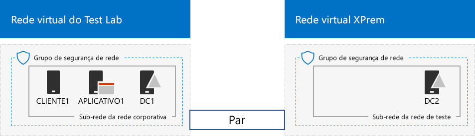

# <a name="simulated-cross-premises-virtual-network-in-a-microsoft-365-test-environment"></a><span data-ttu-id="8d1a4-103">Rede virtual simulada entre instalações em um ambiente de teste do Microsoft 365</span><span class="sxs-lookup"><span data-stu-id="8d1a4-103">Simulated cross-premises virtual network in a Microsoft 365 test environment</span></span>

<span data-ttu-id="8d1a4-104">*Este Guia de Laboratório de Testes pode ser usado para ambientes de teste do Microsoft 365 Enterprise e do Office 365 Enterprise.*</span><span class="sxs-lookup"><span data-stu-id="8d1a4-104">*This Test Lab Guide can be used for both Microsoft 365 Enterprise and Office 365 Enterprise test environments.*</span></span>

<span data-ttu-id="8d1a4-p101">Este artigo ajuda você a criar um ambiente simulado de nuvem híbrida com o Microsoft Azure usando duas redes virtuais do Azure. Veja a configuração resultante.</span><span class="sxs-lookup"><span data-stu-id="8d1a4-p101">This article steps you through creating a simulated hybrid cloud environment with Microsoft Azure using two Azure virtual networks. Here is the resulting configuration.</span></span> 
  

  
<span data-ttu-id="8d1a4-108">Isso simula um ambiente de produção de nuvem híbrida para o IaaS do Azure e consiste em:</span><span class="sxs-lookup"><span data-stu-id="8d1a4-108">This simulates an Azure IaaS hybrid cloud production environment and consists of:</span></span>
  
- <span data-ttu-id="8d1a4-109">Uma rede local simulada e simplificada hospedada na rede virtual do Azure (a rede virtual TestLab). </span><span class="sxs-lookup"><span data-stu-id="8d1a4-109">A simulated and simplified on-premises network hosted in an Azure virtual network (the TestLab virtual network).</span></span>
    
- <span data-ttu-id="8d1a4-110">Uma rede virtual simulada entre locais hospedada no Azure (XPrem).</span><span class="sxs-lookup"><span data-stu-id="8d1a4-110">A simulated cross-premises virtual network hosted in Azure (XPrem).</span></span>
    
- <span data-ttu-id="8d1a4-111">Uma relação de emparelhamento de VNets entre as duas redes virtuais.</span><span class="sxs-lookup"><span data-stu-id="8d1a4-111">A VNet peering relationship between the two virtual networks.</span></span>
    
- <span data-ttu-id="8d1a4-112">Um controlador de domínio secundário na rede virtual XPrem.</span><span class="sxs-lookup"><span data-stu-id="8d1a4-112">A secondary domain controller in the XPrem virtual network.</span></span>
    
<span data-ttu-id="8d1a4-113">Isso fornece uma base e um ponto de partida comuns a partir dos quais você pode:</span><span class="sxs-lookup"><span data-stu-id="8d1a4-113">This provides a basis and common starting point from which you can:</span></span> 
  
- <span data-ttu-id="8d1a4-114">Desenvolver e testar aplicativos em um ambiente simulado de nuvem híbrida para o IaaS do Azure.</span><span class="sxs-lookup"><span data-stu-id="8d1a4-114">Develop and test applications in a simulated Azure IaaS hybrid cloud environment.</span></span>
    
- <span data-ttu-id="8d1a4-115">Criar configurações de teste para computadores, algumas na rede virtual TestLab e outras na rede virtual XPrem, para simular cargas de trabalho de TI baseadas na nuvem híbrida.</span><span class="sxs-lookup"><span data-stu-id="8d1a4-115">Create test configurations of computers, some within the TestLab virtual network and some within the XPrem virtual network, to simulate hybrid cloud-based IT workloads.</span></span>
    
<span data-ttu-id="8d1a4-116">Há três fases principais para configurar esse ambiente de teste:</span><span class="sxs-lookup"><span data-stu-id="8d1a4-116">There are three major phases to setting up this test environment:</span></span>
  
1. <span data-ttu-id="8d1a4-117">Configurar a rede virtual TestLab.</span><span class="sxs-lookup"><span data-stu-id="8d1a4-117">Configure the TestLab virtual network.</span></span>
    
2. <span data-ttu-id="8d1a4-118">Criar a rede virtual entre locais.</span><span class="sxs-lookup"><span data-stu-id="8d1a4-118">Create the cross-premises virtual network.</span></span>
    
3. <span data-ttu-id="8d1a4-119">Configurar o DC2.</span><span class="sxs-lookup"><span data-stu-id="8d1a4-119">Configure DC2.</span></span>
    
> [!NOTE]
> <span data-ttu-id="8d1a4-120">Essa configuração requer uma assinatura paga do Azure.</span><span class="sxs-lookup"><span data-stu-id="8d1a4-120">This configuration requires a paid Azure subscription.</span></span> 

<span data-ttu-id="8d1a4-121">Você pode usar o ambiente resultante para testar os recursos e a funcionalidade do [Microsoft 365 Enterprise](https://www.microsoft.com/microsoft-365/enterprise) com os [Guias de laboratório de teste](m365-enterprise-test-lab-guides.md) adicionais ou por sua própria conta.</span><span class="sxs-lookup"><span data-stu-id="8d1a4-121">You can use the resulting environment to test the features and functionality of [Microsoft 365 Enterprise](https://www.microsoft.com/microsoft-365/enterprise) with additional [Test Lab Guides](m365-enterprise-test-lab-guides.md) or on your own.</span></span>


> [!TIP]
> <span data-ttu-id="8d1a4-123">Clique [aqui](../media/m365-enterprise-test-lab-guides/Microsoft365EnterpriseTLGStack.pdf) para ver um mapa visual de todos os artigos da pilha do Guia de Laboratório de Teste do Microsoft 365 Enterprise.</span><span class="sxs-lookup"><span data-stu-id="8d1a4-123">Click [here](../media/m365-enterprise-test-lab-guides/Microsoft365EnterpriseTLGStack.pdf) for a visual map to all the articles in the Microsoft 365 Enterprise Test Lab Guide stack.</span></span>

## <a name="phase-1-configure-the-testlab-virtual-network"></a><span data-ttu-id="8d1a4-124">Fase 1: configurar a rede virtual TestLab</span><span class="sxs-lookup"><span data-stu-id="8d1a4-124">Phase 1: Configure the TestLab virtual network</span></span>

<span data-ttu-id="8d1a4-125">Use as instruções na **Fase 1** da [configuração base corporativa simulada](simulated-ent-base-configuration-microsoft-365-enterprise.md) para configurar os computadores DC1, APP1 e CLIENT1 na rede virtual Azure chamada TestLab.</span><span class="sxs-lookup"><span data-stu-id="8d1a4-125">Use the instructions in **Phase 1** of the [simulated enterprise base configuration](simulated-ent-base-configuration-microsoft-365-enterprise.md) to configure the DC1, APP1, and CLIENT1 computers in the Azure virtual network named TestLab.</span></span>
  
<span data-ttu-id="8d1a4-126">Essa é sua configuração atual.</span><span class="sxs-lookup"><span data-stu-id="8d1a4-126">This is your current configuration.</span></span> 
  

  
## <a name="phase-2-create-the-xprem-virtual-network"></a><span data-ttu-id="8d1a4-128">Fase 2: criar uma rede virtual XPrem</span><span class="sxs-lookup"><span data-stu-id="8d1a4-128">Phase 2: Create the XPrem virtual network</span></span>

<span data-ttu-id="8d1a4-129">Nesta fase, crie e configure a nova rede virtual XPrem e conecte-se à rede virtual TestLab com emparelhamento de VNets.</span><span class="sxs-lookup"><span data-stu-id="8d1a4-129">In this phase, you create and configure the new XPrem virtual network and then connect it to the TestLab virtual network with VNet peering.</span></span>
  
<span data-ttu-id="8d1a4-130">Primeiro, inicie um prompt do Azure PowerShell em seu computador local.</span><span class="sxs-lookup"><span data-stu-id="8d1a4-130">First, start an Azure PowerShell prompt on your local computer.</span></span>
  
> [!NOTE]
> <span data-ttu-id="8d1a4-p102">O comando a seguir define o uso da versão mais recente do Azure PowerShell. Confira [Introdução aos cmdlets do Azure PowerShell](https://docs.microsoft.com/powershell/azureps-cmdlets-docs/).</span><span class="sxs-lookup"><span data-stu-id="8d1a4-p102">The following command sets use the latest version of Azure PowerShell. See [Get started with Azure PowerShell cmdlets](https://docs.microsoft.com/powershell/azureps-cmdlets-docs/).</span></span> 
  
<span data-ttu-id="8d1a4-133">Em seguida, entre com sua conta do Azure usando este comando.</span><span class="sxs-lookup"><span data-stu-id="8d1a4-133">Sign in to your Azure account with this command.</span></span>
  
```powershell
Connect-AzAccount
```

<span data-ttu-id="8d1a4-134">Para obter o nome de sua assinatura, use este comando.</span><span class="sxs-lookup"><span data-stu-id="8d1a4-134">Get your subscription name using this command.</span></span>
  
```powershell
Get-AzSubscription | Sort Name | Select Name
```

<span data-ttu-id="8d1a4-p103">Defina sua assinatura do Azure. Substitua tudo o que está entre aspas, incluindo os caracteres \< e >, pelos nomes corretos.</span><span class="sxs-lookup"><span data-stu-id="8d1a4-p103">Set your Azure subscription. Replace everything within the quotes, including the \< and > characters, with the correct names.</span></span>
  
```powershell
$subscrName="<subscription name>"
Select-AzSubscription -SubscriptionName $subscrName
```

<span data-ttu-id="8d1a4-137">Em seguida, crie a rede virtual XPrem e proteja-a usando um grupo de segurança de rede com estes comandos.</span><span class="sxs-lookup"><span data-stu-id="8d1a4-137">Next, create the XPrem virtual network and protect it with a network security group with these commands.</span></span>
  
```powershell
$rgName="<name of the resource group that you used for your TestLab virtual network>"
$locName=(Get-AzResourceGroup -Name $rgName).Location
$Testnet=New-AzVirtualNetworkSubnetConfig -Name "Testnet" -AddressPrefix 192.168.0.0/24
New-AzVirtualNetwork -Name "XPrem" -ResourceGroupName $rgName -Location $locName -AddressPrefix 192.168.0.0/16 -Subnet $Testnet -DNSServer 10.0.0.4
$rule1=New-AzNetworkSecurityRuleConfig -Name "RDPTraffic" -Description "Allow RDP to all VMs on the subnet" -Access Allow -Protocol Tcp -Direction Inbound -Priority 100 -SourceAddressPrefix Internet -SourcePortRange * -DestinationAddressPrefix * -DestinationPortRange 3389
New-AzNetworkSecurityGroup -Name "Testnet" -ResourceGroupName $rgName -Location $locName -SecurityRules $rule1
$vnet=Get-AzVirtualNetwork -ResourceGroupName $rgName -Name XPrem
$nsg=Get-AzNetworkSecurityGroup -Name "Testnet" -ResourceGroupName $rgName
Set-AzVirtualNetworkSubnetConfig -VirtualNetwork $vnet -Name "Testnet" -AddressPrefix 192.168.0.0/24 -NetworkSecurityGroup $nsg
$vnet | Set-AzVirtualNetwork
```

<span data-ttu-id="8d1a4-138">Depois, crie a relação de emparelhamento de VNets entre as VNets TestLab e XPrem com estes comandos.</span><span class="sxs-lookup"><span data-stu-id="8d1a4-138">Next, you create the VNet peering relationship between the TestLab and XPrem VNets with these commands.</span></span>
  
```powershell
$rgName="<name of the resource group that you used for your TestLab virtual network>"
$vnet1=Get-AzVirtualNetwork -ResourceGroupName $rgName -Name TestLab
$vnet2=Get-AzVirtualNetwork -ResourceGroupName $rgName -Name XPrem
Add-AzVirtualNetworkPeering -Name TestLab2XPrem -VirtualNetwork $vnet1 -RemoteVirtualNetworkId $vnet2.Id
Add-AzVirtualNetworkPeering -Name XPrem2TestLab -VirtualNetwork $vnet2 -RemoteVirtualNetworkId $vnet1.Id
```

<span data-ttu-id="8d1a4-139">Essa é sua configuração atual.</span><span class="sxs-lookup"><span data-stu-id="8d1a4-139">This is your current configuration.</span></span> 
  

  
## <a name="phase-3-configure-dc2"></a><span data-ttu-id="8d1a4-141">Fase 3: configurar o DC2</span><span class="sxs-lookup"><span data-stu-id="8d1a4-141">Phase 3: Configure DC2</span></span>

<span data-ttu-id="8d1a4-142">Nesta fase, crie a máquina virtual DC2 na rede virtual XPrem e configure-a como um controlador de domínio de réplica.</span><span class="sxs-lookup"><span data-stu-id="8d1a4-142">In this phase, you create the DC2 virtual machine in the XPrem virtual network and then configure it as a replica domain controller.</span></span>
  
<span data-ttu-id="8d1a4-p104">Primeiro, crie uma máquina virtual para o DC2. Execute esses comandos no prompt de comando do Azure PowerShell em seu computador local.</span><span class="sxs-lookup"><span data-stu-id="8d1a4-p104">First, create a virtual machine for DC2. Run these commands at the Azure PowerShell command prompt on your local computer.</span></span>
  
```powershell
$rgName="<your resource group name>"
$locName=(Get-AzResourceGroup -Name $rgName).Location
$vnet=Get-AzVirtualNetwork -Name XPrem -ResourceGroupName $rgName
$pip=New-AzPublicIpAddress -Name DC2-PIP -ResourceGroupName $rgName -Location $locName -AllocationMethod Dynamic
$nic=New-AzNetworkInterface -Name DC2-NIC -ResourceGroupName $rgName -Location $locName -SubnetId $vnet.Subnets[0].Id -PublicIpAddressId $pip.Id -PrivateIpAddress 192.168.0.4
$vm=New-AzVMConfig -VMName DC2 -VMSize Standard_A2_V2
$cred=Get-Credential -Message "Type the name and password of the local administrator account for DC2."
$vm=Set-AzVMOperatingSystem -VM $vm -Windows -ComputerName DC2 -Credential $cred -ProvisionVMAgent -EnableAutoUpdate
$vm=Set-AzVMSourceImage -VM $vm -PublisherName MicrosoftWindowsServer -Offer WindowsServer -Skus 2016-Datacenter -Version "latest"
$vm=Add-AzVMNetworkInterface -VM $vm -Id $nic.Id
$vm=Set-AzVMOSDisk -VM $vm -Name "DC2-OS" -DiskSizeInGB 128 -CreateOption FromImage -StorageAccountType "Standard_LRS"
$diskConfig=New-AzDiskConfig -AccountType "Standard_LRS" -Location $locName -CreateOption Empty -DiskSizeGB 20
$dataDisk1=New-AzDisk -DiskName "DC2-DataDisk1" -Disk $diskConfig -ResourceGroupName $rgName
$vm=Add-AzVMDataDisk -VM $vm -Name "DC2-DataDisk1" -CreateOption Attach -ManagedDiskId $dataDisk1.Id -Lun 1
New-AzVM -ResourceGroupName $rgName -Location $locName -VM $vm
```

<span data-ttu-id="8d1a4-145">Em seguida, conecte-se à nova máquina virtual DC2 a partir do [portal do Azure](https://portal.azure.com) usando o nome e a senha da conta de administrador local.</span><span class="sxs-lookup"><span data-stu-id="8d1a4-145">Next, connect to the new DC2 virtual machine from the [Azure portal](https://portal.azure.com) using its local administrator account name and password.</span></span>
  
<span data-ttu-id="8d1a4-p105">Em seguida, configure uma regra de Firewall do Windows para permitir o tráfego para testes básicos de conectividade. No DC2, em um prompt de comando de nível de administrador do Windows PowerShell, execute esses comandos.</span><span class="sxs-lookup"><span data-stu-id="8d1a4-p105">Next, configure a Windows Firewall rule to allow traffic for basic connectivity testing. From an administrator-level Windows PowerShell command prompt on DC2, run these commands.</span></span> 
  
```powershell
Set-NetFirewallRule -DisplayName "File and Printer Sharing (Echo Request - ICMPv4-In)" -enabled True
ping dc1.corp.contoso.com
```

<span data-ttu-id="8d1a4-p106">O comando ping deve resultar em quatro respostas bem-sucedidas do endereço IP 10.0.0.4. Este é um teste de tráfego entre a relação de emparelhamento de VNets.</span><span class="sxs-lookup"><span data-stu-id="8d1a4-p106">The ping command should result in four successful replies from IP address 10.0.0.4. This is a test of traffic across the VNet peering relationship.</span></span> 
  
<span data-ttu-id="8d1a4-150">Em seguida, adicione o disco de dados extra como um novo volume com a letra de unidade F:, com este comando em um prompt de comando do Windows PowerShell no DC2.</span><span class="sxs-lookup"><span data-stu-id="8d1a4-150">Next, add the extra data disk as a new volume with the drive letter F: with this command from the Windows PowerShell command prompt on DC2.</span></span>
  
```powershell
Get-Disk | Where PartitionStyle -eq "RAW" | Initialize-Disk -PartitionStyle MBR -PassThru | New-Partition -AssignDriveLetter -UseMaximumSize | Format-Volume -FileSystem NTFS -NewFileSystemLabel "WSAD Data"
```

<span data-ttu-id="8d1a4-p107">Depois, configure o DC2 como controlador de domínio de réplica para o domínio corp.contoso.com. Execute estes comandos em um prompt de comando do Windows PowerShell no DC2.</span><span class="sxs-lookup"><span data-stu-id="8d1a4-p107">Next, configure DC2 as a replica domain controller for the corp.contoso.com domain. Run these commands from the Windows PowerShell command prompt on DC2.</span></span>
  
```powershell
Install-WindowsFeature AD-Domain-Services -IncludeManagementTools
Install-ADDSDomainController -Credential (Get-Credential CORP\User1) -DomainName "corp.contoso.com" -InstallDns:$true -DatabasePath "F:\NTDS" -LogPath "F:\Logs" -SysvolPath "F:\SYSVOL"
```

<span data-ttu-id="8d1a4-153">Observe que você será solicitado a fornecer a senha de CORP\\Usuário1 e uma senha do Modo de Restauração dos Serviços de Diretório (DSRM) e a reiniciar o DC2.</span><span class="sxs-lookup"><span data-stu-id="8d1a4-153">Note that you are prompted to supply both the CORP\\User1 password and a Directory Services Restore Mode (DSRM) password, and to restart DC2.</span></span> 
  
<span data-ttu-id="8d1a4-p108">Agora que a rede virtual XPrem tem seu próprio servidor DNS (DC2), você deve configurá-la para usar esse servidor DNS. Execute esses comandos no prompt de comando do Azure PowerShell em seu computador local.</span><span class="sxs-lookup"><span data-stu-id="8d1a4-p108">Now that the XPrem virtual network has its own DNS server (DC2), you must configure the XPrem virtual network to use this DNS server. Run these commands from the Azure PowerShell command prompt on your local computer.</span></span>
  
```powershell
$vnet=Get-AzVirtualNetwork -ResourceGroupName $rgName -name "XPrem"
$vnet.DhcpOptions.DnsServers="192.168.0.4" 
Set-AzVirtualNetwork -VirtualNetwork $vnet
Restart-AzVM -ResourceGroupName $rgName -Name "DC2"
```

<span data-ttu-id="8d1a4-p109">No portal do Azure no computador local, conecte-se ao DC1 com as credenciais CORP\\Usuário1. Para configurar o domínio CORP de modo que os computadores e usuários usem seu controlador de domínio local para autenticação, execute esses comandos em um prompt de comando do Windows PowerShell como administrador no DC1.</span><span class="sxs-lookup"><span data-stu-id="8d1a4-p109">From the Azure portal on your local computer, connect to DC1 with the CORP\\User1 credentials. To configure the CORP domain so that computers and users use their local domain controller for authentication, run these commands from an administrator-level Windows PowerShell command prompt on DC1.</span></span>
  
```powershell
New-ADReplicationSite -Name "TestLab" 
New-ADReplicationSite -Name "XPrem"
New-ADReplicationSubnet -Name "10.0.0.0/8" -Site "TestLab"
New-ADReplicationSubnet -Name "192.168.0.0/16" -Site "XPrem"
```

<span data-ttu-id="8d1a4-158">Essa é sua configuração atual.</span><span class="sxs-lookup"><span data-stu-id="8d1a4-158">This is your current configuration.</span></span> 
  

  
<span data-ttu-id="8d1a4-160">Seu ambiente simulado de nuvem híbrida do Azure já está pronto para testes.</span><span class="sxs-lookup"><span data-stu-id="8d1a4-160">Your simulated Azure hybrid cloud environment is now ready for testing.</span></span>
  
<span data-ttu-id="8d1a4-161">Agora você está pronto para experimentar os recursos adicionais do [Microsoft 365 Enterprise](https://www.microsoft.com/microsoft-365/enterprise).</span><span class="sxs-lookup"><span data-stu-id="8d1a4-161">You are now ready to experiment with additional features of [Microsoft 365 Enterprise](https://www.microsoft.com/microsoft-365/enterprise).</span></span>
  
## <a name="next-steps"></a><span data-ttu-id="8d1a4-162">Próximas etapas</span><span class="sxs-lookup"><span data-stu-id="8d1a4-162">Next steps</span></span>

<span data-ttu-id="8d1a4-163">Explore esses conjuntos adicionais de guias de laboratório de teste:</span><span class="sxs-lookup"><span data-stu-id="8d1a4-163">Explore these additional sets of Test Lab Guides:</span></span>
  
- [<span data-ttu-id="8d1a4-164">Identidade</span><span class="sxs-lookup"><span data-stu-id="8d1a4-164">Identity</span></span>](m365-enterprise-test-lab-guides.md#identity)
- [<span data-ttu-id="8d1a4-165">Gerenciamento de dispositivo móvel</span><span class="sxs-lookup"><span data-stu-id="8d1a4-165">Mobile device management</span></span>](m365-enterprise-test-lab-guides.md#mobile-device-management)
- [<span data-ttu-id="8d1a4-166">Proteção de informações</span><span class="sxs-lookup"><span data-stu-id="8d1a4-166">Information protection</span></span>](m365-enterprise-test-lab-guides.md#information-protection)

## <a name="see-also"></a><span data-ttu-id="8d1a4-167">Confira também</span><span class="sxs-lookup"><span data-stu-id="8d1a4-167">See also</span></span>

[<span data-ttu-id="8d1a4-168">Guias do Laboratório de Teste do Microsoft 365 Enterprise</span><span class="sxs-lookup"><span data-stu-id="8d1a4-168">Microsoft 365 Enterprise Test Lab Guides</span></span>](m365-enterprise-test-lab-guides.md)

[<span data-ttu-id="8d1a4-169">Implantar o Microsoft 365 Enterprise</span><span class="sxs-lookup"><span data-stu-id="8d1a4-169">Deploy Microsoft 365 Enterprise</span></span>](deploy-microsoft-365-enterprise.md)

[<span data-ttu-id="8d1a4-170">Documentação do Microsoft 365 Enterprise</span><span class="sxs-lookup"><span data-stu-id="8d1a4-170">Microsoft 365 Enterprise documentation</span></span>](https://docs.microsoft.com/microsoft-365-enterprise/)
