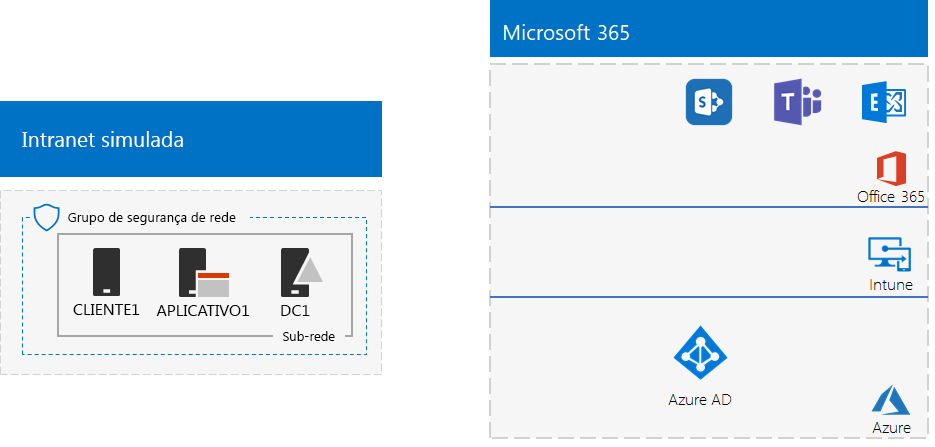
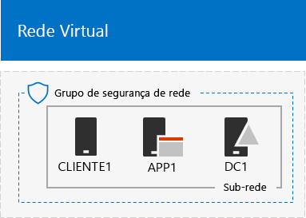
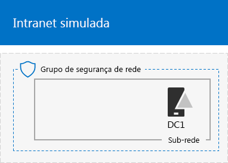
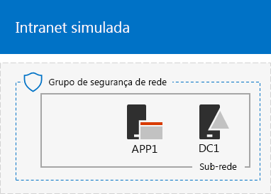

# <a name="the-simulated-enterprise-base-configuration"></a><span data-ttu-id="da8f1-103">A configuração base corporativa simulada</span><span class="sxs-lookup"><span data-stu-id="da8f1-103">The simulated enterprise base configuration</span></span>

<span data-ttu-id="da8f1-104">Este artigo fornece instruções passo a passo para criar um ambiente simplificado do Microsoft 365 Enterprise, que inclui:</span><span class="sxs-lookup"><span data-stu-id="da8f1-104">This article provides you with step-by-step instructions to create a simplified environment for Microsoft 365 Enterprise that includes:</span></span>

- <span data-ttu-id="da8f1-105">Uma assinatura de avaliação ou assinatura paga do Microsoft 365 E5.</span><span class="sxs-lookup"><span data-stu-id="da8f1-105">A Microsoft 365 E5 trial or paid subscription.</span></span>
- <span data-ttu-id="da8f1-106">Uma intranet de organização simplificada conectada à Internet, composta por três máquinas virtuais em uma Rede Virtual do Microsoft Azure (DC1 APP1 e CLIENT1).</span><span class="sxs-lookup"><span data-stu-id="da8f1-106">A simplified organization intranet connected to the Internet, consisting of three virtual machines on an Azure virtual network (DC1, APP1, and CLIENT1).</span></span>
 


<span data-ttu-id="da8f1-108">Você pode usar o ambiente resultante para testar os recursos e a funcionalidade do [Microsoft 365 Enterprise](https://www.microsoft.com/microsoft-365/enterprise) com os [Guias de laboratório de teste](m365-enterprise-test-lab-guides.md) adicionais ou por sua própria conta.</span><span class="sxs-lookup"><span data-stu-id="da8f1-108">You can use the resulting environment to test the features and functionality of [Microsoft 365 Enterprise](https://www.microsoft.com/microsoft-365/enterprise) with additional [Test Lab Guides](m365-enterprise-test-lab-guides.md) or on your own.</span></span>


> [!TIP]
> <span data-ttu-id="da8f1-110">Clique [aqui](media/m365-enterprise-test-lab-guides/Microsoft365EnterpriseTLGStack.pdf) para ver um mapa visual de todos os artigos da pilha do Guia de Laboratório de Teste do Microsoft 365 Enterprise.</span><span class="sxs-lookup"><span data-stu-id="da8f1-110">Click [here](media/m365-enterprise-test-lab-guides/Microsoft365EnterpriseTLGStack.pdf) for a visual map to all the articles in the Microsoft 365 Enterprise Test Lab Guide stack.</span></span>

## <a name="phase-1-create-a-simulated-intranet"></a><span data-ttu-id="da8f1-111">Fase 1: criar uma intranet simulada</span><span class="sxs-lookup"><span data-stu-id="da8f1-111">Phase 1: Create a simulated intranet</span></span>

<span data-ttu-id="da8f1-112">Nesta fase, você cria uma intranet simulada nos serviços de infraestrutura do Azure, que inclui um controlador de domínio dos Serviços de Domínio do Active Directory (AD DS), um servidor de aplicativos e um computador cliente.</span><span class="sxs-lookup"><span data-stu-id="da8f1-112">In this phase, you build a simulated intranet in Azure infrastructure services that includes an Active Directory Domain Services (AD DS) domain controller, an application server, and a client computer.</span></span> 

<span data-ttu-id="da8f1-113">Você usará esses computadores em outros [Guias de laboratório de teste do Microsoft 365 Enterprise](m365-enterprise-test-lab-guides.md) para configurar e demonstrar a identidade híbrida e outros recursos.</span><span class="sxs-lookup"><span data-stu-id="da8f1-113">You'll use these computers in additional [Microsoft 365 Enterprise Test Lab Guides](m365-enterprise-test-lab-guides.md) to configure and demonstrate hybrid identity and other capabilities.</span></span>

### <a name="method-1-build-your-simulated-intranet-with-an-azure-resource-manager-template"></a><span data-ttu-id="da8f1-114">Método 1: criar sua intranet simulada com um modelo do Azure Resource Manager</span><span class="sxs-lookup"><span data-stu-id="da8f1-114">Method 1: Build your simulated intranet with an Azure Resource Manager template</span></span>

<span data-ttu-id="da8f1-p101">Nesse método, você usa um modelo do Azure Resource Manager (ARM) para criar uma intranet simulada. Os modelos do ARM contêm todas as instruções para criar a infraestrutura de rede do Azure, as máquinas virtuais e suas configurações.</span><span class="sxs-lookup"><span data-stu-id="da8f1-p101">In this method, you use an Azure Resource Manager (ARM) template to build out the simulated intranet. ARM templates contain all of the instructions to create the Azure networking infrastructure, the virtual machines, and their configuration.</span></span>

<span data-ttu-id="da8f1-117">Antes de implantar o modelo, leia toda a [página LEIAME do modelo](https://github.com/maxskunkworks/TLG/tree/master/tlg-base-config_3-vm.m365-ems) e tenha as seguintes informações em mãos:</span><span class="sxs-lookup"><span data-stu-id="da8f1-117">Prior to deploying the template, read through the [template README page](https://github.com/maxskunkworks/TLG/tree/master/tlg-base-config_3-vm.m365-ems) and have the following information ready:</span></span>

- <span data-ttu-id="da8f1-p102">O nome de domínio público DNS do seu ambiente de teste (testlab.\<seu domínio público>). Será preciso inserir esse nome no **campo Nome de domínio** da página **Implantação personalizada**.</span><span class="sxs-lookup"><span data-stu-id="da8f1-p102">The public DNS domain name of your test environment (testlab.\<your public domain>). You’ll need to enter this name in the **Domain Name field** of the **Custom deployment** page.</span></span>
- <span data-ttu-id="da8f1-p103">Um prefixo de rótulo DNS para as URLs dos endereços IP públicos de suas máquinas virtuais. Você precisará inserir esse rótulo no campo **Prefixo do rótulo DNS** da página **Implantação personalizada**.</span><span class="sxs-lookup"><span data-stu-id="da8f1-p103">A DNS label prefix for the URLs of the public IP addresses of your virtual machines. You’ll need to enter this label in the **Dns Label Prefix** field of the **Custom deployment** page.</span></span>

<span data-ttu-id="da8f1-122">Depois de ler todas as instruções, clique em **Implantar no Azure** na [página LEIAME do modelo](https://github.com/maxskunkworks/TLG/tree/master/tlg-base-config_3-vm.m365-ems) para começar.</span><span class="sxs-lookup"><span data-stu-id="da8f1-122">After reading through the instructions, click **Deploy to Azure** on the [template README page](https://github.com/maxskunkworks/TLG/tree/master/tlg-base-config_3-vm.m365-ems) to get started.</span></span>

>[!Note]
><span data-ttu-id="da8f1-123">A intranet simulada criada pelo modelo do ARM requer uma assinatura paga do Azure.</span><span class="sxs-lookup"><span data-stu-id="da8f1-123">The simulated intranet built by the ARM template requires a paid Azure subscription.</span></span>
>

<span data-ttu-id="da8f1-124">Esta é sua configuração após a conclusão do modelo.</span><span class="sxs-lookup"><span data-stu-id="da8f1-124">Here is your configuration after the template is complete.</span></span>



### <a name="method-2-build-your-simulated-intranet-with-azure-powershell"></a><span data-ttu-id="da8f1-126">Método 2: criar sua intranet simulada com o Azure PowerShell</span><span class="sxs-lookup"><span data-stu-id="da8f1-126">Method 2: Build your simulated intranet with Azure PowerShell</span></span>

<span data-ttu-id="da8f1-127">Nesse método, use o módulo do Windows PowerShell e do Azure PowerShell para criar a infraestrutura de rede, as máquinas virtuais e suas configurações.</span><span class="sxs-lookup"><span data-stu-id="da8f1-127">In this method, you use Windows PowerShell and the Azure PowerShell module to build out the networking infrastructure, the virtual machines, and their configuration.</span></span>

<span data-ttu-id="da8f1-p104">Use esse método caso deseje obter a experiência de criação de elementos de infraestrutura do Azure uma etapa por vez com o PowerShell. Assim, é possível personalizar os blocos de comando do PowerShell para sua própria implantação de outras máquinas virtuais no Azure.</span><span class="sxs-lookup"><span data-stu-id="da8f1-p104">Use this method if you want to get experience creating elements of Azure infrastructure one step at a time with PowerShell. You can then customize the PowerShell command blocks for your own deployment of other virtual machines in Azure.</span></span>

#### <a name="step-1-create-dc1"></a><span data-ttu-id="da8f1-130">Etapa 1: criar DC1</span><span class="sxs-lookup"><span data-stu-id="da8f1-130">Step 1: Create DC1</span></span>

<span data-ttu-id="da8f1-131">Nessa etapa, criamos uma rede virtual do Azure e adicionamos a DC1, uma máquina virtual que se trata de um controlador de domínio para um domínio do AD DS.</span><span class="sxs-lookup"><span data-stu-id="da8f1-131">In this step, we create an Azure virtual network and add DC1, a virtual machine that is a domain controller for an AD DS domain.</span></span>

<span data-ttu-id="da8f1-132">Primeiro, inicie o prompt de comando do Windows PowerShell no computador local.</span><span class="sxs-lookup"><span data-stu-id="da8f1-132">First, start a Windows PowerShell command prompt on your local computer.</span></span>
  
> [!NOTE]
> <span data-ttu-id="da8f1-p105">O comando a seguir define o uso da versão mais recente do Azure PowerShell. Confira [Introdução aos cmdlets do Azure PowerShell](https://docs.microsoft.com/powershell/azureps-cmdlets-docs/).</span><span class="sxs-lookup"><span data-stu-id="da8f1-p105">The following command sets use the latest version of Azure PowerShell. See [Get started with Azure PowerShell cmdlets](https://docs.microsoft.com/powershell/azureps-cmdlets-docs/).</span></span> 
  
<span data-ttu-id="da8f1-135">Entre na sua conta do Azure usando o comando a seguir.</span><span class="sxs-lookup"><span data-stu-id="da8f1-135">Sign in to your Azure account with the following command.</span></span>
  
```powershell
Connect-AzAccount
```

<span data-ttu-id="da8f1-136">Para obter o nome de sua assinatura, use este comando.</span><span class="sxs-lookup"><span data-stu-id="da8f1-136">Get your subscription name using the following command.</span></span>
  
```powershell
Get-AzSubscription | Sort Name | Select Name
```

<span data-ttu-id="da8f1-p106">Configure a assinatura do Azure. Substitua tudo o que está entre aspas, inclusive os caracteres < e >, pelo nome correto.</span><span class="sxs-lookup"><span data-stu-id="da8f1-p106">Set your Azure subscription. Replace everything within the quotes, including the < and > characters, with the correct name.</span></span>
  
```powershell
$subscr="<subscription name>"
Get-AzSubscription -SubscriptionName $subscr | Select-AzSubscription
```

<span data-ttu-id="da8f1-p107">Depois, crie um novo grupo de recursos para o laboratório de testes simulado. Para determinar um nome de grupo de recursos exclusivo, use este comando para relacionar os grupos de recurso existentes.</span><span class="sxs-lookup"><span data-stu-id="da8f1-p107">Next, create a new resource group for your simulated enterprise test lab. To determine a unique resource group name, use this command to list your existing resource groups.</span></span>
  
```powershell
Get-AzResourceGroup | Sort ResourceGroupName | Select ResourceGroupName
```

<span data-ttu-id="da8f1-p108">Crie um novo grupo de recursos com estes comandos. Substitua tudo o que está entre aspas, incluindo os caracteres < e >, pelos nomes corretos.</span><span class="sxs-lookup"><span data-stu-id="da8f1-p108">Create your new resource group with these commands. Replace everything within the quotes, including the < and > characters, with the correct names.</span></span>
  
```powershell
$rgName="<resource group name>"
$locName="<location name, such as West US>"
New-AzResourceGroup -Name $rgName -Location $locName
```

<span data-ttu-id="da8f1-p109">Em seguida, crie a rede virtual do TestLab que hospedará a sub-rede da rede corporativa do ambiente corporativo simulado e a protegerá com um grupo de segurança de rede. Preencha o nome do grupo de recursos e execute esses comandos no prompt de comando do PowerShell, no computador local.</span><span class="sxs-lookup"><span data-stu-id="da8f1-p109">Next, you create the TestLab virtual network that will host the Corpnet subnet of the simulated enterprise environment and protect it with a network security group. Fill in the name of your resource group and run these commands at the PowerShell command prompt on your local computer.</span></span>
  
```powershell
$rgName="<name of your new resource group>"
$locName=(Get-AzResourceGroup -Name $rgName).Location
$corpnetSubnet=New-AzVirtualNetworkSubnetConfig -Name Corpnet -AddressPrefix 10.0.0.0/24
New-AzVirtualNetwork -Name TestLab -ResourceGroupName $rgName -Location $locName -AddressPrefix 10.0.0.0/8 -Subnet $corpnetSubnet -DNSServer 10.0.0.4
$rule1=New-AzNetworkSecurityRuleConfig -Name "RDPTraffic" -Description "Allow RDP to all VMs on the subnet" -Access Allow -Protocol Tcp -Direction Inbound -Priority 100 -SourceAddressPrefix Internet -SourcePortRange * -DestinationAddressPrefix * -DestinationPortRange 3389
New-AzNetworkSecurityGroup -Name Corpnet -ResourceGroupName $rgName -Location $locName -SecurityRules $rule1
$vnet=Get-AzVirtualNetwork -ResourceGroupName $rgName -Name TestLab
$nsg=Get-AzNetworkSecurityGroup -Name Corpnet -ResourceGroupName $rgName
Set-AzVirtualNetworkSubnetConfig -VirtualNetwork $vnet -Name Corpnet -AddressPrefix "10.0.0.0/24" -NetworkSecurityGroup $nsg
$vnet | Set-AzVirtualNetwork
```

<span data-ttu-id="da8f1-145">Em seguida, crie a máquina virtual DC1 e configure-a como um controle de domínio para o **testlab.**\<seu domínio público> domínio AD DS e um servidor DNS para as máquinas virtuais da rede virtual TestLab.</span><span class="sxs-lookup"><span data-stu-id="da8f1-145">Next, you create the DC1 virtual machine and configure it as a domain controller for the **testlab.**\<your public domain> AD DS domain and a DNS server for the virtual machines of the TestLab virtual network.</span></span> <span data-ttu-id="da8f1-146">Por exemplo, se seu nome de domínio público for **<span>contoso</span>.com**, a máquina virtual DC 1 será um controlador de domínio para o domínio do **<span>testlab</span>.contoso.com**.</span><span class="sxs-lookup"><span data-stu-id="da8f1-146">For example, if your public domain name is **<span>contoso</span>.com**, the DC1 virtual machine will be a domain controller for the **<span>testlab</span>.contoso.com** domain.</span></span>
  
<span data-ttu-id="da8f1-147">Para criar uma máquina virtual como DC1, preencha o nome do grupo de recursos e execute estes comandos no prompt de comando do PowerShell, no computador local.</span><span class="sxs-lookup"><span data-stu-id="da8f1-147">To create an Azure virtual machine for DC1, fill in the name of your resource group and run these commands at the PowerShell command prompt on your local computer.</span></span>
  
```powershell
$rgName="<resource group name>"
$locName=(Get-AzResourceGroup -Name $rgName).Location
$vnet=Get-AzVirtualNetwork -Name TestLab -ResourceGroupName $rgName
$pip=New-AzPublicIpAddress -Name DC1-PIP -ResourceGroupName $rgName -Location $locName -AllocationMethod Dynamic
$nic=New-AzNetworkInterface -Name DC1-NIC -ResourceGroupName $rgName -Location $locName -SubnetId $vnet.Subnets[0].Id -PublicIpAddressId $pip.Id -PrivateIpAddress 10.0.0.4
$vm=New-AzVMConfig -VMName DC1 -VMSize Standard_A1
$cred=Get-Credential -Message "Type the name and password of the local administrator account for DC1."
$vm=Set-AzVMOperatingSystem -VM $vm -Windows -ComputerName DC1 -Credential $cred -ProvisionVMAgent -EnableAutoUpdate
$vm=Set-AzVMSourceImage -VM $vm -PublisherName MicrosoftWindowsServer -Offer WindowsServer -Skus 2016-Datacenter -Version "latest"
$vm=Add-AzVMNetworkInterface -VM $vm -Id $nic.Id
$vm=Set-AzVMOSDisk -VM $vm -Name "DC1-OS" -DiskSizeInGB 128 -CreateOption FromImage
$diskConfig=New-AzDiskConfig -AccountType "Standard_LRS" -Location $locName -CreateOption Empty -DiskSizeGB 20
$dataDisk1=New-AzDisk -DiskName "DC1-DataDisk1" -Disk $diskConfig -ResourceGroupName $rgName
$vm=Add-AzVMDataDisk -VM $vm -Name "DC1-DataDisk1" -CreateOption Attach -ManagedDiskId $dataDisk1.Id -Lun 1
New-AzVM -ResourceGroupName $rgName -Location $locName -VM $vm
```

<span data-ttu-id="da8f1-p111">Será solicitado que você insira um nome de usuário e uma senha para a conta de administrador local na DC1. Use uma senha forte e armazene ambos, a senha e o nome, em um local seguro.</span><span class="sxs-lookup"><span data-stu-id="da8f1-p111">You will be prompted for a user name and password for the local administrator account on DC1. Use a strong password and record both the name and password in a secure location.</span></span>
  
<span data-ttu-id="da8f1-150">Em seguida, conecte-se à máquina virtual DC1.</span><span class="sxs-lookup"><span data-stu-id="da8f1-150">Next, connect to the DC1 virtual machine.</span></span>
  
1. <span data-ttu-id="da8f1-151">No [portal do Azure](https://portal.azure.com), clique em **Grupos de Recursos >** [nome do novo grupo de recursos] **> DC1 > Conectar**.</span><span class="sxs-lookup"><span data-stu-id="da8f1-151">In the [Azure portal](https://portal.azure.com), click **Resource Groups >** [the name of your new resource group] **> DC1 > Connect**.</span></span>
    
2. <span data-ttu-id="da8f1-p112">No painel aberto, clique em **Baixar o arquivo RDP**. Abra o arquivo DC1.rdp que foi baixado e clique em **Conectar**.</span><span class="sxs-lookup"><span data-stu-id="da8f1-p112">In the open pane, click **Download RDP file**. Open the DC1.rdp file that is downloaded, and then click **Connect**.</span></span>
    
3. <span data-ttu-id="da8f1-154">Especifique o nome da conta de administrador local na DC1:</span><span class="sxs-lookup"><span data-stu-id="da8f1-154">Specify the DC1 local administrator account name:</span></span>
    
   - <span data-ttu-id="da8f1-155">No Windows 7:</span><span class="sxs-lookup"><span data-stu-id="da8f1-155">For Windows 7:</span></span>
    
     <span data-ttu-id="da8f1-p113">Na caixa de diálogo **Segurança do Windows**, clique em **Usar outra conta**. Em **Nome de usuário**, digite **DC1\\**[nome da conta de administrador local].</span><span class="sxs-lookup"><span data-stu-id="da8f1-p113">In the **Windows Security** dialog box, click **Use another account**. In **User name**, type **DC1\\**[Local administrator account name].</span></span>
    
   - <span data-ttu-id="da8f1-158">No Windows 8 ou Windows 10:</span><span class="sxs-lookup"><span data-stu-id="da8f1-158">For Windows 8 or Windows 10:</span></span>
    
     <span data-ttu-id="da8f1-p114">Na caixa de diálogo **Segurança do Windows**, clique em **Mais opções** e, então, clique em **Usar uma conta diferente**. Em **Nome de usuário**, digite **DC1\\**[nome da conta de administrador local].</span><span class="sxs-lookup"><span data-stu-id="da8f1-p114">In the **Windows Security** dialog box, click **More choices**, and then click **Use a different account**. In **User name**, type **DC1\\**[Local administrator account name].</span></span>
    
4. <span data-ttu-id="da8f1-161">Em **Senha**, digite a senha da conta de administrador local e clique em **OK**.</span><span class="sxs-lookup"><span data-stu-id="da8f1-161">In **Password**, type the password of the local administrator account, and then click **OK**.</span></span>
    
5. <span data-ttu-id="da8f1-162">Quando solicitado, clique em **Sim**.</span><span class="sxs-lookup"><span data-stu-id="da8f1-162">When prompted, click **Yes**.</span></span>
    
<span data-ttu-id="da8f1-163">Em seguida, adicione um disco de dados extra como um novo volume com a letra de unidade F:, com este comando, em um prompt de comando do Windows PowerShell de nível de administrador no DC1.</span><span class="sxs-lookup"><span data-stu-id="da8f1-163">Next, add an extra data disk as a new volume with the drive letter F: with this command at an administrator-level Windows PowerShell command prompt on DC1.</span></span>
  
```powershell
Get-Disk | Where PartitionStyle -eq "RAW" | Initialize-Disk -PartitionStyle MBR -PassThru | New-Partition -AssignDriveLetter -UseMaximumSize | Format-Volume -FileSystem NTFS -NewFileSystemLabel "WSAD Data"
```

<span data-ttu-id="da8f1-p115">Em seguida, configure a DC1 como um controlador de domínio e servidor DNS do domínio **testlab.**\<domínio público>. Especifique o nome de domínio público, remova os caracteres \< e >, e execute os seguintes comandos, em um prompt de comando do Windows PowerShell em nível de administrador, na DC1.</span><span class="sxs-lookup"><span data-stu-id="da8f1-p115">Next, configure DC1 as a domain controller and DNS server for the **testlab.**\<your public domain> domain. Specify your public domain name, remove the \< and > characters, and then run these commands at an administrator-level Windows PowerShell command prompt on DC1.</span></span>
  
```powershell
$yourDomain="<your public domain>"
Install-WindowsFeature AD-Domain-Services -IncludeManagementTools
Install-ADDSForest -DomainName testlab.$yourDomain -DatabasePath "F:\NTDS" -SysvolPath "F:\SYSVOL" -LogPath "F:\Logs"
```
<span data-ttu-id="da8f1-p116">Será preciso especificar uma senha de administrador no modo de segurança. Armazene essa senha em um local seguro.</span><span class="sxs-lookup"><span data-stu-id="da8f1-p116">You will need to specify a safe mode administrator password. Store this password in a secure location.</span></span>
  
<span data-ttu-id="da8f1-168">Esses comandos podem levar alguns minutos para serem concluídos.</span><span class="sxs-lookup"><span data-stu-id="da8f1-168">Note that these commands can take a few minutes to complete.</span></span>
  
<span data-ttu-id="da8f1-169">Após a reinicialização da DC1, reconecte-se à máquina virtual DC1.</span><span class="sxs-lookup"><span data-stu-id="da8f1-169">After DC1 restarts, reconnect to the DC1 virtual machine.</span></span>
  
1. <span data-ttu-id="da8f1-170">No [portal do Azure](https://portal.azure.com), clique em **Grupos de Recursos >** [nome do seu grupo de recursos] **> DC1 > Conectar**.</span><span class="sxs-lookup"><span data-stu-id="da8f1-170">In the [Azure portal](https://portal.azure.com), click **Resource Groups >** [your resource group name] **> DC1 > Connect**.</span></span>
    
2. <span data-ttu-id="da8f1-171">Execute o arquivo DC1.rdp que foi baixado e clique em **Conectar**.</span><span class="sxs-lookup"><span data-stu-id="da8f1-171">Run the DC1.rdp file that is downloaded, and then click **Connect**.</span></span>
    
3. <span data-ttu-id="da8f1-p117">Em **Segurança do Windows**, clique em **Usar outra conta**. Em **Nome de usuário**, digite **TestLab\\**[Nome da conta do administrador local].</span><span class="sxs-lookup"><span data-stu-id="da8f1-p117">In **Windows Security**, click **Use another account**. In **User name**, type **TESTLAB\\**[Local administrator account name].</span></span>
    
4. <span data-ttu-id="da8f1-174">Em **Senha**, digite a senha da conta de administrador local e clique em **OK**.</span><span class="sxs-lookup"><span data-stu-id="da8f1-174">In **Password**, type the password of the local administrator account, and then click **OK**.</span></span>
    
5. <span data-ttu-id="da8f1-175">Quando solicitado, clique em **Sim**.</span><span class="sxs-lookup"><span data-stu-id="da8f1-175">When prompted, click **Yes**.</span></span>
    
<span data-ttu-id="da8f1-p118">Em seguida, crie uma conta de usuário no Active Directory que será usada quando entrar nos computadores membros do domínio TestLab. Execute este comando em um prompt de comando do Windows PowerShell em nível de administrador.</span><span class="sxs-lookup"><span data-stu-id="da8f1-p118">Next, create a user account in Active Directory that will be used when logging in to TESTLAB domain member computers. Run this command at an administrator-level Windows PowerShell command prompt.</span></span>
  
```powershell
New-ADUser -SamAccountName User1 -AccountPassword (read-host "Set user password" -assecurestring) -name "User1" -enabled $true -PasswordNeverExpires $true -ChangePasswordAtLogon $false
```

<span data-ttu-id="da8f1-p119">Este comando o solicita a fornecer a senha da conta Usuário1. Como essa conta será usada para conexões de área de trabalho remota para todos os computadores membros do domínio do TestLab, escolha uma senha forte. Registre a senha da conta Usuário1 e armazene-a em local seguro.</span><span class="sxs-lookup"><span data-stu-id="da8f1-p119">Note that this command prompts you to supply the User1 account password. Because this account will be used for remote desktop connections for all TESTLAB domain member computers, choose a strong password. Record the User1 account password and store it in a secured location.</span></span>
  
<span data-ttu-id="da8f1-p120">Em seguida, configure a nova conta Usuário1 como um administrador de domínio, corporativo e de esquema. Execute este comando no prompt de comando do Windows PowerShell em nível de administrador.</span><span class="sxs-lookup"><span data-stu-id="da8f1-p120">Next, configure the new User1 account as a domain, enterprise, and schema administrator. Run this command at the administrator-level Windows PowerShell command prompt.</span></span>
  
```powershell
$yourDomain="<your public domain>"
$domainName = "testlab"+$yourDomain
$userName="user1@" + $domainName
$userSID=(New-Object System.Security.Principal.NTAccount($userName)).Translate([System.Security.Principal.SecurityIdentifier]).Value
$groupNames=@("Domain Admins","Enterprise Admins","Schema Admins")
ForEach ($name in $groupNames) {Add-ADPrincipalGroupMembership -Identity $userSID -MemberOf (Get-ADGroup -Identity $name).SID.Value}
```

<span data-ttu-id="da8f1-183">Encerre a sessão da Área de Trabalho Remota com a DC1 e reconecte-se usando a conta \\Usuário1 do TestLab.</span><span class="sxs-lookup"><span data-stu-id="da8f1-183">Close the Remote Desktop session with DC1 and then reconnect using the TESTLAB\\User1 account.</span></span>
  
<span data-ttu-id="da8f1-184">Em seguida, para permitir o tráfego da ferramenta Ping, execute este comando no prompt de comando de nível de administrador do Windows PowerShell.</span><span class="sxs-lookup"><span data-stu-id="da8f1-184">Next, to allow traffic for the Ping tool, run this command at an administrator-level Windows PowerShell command prompt.</span></span>
  
```powershell
Set-NetFirewallRule -DisplayName "File and Printer Sharing (Echo Request - ICMPv4-In)" -enabled True
```

<span data-ttu-id="da8f1-185">Essa é sua configuração atual.</span><span class="sxs-lookup"><span data-stu-id="da8f1-185">This is your current configuration.</span></span>
  

  
#### <a name="step-2-configure-app1"></a><span data-ttu-id="da8f1-187">Etapa 2: configurar o APP1</span><span class="sxs-lookup"><span data-stu-id="da8f1-187">Step 2: Configure APP1</span></span>

<span data-ttu-id="da8f1-188">Nessa etapa, você cria e configura o APP1, que se trata de um servidor de aplicativos que inicialmente fornece serviços de compartilhamento de arquivos e da Web.</span><span class="sxs-lookup"><span data-stu-id="da8f1-188">In this step, you create and configure APP1, which is an application server that initially provides web and file sharing services.</span></span>

<span data-ttu-id="da8f1-189">Para criar uma Máquina Virtual do Microsoft Azure para a APP1, preencha o nome do grupo de recursos e execute estes comandos no prompt de comando, no computador local.</span><span class="sxs-lookup"><span data-stu-id="da8f1-189">To create an Azure Virtual Machine for APP1, fill in the name of your resource group and run these commands at the  command prompt on your local computer.</span></span>
  
```powershell
$rgName="<resource group name>"
$locName=(Get-AzResourceGroup -Name $rgName).Location
$vnet=Get-AzVirtualNetwork -Name TestLab -ResourceGroupName $rgName
$pip=New-AzPublicIpAddress -Name APP1-PIP -ResourceGroupName $rgName -Location $locName -AllocationMethod Dynamic
$nic=New-AzNetworkInterface -Name APP1-NIC -ResourceGroupName $rgName -Location $locName -SubnetId $vnet.Subnets[0].Id -PublicIpAddressId $pip.Id
$vm=New-AzVMConfig -VMName APP1 -VMSize Standard_A1
$cred=Get-Credential -Message "Type the name and password of the local administrator account for APP1."
$vm=Set-AzVMOperatingSystem -VM $vm -Windows -ComputerName APP1 -Credential $cred -ProvisionVMAgent -EnableAutoUpdate
$vm=Set-AzVMSourceImage -VM $vm -PublisherName MicrosoftWindowsServer -Offer WindowsServer -Skus 2016-Datacenter -Version "latest"
$vm=Add-AzVMNetworkInterface -VM $vm -Id $nic.Id
$vm=Set-AzVMOSDisk -VM $vm -Name "APP1-OS" -DiskSizeInGB 128 -CreateOption FromImage
New-AzVM -ResourceGroupName $rgName -Location $locName -VM $vm
```

<span data-ttu-id="da8f1-190">Em seguida, conecte-se à máquina virtual APP1 usando o nome da conta e a senha do administrador local APP1 e depois abra um prompt de comando do Windows PowerShell.</span><span class="sxs-lookup"><span data-stu-id="da8f1-190">Next, connect to the APP1 virtual machine using the APP1 local administrator account name and password, and then open a Windows PowerShell command prompt.</span></span>
  
<span data-ttu-id="da8f1-191">Para verificar a comunicação da rede e a resolução de nome entre a APP1 e a DC1, execute o comando da ferramenta **Ping dc1.testlab.**\<nome do domínio público> e verifique se há quatro respostas.</span><span class="sxs-lookup"><span data-stu-id="da8f1-191">To check name resolution and network communication between APP1 and DC1, run the **ping dc1.testlab.**\<your public domain name> command and verify that there are four replies.</span></span>
  
<span data-ttu-id="da8f1-192">Em seguida, adicione a máquina virtual APP1 ao domínio TestLab com estes comandos, no prompt do Windows PowerShell.</span><span class="sxs-lookup"><span data-stu-id="da8f1-192">Next, join the APP1 virtual machine to the TESTLAB domain with these commands at the Windows PowerShell prompt.</span></span>
  
```powershell
$yourDomain="<your public domain name>"
Add-Computer -DomainName ("testlab" + $yourDomain)
Restart-Computer
```

<span data-ttu-id="da8f1-193">Você deve fornecer as credenciais de conta de domínio do \\Usuário1 do TestLab, depois de executar o comando **Add-Computer**.</span><span class="sxs-lookup"><span data-stu-id="da8f1-193">Note that you must supply the TESTLAB\\User1 domain account credentials after running the **Add-Computer** command.</span></span>
  
<span data-ttu-id="da8f1-194">Depois de reiniciar a APP1, conecte-se a ele usando a conta \\Usuário1 do TestLab e abra um prompt de comando do Windows PowerShell em nível de administrador.</span><span class="sxs-lookup"><span data-stu-id="da8f1-194">After APP1 restarts, connect to it using the TESTLAB\\User1 account, and then open an administrator-level Windows PowerShell command prompt.</span></span>
  
<span data-ttu-id="da8f1-195">Em seguida, transforme a APP1 em um servidor Web usando este comando, em um prompt de comando do Windows PowerShell na APP1.</span><span class="sxs-lookup"><span data-stu-id="da8f1-195">Next, make APP1 a web server with this command at an administrator-level Windows PowerShell command prompt on APP1.</span></span>
  
```powershell
Install-WindowsFeature Web-WebServer -IncludeManagementTools
```

<span data-ttu-id="da8f1-196">Em seguida, crie uma pasta compartilhada e um arquivo de texto dentro da pasta da APP1 com estes comandos no PowerShell.</span><span class="sxs-lookup"><span data-stu-id="da8f1-196">Next, create a shared folder and a text file within the folder on APP1 with these PowerShell commands.</span></span>
  
```powershell
New-Item -path c:\files -type directory
Write-Output "This is a shared file." | out-file c:\files\example.txt
New-SmbShare -name files -path c:\files -changeaccess TESTLAB\User1
```

<span data-ttu-id="da8f1-197">Essa é sua configuração atual.</span><span class="sxs-lookup"><span data-stu-id="da8f1-197">This is your current configuration.</span></span>
  

  
#### <a name="step-3-configure-client1"></a><span data-ttu-id="da8f1-199">Etapa 3: configurar o CLIENT1</span><span class="sxs-lookup"><span data-stu-id="da8f1-199">Step 3: Configure CLIENT1</span></span>

<span data-ttu-id="da8f1-200">Nessa etapa, você cria e configura o CLIENT1, que atua como um laptop, tablet ou computador típico na intranet.</span><span class="sxs-lookup"><span data-stu-id="da8f1-200">In this step, you create and configure CLIENT1, which acts as a typical laptop, tablet, or desktop computer on the intranet.</span></span>

> [!NOTE]  
> <span data-ttu-id="da8f1-p121">O seguinte conjunto de comandos cria a CLIENT1 executando o Windows Server 2016 Datacenter, o que pode ser feito em todos os tipos de assinaturas do Azure. Se você tiver a assinatura do Azure baseada em Visual Studio, será possível criar a CLIENT1 executando o Windows 10 no [Portal do Azure](https://portal.azure.com).</span><span class="sxs-lookup"><span data-stu-id="da8f1-p121">The following command set creates CLIENT1 running Windows Server 2016 Datacenter, which can be done for all types of Azure subscriptions. If you have an Visual Studio-based Azure subscription, you can create CLIENT1 running Windows 10 with the [Azure portal](https://portal.azure.com).</span></span> 
  
<span data-ttu-id="da8f1-203">Para criar uma Máquina Virtual do Microsoft Azure para CLIENT1, preencha o nome do grupo de recursos e execute estes comandos no prompt de comando, no computador local.</span><span class="sxs-lookup"><span data-stu-id="da8f1-203">To create an Azure Virtual Machine for CLIENT1, fill in the name of your resource group and run these commands at the  command prompt on your local computer.</span></span>
  
```powershell
$rgName="<resource group name>"
$locName=(Get-AzResourceGroup -Name $rgName).Location
$vnet=Get-AzVirtualNetwork -Name TestLab -ResourceGroupName $rgName
$pip=New-AzPublicIpAddress -Name CLIENT1-PIP -ResourceGroupName $rgName -Location $locName -AllocationMethod Dynamic
$nic=New-AzNetworkInterface -Name CLIENT1-NIC -ResourceGroupName $rgName -Location $locName -SubnetId $vnet.Subnets[0].Id -PublicIpAddressId $pip.Id
$vm=New-AzVMConfig -VMName CLIENT1 -VMSize Standard_A1
$cred=Get-Credential -Message "Type the name and password of the local administrator account for CLIENT1."
$vm=Set-AzVMOperatingSystem -VM $vm -Windows -ComputerName CLIENT1 -Credential $cred -ProvisionVMAgent -EnableAutoUpdate
$vm=Set-AzVMSourceImage -VM $vm -PublisherName MicrosoftWindowsServer -Offer WindowsServer -Skus 2016-Datacenter -Version "latest"
$vm=Add-AzVMNetworkInterface -VM $vm -Id $nic.Id
$vm=Set-AzVMOSDisk -VM $vm -Name "CLIENT1-OS" -DiskSizeInGB 128 -CreateOption FromImage
New-AzVM -ResourceGroupName $rgName -Location $locName -VM $vm
```

<span data-ttu-id="da8f1-204">Em seguida, conecte-se à máquina virtual CLIENT1 usando o nome da conta e a senha do administrador local da CLIENT1 e depois abra um prompt de comando de nível de administrador no Windows PowerShell.</span><span class="sxs-lookup"><span data-stu-id="da8f1-204">Next, connect to the CLIENT1 virtual machine using the CLIENT1 local administrator account name and password, and then open an administrator-level Windows PowerShell command prompt.</span></span>
  
<span data-ttu-id="da8f1-205">Para verificar a comunicação da rede e a resolução de nome entre a CLIENT1 e a DC1, execute o comando da ferramenta **Ping dc1.testlab.**\<nome do domínio público>, em um prompt de comando do Windows PowerShell, e verifique se há quatro respostas.</span><span class="sxs-lookup"><span data-stu-id="da8f1-205">To check name resolution and network communication between CLIENT1 and DC1, run the **ping dc1.testlab.**\<your public domain name> command at a Windows PowerShell command prompt and verify that there are four replies.</span></span>
  
<span data-ttu-id="da8f1-206">Em seguida, adicione a máquina virtual do CLIENT1 ao domínio TestLab com estes comandos, no prompt do Windows PowerShell.</span><span class="sxs-lookup"><span data-stu-id="da8f1-206">Next, join the CLIENT1 virtual machine to the TESTLAB domain with these commands at the Windows PowerShell prompt.</span></span>
  
```powershell
$yourDomain="<your public domain name>"
Add-Computer -DomainName ("testlab" + $yourDomain)
Restart-Computer
```

<span data-ttu-id="da8f1-207">Você deve fornecer as credenciais de conta de domínio \\Usuário1 do TestLab, depois de executar o comando **Add-Computer**.</span><span class="sxs-lookup"><span data-stu-id="da8f1-207">Note that you must supply your TESTLAB\\User1 domain account credentials after running the **Add-Computer** command.</span></span>
  
<span data-ttu-id="da8f1-208">Depois de reiniciar a CLIENT1, conecte-se a ela usando o nome da conta e a senha do \\Usuário1 do TestLab e abra um prompt de comando do Windows PowerShell em nível de administrador.</span><span class="sxs-lookup"><span data-stu-id="da8f1-208">After CLIENT1 restarts, connect to it using the TESTLAB\\User1 account name and password, and then open an administrator-level Windows PowerShell command prompt.</span></span>
  
<span data-ttu-id="da8f1-209">Após esse procedimento, verifique se você consegue acessar os recursos de compartilhamento de arquivo e da Web no APP1 a partir do CLIENT1.</span><span class="sxs-lookup"><span data-stu-id="da8f1-209">Next, verify that you can access web and file share resources on APP1 from CLIENT1.</span></span>
  
1. <span data-ttu-id="da8f1-210">No Gerenciador do servidor, na árvore do painel, clique em **Servidor Local**.</span><span class="sxs-lookup"><span data-stu-id="da8f1-210">In Server Manager, in the tree pane, click **Local Server**.</span></span>
    
2. <span data-ttu-id="da8f1-211">Em **Propriedades do CLIENT1**, clique em **Ativar** ao lado da **Configuração de Segurança Aprimorada do IE**.</span><span class="sxs-lookup"><span data-stu-id="da8f1-211">In **Properties for CLIENT1**, click **On** next to **IE Enhanced Security Configuration**.</span></span>
    
3. <span data-ttu-id="da8f1-212">Na **Configuração de Segurança Aprimorada do Internet Explorer**, clique em **Desativar** para **Administradores** e **Usurários** e, então, clique em **OK**.</span><span class="sxs-lookup"><span data-stu-id="da8f1-212">In **Internet Explorer Enhanced Security Configuration**, click **Off** for **Administrators** and **Users**, and then click **OK**.</span></span>
    
4. <span data-ttu-id="da8f1-213">Na tela Inicial, clique em **Internet Explorer** e, então, em**OK**.</span><span class="sxs-lookup"><span data-stu-id="da8f1-213">From the Start screen, click **Internet Explorer**, and then click **OK**.</span></span>
    
5. <span data-ttu-id="da8f1-p122">Na barra de endereços, digite **http<span>://</span>app1.testab.**\<nome de domínio público>**/** e pressione Enter. Você verá uma página padrão da Web sobre Serviços de Informações da Internet para APP1.</span><span class="sxs-lookup"><span data-stu-id="da8f1-p122">In the Address bar, type **http<span>://</span>app1.testab.**\<your public domain name>**/**, and then press ENTER. You should see the default Internet Information Services web page for APP1.</span></span>
    
6. <span data-ttu-id="da8f1-216">Na barra de tarefas da área de trabalho, clique no ícone do Explorador de Arquivos.</span><span class="sxs-lookup"><span data-stu-id="da8f1-216">From the desktop taskbar, click the File Explorer icon.</span></span>
    
7. <span data-ttu-id="da8f1-p123">Na barra de endereços, digite **\\\\app1\\Files** e pressione Enter. Você verá uma janela de pasta com o conteúdo da pasta compartilhada de arquivos.</span><span class="sxs-lookup"><span data-stu-id="da8f1-p123">In the address bar, type **\\\\app1\\Files**, and then press ENTER. You should see a folder window with the contents of the Files shared folder.</span></span>
    
8. <span data-ttu-id="da8f1-p124">Na janela da pasta compartilhada **Arquivos**, clique duas vezes no arquivo **Example.txt**. Você verá o conteúdo do arquivo Example.txt.</span><span class="sxs-lookup"><span data-stu-id="da8f1-p124">In the **Files** shared folder window, double-click the **Example.txt** file. You should see the contents of the Example.txt file.</span></span>
    
9. <span data-ttu-id="da8f1-221">Feche o \*\*Bloco de notas do Example.txt \*\* e a janela da pasta compartilhada **Arquivos**.</span><span class="sxs-lookup"><span data-stu-id="da8f1-221">Close the **example.txt - Notepad** and the **Files** shared folder windows.</span></span>
    
<span data-ttu-id="da8f1-222">Essa é sua configuração atual.</span><span class="sxs-lookup"><span data-stu-id="da8f1-222">This is your current configuration.</span></span>
  


## <a name="phase-2-create-your-microsoft-365-e5-subscription"></a><span data-ttu-id="da8f1-224">Fase 2: criar sua assinatura do Microsoft 365 E5</span><span class="sxs-lookup"><span data-stu-id="da8f1-224">Phase 2: Create your Microsoft 365 E5 subscriptions</span></span>

<span data-ttu-id="da8f1-p125">Nesta fase, você criará uma nova assinatura do Microsoft 365 E5 que usa um novo locatário do Azure AD, que é separado da sua assinatura de produção. É possível fazer isso de duas formas:</span><span class="sxs-lookup"><span data-stu-id="da8f1-p125">In this phase, you create a new Microsoft 365 E5 subscription that use a new Azure AD tenant, one that is separate from your production subscription. You can do this in two ways:</span></span>

- <span data-ttu-id="da8f1-227">Use uma assinatura de avaliação do Microsoft 365 E5.</span><span class="sxs-lookup"><span data-stu-id="da8f1-227">Use a trial subscription of Microsoft 365 E5.</span></span> 

  <span data-ttu-id="da8f1-p126">A assinatura de avaliação do Microsoft 365 E5 é de 30 dias, e pode ser facilmente estendida por até 60 dias. Quando essa assinatura expira, você deve convertê-la para uma assinatura paga ou criar uma nova assinatura de avaliação. Criar uma nova assinatura de avaliação significa abrir mão de suas configuração, o que pode incluir cenários complexos.</span><span class="sxs-lookup"><span data-stu-id="da8f1-p126">The Microsoft 365 E5 trial subscription is 30 days, which can be easily extended to 60 days. When the trial subscription expires, you must either convert it to a paid subscriptions or create a new trial subscription. Creating new trial subscriptions means you will leave your configuration, which could include complex scenarios, behind.</span></span>  

- <span data-ttu-id="da8f1-231">Use uma assinatura de produção separada do Microsoft 365 E5 com uma pequena quantidade de licenças.</span><span class="sxs-lookup"><span data-stu-id="da8f1-231">Use a separate production subscription of Microsoft 365 E5 with a small number of licenses.</span></span>

  <span data-ttu-id="da8f1-p127">Isso representa um custo adicional, mas garante um ambiente de teste funcional para testar recursos, configurações e cenários que não expiram. Você pode usar o mesmo ambiente de teste a longo prazo para validação de conceitos, demonstração aos colegas, também para desenvolvimento, gerenciamento e teste de aplicativos. Este e o método recomendado.</span><span class="sxs-lookup"><span data-stu-id="da8f1-p127">This is an additional cost, but ensures that you have a working test environment to try features, configurations, and scenarios that does not expire. You can use the same test environment over the long term for proofs of concept, demonstration to peers and management, and application development and testing. This is the recommended method.</span></span>

<span data-ttu-id="da8f1-235">Para começar a usar a sua assinatura de avaliação do Microsoft 365 E5, primeiro é necessário um nome de empresa fictícia e uma nova conta da Microsoft.</span><span class="sxs-lookup"><span data-stu-id="da8f1-235">To start your Office 365 E5 trial subscription, you first need a fictitious company name and a new Microsoft account.</span></span>
  
1. <span data-ttu-id="da8f1-p128">Recomendamos que você use uma variante do nome de empresa Contoso para o nome da sua empresa, que é uma empresa fictícia usada no conteúdo de exemplo da Microsoft, mas não é necessário. Registre o seu nome de empresa fictícia aqui: </span><span class="sxs-lookup"><span data-stu-id="da8f1-p128">We recommend that you use a variant of the company name Contoso for your company name, which is a fictitious company used in Microsoft sample content, but it isn't required. Record your fictitious company name here: </span></span>
    
2. <span data-ttu-id="da8f1-p129">Para se inscrever em uma nova conta da Microsoft, acesse [https://outlook.com](https://outlook.com) e crie uma conta com um novo endereço e conta de email. Você usará essa conta para se inscrever no Office 365.</span><span class="sxs-lookup"><span data-stu-id="da8f1-p129">To sign up for a new Microsoft account, go to [https://outlook.com](https://outlook.com) and create an account with a new email account and address. You will use this account to sign up for Office 365.</span></span>
    
  - <span data-ttu-id="da8f1-240">Armazene o nome e sobrenome da sua nova conta aqui: </span><span class="sxs-lookup"><span data-stu-id="da8f1-240">Record the first and last name of your new account here: </span></span>
    
  - <span data-ttu-id="da8f1-241">Armazene o novo endereço de conta de email aqui: @outlook.com</span><span class="sxs-lookup"><span data-stu-id="da8f1-241">Record the new email account address here: @outlook.com</span></span>
    
### <a name="sign-up-for-an-office-365-e5-trial-subscription"></a><span data-ttu-id="da8f1-242">Inscrever-se em uma assinatura de avaliação do Office 365 E5</span><span class="sxs-lookup"><span data-stu-id="da8f1-242">Sign up for an Office 365 E5 trial subscription</span></span>

<span data-ttu-id="da8f1-243">Começaremos com uma assinatura de avaliação do Office 365 E5 e, em seguida, adicionaremos a assinatura do Microsoft 365 E5 a ela.</span><span class="sxs-lookup"><span data-stu-id="da8f1-243">We start with an Office 365 E5 trial subscription and then add the Microsoft 365 E5 subscription to it.</span></span>

1. <span data-ttu-id="da8f1-244">Para o ambiente de desenvolvimento/teste corporativo simulado do Office 365, conecte-se a CLIENT1 com a conta CORP\Usuário1 do portal do Azure.</span><span class="sxs-lookup"><span data-stu-id="da8f1-244">For the simulated enterprise Office 365 dev/test environment, connect to CLIENT1 with the CORP\User1 account from the Azure portal.</span></span>  <span data-ttu-id="da8f1-245">Na tela Inicial, execute o Microsoft Edge e acesse [https://aka.ms/e5trial](https://aka.ms/e5trial).</span><span class="sxs-lookup"><span data-stu-id="da8f1-245">From the Start screen, run Microsoft Edge and go to [https://aka.ms/e5trial](https://aka.ms/e5trial).</span></span>
    
2. <span data-ttu-id="da8f1-246">Na página **Bem-vindo, fale mais sobre você**, especifique:</span><span class="sxs-lookup"><span data-stu-id="da8f1-246">On the **Welcome, let's get to know you** page, specify:</span></span>
    
  - <span data-ttu-id="da8f1-247">Sua localização física</span><span class="sxs-lookup"><span data-stu-id="da8f1-247">Your physical location</span></span>
    
  - <span data-ttu-id="da8f1-248">Nome e sobrenome da sua nova conta da Microsoft</span><span class="sxs-lookup"><span data-stu-id="da8f1-248">The first and last name of your new Microsoft account</span></span>
    
  - <span data-ttu-id="da8f1-249">Seu novo endereço de conta de email</span><span class="sxs-lookup"><span data-stu-id="da8f1-249">Your new email account address</span></span>
    
  - <span data-ttu-id="da8f1-250">Um número de telefone comercial</span><span class="sxs-lookup"><span data-stu-id="da8f1-250">A business phone number</span></span>
    
  - <span data-ttu-id="da8f1-251">Nome da sua empresa fictícia</span><span class="sxs-lookup"><span data-stu-id="da8f1-251">Your fictional company name</span></span>
    
  - <span data-ttu-id="da8f1-252">Um tamanho de organização de 250-999</span><span class="sxs-lookup"><span data-stu-id="da8f1-252">An organization size of 250-999 people</span></span>
    
3. <span data-ttu-id="da8f1-253">Clique em **Apenas mais uma etapa**.</span><span class="sxs-lookup"><span data-stu-id="da8f1-253">Click **Just one more step**.</span></span>
    
4. <span data-ttu-id="da8f1-254">Na página **Crie a sua ID de usuário**, digite um nome de usuário com base em seu novo endereço de email, sua empresa fictícia após o sinal de @ (remova todos os espaços no nome) e depois uma senha (duas vezes) para essa nova conta do Office 365.</span><span class="sxs-lookup"><span data-stu-id="da8f1-254">On the **Create your user ID** page, type a user name based on your new email address, your fictional company after the @ sign (remove all spaces in the name), then a password (twice) for this new Office 365 account.</span></span>
    
    <span data-ttu-id="da8f1-255">Armazene a senha que você digitou em um local seguro.</span><span class="sxs-lookup"><span data-stu-id="da8f1-255">Record the password that you typed in a secure location.</span></span>
    
    <span data-ttu-id="da8f1-256">Armazene o nome da sua empresa fictícia, a ser chamada de **nome da organização**, aqui: </span><span class="sxs-lookup"><span data-stu-id="da8f1-256">Record your fictional company name, to be referred to as the **organization name**, here: </span></span>
    
5. <span data-ttu-id="da8f1-257">Clique em **Criar minha conta**.</span><span class="sxs-lookup"><span data-stu-id="da8f1-257">Click **Create my account**.</span></span>
    
6. <span data-ttu-id="da8f1-p131">Na página **Prove. que você. não é. um. robô.**, digite o número do seu telefone capaz de receber mensagem de texto e clique em **Enviar mensagem**.</span><span class="sxs-lookup"><span data-stu-id="da8f1-p131">On the **Prove. You're. Not. A. Robot.** page, type the phone number of your text-capable phone, and then click **Text me**.</span></span>
    
7. <span data-ttu-id="da8f1-260">Digite o código de verificação da mensagem de texto recebida e clique em **Avançar**.</span><span class="sxs-lookup"><span data-stu-id="da8f1-260">Type the verification code from the received text message, and then click **Next**.</span></span>
    
8. <span data-ttu-id="da8f1-261">Armazene a URL da página de entrada aqui (selecione e copie): </span><span class="sxs-lookup"><span data-stu-id="da8f1-261">Record the sign-in page URL here (select and copy): </span></span>
    
9. <span data-ttu-id="da8f1-262">Armazene a ID de usuário aqui (selecione e copie): .onmicrosoft.com</span><span class="sxs-lookup"><span data-stu-id="da8f1-262">Record the user ID here (select and copy): .onmicrosoft.com</span></span>
    
    <span data-ttu-id="da8f1-263">Esse valor será chamado de **Nome de administrador global do Office 365**.</span><span class="sxs-lookup"><span data-stu-id="da8f1-263">This value will be referred to as the **Office 365 global administrator name**.</span></span>
    
10. <span data-ttu-id="da8f1-264">Quando você vir a mensagem, **Você está pronto para avançar**, clique nela.</span><span class="sxs-lookup"><span data-stu-id="da8f1-264">When you see **You're ready to go**, click it.</span></span>
    
11. <span data-ttu-id="da8f1-265">Na próxima página, aguarde até o Office 365 concluir a configuração e os blocos estarem disponíveis.</span><span class="sxs-lookup"><span data-stu-id="da8f1-265">On the next page, wait until Office 365 completes setting up and all the tiles are available.</span></span>
    
<span data-ttu-id="da8f1-266">Você verá a página principal do portal do Office 365 de onde você pode acessar os serviços do Office e o centro de Administração do Microsoft 365.</span><span class="sxs-lookup"><span data-stu-id="da8f1-266">You should see main Office 365 portal page from which you can access Office services and the Microsoft 365 admin center.</span></span>
  
<span data-ttu-id="da8f1-267">A criação de uma assinatura de avaliação do Office 365 é necessária para que seu ambiente de desenvolvimento/teste tenha um locatário do Azure AD separado de qualquer assinatura paga que você possua.</span><span class="sxs-lookup"><span data-stu-id="da8f1-267">We have you create a trial subscription of Office 365 so that your dev/test environment has a separate Azure AD tenant from any paid subscriptions you currently have.</span></span> <span data-ttu-id="da8f1-268">Este separação significa que você pode adicionar e remover usuários e grupos no locatário de teste sem afetar suas assinaturas de produção.</span><span class="sxs-lookup"><span data-stu-id="da8f1-268">This separation means you can add and remove users and groups in the test tenant without affecting your production subscriptions.</span></span>
    
### <a name="configure-your-office-365-e5-trial-subscription"></a><span data-ttu-id="da8f1-269">Configurar a sua assinatura de avaliação do Office 365 E5</span><span class="sxs-lookup"><span data-stu-id="da8f1-269">Phase 3: Configure your Office 365 trial subscription</span></span>

<span data-ttu-id="da8f1-270">Nesta fase, você configurará a sua assinatura do Office 365 E5 com outros usuários, atribuindo a eles licenças do Office 365 E5.</span><span class="sxs-lookup"><span data-stu-id="da8f1-270">In this phase, you configure your Office 365 subscription with additional users and assign them Office 365 E5 licenses.</span></span>
  
<span data-ttu-id="da8f1-271">Use as instruções em [Conectar-se ao PowerShell do Office 365](https://docs.microsoft.com/office365/enterprise/powershell/connect-to-office-365-powershell#connect-with-the-azure-active-directory-powershell-for-graph-module) para se conectar à assinatura do Office 365 com o Azure Active Directory PowerShell para o módulo do Graph da máquina virtual CLIENT1.</span><span class="sxs-lookup"><span data-stu-id="da8f1-271">Use the instructions in [Connect to Office 365 PowerShell](https://docs.microsoft.com/office365/enterprise/powershell/connect-to-office-365-powershell#connect-with-the-azure-active-directory-powershell-for-graph-module) to connect to your Office 365 subscription with the Azure Active Directory PowerShell for Graph module from:</span></span>
    
<span data-ttu-id="da8f1-272">Na caixa de diálogo Solicitação de credenciais do Windows PowerShell, digite o nome de administrador global do Office 365 (exemplo: jdoe@contosotoycompany.onmicrosoft.com) e a senha.</span><span class="sxs-lookup"><span data-stu-id="da8f1-272">In the Windows PowerShell Credential Request dialog box, type the Office 365 global administrator name (example: jdoe@contosotoycompany.onmicrosoft.com) and password.</span></span>
  
<span data-ttu-id="da8f1-273">Preencha o nome de sua organização (exemplo: contosotoycompany), o código de país com dois caracteres para a sua localização e execute os seguintes comandos no prompt do PowerShell:</span><span class="sxs-lookup"><span data-stu-id="da8f1-273">Fill in your organization name (example: contosotoycompany), the two-character country code for your location, a common account password, and then run the following commands from the PowerShell prompt:</span></span>

```powershell
$orgName="<organization name>"
$loc="<two-character country code, such as US>"
$commonPW="<common user account password>"
$PasswordProfile=New-Object -TypeName Microsoft.Open.AzureAD.Model.PasswordProfile
$PasswordProfile.Password=$commonPW

$userUPN= "user2@" + $orgName + ".onmicrosoft.com"
New-AzureADUser -DisplayName "User 2" -GivenName User -SurName 2 -UserPrincipalName $userUPN -UsageLocation $loc -AccountEnabled $true -PasswordProfile $PasswordProfile -MailNickName "user2"
$License = New-Object -TypeName Microsoft.Open.AzureAD.Model.AssignedLicense
$License.SkuId = (Get-AzureADSubscribedSku | Where-Object -Property SkuPartNumber -Value "ENTERPRISEPREMIUM" -EQ).SkuID
$LicensesToAssign = New-Object -TypeName Microsoft.Open.AzureAD.Model.AssignedLicenses
$LicensesToAssign.AddLicenses = $License
Set-AzureADUserLicense -ObjectId $userUPN -AssignedLicenses $LicensesToAssign

$userUPN= "user3@" + $orgName + ".onmicrosoft.com"
New-AzureADUser -DisplayName "User 3" -GivenName User -SurName 3 -UserPrincipalName $userUPN -UsageLocation $loc -AccountEnabled $true -PasswordProfile $PasswordProfile -MailNickName "user3"
$License = New-Object -TypeName Microsoft.Open.AzureAD.Model.AssignedLicense
$License.SkuId = (Get-AzureADSubscribedSku | Where-Object -Property SkuPartNumber -Value "ENTERPRISEPREMIUM" -EQ).SkuID
$LicensesToAssign = New-Object -TypeName Microsoft.Open.AzureAD.Model.AssignedLicenses
$LicensesToAssign.AddLicenses = $License
Set-AzureADUserLicense -ObjectId $userUPN -AssignedLicenses $LicensesToAssign

$userUPN= "user4@" + $orgName + ".onmicrosoft.com"
New-AzureADUser -DisplayName "User 4" -GivenName User -SurName 4 -UserPrincipalName $userUPN -UsageLocation $loc -AccountEnabled $true -PasswordProfile $PasswordProfile -MailNickName "user4"
$License = New-Object -TypeName Microsoft.Open.AzureAD.Model.AssignedLicense
$License.SkuId = (Get-AzureADSubscribedSku | Where-Object -Property SkuPartNumber -Value "ENTERPRISEPREMIUM" -EQ).SkuID
$LicensesToAssign = New-Object -TypeName Microsoft.Open.AzureAD.Model.AssignedLicenses
$LicensesToAssign.AddLicenses = $License
Set-AzureADUserLicense -ObjectId $userUPN -AssignedLicenses $LicensesToAssign
```
> [!NOTE]
> <span data-ttu-id="da8f1-274">O uso de uma senha comum aqui é para a automação e facilidade de configuração para um ambiente de desenvolvimento/teste.</span><span class="sxs-lookup"><span data-stu-id="da8f1-274">The use of a common password here is for automation and ease of configuration for a dev/test environment.</span></span> <span data-ttu-id="da8f1-275">Obviamente, isso é recomendado para assinaturas de produção.</span><span class="sxs-lookup"><span data-stu-id="da8f1-275">Obviously, this is highly discouraged for production subscriptions.</span></span> 

#### <a name="record-key-information-for-future-reference"></a><span data-ttu-id="da8f1-276">Registrar principais informações para referência futura</span><span class="sxs-lookup"><span data-stu-id="da8f1-276">Record key information for future reference</span></span>

<span data-ttu-id="da8f1-277">Talvez você queira imprimir este artigo para registrar as informações específicas necessárias para esse ambiente pelos 30 dias da assinatura de avaliação do Office 365.</span><span class="sxs-lookup"><span data-stu-id="da8f1-277">You might want to print this article to record the specific values that you will need for this environment over the 30 days of the Office 365 trial subscription. You can easily extend the trail subscription for another 30 days. For a permanent dev/test environment, create a new paid subscription with a small number of licenses.</span></span> <span data-ttu-id="da8f1-278">É possível estender facilmente a assinatura de avaliação por mais 30 dias.</span><span class="sxs-lookup"><span data-stu-id="da8f1-278">You can easily extend the trail subscription for another 30 days.</span></span> <span data-ttu-id="da8f1-279">Para um ambiente de desenvolvimento/teste permanente, crie uma nova assinatura paga com um locatário do Azure Ad separado e uma pequena quantidade de licenças.</span><span class="sxs-lookup"><span data-stu-id="da8f1-279">For a permanent dev/test environment, create a new paid subscription with a small number of licenses.</span></span>

<span data-ttu-id="da8f1-280">Registre esses valores:</span><span class="sxs-lookup"><span data-stu-id="da8f1-280">Record these values:</span></span>
  
- <span data-ttu-id="da8f1-281">O nome de administrador global do Office 365: .onmicrosoft.com (da etapa 9 da fase 2)</span><span class="sxs-lookup"><span data-stu-id="da8f1-281">Office 365 global administrator name: .onmicrosoft.com (from step 9 of Phase 2)</span></span>
    
    <span data-ttu-id="da8f1-282">Também armazene a senha dessa conta em um local seguro.</span><span class="sxs-lookup"><span data-stu-id="da8f1-282">Also record the password for this account in a secure location.</span></span>
    
- <span data-ttu-id="da8f1-283">O nome da organização da sua assinatura de avaliação:  (da etapa 4 da fase 2)</span><span class="sxs-lookup"><span data-stu-id="da8f1-283">Your trial subscription organization name:  (from step 4 of Phase 2)</span></span>
    
- <span data-ttu-id="da8f1-284">Para listar as contas do usuário 2, Usuário 3, Usuário 4 e Usuário 5, execute o seguinte comando no prompt do Módulo do Windows Azure Active Directory para Windows PowerShell:</span><span class="sxs-lookup"><span data-stu-id="da8f1-284">To list the accounts for User 2, User 3, User 4, and User 5, run the following command from the Windows Azure Active Directory Module for Windows PowerShell prompt:</span></span>
    
  ```powershell
  Get-AzureADUser | Sort UserPrincipalName | Select UserPrincipalName
  ```

    <span data-ttu-id="da8f1-285">Armazene os nomes de contas aqui:</span><span class="sxs-lookup"><span data-stu-id="da8f1-285">Record the account names here:</span></span>
    
  - <span data-ttu-id="da8f1-286">Nome da conta do Usuário 2: usuário2@.onmicrosoft.com</span><span class="sxs-lookup"><span data-stu-id="da8f1-286">User 2 account name: user2@.onmicrosoft.com</span></span>
    
  - <span data-ttu-id="da8f1-287">Nome da conta do Usuário 3: usuário3@.onmicrosoft.com</span><span class="sxs-lookup"><span data-stu-id="da8f1-287">User 3 account name: user3@.onmicrosoft.com</span></span>
    
  - <span data-ttu-id="da8f1-288">Nome da conta do Usuário 4: usuário4@.onmicrosoft.com</span><span class="sxs-lookup"><span data-stu-id="da8f1-288">User 4 account name: user4@.onmicrosoft.com</span></span>
    
  - <span data-ttu-id="da8f1-289">Nome da conta do Usuário 5: usuário5@.onmicrosoft.com</span><span class="sxs-lookup"><span data-stu-id="da8f1-289">User 5 account name: user5@.onmicrosoft.com</span></span>
    
    <span data-ttu-id="da8f1-290">Também registre a senha em comum dessas contas em um local seguro.</span><span class="sxs-lookup"><span data-stu-id="da8f1-290">Also record the passwords for these accounts in a secure location.</span></span>
   

#### <a name="using-an-office-365-e5-devtest-environment"></a><span data-ttu-id="da8f1-291">Usando um ambiente de desenvolvimento/teste do Office 365 E5</span><span class="sxs-lookup"><span data-stu-id="da8f1-291">Using an Office 365 E5 dev/test environment</span></span>

<span data-ttu-id="da8f1-292">Se você quiser apenas um ambiente de desenvolvimento/teste do Office 365, você pode parar aqui.</span><span class="sxs-lookup"><span data-stu-id="da8f1-292">If all you need is an Office 365 dev/test environment, you can stop here.</span></span> 

<span data-ttu-id="da8f1-293">Confira [Guias de Laboratório de Testes do Microsoft 365 Enterprise](m365-enterprise-test-lab-guides.md) para Guias de Laboratório de Testes adicionais que se aplicam ao Office 365 e ao Microsoft 365.</span><span class="sxs-lookup"><span data-stu-id="da8f1-293">See [Microsoft 365 Enterprise Test Lab Guides](m365-enterprise-test-lab-guides.md) for additional Test Lab Guides that apply to both Office 365 and Microsoft 365.</span></span>
  
### <a name="add-a-microsoft-365-e5-trial-subscription"></a><span data-ttu-id="da8f1-294">Adicionar uma assinatura de avaliação do Microsoft 365 E5</span><span class="sxs-lookup"><span data-stu-id="da8f1-294">Phase 2: Add a Microsoft 365 E5 trial subscription</span></span>

<span data-ttu-id="da8f1-295">Em seguida, inscreva-se para a assinatura de avaliação do Microsoft 365 E5 e adicione-a à mesma organização de sua assinatura de avaliação do Office 365 E5.</span><span class="sxs-lookup"><span data-stu-id="da8f1-295">In this phase, you sign up for the Microsoft 365 E5 trial subscription and add it to the same organization as your Office 365 E5 trial subscription.</span></span>
  
<span data-ttu-id="da8f1-296">Primeiro, adicione a assinatura de avaliação do Microsoft 365 E5 e atribua uma licença do Microsoft 365 à sua conta de administrador global.</span><span class="sxs-lookup"><span data-stu-id="da8f1-296">First, add the Microsoft 365 E5 trial subscription and assign a Microsoft 365 license to your global administrator account.</span></span>
  
1. <span data-ttu-id="da8f1-297">Com uma instância particular de um navegador da Internet, acesse o Centro de administração do Microsoft 365 na [https://admin.microsoft.com](https://admin.microsoft.com) com suas credenciais da conta de administrador global.</span><span class="sxs-lookup"><span data-stu-id="da8f1-297">With a private instance of an Internet browser, sign in to the Microsoft 365 admin center at [https://admin.microsoft.com](https://admin.microsoft.com) with your global administrator account credentials.</span></span>
    
2. <span data-ttu-id="da8f1-298">Na página **Centro de administração do Microsoft 365**, na navegação à esquerda, clique em **Cobrança > Serviços de compra**.</span><span class="sxs-lookup"><span data-stu-id="da8f1-298">On the **Microsoft 365 admin center** page, in the left navigation, click **Billing > Purchase services**.</span></span>
    
3. <span data-ttu-id="da8f1-299">Na página **Serviços de compra**, encontre o item **Microsoft 365 E5**.</span><span class="sxs-lookup"><span data-stu-id="da8f1-299">On the **Purchase services** page, find the **Microsoft 365 E5** item.</span></span> <span data-ttu-id="da8f1-300">Passe o ponteiro do mouse sobre ele e clique em **Iniciar avaliação gratuita**.</span><span class="sxs-lookup"><span data-stu-id="da8f1-300">Hover your mouse pointer over it and click **Start free trial**.</span></span>

4. <span data-ttu-id="da8f1-301">Na página **Avaliação do Microsoft 365 E5**, escolha receber uma chamada ou um texto, insira seu número de telefone e clique em **Receber mensagem de texto** ou **Receber chamada**.</span><span class="sxs-lookup"><span data-stu-id="da8f1-301">On the **Microsoft 365 E5 Trial** page, choose to receive a text or a call, enter your phone number, then click **Text me** or **Call me**.</span></span>

5. <span data-ttu-id="da8f1-302">Na página **Confirmar seu pedido**, clique em **Experimentar agora**.</span><span class="sxs-lookup"><span data-stu-id="da8f1-302">On the **Confirm your order** page, click **Try now**.</span></span>

6. <span data-ttu-id="da8f1-303">Na página **Recibo do pedido**, clique em **Continuar**.</span><span class="sxs-lookup"><span data-stu-id="da8f1-303">On the **Order receipt** page, click **Continue**.</span></span>

7. <span data-ttu-id="da8f1-304">No Centro de administração do Microsoft 365 clique em **Usuários ativos**e, em seguida, sua conta de administrador.</span><span class="sxs-lookup"><span data-stu-id="da8f1-304">In the Microsoft 365 admin center, click **Active users**, and then your administrator account.</span></span>

8. <span data-ttu-id="da8f1-305">Clique em **Editar** para **Licenças de produto**.</span><span class="sxs-lookup"><span data-stu-id="da8f1-305">Click **Edit** for **Product licenses**.</span></span>

9. <span data-ttu-id="da8f1-306">Desative a licença do Office 365 Enterprise E5 e habilite a licença do Microsoft 365 E5.</span><span class="sxs-lookup"><span data-stu-id="da8f1-306">Turn off the license for Office 365 Enterprise E5 and turn on the license for Microsoft 365 E5.</span></span>

10. <span data-ttu-id="da8f1-307">Clique em **Salvar> Fechar >Fechar**.</span><span class="sxs-lookup"><span data-stu-id="da8f1-307">Click **Save > Close > Close**.</span></span>

<span data-ttu-id="da8f1-308">Em seguida, repita as etapas de 8 a 11 do procedimento anterior para todas as outras contas (Usuário 2, Usuário 3, Usuário 4 e Usuário 5).</span><span class="sxs-lookup"><span data-stu-id="da8f1-308">Next, repeat steps 8 and 9 of the previous procedure for all of your other accounts (User 2, User 3, User 4, and User 5).</span></span>
  
> [!NOTE]
> <span data-ttu-id="da8f1-309">A assinatura de avaliação do Microsoft 365 E5 é de 30 dias.</span><span class="sxs-lookup"><span data-stu-id="da8f1-309">The Microsoft 365 E5 trial subscription is 30 days.</span></span> <span data-ttu-id="da8f1-310">Para um ambiente de teste permanente, converta esta assinatura de avaliação para uma assinatura paga com uma pequena quantidade de licenças.</span><span class="sxs-lookup"><span data-stu-id="da8f1-310">For a permanent test environment, convert this trial subscription to a paid subscription with a small number of licenses.</span></span> 
  
### <a name="results"></a><span data-ttu-id="da8f1-311">Resultados</span><span class="sxs-lookup"><span data-stu-id="da8f1-311">Results</span></span>

<span data-ttu-id="da8f1-312">Seu ambiente de teste agora tem:</span><span class="sxs-lookup"><span data-stu-id="da8f1-312">Your test environment now has:</span></span>
  
- <span data-ttu-id="da8f1-313">Assinatura de avaliação do Microsoft 365 E5.</span><span class="sxs-lookup"><span data-stu-id="da8f1-313">Microsoft 365 E5 trial subscription.</span></span>
- <span data-ttu-id="da8f1-314">Todas as suas contas de usuário apropriadas estão habilitadas para usar o Microsoft 365 E5.</span><span class="sxs-lookup"><span data-stu-id="da8f1-314">All your appropriate user accounts (either just the global administrator or all five user accounts) are enabled to use Microsoft 365 E5.</span></span>
- <span data-ttu-id="da8f1-315">Uma intranet simulada e simplificada.</span><span class="sxs-lookup"><span data-stu-id="da8f1-315">A simulated and simplified intranet.</span></span>
    
<span data-ttu-id="da8f1-316">Esta é sua configuração final.</span><span class="sxs-lookup"><span data-stu-id="da8f1-316">This is your final configuration.</span></span>
  

  
<span data-ttu-id="da8f1-318">Agora você está pronto para experimentar os recursos adicionais do [Microsoft 365 Enterprise](https://www.microsoft.com/microsoft-365/enterprise).</span><span class="sxs-lookup"><span data-stu-id="da8f1-318">You are now ready to experiment with additional features of [Microsoft 365 Enterprise](https://www.microsoft.com/microsoft-365/enterprise).</span></span>
  
## <a name="next-steps"></a><span data-ttu-id="da8f1-319">Próximas etapas</span><span class="sxs-lookup"><span data-stu-id="da8f1-319">Next steps</span></span>

<span data-ttu-id="da8f1-320">Explore esses conjuntos adicionais de guias de laboratório de teste:</span><span class="sxs-lookup"><span data-stu-id="da8f1-320">Explore these additional sets of Test Lab Guides:</span></span>
  
- [<span data-ttu-id="da8f1-321">Identidade</span><span class="sxs-lookup"><span data-stu-id="da8f1-321">Identity</span></span>](m365-enterprise-test-lab-guides.md#identity)
- [<span data-ttu-id="da8f1-322">Gerenciamento de dispositivo móvel</span><span class="sxs-lookup"><span data-stu-id="da8f1-322">Mobile device management</span></span>](m365-enterprise-test-lab-guides.md#mobile-device-management)
- [<span data-ttu-id="da8f1-323">Proteção de informações</span><span class="sxs-lookup"><span data-stu-id="da8f1-323">Information protection</span></span>](m365-enterprise-test-lab-guides.md#information-protection)

## <a name="see-also"></a><span data-ttu-id="da8f1-324">Confira também</span><span class="sxs-lookup"><span data-stu-id="da8f1-324">See also</span></span>

[<span data-ttu-id="da8f1-325">Guias do Laboratório de Teste do Microsoft 365 Enterprise</span><span class="sxs-lookup"><span data-stu-id="da8f1-325">Microsoft 365 Enterprise Test Lab Guides</span></span>](m365-enterprise-test-lab-guides.md)

[<span data-ttu-id="da8f1-326">Implantar o Microsoft 365 Enterprise</span><span class="sxs-lookup"><span data-stu-id="da8f1-326">Deploy Microsoft 365 Enterprise</span></span>](deploy-microsoft-365-enterprise.md)

[<span data-ttu-id="da8f1-327">Documentação do Microsoft 365 Enterprise</span><span class="sxs-lookup"><span data-stu-id="da8f1-327">Microsoft 365 Enterprise documentation</span></span>](https://docs.microsoft.com/microsoft-365-enterprise/)
