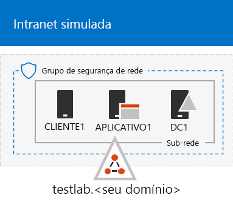

# <a name="the-simulated-enterprise-base-configuration"></a>A configuração base corporativa simulada

*Este Guia de Laboratório de Testes pode ser usado para ambientes de teste corporativo do Microsoft 365 Enterprise e do Office 365.*

Este artigo fornece instruções passo a passo para criar um ambiente simplificado do Microsoft 365 Enterprise, que inclui:

- Uma assinatura de avaliação ou assinatura paga do Microsoft 365 E5.
- Uma intranet de organização simplificada conectada à Internet, composta por três máquinas virtuais em uma Rede Virtual do Microsoft Azure (DC1 APP1 e CLIENT1).
 


Você pode usar o ambiente resultante para testar os recursos e a funcionalidade do [Microsoft 365 Enterprise](https://www.microsoft.com/microsoft-365/enterprise) com os [Guias de laboratório de teste](m365-enterprise-test-lab-guides.md) adicionais ou por sua própria conta.


> [!TIP]
> Acesse [Guia de laboratório de teste do Microsoft 365 Enterprise](../media/m365-enterprise-test-lab-guides/Microsoft365EnterpriseTLGStack.pdf) para obter um mapa visual de todos os artigos da pilha do Guia de laboratório de teste do Microsoft 365 Enterprise.

## <a name="phase-1-create-a-simulated-intranet"></a>Fase 1: criar uma intranet simulada

Nesta fase, você cria uma intranet simulada nos serviços de infraestrutura do Azure, que inclui um controlador de domínio dos Serviços de Domínio do Active Directory (AD DS), um servidor de aplicativos e um computador cliente. 

Você usará esses computadores em outros [Guias de laboratório de teste do Microsoft 365 Enterprise](m365-enterprise-test-lab-guides.md) para configurar e demonstrar a identidade híbrida e outros recursos.

### <a name="method-1-build-your-simulated-intranet-with-an-azure-resource-manager-template"></a>Método 1: criar sua intranet simulada com um modelo do Azure Resource Manager

In this method, you use an Azure Resource Manager (ARM) template to build out the simulated intranet. ARM templates contain all of the instructions to create the Azure networking infrastructure, the virtual machines, and their configuration.

Antes de implantar o modelo, leia toda a [página LEIAME do modelo](https://github.com/maxskunkworks/TLG/tree/master/tlg-base-config_3-vm.m365-ems) e tenha as seguintes informações em mãos:

- The public DNS domain name of your test environment (testlab.\<your public domain>). You'll need to enter this name in the **Domain Name field** of the **Custom deployment** page.
- A DNS label prefix for the URLs of the public IP addresses of your virtual machines. You'll need to enter this label in the **Dns Label Prefix** field of the **Custom deployment** page.

Depois de ler todas as instruções, clique em **Implantar no Azure** na [página LEIAME do modelo](https://github.com/maxskunkworks/TLG/tree/master/tlg-base-config_3-vm.m365-ems) para começar.

>[!Note]
>A intranet simulada criada pelo modelo do ARM requer uma assinatura paga do Azure.
>

Esta é sua configuração após a conclusão do modelo.



### <a name="method-2-build-your-simulated-intranet-with-azure-powershell"></a>Método 2: criar sua intranet simulada com o Azure PowerShell

Nesse método, use o módulo do Windows PowerShell e do Azure PowerShell para criar a infraestrutura de rede, as máquinas virtuais e suas configurações.

Use this method if you want to get experience creating elements of Azure infrastructure one step at a time with PowerShell. You can then customize the PowerShell command blocks for your own deployment of other virtual machines in Azure.

#### <a name="step-1-create-dc1"></a>Etapa 1: criar DC1

Nessa etapa, criamos uma rede virtual do Azure e adicionamos a DC1, uma máquina virtual que se trata de um controlador de domínio para um domínio do AD DS.

Primeiro, inicie o prompt de comando do Windows PowerShell no computador local.
  
> [!NOTE]
> The following command sets use the latest version of Azure PowerShell. See [Get started with Azure PowerShell cmdlets](https://docs.microsoft.com/powershell/azureps-cmdlets-docs/). 
  
Entre na sua conta do Azure usando o comando a seguir.
  
```powershell
Connect-AzAccount
```

Para obter o nome de sua assinatura, use este comando.
  
```powershell
Get-AzSubscription | Sort Name | Select Name
```

Set your Azure subscription. Replace everything within the quotes, including the < and > characters, with the correct name.
  
```powershell
$subscr="<subscription name>"
Get-AzSubscription -SubscriptionName $subscr | Select-AzSubscription
```

Next, create a new resource group for your simulated enterprise test lab. To determine a unique resource group name, use this command to list your existing resource groups.
  
```powershell
Get-AzResourceGroup | Sort ResourceGroupName | Select ResourceGroupName
```

Create your new resource group with these commands. Replace everything within the quotes, including the < and > characters, with the correct names.
  
```powershell
$rgName="<resource group name>"
$locName="<location name, such as West US>"
New-AzResourceGroup -Name $rgName -Location $locName
```

Next, you create the TestLab virtual network that will host the Corpnet subnet of the simulated enterprise environment and protect it with a network security group. Fill in the name of your resource group and run these commands at the PowerShell command prompt on your local computer.
  
```powershell
$rgName="<name of your new resource group>"
$locName=(Get-AzResourceGroup -Name $rgName).Location
$corpnetSubnet=New-AzVirtualNetworkSubnetConfig -Name Corpnet -AddressPrefix 10.0.0.0/24
New-AzVirtualNetwork -Name TestLab -ResourceGroupName $rgName -Location $locName -AddressPrefix 10.0.0.0/8 -Subnet $corpnetSubnet -DNSServer 10.0.0.4
$rule1=New-AzNetworkSecurityRuleConfig -Name "RDPTraffic" -Description "Allow RDP to all VMs on the subnet" -Access Allow -Protocol Tcp -Direction Inbound -Priority 100 -SourceAddressPrefix Internet -SourcePortRange * -DestinationAddressPrefix * -DestinationPortRange 3389
New-AzNetworkSecurityGroup -Name Corpnet -ResourceGroupName $rgName -Location $locName -SecurityRules $rule1
$vnet=Get-AzVirtualNetwork -ResourceGroupName $rgName -Name TestLab
$nsg=Get-AzNetworkSecurityGroup -Name Corpnet -ResourceGroupName $rgName
Set-AzVirtualNetworkSubnetConfig -VirtualNetwork $vnet -Name Corpnet -AddressPrefix "10.0.0.0/24" -NetworkSecurityGroup $nsg
$vnet | Set-AzVirtualNetwork
```

Em seguida, você cria a máquina virtual DC1 e a configura como um controlador de domínio para o **testlab.**\<your public domain> Domínio do AD DS e um servidor DNS para as máquinas virtuais da rede virtual TestLab. Por exemplo, se seu nome de domínio público for **<span>contoso</span>.com**, a máquina virtual DC 1 será um controlador de domínio para o domínio do **<span>testlab</span>.contoso.com**.
  
Para criar uma máquina virtual como DC1, preencha o nome do grupo de recursos e execute estes comandos no prompt de comando do PowerShell, no computador local.
  
```powershell
$rgName="<resource group name>"
$locName=(Get-AzResourceGroup -Name $rgName).Location
$vnet=Get-AzVirtualNetwork -Name TestLab -ResourceGroupName $rgName
$pip=New-AzPublicIpAddress -Name DC1-PIP -ResourceGroupName $rgName -Location $locName -AllocationMethod Dynamic
$nic=New-AzNetworkInterface -Name DC1-NIC -ResourceGroupName $rgName -Location $locName -SubnetId $vnet.Subnets[0].Id -PublicIpAddressId $pip.Id -PrivateIpAddress 10.0.0.4
$vm=New-AzVMConfig -VMName DC1 -VMSize Standard_A2_V2
$cred=Get-Credential -Message "Type the name and password of the local administrator account for DC1."
$vm=Set-AzVMOperatingSystem -VM $vm -Windows -ComputerName DC1 -Credential $cred -ProvisionVMAgent -EnableAutoUpdate
$vm=Set-AzVMSourceImage -VM $vm -PublisherName MicrosoftWindowsServer -Offer WindowsServer -Skus 2016-Datacenter -Version "latest"
$vm=Add-AzVMNetworkInterface -VM $vm -Id $nic.Id
$vm=Set-AzVMOSDisk -VM $vm -Name "DC1-OS" -DiskSizeInGB 128 -CreateOption FromImage
$diskConfig=New-AzDiskConfig -AccountType "Standard_LRS" -Location $locName -CreateOption Empty -DiskSizeGB 20
$dataDisk1=New-AzDisk -DiskName "DC1-DataDisk1" -Disk $diskConfig -ResourceGroupName $rgName
$vm=Add-AzVMDataDisk -VM $vm -Name "DC1-DataDisk1" -CreateOption Attach -ManagedDiskId $dataDisk1.Id -Lun 1
New-AzVM -ResourceGroupName $rgName -Location $locName -VM $vm
```

You will be prompted for a user name and password for the local administrator account on DC1. Use a strong password and record both the name and password in a secure location.
  
Em seguida, conecte-se à máquina virtual DC1.
  
1. No [portal do Azure](https://portal.azure.com), clique em **Grupos de Recursos >** [nome do novo grupo de recursos] **> DC1 > Conectar**.
    
2. In the open pane, click **Download RDP file**. Open the DC1.rdp file that is downloaded, and then click **Connect**.
    
3. Especifique o nome da conta de administrador local na DC1:
    
   - No Windows 7:
    
     In the **Windows Security** dialog box, click **Use another account**. In **User name**, type **DC1\\**[Local administrator account name].
    
   - No Windows 8 ou Windows 10:
    
     In the **Windows Security** dialog box, click **More choices**, and then click **Use a different account**. In **User name**, type **DC1\\**[Local administrator account name].
    
4. Em **Senha**, digite a senha da conta de administrador local e clique em **OK**.
    
5. Quando solicitado, clique em **Sim**.
    
Em seguida, adicione um disco de dados extra como um novo volume com a letra de unidade F:, com este comando, em um prompt de comando do Windows PowerShell de nível de administrador no DC1.
  
```powershell
Get-Disk | Where PartitionStyle -eq "RAW" | Initialize-Disk -PartitionStyle MBR -PassThru | New-Partition -AssignDriveLetter -UseMaximumSize | Format-Volume -FileSystem NTFS -NewFileSystemLabel "WSAD Data"
```

Em seguida, configure o DC1 como um controlador de domínio e servidor DNS para o **testlab.**\<your public domain> domínio. Especifique seu nome de domínio público, remova os \< and > caracteres e execute esses comandos em um prompt de comando do Windows PowerShell no nível de administrador no DC1.
  
```powershell
$yourDomain="<your public domain>"
Install-WindowsFeature AD-Domain-Services -IncludeManagementTools
Install-ADDSForest -DomainName testlab.$yourDomain -DatabasePath "F:\NTDS" -SysvolPath "F:\SYSVOL" -LogPath "F:\Logs"
```
You will need to specify a safe mode administrator password. Store this password in a secure location.
  
Esses comandos podem levar alguns minutos para serem concluídos.
  
Após a reinicialização da DC1, reconecte-se à máquina virtual DC1.
  
1. No [portal do Azure](https://portal.azure.com), clique em **Grupos de Recursos >** [nome do seu grupo de recursos] **> DC1 > Conectar**.
    
2. Execute o arquivo DC1.rdp que foi baixado e clique em **Conectar**.
    
3. In **Windows Security**, click **Use another account**. In **User name**, type **TESTLAB\\**[Local administrator account name].
    
4. Em **Senha**, digite a senha da conta de administrador local e clique em **OK**.
    
5. Quando solicitado, clique em **Sim**.
    
Next, create a user account in Active Directory that will be used when logging in to TESTLAB domain member computers. Run this command at an administrator-level Windows PowerShell command prompt.
  
```powershell
New-ADUser -SamAccountName User1 -AccountPassword (read-host "Set user password" -assecurestring) -name "User1" -enabled $true -PasswordNeverExpires $true -ChangePasswordAtLogon $false
```

Note that this command prompts you to supply the User1 account password. Because this account will be used for remote desktop connections for all TESTLAB domain member computers, choose a strong password. Record the User1 account password and store it in a secured location.
  
Next, configure the new User1 account as a domain, enterprise, and schema administrator. Run this command at the administrator-level Windows PowerShell command prompt.
  
```powershell
$yourDomain="<your public domain>"
$domainName = "testlab."+$yourDomain
$userName="user1@" + $domainName
$userSID=(New-Object System.Security.Principal.NTAccount($userName)).Translate([System.Security.Principal.SecurityIdentifier]).Value
$groupNames=@("Domain Admins","Enterprise Admins","Schema Admins")
ForEach ($name in $groupNames) {Add-ADPrincipalGroupMembership -Identity $userSID -MemberOf (Get-ADGroup -Identity $name).SID.Value}
```

Encerre a sessão da Área de Trabalho Remota com a DC1 e reconecte-se usando a conta \\Usuário1 do TestLab.
  
Em seguida, para permitir o tráfego da ferramenta Ping, execute este comando no prompt de comando de nível de administrador do Windows PowerShell.
  
```powershell
Set-NetFirewallRule -DisplayName "File and Printer Sharing (Echo Request - ICMPv4-In)" -enabled True
```

Essa é sua configuração atual.
  

  
#### <a name="step-2-configure-app1"></a>Etapa 2: configurar o APP1

Nessa etapa, você cria e configura o APP1, que se trata de um servidor de aplicativos que inicialmente fornece serviços de compartilhamento de arquivos e da Web.

Para criar uma Máquina Virtual do Microsoft Azure para a APP1, preencha o nome do grupo de recursos e execute estes comandos no prompt de comando, no computador local.
  
```powershell
$rgName="<resource group name>"
$locName=(Get-AzResourceGroup -Name $rgName).Location
$vnet=Get-AzVirtualNetwork -Name TestLab -ResourceGroupName $rgName
$pip=New-AzPublicIpAddress -Name APP1-PIP -ResourceGroupName $rgName -Location $locName -AllocationMethod Dynamic
$nic=New-AzNetworkInterface -Name APP1-NIC -ResourceGroupName $rgName -Location $locName -SubnetId $vnet.Subnets[0].Id -PublicIpAddressId $pip.Id
$vm=New-AzVMConfig -VMName APP1 -VMSize Standard_A2_V2
$cred=Get-Credential -Message "Type the name and password of the local administrator account for APP1."
$vm=Set-AzVMOperatingSystem -VM $vm -Windows -ComputerName APP1 -Credential $cred -ProvisionVMAgent -EnableAutoUpdate
$vm=Set-AzVMSourceImage -VM $vm -PublisherName MicrosoftWindowsServer -Offer WindowsServer -Skus 2016-Datacenter -Version "latest"
$vm=Add-AzVMNetworkInterface -VM $vm -Id $nic.Id
$vm=Set-AzVMOSDisk -VM $vm -Name "APP1-OS" -DiskSizeInGB 128 -CreateOption FromImage
New-AzVM -ResourceGroupName $rgName -Location $locName -VM $vm
```

Em seguida, conecte-se à máquina virtual APP1 usando o nome da conta e a senha do administrador local APP1 e depois abra um prompt de comando do Windows PowerShell.
  
Para verificar a resolução de nomes e a comunicação de rede entre APP1 e DC1, execute o **ping dc1.testlab.**\<your public domain name> comando e verifique se há quatro respostas.
  
Em seguida, adicione a máquina virtual APP1 ao domínio TestLab com estes comandos, no prompt do Windows PowerShell.
  
```powershell
$yourDomain="<your public domain name>"
Add-Computer -DomainName ("testlab." + $yourDomain)
Restart-Computer
```

Você deve fornecer as credenciais de conta de domínio do \\Usuário1 do TestLab, depois de executar o comando **Add-Computer**.
  
Depois de reiniciar a APP1, conecte-se a ele usando a conta \\Usuário1 do TestLab e abra um prompt de comando do Windows PowerShell em nível de administrador.
  
Em seguida, transforme a APP1 em um servidor Web usando este comando, em um prompt de comando do Windows PowerShell na APP1.
  
```powershell
Install-WindowsFeature Web-WebServer -IncludeManagementTools
```

Em seguida, crie uma pasta compartilhada e um arquivo de texto dentro da pasta da APP1 com estes comandos no PowerShell.
  
```powershell
New-Item -path c:\files -type directory
Write-Output "This is a shared file." | out-file c:\files\example.txt
New-SmbShare -name files -path c:\files -changeaccess TESTLAB\User1
```

Essa é sua configuração atual.
  

  
#### <a name="step-3-configure-client1"></a>Etapa 3: configurar o CLIENT1

Nessa etapa, você cria e configura o CLIENT1, que atua como um laptop, tablet ou computador típico na intranet.

> [!NOTE]  
> The following command set creates CLIENT1 running Windows Server 2016 Datacenter, which can be done for all types of Azure subscriptions. If you have a Visual Studio-based Azure subscription, you can create CLIENT1 running Windows 10 with the [Azure portal](https://portal.azure.com). 
  
Para criar uma Máquina Virtual do Microsoft Azure para CLIENT1, preencha o nome do grupo de recursos e execute estes comandos no prompt de comando, no computador local.
  
```powershell
$rgName="<resource group name>"
$locName=(Get-AzResourceGroup -Name $rgName).Location
$vnet=Get-AzVirtualNetwork -Name TestLab -ResourceGroupName $rgName
$pip=New-AzPublicIpAddress -Name CLIENT1-PIP -ResourceGroupName $rgName -Location $locName -AllocationMethod Dynamic
$nic=New-AzNetworkInterface -Name CLIENT1-NIC -ResourceGroupName $rgName -Location $locName -SubnetId $vnet.Subnets[0].Id -PublicIpAddressId $pip.Id
$vm=New-AzVMConfig -VMName CLIENT1 -VMSize Standard_A2_V2
$cred=Get-Credential -Message "Type the name and password of the local administrator account for CLIENT1."
$vm=Set-AzVMOperatingSystem -VM $vm -Windows -ComputerName CLIENT1 -Credential $cred -ProvisionVMAgent -EnableAutoUpdate
$vm=Set-AzVMSourceImage -VM $vm -PublisherName MicrosoftWindowsServer -Offer WindowsServer -Skus 2016-Datacenter -Version "latest"
$vm=Add-AzVMNetworkInterface -VM $vm -Id $nic.Id
$vm=Set-AzVMOSDisk -VM $vm -Name "CLIENT1-OS" -DiskSizeInGB 128 -CreateOption FromImage
New-AzVM -ResourceGroupName $rgName -Location $locName -VM $vm
```

Em seguida, conecte-se à máquina virtual CLIENT1 usando o nome da conta e a senha do administrador local da CLIENT1 e depois abra um prompt de comando de nível de administrador no Windows PowerShell.
  
Para verificar a resolução de nomes e a comunicação de rede entre CLIENT1 e DC1, execute o **ping dc1.testlab.**\<your public domain name> comando em um prompt de comando do Windows PowerShell e verifique se há quatro respostas.
  
Em seguida, adicione a máquina virtual do CLIENT1 ao domínio TestLab com estes comandos, no prompt do Windows PowerShell.
  
```powershell
$yourDomain="<your public domain name>"
Add-Computer -DomainName ("testlab." + $yourDomain)
Restart-Computer
```

Você deve fornecer as credenciais de conta de domínio \\Usuário1 do TestLab, depois de executar o comando **Add-Computer**.
  
Depois de reiniciar a CLIENT1, conecte-se a ela usando o nome da conta e a senha do \\Usuário1 do TestLab e abra um prompt de comando do Windows PowerShell em nível de administrador.
  
Após esse procedimento, verifique se você consegue acessar os recursos de compartilhamento de arquivo e da Web no APP1 a partir do CLIENT1.
  
1. No Gerenciador do servidor, na árvore do painel, clique em **Servidor Local**.
    
2. Em **Propriedades do CLIENT1**, clique em **Ativar** ao lado da **Configuração de Segurança Aprimorada do IE**.
    
3. Na **Configuração de Segurança Aprimorada do Internet Explorer**, clique em **Desativar** para **Administradores** e **Usurários** e, então, clique em **OK**.
    
4. Na tela Inicial, clique em **Internet Explorer** e, então, em**OK**.
    
5. Na Barra de endereços, digite **http<span>://</span>app1.testab.**\<your public domain name>**/**, e clique em ENTER. Você deverá ver a página da Web padrão dos Serviços de informações da Internet do APP1.
    
6. Na barra de tarefas da área de trabalho, clique no ícone do Explorador de Arquivos.
    
7. In the address bar, type **\\\\app1\\Files**, and then press ENTER. You should see a folder window with the contents of the Files shared folder.
    
8. In the **Files** shared folder window, double-click the **Example.txt** file. You should see the contents of the Example.txt file.
    
9. Feche o **Bloco de notas do Example.txt ** e a janela da pasta compartilhada **Arquivos**.
    
Essa é sua configuração atual.
  


## <a name="phase-2-create-your-microsoft-365-e5-subscription"></a>Fase 2: criar sua assinatura do Microsoft 365 E5

In this phase, you create a new Microsoft 365 E5 subscription that uses a new Azure AD tenant, one that is separate from your production subscription. You can do this in two ways:

- Use uma assinatura de avaliação do Microsoft 365 E5. 

  The Microsoft 365 E5 trial subscription is 30 days, which can be easily extended to 60 days. When the trial subscription expires, you must either convert it to a paid subscription or create a new trial subscription. Creating new trial subscriptions means you will leave your configuration, which could include complex scenarios, behind.  

- Use uma assinatura de produção separada do Microsoft 365 E5 com uma pequena quantidade de licenças.

  This is an additional cost, but ensures that you have a working test environment to try features, configurations, and scenarios that does not expire. You can use the same test environment over the long term for proofs of concept, demonstration to peers and management, and application development and testing. This is the recommended method.

### <a name="sign-up-for-an-office-365-e5-trial-subscription"></a>Inscrever-se em uma assinatura de avaliação do Office 365 E5

Conectar-se ao CLIENT1 com a conta CORP\Usuário1 do portal do Azure.

Para criar uma nova assinatura de avaliação do Office 365 E5, siga as instruções na [Fase 1](lightweight-base-configuration-microsoft-365-enterprise.md#phase-1-create-your-office-365-e5-subscription) do Guia de Laboratório de Teste da configuração de base leve.

Para configurar sua nova assinatura de avaliação do Office 365 E5, siga as instruções na [Fase 2](lightweight-base-configuration-microsoft-365-enterprise.md#phase-2-configure-your-office-365-trial-subscription) do Guia de Laboratório de Teste da configuração de base leve.

#### <a name="using-an-office-365-e5-test-environment"></a>Usando um ambiente de teste do Office 365 E5

Se você quiser apenas um ambiente de teste do Office 365, você pode parar aqui. 

Confira [Guias de Laboratório de Testes do Microsoft 365 Enterprise](m365-enterprise-test-lab-guides.md) para Guias de Laboratório de Testes adicionais que se aplicam ao Office 365 e ao Microsoft 365.

### <a name="add-a-microsoft-365-e5-trial-subscription"></a>Adicionar uma assinatura de avaliação do Microsoft 365 E5

Para uma assinatura de avaliação do Microsoft 365 E5 e configurar suas contas de usuários com licenças, siga as instruções na [Fase 3](lightweight-base-configuration-microsoft-365-enterprise.md#phase-3-add-a-microsoft-365-e5-trial-subscription) do Guia de Laboratório de Teste da configuração de base leve.

  
## <a name="results"></a>Resultados

Seu ambiente de teste agora tem:
  
- Assinatura de avaliação do Microsoft 365 E5.
- Todas as suas contas de usuário apropriadas estão habilitadas para usar o Microsoft 365 E5.
- Uma intranet simulada e simplificada.
    
Esta é sua configuração final.
  

  
Agora você está pronto para experimentar os recursos adicionais do [Microsoft 365 Enterprise](https://www.microsoft.com/microsoft-365/enterprise).
  
## <a name="next-steps"></a>Próximas etapas

Explore esses conjuntos adicionais de guias de laboratório de teste:
  
- [Identidade](m365-enterprise-test-lab-guides.md#identity)
- [Gerenciamento de dispositivo móvel](m365-enterprise-test-lab-guides.md#mobile-device-management)
- [Proteção de informações](m365-enterprise-test-lab-guides.md#information-protection)

## <a name="see-also"></a>Confira também

[Guias do Laboratório de Teste do Microsoft 365 Enterprise](m365-enterprise-test-lab-guides.md)

[Implantar o Microsoft 365 Enterprise](deploy-microsoft-365-enterprise.md)

[Documentação do Microsoft 365 Enterprise](https://docs.microsoft.com/microsoft-365-enterprise/)
