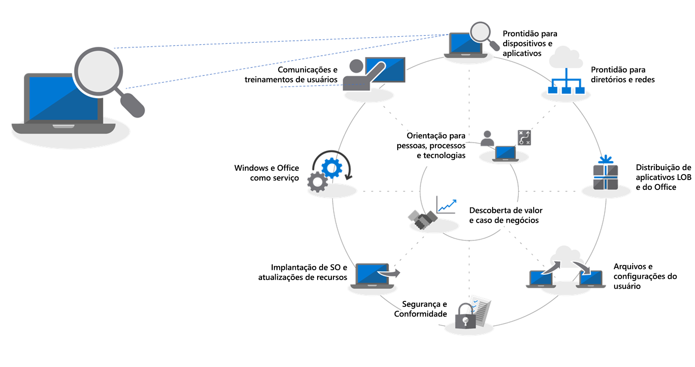
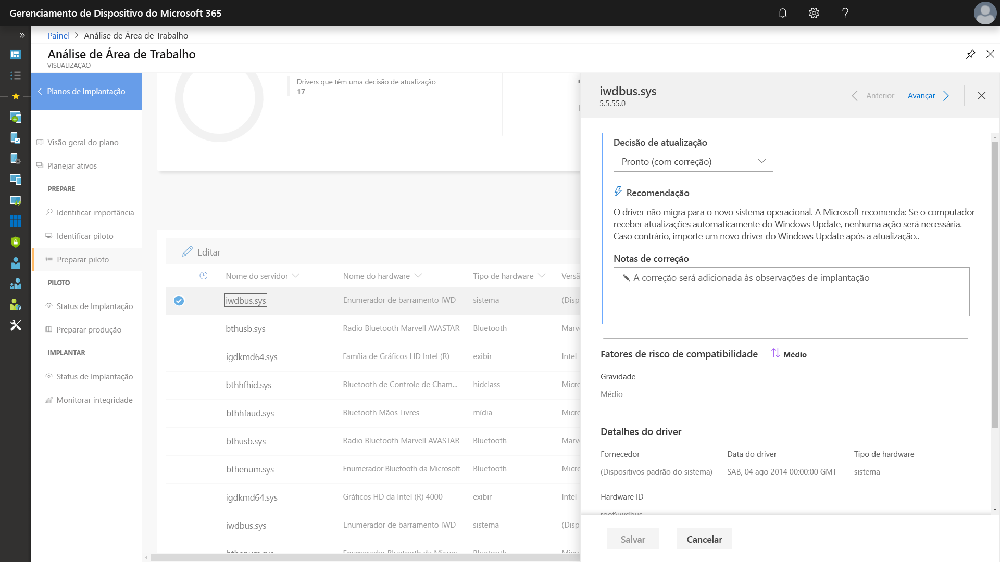
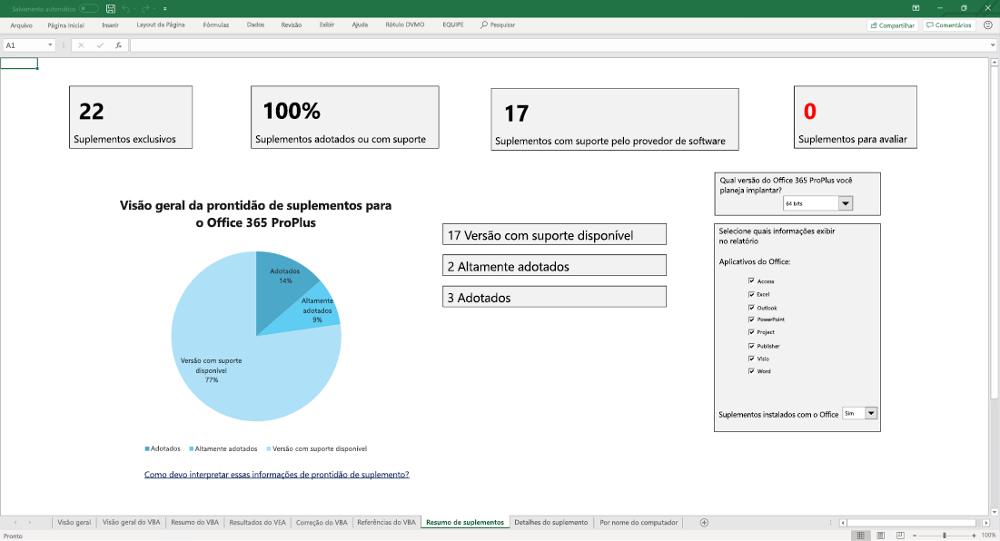

# Etapa 1: preparação de dispositivos e aplicativos

<table>
<thead>
<td></td>
<td>
<strong>Etapa 1: Preparação de Dispositivos e Aplicativos</strong>

Comece o seu projeto de implantação do desktop com um inventário dos seus dispositivos e aplicativos, priorize o que precisa para prosseguir, teste os aplicativos e dispositivos priorizados e corrija o que for necessário para se preparar para a implantação.
</td>
<td></td>
</thead>
</table>

>[!NOTE]
>A Preparação de Dispositivo e Aplicativos é a primeira etapa dos nossos processos de implantação recomendados, cobrindo os aspectos abrangentes da compatibilidade de aplicativos e hardware.  Para ver o processo completo de implantação de desktop, visite o [Centro de Implantação de Desktop](https://aka.ms/HowToShift).
>

No passado, um grande desafio para a atualização de computadores dos usuários era a compatibilidade entre aplicativos e hardware. A boa notícia ao planejar sua migração para o Windows 10 e Office 365 ProPlus é que qualquer aplicativo escrito nos últimos 10 anos funciona no Windows 10, e todos os suplementos e macros do VBA que sua organização usou em versões do Office desde o Office 2010 continuam a funcionar em versões mais recentes do Office, sem precisar de modificações.

Dito isto, dependendo do tamanho e da idade da sua organização, verificar a compatibilidade entre aplicativos e hardware provavelmente ainda é uma etapa inicial essencial no nosso processo de implantação recomendado de fase de 8.

Neste artigo, fornecemos orientações sobre esta primeira fase – Preparação de Dispositivos e Aplicativos – usando a nova ferramenta Desktop Analytics, uma solução inteligente baseada na nuvem disponível com sua licença do Windows.

## Verificação de compatibilidade do Windows 10

Antes da implantação do Windows 10, a Microsoft recomenda verificar a preparação do seu dispositivo existente executando o Windows 7 ou 8/8.1. A mídia de instalação do Windows 10 dá suporte a uma opção de linha de comando para o setup.exe executar a atualização, mas apenas verificando a compatibilidade sem realmente executá-la. O ScanOnly pode ser executado como um arquivo em lotes com script ou integrado à sequência de tarefas do System Center Configuration Manager, incluindo a possibilidade de executar o ScanOnly diretamente da rede, deste modo, a mídia de instalação do Windows 10 não é transmitida para o dispositivo. Quando o ScanOnly termina a verificação, os resultados são retornados, através de códigos de retorno, em arquivos de log gerados pelo Setup.EXE.   

Uma amostra da linha de comando ScanOnly que silenciosamente conclui a verificação de compatibilidade ficaria parecido com o abaixo:

    Setup.EXE /Auto Upgrade /Quiet /NoReboot /Compat ScanOnly

Para saber mais sobre o ScanOnly e outras opções de comando de configuração do Windows, verifique as [Opções de Linha de Comando de Instalação do Windows](https://aka.ms/setupswitches).

## Ferramenta Recomendada: Análise de Área de Trabalho

O Desktop Analytics oferece muitas vantagens em relação aos sistemas de gerenciamento de desktop tradicionais e é a nossa ferramenta recomendada. Funciona sem agentes e fornece orientações sobre o que precisa ser feito, usando as informações de compatibilidade coletadas por meio da atualização de centenas de milhões de computadores dos clientes. Essas informações fornecem uma avaliação detalhada, identificando problemas de compatibilidade que podem bloquear sua atualização, suportadas com links para correções sugeridas e conhecidas pela Microsoft.

Para configurar o Desktop Analytics, primeiro você precisa configurar uma assinatura do Azure e incluir um espaço de trabalho do Azure Log Analytics nela. Uma vez que o serviço Desktop Analytics esteja em execução, será possível inscrever qualquer dispositivo Windows 7 SP1 conectado à Internet ou um dispositivo mais novo por meio das configurações de política de grupo - é simples. Não há agentes para implantar e o fluxo de trabalho visual do Desktop Analytics o guiará da implantação piloto até a produção. Se desejar, é possível exportar dados do Desktop Analytics para as ferramentas de implantação de software, como o System Center Configuration Manager (Branch Atual), para direcionar os computadores diretamente e criar coleções à medida que estiverem prontas para implantação.

Se você atualmente não tem o Desktop Analytics configurado para seu ambiente, ou deseja inscrever-se para uma avaliação, acesse a Página do Desktop Analytics](https://www.aka.ms/desktopanalytics) e comece a usar.

## Processo de Preparação de Dispositivos e Aplicativos

A Preparação de Dispositivo e aplicativos é composta de quatro etapas: 1. Inventariar, 2. Priorizar, 3. Testar, 4. Corrigir. Vamos observar cada uma delas mais de perto.

### 1\. Inventariar

O Desktop Analytics usa um processo sem agentes para inventariar os computadores e aplicativos na sua área de trabalho. Ele também fornece relatórios sobre sites da Internet, aplicativos e locais da intranet altamente visitados, ajudando a realizar testes de compatibilidade posteriormente.

### 2\. Priorizar

Com o inventário realizado, o Desktop Analytics ajuda a identificar e priorizar os aplicativos e hardware mais comumente usados na sua organização e também foca no desbloqueio do máximo de computadores possível para implantação.

Fornecendo também orientações para ajudar a avaliar as atualizações necessárias para resolver problemas durante a próxima etapa: o teste.

### 3\. Testando

Você vai notar que a maioria dos aplicativos, drivers e suplementos inventariados irão funcionar da mesma forma. Para os itens que o Desktop Analytics avalia como estando com problemas, ele mostra as informações locais, incluindo onde encontrar as atualizações da versão para resolver problemas de compatibilidade. Em vez de dedicar tempo e recursos à resolução de problemas complexos em aplicativos não críticos, pouco utilizados e em dispositivos mais antigos, você poderá optar por trabalhar com os usuários para desativar e substituir esses itens.

Você pode usar o Desktop Analytics para avaliar os problemas de compatibilidade com base no navegador também, identificando sites e aplicativos da Web acessados por usuários que ainda usam controles ActiveX, objetos auxiliares do navegador, VBScript ou outras tecnologias herdadas que não têm suporte no navegador Microsoft Edge. Os usuários ainda precisam usar o Internet Explorer 11 para esses sites, e você pode adicioná-los à [lista de sites do modo empresarial](https://docs.microsoft.com/microsoft-edge/deploy/emie-to-improve-compatibility), usando o Gerenciador de lista de sites do modo empresarial.

Além disso, para ajudar na mudança para o Office 365 ProPlus, você pode usar o [Readiness Toolkit for Office](https://docs.microsoft.com/deployoffice/use-the-readiness-toolkit-to-assess-application-compatibility-for-office-365-pro) para testar a compatibilidade dos seus suplementos e macros do Microsoft Visual Basic for Applications (VBA).

### 4\. Corrigir

A fase final da preparação de dispositivos e aplicativos é para "corrigir". Aqui o seu objetivo será coletar os softwares necessários ou os pacotes de driver, que serão usados para substituir ou atualizar as versões mais antigas como parte do processo de implantação.

Conforme remedia problemas da lista, você verá que mais e mais PCs ficam "Prontos para implantação". Isso significa que os drivers e os aplicativos nos computadores estão listados como compatíveis com a versão de destino para implantação do Windows 10.

### Inventário de Software Configuration Manager para Priorização dos Aplicativos

O inventário de software Configuration Manager é uma alternativa para usar as soluções de análise baseadas em nuvem para a preparação de dispositivo e aplicativo. Você pode usar contagens de instalação e análise em computadores específicos para ajudar a priorizar testes e validação de compatibilidade, definindo pacotes de aplicativos compatíveis com o Windows 10 por meio de configurações de pacote. Enquanto essa opção não oferece a capacidade para comparar as informações de compatibilidade locais através dos serviços de análise da Microsoft, esta pode ser uma solução eficiente para direcionar uma quantidade menor de aplicativos priorizados para teste manual. 

Para saber mais, confira [Introdução ao inventário de software no System Center Configuration Manager](https://docs.microsoft.com/sccm/core/clients/manage/inventory/introduction-to-software-inventory) e definir os requisitos de plataforma em pacotes de aplicativos no [Pacotes e programas no System Center Configuration Manager](https://docs.microsoft.com/sccm/apps/deploy-use/packages-and-programs).

## Desktop App Assure

Outra ferramenta para ajudar com a compatibilidade de aplicativos do Windows 10 e no Office 365 ProPlus é a [Desktop App Assure](https://aka.ms/desktopappassure) programa disponível através do FastTrack Center. Por meio do Desktop App Assure, no caso de problemas com um aplicativo válido, um engenheiro da Microsoft trabalhará com você, sem nenhum custo adicional, para ajudar a corrigir a incompatibilidade do aplicativo.

## Uso Contínuo de Ferramentas de Telemetria

A análise da área de trabalho não é apenas uma ferramenta que ajuda você a mudar para o Windows 10 e para o Office 365 ProPlus. Depois que os computadores estiverem executando o Windows 10 e o Office 365, você pode usá-lo para ajudar na manutenção da sua implantação e para gerenciar as Atualizações de Recursos semestrais e manter-se atualizado.

## Próxima etapa 

## [Etapa 2: diretório e preparação de rede](https://aka.ms/mdd2)
