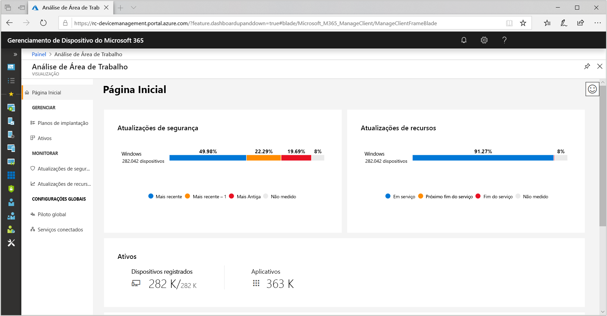
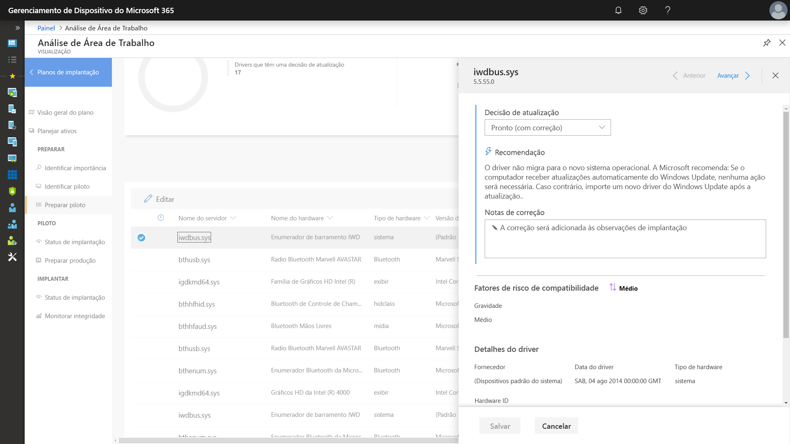
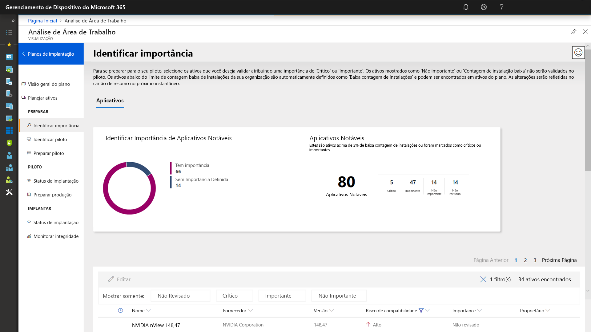
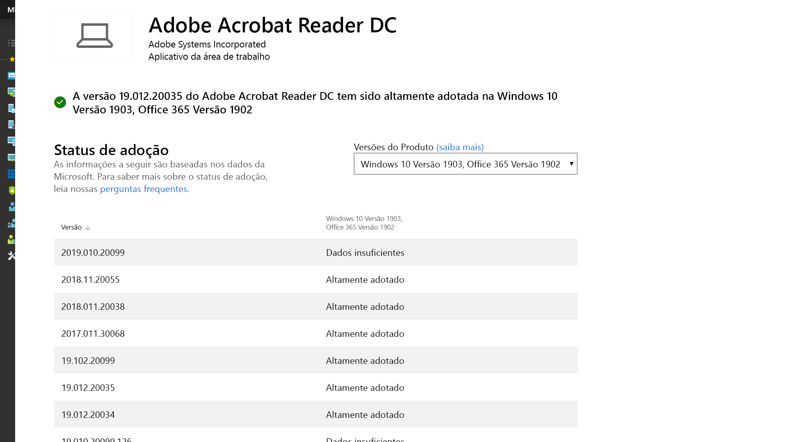
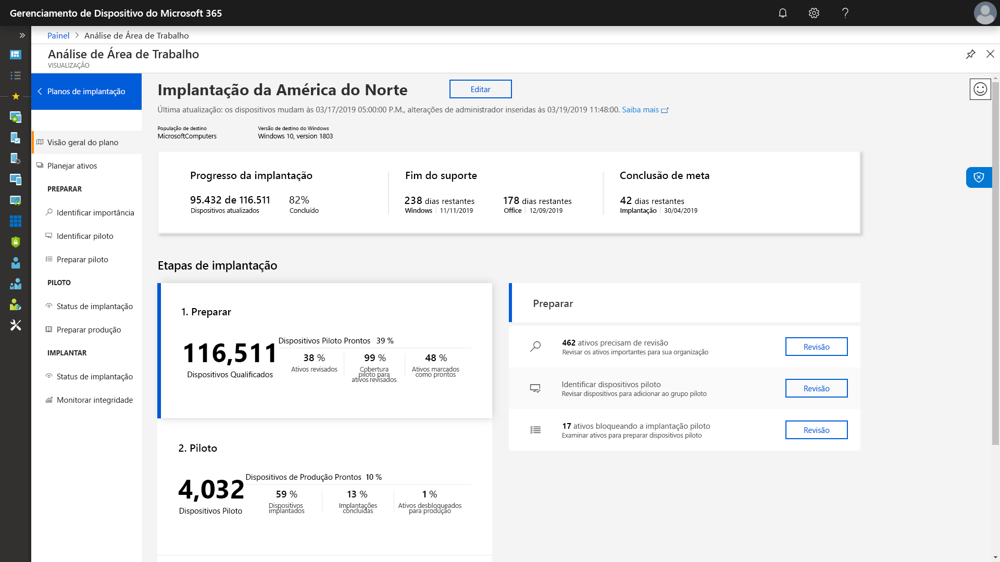

# Etapa 1: preparação de dispositivos e aplicativosStep 1: Device and App Readiness

<table>
<thead>
<td></td>
<td>
<strong>Etapa 1: Preparação de Dispositivos e Aplicativos</strong><strong>Step 1: Device and App Readiness</strong>

Comece o seu projeto de implantação do desktop com um inventário dos seus dispositivos e aplicativos, priorize o que precisa para prosseguir, teste os aplicativos e dispositivos priorizados e corrija o que for necessário para se preparar para a implantação.Begin your desktop deployment project with an inventory of your devices and apps, prioritize what you need to move forward, test prioritized apps and devices, then remediate what’s needed to get ready for deployment.
</td>
<td></td>
</thead>
</table>

>[!NOTE]
>A Preparação de Dispositivo e Aplicativos é a primeira etapa dos nossos processos de implantação recomendados, cobrindo os aspectos abrangentes da compatibilidade de aplicativos e hardware. Device and App Readiness is the first step in our recommended deployment process wheel by covering the holistic aspects of application and hardware compatibility. Para ver o processo completo de implantação de desktop, visite o [Centro de Implantação de Desktop](https://aka.ms/HowToShift).To see the full desktop deployment process, visit the [Desktop Deployment Center](https://aka.ms/HowToShift).
>

No passado, um grande desafio para a atualização de computadores dos usuários era a compatibilidade entre aplicativos e hardware. A boa notícia ao planejar sua migração para o Windows 10 e Office 365 ProPlus é que qualquer aplicativo escrito nos últimos 10 anos funciona no Windows 10, e todos os suplementos e macros do VBA que sua organização usou em versões do Office desde o Office 2010 continuam a funcionar em versões mais recentes do Office, sem precisar de modificações.In the past, a major hurdle to upgrading the users’ desktops is application and hardware compatibility. The good news as you plan your shift to Windows 10 and Office 365 ProPlus, is just about any application written in the last 10 years will run on Windows 10, and any COM add-ins and VBA macros your organization used on versions of Office dating back to Office 2010, will continue to work on the latest versions of Office, without modification.

Dito isto, dependendo do tamanho e da idade da sua organização, verificar a compatibilidade entre aplicativos e hardware provavelmente ainda é uma etapa inicial essencial no nosso processo de implantação recomendado de fase de 8.That said, depending on the size and age of your organization, verifying application and hardware compatibility is likely still an essential initial step in our recommended 8-phase deployment process.

Neste artigo, fornecemos orientações sobre esta primeira fase – Preparação de Dispositivos e Aplicativos – usando a nova ferramenta Desktop Analytics, uma solução inteligente baseada na nuvem disponível com sua licença do Windows.In this article we take you through that first phase – Device and App Readiness – using Microsoft readiness assessment tools including the Desktop Analytics, an intelligent cloud-based solution available with your Windows license.

## Verificação de compatibilidade do Windows 10Windows 10 Compatibility Scan

Antes da implantação do Windows 10, a Microsoft recomenda verificar a preparação do seu dispositivo existente executando o Windows 7 ou 8/8.1.Before deploying Windows 10 Microsoft recommends checking the readiness of your existing devices running Windows 7 or 8/8.1. A mídia de instalação do Windows 10 dá suporte a uma opção de linha de comando para o setup.exe executar a atualização, mas apenas verificando a compatibilidade sem realmente executá-la.Windows 10 installation media supports a command line switch for the setup.exe to run the upgrade but only check for compatibility, not actually perform the upgrade. O ScanOnly pode ser executado como um arquivo em lotes com script ou integrado à sequência de tarefas do Microsoft Endpoint Configuration Manager, incluindo a capacidade de executar o ScanOnly diretamente da rede, deste forma que a mídia de instalação do Windows 10 não é transmitida para o dispositivo.ScanOnly can be run as a scripted batch file or integrated into a Microsoft Endpoint Configuration Manager task sequence, including the ability to run the ScanOnly directly from the network so the Windows 10 installation media isn't streamed down to the local device. Quando o ScanOnly termina a verificação, os resultados são retornados, através de códigos de retorno, em arquivos de log gerados pelo Setup.EXE.When ScanOnly completes the results are returned via return codes in log files generated by Setup.EXE.   

Uma amostra da linha de comando ScanOnly que silenciosamente conclui a verificação de compatibilidade ficaria parecido com o abaixo:A sample ScanOnly command line that completes the compatibility scan silently would look like the below:

    Setup.EXE /Auto Upgrade /Quiet /NoReboot /Compat ScanOnly

Para saber mais sobre o ScanOnly e outras opções de comando de configuração do Windows, verifique as [Opções de Linha de Comando de Instalação do Windows](https://aka.ms/setupswitches).For more information on ScanOnly and other Windows setup command switches please review the [Windows Setup Command-line Options](https://aka.ms/setupswitches).

## Ferramenta Recomendada: Análise de Área de TrabalhoRecommended Tool: Desktop Analytics

O Desktop Analytics oferece muitas vantagens em relação aos sistemas de gerenciamento de desktop tradicionais e é a nossa ferramenta recomendada.Desktop Analytics offers many advantages over traditional desktop management systems and is our recommended tool. Funciona sem agentes e fornece orientações sobre o que precisa ser feito, usando as informações de compatibilidade coletadas por meio da atualização de centenas de milhões de computadores dos clientes.It is agentless and guides you through what needs to be done making use of application and driver compatibility information gathered through the upgrade of hundreds of millions of consumer PCs. Essas informações fornecem uma avaliação detalhada, identificando problemas de compatibilidade que podem bloquear sua atualização, suportadas com links para correções sugeridas e conhecidas pela Microsoft.This information gives you a detailed assessment, identifying compatibility issues that might block your upgrade, supported with links to suggested fixes known to Microsoft.

Para configurar o Desktop Analytics, primeiro você precisa configurar uma assinatura do Azure e incluir um espaço de trabalho do Azure Log Analytics nela.To set up Desktop Analytics you’ll first need to set up an Azure subscription and include an Azure Log Analytics workspace to that. Uma vez que o serviço Desktop Analytics esteja em execução, será possível inscrever qualquer dispositivo Windows 7 SP1 conectado à Internet ou um dispositivo mais novo por meio das configurações de política de grupo - é simples.Once you have the Desktop Analytics service running, you can then enroll any Internet-connected Windows 7 SP1 or newer device via Group Policy settings - it’s that simple. Não há agentes para implantar e o fluxo de trabalho visual do Desktop Analytics o guiará da implantação piloto até a produção.There are no agents to deploy, and Desktop Analytics’ visual workflow guides you from pilot to production deployment. Se desejar, é possível exportar dados do Desktop Analytics para as ferramentas de implantação de software, como o Microsoft Endpoint Configuration Manager (Branch Atual), para direcionar as ações para os computadores diretamente e criar coleções à medida que estiverem prontas para implantação.If you wish, you can export data from Desktop Analytics to software deployment tools such as Microsoft Endpoint Configuration Manager (Current Branch), to target PCs directly and build collections as they become ready for deployment.

Se você atualmente não tem o Desktop Analytics configurado para seu ambiente, ou deseja inscrever-se para uma avaliação, acesse a Página do Desktop Analytics](https://www.aka.ms/desktopanalytics) e comece a usar.If you don’t currently have Desktop Analytics set up for your environment or would like to sign up for a trial, go the Desktop Analytics page](https://www.aka.ms/desktopanalytics) and get started.

## Processo de Preparação de Dispositivos e AplicativosDevice and App Readiness Process

A Preparação de Dispositivo e aplicativos é composta de quatro etapas: 1.Device and App Readiness is comprised of four steps: 1. Inventariar, 2.Inventory, 2. Priorizar, 3.Prioritize, 3. Testar, 4.Test, 4. Corrigir.Remediate. Vamos observar cada uma delas mais de perto.Let’s look at each of these in turn.

### 1\.1\. InventariarInventory

O Desktop Analytics usa um processo sem agentes para inventariar os computadores e aplicativos na sua área de trabalho.Desktop Analytics uses an agent-less process to inventory the computers and applications across your desktop estate. Ele também fornece relatórios sobre sites da Internet, aplicativos e locais da intranet altamente visitados, ajudando a realizar testes de compatibilidade posteriormente.It also provides reports on highly visited Internet sites, apps, and Intranet locations to help you with compatibility testing later.

### 2\.2\. PriorizarPrioritize

Com o inventário realizado, o Desktop Analytics ajuda a identificar e priorizar os aplicativos e hardware mais comumente usados na sua organização e também foca no desbloqueio do máximo de computadores possível para implantação.With inventory taken, Desktop Analytics helps you to identify and prioritize the most common apps and hardware used in your organization, as well as what to focus on to unblock as many PCs as possible for deployment.

Fornecendo também orientações para ajudar a avaliar as atualizações necessárias para resolver problemas durante a próxima etapa: o teste.It also provides guidance to help you assess the updates necessary to resolve issues during the next step: testing.

### 3\.3\. TestandoTesting

Você vai notar que a maioria dos aplicativos, drivers e suplementos inventariados irão funcionar da mesma forma.You will find that most of the applications, drivers, and add-ins inventoried will work as-is. Para os itens que o Desktop Analytics avalia como estando com problemas, ele mostra as informações locais, incluindo onde encontrar as atualizações da versão para resolver problemas de compatibilidade.For items Desktop Analytics assesses to have issues, it provides you with known information including where to find version updates to resolve compatibility problems. Em vez de dedicar tempo e recursos à resolução de problemas complexos em aplicativos não críticos, pouco utilizados e em dispositivos mais antigos, você poderá optar por trabalhar com os usuários para desativar e substituir esses itens.Rather than devoting time and resource resolving complex issues in non-critical, sparsely deployed applications and older devices, you may choose instead to work with users to retire and replace these items.

Você pode usar o Desktop Analytics para avaliar os problemas de compatibilidade com base no navegador também, identificando sites e aplicativos da Web acessados por usuários que ainda usam controles ActiveX, objetos auxiliares do navegador, VBScript ou outras tecnologias herdadas que não têm suporte no navegador Microsoft Edge.You can use Desktop Analytics to assess browser-based compatibility issues too, identifying websites and web apps accessed by users still using ActiveX controls, Browser Helper Objects, VBScript, or other legacy technology not supported by the Microsoft Edge browser. Os usuários ainda precisam usar o Internet Explorer 11 para esses sites, e você pode adicioná-los à [lista de sites do modo empresarial](https://docs.microsoft.com/microsoft-edge/deploy/emie-to-improve-compatibility), usando o Gerenciador de lista de sites do modo empresarial.Your users will still need to use Internet Explorer 11 for these sites, and you can add them to the [Enterprise Mode site list](https://docs.microsoft.com/microsoft-edge/deploy/emie-to-improve-compatibility), using the Enterprise Mode Site List Manager.

Além disso, para ajudar na mudança para o Office 365 ProPlus, você pode usar o [Readiness Toolkit for Office](https://docs.microsoft.com/deployoffice/use-the-readiness-toolkit-to-assess-application-compatibility-for-office-365-pro) para testar a compatibilidade dos seus suplementos e macros do Microsoft Visual Basic for Applications (VBA).Additionally, to assist in your move to Office 365 ProPlus, you may wish to make use of the [Readiness Toolkit for Office](https://docs.microsoft.com/deployoffice/use-the-readiness-toolkit-to-assess-application-compatibility-for-office-365-pro) to test the compatibility of your add-ins and Microsoft Visual Basic for Applications (VBA) macros.

### 4\. Corrigir4\. Remediation

A fase final da preparação de dispositivos e aplicativos é para "corrigir".The final phase of device and app readiness is to ‘remediate’. Aqui o seu objetivo será coletar os softwares necessários ou os pacotes de driver, que serão usados para substituir ou atualizar as versões mais antigas como parte do processo de implantação.Here you’ll want to collect the required software or driver packages; you are going to use these to supersede or update older versions as part of the deployment process.

Conforme remedia problemas da lista, você verá que mais e mais PCs ficam "Prontos para implantação". Isso significa que os drivers e os aplicativos nos computadores estão listados como compatíveis com a versão de destino para implantação do Windows 10.As you work through the list remediating issues, you’ll see that more and more PCs become “Ready for Deployment”. This means that both the drivers and apps on the PCs are noted as compatible with the version of Windows 10 you are targeting for deployment.

### Inventário de Software Configuration Manager para Priorização dos AplicativosConfiguration Manager Software Inventory for Application Prioritization

O inventário de software Configuration Manager é uma alternativa para usar as soluções de análise baseadas em nuvem para a preparação de dispositivo e aplicativo.Configuration Manager software inventory is an alternative to using cloud-based analytics solutions for device and app readiness. Você pode usar contagens de instalação e análise em computadores específicos para ajudar a priorizar testes e validação de compatibilidade, definindo pacotes de aplicativos compatíveis com o Windows 10 por meio de configurações de pacote.You can use installation counts and drill into specific computers to help prioritize compatibility testing and validation and set application packages as compatible with Windows 10 via package settings. Enquanto essa opção não oferece a capacidade para comparar as informações de compatibilidade locais através dos serviços de análise da Microsoft, esta pode ser uma solução eficiente para direcionar uma quantidade menor de aplicativos priorizados para teste manual.While this option does not offer the ability to compare known compatibility information with Microsoft’s analytics services, it can be an effective solution to target a smaller set of prioritized apps for manual testing. 

Para saber mais, confira [Introdução ao inventário de software no Configuration Manager](https://docs.microsoft.com/configmgr/core/clients/manage/inventory/introduction-to-software-inventory) e configurar os requisitos de plataforma em pacotes de aplicativos no [Pacotes e programas no Configuration Manager](https://docs.microsoft.com/configmgr/apps/deploy-use/packages-and-programs).For more information, see [Introduction to software inventory in Configuration Manager](https://docs.microsoft.com/configmgr/core/clients/manage/inventory/introduction-to-software-inventory) and setting platform requirements in application packages in [Packages and programs in Configuration Manager](https://docs.microsoft.com/configmgr/apps/deploy-use/packages-and-programs).

## Garantia de AplicativoApp Assure

Outra ferramenta para ajudar com a compatibilidade de aplicativos do Windows 10 e Office 365 ProPlus é o programa [Desktop App Assure](https://aka.ms/appassure) disponível através do FastTrack Center.Another tool to help with Windows 10 and Office 365 ProPlus app compatibility is the [App Assure](https://aka.ms/appassure) program available through the FastTrack Center. No caso de problemas com um aplicativo válido, um engenheiro da Microsoft trabalha com você sem nenhum custo adicional através do App Assure para ajudar a corrigir a incompatibilidade do aplicativo.In the event of valid application issues, a Microsoft engineer with work with you at no additional cost through App Assure to help remediate the application incompatibility.

## Uso Contínuo de Ferramentas de TelemetriaContinued Use of Diagnostic Data Tools

A análise da área de trabalho não é apenas uma ferramenta que ajuda você a mudar para o Windows 10 e para o Office 365 ProPlus.Desktop Analytics isn’t just a tool to help you shift to Windows 10 and Office 365 ProPlus. Depois que os computadores estiverem executando o Windows 10 e o Office 365, você pode usá-lo para ajudar na manutenção da sua implantação e para gerenciar as Atualizações de Recursos semestrais e manter-se atualizado.Once you have desktops running on Windows 10 and Office 365 you can use it to help maintain your deployment and manage semi-annual Feature Updates so that you can stay current.

## Próxima etapaNext Step 

## [Etapa 2: diretório e preparação de redeStep 2: Directory and Network Readiness](https://aka.ms/mdd2)
