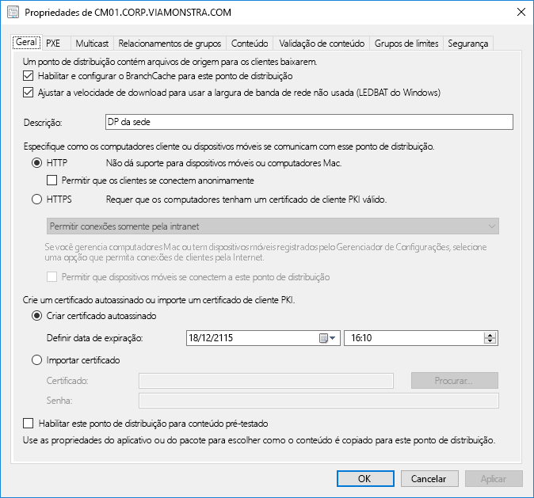
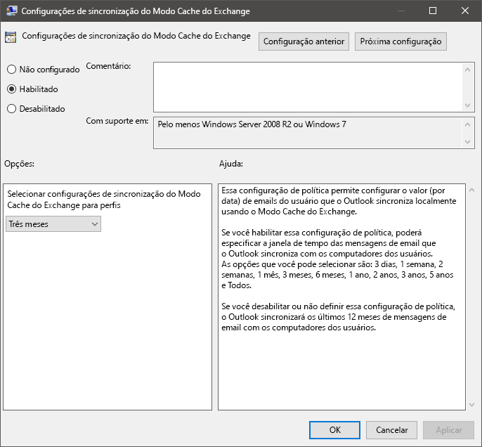
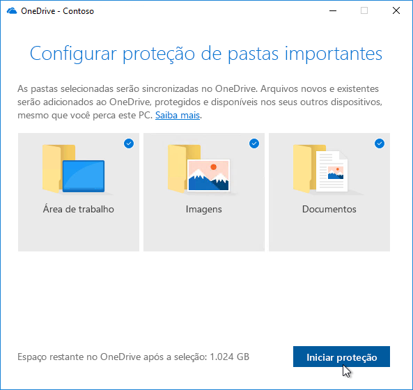

# Etapa 2: Diretório e preparação de redeStep 2: Directory and Network Readiness

Assegure-se de que seu diretório e sua rede estejam configurados e prontos para oferecer suporte à troca para o Windows 10 e o Office 365 ProPlus. Isso exigirá que os serviços do Azure Active Directory estejam estabelecidos para os usuários e que a rede deve ter a capacidade de lidar com o tráfego normal e a movimentação de grandes quantidades de dados em potencial quando os PCs são atualizados e arquivos, configurações e aplicativos do usuário são restaurados.Ensure your directory and the network are configured and ready to support to your shift to Windows 10 and Office 365 ProPlus. This will require Azure Active Directory Services to be in place for users, and your network must have the capacity to handle both its regular traffic and the movement of potentially vast amounts of data as PCs are upgraded, and users’ files, settings and applications are restored.

<table>
<thead>
<td></td>
<td>
<strong>Etapa 2: Diretório e preparação de rede</strong><strong>Step 2: Directory and Network Readiness</strong>

Os serviços conectados à nuvem do Office 365 ProPlus e as novas opções de implantação como o Windows Autopilot requerem o Azure Active Directory. Sua rede e conectividade também são áreas importantes para planejar ao mudar imagens, aplicativos, drivers e arquivos relacionados do Windows para seus PCs. Saiba como as novas ferramentas e opções de implantação reduzem e simplificam o tráfego de rede.Cloud connected services in Office 365 ProPlus and new deployment options like Windows Autopilot require Azure Active Directory. Your network and connectivity are also important areas to plan when moving Windows images, apps, drivers and related files to your PCs. Learn how new tools and deployment options reduce and streamline network traffic.
</td>
<td></td>
</thead>
</table>

>[!NOTE]
>Diretório e Preparação de Rede é a segunda etapa em nosso processo de implantação recomendado, enfocando o Azure Active Directory e a otimização da rede.Directory and Network Readiness is the second step in our recommended deployment process wheel focusing on Azure Active Directory and optimizing the network. Para ver o processo completo de implantação do desktop, visite o [Centro de Implantação do Computador](https://aka.ms/HowToShift).To see the full desktop deployment process, visit the [Desktop Deployment Center](https://aka.ms/HowToShift).
>

A preparação de rede e diretório é fundamental para assegurar uma implantação descomplicada do sistema operacional e da área de trabalho. Como em qualquer implantação automatizada, é importante assegurar que seus compartilhamentos de arquivos possam ser acessados, e sua rede precisará ser capaz de comportar a transferência de arquivos grandes, para possivelmente centenas ou até mesmo milhares de PCs por vez.Directory and Network readiness is fundamental to ensuring a smooth OS and desktop deployment. As with any automated deployment, it is important to ensure your file shares can be reached, and your network will need to be able to support the transfer of very large files, possibly to hundreds or even thousands of PCs at a time.

Com sua migração para o Windows 10 e o Office 365 ProPlus, você agora também precisará assegurar que a identidade baseada em nuvem seja configurada com o Azure Active Directory. Isso é fundamental não apenas para ativar o Office 365 ProPlus, mas também permite que você aproveite soluções de provisionamento modernas como o Windows Autopilot.With your shift to Windows 10 and Office 365 ProPlus you also now need to make sure that cloud-based identity is set up with Azure Active Directory. This is key not only to activating Office 365 ProPlus, it also allows you to take advantage of modern provisioning solutions like Windows Autopilot.

Neste artigo, exploraremos as ferramentas e as opções para preparar seus serviços de diretório, e as permissões de usuário e dispositivos, prontas para implantação no Windows 10 e no Office 365 ProPlus.In this article we’ll explore the tools and options to prepare your directory services, and user and device permissions, ready for deployment to Windows 10 and Office 365 ProPlus.

## Adição do Azure Active DirectoryAdding Azure Active Directory

Se sua organização usa o Office 365, o Exchange Online, o Microsoft Intune ou outros serviços do Microsoft Online, a boa notícia é que você já está usando o Azure Active Directory.If your organization already uses Office 365, Exchange Online, Microsoft Intune, or other Microsoft Online services, the good news is you are already using Azure Active Directory. Caso já esteja usando, apenas verifique se os usuários aos quais você está direcionando a implantação de desktop estão em seu Azure Active Directory e se as licenças foram atribuídas.If you are, you just need to ensure that the users you are targeting for desktop deployment are in your Azure Active Directory and that licenses have been assigned.

Se atualmente não estiver usando o Azure Active Directory, há [vários recursos](https://docs.microsoft.com/azure/active-directory/) para ajudá-lo a configurá-lo.If you are not currently using Azure Active Directory, there are [numerous resources](https://docs.microsoft.com/azure/active-directory/) to help you set it up. É possível que você esteja habilitado a receber assistência personalizada por meio do Microsoft FastTrack, como parte da licença do Office 365.You may well qualify for personalized assistance via Microsoft FastTrack, as part of your Office 365 license. Saiba mais sobre o Microsoft Fastrack clicando [aqui](https://fasttrack.microsoft.com).You can check out more about Microsoft Fastrack [here](https://fasttrack.microsoft.com).

Depois que o Azure Active Directory estiver configurado, os usuários poderão entrar e ativar os aplicativos do Office 365 ProPlus, e você poderá usar a implantação do Microsoft Intune ou do Windows Autopilot para implantação automatizada de aplicativos e políticas.Once you have Azure Active Directory in place, your users can sign in to and activate their Office 365 ProPlus apps, and you can use Microsoft Intune or Windows Autopilot deployment for automated deployment of apps and policy.

## Preparação de redeNetwork Readiness

É necessário considerar os requisitos de largura de banda ao planejar suas implantações.You must consider bandwidth requirements when planning your deployments. Há três componentes principais em uma implantação que terão impacto na rede: geração de imagens de computador, atualizações de software e personalizações de usuário.There are three main components in a deployment that will have an impact on your network – PC imaging, software updates, and user personalization. Entre eles, isso pode significar mais de 20 GB por computador para a migração inicial e geralmente 1 GB ou mais mensal por computador para se manter atualizado.Between them, this can mean in excess of 20 GB per PC for the initial migration, and often 1 GB or more per month per PC to stay up-to-date.

Vamos começar explorando os requisitos de cada um desses três componentes principais:Let’s start by exploring the requirements of each of these three main components:

### Geração de imagens de computadorPC Imaging

Para imagens do Windows sem personalização, é preciso planejar normalmente 3GB por computador, enquanto para imagens personalizadas com aplicativos é necessário permitir 6GB ou mais.For Windows Images with no customization you should plan typically for 3GB per PC, while for customized images with apps you may need to allow 6GB, or more. Também convém considerar pacotes de driver, que podem ser algumas centenas de MB por computador até 1 GB, algumas vezes.You may also need to consider Driver packages; these can be a few hundred megabytes per PC, sometimes up to 1GB.

### Atualizações de softwareSoftware Updates

Será necessário planejar a largura de banda de rede para as atualizações de software.You’ll need to plan network bandwidth for software updates. O Windows 10 e o Office 365 ProPlus usam um novo modelo de manutenção com atualizações mensais e semestrais.Windows 10 and Office 365 ProPlus use a new servicing model delivering monthly and semi-annual updates. Se você estiver começando a usar esse modelo, saiba mais sobre como ele funciona [aqui](https://docs.microsoft.com/windows/deployment/update/waas-overview).If you are new to this model, you can learn more about how this works [here](https://docs.microsoft.com/windows/deployment/update/waas-overview).

O novo modelo de manutenção inclui atualizações de recursos semestrais para o Windows, atualizações de canal semestrais para o Office e atualizações de qualidade mensais. As atualizações de recursos normalmente têm entre 2 e 4 GB, e as atualizações de canal semestrais do Office têm entre 300 e 400 MB por atualização. Então há as atualizações mensais de qualidade. Elas podem ter entre algumas centenas de megabytes e mais de um gigabyte. Isso acontece porque as atualizações mensais são cumulativas, então o tamanho delas aumenta durante o ciclo de vida da manutenção de cada versão do Windows 10. Dito isso, confira as ferramentas que podem reduzir a quantidade de dados que precisam passar pela rede para implementar atualizações. Abordaremos isso em mais detalhes abaixo.The new servicing model includes Feature Updates for Windows twice a year, Office Semi-Annual Channel Updates, and monthly Quality Updates. Feature Updates are typically 2 – 4GB in size, and Office Semi-Annual Channel updates are 300 – 400 MB per update. Then there are the monthly Quality Updates. These may range from a few hundred megabytes to over a gigabyte. This is because monthly updates are cumulative, so these increase in size over the servicing lifetime for each Windows 10 version. That said, there are tools that can help reduce the amount of data that must pass over the network to implement updates. We will cover this in more detail below.

### Personalização do usuárioUser Personalization

O terceiro componente a considerar é a personalização do usuário. Aqui você precisa planejar a largura de banda da rede para acomodar a restauração dos arquivos do usuário, das configurações e dos aplicativos como parte do processo de atualização do PC ou de substituição. Juntos, esses itens frequentemente excedem 20 GB por PC. Para alguns usuários, isso pode passar dos 100 GB.The third component to consider is user personalization. Here you need to plan network bandwidth to accommodate the restoring of user files, their settings, and their applications as part of the PC refresh or replacement process. Together, these items often exceed 20 GB per PC; for some users these may exceed 100 GB.

## Limitar a largura de bandaLimiting Bandwidth

Uma maneira de limitar o impacto do tráfego relacionado a documentos na rede é controlar usando a configuração BITS (Background Intelligent Transfer Service, serviço de transferência inteligente em segundo plano) nos clientes. O BITS usa uma ABR (Adaptive Bit Rate, taxa de bits adaptativa) para ajustar a largura de banda disponível para fins de implantação. Isso pode ser configurado nos clientes usando a Política de Grupo.One way to limit the impact of deployment-related traffic on the network is to throttle it using the BITS (Background Intelligent Transfer Service) setting on clients. BITS uses an Adaptive Bit Rate (ABR) to adjust bandwidth available for deployment purposes; it can be configured on clients using Group Policy.

[Sobre o BITSAbout BITS](https://docs.microsoft.com/windows/desktop/bits/about-bits)

Se você usar o Microsoft Endpoint Configuration Manager (Branch Atual), também poderá configurar os Pontos de Distribuição prontos para BITS ou habilitar o multicast com WDS.If you use Microsoft Endpoint Configuration Manager (Current Branch), you can also configure BITS-enabled Distribution Points or enable multicast with WDS.

A limitação de tráfego específico significa que o tráfego de rede normal será menos afetado pelos PCs baixando atualizações e aplicativos. Mas separar um determinado percentual de largura de banda para essas tarefas ajuda que a produtividade não seja afetada pela implantação do Windows ou do Office, e o processo continua em execução conforme necessário. Isso pode piorar o tempo de inatividade relacionado à implantação, impedindo o acesso de usuários aos PCs durante a execução da implantação.Throttling specific traffic means that normal network traffic is less impacted by PCs downloading updates and applications. But carving out a certain percentage of bandwidth for these tasks helps ensure productivity isn’t impacted by Windows or Office deployment and processes continue to run as needed, it can worsen deployment-related downtime, with users locked out of their PCs while a deployment runs.

Felizmente, há novas ferramentas para facilitar o gerenciamento do efeito na rede de uma grande implantação de área de trabalho, incluindo LEDBAT para otimizar a largura de banda disponível e as opções ponto a ponto (P2P) para mover o tráfego de implantação para longe do centro da rede e para fora do perímetroFortunately, there are new tools to make it easier for you to manage the network impact of a large-scale desktop deployment, including LEDBAT to optimize use of available bandwidth, and peer-to-peer (P2P) options to move deployment traffic away from the center of the network and out to the perimeter

## Busca de largura de bandaScavenging Bandwidth

O Transporte em Segundo Plano com Latência Otimizada (LEDBAT), com suporte no Windows Server 2019 e no Microsoft Endpoint Configuration Manager (Branch Atual), foi projetado para otimizar o tráfego de rede para os clientes do Windows.Low Extra Delay Background Transport (LEDBAT), supported in Windows Server 2019 and Microsoft Endpoint Configuration Manager (Current Branch), is designed to optimize network traffic to Windows clients.

[10 principais recursos de rede no Windows Server 2019: \#9 LEDBAT – Transporte em segundo plano com latência otimizadaTop 10 Networking Features in Windows Server 2019: \#9 LEDBAT – Latency Optimized Background Transport](https://blogs.technet.microsoft.com/networking/2018/07/25/ledbat/)

Ao contrário do controle tradicional, o LEDBAT pode usar toda a largura de banda disponível como tarefa em segundo plano, liberando largura de banda instantaneamente quando solicitado por outro tráfego. Diferentemente do BITS, não há atraso, tudo é automatizado, sem a necessidade de ajuste ou programação manual, e tudo é configurado no servidor. Isso possibilita grandes ganhos de desempenho em potencial.Unlike traditional throttling, LEDBAT can use all available network bandwidth as a background task, instantly yielding bandwidth when other traffic requests it. Unlike BITS there is no delay; everything is automated – no manual tuning or scheduling required, and everything is setup server side. This affords potentially massive performance gains.

## Opções ponto a pontoPeer-to-Peer options

As opções de ponto a ponto estão sendo cada vez mais usadas em migrações do Windows 10, para geração de imagens de computador, atualizações de software e personalização de usuário. Elas também são importantes para facilitar as atualizações entre compilações depois da implantação inicial do Windows 10. Aqui vamos ver diversos exemplos para ajudar a mover o tráfego relacionado ao Windows 10 e ao Office para longe do centro da rede, reduzindo a necessidade de abordagens de controle clássicas e permitindo que os PCs encontrem os arquivos de atualização necessários em pontos na rede local em vez de baixá-los de um ponto de distribuição ou da Internet.Peer-to-Peer options are increasingly being used in Windows 10 migrations, for PC imaging, software updates and user personalization. They are also valuable in facilitating build-to-build upgrades after your initial Windows 10 deployment. Here we will cover several examples to help move Windows 10 and Office-related traffic away from the center of the network, reducing the need for classic throttling approaches, and allowing PCs to find the update files they need on peers in their local network rather than downloading them from a distribution point or the internet.

O **BranchCache** ajuda você a baixar o conteúdo em ambientes distribuídos sem saturar a rede. São oferecidas duas opções: Modo de Cache Hospedado, que permite usar os servidores locais para armazenar conteúdo em cache, e Modo de Cache Distribuído (um modo com suporte no Configuration Manager), que permite aos clientes compartilhar o conteúdo já baixado entre eles.**BranchCache** can help you download content in distributed environments without saturating the network. It comes in two options: Hosted Cache Mode, which lets you use local servers to cache content, and Distributed Cache Mode (a mode supported in Configuration Manager), which lets clients share already downloaded content with each other.

**Cache Par** Os clientes com suporte no Configuration Manager também podem utilizar o Cache Par.**Peer Cache** Clients supported by Configuration Manager can also make use of Peer Cache. Isso permite que os computadores disponibilizados de maneira confiável na rede hospedem a origem para a distribuição de conteúdo.This allows PCs that are reliably available on the network to host source for content distribution. Não habilite isso em todos os computadores, mas apenas nos dispositivos com conexões de rede confiáveis como hosts (por exemplo, desktop, minitorre ou PCs em torre).You won’t want to enable this all of your PCs – only target devices with reliable network connections as hosts (e.g. desktop, mini-tower, or tower PCs). O Cache Par pode funcionar até para tarefas de implantação em execução em fases do Windows PE durante a instalação.Peer Cache can even work for deployment tasks running in Windows PE phases during setup.

Observação: BranchCache e cache de mesmo nível são complementares e podem funcionar juntos no mesmo ambiente.Note: BranchCache and Peer Cache are complementary and can work together in the same environment.

[BranchCache versus Cache ParBranchCache vs. Peer Cache](https://blogs.technet.microsoft.com/swisspfe/2018/01/25/branch-cache-vs-peer-cache/)

**Otimização de Entrega** A Otimização de Entrega é outra tecnologia de cache ponto a ponto, que fornece controles baseados na rede para as implantações.**Delivery Optimization** Delivery Optimization is another peer-to-peer caching technology, providing network-based controls for deployments. A Otimização de Entrega do Windows 10 serve para atualizar aplicativos UWP internos, para instalar aplicativos da Microsoft Store e para as atualizações de software que usam atualizações expressas.Windows 10 Delivery Optimization to update built-in UWP apps, also to install applications from the Microsoft Store, and for software updates using Express Updates. Ela está disponível desde as versões mais antigas do Windows 10, mas foi recentemente integrada ao Microsoft Endpoint Configuration Manager (Branch Atual).It has been available since early versions of Windows 10, though it has only recently integrated with Microsoft Endpoint Configuration Manager (Current Branch). Desde a versão 1803 do Windows 10, as novas opções de configuração permitem definir, de maneira independente, os limites de largura de banda para atualizações em segundo plano e trabalhos de primeiro plano, como a instalação de um aplicativo da loja.Since Windows 10 version 1803 new configuration options mean you can now independently set bandwidth limits for background updates and foreground jobs such as an app install from the Store. A Otimização de Entrega do Windows agora também dá suporte ao Office 365 ProPlus durante as atualizações de cliente, disponíveis em todos os canais de atualização de cliente do Office 365.Windows Delivery Optimization now also supports Office 365 ProPlus during client updates, available in all supported Office 365 client update channels. O suporte para a Otimização de Entrega do Windows durante a instalação inicial do Office 365 será disponibilizada em breve.Support for Windows Delivery Optimization during Office 365 client initial installation will be coming soon.  

**Considerações adicionais sobre o Office 365 ProPlus****Additional Considerations for Office 365 ProPlus**

Além de aprimorar a Otimização de Entrega, veja a seguir três itens que ajudarão a reduzir a carga de rede em razão de implantações do Office 365 ProPlus.In addition to leveraging Delivery Optimization, here are three items that will help reduce your network load due to Office 365 ProPlus deployments.

**Compactação delta binária** O Office 365 ProPlus usa a compactação delta binária para reduzir a largura de banda consumida pelas atualizações de software ao atualizar da versão mais recente do Office 365 ProPlus para a nova versão. Ao obter apenas as alterações de nível binário da versão anterior, o impacto do crescimento mensal de atualizações cumulativas é minimizado. Isso tem o potencial para economizar diversas centenas de dados, por PC, a cada mês. Para usar esse recurso, não é possível pular versões. Se fizer isso, a atualização cumulativa completa deverá ser baixada.**Binary Delta Compression** Office 365 ProPlus uses Binary Delta Compression to reduce bandwidth consumed by software updates when updating from the most recent release of Office 365 ProPlus to the next release. By only pulling the binary level changes from the previous release, the impact from month-over-month growth of cumulative updates is minimized. This has the potential of saving several hundred megabytes of data, per PC, each month. In order to use this capability though, you cannot skip releases. If you do, then the full cumulative update must be downloaded.

[Baixar as atualizações do Office 365Downloading Updates for Office 365](https://docs.microsoft.com/deployoffice/overview-of-the-update-process-for-office-365-proplus#download-the-updates-for-office-365-proplus)

**Arquivos de Dados do Outlook** O Outlook geralmente está configurado para armazenar localmente em cache toda a caixa de correio do usuário para uso offline.**Outlook Data Files** Outlook is often configured to cache users’ entire mailbox locally for use offline. Em qualquer implantação do Windows, exceto em uma atualização in-loco, são necessários os Arquivos de dados do Outlook dos usuários para recriá-los por conta própria após a atualização.In any Windows deployment, except an in-place upgrade, that requires the users’ Outlook Data Files to rebuild themselves after the upgrade. Este é um processo automatizado, mas com limites de caixas de correio do Outlook normalmente definidos em até 100 GB, um novo armazenamento local em cache de toda a caixa de correio de todos os usuários indica muita transferência de dados.This is an automated process, but with Outlook mailbox limits typically set to up to 100GB, re-caching the entire mailbox locally for all users means a lot of data transfer. Para reduzir a carga da rede, considere a possibilidade de usar a Política de Grupo para reduzir a configuração de “Email para manter offline”.To reduce the network load you may want to consider using Group Policy to reduce the “Mail to keep offline” setting. No Office 365 ProPlus ou Office 2016, o valor padrão para o Outlook está definido como 12 meses.In Office 365 ProPlus or Office 2016 the default value for Outlook is set to 12 months. Para reduzir o impacto na rede, considere configurar o cache offline para ter uma duração entre 1 a 6 meses.In order to reduce network impact consider setting the offline cache to last between 1 to 6 months. Alterar essa configuração não afetará o tamanho da caixa de correio online, e toda a caixa de correio ainda pode ser pesquisada pelo Outlook quando estiver online.Changing this setting does not affect the size of the online mailbox, and the entire mailbox can still be searched via Outlook when online.

**Arquivos sob Demanda do OneDrive e Mudança de Pastas Conhecidas** O OneDrive é uma ótima maneira de sincronizar e proteger os arquivos do usuário de computadores e de outros dispositivos na nuvem.**OneDrive Files on Demand and Known Folder Move** OneDrive is a great way to synchronize and protect user files from PCs and other devices in the cloud. Com a Mudança de Pastas Conhecidas, você pode impor a sincronização de arquivos da Área de trabalho do usuário, de Documentos e das Pastas de imagens para o OneDrive, tornando esses arquivos disponíveis ao entrar em um novo dispositivo ou em um computador com imagem refeita.With Known Folder Move, you can enforce file sync from a user’s Desktop, Documents, and Pictures folders to OneDrive making those files available when signing into a new device a or reimaged PC. Entretanto, lembre-se de que, devido ao tamanho absoluto e ao número de arquivos mantidos na Área de trabalho, nas pastas Documentos e Imagens, é importante planejar bem a implementação das políticas que habilitam e impõem o OneDrive em seus computadores.Remember though, due to the sheer size and number of files kept in Desktop, Documents, and Pictures locations, you’ll want to be planful with the rollout of policies enabling and enforcing OneDrive on your PCs. Uma opção é usar os controles de Rede de Política de Grupo para limitar a largura de banda usada pelo serviço de sincronização do OneDrive.One option is to use Group Policy Network controls to throttle bandwidth used by the OneDrive sync service.

[Movimentação de pastas conhecidas da instalaçãoSetup Known Folder Move](https://techcommunity.microsoft.com/t5/Microsoft-OneDrive-Blog/Migrate-Your-Files-to-OneDrive-Easily-with-Known-Folder-Move/ba-p/207076)

[Arquivos do OneDrive sob demandaOneDrive Files on Demand](https://www.microsoft.com/microsoft-365/blog/2017/05/11/introducing-onedrive-files-on-demand-and-additional-features-making-it-easier-to-access-and-share-files/)

Se você ainda não implementou o OneDrive, a mudança do Windows 7 para o Windows 10 é a oportunidade perfeita para habilitar o OneDrive, que se integra facilmente ao Office 365 ProPlus.If you haven’t already rolled out OneDrive, the shift from Windows 7 to Windows 10 is a perfect opportunity to enable OneDrive and it integrates seamlessly Office 365 ProPlus. Considere iniciar essa implementação enquanto estiver trabalhando na preparação dos aplicativos e dispositivos.Consider starting this roll-out while working through your app and device readiness. Isso iniciará a sincronização de arquivos antes de começar a mover as imagens do Windows e a implantar os aplicativos em sua rede.This will give file sync a head start before you start moving Windows images and deploying apps over your network.

## Próxima etapaNext Step 

## [Etapa 3: Entrega de aplicativos do Office e LOBStep 3: Office and LOB App Delivery](https://aka.ms/mdd3)

## Etapa anterior:Previous Step:

## [Etapa 1: Preparação de dispositivos e aplicativosStep 1: Device and App Readiness](https://aka.ms/mdd1)

## ComentáriosFeedback

Adoraríamos ouvir suas ideias. Escolha uma forma:We'd love to hear your thoughts. Choose the type you'd like to provide:

Comentários sobre o produto. Entre para fazer comentários sobre a documentaçãoProduct feedback Sign in to give documentation feedback

Nosso novo sistema de comentários foi criado com base nos problemas do GitHub. Leia sobre essa alteração no post do blog.Our new feedback system is built on GitHub Issues. Read about this change in our blog post.
