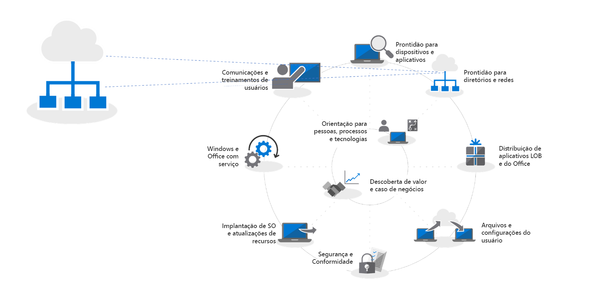
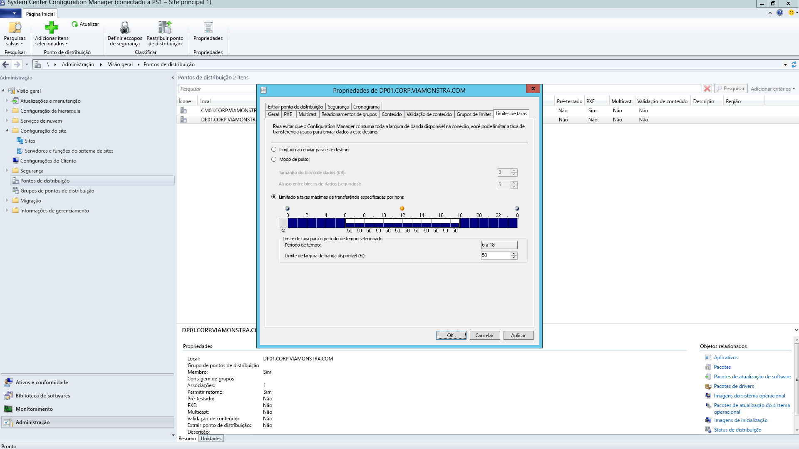
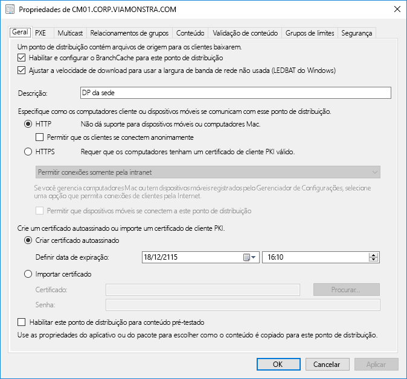
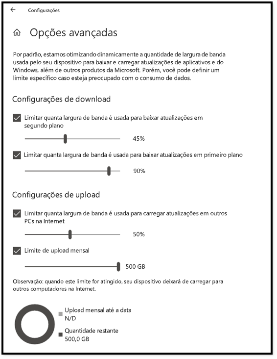
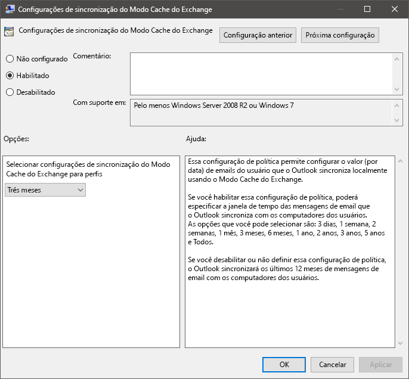
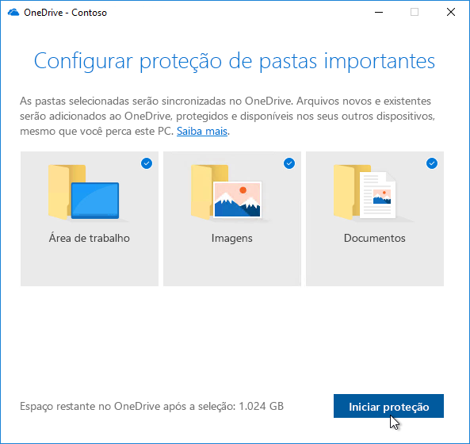

# Etapa 2: Diretório e preparação de rede

Assegure-se de que seu diretório e sua rede estejam configurados e prontos para oferecer suporte à troca para o Windows 10 e o Office 365 ProPlus. Isso exigirá que os serviços do Azure Active Directory estejam estabelecidos para os usuários e que a rede deve ter a capacidade de lidar com o tráfego normal e a movimentação de grandes quantidades de dados em potencial quando os PCs são atualizados e arquivos, configurações e aplicativos do usuário são restaurados.

<table>
<thead>
<td></td>
<td>
<strong>Etapa 2: Diretório e preparação de rede</strong>

Os serviços conectados à nuvem do Office 365 ProPlus e as novas opções de implantação como o Windows Autopilot requerem o Azure Active Directory. Sua rede e conectividade também são áreas importantes para planejar ao mudar imagens, aplicativos, drivers e arquivos relacionados do Windows para seus PCs. Saiba como as novas ferramentas e opções de implantação reduzem e simplificam o tráfego de rede.
</td>
<td></td>
</thead>
</table>

>[!NOTE]
>Diretório e Preparação de Rede é a segunda etapa em nosso processo de implantação recomendado, enfocando o Azure Active Directory e a otimização da rede. Para ver o processo completo de implantação do desktop, visite o [Centro de Implantação do Computador](https://aka.ms/HowToShift).
>

A preparação de rede e diretório é fundamental para assegurar uma implantação descomplicada do sistema operacional e da área de trabalho. Como em qualquer implantação automatizada, é importante assegurar que seus compartilhamentos de arquivos possam ser acessados, e sua rede precisará ser capaz de comportar a transferência de arquivos grandes, para possivelmente centenas ou até mesmo milhares de PCs por vez.

Com sua migração para o Windows 10 e o Office 365 ProPlus, você agora também precisará assegurar que a identidade baseada em nuvem seja configurada com o Azure Active Directory. Isso é fundamental não apenas para ativar o Office 365 ProPlus, mas também permite que você aproveite soluções de provisionamento modernas como o Windows Autopilot.

Neste artigo, exploraremos as ferramentas e as opções para preparar seus serviços de diretório, e as permissões de usuário e dispositivos, prontas para implantação no Windows 10 e no Office 365 ProPlus.

## Adição do Azure Active Directory

Se sua organização usa o Office 365, o Exchange Online, o Microsoft Intune ou outros serviços do Microsoft Online, a boa notícia é que você já está usando o Azure Active Directory. Caso já esteja usando, apenas verifique se os usuários aos quais você está direcionando a implantação de desktop estão em seu Azure Active Directory e se as licenças foram atribuídas.

Se atualmente não estiver usando o Azure Active Directory, há [vários recursos](https://docs.microsoft.com/azure/active-directory/) para ajudá-lo a configurá-lo. É possível que você esteja habilitado a receber assistência personalizada por meio do Microsoft FastTrack, como parte da licença do Office 365. Saiba mais sobre o Microsoft Fastrack clicando [aqui](https://fasttrack.microsoft.com).

Depois que o Azure Active Directory estiver configurado, os usuários poderão entrar e ativar os aplicativos do Office 365 ProPlus, e você poderá usar a implantação do Microsoft Intune ou do Windows Autopilot para implantação automatizada de aplicativos e políticas.

## Preparação de rede

É necessário considerar os requisitos de largura de banda ao planejar suas implantações. Há três componentes principais em uma implantação que terão impacto na rede: geração de imagens de computador, atualizações de software e personalizações de usuário. Entre eles, isso pode significar mais de 20 GB por computador para a migração inicial e geralmente 1 GB ou mais mensal por computador para se manter atualizado.

Vamos começar explorando os requisitos de cada um desses três componentes principais:

### Geração de imagens de computador

Para imagens do Windows sem personalização, é preciso planejar normalmente 3GB por computador, enquanto para imagens personalizadas com aplicativos é necessário permitir 6GB ou mais. Também convém considerar pacotes de driver, que podem ser algumas centenas de MB por computador até 1 GB, algumas vezes.

### Atualizações de software

Será necessário planejar a largura de banda de rede para as atualizações de software. O Windows 10 e o Office 365 ProPlus usam um novo modelo de manutenção com atualizações mensais e semestrais. Se você estiver começando a usar esse modelo, saiba mais sobre como ele funciona [aqui](https://docs.microsoft.com/windows/deployment/update/waas-overview).

O novo modelo de manutenção inclui atualizações de recursos semestrais para o Windows, atualizações de canal semestrais para o Office e atualizações de qualidade mensais. As atualizações de recursos normalmente têm entre 2 e 4 GB, e as atualizações de canal semestrais do Office têm entre 300 e 400 MB por atualização. Então há as atualizações mensais de qualidade. Elas podem ter entre algumas centenas de megabytes e mais de um gigabyte. Isso acontece porque as atualizações mensais são cumulativas, então o tamanho delas aumenta durante o ciclo de vida da manutenção de cada versão do Windows 10. Dito isso, confira as ferramentas que podem reduzir a quantidade de dados que precisam passar pela rede para implementar atualizações. Abordaremos isso em mais detalhes abaixo.

### Personalização do usuário

O terceiro componente a considerar é a personalização do usuário. Aqui você precisa planejar a largura de banda da rede para acomodar a restauração dos arquivos do usuário, das configurações e dos aplicativos como parte do processo de atualização do PC ou de substituição. Juntos, esses itens frequentemente excedem 20 GB por PC. Para alguns usuários, isso pode passar dos 100 GB.

## Limitar a largura de banda

Uma maneira de limitar o impacto do tráfego relacionado a documentos na rede é controlar usando a configuração BITS (Background Intelligent Transfer Service, serviço de transferência inteligente em segundo plano) nos clientes. O BITS usa uma ABR (Adaptive Bit Rate, taxa de bits adaptativa) para ajustar a largura de banda disponível para fins de implantação. Isso pode ser configurado nos clientes usando a Política de Grupo.

[Sobre o BITS](https://docs.microsoft.com/windows/desktop/bits/about-bits)

Se usar o System Center Configuration Manager (Branch Atual), também poderá configurar os Pontos de Distribuição prontos para BITS ou habilitar o multicast com WDS.

A limitação de tráfego específico significa que o tráfego de rede normal será menos afetado pelos PCs baixando atualizações e aplicativos. Mas separar um determinado percentual de largura de banda para essas tarefas ajuda que a produtividade não seja afetada pela implantação do Windows ou do Office, e o processo continua em execução conforme necessário. Isso pode piorar o tempo de inatividade relacionado à implantação, impedindo o acesso de usuários aos PCs durante a execução da implantação.

Felizmente, há novas ferramentas para facilitar o gerenciamento do efeito na rede de uma grande implantação de área de trabalho, incluindo LEDBAT para otimizar a largura de banda disponível e as opções ponto a ponto (P2P) para mover o tráfego de implantação para longe do centro da rede e para fora do perímetro

## Busca de largura de banda

O Transporte em Segundo Plano com Latência Otimizada (LEDBAT), com suporte no Windows Server 2019 e no System Center Configuration Manager (Branch Atual), foi projetado para otimizar o tráfego de rede para os clientes do Windows.

[10 principais recursos de rede no Windows Server 2019: \#9 LEDBAT – Transporte em segundo plano com latência otimizada](https://blogs.technet.microsoft.com/networking/2018/07/25/ledbat/)

Ao contrário do controle tradicional, o LEDBAT pode usar toda a largura de banda disponível como tarefa em segundo plano, liberando largura de banda instantaneamente quando solicitado por outro tráfego. Diferentemente do BITS, não há atraso, tudo é automatizado, sem a necessidade de ajuste ou programação manual, e tudo é configurado no servidor. Isso possibilita grandes ganhos de desempenho em potencial.

## Opções ponto a ponto

As opções de ponto a ponto estão sendo cada vez mais usadas em migrações do Windows 10, para geração de imagens de computador, atualizações de software e personalização de usuário. Elas também são importantes para facilitar as atualizações entre compilações depois da implantação inicial do Windows 10. Aqui vamos ver diversos exemplos para ajudar a mover o tráfego relacionado ao Windows 10 e ao Office para longe do centro da rede, reduzindo a necessidade de abordagens de controle clássicas e permitindo que os PCs encontrem os arquivos de atualização necessários em pontos na rede local em vez de baixá-los de um ponto de distribuição ou da Internet.

O **BranchCache** ajuda a baixar o conteúdo em ambientes distribuídos sem saturar a rede. São duas opções: modo de cache hospedado, que permite usar os servidores locais para armazenar conteúdo em cache, e modo de cache distribuído (um modo com suporte no System Center Configuration Manager), que permite aos clientes compartilhar o conteúdo já baixado entre eles.

**Cache Par** Os clientes com suporte no System Center Configuration Manager também podem utilizar o Cache Par. Isso permite que os computadores disponibilizados de maneira confiável na rede hospedem a origem para a distribuição de conteúdo. Não habilite isso em todos os computadores, mas apenas nos dispositivos com conexões de rede confiáveis como hosts (por exemplo, desktop, minitorre ou PCs em torre). O Cache Par pode funcionar até para tarefas de implantação em execução em fases do Windows PE durante a instalação.

Observação: BranchCache e cache de mesmo nível são complementares e podem funcionar juntos no mesmo ambiente.

[BranchCache versus Cache Par](https://blogs.technet.microsoft.com/swisspfe/2018/01/25/branch-cache-vs-peer-cache/)

**Otimização de Entrega** A Otimização de Entrega é outra tecnologia de cache ponto a ponto, que fornece controles baseados na rede para as implantações. A Otimização de Entrega do Windows 10 serve para atualizar aplicativos UWP internos, para instalar aplicativos da Microsoft Store e para as atualizações de software que usam atualizações expressas. Ela está disponível desde as versões anteriores do Windows 10, mas foi recentemente integrada ao System Center Configuration Manager (Branch Atual). Desde a versão 1803 do Windows 10, as novas opções de configuração permitem definir, de maneira independente, os limites de largura de banda para atualizações em segundo plano e trabalhos de primeiro plano, como a instalação de um aplicativo da loja. A Otimização de Entrega do Windows agora também dá suporte ao Office 365 ProPlus durante as atualizações de cliente, disponíveis em todos os canais de atualização de cliente do Office 365. O suporte para a Otimização de Entrega do Windows durante a instalação inicial do Office 365 será disponibilizada em breve.  

**Considerações adicionais sobre o Office 365 ProPlus**

Além de aprimorar a Otimização de Entrega, veja a seguir três itens que ajudarão a reduzir a carga de rede em razão de implantações do Office 365 ProPlus.

**Compactação delta binária** O Office 365 ProPlus usa a compactação delta binária para reduzir a largura de banda consumida pelas atualizações de software ao atualizar da versão mais recente do Office 365 ProPlus para a nova versão. Ao obter apenas as alterações de nível binário da versão anterior, o impacto do crescimento mensal de atualizações cumulativas é minimizado. Isso tem o potencial para economizar diversas centenas de dados, por PC, a cada mês. Para usar esse recurso, não é possível pular versões. Se fizer isso, a atualização cumulativa completa deverá ser baixada.

[Baixar as atualizações do Office 365](https://docs.microsoft.com/deployoffice/overview-of-the-update-process-for-office-365-proplus#download-the-updates-for-office-365-proplus)

**Arquivos de Dados do Outlook** O Outlook geralmente está configurado para armazenar localmente em cache toda a caixa de correio do usuário para uso offline. Em qualquer implantação do Windows, exceto em uma atualização in-loco, são necessários os Arquivos de dados do Outlook dos usuários para recriá-los por conta própria após a atualização. Este é um processo automatizado, mas com limites de caixas de correio do Outlook normalmente definidos em até 100 GB, um novo armazenamento local em cache de toda a caixa de correio de todos os usuários indica muita transferência de dados. Para reduzir a carga da rede, considere a possibilidade de usar a Política de Grupo para reduzir a configuração de “Email para manter offline”. No Office 365 ProPlus ou Office 2016, o valor padrão para o Outlook está definido como 12 meses. Para reduzir o impacto na rede, considere configurar o cache offline para ter uma duração entre 1 a 6 meses. Alterar essa configuração não afetará o tamanho da caixa de correio online, e toda a caixa de correio ainda pode ser pesquisada pelo Outlook quando estiver online.

**Arquivos sob Demanda do OneDrive e Mudança de Pastas Conhecidas** O OneDrive é uma ótima maneira de sincronizar e proteger os arquivos do usuário de computadores e de outros dispositivos na nuvem. Com a Mudança de Pastas Conhecidas, você pode impor a sincronização de arquivos da Área de trabalho do usuário, de Documentos e das Pastas de imagens para o OneDrive, tornando esses arquivos disponíveis ao entrar em um novo dispositivo ou em um computador com imagem refeita. Entretanto, lembre-se de que, devido ao tamanho absoluto e ao número de arquivos mantidos na Área de trabalho, nas pastas Documentos e Imagens, é importante planejar bem a implementação das políticas que habilitam e impõem o OneDrive em seus computadores. Uma opção é usar os controles de Rede de Política de Grupo para limitar a largura de banda usada pelo serviço de sincronização do OneDrive.

[Movimentação de pastas conhecidas da instalação](https://techcommunity.microsoft.com/t5/Microsoft-OneDrive-Blog/Migrate-Your-Files-to-OneDrive-Easily-with-Known-Folder-Move/ba-p/207076)

[Arquivos do OneDrive sob demanda](https://www.microsoft.com/microsoft-365/blog/2017/05/11/introducing-onedrive-files-on-demand-and-additional-features-making-it-easier-to-access-and-share-files/)

Se você ainda não implementou o OneDrive, a mudança do Windows 7 para o Windows 10 é a oportunidade perfeita para habilitar o OneDrive, que se integra facilmente ao Office 365 ProPlus. Considere iniciar essa implementação enquanto estiver trabalhando na preparação dos aplicativos e dispositivos. Isso iniciará a sincronização de arquivos antes de começar a mover as imagens do Windows e a implantar os aplicativos em sua rede.

## Próxima etapa 

## [Etapa 3: Entrega de aplicativos do Office e LOB](https://aka.ms/mdd3)

## Etapa anterior:

## [Etapa 1: Preparação de dispositivos e aplicativos](https://aka.ms/mdd1)

## Comentários

Adoraríamos ouvir suas ideias. Escolha uma forma:

Comentários sobre o produto. Entre para fazer comentários sobre a documentação

Nosso novo sistema de comentários foi criado com base nos problemas do GitHub. Leia sobre essa alteração no post do blog.
