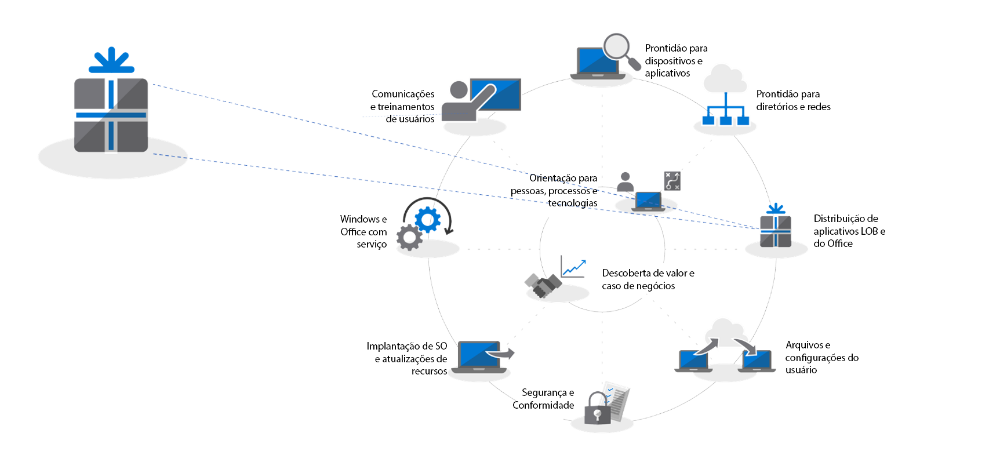
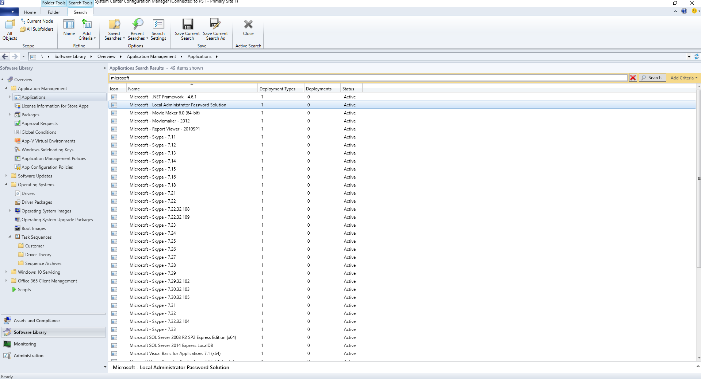
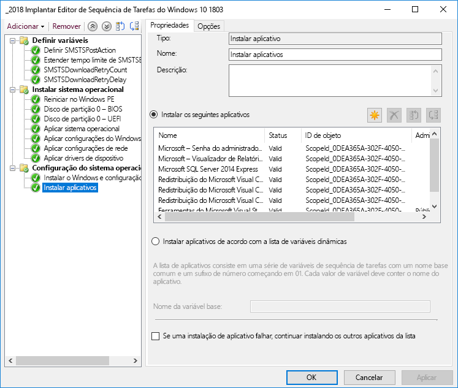
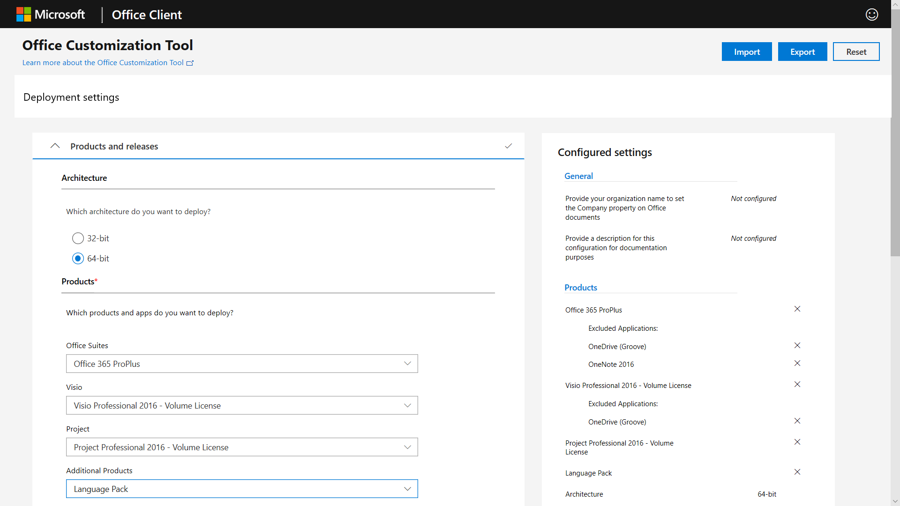
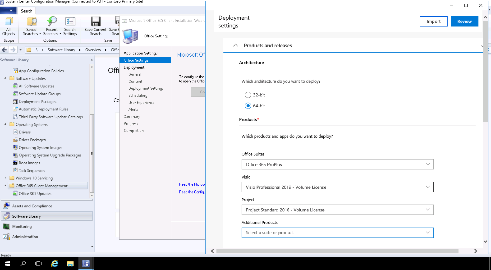

# Etapa 3: Entrega de aplicativos do Office e LOBStep 3: Office and LOB App Delivery

<table>
<thead>
<td></td>
<td>
<strong>Etapa 3: Entrega de aplicativos do Office e LOB</strong><strong>Step 3: Office and LOB App Delivery</strong>

Certifique-se de que os aplicativos estejam empacotados e prontos para instalação automatizada. Saiba como o empacotamento Clique para Executar com o Office 365 ProPlus oferece novas opções para configurar, oferecer e manter seus aplicativos do Office atualizados.Ensure your apps are packaged and ready for automated installation. Learn how Click-to-Run packaging with Office 365 ProPlus gives you new options to configure, deliver and keep your Office apps up-to-date.
</td>
<td></td>
</thead>
</table>

>[!NOTE]
>A Entrega de Aplicativos do Office e LOB é a terceira etapa do processo de implantação recomendado, que aborda as opções de instalação e gerenciamento do Office e LOB.Office and LOB App Delivery is the third step in our recommended deployment process wheel covering the options to install and manage Office and LOB. Para realizar uma implantação bem-sucedida, não ignore as primeiras duas etapas.For successful deployment do not skip the first two steps.  Para ver o processo completo de implantação do desktop, visite o [Centro de Implantação do Computador](https://aka.ms/HowToShift).To see the full desktop deployment process, visit the [Desktop Deployment Center](https://aka.ms/HowToShift).
>

Agora você está pronto para implantar o Office e seus Aplicativos LOB (Linha de Negócios). Há algumas maneiras de fazer isso, inclusive algumas opções novas e incríveis.You are now ready to deliver Office and your Line of Business Apps and there are a number of ways to do this, including some exciting new options. Enquanto alguns aplicativos só estão disponíveis como uma versão de 32 ou 64 bits compilada, outros como o Office 365 ProPlus, oferecem o código compilado nativo de 32 e 64 bits, e uma das principais decisões que você tomará será sobre a versão que deseja implantar.While some applications are only available as either a 32-bit or 64-bit compiled version, others such as Office 365 ProPlus, offer both as 32-bit and 64-bit native compiled code, and one of biggest decisions you will make is which version to deploy. Para aproveitar a potência computacional adicional e a RAM em novos dispositivos, a Microsoft recomenda usar a versão de 64 bits quando não há nenhuma dependência de 32 bits.To take advantage of additional compute power and RAM on new devices Microsoft recommends using the 64-bit version when there are no 32-bit dependencies. Para determinar possíveis dificuldades de compatibilidade do suplemento ou relacionadas a arquivos, é recomendável rever a Etapa 1, Preparação de dispositivos e aplicativos, antes de continuar.To determine any add-in or file-related compatibility challenges you may have it is recommended to revisit Step 1 Device and App Readiness before you continue.

Se nada estiver impedindo você, recomendamos a implantação de versões de 64 bits de todos os aplicativos, incluindo o Microsoft Office. Os aplicativos nativos compilados de 64 bits oferecem o melhor desempenho e são a opção mais adequada para o futuro.If nothing is blocking you, we recommend you deploy 64-bit versions of all apps, including Microsoft Office. 64-bit native compiled apps offer the best performance and is the most future-proof choice.

Há muitos métodos e modelos para instalar aplicativos no Windows, portanto, vamos analisar suas opções de entrega.There are many methods and models for installing apps on Windows, so let’s look at your delivery options.

[Gerenciamento de aplicativos do Windows 10Windows 10 application management](https://docs.microsoft.com/windows/application-management/)

## Implantações baseadas em MSIMSI-based Deployments

Para seus aplicativos LOB, você provavelmente usará executáveis ou pacotes baseados em MSI e instalará aplicativos como parte de uma sequência de tarefas da implantação do sistema operacional.For your line of business apps, you’ll probably use MSI-based packages or executable  and install apps as part of an OS deployment task sequence. O Windows 10 continua a funcionar com esses pacotes.Windows 10 continues to work with these packages.

As ferramentas de implantação de software, como o System Center Configuration Manager e o Microsoft Intune, também são otimizadas para entregar aplicativos empacotados por MSI. Depois de validar seus aplicativos no Windows 10, você poderá usar o System Center Configuration Manager (ramificação atual) para a entrega de aplicativos. Se usar o Portal da Empresa no Microsoft Intune, você poderá estender a escolha de aplicativos sancionados pela TI disponíveis para a sua organização, com a finalidade de incluir os aplicativos mais recentes, e os usuários para que escolham eles mesmos o que precisam.Software deployment tools like System Center Configuration Manager and Microsoft Intune are also optimized to deliver MSI-packaged apps. Once you have validated your apps on Windows 10, you can use System Center Configuration Manager (current branch) for app delivery. If you use the Company Portal in Microsoft Intune you can extend the choice of IT sanctioned apps available to your organization to include the latest applications, and users to self-select what they need.

## Geração de imagens de computadorPC Imaging

Outro método popular de entrega de aplicativos é a geração de imagens do computador.Another popular method of app delivery is PC imaging. Nesse caso, os aplicativos estão instalados por meio da sequência de tarefas ou manualmente em uma amostra de computador e, em seguida, uma imagem do sistema é capturada com os aplicativos necessários pré-instalados.In this case, applications are either installed via task sequence or manually on a sample PC, then a system image is captured with the required applications pre-installed. A abordagem de geração de imagens para criar e capturar economiza tempo ao provisionar computadores novos, mas lembre-se de que os sistemas operacionais e os aplicativos dentro da imagem podem ficar obsoletos rapidamente.The imaging approach to build and capture can save time when provisioning new PCs but remember operating systems and apps within the image can become stale quickly. O modelo de Atualização Cumulativa do Windows 10 e do Office 365 ProPlus ajuda nesse problema, mas não o elimina completamente.The Cumulative Update model in Windows 10 and Office 365 ProPlus help with this problem, but doesn’t eliminate it completely. Isso ocorre porque é recomendável uma abordagem de imagem fina, em que os aplicativos são instalados de fora da imagem no momento da implantação.This is why we recommend a thin image approach, where your applications are installed from outside the image at deploy time.

Se você quiser incluir o Office 365 ProPlus na sua imagem, lembre-se de que ele usa uma ativação baseada no usuário e não pode ser pré-ativado pelo administrador do sistema. Use a Ferramenta de Implantação do Office para pré-instalar o Office no dispositivo que você está gerando imagens e ignore a entrada do usuário.If you do want to include Office 365 ProPlus in your image, remember that this uses a user-based activation; it cannot be pre-activated by the system admin. Use the Office Deployment Tool to pre-install Office on the device you are imaging and skip the user sign-in. Depois que a imagem for implantada, os usuários finais poderão entrar usando as credenciais do Office 365 e ativar o Office 365 ProPlus.Once the image is deployed end users can sign-in using their Office 365 credentials and activate Office 365 ProPlus.

[Criar uma sequência de tarefas para instalar um sistema operacionalCreate a Task Sequence to Install an Operating System](https://docs.microsoft.com/sccm/osd/deploy-use/create-a-task-sequence-to-install-an-operating-system)

[Implantar o Office 365 ProPlus como parte de uma imagem do sistema operacionalDeploy Office 365 ProPlus as part of an operating system image](https://docs.microsoft.com/deployoffice/deploy-office-365-proplus-as-part-of-an-operating-system-image)

## Clique para Executar no OfficeOffice Click-to-Run 

O Office 365 ProPlus é instalado usando a tecnologia Clique para Executar; ela substitui o pacote baseado em MSI em todas as versões de lançamento do futuro Office 2019 para Windows.Office 365 ProPlus is installed using Click-to-Run, and Click-to-Run replaces MSI-based packaging in every version of the upcoming Office 2019 release for Windows. Esse recurso apresenta diversas vantagens, incluindo instalações mais rápidas, atualizações mais eficientes e ágeis e desinstalações mais limpas.It brings with it a number of advantages, including faster installations, faster and more efficient updating, and cleaner uninstallation. 

Os programas instalados por meio da tecnologia Clique para Executar são executados em um ambiente virtual do aplicativo em seu computador e, então, coexistem com outros aplicativos sem conflito; eles também ocupam metade do espaço em disco que ocupariam como um pacote baseado em MSI.Programs delivered via Click-to-Run execute in a virtual application environment on your computer and so co-exist with other applications without conflict; they also take about half the disk space they would as an MSI-based package. Os aplicativos do Office são entregues e gerenciados por meio da [Ferramenta de implantação do Office](https://www.microsoft.com/download/details.aspx?id=49117) que é o mecanismo de instalação necessário para baixar, configurar e personalizar os aplicativos do Office.Office applications are delivered and managed via the [Office Deployment Tool](https://www.microsoft.com/download/details.aspx?id=49117) which is the Office setup engine needed to download, configure, and customize your Office apps. A ferramenta de implantação do Office lê um arquivo XML de configuração que fornece instruções de metadados sobre como configurar e personalizar a instalação do Office.The Office Deployment Tool reads a configuration XML file which provides the metadata instructions on how to configure and customization your Office installation.

A Microsoft recomenda utilizar a [Ferramenta de Personalização do Office](https://config.office.com/) para personalizar as configurações de implantação e criar o arquivo XML de configuração.Microsoft recommends using the [Office Customization Tool](https://config.office.com/) to customize your deployment settings and create your configuration XML file. Por meio da Ferramenta de Personalização do Office é possível definir quais aplicativos e idiomas serão instalados, como os aplicativos serão atualizados, as preferências dos aplicativos e as configurações da experiência de instalação.Through the Office Customization Tool you can set which applications and languages will be installed, how the applications will be updated, application preferences, and installation expereince settings.

Se você usar o System Center Configuration Manager, ainda poderá usá-lo para uma ampla implantação do Office 365 ProPlus. O System Center Configuration Manager (ramificação atual) tem suporte nativo para a Ferramenta de Personalização do Office atualizada, personalização de pacote para o Clique para Executar no momento da instalação e suporte nativo para pós-instalação de gerenciamento de atualização de software.If you use System Center Configuration Manager, you can still use it for broad deployment of Office 365 ProPlus. System Center Configuration Manager (current branch) has native support for the updated Office Customization Tool, package customization for Click-to-Run at install time, and native support for software update management post installation.

[Guia de implantação do Office 365 ProPlusDeployment Guide for Office 365 ProPlus](https://docs.microsoft.com/deployoffice/deployment-guide-for-office-365-proplus)

[Remover as versões MSI existentes do Office durante a atualização para o Office 365 ProPlusRemove existing MSI versions of Office when upgrading to Office 365 ProPlus](https://docs.microsoft.com/deployoffice/upgrade-from-msi-version)

[Gerenciar o Office 365 ProPlus com o Configuration ManagerManage Office 365 ProPlus with Configuration Manager](https://docs.microsoft.com/sccm/sum/deploy-use/manage-office-365-proplus-updates)

[Atribuir aplicativos do Office 365 a dispositivos do Windows 10 com o Microsoft IntuneAssign Office 365 apps to Windows 10 devices with Microsoft Intune](https://docs.microsoft.com/intune/apps-add-office365)

## Aplicativos baseados em navegadorBrowser-based Apps

Há algumas coisas a serem consideradas para garantir que os aplicativos baseados em navegador continuem funcionando conforme o esperado. Se tiver sites e aplicativos específicos que você sabe que têm problemas de compatibilidade com o Microsoft Edge, poderá usar a lista de sites do Modo Empresarial para que os sites sejam abertos automaticamente no Internet Explorer 11.There are a few things to consider in order to make sure that your browser-based applications continue to work as expected. If you have specific web sites and apps that you know have compatibility problems with Microsoft Edge, you can use the Enterprise Mode site list so that the web sites will automatically open using Internet Explorer 11.

Além disso, se você souber que os sites da sua intranet não funcionarão adequadamente no Microsoft Edge, poderá definir todos os sites da intranet para serem abertos usando o Internet Explorer 11 automaticamente. Esse processo usa um arquivo XML para determinar se o IE11 é usado para cada site, usando a Política de Grupo para impor configurações.Additionally, if you know that your intranet sites aren't going to work properly with Microsoft Edge, you can set all intranet sites to open using Internet Explorer 11 automatically. This process uses an XML file to govern whether IE11 is used for each site, using Group Policy to enforce settings.

[O que é o Modo EmpresarialWhat is Enterprise Mode](https://docs.microsoft.com/internet-explorer/ie11-deploy-guide/what-is-enterprise-mode#what-is-enterprise-mode)

Por enquanto, abordamos métodos de implantação conhecidos.So far, we have covered well known deployment methods. Mas há duas novas abordagens para a implantação de aplicativos que convém considerar.But there are two new approaches to app deployment you may wish to consider.

## Microsoft Store para EmpresasMicrosoft Store for Business 

A Microsoft Store para Empresas fornece uma maneira flexível para descobrir, adquirir, gerenciar e distribuir aplicativos pagos e gratuitos para dispositivos Windows 10 em escala.Microsoft Store for Business provides a flexible way discover, acquire, manage, and distribute free and paid apps to Windows 10 devices at scale. Como administrador de TI, você pode publicar aplicativos selecionados na Microsoft Store, juntamente com seus próprios aplicativos personalizados, para sua própria loja particular ao mesmo tempo em que atribui e reutiliza as licenças necessárias.As an IT admin, you can publish selected Microsoft Store apps, along with your custom own apps, to your own private store while assigning and re-using licenses as needed. Os usuários são direcionados apenas a essa loja, de modo que possam encontrar e instalar apenas os aplicativos aprovados.Your users are directed to this store only, and so can only find and install approved apps.

Os aplicativos da Store podem ser criados nativamente como aplicativos UWP, ou você pode usar a Ponte de Desktop para reempacotar seus aplicativos existentes para a Loja e adicionar experiências modernas para o Windows 10. Além do código usado para iluminar experiências do Windows 10, seu aplicativo permanece inalterado e continua a executar no modo de usuário de confiança total.Store apps can be natively built as UWP apps or you can use the Desktop Bridge to repackage your existing apps for the Store and add modern experiences for Windows 10. Aside from the code that you use to light up Windows 10 experiences, your app remains unchanged and continues to run in full-trust user mode.

## Transporte em contêineres de MSIXMSIX Containerization

Uma nova opção de pacote de aplicativos é o MSIX.A new option for application packaging is MSIX. O MSIX usa a tecnologia de transporte em contêineres disponível no Windows, reunindo os melhores aspectos da tecnologia Clique para Executar e do pacote UWP e MSI.MSIX uses the containerization technology available in Windows, bringing together the best aspects of Click-to-Run, UWP and MSI packaging. Com ferramentas para migrar instaladores existentes, como EXE, MSI, APPV e APPX diretamente para MSIX, vemos que o Transporte em contêineres MSIX fornece um caminho unificado das muitas tecnologias de instalação em uso atualmente.With tools to migrate existing installers like EXE, MSI, APPV and APPX directly to MSIX we see MSIX Containerization provides a unifed path for the many installation technologies in use today. O suporte ao MSIX está incluído nas versões atuais do Windows: qualquer dispositivo com o Windows 10 RS5 ou mais recente inclui tudo de que você precisa para instalar e executar aplicativos do pacote MSIX.MSIX support is included in current versions of Windows: any device running Windows 10 RS5 or newer includes everything you need to install and run MSIX packaged apps. O Windows 10 integra de forma dinâmica os contêineres MSIX que recebe, ao mesmo tempo em que mantém os aplicativos separados do sistema operacional.Windows 10 dynamically integrates MSIX containers it receives, while keeping the applications separate from the operating system.

Transporte em contêineres significa desinstalação e remoção limpa de pacotes ao contrário de uma grande quantidade de pacotes baseados em MSI e EXE atualmente que pode deixar itens no sistema. Isso também significa apenas a necessidade de credenciais de Usuário Padrão para instalar aplicativos – você não precisa ter as credenciais de administrador para instalar contêineres MSIX. Contêineres MSIX são mais eficientes para atualizar também. Quando uma atualização for publicada, o uso de diferenciais de nível de bloqueio significa que apenas binários novos de rede são aplicados, reduzindo a carga de atualização, para implantações mais rápidas que consomem menos largura de banda.Containerization means clean uninstall and removal of packages, unlike a lot of MSI and EXE-based packages today that may leave items on the system. It also means only needing Standard User credentials to install applications – you do not have to have Administrator credentials to install MSIX containers. MSIX containers are more efficient to update too. When an update is published, use of block level differentials means only net new binaries are applied, reducing the update payload, for faster deployments consuming less network bandwidth.

Você pode encontrar mais informações sobre o MSIX através do [site da Comunidade Técnica do MSIX](https://techcommunity.microsoft.com/t5/MSIX/ct-p/MSIX)You can find more information on MSIX via the [MSIX Tech Community site](https://techcommunity.microsoft.com/t5/MSIX/ct-p/MSIX)

## Próxima etapaNext Step

## [Etapa 4: Arquivos e configurações de usuáriosStep 4: User Files and Settings](https://aka.ms/mdd4)

## Etapa anteriorPrevious Step

## [Etapa 2: Diretório e preparação de redeStep 2: Directory and Network Readiness](https://aka.ms/mdd2) 