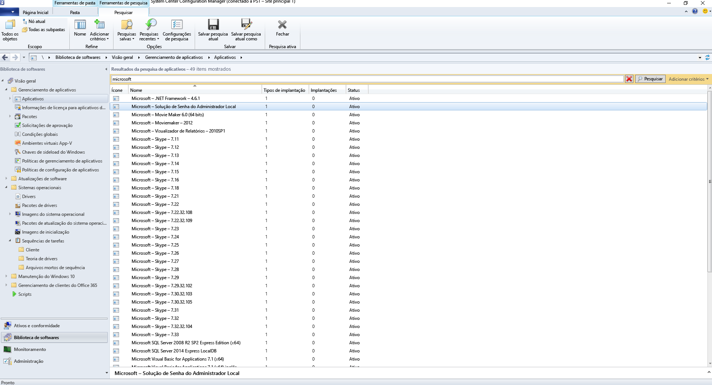
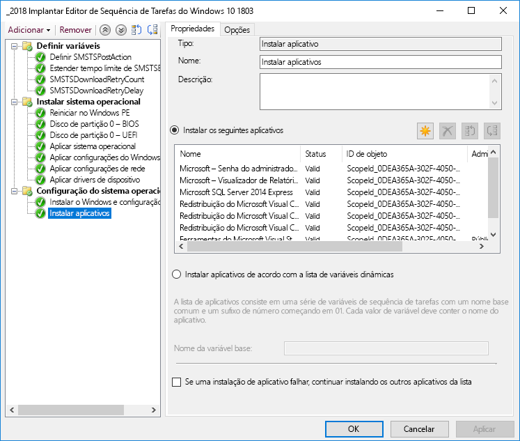
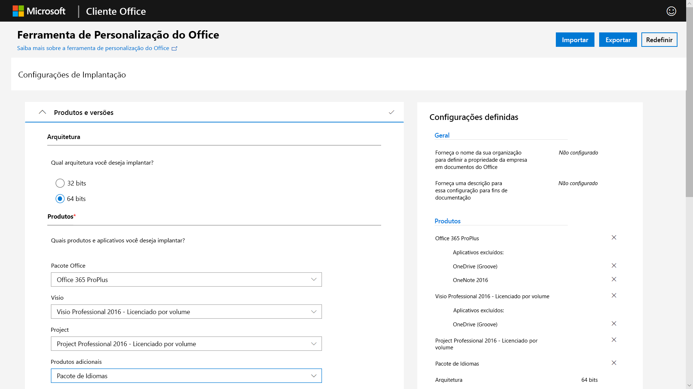
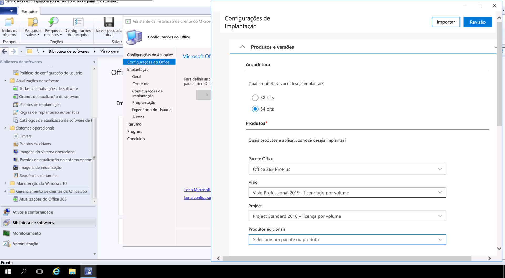

# Etapa 3: Entrega de aplicativos do Office e LOB

<table>
<thead>
<td></td>
<td>
<strong>Etapa 3: Entrega de aplicativos do Office e LOB</strong>

Certifique-se de que os aplicativos estejam empacotados e prontos para instalação automatizada. Saiba como o empacotamento Clique para Executar com os Aplicativos do Microsoft 365 para empresas oferece novas opções para configurar, entregar e manter seus aplicativos do Office atualizados.
</td>
<td></td>
</thead>
</table>

>[!NOTE]
>A Entrega de Aplicativos do Office e LOB é a terceira etapa do processo de implantação recomendado, que aborda as opções de instalação e gerenciamento do Office e LOB. Para realizar uma implantação bem-sucedida, não ignore as primeiras duas etapas.  Para ver o processo completo de implantação do desktop, visite o [Centro de Implantação do Computador](https://aka.ms/HowToShift).
>

Agora você está pronto para implantar o Office e seus Aplicativos LOB (Linha de Negócios). Há algumas maneiras de fazer isso, inclusive algumas opções novas e incríveis. Enquanto alguns aplicativos só estão disponíveis como uma versão de 32 ou 64 bits compilada, outros aplicativos, como os Aplicativos do Microsoft 365 para empresas, oferecem o código compilado nativo, e uma das principais decisões que você tomará será sobre a versão que deseja implantar. Para aproveitar a potência computacional adicional e a RAM em novos dispositivos, a Microsoft recomenda usar a versão de 64 bits quando não há nenhuma dependência de 32 bits. Para determinar possíveis dificuldades de compatibilidade do suplemento ou relacionadas a arquivos, é recomendável rever a Etapa 1, Preparação de dispositivos e aplicativos, antes de continuar.

Se nada estiver impedindo você, recomendamos a implantação de versões de 64 bits de todos os aplicativos, incluindo o Microsoft Office. Os aplicativos nativos compilados de 64 bits oferecem o melhor desempenho e são a opção mais adequada para o futuro.

Há muitos métodos e modelos para instalar aplicativos no Windows, portanto, vamos analisar suas opções de entrega.

[Gerenciamento de aplicativos do Windows 10](https://docs.microsoft.com/windows/application-management/)

## Implantações baseadas em MSI

Para seus aplicativos LOB, você provavelmente usará executáveis ou pacotes baseados em MSI e instalará aplicativos como parte de uma sequência de tarefas da implantação do sistema operacional. O Windows 10 continua a funcionar com esses pacotes.

Ferramentas de implantação de software como o Microsoft Endpoint Configuration Manager e o Microsoft Intune, são otimizadas também para oferecer aplicativos empacotados por MSI. Depois de validar seus aplicativos no Windows 10, você poderá usar o Microsoft Endpoint Configuration Manager (ramificação atual) para o fornecimento de aplicativos. Se usar o Portal da Empresa no Microsoft Intune, você poderá ampliar a escolha de aplicativos sancionados pela TI disponíveis para a sua organização, com a finalidade de incluir os aplicativos mais recentes e para que os usuários possam escolher eles mesmos o que precisam.

## Geração de imagens de computador

Outro método popular de entrega de aplicativos é a geração de imagens do computador. Nesse caso, os aplicativos estão instalados por meio da sequência de tarefas ou manualmente em uma amostra de computador e, em seguida, uma imagem do sistema é capturada com os aplicativos necessários pré-instalados. A abordagem de geração de imagens para criar e capturar economiza tempo ao provisionar computadores novos, mas lembre-se de que os sistemas operacionais e os aplicativos dentro da imagem podem ficar obsoletos rapidamente. O modelo de atualização cumulativa do Windows 10 e dos Aplicativos do Microsoft 365 para empresas ajuda nesse problema, mas não o elimina completamente. Isso ocorre porque é recomendável uma abordagem de imagem fina, em que os aplicativos são instalados de fora da imagem no momento da implantação.

Se você quiser incluir os Aplicativos do Microsoft 365 para empresas na sua imagem, lembre-se de que ele usa uma ativação baseada no usuário e não pode ser pré-ativado pelo administrador do sistema. Use a Ferramenta de Implantação do Office para instalar previamente o Office no dispositivo que você está gerando imagens e ignore a entrada do usuário. Depois que a imagem for implantada, os usuários finais poderão entrar usando as credenciais e ativar os Aplicativos do Microsoft 365 para empresas.

[Criar uma sequência de tarefas para instalar um sistema operacional](https://docs.microsoft.com/configmgr/osd/deploy-use/create-a-task-sequence-to-install-an-operating-system)

[Implantar os Aplicativos do Microsoft 365 para empresas como parte de uma imagem do sistema operacional](https://docs.microsoft.com/deployoffice/deploy-office-365-proplus-as-part-of-an-operating-system-image)

## Clique para Executar no Office 

O Aplicativos do Microsoft 365 para empresas é instalado usando Clique para Executar; ela substitui o empacotamento baseado em MSI em todas as versões de lançamento do futuro Office 2019 para Windows. Esse recurso apresenta diversas vantagens, incluindo instalações mais rápidas, atualizações mais eficientes e ágeis e desinstalações mais limpas. 

Os programas instalados por meio da tecnologia Clique para Executar são executados em um ambiente virtual do aplicativo em seu computador e, então, coexistem com outros aplicativos sem conflito; eles também ocupam metade do espaço em disco que ocupariam como um pacote baseado em MSI. Os aplicativos do Office são entregues e gerenciados por meio da [Ferramenta de implantação do Office](https://www.microsoft.com/download/details.aspx?id=49117) que é o mecanismo de instalação necessário para baixar, configurar e personalizar os aplicativos do Office. A ferramenta de implantação do Office lê um arquivo XML de configuração que fornece instruções de metadados sobre como configurar e personalizar a instalação do Office.

A Microsoft recomenda utilizar a [Ferramenta de Personalização do Office](https://config.office.com/) para personalizar as configurações de implantação e criar o arquivo XML de configuração. Por meio da Ferramenta de Personalização do Office é possível definir quais aplicativos e idiomas serão instalados, como os aplicativos serão atualizados, as preferências dos aplicativos e as configurações da experiência de instalação.

Se você usa o Gerenciador de Configurações, ainda será possível usá-lo para ampla implantação do Aplicativos do Microsoft 365 para empresas. O Gerenciador de Configurações (branch atual) possui suporte nativo para a Ferramenta de Personalização do Office atualizada, personalização de pacote para Clique para Executar no momento da instalação e suporte nativo para pós-instalação de gerenciamento de atualização de software.

[Guia de implantação do Aplicativos do Microsoft 365 para empresas](https://docs.microsoft.com/deployoffice/deployment-guide-for-office-365-proplus)

[Remover as versões MSI existentes do Office durante a atualização para o Aplicativos do Microsoft 365 para empresas](https://docs.microsoft.com/deployoffice/upgrade-from-msi-version)

[Gerenciar o Aplicativos do Microsoft 365 para empresas com o Gerenciador de Configurações](https://docs.microsoft.com/configmgr/sum/deploy-use/manage-office-365-proplus-updates)

[Atribuir aplicativos do Office 365 a dispositivos do Windows 10 com o Microsoft Intune](https://docs.microsoft.com/intune/apps-add-office365)

## Aplicativos baseados em navegador

Há algumas coisas a serem consideradas para garantir que os aplicativos baseados em navegador continuem funcionando conforme o esperado. Se tiver sites e aplicativos específicos que você sabe que têm problemas de compatibilidade com o Microsoft Edge, poderá usar a lista de sites do Modo Empresarial para que os sites sejam abertos automaticamente no Internet Explorer 11.

Além disso, se você souber que os sites da sua intranet não funcionarão adequadamente no Microsoft Edge, poderá definir todos os sites da intranet para serem abertos usando o Internet Explorer 11 automaticamente. Esse processo usa um arquivo XML para determinar se o IE11 é usado para cada site, usando a Política de Grupo para impor configurações.

[O que é o Modo Empresarial](https://docs.microsoft.com/internet-explorer/ie11-deploy-guide/what-is-enterprise-mode#what-is-enterprise-mode)

Por enquanto, abordamos métodos de implantação conhecidos. Mas há duas novas abordagens para a implantação de aplicativos que convém considerar.

## Microsoft Store para Empresas 

A Microsoft Store para Empresas fornece uma maneira flexível para descobrir, adquirir, gerenciar e distribuir aplicativos pagos e gratuitos para dispositivos Windows 10 em escala. Como administrador de TI, você pode publicar aplicativos selecionados na Microsoft Store, juntamente com seus próprios aplicativos personalizados, para sua própria loja particular ao mesmo tempo em que atribui e reutiliza as licenças necessárias. Os usuários são direcionados apenas a essa loja, de modo que possam encontrar e instalar apenas os aplicativos aprovados.

Os aplicativos da Store podem ser criados nativamente como aplicativos UWP, ou você pode usar a Ponte de Desktop para reempacotar seus aplicativos existentes para a Loja e adicionar experiências modernas para o Windows 10. Além do código usado para iluminar experiências do Windows 10, seu aplicativo permanece inalterado e continua a executar no modo de usuário de confiança total.

## Transporte em contêineres de MSIX

Uma nova opção de pacote de aplicativos é o MSIX. O MSIX usa a tecnologia de transporte em contêineres disponível no Windows, reunindo os melhores aspectos da tecnologia Clique para Executar e do pacote UWP e MSI. Com ferramentas para migrar instaladores existentes, como EXE, MSI, APPV e APPX diretamente para MSIX, vemos que o Transporte em contêineres MSIX fornece um caminho unificado das muitas tecnologias de instalação em uso atualmente. O suporte ao MSIX está incluído nas versões atuais do Windows: qualquer dispositivo com o Windows 10 RS5 ou mais recente inclui tudo de que você precisa para instalar e executar aplicativos do pacote MSIX. O Windows 10 integra de forma dinâmica os contêineres MSIX que recebe, ao mesmo tempo em que mantém os aplicativos separados do sistema operacional.

Transporte em contêineres significa desinstalação e remoção limpa de pacotes ao contrário de uma grande quantidade de pacotes baseados em MSI e EXE atualmente que pode deixar itens no sistema. Isso também significa apenas a necessidade de credenciais de Usuário Padrão para instalar aplicativos – você não precisa ter as credenciais de administrador para instalar contêineres MSIX. Contêineres MSIX são mais eficientes para atualizar também. Quando uma atualização for publicada, o uso de diferenciais de nível de bloqueio significa que apenas binários novos de rede são aplicados, reduzindo a carga de atualização, para implantações mais rápidas que consomem menos largura de banda.

Você pode encontrar mais informações sobre o MSIX através do [site da Comunidade Técnica do MSIX](https://techcommunity.microsoft.com/t5/MSIX/ct-p/MSIX)

## Próxima etapa

## [Etapa 4: Arquivos e configurações de usuários](https://aka.ms/mdd4)

## Etapa anterior

## [Etapa 2: Diretório e preparação de rede](https://aka.ms/mdd2) 
