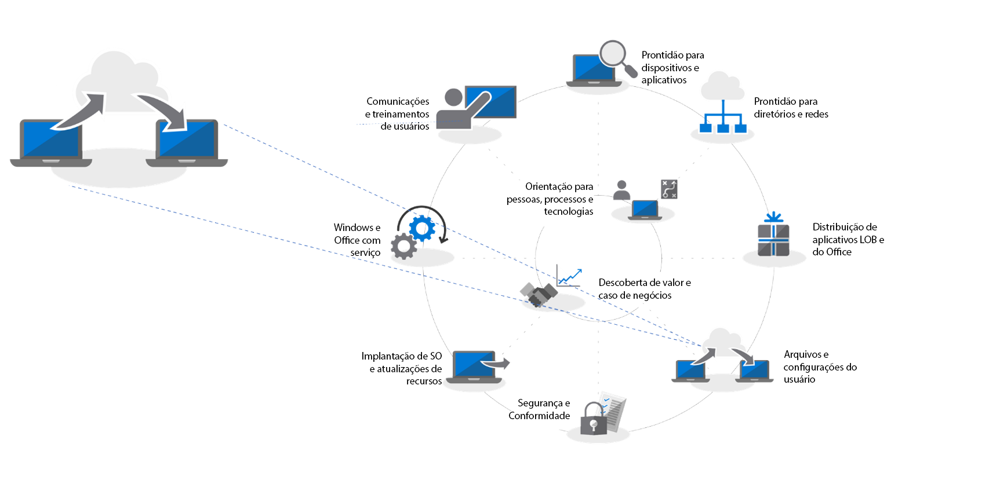

# Etapa 4: Migração de arquivos e configurações de usuários.

Mover os arquivos e configurações dos usuários para os PCs novos ou atualizados é um processo crucial, falhar não é uma opção. Você pode migrar cada PC manualmente ou escolher uma das várias maneiras de automatizar o processo. Seja qual for o método de migração escolhido, há três considerações principais a serem abordadas: a transferência dos arquivos dos usuários, suas configurações e o gerenciamento do Início do Windows 10 e layouts da barra de tarefas.

<table>
<thead>
<td></td>
<td>
<strong>Etapa 4: Arquivos e configurações de usuários</strong>

Ao atualizar ou substituir PCs, economize tempo automatizando o backup e restauração dos estados dos usuários. As novas opções de sincronização de arquivos em nuvem permitem que você imponha a sincronização per usuário das pastas Área de Trabalho, Documentos e Imagens no OneDrive para um acesso fácil aos arquivos das novas instalações do Windows.
</td>
<td></td>
</thead>
</table>

>[!NOTE]
>Embora você possa continuar usando os processo de migração que utilizou no passado, com sua mudança para o Office 365 ProPlus, recomendamos que você use o “Movimento de Pastas Conhecidas” do OneDrive (confira abaixo). Para ver o processo completo de implantação de desktop, visite o [Centro de Implantação do Computador](https://aka.ms/HowToShift).
>

Uma das tarefas geralmente mais manuais e complicadas de uma implantação em grande escala é a transferência dos arquivos e configurações de seus usuários. Neste artigo, abrangeremos as opções disponíveis para que você migre os usuários para PCs novos, atualizados e com nova imagem.

## Migração manual

Quando se trata de decidir o que manter quando mudamos para um novo PC ou uma nova versão do Windows, alguns usuários podem querer manter tudo enquanto outros podem preferir aproveitar a oportunidade para limpar suas unidades. Por isso, alguns departamentos de TI preferem lidar manualmente com a migração de arquivos de usuários, algumas vezes fazendo com que equipes de suporte visitem os usuários e outras estabelecendo centrais de suporte para as quais os usuários trazem seus PCs à equipe de suporte. De qualquer maneira, os usuários podem ser envolvidos na decisão sobre o que transferir e o que descartar.

O fato de isso ser uma opção em sua organização vai depender da escala da migração que você está planejando. É claro que essa opção será limitada pelo tempo e física envolvidos no trabalho direto com os usuários, entendendo suas necessidades e copiando arquivos para seus novos PCs atualizados.

Se optar por uma migração manual, você poderá precisar avaliar se conseguirá completar a tarefa até janeiro de 2020, quando termina o suporte ao Windows 7. Se tiver dúvidas, pense em usar uma das opções automatizadas abaixo ou solicite mais pessoas para ajudar.

## Migração automatizada usando USMT 

Para implantações em grande escala, você pode automatizar grande parte do processo usando ferramentas de automação de implantação baseadas em sequências de tarefas, como o Gerenciador de Configurações da Central do Sistema ou o Kit de Implantação da Microsoft (MDT). Estas duas soluções usam a Ferramenta de Migração de Estados de Usuários (USMT) como parte de seu processo de implantação de ponta a ponta. A USMT é parte do [Kit de Avaliação e Implantação do Windows (Windows ADK)](https://docs.microsoft.com/windows-hardware/get-started/adk-install)

A USMT captura contas e arquivos de usuários, configurações do sistema operacional e configurações de aplicativos, e depois os migra para uma nova instalação do Windows. Ela também confere ao Administrador de TI o controle exato do que será migrado e, opcionalmente, pode excluir tipos de arquivos indesejados - por exemplo, arquivos de áudio e vídeo ou executáveis.

Durante o processo de migração, você precisará ter uma capacidade suficiente de armazenamento no servidor disponível para funcionar como depósito temporário de migração. Neste ponto, a USMT oferece dois recursos importantes. Primeiro, ela pode estimar, para cada PC, a quantidade de armazenamento de que você vai precisar. Segundo, ela permite que os depósitos de migração sejam criptografados, reduzindo o risco de que os dados sejam comprometidos ao serem armazenados nos servidores de arquivos.

Onde você estiver executando uma atualização do PC e não reformatando a partição principal do Windows, também terá a opção de usar um depósito de migração de link físico com USMT. Este processo preserva o estado do usuário no PC enquanto os antigos sistema operacional e aplicativos são removidos e atualizados. Com o processo de restauração vindo da mesma partição local, esta opção oferece melhorias significativas de desempenho e reduz o tráfego de rede.

[Visão geral da Ferramenta de Migração de Estados de Usuários (USMT)](https://docs.microsoft.com/windows/deployment/usmt/usmt-overview)

## Movimentação de pastas conhecidas no OneDrive

Se seus usuários estão no OneDrive e você está adicionando o OneDrive como parte desta implantação, há uma nova opção disponível para você. Usando a nuvem para sincronizar arquivos de usuários, o recurso “Movimentação de Pastas Conhecidas” do OneDrive proporciona um nível de flexibilidade que não é possível com as opções de migração de arquivos baseadas na rede local. Se habilitada antes da migração, ela fornece acesso seguro nos PCs novos e atualizados e elimina a necessidade de criar depósitos temporários de migração em seus próprios servidores. Também tem o potencial de ser completamente transparente para o usuário.

[Redirecionar e mover as pastas conhecidas do Windows para o OneDrive](https://docs.microsoft.com/onedrive/redirect-known-folders)

Se você já está usando o OneDrive, sabe que os usuários podem escolher as pastas e locais que desejam sincronizar no OneDrive ou SharePoint com seu dispositivo, mas na verdade isso impõe a carga da configuração ao usuário. Com a Movimentação de Pastas Conhecidas, você pode direcionar as pastas Documentos, Área de Trabalho e Imagens dentro de um perfil de usuário e protegê-las todas no OneDrive. Um usuário consegue fazer isso por si próprio ou, o que é importante nesse cenário, você pode [executar isso usando as configurações de Política de Grupo](https://docs.microsoft.com/onedrive/use-group-policy?redirectSourcePath=%252fen-us%252farticle%252fUse-Group-Policy-to-control-OneDrive-sync-client-settings-0ecb2cf5-8882-42b3-a6e9-be6bda30899c).

Com a Movimentação de Pastas Conhecidas, os usuários não alteram seu fluxo de trabalho - tudo parece igual antes, durante e depois da conclusão da sincronização com o OneDrive. Através da Política de Grupo, você até pode escolher se quer ou não notificar os usuários de que seus documentos, imagens e área de trabalho estão protegidos no OneDrive. Se preferir não fazê-lo, tudo acontecerá silenciosamente no plano de fundo. Os usuários só saberão quando receberem novos PCs ou quando seus PCs forem atualizados. Assim que entrarem em suas novas contas do OneDrive, estes arquivos estarão disponíveis novamente e serão restaurados em seus novos PCs. E é claro que o OneDrive garante que eles também terão seus arquivos seguramente a qualquer momento em seus telefones e em outros dispositivos.

A autenticação para o OneDrive é fornecida pelo Azure Active Directory, de modo que, para uma segurança adicional, você pode facilmente habilitar a autenticação multifatorial e definir políticas para controlar a largura de banda de carregamento e download que o OneDrive usa para limitar a atividade de rede.

Você não precisa migrar todos os usuários ao mesmo tempo. É possível que você dividir a implantação das configurações de Política de Grupo em fazes ou [limitar a sincronização de arquivos a PCs do domínio](https://docs.microsoft.com/powershell/module/sharepoint-online/Set-SPOTenantSyncClientRestriction?view=sharepoint-ps).

## Menu Iniciar e personalização da barra de tarefas

O OneDrive foi projetado para sincronizar e proteger arquivos e pastas. ele não sincroniza aplicativos ou configurações do Windows. Para fazer isso no passado, você deve ter usado o método de perfil de cópia para configurar layouts padrão para os menus Iniciar e configurações da barra de tarefas dos usuários. No Windows 10 Pro, Enterprise e Education, você pode usar a Política de Grupo, MDM, PowerShell ou fornecer pacotes para implantar o [menu Iniciar e layouts da barra de tarefas personalizados](https://docs.microsoft.com/windows/configuration/windows-10-start-layout-options-and-policies). Não é necessário refazer imagens e o layout pode ser atualizado simplesmente sobrescrevendo o arquivo .xml que o contém.

Para criar um novo layout, simplesmente configure um sistema de amostras e use o cmdlet [Export-StartLayout](https://docs.microsoft.com/powershell/module/startlayout/export-startlayout?view=win10-ps) do PowerShell para gerar um arquivo XML, e depois coloque este arquivo em um compartilhamento de rede ou o distribua localmente como parte de sua sequência de implantação; ele só precisa estar acessível como arquivo de Somente leitura quando o usuário entrar. Então, você pode usar a política ou o cmdlet [Import-StartLayout](https://docs.microsoft.com/powershell/module/startlayout/import-startlayout?view=win10-ps) para referenciar este arquivo.

## Remoção de aplicativos indesejados de caixa de entrada

O Windows 10 inclui muitos aplicativos internos úteis como parte da instalação padrão, mas você pode preferir remover alguns deles de seus PCs gerenciados e até configurar sua instalação de modo a impedir que esses aplicativos retornem, por exemplo, XBOX ou Zune Music. Você pode recuperar uma lista desses aplicativos suando os comando do [PowerShell Get-AppxPackage](https://technet.microsoft.com/library/hh856044.aspx) e remover os que você não deseja usando o comando [Remove-AppxPackage](https://technet.microsoft.com/library/hh856038.aspx). Como alternativa, você pode montar o arquivo Windows Image (.img) off line antes da implantação e extrair pacotes que não deseja usar usando a ferramenta de linha de comando [Gerenciamento e Manutenção de Imagens de Implantação (DISM)](https://docs.microsoft.com/windows-hardware/manufacture/desktop/what-is-dism) e o comando [Remove-AppxProvisionedPackage](https://docs.microsoft.com/powershell/module/dism/remove-appxprovisionedpackage?view=win10-ps).

## Próxima etapa

## [Etapa 5: Considerações de segurança e conformidade](https://aka.ms/mdd5)

## Etapa anterior

## [Etapa 3: Entrega de aplicativos do Office e LOB](https://aka.ms/mdd3)