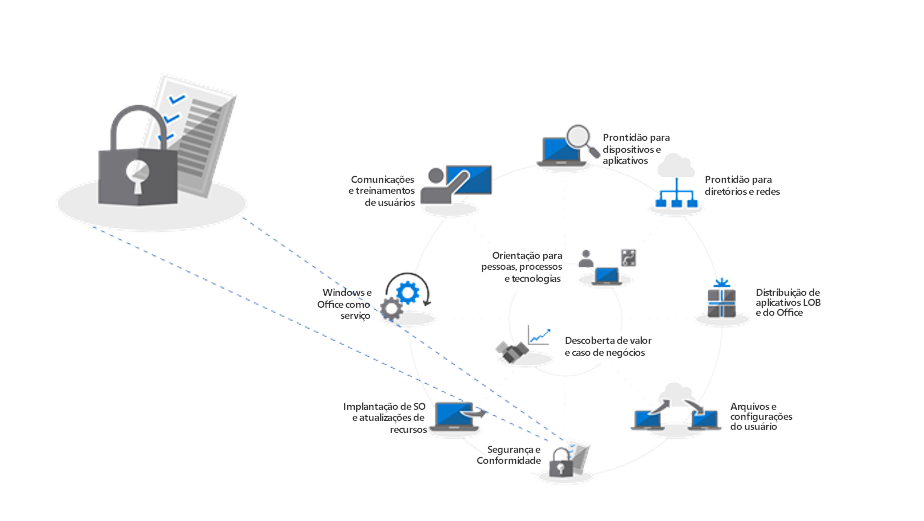
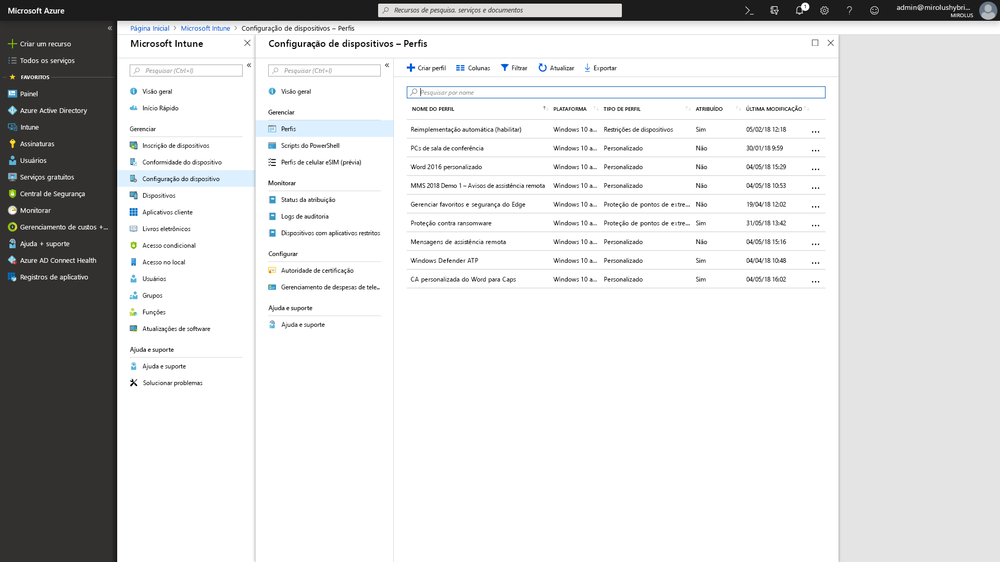

# Etapa 5: Considerações de segurança e conformidadeStep 5: Security and Compliance Considerations

<table>
<thead>
<td></td>
<td>
<strong>Etapa 5: Considerações de segurança e conformidade</strong><strong>Step 5: Security and Compliance Considerations</strong>

O Windows 10 e o Office 365 ProPlus oferecem novas formas de proteger dados, dispositivos e usuários e de detectar e responder rapidamente a ameaças. Além disso, aprenda a lidar com problemas comuns associados a criptografia de discos, aplicativos antimalware e políticas ao migrar para o Windows 10.Windows 10 and Office 365 ProPlus provide new ways to protect your data, devices and users and quickly detect and respond to threats. Also, learn how to deal with common problems associated with disk encryption, anti-malware apps and policies when moving to Windows 10.
</td>
<td></td>
</thead>
</table>

>[!NOTE]
>Segurança e Conformidade é a quinta etapa do nosso processo recomendado de implantação que abrange as considerações de segurança e conformidade do Windows 10 e do Office 365 ProPlus.Security and Compliance is the fifth step in our recommended deployment process wheel covering Windows 10 and Office 365 ProPlus security and compliance considerations. Para ver o processo completo de implantação de desktop, visite o [Centro de Implantação do Computador](https://aka.ms/HowToShift).To see the full desktop deployment process, visit the [Desktop Deployment Center](https://aka.ms/HowToShift).
>

Chegou o momento de examinar suas opções de direcionamento de novos recursos de segurança e conformidade como parte da implantação do Windows 10 e do Office 365 ProPlus, juntamente com as considerações e bloqueios comuns ao migrar de versões anteriores do Windows e do Office.Now it's time to review options for targeting new security and compliance capabilities as part of your Windows 10 and Office 365 ProPlus deployment, along with the considerations and common blockers when moving from previous versions of Windows and Office. Muitos dos recursos relacionados à segurança no Windows 10 são os responsáveis pela migração para a plataforma mais recente.Many of the security-related capabilities in Windows 10 alone are driving the shift to the newer platform. Além disso, a integração com os serviços em nuvem no Office 365 e as opções de identidade usando o Azure Active Directory dão acesso a proteções novas e continuamente atualizadas de dados, dispositivos e usuários.Also, integration with cloud services in Office 365 and identity options using Azure Active Directory brings access to new and continually updated protections for your data, devices and users.

## Superar bloqueios em potencial relacionados à segurançaOvercoming Potential Security-Related Deployment Blockers

Antes de explicar os novos recursos que podem ser adicionados na sua migração para o Windows 10 e o Office 365 ProPlus e conectar essas experiências à nuvem, vamos começar com algumas tendências que estamos vendo e que frequentemente podem interromper o andamento da implantação.Before explaining new capabilities that you can add as you move to Windows 10 and Office 365 ProPlus and connect those experiences to the cloud, let’s start with a few trends we’re seeing that can often interrupt deployment progress.

### Criptografia de discoDisk Encryption

Primeiro, um dos desafios iniciais que você pode enfrentar é a criptografia de disco rígido. Muitas soluções para a criptografia de disco rígido não podem ser atualizadas com facilidade de uma versão anterior do Windows para uma versão mais recente do Windows.First one of the initial challenges you might encounter is hard disk encryption. Many solutions for hard disk encryption cannot easily be upgraded from a previous version of Windows to a newer version of Windows.

Algumas soluções de criptografia de disco permitem que você execute as atualizações quando estiver usando a opção ‘/reflectdrivers’ na Instalação do Windows em determinadas versões das plataformas, mas outras poderão precisar que você descriptografe a unidade antes de criptografar novamente após a instalação do Windows 10. Algumas soluções também não permitem que você migre do Master Boot Record (MBR, registro mestre de inicialização), usando BIOS herdado, para GUID Partition Table (GPT, tabela de partição de GUID), obrigatório para UEFI. Isso é importante porque uma versão de 64 bits do Windows 10 com UEFI é necessária para os novos recursos de segurança baseados em virtualização no Windows 10, e eles são explicados abaixo.Some disk encryption solutions allow you to perform the upgrades when using the ‘/reflectdrivers’ option with Windows Setup on certain versions of their platforms, but others may require you to unencrypt the drive prior to deployment, then re-encrypt after Windows 10 is installed. Some solutions also do not allow you to move from Master Boot Record (MBR), using legacy BIOS, to GUID Partition Table (GPT), required for UEFI. This is important because a 64-bit version of Windows 10 with UEFI is required for the new virtualization-based security capabilities in Windows 10 and those are explained below.

Uma opção para resolver esses problemas é usar o BitLocker no Windows 10, que está incluído no Windows 10 Pro e em versões superiores. O BitLocker permite que você suspenda a proteção de atualizações do sistema operacional e de atualizações de recursos como parte do processo.One option to resolve these issues is using BitLocker in Windows 10, which is included in Windows 10 Pro and higher editions. BitLocker allows you to suspend protection for OS upgrades and Feature Updates as part of the process.

  [Implantação básica do Bitlocker](https://docs.microsoft.com/pt-BR/windows/security/information-protection/bitlocker/bitlocker-basic-deployment)[Bitlocker basic deployment](https://docs.microsoft.com/en-us/windows/security/information-protection/bitlocker/bitlocker-basic-deployment)

### Compatibilidade de aplicativos antivírus e antimalwareAntivirus and Antimalware Application Compatibility

Em segundo lugar, ainda que tenhamos visto que mais de [99% dos aplicativos do Windows são compatíveis](https://www.microsoft.com/en-us/microsoft-365/blog/2018/09/06/helping-customers-shift-to-a-modern-desktop/) entre o Windows 7 e o Windows 10, as exceções são frequentemente aplicativos antivírus (AV) ou clientes VPN (Virtual Private Network, rede privada virtual). Esses aplicativos frequentemente implementam práticas de desenvolvimento não padrão e APIs, usando com frequência formas não documentadas de proteger seu sistema ou conectá-lo aos recursos de rede.Second, while we’ve seen that more than [99% of Windows applications are compatible](https://www.microsoft.com/en-us/microsoft-365/blog/2018/09/06/helping-customers-shift-to-a-modern-desktop/) between Windows 7 and Windows 10, the exceptions are often anti-virus (AV) apps or Virtual Private Network (VPN) clients. These applications often implement non-standard development practices and APIs, using often undocumented ways to protect your system or connect you to network resources.

Como resultado, esses aplicativos, por natureza, podem ser frágeis a alterações ao migrar para uma nova versão do Windows. Caso seu software AV ou VPN não funcione no Windows 10 ou depois da atualização, a correção normalmente é substituir o aplicativo que está usando por um com suporte e testado no Windows 10.As a result, these apps by nature can be fragile to changes when shifting to a new version of Windows. If your AV or VPN software doesn’t work in Windows 10 or after upgrading, the fix is typically to replace the app you’re using with something supported and tested on Windows 10.

### Políticas de segurançaSecurity Policies

As configurações da Política de Grupo do Active Directory usadas para versões mais antigas do Windows e do Office poderão não serem convertidas diretamente para o Windows 10 e o Office 365 ProPlus, e há diferentes considerações com recursos de conformidade e segurança mais recentes. É uma boa ideia usar o Kit de Ferramentas de Conformidade e Segurança da Microsoft para obter uma linha de base das políticas de segurança para versões atuais do Windows e do Office. Além disso, vale a pena ler as políticas de Gerenciamento de Dispositivos Móveis como parte do Microsoft Intune.Your Active Directory Group Policy settings used for older versions of Windows and Office may not translate directly to Windows 10 and Office 365 ProPlus, and there are different considerations with newer security and compliance capabilities. It’s a good idea to use the Microsoft Security Compliance Toolkit to get a baseline of the security policies for current versions of Windows and Office. Additionally, it’s worth looking into Mobile Device Management policies as part of Microsoft Intune.

## 

## Novos recursos de segurança e conformidade no Microsoft 365New Security and Compliance Capabilities in Microsoft 365

Essas foram as considerações para migrar suas proteções atuais e itens a saber antes da migração. Agora observaremos os novos recursos que você pode aproveitar ao migrar para o Windows 10, Office 365 ProPlus e opções baseadas em nuvem do EMS e além.Now, those were considerations for moving your current protections forward and things to be aware of before your shift. Now let’s take a look at new capabilities that you can take advantage of when moving to Windows 10, Office 365 ProPlus and cloud-based options from EMS and beyond.

### Gerenciamento de identidades e acessoIdentity and Access Management

Começando com o gerenciamento de identidades e acesso. O Azure Active Directory é o plano de controle de identidade para aplicativos, dispositivos e serviços em nuvem e é a forma moderna de se conectar ao Office 365 e a outros serviços em nuvem. O acesso condicional permite que você defina diferentes requisitos de autenticação de acordo com o local do qual está acessando, qual dispositivo está usando, além de casos como comportamentos anômalos.Starting with identity and access management. Azure Active Directory is the identity control plane for apps, devices and Cloud services and is the modern way to connect to Office 365 and other Cloud services. Conditional access allows you to define different authentication requirements based on where you are logging in from, which device you're using, as well as things like anomalous behaviors.

No nível do dispositivo, a biometria pode fornecer identificadores únicos para oferecer um acesso mais seguro para seus dispositivos e aplicativos, conforme você segue na direção da meta de eliminar senhas. O Windows Hello oferece autenticação multifator baseada em dispositivo. Ela confia no próprio dispositivo, em seu PIN ou no identificador biométrico exclusivo, como seu rosto ou sua impressão digital, que você pode aplicar por política.At the device level, biometrics can provide unique identifiers for simpler and more secure access to your devices and apps - as you move toward the goal of eliminating passwords. Windows Hello offers device-based, multi-factor authentication. It relies on the device itself, your PIN, or unique biometric identifier such as your face or fingerprint, which you can enforce via policy.

  [Noções básicas do gerenciamento de identidade do Azure](https://docs.microsoft.com/pt-BR/azure/active-directory/fundamentals/identity-fundamentals)[Fundamentals of Azure identity management](https://docs.microsoft.com/en-us/azure/active-directory/fundamentals/identity-fundamentals)

  [Entender as soluções de identidade do Azure](https://docs.microsoft.com/pt-BR/azure/active-directory/fundamentals/understand-azure-identity-solutions)[Understand Azure identity solutions](https://docs.microsoft.com/en-us/azure/active-directory/fundamentals/understand-azure-identity-solutions)

  [Acesso condicional do Azure Active Directory](https://docs.microsoft.com/pt-BR/azure/active-directory/conditional-access/overview)[Azure Active Directory Conditional Access](https://docs.microsoft.com/en-us/azure/active-directory/conditional-access/overview)

  [Windows Hello para Empresas](https://docs.microsoft.com/pt-BR/windows/security/identity-protection/hello-for-business/hello-identity-verification)[Windows Hello for Business](https://docs.microsoft.com/en-us/windows/security/identity-protection/hello-for-business/hello-identity-verification)

### Segurança baseada em virtualizaçãoVirtualization-based security

Agora, além da identidade, você também pode habilitar a proteção contínua contra ameaças conhecidas ou não. Para fazer isso, o Windows 10 usa a segurança baseada em virtualização no núcleo para assegurar a integridade da inicialização e do código usando a Inicialização Segura. Também podemos ajudar a evitar o roubo de credenciais com a Proteção de Credenciais, ao manter os segredos do usuário isolados do Windows. E a Proteção de Aplicativos pode isolar e reduzir as ameaças baseadas em navegador ao executá-lo em um contêiner isolado. Todas essas tecnologias usam segurança baseada em virtualização no Windows 10 e são alterações fundamentais que não podem ser replicadas em um sistema Windows 7. Isso também precisa do UEFI, do Windows de 64 bits e de suporte a extensão de virtualização com SLAT no nível do hardware.Now beyond identity, you can also enable continuous protection against both known and unknown threats and to do this Windows 10 uses virtualization-based security at the core to ensure boot integrity and code integrity using Secure Boot. We can help also stop credential theft with Credential Guard by maintaining user secrets in isolation from Windows. And, Application Guard can isolate and mitigate browser-based threats by running the browser in an isolated container. All of these technologies use virtualization-based security in Windows 10 and are foundational changes that cannot be replicated on a Windows 7 system – note that these also require UEFI, 64-bit Windows and virtualization extension support with SLAT – at the hardware level.

  [Saiba mais sobre a segurança baseada em virtualização](https://docs.microsoft.com/pt-BR/windows-hardware/design/device-experiences/oem-vbs)[More on Virtualization-based Security](https://docs.microsoft.com/en-us/windows-hardware/design/device-experiences/oem-vbs)

### Aprimoramentos de segurança de serviços em nuvemSecurity enhancements from cloud services

Os serviços em nuvem oferecem outra camada de proteção opcional para melhorar a segurança do Windows e do Office. Isso pode oferecer um novo nível de controle frequente em tempo real que pode detectar, resistir e responder instantaneamente a novos ataques e tipos de ataques, especialmente comparados à atualização tradicional de software e arquivos de assinatura de AV, nos quais os tempos de implantação de atualização e de resposta são inerentemente mais lentos.Cloud services provide another layer of optional protection to improve Windows and Office security. These can give you a new level of often real-time control that can instantly detect, resist and respond to new attacks and attack types – especially compared to traditional software updating and AV signature files – where response and update deployment times are inherently slower.

Com o Gráfico de Segurança Inteligente da Microsoft, você tem acesso mais rápido a informações e proteções de novas ameaças. Você pode aproveitar algumas dessas vantagens, começando pelo Office.Along with the Microsoft Intelligent Security Graph, you have faster access to both information and protections from emerging threats. Here are a few examples of what you can take advantage of, starting with Office.

  **
  [Prevenção contra perda de dados](https://docs.microsoft.com/pt-BR/office365/securitycompliance/data-loss-prevention-policies)\*\* integrada ao Office 365 ProPlus ajuda a informar os usuários de políticas de segurança quando conteúdo de alto risco, como números de cartão de crédito ou de identificação, são detectados. As políticas podem informar ou bloquear o envio e o compartilhamento depois de notificar os usuários.**[Data Loss Prevention](https://docs.microsoft.com/en-us/office365/securitycompliance/data-loss-prevention-policies)** built into Office 365 ProPlus, helps inform users of security policies when high risk content like credit card or identification numbers are detected. Policies can inform or block sending and sharing after notifying users.

A **[Proteção de Informações do Azure](https://docs.microsoft.com/pt-BR/azure/information-protection/rms-client/client-admin-guide)** é um serviço complementar que pode ser usado com o Office, permitindo aos usuários classificar e rotular com facilidade os arquivos do Office. Ela pode acionar uma ação automática em arquivos rotulados, como criptografia ou bloquear o compartilhamento.**[Azure Information Protection](https://docs.microsoft.com/en-us/azure/information-protection/rms-client/client-admin-guide)** is a complementary service that can be used with Office, allowing users to easily classify and label their Office files. It can trigger automatic action on labeled files, such as encryption or locking down sharing.

Também apresentamos a proteção **[Links Seguros](https://docs.microsoft.com/pt-BR/office365/securitycompliance/atp-safe-links)** em aplicativos do Office para protegê-lo contra uma lista dinâmica de sites mal-intencionados conhecidos.We've also introduced **[Safe Links](https://docs.microsoft.com/en-us/office365/securitycompliance/atp-safe-links)** protection across Office apps to protect you against a dynamic list of known malicious websites.

Além disso, os **[Anexos Seguros](https://docs.microsoft.com/pt-BR/office365/securitycompliance/atp-safe-attachments)** no Outlook, e como parte do Exchange Online, vão além da filtragem de emails para inspecionar anexos. Se um anexo de alto risco for identificado, os Anexos Seguros informarão ao usuário sobre anexos mal-intencionados conhecidos e os removerá do email.Additionally, **[Safe Attachments](https://docs.microsoft.com/en-us/office365/securitycompliance/atp-safe-attachments)** in Outlook and as part of Exchange Online goes beyond email filtering to inspect attachments. If a high-risk attachment is identified, Safe Attachments will inform the user of known malicious attachments and remove them from email.

A **[Criptografia de Mensagens do Office 365](https://docs.microsoft.com/pt-BR/office365/securitycompliance/encryption)** (OME) também pode se usada para proteger o email e os anexos enviados, assegurando que apenas os destinatários desejados possam ver o conteúdo do email. O OME funciona de forma simples com autenticação de conta de cliente Google, Yahoo e Microsoft, e senhas para uso único permitem aos usuários de outros serviços de email receberem emails também.**[Office 365 Message Encryption](https://docs.microsoft.com/en-us/office365/securitycompliance/encryption)** (OME) can also be used to safeguard email and attachments sent, ensuring only intended recipients can view email content. OME works seamlessly with Google, Yahoo, and Microsoft consumer account authentication, and one-time passcodes allow users of other email services to securely receive email as well.

#### Outras proteções do Windows 10Additional Windows 10 protections

O **[Controle de Aplicativos do Windows Defender](https://docs.microsoft.com/pt-BR/windows/security/threat-protection/windows-defender-application-control/windows-defender-application-control)** no Windows 10 opera de acordo com uma lista de permissões e negações que a Microsoft verificou para fins de segurança e tudo que é gerenciado pelas políticas de proteção de endpoint usando o Microsoft Intune.**[Windows Defender Application Control](https://docs.microsoft.com/en-us/windows/security/threat-protection/windows-defender-application-control/windows-defender-application-control)** in Windows 10 operates off an approved allow and deny list of applications that Microsoft has checked for safety and all that is managed by endpoint protection policies using Microsoft Intune.

A **[Proteção Avançada Contra Ameaças do Windows Defender](https://docs.microsoft.com/pt-BR/windows/security/threat-protection/windows-defender-atp/overview)** é uma plataforma unificada para proteção preventiva, detecção pós-violação, investigação automatizada e resposta. Ela protege os pontos de extremidade de ameaças cibernéticas, detecta ataques avançados e violações de dados, automatiza os incidentes de segurança e melhora a postura de segurança.**[Windows Defender Advanced Threat Protection](https://docs.microsoft.com/en-us/windows/security/threat-protection/windows-defender-atp/overview)** is a unified platform for preventative protection, post-breach detection, automated investigation, and response. It protects endpoints from cyber threats; detects advanced attacks and data breaches, automates security incidents and improves security posture.

A **[Proteção contra Exploração](https://docs.microsoft.com/pt-BR/windows/security/threat-protection/windows-defender-exploit-guard/windows-defender-exploit-guard)** ajuda a reduzir a superfície de ataques de aplicativos em execução evitando que o malware entre no Windows e impedindo que processos não confiáveis acessem as pastas protegidas.**[Exploit Guard](https://docs.microsoft.com/en-us/windows/security/threat-protection/windows-defender-exploit-guard/windows-defender-exploit-guard)** helps reduce the attack surface for running applications by preventing malware from getting into Windows and blocking untrusted processes from accessing protected folders.

#### Microsoft IntuneMicrosoft Intune

O [Microsoft Intune](https://docs.microsoft.com/pt-BR/intune/introduction-intune) serve como um serviço de gerenciamento em nuvem para cenários móveis, inclusive dispositivos IOS, Android e Windows, e agora pode ser configurado para o gerenciamento conjunto de forma a complementar e ampliar os controles de cargas de trabalho específicas gerenciadas pelo System Center Configuration Manager. Uma vantagem aqui é que os dispositivos que acessam os recursos protegidos podem ser solicitados a inscrever-se no gerenciamento de dispositivos, mesmo nos dispositivos não gerenciados e que não entraram no domínio ou no Azure AD. Você também pode aproveitar a configuração granular e a aplicação de política de conformidade no nível do aplicativo e do sistema operacional. As políticas e as configurações de aplicativos podem ser configuradas de forma central e aplicadas no Office 365 ProPlus e em aplicativos da Store no Windows 10 usando o Microsoft Intune.[Microsoft Intune](https://docs.microsoft.com/en-us/intune/introduction-intune) serves as a Cloud based management service for mobile scenarios, including IOS, Android and Windows devices, and can now be configured for co-management to complement and extend controls for specific workloads managed by System Center Configuration Manager. One advantage here is that, devices accessing protected resources can be required to enroll into device management – even non-managed, non-domain joined or non-Azure AD joined devices. You can also take advantage of granular configuration and compliance policy enforcement at the operating system and application level. Application policies and settings can be configured centrally and enforced for Office 365 ProPlus and Store apps in Windows 10 using Microsoft Intune.

## Próxima etapaNext Step

## [Etapa 6: Implantação de sistema operacional e atualizações de recursosStep 6: OS Deployment and Feature Updates](https://aka.ms/mdd6)

## Etapa anteriorPrevious Step 

## [Etapa 4: Arquivos e configurações de usuáriosStep 4: User Files and Settings](https://aka.ms/mdd4)
