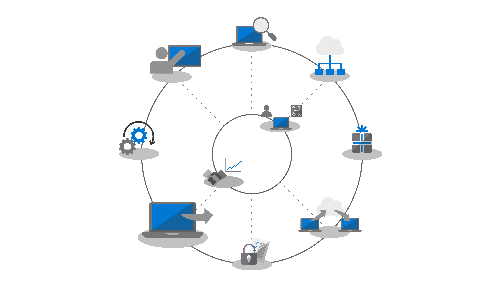
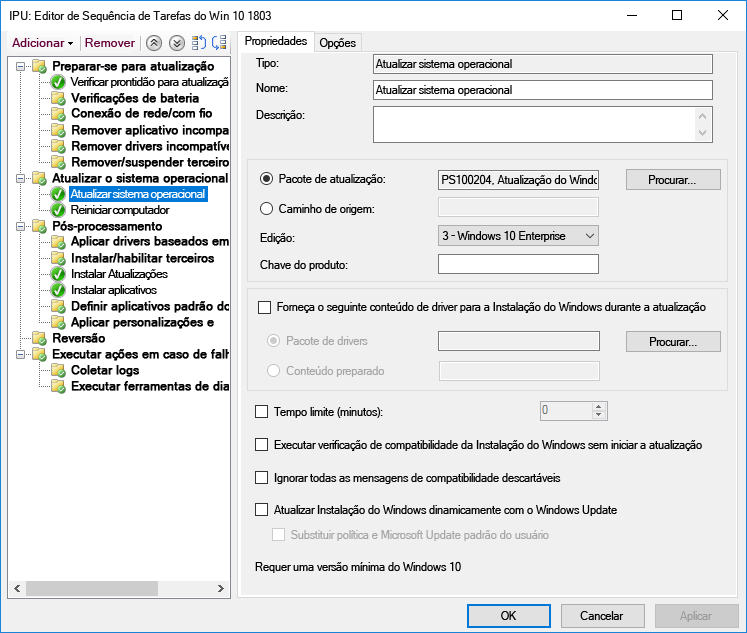
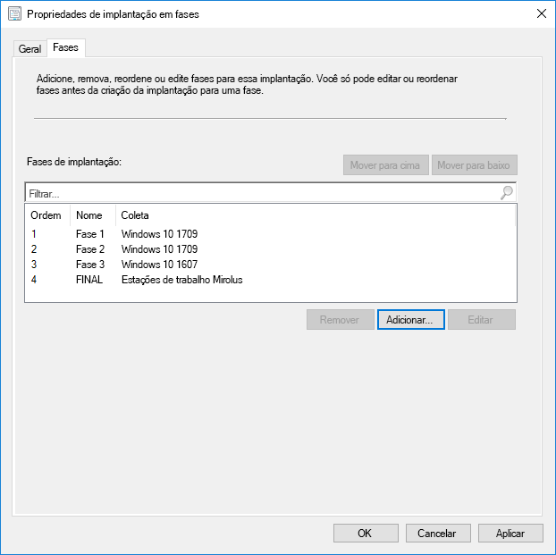
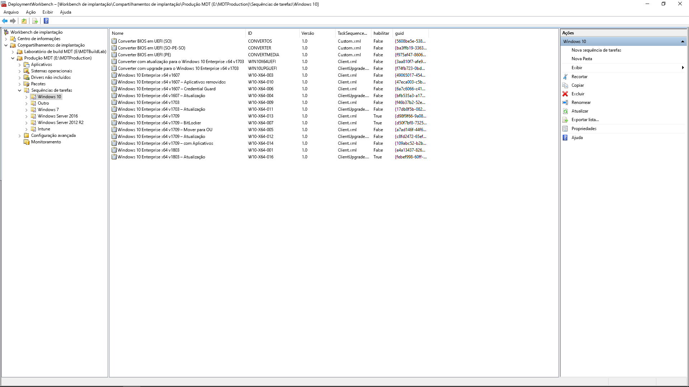

# Etapa 6: Implantação de sistema operacional e atualizações de recursos

<table>
<thead>
<td></td>
<td>
<strong>Etapa 6: Implantação de sistema operacional e atualizações de recursos</strong>

A implantação com base em sequência de tarefas é usada para automatizar implantação em fases de grande escala para instalações em hardware vazio, atualização e substituição de PCs. As sequências de tarefas de atualização também ajudarão você a se manter atualizado com atualizações semestrais principais. E o Windows Autopilot é um complemento recente que moderniza o processo de aquisição de novos PCs.
</td>
<td></td>
</thead>
</table>

>[!NOTE]
>As Atualizações de Implantação de Recursos do Sistema Operacional são a sexta etapa de nosso processo de implantação recomendado, abrangendo a implantação do sistema operacional Windows 10, atualizações e atualizações de recursos. Para ver o processo completo de implantação de desktop, visite o [Centro de Implantação do Computador](https://aka.ms/HowToShift).
>

Caso esteja assistindo ao processo de implantação até agora, você ao menos concluiu parcialmente as etapas de preparação do dispositivo e do aplicativo, preparou a infraestrutura, configurou e coletou pacotes de aplicativos, tem um plano estabelecido para migrar os arquivos de usuários e definiu configurações padrão, assim como tem planos para reter os controles de segurança existentes e talvez implantar novos.

Agora chegamos ao estágio no qual você está juntando todas essas peças para automatizar o máximo possível para instalar o Windows 10 e o Office 365 ProPlus, juntamente com os drivers, aplicativos e qualquer outro item necessário.

Por fim, a melhor medida de sucesso com uma implantação de sistema operacional é corresponder às expectativas do usuário e evitar interrupções do trabalho. E, nesta etapa, você começará a testar e a implantar para usuários piloto como parte de uma implantação em fases. E, uma dica aqui, antes de ampliar a implantação, você precisará seguir para a etapa 8 do processo de implantação [Treinamento e Comunicações de Usuários](https://aka.ms/mdd8) para assegurar que os usuários estejam informados e preparados para as alterações a serem efetuadas. Você pode medir o ritmo da implantação com validação contínua usando a Implantação em Fases.

## Processo de geração de imagens do Windows

A maioria das organizações usa o processo de geração de imagens de computador para configurar e capturar um clone do Windows, inclusive um conjunto básico de alguns aplicativos padrão instalados ou até mesmo uma imagem menor com apenas tempos de execução e atualizações de aplicativos. A melhor forma de fazer isso é usar uma máquina virtual para esse processo de forma a evitar problemas de compatibilidade inesperados relacionados ao driver e para fins de automação.

Caso opte pela captura de imagem, é melhor automatizar tanto quanto possível para garantir a melhor qualidade de imagem e um processo que possa ser repetido. Na maioria das implantações, também é recomendado usar a menor quantidade de personalização e de aplicativos pré-instalados possível na imagem do Windows antes de capturar. Isso é o que chamamos de abordagem de "imagem pequena" que pode economizar largura de banda geral na rede eliminando a quantidade de aplicativos na imagem. Começando com uma imagem pequena, você pode colocar aplicativos, idiomas e configurações necessários ajustados de forma dinâmica para os usuários.

Durante o processo de criação e captura, ferramentas como o Microsoft Endpoint Configuration Manager (Branch Atual) e o Kit de Ferramentas de Implantação da Microsoft usam a Ferramenta de Preparação do Sistema, ou Sysprep, juntamente com o comando "Generalize" para selar novamente a imagem antes de capturar a instalação do Windows 10 como uma imagem.

A imagem capturada terá o formato de imagem do Windows, ou WIM, como mídia de instalação padrão do Windows. Quando tiver seu arquivo WIM personalizado, será possível usar outra sequência de tarefas como parte da implantação do sistema operacional no Microsoft Endpoint Configuration Manager ou no Kit de Ferramentas de Implantação da Microsoft para realizar tarefas relacionadas à implantação, para aplicar tarefas de execução e imagem antes e depois da aplicação da imagem do Windows.

[Criar uma imagem de referência do Windows 10](https://docs.microsoft.com/windows/deployment/deploy-windows-mdt/create-a-windows-10-reference-image)

[Criar uma sequência de tarefas para instalar um Sistema Operacional](https://docs.microsoft.com/configmgr/osd/deploy-use/create-a-task-sequence-to-install-an-operating-system)

### Tipos de implantação

Com a imagem personalizada pronta, o tipo de instalação ou de migração será das seguintes categorias:

  - Primeiro, **implantação bare-metal**. Este é o cenário usado para implantar uma imagem a um disco limpo ou para colocar uma imagem novamente em um computador no qual você não pretende manter os dados no disco

  - E, segundo, semelhante à bare-metal, a **Atualização do computador,** com a diferença importante de que o estado do usuário continua no disco\* ou será restaurado após a conclusão da instalação

  - E, por último, a **Substituição do computador**. Aqui, como o nome sugere, você está substituindo um PC por outro. Neste caso, frequentemente existe um backup de arquivos de usuário do primeiro PC em um local central e uma restauração desses arquivos no segundo PC.

Todos os três cenários têm algo em comum, eles usam uma sequência de tarefas para executar, e uma imagem personalizada pode ser aplicada a cada vez.

[Mais sobre os cenários de implantação do Windows 10](https://docs.microsoft.com/windows/deployment/windows-10-deployment-scenarios)

### Atualização no local usando automação de sequência de tarefas

Além desses tipos de implantação, há uma nova opção disponível agora como uma Sequência de Tarefas do Microsoft Endpoint Configuration Manager (Branch Atual) com Windows 10, e atualização no local usando a Sequência de Tarefas Atualizar.

As atualizações no local de uma versão anterior do Windows não precisam de uma sequência de tarefas, mas é uma abordagem recomendada ao implantar em escala empresarial. Uma atualização no local não permite a aplicação de uma imagem personalizada com aplicativos, mas você pode atualizar o install.wim padrão usando a manutenção offline. Por exemplo, você pode garantir que ele tenha as atualizações mais recentes do Windows aplicadas antes de executar as atualizações.

A atualização no local usa a instalação do Windows. O mecanismo de instalação executa diversas verificações de pré-instalação buscando por problemas de compatibilidade conhecidos. Ela também preserva os aplicativos e o estado do usuário e remove apenas o que não é compatível com a versão do Windows 10 sendo instalada. Com essa opção, os aplicativos instalados previamente e o estado do usuário são preservados. A atualização no local também permite que você reverta para o sistema operacional instalado anteriormente caso seja necessário para fins de solução de problemas.

[Validação do Windows 10 pré-atualização usando o setup.exe](https://blogs.technet.microsoft.com/mniehaus/2015/08/23/windows-10-pre-upgrade-validation-using-setup-exe/)

O cenário de atualização no local pode ser usado para migrar para o Windows 10 de versões herdadas do Windows, assim como versões anteriores do Windows 10. Depois que a Instalação do Windows concluir a atualização, sua sequência de tarefas poderá continuar a ser executada e atualizar aplicativos como o Office, substituir drivers e aplicar configurações de personalização. De forma semelhante, é possível usar Atualizar Sequência de Tarefas para executar tarefas de pré-instalação ou verificações antes da atualização.

[Executar uma atualização no local para o Windows 10 usando o Configuration Manager](https://docs.microsoft.com/windows/deployment/upgrade/upgrade-to-windows-10-with-system-center-configuraton-manager)

[Criar uma sequência de tarefas para atualizar um sistema operacional no Gerenciador de Configurações](https://docs.microsoft.com/configmgr/osd/deploy-use/create-a-task-sequence-to-upgrade-an-operating-system)

### Implantação em fases

Durante o planejamento da implantação, você segmentará os computadores como bare-metal, atualizar, substituir e caminhos de atualização. A abordagem recomendada nesse caso é usar uma implantação em fases em conjuntos de máquinas semelhantes. Dessa forma, você pode validar a compatibilidade, a distribuição e a automação, a aceitação do usuário, o consumo de largura de banda e outros fatores antes de aumentar a escala da implantação.

### Ferramentas Recomendadas: Microsoft Endpoint Configuration Manager (Branch Atual) e o Kit de Ferramentas de Implantação da Microsoft

Independentemente do tipo de implantação escolhido, convém garantir que ele seja tão automatizado quanto possível para fins de previsibilidade e capacidade de repetição. A Microsoft oferece duas soluções para automatizar a implantação do sistema operacional usando sequência de tarefas automatizada:

  - **[Microsoft Endpoint Configuration Manager](https://docs.microsoft.com/configmgr/core/understand/introduction)** (ConfigMgr) oferece recursos internos de implantação do sistema operacional para complementar os recursos de distribuição e gerenciamento de atualização de software. O ConfigMgr é amplamente usado por organização de todos os tamanhos e oferece suporte a todos os quatro tipos de implantação do Windows. De forma opcional, é possível integrar o ConfigMgr ao Microsoft Intune para adicionar outros recursos de implantação e gerenciamento de dispositivos.

  - E uma opção popular de implantação é o **[Kit de Ferramentas de Implantação da Microsoft](https://docs.microsoft.com/windows/deployment/deploy-windows-mdt/get-started-with-the-microsoft-deployment-toolkit)** (MDT) que normalmente é usado por organizações de pequeno e médio porte para implantação de sistema operacional. Isso requer muito pouca infraestrutura. O MDT se integra aos Windows Deployment Services (WDS) para inicialização de rede. Ele é compatível com todos os quatro tipos de implantação, assim como a instalação de aplicativos, drivers e configurações. E, claro, o MDT pode ser integrado ao Configuration Manager.

### Windows Autopilot

Uma nova opção com o Windows 10 é configurar computadores novos como parte do ciclo de atualização de hardware usando o Windows Autopilot. Aqui, você pode trabalhar com fornecedores de hardware de suporte para personalizar a experiência de instalação padrão do Windows, por exemplo, eliminando opções apresentadas aos usuários, como Contratos de Licenças ou configurações de dados de diagnóstico.

Em seguida, quando um usuário se conecta ao PC durante a configuração usando as credenciais do Azure AD, o dispositivo se registra no Microsoft Intune, que pode então assumir o processo de implantação e aplicar os aplicativos, as configurações de atualizações de software e as políticas de conformidade. O Windows Autopilot também pode, como opção, evitar que o usuário acesse a primeira sessão até que o provisionamento seja concluído.

[Visão geral do Windows Autopilot](https://docs.microsoft.com/windows/deployment/windows-autopilot/windows-10-autopilot)

[Pré-requisitos do Windows Autopilot](https://docs.microsoft.com/windows/deployment/windows-autopilot/windows-10-autopilot#prerequisites)

## Atualizações de recursos do Windows Update para Empresas

O Windows Update para Empresas é um serviço gratuito que permite que profissionais de TI mantenham os dispositivos Windows 10 sempre atualizado, conectando-os diretamente ao serviço de atualização do Windows. O Windows Update para Empresas pode ser configurado na Política de grupo ou nas soluções MDM como Microsoft Intune e permite que profissionais de TI criem [anéis de implantação](https://docs.microsoft.com/windows/deployment/update/waas-deployment-rings-windows-10-updates) para validar os novos builds. Ele está integrado às ferramentas de gerenciamento existentes, como o WSUS (Windows Server Update Services), o Microsoft Endpoint Configuration Manager (Branch Atual) e o Microsoft Intune. Além disso, o Windows Update para Empresas dá suporte à distribuição ponto a ponto para ajudar a otimizar a eficiência da largura de banda e reduzir o congestionamento da rede.

Para saber mais sobre o Windows Update para Empresas, examine a documentação a seguir:

- [Implantar atualizações usando o Windows Update para Empresas](https://docs.microsoft.com/windows/deployment/update/waas-manage-updates-wufb)
- [Configurar o Windows Update para Empresas](https://docs.microsoft.com/windows/deployment/update/waas-configure-wufb)
- [Integrar o Windows Update para Empresas nas ferramentas de gerenciamento existentes](https://docs.microsoft.com/windows/deployment/update/waas-integrate-wufb)
- [Usar a Política de grupo para configurar o Windows Update para Empresas](https://docs.microsoft.com/windows/deployment/update/waas-wufb-group-policy)
- [Usar o Microsoft Intune para configurar o Windows Update para Empresas](https://docs.microsoft.com/intune/windows-update-for-business-configure)

## Próxima etapa 

## [Etapa 7: Manutenção do Windows e do Office](https://aka.ms/mdd7)

## Etapa anterior

## [Etapa 5: Considerações de segurança e conformidade](https://aka.ms/mdd5)
