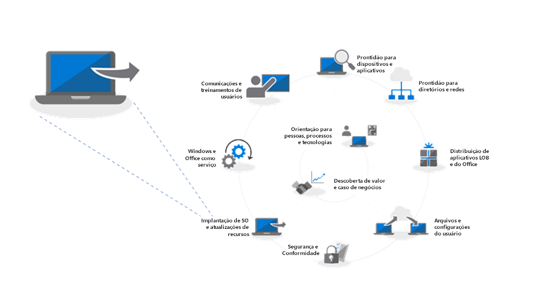
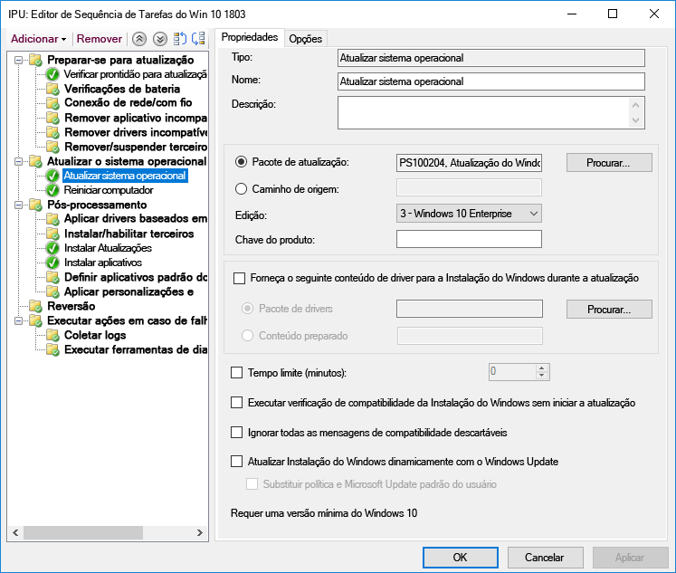
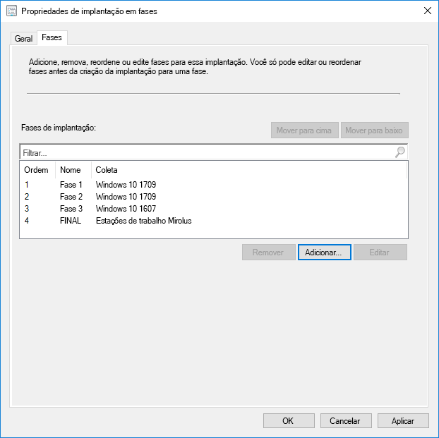
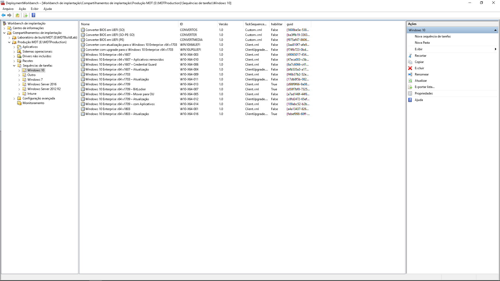

# Etapa 6: Implantação de sistema operacional e atualizações de recursosStep 6: OS Deployment and Feature Updates

<table>
<thead>
<td></td>
<td>
<strong>Etapa 6: Implantação de sistema operacional e atualizações de recursos</strong><strong>Step 6: OS Deployment and Feature Updates</strong>

A implantação com base em sequência de tarefas é usada para automatizar implantação em fases de grande escala para instalações em hardware vazio, atualização e substituição de PCs. As sequências de tarefas de atualização também ajudarão você a se manter atualizado com atualizações semestrais principais. E o Windows Autopilot é um complemento recente que moderniza o processo de aquisição de novos PCs.Task sequence-based deployment is used to automate large scale, phased deployment for bare metal installs, PC refresh and PC replacement. Upgrade task sequences will also help you stay current with major semi-annual updates. And Windows Autopilot is a recent addition that modernizes the new PC acquisition process.
</td>
<td></td>
</thead>
</table>

>[!NOTE]
>As Atualizações de Implantação de Recursos do Sistema Operacional são a sexta etapa de nosso processo de implantação recomendado, abrangendo a implantação do sistema operacional Windows 10, atualizações e atualizações de recursos.OS Deployment and Feature Updates is the sixth step in our recommended deployment process wheel covering Windows 10 OS deployment, upgrades and Feature Updates. Para ver o processo completo de implantação de desktop, visite o [Centro de Implantação do Computador](https://aka.ms/HowToShift).To see the full desktop deployment process, visit the [Desktop Deployment Center](https://aka.ms/HowToShift).
>

Caso esteja assistindo ao processo de implantação até agora, você ao menos concluiu parcialmente as etapas de preparação do dispositivo e do aplicativo, preparou a infraestrutura, configurou e coletou pacotes de aplicativos, tem um plano estabelecido para migrar os arquivos de usuários e definiu configurações padrão, assim como tem planos para reter os controles de segurança existentes e talvez implantar novos.If you’ve been following the deployment process wheel till now, you’ve at least partially completed the steps for device and app readiness, prepared your infrastructure, configured and collected app packages, have a plan in place for migrating user files and configuring default settings as well as have plans for retaining your existing security controls and perhaps deploying new ones.

Agora chegamos ao estágio no qual você está juntando todas essas peças para automatizar o máximo possível para instalar o Windows 10 e o Office 365 ProPlus, juntamente com os drivers, aplicativos e qualquer outro item necessário.Now we’ve arrived at the stage where you’re putting all these pieces together to automate as much as you can to install Windows 10 and Office 365 ProPlus, along with the necessary drivers, apps and whatever else is needed.

Por fim, a melhor medida de sucesso com uma implantação de sistema operacional é corresponder às expectativas do usuário e evitar interrupções do trabalho. E, nesta etapa, você começará a testar e a implantar para usuários piloto como parte de uma implantação em fases. E, uma dica aqui, antes de ampliar a implantação, você precisará seguir para a etapa 8 do processo de implantação [Treinamento e Comunicações de Usuários](https://aka.ms/mdd8) para assegurar que os usuários estejam informados e preparados para as alterações a serem efetuadas. Você pode medir o ritmo da implantação com validação contínua usando a Implantação em Fases.Ultimately, the best measure of success with an OS deployment is meeting user expectations and avoiding disruptions in their work. And in this step, you’ll start testing and deploying to pilot users as part of a phased deployment. And one tip here, before you broaden deployment, you’ll need to skip ahead to step 8 on our deployment process wheel – [User Communications and Training](https://aka.ms/mdd8) to make sure users are informed and prepared for changes coming their way and that you can measure your roll-out pace with continuous validation using Phased Deployment.

## Processo de geração de imagens do WindowsWindows Imaging Process

A maioria das organizações usa o processo de geração de imagens de computador para configurar e capturar um clone do Windows, inclusive um conjunto básico de alguns aplicativos padrão instalados ou até mesmo uma imagem menor com apenas tempos de execução e atualizações de aplicativos. A melhor forma de fazer isso é usar uma máquina virtual para esse processo de forma a evitar problemas de compatibilidade inesperados relacionados ao driver e para fins de automação.Most organizations use the process of PC imaging to configure and capture a clone of Windows, including a base set of a few standard apps installed, or an even a thinner image with only application runtimes and updates. The best way to do this is using a virtual machine for this process to avoid any unexpected driver-related compatibility issues and for automation purposes.

Caso opte pela captura de imagem, é melhor automatizar tanto quanto possível para garantir a melhor qualidade de imagem e um processo que possa ser repetido. Na maioria das implantações, também é recomendado usar a menor quantidade de personalização e de aplicativos pré-instalados possível na imagem do Windows antes de capturar. Isso é o que chamamos de abordagem de "imagem pequena" que pode economizar largura de banda geral na rede eliminando a quantidade de aplicativos na imagem. Começando com uma imagem pequena, você pode colocar aplicativos, idiomas e configurações necessários ajustados de forma dinâmica para os usuários.If going the image capture route, it’s best to automate as much as possible to ensure the best quality image and a repeatable process. For most deployments, it is also recommended to put as little customization and pre-installed apps as possible in the Windows image prior to capturing. This is what is called a ‘thin image’ approach, which can save overall bandwidth on the network by eliminating the number of apps within the image. By starting with a thin base image, you can layer on required apps, languages and configurations dynamically tailored to users.

Durante o processo de criação e captura, ferramentas como o System Center Configuration Manager e o Kit de Ferramentas de Implantação da Microsoft usam a Ferramenta de Preparação do Sistema, ou Sysprep, juntamente com o comando "Generalize" para selar novamente a imagem antes de capturar a instalação do Windows 10 como uma imagem.During the build and capture process, tools like System Center Configuration Manager and the Microsoft Deployment Toolkit use the System Preparation Tool – or Sysprep – along with the “Generalize” command to reseal your image before they capture the Windows 10 installation as an image.

A imagem capturada terá o formato de imagem do Windows, ou WIM, como mídia de instalação padrão do Windows. Quando tiver seu arquivo WIM personalizado, será possível usar outra sequência de tarefas como parte da implantação do sistema operacional no System Center Configuration Manager ou no Kit de Ferramentas de Implantação da Microsoft para realizar tarefas relacionadas à implantação, para aplicar tarefas de execução e imagem antes e depois da aplicação da imagem do Windows.The captured image will have the Windows image – or WIM – format like standard Windows installation media. Once you have your custom WIM file, you can use another task sequence as part of your OS deployment in System Center Configuration Manager or Microsoft Deployment Toolkit to perform deployment-related tasks, to apply the image and run tasks before and after your Windows image is applied.

  [Criar uma imagem de referência do Windows 10](https://docs.microsoft.com/pt-BR/windows/deployment/deploy-windows-mdt/create-a-windows-10-reference-image)[Create a Windows 10 Reference Image](https://docs.microsoft.com/en-us/windows/deployment/deploy-windows-mdt/create-a-windows-10-reference-image)

  [Criar uma sequência de tarefas para instalar um sistema operacional](https://docs.microsoft.com/pt-BR/sccm/osd/deploy-use/create-a-task-sequence-to-install-an-operating-system)[Create a Task Sequence to Install an Operating System](https://docs.microsoft.com/en-us/sccm/osd/deploy-use/create-a-task-sequence-to-install-an-operating-system)

### Tipos de implantaçãoDeployment Types

Com a imagem personalizada pronta, o tipo de instalação ou de migração será das seguintes categorias:With your custom image ready, the installation or migration type will fall into the following categories:

  - Primeiro, **implantação bare-metal**. Este é o cenário usado para implantar uma imagem a um disco limpo ou para colocar uma imagem novamente em um computador no qual você não pretende manter os dados no discoFirst, **bare metal deployment**. This is the scenario used to deploy an image to a clean disk, or to reimage a computer where you don’t intend to keep any of the data on the disk

  - E, segundo, semelhante à bare-metal, a **Atualização do computador,** com a diferença importante de que o estado do usuário continua no disco\* ou será restaurado após a conclusão da instalaçãoAnd second, similar to bare metal, is **Computer Refresh,** with the key difference that user state remains on the disk\* or will be restored after the install is complete

  - E, por último, a **Substituição do computador**. Aqui, como o nome sugere, você está substituindo um PC por outro. Neste caso, frequentemente existe um backup de arquivos de usuário do primeiro PC em um local central e uma restauração desses arquivos no segundo PC.And last is **Computer Replacement**. Here as the name implies, you are replacing a PC with another PC. In this case, there is often a backup of user files from the first PC to a central location, then a restore of those files to the second PC.

Todos os três cenários têm algo em comum, eles usam uma sequência de tarefas para executar, e uma imagem personalizada pode ser aplicada a cada vez.All three of these scenarios have something in common, they use a task sequence to run, and a custom image can be applied each time.

  [Mais sobre os cenários de implantação do Windows 10](https://docs.microsoft.com/pt-BR/windows/deployment/windows-10-deployment-scenarios)[More About Windows 10 Deployment Scenarios](https://docs.microsoft.com/en-us/windows/deployment/windows-10-deployment-scenarios)

### Atualização no local usando automação de sequência de tarefasIn-place Upgrade using Task Sequence Automation

Além desses tipos de implantação, há uma nova opção disponível agora como uma Sequência de Tarefas do System Center Configuration Manager com Windows 10 e atualização no local usando a Sequência de Tarefas Atualizar.In addition to these deployment types, there is a new option available now as a System Center Configuration Manager Task Sequence with Windows 10 – and in-place upgrade using the Upgrade Task Sequence.

As atualizações no local de uma versão anterior do Windows não precisam de uma sequência de tarefas, mas é uma abordagem recomendada ao implantar em escala empresarial. Uma atualização no local não permite a aplicação de uma imagem personalizada com aplicativos, mas você pode atualizar o install.wim padrão usando a manutenção offline. Por exemplo, você pode garantir que ele tenha as atualizações mais recentes do Windows aplicadas antes de executar as atualizações.In-place upgrades from a previous version of Windows do not require a task sequence, but it is a recommended approach when deploying at enterprise scale. An in-place upgrade does not allow you to apply a custom image with applications, but you can update the default install.wim using offline servicing. For example, you can to make sure it has the latest Windows updates applied prior to performing upgrades.

A atualização no local usa a instalação do Windows. O mecanismo de instalação executa diversas verificações de pré-instalação buscando por problemas de compatibilidade conhecidos. Ela também preserva os aplicativos e o estado do usuário e remove apenas o que não é compatível com a versão do Windows 10 sendo instalada. Com essa opção, os aplicativos instalados previamente e o estado do usuário são preservados. A atualização no local também permite que você reverta para o sistema operacional instalado anteriormente caso seja necessário para fins de solução de problemas.In-place upgrade uses windows setup. The setup engine runs several small pre-installation checks looking for known compatibility issues. It also preserves the user state and applications and only removes what isn’t compatible with the version of Windows 10 being installed. With this option, previously installed applications and user state are preserved. In-place upgrade also allows you to roll-back to the previous OS installed if needed for troubleshooting purposes.

[Validação do Windows 10 pré-atualização usando o setup.exeWindows 10 Pre-Upgrade Validation Using setup.exe](https://blogs.technet.microsoft.com/mniehaus/2015/08/23/windows-10-pre-upgrade-validation-using-setup-exe/)

O cenário de atualização no local pode ser usado para migrar para o Windows 10 de versões herdadas do Windows, assim como versões anteriores do Windows 10. Depois que a Instalação do Windows concluir a atualização, sua sequência de tarefas poderá continuar a ser executada e atualizar aplicativos como o Office, substituir drivers e aplicar configurações de personalização. De forma semelhante, é possível usar Atualizar Sequência de Tarefas para executar tarefas de pré-instalação ou verificações antes da atualização.The in-place upgrade scenario can be used to migrate to Windows 10 from legacy versions of Windows, as well as upgrade from previous versions of Windows 10. After Windows Setup completes the upgrade, your task sequence can continue to run and upgrade applications like Office, replace drivers, and apply personalization settings. Likewise, you can use the Upgrade Task Sequence to perform pre-installation tasks or checks prior to carrying out the upgrade.

  [Executar uma atualização no local para o Windows 10 usando o Configuration Manager](https://docs.microsoft.com/pt-BR/windows/deployment/upgrade/upgrade-to-windows-10-with-system-center-configuraton-manager)[Perform an in-place upgrade to Windows 10 using Configuration Manager](https://docs.microsoft.com/en-us/windows/deployment/upgrade/upgrade-to-windows-10-with-system-center-configuraton-manager)

  [Criar uma sequência de tarefas para atualizar um sistema operacional no Gerenciador de Configurações](https://docs.microsoft.com/pt-BR/sccm/osd/deploy-use/create-a-task-sequence-to-upgrade-an-operating-system)[Create a task sequence to upgrade an OS in Configuration Manager](https://docs.microsoft.com/en-us/sccm/osd/deploy-use/create-a-task-sequence-to-upgrade-an-operating-system)

### Implantação em fasesPhased Deployment

Durante o planejamento da implantação, você segmentará os computadores como bare-metal, atualizar, substituir e caminhos de atualização. A abordagem recomendada nesse caso é usar uma implantação em fases em conjuntos de máquinas semelhantes. Dessa forma, você pode validar a compatibilidade, a distribuição e a automação, a aceitação do usuário, o consumo de largura de banda e outros fatores antes de aumentar a escala da implantação.As you're planning your deployment, you'll be targeting computers for bare metal, refresh, replace and upgrade paths. The recommended approach in this case is to use phased deployment to collections of similar machines. This way, you can validate compatibility, delivery and automation, user acceptance, network bandwidth consumption, and other factors before increasing the scale of your deployment.

### Ferramentas recomendadas: System Center Configuration Manager e o Kit de Ferramentas de Implantação da MicrosoftRecommended Tools: System Center Configuration Manager and the Microsoft Deployment Toolkit

Independentemente do tipo de implantação escolhido, convém garantir que ele seja tão automatizado quanto possível para fins de previsibilidade e capacidade de repetição. A Microsoft oferece duas soluções para automatizar a implantação do sistema operacional usando sequência de tarefas automatizada:Regardless of the deployment type you choose, you’ll want to make sure it’s as automated as possible for predictability and repeatability. Microsoft offers two solutions to automate OS deployment using automated task sequences:

  - 
  **
  [System Center Configuration Manager](https://docs.microsoft.com/pt-BR/sccm/core/understand/introduction)\*\* (ConfigMgr) oferece recursos internos de implantação do sistema operacional para complementar os recursos de distribuição e gerenciamento de atualização de software. O ConfigMgr é amplamente usado por organização de todos os tamanhos e oferece suporte a todos os quatro tipos de implantação do Windows. De forma opcional, é possível integrar o ConfigMgr ao Microsoft Intune para adicionar outros recursos de implantação e gerenciamento de dispositivos.**[System Center Configuration Manager](https://docs.microsoft.com/en-us/sccm/core/understand/introduction)** (ConfigMgr) provides built-in operating system deployment capabilities to complement its capabilities for software distribution and software update management. ConfigMgr is widely used by organizations of all sizes and supports all four Windows deployment types. Optionally, you can integrate ConfigMgr with Microsoft Intune to add additional capabilities for deployment and device management.

  - E uma opção popular de implantação é o **[Kit de Ferramentas de Implantação da Microsoft](https://docs.microsoft.com/pt-BR/windows/deployment/deploy-windows-mdt/get-started-with-the-microsoft-deployment-toolkit)** (MDT) que normalmente é usado por organizações de pequeno e médio porte para implantação de sistema operacional. Isso requer muito pouca infraestrutura. O MDT se integra aos Windows Deployment Services (WDS) para inicialização de rede. Ele é compatível com todos os quatro tipos de implantação, assim como a instalação de aplicativos, drivers e configurações. E, claro, o MDT pode ser integrado ao Configuration Manager.And one other popular deployment option is the free **[Microsoft Deployment Toolkit](https://docs.microsoft.com/en-us/windows/deployment/deploy-windows-mdt/get-started-with-the-microsoft-deployment-toolkit)** (MDT) which is typically used by small and medium sized organizations for OS deployment. This requires very little infrastructure. MDT integrates with Windows Deployment Services (WDS) for network boot. It supports all four deployment types as well as installation of applications, drivers, and settings. And of course, MDT can even be integrated with Configuration Manager.

### Windows AutopilotWindows Autopilot

Uma nova opção com o Windows 10 é configurar computadores novos como parte do ciclo de atualização de hardware usando o Windows Autopilot.A new option with Windows 10 is to configure new PCs as part of your hardware refresh cycle using Windows Autopilot. Aqui, você pode trabalhar com fornecedores de hardware de suporte para personalizar a experiência de instalação padrão do Windows, por exemplo, eliminando opções apresentadas aos usuários, como Contratos de Licenças ou configurações de dados de diagnóstico.Here you can work with supporting hardware vendors to customize the default Windows setup experience – for example by eliminating options presented to users, like Licensing Agreements or diagnostic data settings.

Em seguida, quando um usuário se conecta ao PC durante a configuração usando as credenciais do Azure AD, o dispositivo se registra no Microsoft Intune, que pode então assumir o processo de implantação e aplicar os aplicativos, as configurações de atualizações de software e as políticas de conformidade. O Windows Autopilot também pode, como opção, evitar que o usuário acesse a primeira sessão até que o provisionamento seja concluído.Then, when a user signs in to the PC during setup using their Azure AD credentials, the device enrolls into Microsoft Intune, which can then take over the deployment process and apply applications, software updates configurations and compliance policies. Windows Autopilot can also optionally prevent the user from accessing the first session until provisioning is complete.

  [Visão geral do Windows Autopilot](https://docs.microsoft.com/pt-BR/windows/deployment/windows-autopilot/windows-10-autopilot)[Overview of Windows Autopilot](https://docs.microsoft.com/en-us/windows/deployment/windows-autopilot/windows-10-autopilot)

  [Pré-requisitos do Windows Autopilot](https://docs.microsoft.com/pt-BR/windows/deployment/windows-autopilot/windows-10-autopilot#prerequisites)[Windows Autopilot Prerequisites](https://docs.microsoft.com/en-us/windows/deployment/windows-autopilot/windows-10-autopilot#prerequisites)

## Atualizações de recursos do Windows Update para EmpresasWindows Update for Business for Feature Updates

O Windows Update para Empresas é um serviço gratuito que permite que profissionais de TI mantenham os dispositivos Windows 10 sempre atualizado, conectando-os diretamente ao serviço de atualização do Windows.Windows Update for Business is a free service that enables IT Pros to keep Windows 10 devices always up to date by directly connecting the devices to the Windows Update service. O Windows Update para Empresas pode ser configurado na Política de grupo ou nas soluções MDM como Microsoft Intune e permite que profissionais de TI criem [anéis de implantação](https://docs.microsoft.com/pt-BR/windows/deployment/update/waas-deployment-rings-windows-10-updates) para validar os novos builds.Windows Update for Business can be configured via Group Policy or through MDM solutions such as Microsoft Intune and allows IT Pros to create [deployment rings](https://docs.microsoft.com/en-us/windows/deployment/update/waas-deployment-rings-windows-10-updates) to validate new builds. Ele está integrado às ferramentas de gerenciamento existentes, como o WSUS (Windows Server Update Services), o System Center Configuration Manager (ramificação atual) e o Microsoft Intune.It is integrated into existing management tools such as Windows Server Update Services (WSUS), System Center Configuration Manager (current branch), and Microsoft Intune. Além disso, o Windows Update para Empresas dá suporte à distribuição ponto a ponto para ajudar a otimizar a eficiência da largura de banda e reduzir o congestionamento da rede.Additionally, Windows Update for Business supports peer-to-peer delivery to help optimize bandwidth efficiency and reduce network congestion.

Para saber mais sobre o Windows Update para Empresas, examine a documentação a seguir:For more detailed information on Windows Update for Business please review the following documentation:

- 
  [Implantar atualizações usando o Windows Update para Empresas](https://docs.microsoft.com/pt-BR/windows/deployment/update/waas-manage-updates-wufb)[Deploy Updates Using Windows Update for Business](https://docs.microsoft.com/en-us/windows/deployment/update/waas-manage-updates-wufb)
- 
  [Configurar o Windows Update para Empresas](https://docs.microsoft.com/pt-BR/windows/deployment/update/waas-configure-wufb)[Configure Windows Update for Business](https://docs.microsoft.com/en-us/windows/deployment/update/waas-configure-wufb)
- 
  [Integrar o Windows Update para Empresas nas ferramentas de gerenciamento existentes](https://docs.microsoft.com/pt-BR/windows/deployment/update/waas-integrate-wufb)[Integrate Windows Update for Business with Existing Management Tools](https://docs.microsoft.com/en-us/windows/deployment/update/waas-integrate-wufb)
- 
  [Usar a Política de grupo para configurar o Windows Update para Empresas](https://docs.microsoft.com/pt-BR/windows/deployment/update/waas-wufb-group-policy)[Use Group Policy to configure Windows Update for Business](https://docs.microsoft.com/en-us/windows/deployment/update/waas-wufb-group-policy)
- 
  [Usar o Microsoft Intune para configurar o Windows Update para Empresas](https://docs.microsoft.com/pt-BR/intune/windows-update-for-business-configure)[Use Microsoft Intune to configure Windows Update for Business](https://docs.microsoft.com/en-us/intune/windows-update-for-business-configure)

## Próxima etapaNext Step 

## [Etapa 7: Manutenção do Windows e do OfficeStep 7: Windows and Office Servicing](https://aka.ms/mdd7)

## Etapa anteriorPrevious Step

## [Etapa 5: Considerações de segurança e conformidadeStep 5: Security and Compliance Considerations](https://aka.ms/mdd5)