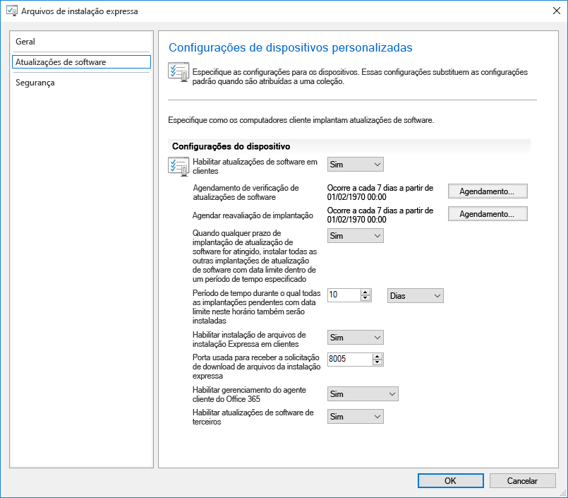
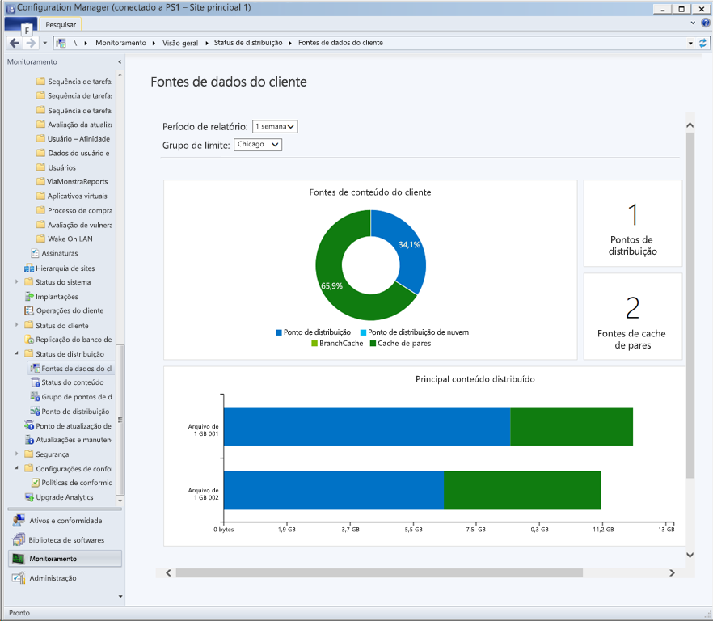
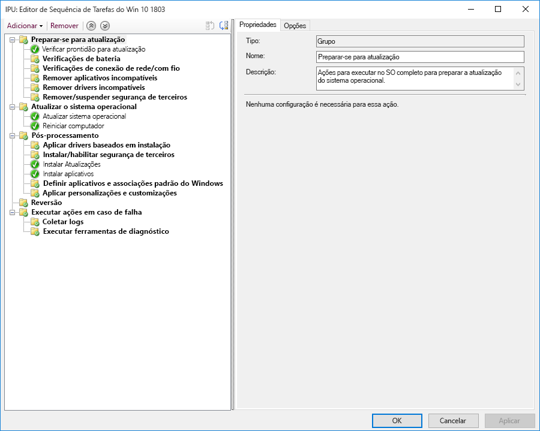

# Etapa 7: Manutenção do Windows e do Office

<table>
<thead>
<td></td>
<td>
<strong>Etapa 7: Manutenção do Windows e do Office</strong>

Both Windows 10 and Microsoft 365 Apps for enterprise continually add new capabilities to keep bringing user experiences and security forward with the latest innovations. Learn how to stay current with semi-annual and monthly updates, how the new servicing model works and the tools and options you have.
</td>
<td></td>
</thead>
</table>

>[!NOTE]
>A manutenção do Windows e do Office é a sétima etapa no nosso processo de implantação recomendado que aborda os aspectos de planejamento de preparação para atualizações semestrais dos recursos. Para ver o processo completo de implantação de desktop, visite o [Centro de Implantação do Computador](https://aka.ms/HowToShift).
>

O Windows 10 e os Aplicativos do Microsoft 365 para empresas apresentam novas opções de manutenção, modelos de suporte e linhas do tempo de atualizações. Essas alterações simplificam o processo para se manter atualizado com os recursos mais recentes. Com essas atualizações, há novas opções de configuração para habilitar os planos de manutenção que atendam às suas necessidades. Saiba como se preparar para as atualizações nos canais semestrais, as quais oferecem novos recursos e funcionalidades no Windows 10 e nos Aplicativos do Microsoft 365 para empresas, ao mesmo tempo que aproveita as novas funcionalidades do Gerenciador de Configurações do Microsoft Endpoint (Branch Atual).

[Ajudando os clientes a migrar para o Windows 10 e os Aplicativos do Microsoft 365 para empresas](https://www.microsoft.com/microsoft-365/blog/2018/09/06/helping-customers-shift-to-a-modern-desktop/)

## Tipos de atualização

Há duas categorias principais de atualizações, as atualizações de recursos e, posteriormente, as atualizações de qualidade e segurança que contêm correções de bugs, confiabilidade e segurança cumulativa. Em termos frequência, tanto o Windows quanto o Office oferecem um canal semestral que fornece novos recursos duas vezes por ano, por volta de março e de setembro, enquanto as atualizações de qualidade e segurança ocorrerem mensalmente. Além disso, exclusiva para os aplicativos do Office 365, oferecemos uma opção de canal atual totalmente suportada, em que as atualizações contêm novos recursos e atualizações de qualidade.

Se você está acostumado a um ciclo mais longo entre as atualizações do sistema operacional da área de trabalho e de aplicativo, deve estar se perguntando:

  - As atualizações serão compatíveis?

  - Será necessário continuar treinando meus usuários?

  - E quais são os riscos?

Para responder a essas perguntas e demonstrar o raciocínio para fornecer novos recursos com mais frequência, falaremos sobre algumas das vantagens dessa abordagem

### Benefícios da atualização de recursos

First, we’ve moved away from the model of the past that would introduce huge waves of change around every three years to now incremental smaller changes with feature updates twice per year. Why? With technology trends moving so fast in addition to rapidly evolving security threats, this keeps experiences and protections current. Some of the security related updates for example can’t just be delivered by monthly security updates or antivirus signature files; they may be low-level changes platform, like virtualization-based security.

[Guia rápido para o Windows como serviço](https://docs.microsoft.com/windows/deployment/update/waas-quick-start)

[Mitigar as ameaças usando recursos de segurança do Windows 10](https://docs.microsoft.com/windows/security/threat-protection/overview-of-threat-mitigations-in-windows-10%20%20)

### Benefícios do modelo de atualização cumulativa

Second delivering quality and security updates as a cumulative update package corrects many of the issues of the past. It used to be that you might pick and choose sometimes from a dozen updates or more each month for both Windows and Office. As you can imagine, this creates a nearly impossible set of test matrices for support. Also, if you install a version of Windows or Office that is a year or more old, it might take hours or sometimes days to apply all updates delivered since that version was released.

With the cumulative model, you’re always one update away from being current and in doing so the number of monthly updates that you need to deploy is reduced. Each update builds upon updates from previous months and contains all of the fixes that you need to get current. Cumulative updates are especially helpful when PCs has been turned off for several months because they are in storage waiting to be reassigned to a different user.

### Validação expandida das atualizações

Outra vantagem é que, antes de distribuirmos as atualizações para a ampla implantação, lançamos primeiro builds por meio dos programas Insider para o [Office](https://products.office.com/office-insider?tab=Windows-Desktop) e o [Windows](https://insider.windows.com/), o que nos permite obter dados de diagnóstico e comentários antes de lançar as atualizações de forma mais abrangente. Agora, os programas Insider estão abertos para todos, assim você poderá entender as atualizações com antecedência. Quando lançarmos as atualizações, já teremos recebido dados de diagnóstico de milhões de configurações; portanto, ao disponibilizamos as atualizações, a qualidade será inerentemente mais previsível

E mais uma vez, como as compilações do Microsoft 365 Apps para o Enterprise Insider refletem as atualizações mensais do canal; se você estiver usando o canal semestral do Office para fornecer atualizações de recursos duas vezes por ano alinhadas ao Windows, poderá validar essas versões antecipadamente, usando as versões semestrais do canal empresarial (Visualização).

### Suporte a ferramentas de gerenciamento

We've also thought through how to make the deployment of updates seamless to you. Configuration Manager (Current Branch) is updated frequently to support the roll-out of these updates to Windows and Office and any new capabilities.

[Implantar as atualizações do Windows 10 usando o Configuration Manager](https://docs.microsoft.com/windows/deployment/update/waas-manage-updates-configuration-manager)

[Gerenciar os Aplicativos do Microsoft 365 para empresas com o Gerenciador de Configurações](https://docs.microsoft.com/mem/configmgr/sum/deploy-use/manage-office-365-proplus-updates)

## Visão geral dos canais do Windows e do Office

O Windows 10 oferece três canais de manutenção:

- O [**Programa Windows Insider**](https://docs.microsoft.com/windows/deployment/update/waas-overview#windows-insider) é direcionado para que as organizações testem e forneçam comentários sobre os recursos que serão disponibilizados na atualização de recursos seguinte
- O **Canal Semestral** fornece novas funcionalidades com as versões de atualização de recursos, duas vezes por ano
- O **Canal de Manutenção em Longo Prazo** é projetado somente para dispositivos especializados que necessitam de uma opção de manutenção mais longa

O Microsoft 365 oferece quatro canais de manutenção:

- O [**Programa Office Insider**](https://products.office.com/office-insider) é direcionado para que as organizações testem e forneçam comentários sobre os recursos e as funcionalidades mais recentes do Office ainda em desenvolvimento
- **Canal atual** para fornecer aos usuários os recursos mais recentes do Office assim que eles estiverem disponíveis
- O **Canal empresarial semestral** fornece novas funcionalidades com novos recursos apenas duas vezes por ano
- O **Canal empresarial semestral (Visualização)** é uma compilação totalmente suportada do Office que permite que usuários pilotos e testadores de compatibilidade de aplicativos testem e validem o próximo canal empresarial semestral

Para obter informações detalhadas sobre os canais de manutenção do Windows e do Office, examine a documentação a seguir:

- [Visão geral do Windows como Serviço](https://docs.microsoft.com/windows/deployment/update/waas-overview#servicing-channels)
- [Visão geral dos canais de atualização do Microsoft 365 Apps](https://docs.microsoft.com/DeployOffice/overview-update-channels#BKMK_SAC)

## Implantação de atualizações em fases

Now let’s shift gears to how you will roll out these updates. For any release, we recommend at least three deployment phases for IT – validation, piloting and broad production deployment. Once you’re up and running on Windows 10 and Microsoft 365 Apps for enterprise, you'll use monthly servicing to stay current with critical security and quality updates, then you’ll move to semi-annual servicing for new features.

### Atualização mensal

The service model is designed so you can choose to limit the roll-out of new features to twice per year, and if needed you can even skip a semi-annual update and continue receiving quality and security updates. As mentioned, the cumulative nature of monthly updates means each will increase in size per month.

#### Atualizações Expressas

Using a technology called "Express Updates" in Windows and Binary Delta Compression in Office, we can reduce the download size significantly. In both approaches, the update engines compare what’s on the PC and finds only the differentials needed to update what’s there.

[Atualizações de qualidade do Windows 10 explicadas e o final das atualizações de delta](https://techcommunity.microsoft.com/t5/Windows-IT-Pro-Blog/Windows-10-quality-updates-explained-amp-the-end-of-delta/ba-p/214426)

O Windows Update para Empresas e o Windows Server Update Services têm suporte para atualizações expressas há muito tempo, mas agora ampliamos esse suporte para o Microsoft Endpoint Configuration Manager (Branch Atual) para que ele também possa usar as Atualizações Expressas.

#### Compactação de Delta Binário

A compactação de Delta Binário no Office só é usada se você estiver atualizando da versão mais recente dos Aplicativos do Microsoft 365 para empresas. Para poder usar essa abordagem, será necessário atualizar de um build anterior e não poderá ignorar atualizações.

Windows and Office update channels can be managed via Configuration Manager using the standard approval and targeting process. Additionally, you can use policy settings in Office and Windows to enforce update channels used, as well as related settings.

### Atualizações semestrais

Essas são as nossas considerações sobre as atualizações mensais. Agora vamos falar das atualizações semestrais maiores.

Como abordamos na preparação do dispositivo e do aplicativo, convém começar sua preparação para essas atualizações maiores usando as mesmas ferramentas de preparação que configuramos na Etapa 1 do processo de implantação.

As for tooling, you can use policy settings with Windows Update for Business, software update management via Microsoft Endpoint Configuration Manager (Current Branch), Windows Server Update Services (WSUS), or update policies set by Microsoft Intune. If you are concerned about network bandwidth, see Step 2: Directory and Network Readiness, to learn about your options to reduce network traffic via Delivery Optimization and other peer to peer caching technologies.

[Canal Semestral do Windows](https://docs.microsoft.com/windows/deployment/update/waas-overview#semi-annual-channel)

[Canal semestral para empresas do Microsoft 365 Apps](https://docs.microsoft.com/DeployOffice/overview-update-channels#BKMK_SAC)

#### Atualizar as sequências de tarefas

Instalar as atualizações dos recursos de maior porte por meio de rotinas de gerenciamento de atualização de software é uma opção compatível, mas muitas organizações optarão por usar uma Sequência de Tarefas de Atualização com o Microsoft Endpoint Configuration Manager (Branch Atual) ou o Kit de Ferramentas de Implantação da Microsoft.

Uma sequência de tarefas permite que você crie verificações ou tarefas personalizadas ANTES de instalar a atualização de recursos e permite executar tarefas personalizadas APÓS a instalação da atualização ser concluída. As tarefas após a atualização podem incluir suspensão temporária de serviços se isso for necessário durante a atualização, instalação e substituição de driver, atualizações de aplicativo ou barra de tarefas e configurações de personalização inicial do Windows 10.

If you’re already using task sequences to migrate your Windows 7 machines to Windows 10 and are well-versed with those tools, this is a great place to start and provides ultimate control. While you can use a single task sequence for the entire upgrade, it is quite common that organizations use two task sequences. One task sequence for making sure the machines are ready for the upgrade, that silently pre-stages all the required setup files on target computers, and one to do the actual upgrade. This approach ensures that your user productivity is less impacted.

[Criar uma sequência de tarefas para atualizar um sistema operacional no Gerenciador de Configurações](https://docs.microsoft.com/mem/configmgr/osd/deploy-use/create-a-task-sequence-to-upgrade-an-operating-system)

#### Suporte de canal semestral para atualizações de recursos

[Conforme anunciado em setembro de 2018](https://www.microsoft.com/microsoft-365/blog/2018/09/06/helping-customers-shift-to-a-modern-desktop/), a linha do tempo de suporte para atualizações de canal semestral usará o modelo a seguir.

  - Todas as atualizações de recursos com suporte no momento do Windows 10 Enterprise e Education, a partir da versão 1607, terá suporte para 30 meses a partir de sua data de lançamento original.

  - Todas as atualizações de recursos futuras, a partir da versão 1809, com previsão para setembro, terão suporte por 30 meses a partir de sua data de lançamento.

  - As atualizações de recursos futuras, a partir da versão 1903 em março, terão suporte por 18 meses a partir de sua data de lançamento.

  - As atualizações semestrais dos Aplicativos do Microsoft 365 para empresas continuam a ter suporte por 18 meses

#### Opções adicionais de automação de instalação fora das sequências de tarefas

Se você não usa as sequências de tarefas de atualização, agora pode executar ações personalizadas ou aplicar arquivos driver durante as atualizações de recurso na fase de pré-instalação, antes de a configuração ser executada nas verificações de compatibilidade, ou na fase de pré-confirmação, antes da aplicação da atualização.

[Novidades na instalação do Windows 10, versão 1803](https://docs.microsoft.com/windows/whats-new/whats-new-windows-10-version-1803%23windows-setup)

## Próxima etapa 

## [Etapa 8: Treinamento e comunicações de usuários](https://aka.ms/mdd8)

## Etapa anterior 

## [Etapa 6: Implantação de sistema operacional e atualizações de recursos](https://aka.ms/mdd6)
