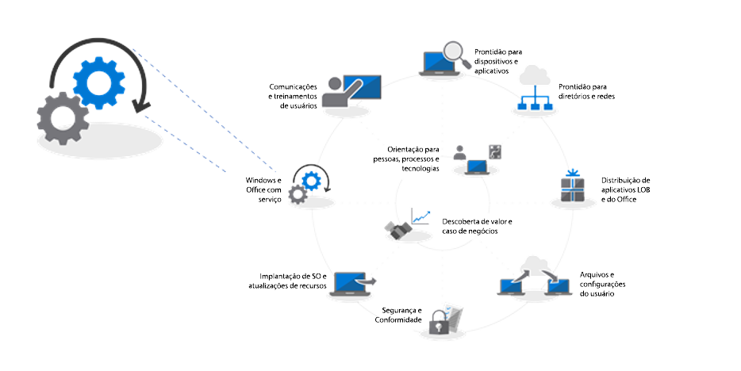
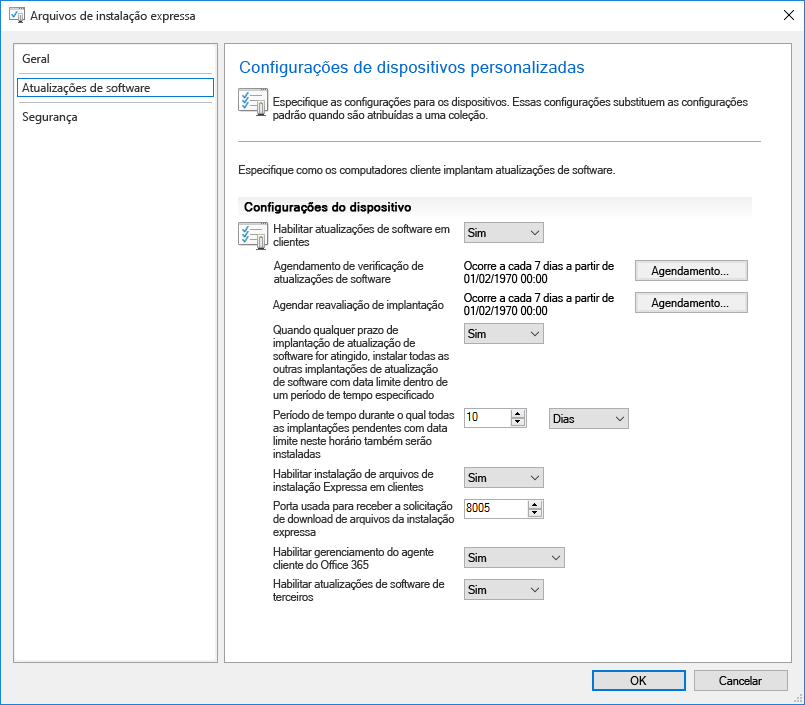
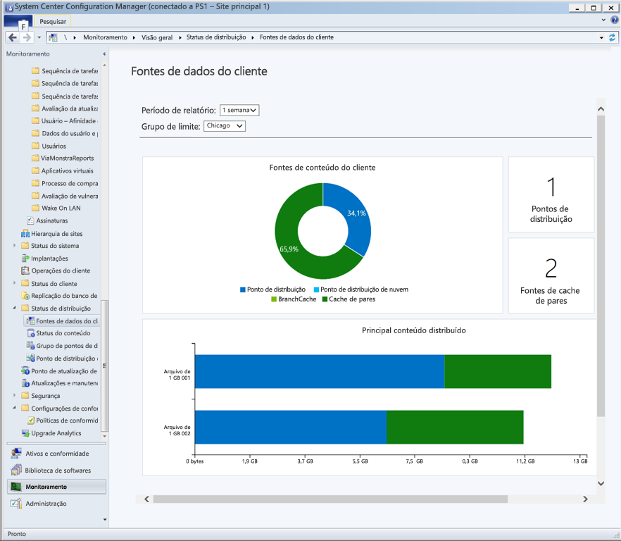
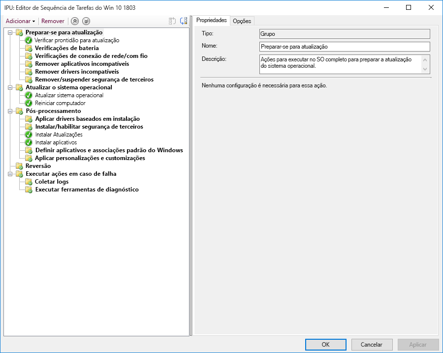

# Etapa 7: Manutenção do Windows e do OfficeStep 7: Windows and Office Servicing

<table>
<thead>
<td></td>
<td>
<strong>Etapa 7: Manutenção do Windows e do Office</strong><strong>Step 7: Windows and Office Servicing</strong>

O Windows 10 e o Office 365 ProPlus adicionam continuamente novos recursos para melhorar a segurança e a experiência do usuário com as últimas inovações. Saiba como instalar as atualizações semestrais e mensais, descubra como o novo modelo de serviço funciona e que opções e ferramentas você tem.Both Windows 10 and Office 365 ProPlus continually add new capabilities to keep bringing user experiences and security forward with the latest innovations. Learn how to stay current with semi-annual and monthly updates, how the new servicing model works and the tools and options you have.
</td>
<td></td>
</thead>
</table>

>[!NOTE]
>A manutenção do Windows e do Office é a sétima etapa no nosso processo de implantação recomendado que aborda os aspectos de planejamento de preparação para atualizações semestrais dos recursos.Windows and Office Servicing is the seventh step in our recommended deployment process wheel covering the planning aspects of preparing for semi-annual updates to features. Para ver o processo completo de implantação de desktop, visite o [Centro de Implantação do Computador](https://aka.ms/HowToShift).To see the full desktop deployment process, visit the [Desktop Deployment Center](https://aka.ms/HowToShift).
>

O Windows 10 e o Office 365 ProPlus apresentam novas opções de manutenção, modelos de suporte e linhas do tempo de atualizações.Both Windows 10 and Office 365 ProPlus introduce new servicing options, support models, and update timelines. Essas alterações simplificam o processo para se manter atualizado com os recursos mais recentes.These changes simplify the process for staying current on the latest features. Com essas atualizações, há novas opções de configuração para habilitar os planos de manutenção que atendam às suas necessidades.Along with these updates are new configuration options to enable servicing plans that meet your needs. Saiba como se preparar para as atualizações nos canais semestrais, as quais oferecem novos recursos e funcionalidades no Windows 10 e no Office 365 ProPlus, ao mesmo tempo que aprimoram novas funcionalidades no System Center Configuration Manager (Branch Atual).Let's learn how to prepare for semi-annual channel updates offering new features and capabilities in Windows 10 and Office 365 ProPlus while leveraging new features within System Center Configuration Manager Current Branch.

[Como ajudar clientes a mudar para o Windows 10 e o Office 365 ProPlusHelping customers shift to Windows 10 and Office 365 ProPlus](https://www.microsoft.com/pt-BR/microsoft-365/blog/2018/09/06/helping-customers-shift-to-a-modern-desktop/)

## Tipos de atualizaçãoUpdate Types

Há duas categorias principais de atualizações, as atualizações de recursos e, posteriormente, as atualizações de qualidade e segurança que contêm correções de bugs, confiabilidade e segurança cumulativa.Updates fall into two main categories, feature updates and then quality and security updates which contain cumulative security, reliability and bug fixes. Em termos frequência, tanto o Windows quanto o Office oferecem um canal semestral que fornece novos recursos duas vezes por ano, por volta de março e de setembro, enquanto as atualizações de qualidade e segurança ocorrerem mensalmente.In terms of cadence both Windows and Office deliver a semi-annual channel which delivers new features twice per year around March and September while quality and security Updates occur Monthly. Além disso, oferecemos com exclusividade para os aplicativos do Office 365 uma opção de canal mensal, com suporte total, em que há atualizações de novos recursos e de qualidade.Additionally, unique to Office 365 applications, we offer a fully-supported Monthly Channel option where updates contain both new features and quality updates.

Se você está acostumado a um ciclo mais longo entre as atualizações do sistema operacional da área de trabalho e de aplicativo, deve estar se perguntando:If you’re used to a longer cycle between desktop OS and app updates, you might be wondering;

  - As atualizações serão compatíveis?Will the updates be compatible?

  - Será necessário continuar treinando meus usuários?Will I need to keep retraining my users?

  - E quais são os riscos?And what are the risks?

Para responder a essas perguntas e demonstrar o raciocínio para fornecer novos recursos com mais frequência, falaremos sobre algumas das vantagens dessa abordagemTo answer those questions and the rationale for delivering new capabilities more frequently, we’ll some of the advantages of this approach

### Benefícios da atualização de recursosFeature Update Benefits

Primeiro, abandonamos o modelo do passado que apresentaria ondas gigantes de alterações a cada três anos e passamos para alterações incrementais menores com atualizações de recursos duas vezes por ano. Por quê? Com as tendências de tecnologia mudando tão depressa, além das ameaças à segurança evoluírem rapidamente, isso deixa as experiências e as proteções mais atualizadas. Algumas das atualizações de segurança relacionadas, por exemplo, não podem apenas ser entregues por atualizações de segurança mensais ou arquivos de assinaturas de antivírus; podem ser uma plataforma de alterações de baixo nível, como a segurança baseada em virtualização.First, we’ve moved away from the model of the past that would introduce huge waves of change around every three years to now incremental smaller changes with feature updates twice per year. Why? With technology trends moving so fast in addition to rapidly evolving security threats, this keeps experiences and protections current. Some of the security related updates for example can’t just be delivered by monthly security updates or antivirus signature files; they may be low-level changes platform, like virtualization-based security.

[Guia rápido para o Windows como serviçoQuick guide to Windows as a service](https://docs.microsoft.com/pt-BR/windows/deployment/update/waas-quick-start)

[Mitigar as ameaças usando recursos de segurança do Windows 10Mitigate threats by using Windows 10 security features](https://docs.microsoft.com/pt-BR/windows/security/threat-protection/overview-of-threat-mitigations-in-windows-10%20%20)

### Benefícios do modelo de atualização cumulativaCumulative Update Model Benefits

Fornecer atualizações de qualidade e segurança como um pacote de atualização cumulativa corrige vários dos problemas do passado. Antes era possível escolher entre várias atualizações mensalmente para o Windows e o Office. Como você pode imaginar, isso cria um conjunto de matrizes de teste com suporte praticamente inviável. Além disso, se você instalasse uma versão do Windows ou Office que tivesse um ano ou fosse mais antiga, poderia levar horas ou, às vezes dias, para aplicar todas as atualizações fornecidas desde que essa versão foi lançada.Second delivering quality and security updates as a cumulative update package corrects many of the issues of the past. It used to be that you might pick and choose sometimes from a dozen updates or more each month for both Windows and Office. As you can imagine, this creates a nearly impossible set of test matrices for support. Also, if you install a version of Windows or Office that is a year or more old, it might take hours or sometimes days to apply all updates delivered since that version was released.

Com o modelo cumulativo, basta apenas uma única atualização e a quantidade de atualizações mensais que você precisa implantar é menor. Cada atualização contém as atualizações dos meses anteriores e todas as correções necessárias. As atualizações cumulativas são especialmente úteis quando os computadores ficaram desligados por vários meses por estarem aguardando serem reatribuídos a outro usuário.With the cumulative model, you’re always one update away from being current and in doing so the number of monthly updates that you need to deploy is reduced. Each update builds upon updates from previous months and contains all of the fixes that you need to get current. Cumulative updates are especially helpful when PCs has been turned off for several months because they are in storage waiting to be reassigned to a different user.

### Validação expandida das atualizaçõesExpanded Validation of Updates

Outra vantagem é que, antes de distribuirmos as atualizações para a ampla implantação, lançamos primeiro builds por meio dos programas Insider para o [Office](https://products.office.com/en-us/office-insider?tab=Windows-Desktop) e o [Windows](https://insider.windows.com/pt-BR/), o que nos permite obter dados de diagnóstico e comentários antes de lançar as atualizações de forma mais abrangente.Another advantage is that, before we roll out updates for broad deployment, we first release builds via the Insider programs for [Office](https://products.office.com/en-us/office-insider?tab=Windows-Desktop) and [Windows](https://insider.windows.com/pt-BR/), and this allows us to gather diagnostic data and feedback ahead of us releasing updates broadly. Agora, os programas Insider estão abertos para todos, assim você poderá entender as atualizações com antecedência.Now the Insider programs are open to everyone so that you can get ahead of understanding the updates. Quando lançarmos as atualizações, já teremos recebido dados de diagnóstico de milhões de configurações; portanto, ao disponibilizamos as atualizações, a qualidade será inerentemente mais previsívelBy the time we release updates we will have received diagnostic data from millions of configurations, so when we do roll out updates, quality is now inherently more predictable

E uma última coisa. Como os builds do Office 365 ProPlus Insider refletirão as atualizações de canal mensais, se você estiver usando um canal semestral para o Office para fornecer atualizações de recursos duas vezes por ano com alinhamento ao Windows, também poderá validar esses builds antecipadamente usando as versões direcionadas do canal semestral.AND one more thing, because Office 365 ProPlus Insider builds reflect monthly channel updates, if you are using semi-annual channel for Office to deliver feature updates twice per year aligned to Windows, you can validate those builds early as well using the semi-annual channel targeted releases.

### Suporte a ferramentas de gerenciamentoSupporting Management Tools

Também pensamos em como simplificar a implantação das atualizações para você. O System Center Configuration Manager (Branch Atual) é atualizado frequentemente para oferecer suporte à distribuição dessas atualizações para o Windows e o Office e os novos recursos.We've also thought through how to make the deployment of updates seamless to you. System Center Configuration Manager Current Branch is updated frequently to support the roll-out of these updates to Windows and Office and any new capabilities.

[Implantar as atualizações do Windows 10 usando o System Center Configuration ManagerDeploy Windows 10 updates using System Center Configuration Manager](https://docs.microsoft.com/pt-BR/windows/deployment/update/waas-manage-updates-configuration-manager)

[Gerenciar o Office 365 ProPlus com o Configuration ManagerManage Office 365 ProPlus with Configuration Manager](https://docs.microsoft.com/pt-BR/sccm/sum/deploy-use/manage-office-365-proplus-updates)

## Visão geral dos canais do Windows e do OfficeOverview of Windows and Office Channels

O Windows 10 oferece três canais de manutenção:Windows 10 offers three servicing channels:

- O [**Programa Windows Insider**](https://docs.microsoft.com/pt-BR/windows/deployment/update/waas-overview#windows-insider) é direcionado para que as organizações testem e forneçam comentários sobre os recursos que serão disponibilizados na atualização de recursos seguinte[**Windows Insider Program**](https://docs.microsoft.com/pt-BR/windows/deployment/update/waas-overview#windows-insider) for organizations to test and provide feedback on features shipped in the next feature update
- O **Canal Semestral** fornece novas funcionalidades com as versões de atualização de recursos, duas vezes por ano**Semi-Annual Channel** provides new functionality with Feature Update releases twice per year
- O **Canal de Manutenção em Longo Prazo** é projetado somente para dispositivos especializados que necessitam de uma opção de manutenção mais longa**Long Term Servicing Channel** is designed only for specialized devices needing a longer servicing option

O Office 365 oferece quatro canais de manutenção:Office 365 offers four servicing channels:

- O [**Programa Office Insider**](https://support.office.com/pt-BR/article/What-is-Office-Insider-f4208185-b63a-4b68-9c7a-9a32d2411c16) é direcionado para que as organizações testem e forneçam comentários sobre os recursos e as funcionalidades mais recentes do Office ainda em desenvolvimento[**Office Insider Program**](https://support.office.com/pt-BR/article/What-is-Office-Insider-f4208185-b63a-4b68-9c7a-9a32d2411c16) for organizations to test and provide feedback on the newest Office features and functionalities still in development
- O **Canal Mensal** oferece aos usuários os recursos mais recentes do Office, assim que eles são disponibilizados.**Monthly Channel** to provide users with the newest Office features as soon as they're available
- O **Canal Semestral** fornece novas funcionalidades com novos recursos, apenas duas vezes por ano**Semi-Annual Channel** provides new functionality with new features only twice per year
- O **Canal Semestral (direcionado)** é um build com suporte total do Office que permite aos usuários-piloto e a testadores de compatibilidade do aplicativo testar e validar o próximo Canal Semestral**Semi-Annual Channel (Targeted)** is a fully supported build of Office that enables pilot users and application compatibility testers to test and validate the next Semi-Annual Channel

Para obter informações detalhadas sobre os canais de manutenção do Windows e do Office, examine a documentação a seguir:For detailed information about Windows and Office servicing channels please review the below documentation:

- [Visão geral do Windows como ServiçoOverview of Windows as a Service](https://docs.microsoft.com/pt-BR/windows/deployment/update/waas-overview#servicing-channels)
- [Visão geral dos canais de atualização do Office 365 ProPlusOverview of Update Channels for Office 365 ProPlus](https://docs.microsoft.com/pt-BR/DeployOffice/overview-of-update-channels-for-office-365-proplus#BKMK_SAC)

## Implantação de atualizações em fasesPhased Deployment of Updates

Agora vamos mudar de assunto e falar como você implantará essas atualizações. Para qualquer versão, recomendamos pelo menos três fases de implantação para TI: validação, piloto e implantação de produção ampla. Quando estiver executando o Windows 10 e o Office 365 ProPlus, você usará o atendimento mensal para receber atualizações críticas de segurança e qualidade. Em seguida, passará para atualizações semestrais para novos recursos.Now let’s shift gears to how you will roll out these updates. For any release, we recommend at least three deployment phases for IT – validation, piloting and broad production deployment. Once you’re up and running on Windows 10 and Office 365 ProPlus, you'll use monthly servicing to stay current with critical security and quality updates, then you’ll move to semi-annual servicing for new features.

### Atualização mensalMonthly Updating

O modelo do serviço é projetado para que você possa optar por limitar a distribuição dos novos recursos para duas vezes por ano e, se necessário, você poderá até mesmo ignorar uma atualização semestral e continuar a receber atualizações de segurança e qualidade. Conforme mencionado, a natureza cumulativa das atualizações mensais significa que cada uma aumentará de tamanho a cada mês.The service model is designed so you can choose to limit the roll-out of new features to twice per year, and if needed you can even skip a semi-annual update and continue receiving quality and security updates. As mentioned, the cumulative nature of monthly updates means each will increase in size per month.

#### Atualizações ExpressasExpress Updates

Usando uma tecnologia chamada "Atualizações Expressas" no Windows e na compactação de delta binário no ice, podemos reduzir consideravelmente o tamanho do download. Em ambas as abordagens, os mecanismos de atualização comparam o que está no computador e descobrem apenas as diferenças que devem ser atualizadas.Using a technology called "Express Updates" in Windows and Binary Delta Compression in Office, we can reduce the download size significantly. In both approaches, the update engines compare what’s on the PC and finds only the differentials needed to update what’s there.

[Atualizações de qualidade do Windows 10 explicadas e o final das atualizações de deltaWindows 10 quality updates explained & the end of delta updates](https://techcommunity.microsoft.com/t5/Windows-IT-Pro-Blog/Windows-10-quality-updates-explained-amp-the-end-of-delta/ba-p/214426)

O Windows Update para Empresas e o Windows Server Update Services têm suporte para atualizações expressas há muito tempo, mas agora ampliamos esse suporte para o System Center Configuration Manager (Branch Atual) para que ele também possa usar as Atualizações Expressas.Windows Update for Business and Windows Server Update Services have supported express updates for a long time, but we've now extended that support to System Center Configuration Manager so that it can also use Express Updates.

#### Compactação de Delta BinárioBinary Delta Compression

A Compactação de Delta Binário no Office é usada apenas se você estiver atualizando da versão mais recente do Office 365 ProPlus. Dessa forma, para usar essa abordagem, você precisará estar atualizando de uma compilação anterior e não poderá ignorar atualizações.Binary Delta Compression in Office is only used if you're updating from the most recent version of Office 365 ProPlus-- so to use this approach you need to be updating from the previous build and can’t skip updates.

Os canais de atualização do Windows e do Office podem ser gerenciados pelo Gerenciador de Configuração usando o processo padrão de direcionamento e aprovação. Além disso, você pode usar as configurações de política no Office e no Windows para impor os canais de atualização usados, além das configurações relacionadas.Windows and Office update channels can be managed via Configuration Manager using the standard approval and targeting process. Additionally, you can use policy settings in Office and Windows to enforce update channels used, as well as related settings.

### Atualizações semestraisSemi-Annual Updates

Essas são as nossas considerações sobre as atualizações mensais. Agora vamos falar das atualizações semestrais maiores.So those are your considerations for monthly updates, now let’s move to the larger, semi-annual updates.

Como abordamos na preparação do dispositivo e do aplicativo, convém começar sua preparação para essas atualizações maiores usando as mesmas ferramentas de preparação que configuramos na Etapa 1 do processo de implantação.As we covered in Device and App Readiness, you’ll want to begin your preparation for these larger updates using the same readiness tools we set up in Step 1 of the deployment process wheel.

Para as ferramentas, você pode usar as configurações de política com o Windows Update para Empresas, o gerenciamento de atualizações de software por meio do System Center Configuration Manager (Branch Atual), o Windows Server Update Services (WSUS) ou as políticas de atualização definidas pelo Microsoft Intune. Se você estiver preocupado com a largura de banda, confira a Etapa 2: Preparação de Diretório e Rede, para saber mais sobre as opções para reduzir o tráfego de rede pela Otimização de Entrega e outras tecnologias de cache ponto a ponto.As for tooling, you can use policy settings with Windows Update for Business, software update management via System Center Configuration Manager, Windows Server Update Services (WSUS), or update policies set by Microsoft Intune. If you are concerned about network bandwidth, see Step 2: Directory and Network Readiness, to learn about your options to reduce network traffic via Delivery Optimization and other peer to peer caching technologies.

[Canal Semestral do WindowsWindows Semi-Annual Channel](https://docs.microsoft.com/pt-BR/windows/deployment/update/waas-overview#semi-annual-channel)

[Canal Semestral para o Office 365 ProPlusSemi-Annual Channel for Office 365 ProPlus](https://docs.microsoft.com/pt-BR/DeployOffice/overview-of-update-channels-for-office-365-proplus#BKMK_SAC)

#### Atualizar as sequências de tarefasUpgrade Task Sequences

Instalar as atualizações de recursos maiores por meio de rotinas de gerenciamento de atualização de software é uma opção compatível, mas muitas organizações optarão por usar uma Sequência de tarefas de atualização com o System Center Configuration Manager (Branch Atual) ou o Kit de Ferramentas de Implantação da Microsoft.Installing the larger feature updates via standard software update management routines is a supported option, but many organizations will opt to use an Upgrade Task Sequence with System Center Configuration Manager or the Microsoft Deployment Toolkit.

Uma sequência de tarefas permite que você crie verificações ou tarefas personalizadas ANTES de instalar a atualização de recursos e permite executar tarefas personalizadas APÓS a instalação da atualização ser concluída. As tarefas após a atualização podem incluir suspensão temporária de serviços se isso for necessário durante a atualização, instalação e substituição de driver, atualizações de aplicativo ou barra de tarefas e configurações de personalização inicial do Windows 10.A Task Sequence allows you to create custom checks or tasks BEFORE to the installing the Feature Update and allows you to perform custom tasks AFTER the update installation itself has completed – post-update tasks might include temporarily suspending services if needed during the update, driver installation and replacement, application upgrades or taskbar and Windows 10 Start personalization settings.

Se você já está usando as sequências de tarefas para migrar seus computadores com o Windows 7 para o Windows 10 e está habituado com essas ferramentas, este é um ótimo lugar para começar e exercer o máximo controle. Embora seja possível usar uma única sequência de tarefas para a atualização inteira, é muito comum que as organizações usem duas sequências de tarefas: uma para garantir que os computadores estejam prontos para a atualização, que silenciosamente prepara para as fases todos os arquivos de instalação necessários nos computadores de destino e um para fazer a atualização de fato. Esta abordagem garante que a produtividade do usuário seja menos afetada.If you’re already using task sequences to migrate your Windows 7 machines to Windows 10 and are well-versed with those tools, this is a great place to start and provides ultimate control. While you can use a single task sequence for the entire upgrade, it is quite common that organizations use two task sequences. One task sequence for making sure the machines are ready for the upgrade, that silently pre-stages all the required setup files on target computers, and one to do the actual upgrade. This approach ensures that your user productivity is less impacted.

[Criar uma sequência de tarefas para atualizar um sistema operacional no Gerenciador de ConfiguraçõesCreate a task sequence to upgrade an OS in Configuration Manager](https://docs.microsoft.com/pt-BR/sccm/osd/deploy-use/create-a-task-sequence-to-upgrade-an-operating-system)

#### Suporte de canal semestral para atualizações de recursosSemi-annual channel support for feature updates

[Conforme anunciado em setembro de 2018](https://www.microsoft.com/pt-BR/microsoft-365/blog/2018/09/06/helping-customers-shift-to-a-modern-desktop/), a linha do tempo de suporte para atualizações de canal semestral usará o modelo a seguir.[As announced in September 2018](https://www.microsoft.com/pt-BR/microsoft-365/blog/2018/09/06/helping-customers-shift-to-a-modern-desktop/), support timeline for semi-annual channel updates will use the following model.

  - Todas as atualizações de recursos com suporte no momento do Windows 10 Enterprise e Education, a partir da versão 1607, terá suporte para 30 meses a partir de sua data de lançamento original.All currently supported feature updates of Windows 10 Enterprise and Education, starting with version 1607, will be supported for 30 months from their original release date.

  - Todas as atualizações de recursos futuras, a partir da versão 1809, com previsão para setembro, terão suporte por 30 meses a partir de sua data de lançamento.All future feature updates, starting with 1809, with a targeting September will be supported for 30 months from their release date.

  - As atualizações de recursos futuras, a partir da versão 1903 em março, terão suporte por 18 meses a partir de sua data de lançamento.Future feature updates targeting March and starting with 1903 will continue to be supported for 18 months from their release date.

  - As atualizações semestrais do Office 365 ProPlus continuam a ter suporte para 18 mesesOffice 365 ProPlus semi-annual updates continue to be supported for 18 months

#### Opções adicionais de automação de instalação fora das sequências de tarefasAdditional setup automation options outside of task sequences

Se você não usa as sequências de tarefas de atualização, agora pode executar ações personalizadas ou aplicar arquivos driver durante as atualizações de recurso na fase de pré-instalação, antes de a configuração ser executada nas verificações de compatibilidade, ou na fase de pré-confirmação, antes da aplicação da atualização.If you don’t use Upgrade Task Sequences, you can now run custom actions or apply driver files during feature updates in the Pre-install phase – before setup runs its compatibility checks – or in the pre-commit phase – before the upgrade is applied.

[Novidades na instalação do Windows 10, versão 1803What's new in Windows 10 setup, version 1803](https://docs.microsoft.com/pt-BR/windows/whats-new/whats-new-windows-10-version-1803%23windows-setup)

## Próxima etapaNext Step 

## [Etapa 8: Treinamento e comunicações de usuáriosStep 8: User Communications and Training](https://aka.ms/mdd8)

## Etapa anteriorPrevious Step 

## [Etapa 6: Implantação de sistema operacional e atualizações de recursosStep 6 OS Deployment and Feature Updates](https://aka.ms/mdd6)