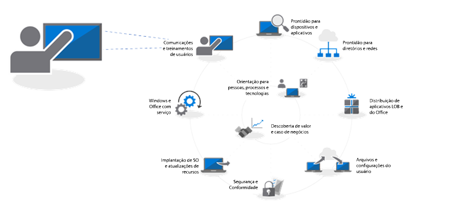
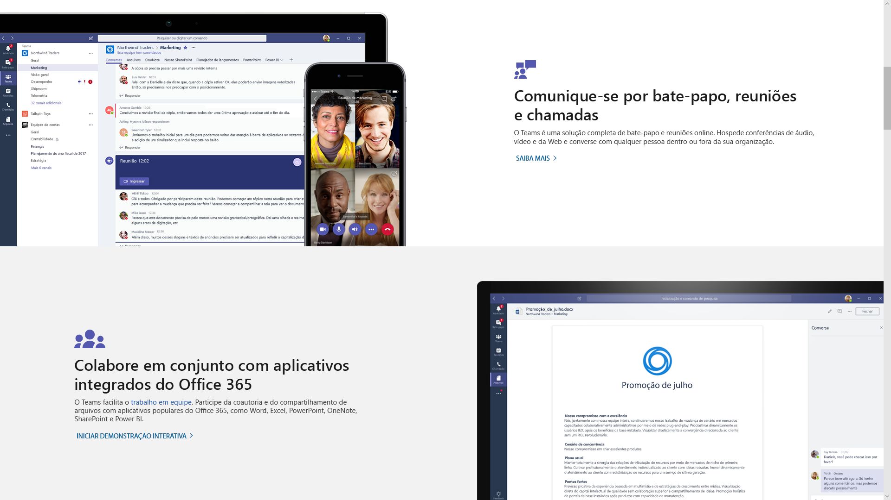
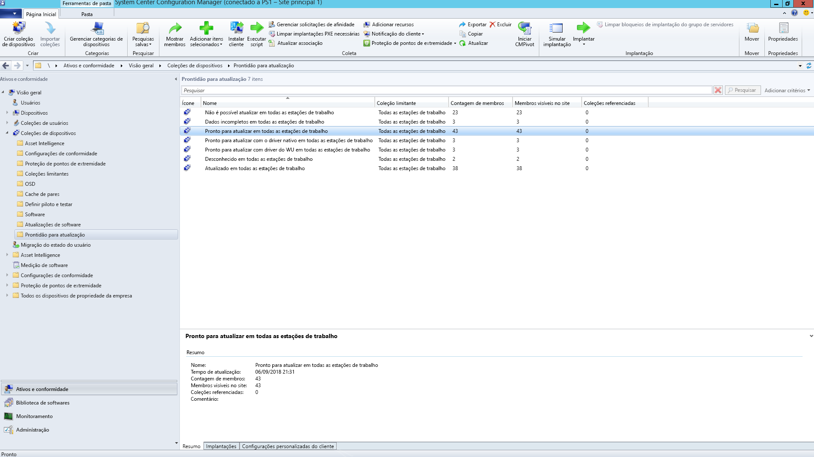
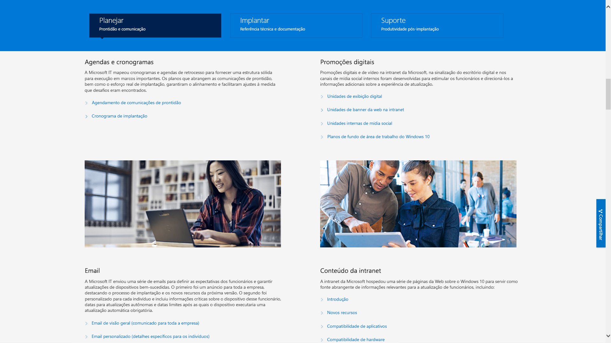

# Etapa 8: Treinamento e comunicações de usuários

<table>
<thead>
<td></td>
<td>
<strong>Etapa 8: Treinamento e comunicações de usuários</strong>

Certifique-se de que os usuários sejam informados sobre as novas experiências e novas maneiras de trabalhar à medida que você atualiza os computadores para o Windows 10 e o Office 365 ProPlus. Saiba como aproveitar a ajuda de adoção do usuário com o Microsoft FastTrack, materiais de treinamento e modelos de comunicação, bem como novas maneiras de monitorar o uso e a aceitação do usuário.
</td>
<td></td>
</thead>
</table>

>[!NOTE]
>O treinamento e as comunicações de usuários são a oitava etapa no nosso processo de implantação recomendado. São abordadas dicas e recomendações para informar e preparar os usuários. Para ver o processo completo de implantação de desktop, visite o [Centro de Implantação do Computador](https://aka.ms/HowToShift).
>

Informe e prepare seus usuários para as experiências de local de trabalho moderno abrangendo o Office 365, o Windows 10 e novos controles de conformidade e segurança com o Azure Active Directory é fundamental para melhorar a adoção. O truque aqui é descobrir como apresentar as atualizações, quando alguns usuários podem se preocupar com interrupções na produtividade ou alterações no fluxo de trabalho ou se precisam aprender algo novo.

A boa notícia é que, se você estiver migrando do Windows 7 e do Office 2010 ou do Office 2013, haverá várias pessoas familiarizadas com o Windows 10 e versões mais recentes do Office em execução nos dispositivos pessoais e tudo isso ajudará a reduzir o impacto da mudança.

## Como se preparar para novas experiências

Começando pelo Office, se você estiver implantando o Office 365 ProPlus pela primeira vez, será possível comunicar as vantagens de entrar nos aplicativos do Office e salvar arquivos nos locais do OneDrive ou SharePoint para facilitar o compartilhamento, reduzir a ramificação do arquivo e habilitar a coautoria em tempo real.

Os modelos detalhados de comunicação e treinamento estão disponíveis para esses e outros aplicativos locais ou baseados em navegador, como o Teams e o Planner.

Também fornecemos instruções para novos recursos no aplicativo como anexar arquivos vinculados do OneDrive no Outlook ou usar as novas transições de slides do Morph e recursos do Designer no PowerPoint.

Para o Windows 10, podemos ajudá-lo a familiarizar os usuários com recursos opcionais e padrão, como o Windows Hello, para entrar com segurança usando biometria, atualizações no menu Iniciar para personalizar sua experiência do Windows, Linha do Tempo para voltar com facilidade ao seu trabalho, a Cortana e muito mais.

Também são visíveis os controles de segurança e conformidade aos quais os usuários podem estar expostos. O Enterprise Mobility + Security, que é composto pelo Azure AD e pelo Microsoft Intune, integra recursos adicionais ao Windows 10 e o Office 365 que podem ser direcionados para o upgrade do computador.

[Microsoft Enterprise Mobility + Security](https://www.microsoft.com/en-us/cloud-platform/enterprise-mobility-security)

Por exemplo, se você já tiver habilitado a Autenticação Multifator, ela utilizará o Azure AD e protegerá o acesso do usuário a recursos aproveitando um aplicativo de telefone ou um PIN para usar os serviços com segurança. E a Proteção de Informações do Azure facilita para os usuários classificar e rotular documentos.

  [Configurar a autenticação multifator para usuários do Office 365](https://support.office.com/pt-BR/article/set-up-multi-factor-authentication-for-office-365-users-8f0454b2-f51a-4d9c-bcde-2c48e41621c6)

Estes são apenas alguns dos novos recursos que serão percebidos pelos seus usuários e alguns poderão pegá-los de surpresa, de uma maneira mais ou menos positiva. E essas surpresas, especialmente se alterarem o fluxo de trabalho normal, podem resultar em mais chamadas e tíquetes para você ou seu suporte técnico.

## Preparação proativa e implantações medidas

Para ajudar a minimizar o risco associado a alterações na experiência do usuário, recomendamos duas abordagens complementares:

  - A comunicação proativa com os seus usuários para que eles saibam o que esperar

  - O uso de anéis de implantação para controlar a taxa de implantação

### Implantação em fases

A implantação em fases usando anéis de implantação é o conceito de começar com grupos pequenos e, em seguida, ampliar a escala de implantação de maneira medida ao longo do tempo. Normalmente quando um plano de comunicações e treinamento é rascunhado, esses anéis e seus membros devem ser formados. Dessa forma, você pode reduzir o possível risco e validar sua abordagem enquanto continuamente abre válvula de implantação, ou pausa atividades se for necessário, por exemplo, quando começar a receber mais chamadas de assistência técnica do que o esperado.

Os anéis de implantação devem ser criados em conjunto com as unidades de negócios e seus gerentes. Você deverá considerar datas e horários críticos ao implantar ou fazer alterações. Sem um planejamento cuidadoso e a adoção dos participantes, será difícil conseguir que os usuários se integrem e fiquem à vontade com as mudanças.

### Fase 1: A equipe de TI e os usuários pioneiros 

É melhor começar sua implantação com a equipe de TI e os usuários pioneiros entusiasmados, que se voluntariam para acesso antecipado. Com esses participantes com "informações privilegiadas", você poderá testar suas comunicações, os impactos da mudança e a eficácia das suas comunicações e do treinamento. Durante essa fase, a TI executa pequenos pilotos, aprende técnicas de solução de problemas e automação para ajudá-lo durante fases de implantação mais amplas.

É importante envolver membros na fase piloto inicial, para garantir que eles documentem suas observações e impressões no processo. Além disso, é bom tê-representantes fora da equipe de TI que ajudam a estender a comunicação orgânica e boca a boca dos novos recursos e normalmente serão os primeiros com condições de dar suporte quando os usuários em fases posteriores precisarem de ajuda.

### Fase 2: Piloto 

Quando você estiver concluído a primeira fase, poderá direcionar um conjunto maior de usuários para a segunda, a fase piloto. Isso deve ser composto de uma combinação representativa de funções de usuário, tipos de dispositivo, aplicativos do Windows e suplementos do Office. Os dados retornados desses grupos serão usados por meio da análise para direcionar as ondas iniciais para a fase 3, a implantação mais ampla.

Lembre-se: todos os computadores nesta fase e em futuras fases devem estar conectados ao serviço de Análise, para que você possa coletar os dados de diagnóstico sobre a integridade do dispositivos e dos aplicativos, além de economizar largura de banda da otimização de entrega e o uso do logon do Windows Hello.

Para esta fase, é especialmente importante comunicar as alterações e ajudar os usuários a aproveitar os novos recursos. Os usuários geralmente podem não priorizar ou ignorar o email ou outras comunicações provenientes de TI. Sendo assim, ajuda marcar uma reunião com a equipe de gerência para comunicar a mudança e estimular a adoção de novas tecnologias e ferramentas.

Você também precisará das informações deles sobre cronogramas a serem evitados, a fim de minimizar a interrupção do usuário. Por exemplo, a equipe de Finanças pode ser especialmente sensível ao final de trimestres fiscais ou as equipes de desenvolvimento de produtos durante o lançamento de um produto.

Em paralelo ao planejamento para dispositivos, usuários, departamentos e momentos certos, você pode começar a criar seus planos de comunicação e treinamento, além de começar a compilar conteúdo ou envolver recursos externos para ajudar a treinar os usuários.

#### Microsoft FastTrack 

Para ajudar seu esforço em reunir conteúdo de treinamento, você pode acessar um conjunto abrangente de treinamentos cursos em vídeo com orientações passo a passo na biblioteca de produtividade do Microsoft FastTrack.

[Biblioteca de produtividade do Microsoft FastTrack](https://www.microsoft.com/en-us/microsoft-365/success/?rtc=2)

Há centenas de tópicos, com base no que é importante para sua organização, incluindo: criar conteúdo mais impactante, compartilhar sites e conteúdo, transformar o trabalho em equipe e desbloquear a produtividade com dispositivos modernos.

Além disso, se estiver usando o Microsoft 365 ou o Office 365, é grande a chance de você estar qualificado para obter ajuda para conduzir a adoção de usuários por meio do serviço FastTrack da Microsoft. Representantes orientam práticas recomendadas de adoção no processo de implementação do Microsoft 365: Windows, Office e EMS.

#### Demonstração da TI da Microsoft 

A série Demonstração de TI da Microsoft é outro recurso excelente para conteúdo relacionado a implantação do Windows 10. Ele inclui linhas do tempo e cronogramas, modelos promoção digital, modelos de email e conteúdo da Intranet. Eles são baseados em materiais usados para a própria implantação do Windows 10 da Microsoft e foi modificado para qualquer organização usar.

[Preparo da organização para uma implantação perfeita do Windows 10](https://www.microsoft.com/itshowcase/windows10deployment)

Esses componentes e serviços em conjunto podem ser ajustados durante a fase piloto. E quando você começar a perceber com o que seus usuários se identificam durante o treinamento, quais dispositivos abordar pelo Analytics e quais dispositivos ou grupos de usuários para evitar ou atrasar, você poderá começar a ampliar sua implantação em fases posteriores usando uma abordagem orientada para dados e para a experiência.

Com a expansão do piloto, convém documentar e publicar perguntas frequentes e conteúdo de autoatendimento para ajudar a reduzir proativamente os tíquetes de suporte e as atividades de assistência técnica.

### Fase 3 e além: Ampliar a implantação de produção 

Quando você alcançar as fases de implantação ampla, terá refinado seus processos, sua comunicação, seu treinamento e suas ferramentas de autoatendimento. Agora você pode usar os dados de diagnóstico coletados para direcionar cada vez mais computadores.

Implante a uma velocidade razoável para a capacidade do departamento de TI, suporte técnico, usuários e rede. Você sempre pode voltar para a etapa 2 no processo de implantação para otimizar sua rede ainda mais usando o cache de ponto a ponto, LEDBAT e outras técnicas para facilitar a transferência mais rápida de dados relacionados à implantação.

Além dos dados de diagnóstico monitorados por meio das ferramentas de análise, você também pode monitorar a utilização de serviços do Office 365 e do Microsoft 365 de maneira granular com relatórios de uso detalhados por carga de trabalho no centro de administração e usando os painéis de administração por meio do Power BI. Essas são excelentes ferramentas para ajudar a definir e acompanhar as metas à medida que você implementa novas ferramentas para trabalhar em conjunto, como o Microsoft Teams, ou novas formas de compartilhar arquivos, como o OneDrive.

A adoção e a aceitação de novas tecnologias são um processo contínuo que abrange cada computador em sua organização que tiver o Windows 10 e o Office 365 ProPlus instalado. E os usuários não necessariamente mudam o modo como funcionam, sem que você pare para informá-los e treiná-los nos novos recursos. Por fim, com os novos modelos de serviços fornecendo novos recursos em um cronograma semestral contínuo para Windows e, opcionalmente, um cronograma mensal do Office, a comunicação será contínua.

## Etapa anterior 

## [Etapa 7: Manutenção do Windows e do Office](https://aka.ms/mdd7)