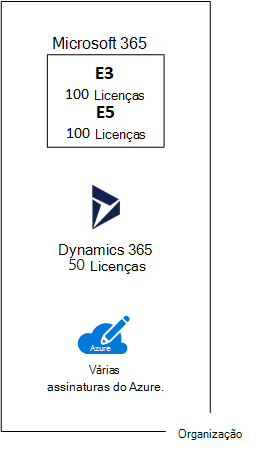

# Assinaturas, licenças, contas e locatários para ofertas de nuvem da Microsoft

A Microsoft fornece uma hierarquia de organizações, assinaturas, licenças e contas de usuário para o uso consistente de identidades e cobrança para todas as ofertas de nuvem:
  
- Microsoft 365 e Microsoft Office 365
- Microsoft Azure
- Microsoft Dynamics 365

## Elementos da hierarquia

Aqui estão os elementos da hierarquia:
  
### Organização

Uma organização representa uma entidade de negócios que usa ofertas de nuvem da Microsoft, geralmente identificadas por um ou mais nomes de domínio do Sistema de Nomes de Domínio (DNS), como contoso.com. A organização é um contêiner para assinaturas.
  
### Assinaturas

Uma assinatura é um contrato com a Microsoft para usar uma ou mais plataformas ou serviços de nuvem da Microsoft, para as quais as cobranças se acumulam com base em uma taxa de licença por usuário ou no consumo de recursos baseado na nuvem. 

- Os softwares da Microsoft, como ofertas de nuvem baseadas no Serviço (Saas) (Microsoft 365 e Dynamics 365), cobram taxas de licença por usuário. 
- As ofertas de nuvem de Plataforma como um Serviço (PaaS) e Infraestrutura como um Serviço (IaaS) da Microsoft (Azure) cobram com base no consumo de recursos na nuvem.
 
Você também pode usar uma assinatura de avaliação, mas a assinatura expira após um quantidade específica de horas ou tarifas de consumo. Você pode converter uma assinatura de avaliação para uma assinatura paga.
  
As organizações podem ter várias assinaturas para ofertas de nuvem da Microsoft. A Figura 1 mostra uma única organização que possui várias assinaturas do Microsoft 365, uma assinatura do Dynamics 365 e várias assinaturas do Azure.

**Figura 1: Exemplo de várias assinaturas de uma organização**

  
### Licenças

Para as ofertas de nuvem SaaS da Microsoft, uma licença permite que uma conta de usuário específica use os serviços da oferta na nuvem. Você será cobrado com uma taxa mensal fixa como parte da sua assinatura. Os administradores podem atribuir licenças a contas de usuários individuais na assinatura. Por exemplo, na Figura 2, a Contoso Corporation tem uma assinatura do Microsoft 365 E5 com 100 licenças, que permite até 100 contas de usuários individuais a usarem recursos e serviços do Microsoft 365 E5.
  
**Figura 2: Licenças em assinaturas SaaS para uma organização**

  
Para serviços de nuvem baseados em PaaS do Azure, as licenças de software são integradas ao preço do serviço.
  
Para máquinas virtuais baseadas em IaaS do Azure, talvez seja necessário ter licenças adicionais para usar o software ou aplicativo instalados em uma imagem de máquina virtual. Algumas imagens de máquinas virtuais têm versões licenciadas do software instalado e o custo é incluído na taxa por minuto para o servidor. Os exemplos são as imagens de máquinas virtuais do SQL Server 2014 e do SQL Server 2016. 
  
Algumas imagens de máquinas virtuais têm versões de avaliação de aplicativos instaladas e precisam de licenças adicionais de aplicativos de software para uso além do período de avaliação. Por exemplo, a imagem de máquina virtual de avaliação do SharePoint Server 2016 inclui uma versão de avaliação do SharePoint Server 2016 pré-instalada. Para continuar usando o SharePoint Server 2016 após a data de validade da avaliação, é necessário adquirir uma licença do SharePoint Server 2016 e licenças de cliente da Microsoft. Essas cobranças são separadas da assinatura do Azure e a taxa por minuto para executar a máquina virtual ainda se aplica.
  
### Contas de usuário

As contas de usuário para todas as ofertas de nuvem da Microsoft são armazenadas em um locatário do Azure Active Directory (Azure AD), que contém contas de usuários e grupos. Um locatário do Azure AD pode ser sincronizado com as contas de Serviços de Domínio Active Directory (AD DS) existentes usando o Azure AD Connect, um serviço baseado no Windows Server. Isso é conhecido como sincronização de diretório.
  
A Figura 3 mostra um exemplo de várias assinaturas de uma organização usando um locatário comum do Azure AD que contém as contas da organização.
  
**Figura 3: Várias assinaturas de uma organização que usam o mesmo locatário do Azure AD**

  
### Locatários

Para ofertas de nuvem SaaS, o local regional do locatário alojará os servidores que fornecem serviços de nuvem. Por exemplo, a Contoso Corporation escolheu a região Europeia para hospedar os locatários do Microsoft 365, EMS e Dynamics 365 para os 15.000 funcionários em sua sede em Paris.
  
Serviços de PaaS do Azure e as cargas de trabalho baseadas em máquina virtual hospedadas na infraestrutura como serviço do Azure podem ter locatários em qualquer datacenter do Azure do mundo. Especifique o datacenter do Azure, ou o local, ao criar o serviço ou o aplicativo de PaaS do Azure ou o elemento de uma carga de trabalho de IaaS.
  
Um locatário do Azure AD é uma instância específica do Azure AD contendo contas e grupos. As assinaturas pagas ou de avaliação do Microsoft 365 ou do Dynamics 365 incluem um locatário gratuito do Azure AD. Esse locatário do Azure AD não inclui outros serviços do Azure e não é o mesmo que uma assinatura de avaliação ou paga do Azure.
  
### Resumo da hierarquia

Veja aqui uma rápida recapitulação:
  
- Uma organização pode ter várias assinaturas
    
  - Uma assinatura pode ter várias licenças
    
  - As licenças podem ser atribuídas a contas de usuários individuais
    
  - As contas de usuário são armazenadas em um locatário do Azure AD
    
Aqui está um exemplo da relação das organizações, assinaturas, licenças e contas de usuários:
  
- Uma organização identificada pelo nome de domínio público.
    
  - Uma assinatura do Microsoft 365 E3 com licenças de usuário.
    
    Uma assinatura do Microsoft 365 E5 com licenças de usuário.
    
    Uma assinatura Dynamics 365 com licenças de usuário.
    
    Várias assinaturas do Azure.
    
  - Contas de usuários da organização em um locatário comum do Azure AD.
    
Várias assinaturas de oferta do Microsoft Cloud podem usar o mesmo locatário do Azure AD que atua como um provedor de identidade comum. Um locatário do Azure AD central que contém as contas sincronizadas de seu AD DS no local fornece identidade baseada em nuvem como um serviço (IDaaS) para sua organização. 
  
**Figura 4: IDaaS e contas locais sincronizadas para uma organização**

  
A Figura 4 mostra como um locatário comum do Azure AD é usado por ofertas em nuvem da Microsoft para SaaS, aplicativos PaaS do Azure e máquinas virtuais no IaaS do Azure que usam o Azure AD Domain Services. O Azure AD Connect sincroniza da floresta do AD DS local com o locatário do Azure AD.
  
## Combinar as assinaturas de várias ofertas de nuvem da Microsoft

A tabela a seguir descreve como você pode combinar várias ofertas da nuvem da Microsoft com base em assinaturas que você já tenha para um tipo de oferta da nuvem (os rótulos que estão na primeira coluna) e como adicionar uma assinatura em uma oferta diferente da nuvem (que está em várias colunas).
  
||**Microsoft 365**|**Azure**|**Dynamics 365**|
|:-----|:-----|:-----|:-----|:-----|
|**Microsoft 365**   |NA    |Adicione uma assinatura do Azure na sua organização no portal do Azure.    |Adicionar uma assinatura do Dynamics 365 para sua organização no centro de administração do Microsoft 365.    |
|**Azure**   |Adicione uma assinatura do Microsoft 365 à sua organização.    |NA    |Adicione uma assinatura do Dynamics 365 para sua organização.    |
|**Dynamics 365**   |Adicione uma assinatura do Microsoft 365 à sua organização.    |Adicione uma assinatura do Azure na sua organização no portal do Azure.    |NA    |
   
Uma maneira fácil de adicionar assinaturas de serviços baseados em SaaS da Microsoft para sua organização é por meio do centro de administração:
  
1. Entre no centro de administração do Microsoft 365 ([https://admin.microsoft.com](https://admin.microsoft.com)) com sua conta de administrador global.
    
2. Na navegação à esquerda da página inicial do **centro de administração **, clique em **Cobrança**e depois em **Serviços de compra**.
    
3. Na página **Serviços de compra**, compre as novas assinaturas.
    
O centro de administração atribui a organização e o locatário do Azure AD da sua assinatura Microsoft 365 para as novas assinaturas das ofertas de nuvem baseadas em SaaS.
  
Para adicionar uma assinatura do Azure com a mesma organização e locatário do Azure AD à sua assinatura do Microsoft 365:
  
1. Entre no portal do Azure ([https://portal.azure.com](https://portal.azure.com)) com sua conta de administrador global do Microsoft 365.
    
2. Na navegação à esquerda, clique em **Assinaturas** e depois em **Adicionar**.
    
3. Na página **Adicionar assinatura**, selecione uma oferta e complete as informações de pagamento e o contrato.
    
Se você tiver comprado separadamente as assinaturas do Azure e do Microsoft 365 e deseja acessar o locatário Azure AD do Microsoft 365 a partir da sua assinatura do Azure, confira as instruções em [Adicionar uma assinatura do Azure ao seu locatário do Azure Active Directory](https://docs.microsoft.com/azure/active-directory/fundamentals/active-directory-how-subscriptions-associated-directory).
 
## Confira também

[Microsoft cloud para ilustrações de arquitetos de empresas](../solutions/cloud-architecture-models.md)
  
[Modelos de arquitetura para SharePoint, Exchange, Skype for Business e Lync](architectural-models-for-sharepoint-exchange-skype-for-business-and-lync.md)
  
[Soluções híbridas](hybrid-solutions.md)

## Próxima etapa

[Avaliando a conectividade de rede do Microsoft 365](assessing-network-connectivity.md)
  
