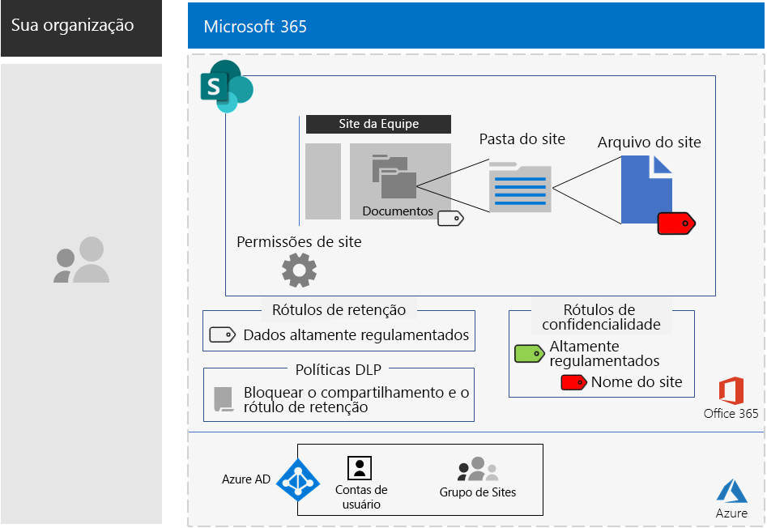

# Sites do SharePoint para dados altamente regulamentadosSharePoint sites for highly regulated data

*Este cenário aplica-se às versões E3 e E5 do Microsoft 365 Enterprise**This scenario applies to both the E3 and E5 versions of Microsoft 365 Enterprise*

O Microsoft 365 Enterprise inclui um conjunto completo de serviços baseados em nuvem, para que você possa criar, armazenar, proteger e gerenciar seus dados altamente regulamentados armazenados em arquivos. Isso inclui dados que são:Microsoft 365 Enterprise includes a full suite of cloud-based services so that you can create, store, secure, and manage your highly regulated data stored in files. This includes data that is:

- Sujeitos a regulamentações regionais.Subject to regional regulations.
- Mais importantes de sua organização, como segredos comerciais, financeiros ou informações de recursos humanos e estratégias da organização.The most valuable data for your organization, such as trade secrets, financial or human resources information, and organization strategy.

>[!Note]
> Um cenário semelhante usando o Microsoft Teams esta [aqui](secure-teams-highly-regulated-data-scenario.md).A similar scenario using Microsoft Teams is [here](secure-teams-highly-regulated-data-scenario.md).
>

Um cenário da Microsoft 365 Enterprise baseada na nuvem, que atende a essa necessidade comercial, requer que você:A Microsoft 365 Enterprise cloud-based scenario that meets this business need requires that you:

- Armazene arquivos (documentos, apresentações de slides, planilhas, etc.) em um site de equipe do SharePoint.Store files (documents, slide decks, spreadsheets, etc.) in a SharePoint team site.
- Bloqueie o site para impedir:Lock down the site to prevent:
  - Acesso a usuários que não são membros do grupo do Microsoft 365 para o site.Access to users who are not members of the Microsoft 365 group for the site.
  - Que membros do site concedam acesso a outras pessoas.Members of the site from granting access to others.
  - Que aqueles que não sejam membros do site solicitem acesso a ele.Non-members of the site from requesting access to the site.
- Configure um rótulo de retenção para seus sites do SharePoint como uma maneira padrão de impedir que os usuários enviem arquivos para fora da organização.Configure a retention label for your SharePoint sites as a default way to block users from sending files outside the organization.
- Criptografe os arquivos mais confidenciais do site com criptografia que acompanha o arquivo.Encrypt the most sensitive files of the site with encryption that travels with the file.
- Adicione permissões aos arquivos mais confidenciais para que, mesmo que sejam compartilhados fora do site, a abertura do arquivo ainda exija as credenciais válidas de uma conta de usuário que tenha a permissão.Add permissions to the most sensitive files so that if even if they get shared outside of the site, opening the file still requires the valid credentials of a user account that has permission.

A tabela a seguir mapeia os requisitos desse cenário para um recurso do Microsoft 365 Enterprise.The following table maps the requirements of this scenario to a feature of Microsoft 365 Enterprise.

|||
|:-------|:-----|
| **Requisito****Requirement** | **Recurso do Microsoft 365 Enterprise****Microsoft 365 Enterprise feature** |
| Armazenar arquivos Store files | Sites de equipe do SharePointSharePoint team sites |
| Bloquear o siteLock down the site | Grupos do Microsoft 365 e permissões de site de equipe do SharePointMicrosoft 365 groups and SharePoint team site permissions |
| Rotular os arquivos do siteLabel the files of the site | Rótulos de retenção do Microsoft 365Microsoft 365 retention labels |
| Bloquear usuários ao enviar arquivos para fora da organização.Block users when sending files outside the organization | Políticas de Prevenção contra Perda de Dados (DLP)Data Loss Prevention (DLP) policies |
| Criptografar todos os arquivos do siteEncrypt all of the files of the site | Rótulos ou sub-rótulos de confidencialidade do Microsoft 365Microsoft 365 sensitivity labels or sublabels |
| Adicionar permissões aos arquivos do siteAdd permissions to the files of the site | Rótulos ou sub-rótulos de confidencialidade do Microsoft 365Microsoft 365 sensitivity labels or sublabels |
|||

Aqui está um exemplo de configuração para um site do SharePoint seguro.Here is an example configuration for a secure SharePoint site.

Este cenário exige que você já tenha implantado:This scenario requires that you have already deployed:

- A fase de [identidade](identity-infrastructure.md) e as etapas 1 e 2 da fase de [proteção de informações](infoprotect-infrastructure.md) da infraestrutura de base.The [Identity](identity-infrastructure.md) phase and steps 1 and 2 of the [Information protection](infoprotect-infrastructure.md) phase of the foundation infrastructure. 
- [SharePoint](sharepoint-online-onedrive-workload.md).[SharePoint](sharepoint-online-onedrive-workload.md).

As fases a seguir o ajudarão a projetar, configurar e direcionar a adoção de sites do SharePoint para dados altamente regulamentados.The following phases step you through designing, configuring, and driving adoption for SharePoint sites for highly regulated data.

 Confira um resumo de uma página desse cenário no [pôster de sites do SharePoint para dados altamente regulamentados](../media/teams-sharepoint-online-sites-highly-regulated-data/SharePointSitesHighlyRegulatedData.pdf).For a 1-page summary of this scenario, see the [SharePoint sites for highly regulated data poster](../media/teams-sharepoint-online-sites-highly-regulated-data/SharePointSitesHighlyRegulatedData.pdf).

Você também pode baixar este pôster nos formatos [PDF](https://github.com/MicrosoftDocs/microsoft-365-docs/raw/public/microsoft-365/media/teams-sharepoint-online-sites-highly-regulated-data/SharePointSitesHighlyRegulatedData.pdf) ou [PowerPoint](https://github.com/MicrosoftDocs/microsoft-365-docs/raw/public/microsoft-365/media/teams-sharepoint-online-sites-highly-regulated-data/SharePoint-Sites-Highly-Regulated-Data.pptx) e imprimir em papel carta, oficial ou tabloide (11 x 17).You can also download this poster in [PDF](https://github.com/MicrosoftDocs/microsoft-365-docs/raw/public/microsoft-365/media/teams-sharepoint-online-sites-highly-regulated-data/SharePointSitesHighlyRegulatedData.pdf) or [PowerPoint](https://github.com/MicrosoftDocs/microsoft-365-docs/raw/public/microsoft-365/media/teams-sharepoint-online-sites-highly-regulated-data/SharePoint-Sites-Highly-Regulated-Data.pptx) formats and print it on letter, legal, or tabloid (11 x 17)-sized paper.

## Pré-requisitos de acesso ao dispositivo e identidadeIdentity and device access prerequisites

Para proteger o acesso ao site do SharePoint, assegure-se de ter configurado [políticas de identidade e de acesso ao dispositivo](identity-access-policies.md) e as [políticas de acesso recomendadas do SharePoint](sharepoint-file-access-policies.md).To protect access to the SharePoint site, ensure that you have configured [identity and device access policies](identity-access-policies.md) and the [recommended SharePoint access policies](sharepoint-file-access-policies.md).

## Fase 1: DesignPhase 1: Design

Para criar um site do SharePoint para dados altamente regulamentados, você deve primeiro identificar sua finalidade.To create a SharePoint site for highly regulated data, you must first identify its purpose. Por exemplo, o departamento de pesquisa e desenvolvimento de uma organização de manufatura precisa de um site do SharePoint para armazenar especificações de design atuais de produtos existentes e um local para colaborar em novos produtos.For example, the research and development department of a manufacturing organization needs a SharePoint site to store current design specifications for existing products and a place to collaborate on new products. Somente os membros do departamento de Pesquisa e Desenvolvimento e os executivos selecionados terão permissão para acessar o site.Only members of the Research & Development department and selected executives will be allowed to access the site.

Essa finalidade gerará a determinação de itens essenciais de configuração como:That purpose will drive the determination of essential configuration items such as:

- O rótulo de retenção para atribuir à parte Documentos do site e às políticas DLP para o rótuloThe retention label to assign to the Documents portion of the site and DLP policies for the label
- As configurações de um sub-rótulo de confidencialidade que os usuários aplicam a arquivos altamente confidenciais armazenados no siteThe settings of a sensitivity sublabel that users apply to highly sensitive files stored in the site

Quando determinado, você usa essas configurações para configurar o site na Fase 2.Once determined, you use these settings to configure the site in Phase 2. 

### Etapa 1 rótulos de retenção do Microsoft 365 e políticas DLPStep 1 Microsoft 365 retention labels and DLP policies

Quando aplicada à parte Documentos de um site de equipe do SharePoint, os rótulos de retenção fornecem um método padrão de classificação de todos os arquivos armazenados no site.When applied to the Documents portion of a SharePoint team site, retention labels provide a default method of classifying all files stored on the site.
 
Nos sites do SharePoint para dados altamente controlados, você precisa determinar qual rótulo de retenção será usado.For SharePoint sites for highly regulated data, you need to determine which retention label to use.

Para considerações de design dos rótulos, confira [Rótulos e classificação do Microsoft 365](https://docs.microsoft.com/office365/securitycompliance/secure-sharepoint-online-sites-and-files#office-365-retention-labels).For the design considerations of labels, see [Microsoft 365 classification and labels](https://docs.microsoft.com/office365/securitycompliance/secure-sharepoint-online-sites-and-files#office-365-retention-labels).

Para proteger informações confidenciais e evitar a divulgação acidental ou intencional, use as políticas DLP. Para obter mais informações, consulte esta [visão geral](https://docs.microsoft.com/office365/securitycompliance/data-loss-prevention-policies).To protect sensitive information and prevent its accidental or intentional disclosure, you use DLP policies. For more information, see this [overview](https://docs.microsoft.com/office365/securitycompliance/data-loss-prevention-policies).

Para sites do SharePoint, você deve configurar uma política DLP do rótulo de retenção atribuído ao site para bloquear usuários quando eles tentarem compartilhar arquivos com usuários externos.For SharePoint sites, you must configure a DLP policy for the retention label assigned to the site to block users when they attempt to share files with external users. 

### Etapa 2: seu sub-rótulo de confidencialidade do Microsoft 365Step 2: Your Microsoft 365 sensitivity sublabel

Para fornecer criptografia e um conjunto de permissões aos seus arquivos mais confidenciais, os usuários devem aplicar um rótulo ou sub-rótulo de confidencialidade.To provide encryption and a set of permissions to your most sensitive files, users must apply a sensitivity label or sublabel. Existe uma sub-rótulo em um rótulo existente.A sublabel exists under an existing label. 

Use um rótulo de confidencialidade quando precisar de um pequeno número de rótulos para de uso global e equipes privadas individuais.Use a sensitivity label when you need is a small number of labels for both global use and individual private teams. Use um sub-rótulo de confidencialidade quando você tiver um grande número de rótulos ou quiser organizar rótulos para sites seguros em seu rótulo altamente regulamentado.Use a sensitivity sublabel when you have a large number of labels or want to organize labels for secure sites the under your highly regulated label. 

As configurações do rótulo ou sub-rótulo aplicado acompanham o arquivo.The settings of the applied label or sublabel travel with the file. Mesmo que ele tenha sido vazado fora do site, somente as contas de usuário autenticado que têm permissões poderão abri-lo.Even if it is leaked outside the site, only authenticated user accounts that have permissions can open it.

### Resultados de designDesign results

Você determinou o seguinte:You have determined the following:

- O rótulo de retenção apropriado e a política DLP que está associada ao rótuloThe appropriate retention label and the DLP policy that is associated with the label
- As configurações do sub-rótulo de confidencialidade que incluem criptografia e permissõesThe settings of the sensitivity sublabel that include encryption and permissions

## Fase 2: ConfigurarPhase 2: Configure

Nesta fase, você usa as configurações determinadas na Fase 1 e as implementa para criar um site do SharePoint para dados altamente regulamentados.In this phase, you take the settings determined in Phase 1 and implement them to create a SharePoint site for highly regulated data.

### Etapa 1: criar um site de equipe do SharePoint privado com proprietários e membros do grupo do Microsoft 365 correspondenteStep 1: Create a private SharePoint team site with owners and members of the corresponding Microsoft 365 group

Siga [essas instruções]( https://support.office.com/article/create-a-site-in-sharepoint-online-4d1e11bf-8ddc-499d-b889-2b48d10b1ce8) para criar um site de equipe do SharePoint privado.Follow [these instructions]( https://support.office.com/article/create-a-site-in-sharepoint-online-4d1e11bf-8ddc-499d-b889-2b48d10b1ce8) to create a private SharePoint team site.

### Etapa 2: Configurar permissões adicionais para o site de equipe do SharePointStep 2: Configure additional permissions settings for the SharePoint team site

No site do SharePoint, defina estas configurações de permissão.From the SharePoint site, configure these permission settings.

1. Na barra de ferramentas, clique no ícone Configurações e, em seguida, clique em **Permissões do site**.In the tool bar, click the settings icon, and then click **Site permissions**.
2. No painel **Permissões do site**, em **Configurações de Compartilhamento**, clique em **Alterar configurações de compartilhamento**.In the **Site permissions** pane, under **Sharing Settings**, click **Change sharing settings**.
3. Em **Permissões de compartilhamento**, **Somente proprietários do site podem compartilhar arquivos, pastas e o site**.Under **Sharing permissions**, choose **Only site owners can share files, folders, and the site**.
4. Desative **Permitir solicitações de acesso** e clique em **Salvar**.Turn off **Allow access requests**, and then click **Save**.

Com essas configurações, a capacidade de membros do grupo de sites compartilharem o site com outros membros ou de não membros solicitarem acesso ao site é desativada.With these settings, the ability for site group members to share the site with other members or for non-members to request access to the site is disabled.

### Etapa 3: configurar o site para um rótulo de retençãoStep 3: Configure the site for a retention label

Use as instruções em [Proteger arquivos do SharePoint com rótulos e DLP](https://docs.microsoft.com/office365/enterprise/protect-sharepoint-online-files-with-office-365-labels-and-dlp) para:Use the instructions in [Protect SharePoint files with labels and DLP](https://docs.microsoft.com/office365/enterprise/protect-sharepoint-online-files-with-office-365-labels-and-dlp) to:

1. Crie e publique um rótulo de retenção para dados altamente regulamentados (se necessário).Create and publish a retention label for highly regulated data (if needed).
2. Configure o site para o rótulo de retenção criado na etapa 1.Configure the site for the retention label created in step 1.
3. Crie uma política DLP para dados altamente regulamentados que usam o rótulo de retenção criado na etapa 2 e impede que os usuários enviem arquivos fora da organizaçãoCreate a DLP policy for highly regulated data that uses the retention label created in step 2 and blocks users from sending files outside the organization

#### Etapa 4: criar um sub-rótulo de confidencialidade para o siteStep 4: Create a sensitivity sublabel for the site

Ao contrário de um rótulo de confidencialidade para dados altamente regulamentados que qualquer pessoa pode aplicar a qualquer arquivo, um site seguro precisa de seu próprio sub-rótulo, para que os arquivos com o sub-rótulo atribuído:Unlike a sensitivity label for highly regulated data that anyone can apply to any file, a secure site needs its own sublabel so that files with the sublabel assigned:

- São criptografadas e a criptografia acompanha o arquivo.Are encrypted and the encryption travels with the file.
- Contenham permissões personalizadas para que somente os membros do grupo de sites possam abri-lo.Contain custom permissions so that only members of the site group can open it.

Para atingir esse nível adicional de segurança para os arquivos armazenados no site, você deve configurar um novo rótulo de confidencialidade ou um sub-rótulo do rótulo geral para arquivos altamente regulamentados.To accomplish this additional level of security for files stored in the site, you must configure a new sensitivity label or a sublabel of the general label for highly regulated files. Somente os membros do grupo do site poderão vê-lo na lista de sub-rótulos do rótulo altamente regulamentado.Only group members for the site will see it in the list of sublabels for the highly regulated label.

Use as instruções [aqui](https://docs.microsoft.com/microsoft-365/compliance/encryption-sensitivity-labels) para configurar um rótulo ou um sub-rótulo do rótulo que você está usando para arquivos altamente regulamentados com as seguintes configurações:Use the instructions [here](https://docs.microsoft.com/microsoft-365/compliance/encryption-sensitivity-labels) to configure a label or a sublabel of the label you are using for highly regulated files with the following settings:

- O nome do rótulo ou sub-rótulo contém o nome do site para facilitar a associação ao atribuir o rótulo ou o sub-rótulo a um arquivo.The name of the label or sublabel contains the name of the site for easy association when assigning the label or sublabel to a file.
- A criptografia está ativada.Encryption is enabled.
- O grupo de sites tem permissões de Coautoria.The site group has Co-Author permissions.

### Resultados da configuraçãoConfiguration results

Você configurou o seguinte:You have configured the following:

- Configurações de permissão mais restritivas no site do SharePointMore restrictive permission settings on the SharePoint site
- Um rótulo de retenção atribuído à parte Documentos do site do SharePointA retention label assigned to the Documents portion of the SharePoint site
- Uma política DLP para o rótulo de retençãoA DLP policy for the retention label
- Um rótulo ou sub-rótulo de confidencialidade que os usuários podem aplicar aos arquivos mais confidenciais armazenados no site, que criptografam o arquivo e permitem apenas o acesso de coautor aos membros do grupo do site de equipeA sensitivity label or sublabel that users can apply to the most sensitive files stored in the site, which encrypts the file and only allows Co-Author access for members of the team site group 

Aqui está a configuração resultante que usa um sub-rótulo do rótulo altamente regulamentado.Here is the resulting configuration that uses a sublabel of the Highly regulated label.

Aqui está um exemplo de usuário que aplicou o sub-rótulo em um arquivo armazenado no site.Here is an example of a user that has applied the sublabel to a file stored in the site.

## Fase 3: Gerar adoção do usuárioPhase 3: Drive user adoption

Um site do SharePoint para dados altamente regulamentados só poderá proteger os dados se for usado de maneira consistente para o armazenamento e o acesso a arquivos confidenciais.A SharePoint site for highly regulated data can only protect that data if it is consistently used for storage and access of sensitive files. Esta é a fase mais difícil porque depende dos usuários de mudar seus hábitos e preferências.This is the hardest phase because it relies on users changing their habits and preferences. 

Por exemplo, os funcionários que estão acostumados a armazenar arquivos confidenciais em unidades USB ou em soluções de armazenamento pessoal baseadas em nuvem agora precisam armazená-los exclusivamente em um site do SharePoint para obter dados altamente regulamentados.For example, employees that are used to storing sensitive files on USB drives or on personal cloud-based storage solutions will now have to store them exclusively in a SharePoint site for highly regulated data.

### Etapa 1: treinar os usuáriosStep 1: Train your users

Depois de concluir sua configuração, treine o conjunto de usuários que são membros do site:After completing your configuration, train the set of users who are members of the site:

- Sobre a importância de usar o novo site para proteger arquivos valiosos e as consequências de um vazamento de dados altamente regulamentados, como ramificações legais, multas regulatórias, ransomware ou perda de vantagem competitiva.On the importance of using the new site to protect valuable files and the consequences of a highly regulated data leak, such as legal ramifications, regulatory fines, ransomware, or loss of competitive advantage.
- Como acessar o site e seus arquivos.How to access the site and its files.
- Como criar novos arquivos no site e carregar novos arquivos armazenados localmente.How to create new files on the site and upload new files stored locally.
- Como a política DLP bloqueia o compartilhamento de arquivos externamente por parte do usuário.How the DLP policy blocks them from sharing files externally.
- Como rotular os arquivos mais sensíveis com o rótulo ou sub-rótulo do site.How to label the most sensitive files with the label or sublabel for the site.
- Como o rótulo ou o sub-rótulo protege um arquivo, mesmo quando vazado do site.How the label or sublabel protects a file even when it is leaked off the site.

Este treinamento deve incluir exercícios práticos para que os usuários possam experimentar essas operações e os resultados.This training should include hands-on exercises so that the users can experience these operations and their results.

### Etapa 2: conduzir análises periódicas de utilização e arquivosStep 2: Conduct periodic reviews of usage and files

Nas semanas após o treinamento, o administrador do SharePoint para o site do SharePoint pode:In the weeks after training, the SharePoint administrator for the SharePoint site can:

- Analisar o uso do site e compará-lo a expectativas de uso.Analyze usage for the site and compare it with usage expectations.
- Verificar se os arquivos altamente confidenciais foram rotulados corretamente com o rótulo ou o sub-rótulo de confidencialidade.Verify that highly sensitive files have been properly labeled with the sensitivity label or sublabel.

  Você pode ver quais arquivos têm um rótulo atribuído exibindo uma pasta no SharePoint Online e adicionando a coluna **Confidencialidade**através da opção **Mostrar/ocultar colunas** em **Adicionar coluna**.You can see which files have a label assigned by viewing a folder in SharePoint and adding the **Sensitivity** column through the **Show/hide columns** option of **Add column**.

Repita o treinamento dos usuários conforme necessário.Retrain your users as needed.

### Resultados de adoção do usuárioUser adoption results

Arquivos altamente regulamentados são armazenados exclusivamente em sites do SharePoint para dados altamente regulamentados e os arquivos mais confidenciais possuem o rótulo ou sub-rótulo de confidencialidade do site aplicado.Highly regulated files are stored exclusively on SharePoint sites for highly regulated data and the most sensitive files have the sensitivity label or sublabel for the site applied.

## Como a Contoso Corporation usou um site do SharePoint para dados altamente regulamentadosHow the Contoso Corporation used a SharePoint site for highly regulated data

A Contoso Corporation é um conglomerado de fabricação global fictício, mas representativo.The Contoso Corporation is a fictional but representative global manufacturing conglomerate. Veja como Contoso projetou, configurou e, em seguida, orientou a adoção de um [site do SharePoint seguro](contoso-sharepoint-online-site-for-highly-confidential-assets.md) para suas equipes de pesquisa em Paris, Moscou, Nova York, Pequim e Bengaluru (Bangalore).See how Contoso designed, configured, and then drove the adoption of a [secure SharePoint site](contoso-sharepoint-online-site-for-highly-confidential-assets.md) for their research teams in Paris, Moscow, New York, Beijing, and Bangalore. 

## Confira tambémSee also

[Microsoft Teams para dados altamente regulamentadosTeams for highly regulated data](secure-teams-highly-regulated-data-scenario.md)

[Cargas de trabalho e cenários do Microsoft 365 EnterpriseMicrosoft 365 Enterprise workloads and scenarios](deploy-workloads.md)

[Biblioteca de produtividade do Microsoft 365](https://aka.ms/productivitylibrary) (https://aka.ms/productivitylibrary)[Microsoft 365 Productivity Library](https://aka.ms/productivitylibrary) (https://aka.ms/productivitylibrary)

[Guia de implantaçãoDeployment guide](deploy-microsoft-365-enterprise.md)
